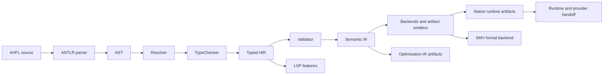

<p align="center">
  <h1 align="center">AHFL</h1>
  <p align="center">
    <strong>A typed DSL and C++23 compiler for auditable agent workflows</strong>
  </p>
  <p align="center">
    <a href="https://github.com/Zzzode/AHFL/actions/workflows/ci.yml"></a>
    
    
  </p>
  <p align="center">
    <a href="README.zh.md">Chinese README</a>
    ·
    <a href="docs/README.md">Documentation Index</a>
    ·
    <a href="docs/reference/cli-commands.zh.md">CLI Reference</a>
  </p>
</p>

AHFL (Agent Handoff Flow Language) is a strongly typed DSL for modeling agent state machines, behavioral contracts, workflow DAGs, runtime handoff artifacts, and formal verification boundaries before agent execution.

The repository contains the language grammar, a C++23 compiler (`ahflc`), runtime-adjacent artifact builders, a local execution path, an LSP server, and a VS Code extension package workflow.

## Project Status

AHFL is active compiler and tooling development. Breaking changes are allowed when they improve the language or compiler architecture; see the [migration policy](docs/reference/migration-policy.zh.md).

Current baseline:

- C++23 compiler pipeline: parse, resolve, typecheck, validate, lower to IR, emit artifacts.
- Project-aware compilation with module/source graph support.
- Runtime-adjacent artifact chain for native package handoff, execution plans, sessions, journals, replay, audit, scheduler, checkpoint, persistence, export, and store import.
- Formal verification output for NuSMV/nuXmv-oriented workflows.
- LSP server plus VS Code extension packaging with bundled release LSP binaries.
- 900+ CTest-registered regression, unit, integration, and benchmark tests.

## What AHFL Is For

| Use case | What AHFL provides |
| --- | --- |
| Agent workflow modeling | Explicit agents, states, transitions, capabilities, and workflows. |
| Static safety checks | Strongly typed schemas, expressions, contracts, and workflow dependencies. |
| Runtime handoff | Machine-readable native/runtime artifacts instead of ad hoc scripts. |
| Review and audit | Structured summaries, replay views, audit reports, and release evidence artifacts. |
| Formal verification | SMV backend for safety/liveness model-checking workflows. |
| IDE integration | Language server diagnostics, hover, completion, definition, references, and rename support. |

## Language Preview

Excerpt from [examples/refund_audit_core_v0_1.ahfl](examples/refund_audit_core_v0_1.ahfl):

```ahfl
agent RefundAudit {
    input: RefundRequest;
    context: RefundContext;
    output: RefundDecision;
    states: [Init, Auditing, Approved, Rejected, Terminated];
    initial: Init;
    final: [Terminated];
    capabilities: [OrderQuery, AuditDecision, TicketCreate];

    transition Init -> Auditing;
    transition Auditing -> Approved;
    transition Auditing -> Rejected;
    transition Approved -> Terminated;
    transition Rejected -> Terminated;
}

contract for RefundAudit {
    requires: order_exists(input.order_id);
    ensures: non_empty(output.reason);
    invariant: always not called(RefundExecute);
}

workflow RefundAuditWorkflow {
    input: RefundRequest;
    output: RefundDecision;
    node audit: RefundAudit(input);
    liveness: eventually completed(audit, Terminated);
    return: audit;
}
```

## Quick Start

### Prerequisites

| Tool | Requirement |
| --- | --- |
| C++ compiler | C++23 support. GCC 13+, Clang 17+, or Apple Clang 15+ recommended. |
| CMake | 3.22+ |
| Ninja | Recommended generator used by the presets. |
| NuSMV / nuXmv | Optional, only needed for external model checking. |
| Node.js | Optional, only needed for VS Code extension development or packaging. |

### Build from source

```bash
git clone https://github.com/Zzzode/AHFL.git
cd AHFL

cmake --preset dev
cmake --build --preset build-dev
```

### Run the compiler

```bash
# Type-check a source file.
./build/dev/src/tooling/cli/ahflc check examples/refund_audit_core_v0_1.ahfl

# Emit a human-readable compiler summary.
./build/dev/src/tooling/cli/ahflc emit summary examples/refund_audit_core_v0_1.ahfl

# Emit machine-readable Semantic IR.
./build/dev/src/tooling/cli/ahflc emit ir-json examples/refund_audit_core_v0_1.ahfl

# Inspect all commands and artifacts.
./build/dev/src/tooling/cli/ahflc --help
```

Runtime execution uses `ahflc run` and requires workflow input plus configured capabilities or provider fixtures. Start with the [execution guide](docs/reference/user-guide-execution.zh.md) before running provider-backed workflows.

## Architecture



The normal backend contract is Semantic IR. Opt IR is an explicit diagnostic artifact, not the default input for backend emission or LSP state.

## Repository Layout

```text
grammar/              ANTLR grammar
include/ahfl/         Public compiler headers
src/base/             Shared support, JSON, and validation utilities
src/compiler/         Syntax, semantics, IR, passes, handoff, and backends
src/pipeline/         Runtime-adjacent artifact models and builders
src/runtime/          Local evaluator, workflow engine, and providers
src/tooling/          CLI, LSP, DAP, formatter, package, profiling, and test tooling
tests/                Unit, golden, integration, and benchmark tests
tools/vscode/         VS Code extension client and packaging workflow
docs/                 Specs, design notes, plans, and reference documentation
examples/             Example AHFL programs
```

## Documentation

| Topic | Entry point |
| --- | --- |
| Documentation index | [docs/README.md](docs/README.md) |
| User guide | [docs/reference/user-guide-overview.zh.md](docs/reference/user-guide-overview.zh.md) |
| Language specification | [docs/spec/core-language.zh.md](docs/spec/core-language.zh.md) |
| CLI reference | [docs/reference/cli-commands.zh.md](docs/reference/cli-commands.zh.md) |
| IR format | [docs/reference/ir-format.zh.md](docs/reference/ir-format.zh.md) |
| Project and workspace usage | [docs/reference/project-usage.zh.md](docs/reference/project-usage.zh.md) |
| Native/runtime artifacts | [docs/reference/native-runtime-artifacts.zh.md](docs/reference/native-runtime-artifacts.zh.md) |
| Durable store import pipeline | [docs/reference/durable-store-import-reference.zh.md](docs/reference/durable-store-import-reference.zh.md) |
| VS Code LSP extension | [docs/reference/lsp-vscode-extension.zh.md](docs/reference/lsp-vscode-extension.zh.md) |
| Contributor guide | [docs/reference/contributor-guide.zh.md](docs/reference/contributor-guide.zh.md) |

## VS Code and LSP

Build the LSP server during the normal CMake build:

```bash
cmake --build --preset build-dev --target ahfl-lsp
```

Package a user-facing platform VSIX with a bundled release LSP:

```bash
scripts/package-vscode-vsix-release.sh
code --install-extension tools/vscode/dist/ahfl-language-<version>-<target>.vsix
```

See [docs/reference/lsp-vscode-extension.zh.md](docs/reference/lsp-vscode-extension.zh.md) for development, packaging, and Marketplace release details.

## Development

```bash
# Build variants
cmake --preset dev
cmake --preset release
cmake --preset asan
cmake --preset tsan

# Build and test
cmake --build --preset build-dev
ctest --preset test-dev --output-on-failure

# Formatting
cmake --build --preset build-format
cmake --build --preset build-format-check

# Documentation sync gate
python3 scripts/check-ir-doc-sync.py
ctest --preset test-dev --output-on-failure -R '^ahfl\.docs\.ir_sync_gate$'
```

Parser regeneration is explicit and uses the locked ANTLR toolchain:

```bash
ANTLR_JAR=/path/to/antlr-4.13.1-complete.jar ./scripts/regenerate-parser.sh
ANTLR_JAR=/path/to/antlr-4.13.1-complete.jar ./scripts/regenerate-parser.sh --check
```

## Contributing

1. Open a focused issue or discussion for behavior changes.
2. Keep each commit to one logical change.
3. Use Conventional Commits, for example `fix(parser): reject invalid state transition`.
4. Mark breaking changes with a `BREAKING CHANGE:` footer and explain the migration path.
5. Run the relevant tests, `git diff --check`, and formatting checks before opening a pull request.

See [docs/reference/contributor-guide.zh.md](docs/reference/contributor-guide.zh.md) for contributor workflow and validation guidance.

## License

AHFL is licensed under the [Apache License 2.0](LICENSE).
