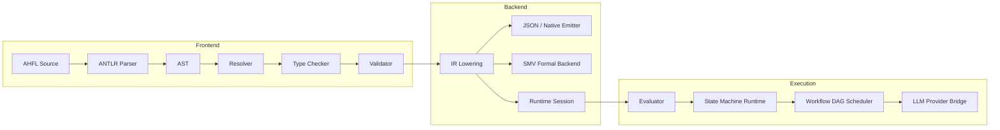

<p align="center">
  <h1 align="center">AHFL</h1>
  <p align="center">
    <strong>Agent Control Plane DSL — Make Agent Behavior Auditable Before Execution</strong>
  </p>
  <p align="center">
    <a href="https://github.com/Zzzode/AHFL/actions/workflows/ci.yml"></a>
    
    
  </p>
  <p align="center">
    <a href="README.zh.md">中文文档</a>
  </p>
</p>

---

AHFL (Agent Handoff Flow Language) is a strongly-typed DSL for describing Agent state machines, behavioral contracts, process orchestration, and multi-Agent workflows. The companion compiler `ahflc` handles parsing, type checking, formal verification, and emits structured intermediate representations consumable by downstream tools.

## Highlights

- **State Machine Modeling** — Agents defined with explicit states, transitions, and capability whitelists
- **Behavioral Contracts** — `requires` / `ensures` / `invariant` / `forbid` express pre/post-conditions
- **Workflow Orchestration** — DAG topological scheduling + safety/liveness temporal formulas
- **End-to-End Execution** — Local interpreter + LLM Provider adapter for real multi-Agent collaboration
- **Formal Backend** — Restricted SMV output for model checking
- **Zero Runtime Dependencies** — Pure C++23 compiler with no external library dependencies

## Language Preview

```ahfl
agent RefundAudit {
    input: RefundRequest;
    output: RefundDecision;
    states: [Init, Auditing, Approved, Rejected, Terminated];
    initial: Init;
    final: [Terminated];
    capabilities: [OrderQuery, AuditDecision];

    transition Init -> Auditing;
    transition Auditing -> Approved;
    transition Auditing -> Rejected;
}

contract for RefundAudit {
    requires: order_exists(input.order_id);
    invariant: always not called(RefundExecute);
}

workflow RefundWorkflow {
    input: RefundRequest;
    output: RefundDecision;
    node audit: RefundAudit(input);
    liveness: eventually completed(audit, Terminated);
    return: audit;
}
```

## Quick Start

### Prerequisites

| Tool | Version |
|------|---------|
| C++ Compiler | C++23 support (GCC 13+, Clang 17+, Apple Clang 15+) |
| CMake | 3.22+ |
| Ninja | recommended |

### Build & Run

```bash
# Configure & build
cmake --preset dev
cmake --build --preset build-dev

# Type check
./build/dev/src/cli/ahflc check examples/refund_audit_core_v0_1.ahfl

# Emit IR
./build/dev/src/cli/ahflc emit-ir-json examples/refund_audit_core_v0_1.ahfl

# Real LLM execution (requires ~/.ahfl/llm_config.json)
./build/dev/src/cli/ahfl-run examples/refund_audit_core_v0_1.ahfl --workflow RefundWorkflow

# Run tests
ctest --preset test-dev
```

## Architecture



## Project Structure

```
├── grammar/              ANTLR4 grammar definition
├── include/ahfl/         Public compiler headers
├── src/
│   ├── frontend/         Parser, AST, project loading
│   ├── semantics/        Resolver, type checker, validator
│   ├── ir/               Semantic IR model
│   ├── backends/         Emitters (IR, JSON, Native, SMV, ...)
│   ├── evaluator/        Expression & statement interpreter
│   ├── runtime/          Agent/Workflow runtime engine
│   ├── llm_provider/     LLM capability provider (OpenAI-compatible)
│   └── cli/              CLI entry points (ahflc, ahfl-run)
├── tests/                Regression & E2E tests (815+)
├── examples/             Example .ahfl programs
└── docs/                 Specs, designs, plans
```

## Documentation

| Category | Entry Point |
|----------|-------------|
| Language Spec | [`docs/spec/core-language-v0.1.zh.md`](docs/spec/core-language-v0.1.zh.md) |
| CLI Reference | [`docs/reference/cli-commands-v0.10.zh.md`](docs/reference/cli-commands-v0.10.zh.md) |
| IR Format | [`docs/reference/ir-format-v0.3.zh.md`](docs/reference/ir-format-v0.3.zh.md) |
| Project System | [`docs/reference/project-usage-v0.5.zh.md`](docs/reference/project-usage-v0.5.zh.md) |
| Full Doc Index | [`docs/README.md`](docs/README.md) |

## Development

```bash
# Available configure presets
cmake --preset dev            # Debug + sanitizer-friendly
cmake --preset release        # Release optimized
cmake --preset asan           # AddressSanitizer

# Formatting (requires clang-format 18.1.8)
cmake --build --preset build-format        # Apply clang-format
cmake --build --preset build-format-check  # Check only

# Test a specific version slice
ctest --preset test-dev -L ahfl-v0.42

# Regenerate parser
ANTLR_JAR=/path/to/antlr-4.x-complete.jar ./scripts/regenerate-parser.sh
```

## Contributing

1. Fork this repository
2. Create a feature branch (`git checkout -b feat/my-feature`)
3. Ensure `ctest --preset test-dev` passes
4. Ensure `cmake --build --preset build-format-check` reports no violations
5. Submit a Pull Request

See [`docs/reference/contributor-guide-v0.42.zh.md`](docs/reference/contributor-guide-v0.42.zh.md) for detailed guidelines.

## Status

AHFL is currently at **v0.56**, with the following implemented:

- Complete compiler frontend (parsing → semantic analysis → IR generation)
- 100+ CLI commands covering the full artifact chain from execution plans to Provider production readiness
- Local expression/statement interpreter + state machine runtime + workflow DAG scheduler
- LLM Provider adapter (OpenAI-compatible API, real multi-Agent collaboration)
- 815+ regression tests

## Roadmap

- [ ] More Provider adapters (local filesystem, databases)
- [ ] WASM compilation target
- [ ] LSP language server
- [ ] VS Code extension
- [ ] Online Playground
