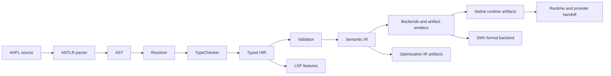

<p align="center">
  <h1 align="center">AHFL</h1>
  <p align="center">
    <strong>A typed DSL and C++23 compiler for auditable agent workflows</strong>
  </p>
  <p align="center">
    <a href="https://github.com/Zzzode/AHFL/actions/workflows/ci.yml"></a>
    
    
  </p>
  <p align="center">
    <a href="README.zh.md">Chinese README</a>
    ·
    <a href="docs/README.md">Documentation Index</a>
    ·
    <a href="docs/reference/cli-commands.zh.md">CLI Reference</a>
  </p>
</p>

AHFL (Agent Handoff Flow Language) is a strongly typed DSL and C++23 compiler for modeling and executing auditable agent workflows.

## Project Status

AHFL is in beta-gated development. Breaking changes remain possible; see the
[migration policy](docs/reference/migration-policy.zh.md). Product capability is
defined by criterion-specific release evidence, not by source files, handlers,
goldens, or aggregate test counts.

### Verified Beta Capabilities

- <!-- beta-capability:BETA-01 schema=ahfl.beta-evidence.run-profiles.v1 --> Manifest run profiles launch the reference workflow without repeated CLI configuration.
- <!-- beta-capability:BETA-02 schema=ahfl.beta-evidence.runtime-identity.v1 --> Runtime workflow, node, agent, capability, invocation, value, and event associations use strong numeric IDs.
- <!-- beta-capability:BETA-03 schema=ahfl.beta-evidence.event-projections.v1 --> One flat event store drives human, JSON, JSONL, replay, and audit projections.
- <!-- beta-capability:BETA-04 schema=ahfl.beta-evidence.lifecycle-matrix.v1 --> Accepted success and failure lifecycle paths have unique terminal events.
- <!-- beta-capability:BETA-05 schema=ahfl.beta-evidence.formatter-idempotence.v1 --> The AHFL formatter is lossless and idempotent over std/ and formatter fixtures, and its CI gate is blocking.
- <!-- beta-capability:BETA-06 schema=ahfl.beta-evidence.stdlib-container-migration.v1 --> Core containers resolve as nominal stdlib generics with no legacy runtime Option representation or migration flag.
- <!-- beta-capability:BETA-07 schema=ahfl.beta-evidence.reference-workflow-recovery.v1 --> The reference workflow passes local HTTP provider fault injection, SIGKILL restart, operator-approved resume, partial-write recovery, and side-effect deduplication.
- <!-- beta-capability:BETA-08 schema=ahfl.beta-evidence.install-smoke.v1 --> Clean-prefix installs contain ahflc, ahfl-lsp, and the sysroot; platform VSIX packages contain the release LSP and sysroot and pass isolated installation.
- <!-- beta-capability:BETA-10 schema=ahfl.beta-evidence.product-scope-freeze.v1 --> The beta product surface is frozen; new actions, backends, and artifacts require an accepted RFC.

The evidence contract lives in [`config/beta-gate.json`](config/beta-gate.json).
Capabilities not listed above may exist as compiler modules, experimental
backends, or development tooling, but this README does not claim beta readiness
for them. In particular, native Protobuf transport, multi-region operation,
official registry service, browser playground, and Marketplace publication
remain outside the verified beta surface.

## What AHFL Is For

AHFL is intended as a typed control and assurance layer for workflows where
execution order, capability boundaries, failure handling, replay, and audit
must remain explicit. The beta reference scenario is
[`examples/execution-demo`](examples/execution-demo): a multi-agent incident
workflow with deterministic nodes, an HTTP-backed LLM capability, budgets,
durable checkpoint/receipt storage, crash recovery, and operator approval.

Formal emitters, additional infrastructure backends, and deeper IDE features
remain available for development and evaluation, but are governed separately
from the verified beta runtime path.

## Language Preview

Excerpt from [examples/refund/audit.ahfl](examples/refund/audit.ahfl):

```ahfl
agent RefundAudit {
    input: RefundRequest;
    context: RefundContext;
    output: RefundDecision;
    states: [Init, Auditing, Approved, Rejected, Terminated];
    initial: Init;
    final: [Terminated];
    capabilities: [OrderQuery, AuditDecision, TicketCreate];

    transition Init -> Auditing;
    transition Auditing -> Approved;
    transition Auditing -> Rejected;
    transition Approved -> Terminated;
    transition Rejected -> Terminated;
}

contract for RefundAudit {
    requires: order_exists(input.order_id);
    ensures: non_empty(output.reason);
    invariant: always not called(RefundExecute);
}

workflow RefundAuditWorkflow {
    input: RefundRequest;
    output: RefundDecision;
    node audit: RefundAudit(input);
    liveness: eventually completed(audit, Terminated);
    return: audit;
}
```

## Quick Start

### Prerequisites

| Tool | Requirement |
| --- | --- |
| C++ compiler | C++23 support. GCC 13+, Clang 17+, or Apple Clang 15+ recommended. |
| CMake | 3.22+ |
| Ninja | Recommended generator used by the presets. |
| NuSMV / nuXmv | Optional, only needed for external model checking. |
| Node.js | Optional, only needed for VS Code extension development or packaging. |

### Build from source

```bash
git clone https://github.com/Zzzode/AHFL.git
cd AHFL

cmake --preset dev
cmake --build --preset build-dev
```

### Run the compiler

```bash
# Type-check a source file.
./build/dev/src/tooling/cli/ahflc check examples/refund/audit.ahfl

# Run the beta reference workflow from its manifest profile.
cd examples/execution-demo
../../build/dev/src/tooling/cli/ahflc run --output-format json

# Inspect all commands and artifacts.
../../build/dev/src/tooling/cli/ahflc --help
```

The committed LLM configuration uses an environment secret handle. See the
[reference workflow guide](examples/execution-demo/README.md) and
[execution guide](docs/reference/user-guide-execution.zh.md) before running a
provider-backed workflow.

## Architecture


```mermaid
flowchart LR
    Source[AHFL source] --> Parse[ANTLR parser]
    Parse --> AST[AST]
    AST --> Resolve[Resolver]
    Resolve --> Typecheck[TypeChecker]
    Typecheck --> TypedHIR[Typed HIR]
    TypedHIR --> Validate[Validator]
    Validate --> IR[Semantic IR]
    IR --> Backends[Backends and artifact emitters]
    IR --> OptIR[Optimization IR artifacts]
    Backends --> Native[Native runtime artifacts]
    Backends --> Formal[SMV formal backend]
    Native --> Runtime[Runtime and provider handoff]
    TypedHIR --> LSP[LSP features]
```

The normal backend contract is Semantic IR. Opt IR is an explicit diagnostic artifact, not the default input for backend emission or LSP state.

## Repository Layout

```text
grammar/              ANTLR grammar
include/ahfl/         Public compiler headers
src/base/             Shared support, JSON, and validation utilities
src/compiler/         Syntax, semantics, IR, passes, handoff, and backends
src/pipeline/         Runtime-adjacent artifact models and builders
src/runtime/          Local evaluator, workflow engine, and providers
src/tooling/          CLI, LSP, DAP, formatter, package, profiling, and test tooling
tests/                Unit, golden, integration, and benchmark tests
tools/vscode/         VS Code extension client and packaging workflow
docs/                 Specs, design notes, plans, and reference documentation
examples/             Example AHFL programs
```

## Documentation

| Topic | Entry point |
| --- | --- |
| Documentation index | [docs/README.md](docs/README.md) |
| User guide | [docs/reference/user-guide-overview.zh.md](docs/reference/user-guide-overview.zh.md) |
| Language specification | [docs/spec/core-language.zh.md](docs/spec/core-language.zh.md) |
| CLI reference | [docs/reference/cli-commands.zh.md](docs/reference/cli-commands.zh.md) |
| IR format | [docs/reference/ir-format.zh.md](docs/reference/ir-format.zh.md) |
| Project and workspace usage | [docs/reference/project-usage.zh.md](docs/reference/project-usage.zh.md) |
| Runtime events and recovery | [docs/reference/native-runtime-artifacts.zh.md](docs/reference/native-runtime-artifacts.zh.md) |
| VS Code LSP extension | [docs/reference/lsp-vscode-extension.zh.md](docs/reference/lsp-vscode-extension.zh.md) |
| Contributor guide | [docs/reference/contributor-guide.zh.md](docs/reference/contributor-guide.zh.md) |

## VS Code and LSP

Build the LSP server during the normal CMake build:

```bash
cmake --build --preset build-dev --target ahfl-lsp
```

Package a user-facing platform VSIX with a bundled release LSP:

```bash
scripts/package-vscode-vsix-release.sh
code --install-extension tools/vscode/dist/ahfl-language-<version>-<target>.vsix
```

See [docs/reference/lsp-vscode-extension.zh.md](docs/reference/lsp-vscode-extension.zh.md) for development, packaging, and Marketplace release details.

## Development

```bash
# Build variants
cmake --preset dev
cmake --preset release
cmake --preset asan
cmake --preset tsan

# Build and test
cmake --build --preset build-dev
ctest --preset test-dev --output-on-failure

# Formatting
cmake --build --preset build-format
cmake --build --preset build-format-check

# Documentation sync gate
python3 scripts/check-ir-doc-sync.py
ctest --preset test-dev --output-on-failure -R '^ahfl\.docs\.ir_sync_gate$'
```

Parser regeneration is explicit and uses the locked ANTLR toolchain:

```bash
ANTLR_JAR=/path/to/antlr-4.13.1-complete.jar ./scripts/regenerate-parser.sh
ANTLR_JAR=/path/to/antlr-4.13.1-complete.jar ./scripts/regenerate-parser.sh --check
```

### Golden-file tests

The test suite ships with checked-in reference (golden) files under
`tests/golden/**` that pin the exact output of compiler artifact emitters.

- Run the full golden-lock baseline:
  ```bash
  ctest --preset test-dev --output-on-failure -R '^p5_smv_golden_lock$'
  ```
- A passing run reports **0 diffs** across all SMV formal cases; on
  failure, the harness prints a copy-pasteable `diff -u` command plus a
  unified diff inline so the change is immediately reviewable.

**PR requirement.** If your change intentionally updates any golden
output -- e.g. a compiler pass, backend, or diagnostic format change --
you **must** attach the `diff` output produced by the failing test to
the PR description and commit the updated golden files in the **same
patch** as the source change. Reviewers should be able to verify that
the source diff and the golden diff are two sides of the same coin.

## Contributing

1. Open a focused issue or discussion for behavior changes.
2. Keep each commit to one logical change.
3. Use Conventional Commits, for example `fix(parser): reject invalid state transition`.
4. Mark breaking changes with a `BREAKING CHANGE:` footer and explain the migration path.
5. Run the relevant tests, `git diff --check`, and formatting checks before opening a pull request.

See [docs/reference/contributor-guide.zh.md](docs/reference/contributor-guide.zh.md) for contributor workflow and validation guidance.

## License

AHFL is licensed under the [Apache License 2.0](LICENSE).
