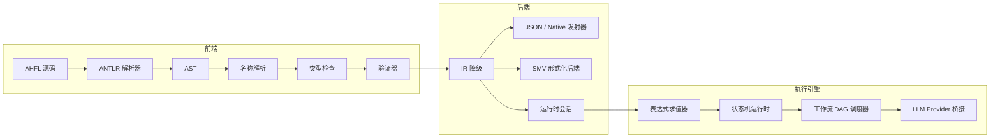

<p align="center">
  <h1 align="center">AHFL</h1>
  <p align="center">
    <strong>Agent 控制平面 DSL — 让 Agent 行为在执行前可审计</strong>
  </p>
  <p align="center">
    <a href="https://github.com/Zzzode/AHFL/actions/workflows/ci.yml"></a>
    
    
  </p>
  <p align="center">
    <a href="README.md">English</a>
  </p>
</p>

---

AHFL（Agent Handoff Flow Language）是一门强类型 DSL，用于描述 Agent 状态机、行为契约、流程编排与多 Agent 工作流。配套编译器 `ahflc` 负责解析、类型检查、形式化验证，并输出可被下游工具消费的结构化中间表示。

## 核心特性

- **状态机建模** — Agent 以显式状态、转移、能力白名单定义
- **行为契约** — `requires` / `ensures` / `invariant` / `forbid` 表达前后置条件
- **工作流编排** — DAG 拓扑调度 + 安全性/活性时序公式
- **端到端执行** — 本地解释器 + LLM Provider 适配器，支持真实多 Agent 协作
- **形式化后端** — 受限 SMV 输出支持模型检查
- **零运行时依赖** — 纯 C++23 编译器，无外部库依赖

## 语言预览

```ahfl
agent RefundAudit {
    input: RefundRequest;
    output: RefundDecision;
    states: [Init, Auditing, Approved, Rejected, Terminated];
    initial: Init;
    final: [Terminated];
    capabilities: [OrderQuery, AuditDecision];

    transition Init -> Auditing;
    transition Auditing -> Approved;
    transition Auditing -> Rejected;
}

contract for RefundAudit {
    requires: order_exists(input.order_id);
    invariant: always not called(RefundExecute);
}

workflow RefundWorkflow {
    input: RefundRequest;
    output: RefundDecision;
    node audit: RefundAudit(input);
    liveness: eventually completed(audit, Terminated);
    return: audit;
}
```

## 快速开始

### 前置条件

| 工具 | 版本 |
|------|------|
| C++ 编译器 | 支持 C++23（GCC 13+、Clang 17+、Apple Clang 15+） |
| CMake | 3.22+ |
| Ninja | 推荐 |

### 构建与运行

```bash
# 配置 & 构建
cmake --preset dev
cmake --build --preset build-dev

# 类型检查
./build/dev/src/tooling/cli/ahflc check examples/refund_audit_core_v0_1.ahfl

# 输出 IR
./build/dev/src/tooling/cli/ahflc emit-ir-json examples/refund_audit_core_v0_1.ahfl

# 真实 LLM 执行（需要配置 ~/.ahfl/llm_config.json）
./build/dev/src/tooling/cli/ahfl-run examples/refund_audit_core_v0_1.ahfl --workflow RefundWorkflow

# 运行测试
ctest --preset test-dev
```

## 架构



## 项目结构

```
├── grammar/              ANTLR4 语法定义
├── include/ahfl/         编译器公共头文件
├── src/
│   ├── frontend/         解析器、AST、项目加载
│   ├── semantics/        名称解析、类型检查、验证
│   ├── ir/               语义中间表示模型
│   ├── backends/         发射器（IR、JSON、Native、SMV 等）
│   ├── evaluator/        表达式与语句解释器
│   ├── runtime/          Agent/Workflow 运行时引擎
│   ├── llm_provider/     LLM 能力提供器（OpenAI 兼容）
│   └── cli/              CLI 入口（ahflc、ahfl-run）
├── tests/                回归测试与端到端测试（815+）
├── examples/             示例 .ahfl 程序
└── docs/                 规范、设计、计划
```

## 文档

| 分类 | 入口 |
|------|------|
| 语言规范 | [`docs/spec/core-language-v0.1.zh.md`](docs/spec/core-language-v0.1.zh.md) |
| CLI 参考 | [`docs/reference/cli-commands-v0.10.zh.md`](docs/reference/cli-commands-v0.10.zh.md) |
| IR 格式 | [`docs/reference/ir-format-v0.3.zh.md`](docs/reference/ir-format-v0.3.zh.md) |
| 项目系统 | [`docs/reference/project-usage-v0.5.zh.md`](docs/reference/project-usage-v0.5.zh.md) |
| 完整索引 | [`docs/README.md`](docs/README.md) |

## 开发

```bash
# 可用 Configure Presets
cmake --preset dev            # Debug + sanitizer 友好
cmake --preset release        # Release 优化
cmake --preset asan           # AddressSanitizer

# 格式化（需要 clang-format 18.1.8）
cmake --build --preset build-format        # 执行 clang-format
cmake --build --preset build-format-check  # 仅检查

# 测试特定版本切片
ctest --preset test-dev -L ahfl-v0.42

# 使用锁定的 ANTLR 工具链重新生成 Parser
ANTLR_JAR=/path/to/antlr-4.13.1-complete.jar ./scripts/regenerate-parser.sh
ANTLR_JAR=/path/to/antlr-4.13.1-complete.jar ./scripts/regenerate-parser.sh --check
```

## 贡献

1. Fork 本仓库
2. 创建特性分支 (`git checkout -b feat/my-feature`)
3. 确保 `ctest --preset test-dev` 全部通过
4. 确保 `cmake --build --preset build-format-check` 无违规
5. 提交 Pull Request

详细指南请参阅 [`docs/reference/contributor-guide-v0.42.zh.md`](docs/reference/contributor-guide-v0.42.zh.md)

## 当前状态

AHFL 当前处于 **v0.56** 阶段，已实现：

- 完整的编译器前端（解析 → 语义分析 → IR 生成）
- 100+ CLI 命令覆盖从执行计划到 Provider 生产就绪的完整 artifact 链
- 本地表达式/语句解释器 + 状态机运行时 + 工作流 DAG 调度器
- LLM Provider 适配器（OpenAI-compatible API，支持真实多 Agent 协作）
- 815+ 回归测试

## 路线图

- [ ] 更多 Provider 适配器（本地文件系统、数据库）
- [ ] WASM 编译目标
- [ ] LSP 语言服务器
- [ ] VS Code 插件
- [ ] 在线 Playground
