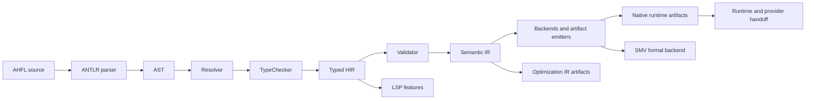

<p align="center">
  <h1 align="center">AHFL</h1>
  <p align="center">
    <strong>用于可审计 Agent 工作流的强类型 DSL 与 C++23 编译器</strong>
  </p>
  <p align="center">
    <a href="https://github.com/Zzzode/AHFL/actions/workflows/ci.yml"></a>
    
    
    
  </p>
  <p align="center">
    <a href="README.md">English README</a>
    ·
    <a href="docs/README.md">文档索引</a>
    ·
    <a href="docs/reference/cli-commands.zh.md">CLI 参考</a>
  </p>
</p>

AHFL（Agent Handoff Flow Language）是一门强类型 DSL，用于在 Agent 执行前建模状态机、行为契约、工作流 DAG、运行时交接工件和形式化验证边界。

本仓库包含语言语法、C++23 编译器 `ahflc`、runtime-adjacent artifact 构建链路、本地执行路径、LSP 服务端，以及 VS Code 扩展打包流程。

## 项目状态

AHFL 当前处于活跃的 pre-1.0 编译器与工具链阶段，项目状态为 **v0.59**。为了改进语言和编译器架构，当前不承诺 immature artifact 的前向兼容；迁移策略见 [migration policy](docs/reference/migration-policy.zh.md)。

当前基线：

- C++23 编译器流水线：parse、resolve、typecheck、validate、lower to IR、emit artifacts。
- Project-aware 编译，支持 module / source graph。
- Native package handoff、execution plan、runtime session、journal、replay、audit、scheduler、checkpoint、persistence、export、store import 等 runtime-adjacent artifact 链路。
- 面向 NuSMV / nuXmv 的形式化验证输出。
- LSP 服务端与 VS Code 扩展打包流程，platform VSIX 内置 release LSP 二进制。
- 900+ 个 CTest 注册的回归、单元、集成和 benchmark 测试。

## AHFL 解决什么问题

| 场景 | AHFL 提供的能力 |
| --- | --- |
| Agent 工作流建模 | 显式 agent、state、transition、capability 和 workflow。 |
| 静态安全检查 | 强类型 schema、表达式、契约与 workflow dependency 检查。 |
| Runtime 交接 | 用机器可读 native/runtime artifact 替代临时脚本和隐式约定。 |
| 审查与审计 | 结构化 summary、replay view、audit report 和 release evidence artifact。 |
| 形式化验证 | SMV 后端支持 safety / liveness 模型检查。 |
| IDE 集成 | LSP diagnostics、hover、completion、definition、references、rename。 |

## 语言预览

摘自 [examples/refund_audit_core_v0_1.ahfl](examples/refund_audit_core_v0_1.ahfl)：

```ahfl
agent RefundAudit {
    input: RefundRequest;
    context: RefundContext;
    output: RefundDecision;
    states: [Init, Auditing, Approved, Rejected, Terminated];
    initial: Init;
    final: [Terminated];
    capabilities: [OrderQuery, AuditDecision, TicketCreate];

    transition Init -> Auditing;
    transition Auditing -> Approved;
    transition Auditing -> Rejected;
    transition Approved -> Terminated;
    transition Rejected -> Terminated;
}

contract for RefundAudit {
    requires: order_exists(input.order_id);
    ensures: non_empty(output.reason);
    invariant: always not called(RefundExecute);
}

workflow RefundAuditWorkflow {
    input: RefundRequest;
    output: RefundDecision;
    node audit: RefundAudit(input);
    liveness: eventually completed(audit, Terminated);
    return: audit;
}
```

## 快速开始

### 前置条件

| 工具 | 要求 |
| --- | --- |
| C++ 编译器 | 支持 C++23。推荐 GCC 13+、Clang 17+ 或 Apple Clang 15+。 |
| CMake | 3.22+ |
| Ninja | 推荐，仓库 presets 默认使用 Ninja。 |
| NuSMV / nuXmv | 可选，仅外部模型检查需要。 |
| Node.js | 可选，仅 VS Code 扩展开发或打包需要。 |

### 从源码构建

```bash
git clone https://github.com/Zzzode/AHFL.git
cd AHFL

cmake --preset dev
cmake --build --preset build-dev
```

### 运行编译器

```bash
# 类型检查源码文件。
./build/dev/src/tooling/cli/ahflc check examples/refund_audit_core_v0_1.ahfl

# 输出人类可读的编译摘要。
./build/dev/src/tooling/cli/ahflc emit summary examples/refund_audit_core_v0_1.ahfl

# 输出机器可读的 Semantic IR。
./build/dev/src/tooling/cli/ahflc emit ir-json examples/refund_audit_core_v0_1.ahfl

# 查看所有命令和 artifact。
./build/dev/src/tooling/cli/ahflc --help
```

Runtime 执行使用 `ahflc run`，需要 workflow input 以及 capability / provider 配置或测试 fixture。运行 provider-backed workflow 前建议先阅读 [执行指南](docs/reference/user-guide-execution.zh.md)。

## 架构



普通 backend 的主合同是 Semantic IR。Opt IR 是显式诊断 artifact，不是 backend emission 或 LSP 常驻状态的默认输入。

## 仓库结构

```text
grammar/              ANTLR 语法
include/ahfl/         编译器公共头文件
src/base/             共享 support、JSON 和 validation 工具
src/compiler/         syntax、semantics、IR、passes、handoff 和 backends
src/pipeline/         Runtime-adjacent artifact 模型与 builder
src/runtime/          本地 evaluator、workflow engine 和 provider
src/tooling/          CLI、LSP、DAP、formatter、package、profiling 和测试工具
tests/                单元、golden、集成和 benchmark 测试
tools/vscode/         VS Code 扩展客户端与打包流程
docs/                 规范、设计、计划和参考文档
examples/             AHFL 示例程序
```

## 文档

| 主题 | 入口 |
| --- | --- |
| 文档索引 | [docs/README.md](docs/README.md) |
| 用户指南 | [docs/reference/user-guide-overview.zh.md](docs/reference/user-guide-overview.zh.md) |
| 语言规范 | [docs/spec/core-language.zh.md](docs/spec/core-language.zh.md) |
| CLI 参考 | [docs/reference/cli-commands.zh.md](docs/reference/cli-commands.zh.md) |
| IR 格式 | [docs/reference/ir-format.zh.md](docs/reference/ir-format.zh.md) |
| Project / workspace 使用 | [docs/reference/project-usage.zh.md](docs/reference/project-usage.zh.md) |
| Native / runtime artifacts | [docs/reference/native-runtime-artifacts.zh.md](docs/reference/native-runtime-artifacts.zh.md) |
| Durable store import pipeline | [docs/reference/durable-store-import-reference.zh.md](docs/reference/durable-store-import-reference.zh.md) |
| VS Code LSP 扩展 | [docs/reference/lsp-vscode-extension.zh.md](docs/reference/lsp-vscode-extension.zh.md) |
| 贡献指南 | [docs/reference/contributor-guide.zh.md](docs/reference/contributor-guide.zh.md) |

## VS Code 与 LSP

正常 CMake 构建会生成 LSP 服务端，也可以单独构建：

```bash
cmake --build --preset build-dev --target ahfl-lsp
```

生成面向用户安装的 platform VSIX，内置 release LSP：

```bash
scripts/package-vscode-vsix-release.sh
code --install-extension tools/vscode/dist/ahfl-language-<version>-<target>.vsix
```

开发、打包和 Marketplace 发布细节见 [docs/reference/lsp-vscode-extension.zh.md](docs/reference/lsp-vscode-extension.zh.md)。

## 开发

```bash
# 构建变体
cmake --preset dev
cmake --preset release
cmake --preset asan
cmake --preset tsan

# 构建与测试
cmake --build --preset build-dev
ctest --preset test-dev --output-on-failure

# 格式化
cmake --build --preset build-format
cmake --build --preset build-format-check

# 文档同步门禁
python3 scripts/check-ir-doc-sync.py
ctest --preset test-dev --output-on-failure -R '^ahfl\.docs\.ir_sync_gate$'
```

Parser 重新生成是显式操作，并使用锁定的 ANTLR 工具链：

```bash
ANTLR_JAR=/path/to/antlr-4.13.1-complete.jar ./scripts/regenerate-parser.sh
ANTLR_JAR=/path/to/antlr-4.13.1-complete.jar ./scripts/regenerate-parser.sh --check
```

## 贡献

1. 行为变化先开 focused issue 或 discussion。
2. 每个 commit 只包含一个逻辑变化。
3. 使用 Conventional Commits，例如 `fix(parser): reject invalid state transition`。
4. Breaking change 必须在 footer 写 `BREAKING CHANGE:`，并说明影响范围和迁移路径。
5. 提交 PR 前运行相关测试、`git diff --check` 和格式检查。

贡献流程和验证建议见 [docs/reference/contributor-guide.zh.md](docs/reference/contributor-guide.zh.md)。

## License

AHFL 使用 [Apache License 2.0](LICENSE) 许可证。
