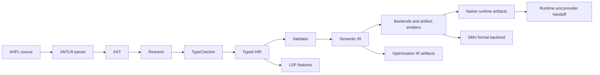

<p align="center">
  <h1 align="center">AHFL</h1>
  <p align="center">
    <strong>用于可审计 Agent 工作流的强类型 DSL 与 C++23 编译器</strong>
  </p>
  <p align="center">
    <a href="https://github.com/Zzzode/AHFL/actions/workflows/ci.yml"></a>
    
    
  </p>
  <p align="center">
    <a href="README.md">English README</a>
    ·
    <a href="docs/README.md">文档索引</a>
    ·
    <a href="docs/reference/cli-commands.zh.md">CLI 参考</a>
  </p>
</p>

AHFL（Agent Handoff Flow Language）是一门用于建模和执行可审计 Agent 工作流的强类型 DSL 与 C++23 编译器。

## 项目状态

AHFL 当前由 beta gate 治理，仍可能发生 breaking change；迁移策略见
[migration policy](docs/reference/migration-policy.zh.md)。产品能力以逐项
release evidence 为准，不以存在源码、handler、golden 或聚合测试数量为准。

### 已验证 Beta 能力

- <!-- beta-capability:BETA-01 schema=ahfl.beta-evidence.run-profiles.v1 --> Manifest run profile 可直接启动 reference workflow，无需重复提供 CLI 配置。
- <!-- beta-capability:BETA-02 schema=ahfl.beta-evidence.runtime-identity.v1 --> Runtime 的 workflow、node、agent、capability、invocation、value 与 event 关联使用强类型数值 ID。
- <!-- beta-capability:BETA-03 schema=ahfl.beta-evidence.event-projections.v1 --> 单一 flat event store 驱动 human、JSON、JSONL、replay 与 audit 投影。
- <!-- beta-capability:BETA-04 schema=ahfl.beta-evidence.lifecycle-matrix.v1 --> 已接受的成功与失败生命周期路径都具有唯一 terminal event。
- <!-- beta-capability:BETA-05 schema=ahfl.beta-evidence.formatter-idempotence.v1 --> AHFL formatter 对 std/ 与 formatter fixtures 无损且幂等，并由阻断式 CI gate 检查。
- <!-- beta-capability:BETA-06 schema=ahfl.beta-evidence.stdlib-container-migration.v1 --> 核心容器解析为 nominal stdlib 泛型，不再保留 legacy runtime Option 表示或迁移开关。
- <!-- beta-capability:BETA-07 schema=ahfl.beta-evidence.reference-workflow-recovery.v1 --> Reference workflow 已通过本地 HTTP provider 故障注入、SIGKILL 重启、operator approval 恢复、partial-write recovery 与副作用去重。
- <!-- beta-capability:BETA-08 schema=ahfl.beta-evidence.install-smoke.v1 --> Clean-prefix 安装包含 ahflc、ahfl-lsp 与 sysroot；platform VSIX 包含 release LSP 与 sysroot，并通过隔离安装。
- <!-- beta-capability:BETA-10 schema=ahfl.beta-evidence.product-scope-freeze.v1 --> Beta 产品面保持冻结；新增 action、backend 或 artifact 必须先有 accepted RFC。

证据合同位于 [`config/beta-gate.json`](config/beta-gate.json)。未列入上表的能力
可以作为编译器模块、实验 backend 或开发工具存在，但本 README 不声明其已达到
beta readiness。Native Protobuf transport、多 region 运行、官方 registry service、
浏览器 playground 与 Marketplace 发布均不在当前已验证 beta 产品面内。

## AHFL 解决什么问题

AHFL 面向需要显式管理执行顺序、capability 边界、失败处理、replay 与 audit 的
工作流，定位为 typed control and assurance layer。Beta reference scenario 是
[`examples/execution-demo`](examples/execution-demo)：它包含多 Agent 节点、本地
HTTP-backed LLM capability、预算、durable checkpoint/receipt store、crash recovery
与 operator approval。

Formal emitter、其他基础设施 backend 和更深 IDE 功能仍可用于开发与评估，但它们
与已验证 beta runtime path 分开治理。

## 语言预览

摘自 [examples/refund/audit.ahfl](examples/refund/audit.ahfl)：

```ahfl
agent RefundAudit {
    input: RefundRequest;
    context: RefundContext;
    output: RefundDecision;
    states: [Init, Auditing, Approved, Rejected, Terminated];
    initial: Init;
    final: [Terminated];
    capabilities: [OrderQuery, AuditDecision, TicketCreate];

    transition Init -> Auditing;
    transition Auditing -> Approved;
    transition Auditing -> Rejected;
    transition Approved -> Terminated;
    transition Rejected -> Terminated;
}

contract for RefundAudit {
    requires: order_exists(input.order_id);
    ensures: non_empty(output.reason);
    invariant: always not called(RefundExecute);
}

workflow RefundAuditWorkflow {
    input: RefundRequest;
    output: RefundDecision;
    node audit: RefundAudit(input);
    liveness: eventually completed(audit, Terminated);
    return: audit;
}
```

## 快速开始

### 前置条件

| 工具 | 要求 |
| --- | --- |
| C++ 编译器 | 支持 C++23。推荐 GCC 13+、Clang 17+ 或 Apple Clang 15+。 |
| CMake | 3.22+ |
| Ninja | 推荐，仓库 presets 默认使用 Ninja。 |
| NuSMV / nuXmv | 可选，仅外部模型检查需要。 |
| Node.js | 可选，仅 VS Code 扩展开发或打包需要。 |

### 从源码构建

```bash
git clone https://github.com/Zzzode/AHFL.git
cd AHFL

cmake --preset dev
cmake --build --preset build-dev
```

### 运行编译器

```bash
# 类型检查源码文件。
./build/dev/src/tooling/cli/ahflc check examples/refund/audit.ahfl

# 通过 manifest profile 运行 beta reference workflow。
cd examples/execution-demo
../../build/dev/src/tooling/cli/ahflc run --output-format json

# 查看所有命令和 artifact。
../../build/dev/src/tooling/cli/ahflc --help
```

提交的 LLM 配置只使用环境变量 secret handle。运行 provider-backed workflow 前请先阅读
[reference workflow 指南](examples/execution-demo/README.md)和
[执行指南](docs/reference/user-guide-execution.zh.md)。

## 架构


```mermaid
flowchart LR
    Source[AHFL source] --> Parse[ANTLR parser]
    Parse --> AST[AST]
    AST --> Resolve[Resolver]
    Resolve --> Typecheck[TypeChecker]
    Typecheck --> TypedHIR[Typed HIR]
    TypedHIR --> Validate[Validator]
    Validate --> IR[Semantic IR]
    IR --> Backends[Backends and artifact emitters]
    IR --> OptIR[Optimization IR artifacts]
    Backends --> Native[Native runtime artifacts]
    Backends --> Formal[SMV formal backend]
    Native --> Runtime[Runtime and provider handoff]
    TypedHIR --> LSP[LSP features]
```

普通 backend 的主合同是 Semantic IR。Opt IR 是显式诊断 artifact，不是 backend emission 或 LSP 常驻状态的默认输入。

## 仓库结构

```text
grammar/              ANTLR 语法
include/ahfl/         编译器公共头文件
src/base/             共享 support、JSON 和 validation 工具
src/compiler/         syntax、semantics、IR、passes、handoff 和 backends
src/pipeline/         Runtime-adjacent artifact 模型与 builder
src/runtime/          本地 evaluator、workflow engine 和 provider
src/tooling/          CLI、LSP、DAP、formatter、package、profiling 和测试工具
tests/                单元、golden、集成和 benchmark 测试
tools/vscode/         VS Code 扩展客户端与打包流程
docs/                 规范、设计、计划和参考文档
examples/             AHFL 示例程序
```

## 文档

| 主题 | 入口 |
| --- | --- |
| 文档索引 | [docs/README.md](docs/README.md) |
| 用户指南 | [docs/reference/user-guide-overview.zh.md](docs/reference/user-guide-overview.zh.md) |
| 语言规范 | [docs/spec/core-language.zh.md](docs/spec/core-language.zh.md) |
| CLI 参考 | [docs/reference/cli-commands.zh.md](docs/reference/cli-commands.zh.md) |
| IR 格式 | [docs/reference/ir-format.zh.md](docs/reference/ir-format.zh.md) |
| Project / workspace 使用 | [docs/reference/project-usage.zh.md](docs/reference/project-usage.zh.md) |
| Runtime events 与 recovery | [docs/reference/native-runtime-artifacts.zh.md](docs/reference/native-runtime-artifacts.zh.md) |
| VS Code LSP 扩展 | [docs/reference/lsp-vscode-extension.zh.md](docs/reference/lsp-vscode-extension.zh.md) |
| 贡献指南 | [docs/reference/contributor-guide.zh.md](docs/reference/contributor-guide.zh.md) |

## VS Code 与 LSP

正常 CMake 构建会生成 LSP 服务端，也可以单独构建：

```bash
cmake --build --preset build-dev --target ahfl-lsp
```

生成面向用户安装的 platform VSIX，内置 release LSP：

```bash
scripts/package-vscode-vsix-release.sh
code --install-extension tools/vscode/dist/ahfl-language-<version>-<target>.vsix
```

开发、打包和 Marketplace 发布细节见 [docs/reference/lsp-vscode-extension.zh.md](docs/reference/lsp-vscode-extension.zh.md)。

## 开发

```bash
# 构建变体
cmake --preset dev
cmake --preset release
cmake --preset asan
cmake --preset tsan

# 构建与测试
cmake --build --preset build-dev
ctest --preset test-dev --output-on-failure

# 格式化
cmake --build --preset build-format
cmake --build --preset build-format-check

# 文档同步门禁
python3 scripts/check-ir-doc-sync.py
ctest --preset test-dev --output-on-failure -R '^ahfl\.docs\.ir_sync_gate$'
```

Parser 重新生成是显式操作，并使用锁定的 ANTLR 工具链：

```bash
ANTLR_JAR=/path/to/antlr-4.13.1-complete.jar ./scripts/regenerate-parser.sh
ANTLR_JAR=/path/to/antlr-4.13.1-complete.jar ./scripts/regenerate-parser.sh --check
```

### Golden 文件测试

测试套件在 `tests/golden/**` 下附带已提交的参考（golden）文件，用于固定编译器各产物输出的逐字内容。

- 运行完整的 golden-lock 基线：
  ```bash
  ctest --preset test-dev --output-on-failure -R '^p5_smv_golden_lock$'
  ```
- 通过时所有 SMV formal 用例应保持 **0 diff**；失败时脚本会打印可直接粘贴执行的 `diff -u` 命令以及内联 unified diff，方便评审人员即时核查。

**PR 强制要求。** 如果你的改动是有意更新 golden 输出（例如编译器 pass、后端或诊断格式变更），你 **必须** 在 PR 描述中附上失败测试打印的 `diff` 输出，并且把更新后的 golden 文件与源码改动放在 **同一个 patch** 中提交。评审者应能确认源码 diff 与 golden diff 是同一枚硬币的两面。

## 贡献

1. 行为变化先开 focused issue 或 discussion。
2. 每个 commit 只包含一个逻辑变化。
3. 使用 Conventional Commits，例如 `fix(parser): reject invalid state transition`。
4. Breaking change 必须在 footer 写 `BREAKING CHANGE:`，并说明影响范围和迁移路径。
5. 提交 PR 前运行相关测试、`git diff --check` 和格式检查。

贡献流程和验证建议见 [docs/reference/contributor-guide.zh.md](docs/reference/contributor-guide.zh.md)。

## License

AHFL 使用 [Apache License 2.0](LICENSE) 许可证。
