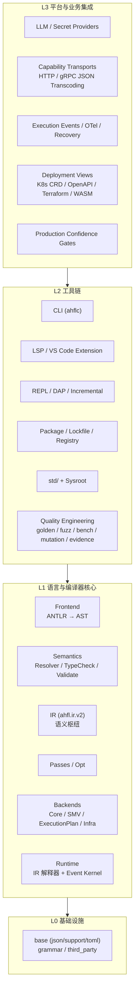
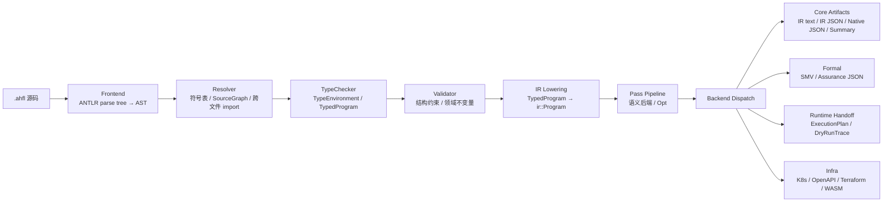

# AHFL 架构总览

本文是 AHFL 仓库的**分层地图**：从语言与编译器核心，到周边工具链，再到平台与业务集成，说明每一层有什么、层与层之间允许什么依赖、物理目录与逻辑分层在哪里不完全重合。

**这是什么**：新人入口、跨层改动的依赖裁判、架构讨论的共同词汇表。

**这不是什么**：不重复各层内的权威设计文档（见 §8 文档地图），不定义语言语义（那是 [core-language.zh.md](../spec/core-language.zh.md) 的事），不记录实现状态（那是 [project-status.zh.md](../plans/project-status.zh.md) 的事）。

---

## 1. 分层总览

AHFL 分四层。依赖方向**只能从上到下**：上层可以依赖下层，下层不知道上层的存在。

| 层 | 职责 | 物理位置 |
| --- | --- | --- |
| **L3 平台与业务集成** | LLM 接入、能力传输、执行可观测性、部署视图、生产准入 | `src/runtime/providers/`、`src/runtime/engine/`（传输与事件部分）、`src/compiler/backends/infra/`、release gate 脚本 |
| **L2 工具链** | 开发者入口：CLI、IDE、交互/调试、包管理、标准库、质量工程 | `src/tooling/`、`std/`、`tools/`、`tests/` |
| **L1 语言与编译器核心** | 语言定义、编译管线、IR、后端、运行时语义 | `grammar/`、`src/compiler/`、`src/runtime/evaluator/`、`src/runtime/engine/`（核心部分）、`src/pipeline/`、`src/verification/` |
| **L0 基础设施** | 与语言无关的支撑库、文法、vendored 依赖 | `src/base/`、`grammar/`、`third_party/` |

**核心判断**：L1 是 AHFL 的本体——一门带形式化验证能力的强类型 DSL 及其编译器。L2 让这门语言可被使用。L3 让它接入真实的 AI Agent 运行环境。业务层可以替换或砍掉（换 provider、换部署目标），L1 的语义不受影响。

---

## 2. L1：语言与编译器核心

### 2.1 语言表面

- **文法**：[grammar/AHFL.g4](../../grammar/AHFL.g4)（ANTLR4，约 350 行）
- **规范**：[core-language.zh.md](../spec/core-language.zh.md)——词法、语法、类型系统、contract、时序公式、静态检查清单
- **演进治理**：[docs/rfcs/](../rfcs/README.md)——语言级决策的唯一登记处

语言的核心概念：`agent`（状态机）、`flow`（状态迁移逻辑）、`workflow`（DAG 编排）、`capability`（外部能力声明）、`contract`（行为契约 + 时序公式）、`predicate`（可验证谓词）、`fn`/`trait`/`enum`/泛型（RFC 0013 演进中）。

### 2.2 编译管线

| 阶段 | 职责 | 关键文件 |
| --- | --- | --- |
| Frontend | ANTLR parse tree → 前端 AST | `src/compiler/syntax/frontend/` |
| Resolver | 多命名空间符号表、跨文件 import、source ownership | `src/compiler/semantics/resolver.cpp` |
| TypeCheck | 类型关系、effect、schema boundary、const 求值 | `src/compiler/semantics/typecheck.cpp`、`type_relations.cpp` |
| Validate | agent/flow/workflow/状态机/DAG 结构约束 | `src/compiler/semantics/validate.cpp` |
| IR Lower | TypedProgram → variant-based IR | `src/compiler/ir/ir_lower.cpp` |
| Passes | IR pass pipeline、诊断式 Opt IR | `src/compiler/passes/`、`src/compiler/ir/opt/` |
| Backends | IR → 各类 artifact | `src/compiler/backends/driver.cpp` |

### 2.3 IR：语义枢纽

IR（`ahfl.ir.v2`，定义于 `include/ahfl/compiler/ir/ir.hpp`）是整个系统的**唯一语义源**：

- **解释器执行 IR**——tree-walking 解释器直接遍历 `ir::Program` / `ir::Expr`，没有字节码、没有 native codegen（见 [native-runtime-architecture.zh.md](native-runtime-architecture.zh.md)）
- **SMV 后端投影 IR**——agent 状态变量、workflow 生命周期、contract clauses → LTLSPEC
- **infra 后端消费 IR**——提取 agent/flow 结构生成部署描述
- **IR 可 JSON 序列化**——typed HIR、const value tree、effect facts 都有稳定 schema gate

设计约束（不可协商）：`std::variant` + visitor（无继承）、hash-consed 类型（指针相等 ⇔ 结构相等）、flat store + index 引用（无字符串身份）。

### 2.4 后端族

| 族 | Backend | 产物 | 消费者 |
| --- | --- | --- | --- |
| Core | `ir` / `ir-json` / `native-json` / `summary` / `package-review` | 分析与评审 artifact | 人 / 工具链 |
| Formal | `smv` / `assurance-json` | NuSMV 模型、保证案例 | 模型检测器 / 保证流程 |
| Runtime Handoff | `execution-plan` / `dry-run-trace` | workflow DAG 计划 | runtime 编排层 |
| Infra | `k8s-crd` / `openapi` / `terraform` / `wasm` | 部署描述 | 部署平台 |

后端扩展指南见 [backend-extension-guide.zh.md](backend-extension-guide.zh.md)。

### 2.5 运行时

运行时 = **解释器** + **编排引擎** + **事件内核**：

- **解释器**（`src/runtime/evaluator/`）：`ExpressionEvaluator` 遍历 `ir::Expr`；`StatementExecutor` 执行 IR 语句；`RuntimeFunctionTable` 注册顶层 IR 函数；stdlib 调用按名分发到库 IR 函数体或 `@builtin` C++ intrinsic
- **编排引擎**（`src/runtime/engine/`）：`AgentRuntime`（状态机 + quota）、`WorkflowRuntime`（DAG 执行）、`CapabilityBridge`（能力调用）
- **事件内核**（`src/runtime/engine/execution_event.*`）：`ExecutionEventStore` 是运行期事实的**唯一持有者**；report / replay / audit / scheduler / checkpoint / recovery 全部是它的投影，不得回退读取 AST、CLI 文本或 host log

运行时架构详见 [native-runtime-architecture.zh.md](native-runtime-architecture.zh.md)，事件与投影边界见 [project-status.zh.md](../plans/project-status.zh.md) §5.1。

### 2.6 形式化验证

- SMV 后端（`src/compiler/backends/smv/`）：formal subset 覆盖 agent 状态变量、workflow 生命周期变量、contract clauses → LTLSPEC、observation abstraction
- 外部进程 seam：NuSMV/nuXmv 作为外部工具调用；library-mode 嵌入是研究项
- **边界**：不承诺完整 statement/data runtime 语义等价。Runtime 跑单路径真实执行，Formal 证安全/活性，两者互补（见 [formal-backend.zh.md](formal-backend.zh.md)）

---

## 3. L2：工具链

### 3.1 开发者入口

| 工具 | 位置 | 职责 |
| --- | --- | --- |
| `ahflc` CLI | `src/tooling/cli/` | `check` / `emit *` / `run` / `fmt` / `init` / `package` / `registry` / `verify` / `validate` / `dump-*` |
| LSP server | `src/tooling/lsp/` | hover / completion / rename / semantic tokens / code lens / diagnostics |
| VS Code 扩展 | `tools/vscode/` | 扩展客户端、TextMate grammar、snippet |
| REPL | `src/tooling/repl/`（`ahfl-repl`） | 交互式求值、`:simulate` 状态机步进 |
| DAP | `src/tooling/dap/`（`ahfl-dap`） | 调试协议适配（runtime 深集成待补） |
| Incremental | `src/tooling/incremental/`（`ahfl-incremental`） | 增量编译骨架 |
| Formatter | `src/tooling/formatter/` | `ahflc fmt` / `fmt --check` |
| Playground | `tools/playground/` | 浏览器端试验场（product path 未闭环） |

CLI 管线架构见 [cli-pipeline-architecture.zh.md](cli-pipeline-architecture.zh.md)。

### 3.2 包管理与标准库

- **清单与图**：`ahfl.toml`（TOML manifest，RFC 0005）、`PackageGraph`、lockfile、workspace
- **分发**：source archive、registry resolver、publish/yank、SemVer gate（RFC 0010）
- **标准库**：`std/`——14 个库模块 + `prelude.ahfl`，用 AHFL 自身编写，经 sysroot 分发（RFC 0006）；`@builtin` hook 是冻结数量的 C++ 原语入口
- **可见性**：public API surface 由符号可见性规则定义（RFC 0009），`emit public-api*` 产出 snapshot/docs/diff

### 3.3 质量工程

- **测试金字塔**：golden-file（正反向）、C++ unit、integration（含 `stdlib_units` 断言套件）、fuzz、bench、mutation
- **门禁**：compile-time / memory / SMV size budget gate、`-Werror` 三主机零告警、ASan
- **发布证据**：release evidence archive（`ctest -L release-evidence-archive`）固化关键能力的真实执行证据

测试策略详见 [testing-strategy.zh.md](testing-strategy.zh.md)。

---

## 4. L3：平台与业务集成

这一层把 AHFL 程序接入真实的 AI Agent 运行环境。**它的所有代码都可以被替换或删除而不影响 L1 的语言语义**——这是分层是否健康的试金石。

### 4.1 Provider 与密钥

- **LLM Provider**（`src/runtime/providers/llm/`）：OpenAI-compatible HTTP、fallback、tool calling、streaming、token/cost budget、response cache
- **Secret Provider**（`src/runtime/providers/secret/`）：`env:` / `vault:` / `cloud:` handle 链；持久化 artifact 禁止出现 secret 本体（secret-free 边界，见 §6）

### 4.2 Capability 传输

- HTTP transport、gRPC JSON transcoding（bearer / OAuth2 / mTLS、timeout / retry / schema 校验）
- Native gRPC/Protobuf：RFC 0004 草案，当前受 No-Go gate 约束（owner 决策前禁止引入依赖与 artifact）

### 4.3 执行可观测性与恢复

- 执行事件 → human / JSON / JSONL report、replay、audit、scheduler、checkpoint 投影
- OTel-compatible adapter：canonical events → deterministic OTLP spans
- Recovery：`ahfl.workflow-recovery.v1`、crash/resume reference path（SIGKILL、approval、side-effect dedupe）

### 4.4 部署视图（Infra Backends）

物理上位于 `src/compiler/backends/infra/`，逻辑上是 **L3 的部署描述生成器**——从 IR 提取 agent/flow 结构，生成目标平台格式，而不在目标平台执行 AHFL 语义：

| Backend | 产物 | 现状 |
| --- | --- | --- |
| `k8s-crd` | Agent 的 CRD YAML | 已落库，缺外部验收 |
| `openapi` | API surface spec | 同上 |
| `terraform` | IaC 配置 | 同上 |
| `wasm` | WAT（仅编码 agent 状态机骨架） | 同上 |

### 4.5 生产准入门禁

controlled-pilot gate、beta evidence gate、bounded soak、网络故障矩阵、hour-scale nightly soak（CI-only）、production-confidence checker。门禁的设计原则：**ready 状态由当前 revision 的 live evidence 决定，文档不缓存结论**。

### 4.6 尚不存在的平台概念

Serverless 托管、多租户平台、多 region 控制面——目前**只有种子没有产品**：infra backends 是部署视图的种子，`distributed.cpp` 是分布式调度的种子。任何平台化讨论应先开 RFC，不得回填破坏 L1 边界。

---

## 5. 物理位置与逻辑分层的张力

理想分层与当前目录结构有两处已知张力，都是历史演进的结果，通过 **artifact 边界**（而非目录纯洁性）约束：

| 组件 | 物理位置 | 逻辑分层 | 约束方式 |
| --- | --- | --- | --- |
| LLM / Secret providers | `src/runtime/providers/`（L1 目录内） | L3 | runtime 核心只依赖 provider 抽象接口；secret 以 handle 表达，不进 artifact |
| Infra backends | `src/compiler/backends/infra/`（L1 目录内） | L3 | 后端是 IR 的**只读消费者**：只提取结构生成描述，不反向要求 IR 为部署平台变形 |
| Capability transport / 事件 | `src/runtime/engine/`（与核心引擎同目录） | L3 | 引擎核心通过 `CapabilityBridge` 抽象调用传输；事件 schema 独立演进 |

判断标准：**一个组件被删掉后，L1 的测试（语义、golden、SMV）是否需要改？** 需要改 = 越界；不需要 = 物理位置可以接受。

---

## 6. 跨层不变量

这些规则贯穿所有层，比目录结构更重要：

1. **依赖方向**：L3 → L2 → L1 → L0，禁止反向依赖与跨层捷径。
2. **Artifact Chain**：每层只消费上一层的 machine artifact，不回退读取 AST、raw source、CLI 文本、host log 或 reviewer prose。
3. **Secret-Free**：仓库持久化 artifact 禁止 credential / token / 真实 endpoint；secret 只以 handle 表达。
4. **Strong Numeric Identity**：canonical identity 用数值 ID（SymbolId、RunId、ExecutionEventId……），字符串只用于源码拼写、诊断与展示。
5. **Deterministic Identity**：artifact identity 只由上游 artifact 推导，不含 wall clock / pid / host path / random seed。
6. **诊断带 SourceRange**：所有层的错误/警告都可定位到源码。
7. **不承诺向前兼容**：可以 aggressive refactor，但 breaking change 必须写影响面、迁移方式与验证证据。

---

## 7. 跨层改动的决策流程

一个改动落在哪一层，决定了它要走什么流程：

| 改动性质 | 层 | 流程 |
| --- | --- | --- |
| 语法 / 类型系统 / 语义 / IR / 验证子集 | L1 | **必须 RFC**（`docs/rfcs/`），spec 同步更新 |
| stdlib public API / prelude / builtin hook | L1（语言延伸） | **必须 RFC** |
| CLI 行为 / LSP / formatter / 包管理 | L2 | 大改 RFC，小改 issue + PR |
| 部署目标 / provider / 传输 / 门禁 | L3 | 产品决策 + evidence gate；新平台概念先 RFC |
| 纯内部重构（不改 artifact 行为） | 任意 | PR + 测试，无需 RFC |

---

## 8. 文档地图

| 你想了解 | 去读 |
| --- | --- |
| 语言语义 | [docs/spec/core-language.zh.md](../spec/core-language.zh.md)、[assurance.zh.md](../spec/assurance.zh.md) |
| 语言/编译器决策记录 | [docs/rfcs/](../rfcs/README.md)（13 个 RFC，机器可检） |
| 编译器架构 | [compiler-architecture.zh.md](compiler-architecture.zh.md)、[compiler-phase-boundaries.zh.md](compiler-phase-boundaries.zh.md)、[frontend-lowering-architecture.zh.md](frontend-lowering-architecture.zh.md) |
| IR 与后端 | [ir-backend-architecture.zh.md](ir-backend-architecture.zh.md)、[backend-extension-guide.zh.md](backend-extension-guide.zh.md)、[formal-backend.zh.md](formal-backend.zh.md) |
| 运行时 | [native-runtime-architecture.zh.md](native-runtime-architecture.zh.md) |
| 语义与类型检查 | [semantics-architecture.zh.md](semantics-architecture.zh.md)、[ast-model-architecture.zh.md](ast-model-architecture.zh.md) |
| CLI 与工具链 | [cli-pipeline-architecture.zh.md](cli-pipeline-architecture.zh.md)、[lsp-hover-architecture.zh.md](lsp-hover-architecture.zh.md)、[diagnostics-architecture.zh.md](diagnostics-architecture.zh.md) |
| 模块与包 | [module-loading.zh.md](module-loading.zh.md)、[module-resolution-rules.zh.md](module-resolution-rules.zh.md)、[RFC 0005 包配置系统](../rfcs/0005-package-configuration-system.zh.md)、[project-usage.zh.md](../reference/project-usage.zh.md) |
| 实现状态与 backlog | [project-status.zh.md](../plans/project-status.zh.md)、[issue-backlog-global-gaps.zh.md](../plans/issue-backlog-global-gaps.zh.md) |
| 仓库目录约定 | [repository-layout.zh.md](repository-layout.zh.md)、[AGENTS.md](../../AGENTS.md) |

---

## 9. 演进方向

按层归纳的当前重点（细节以 project-status 与 RFC 为准）：

- **L1**：RFC 0013 类型系统闭环（泛型推断、trait 批量 impl、bounded refinement）；Sema 最终收口；**动态语义规范**（spec 目前只有静态语义，求值顺序与运行时错误模型待补）
- **L2**：LSP 从 handler 可用到 IDE 可用；用户级测试命令与文档生成；DAP runtime 深集成
- **L3**：受控生产试点的长期证据；infra backends 外部验收；平台化（Serverless / 托管）需先立 RFC

**健康标准**：L1 可以脱离 L3 独立存在（一门完整的语言 + 编译器 + 解释器 + 形式化后端）；L3 的存在是为了让 L1 产出的程序在真实环境里跑起来，而不是反过来让语言为平台妥协。
