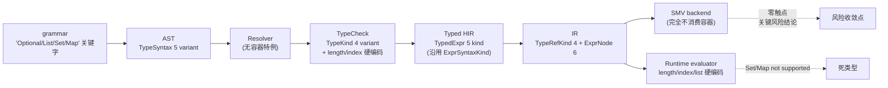
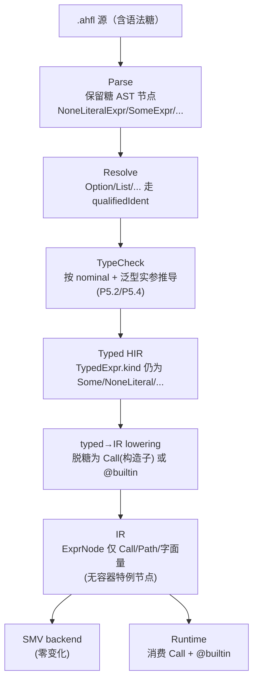
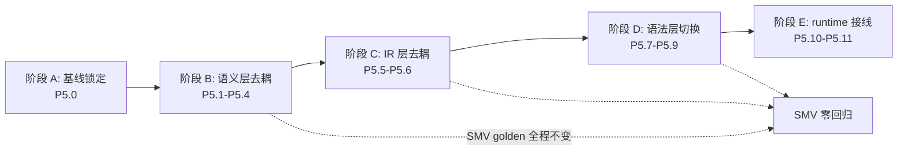

# AHFL 容器 Stdlib 化迁移 RFC

本文是主 RFC `docs/design/corelib-rfc.zh.md` **§6 / P5（容器 stdlib 化，最痛重构）** 的前置迁移 RFC，并**决议主 RFC §7 开放问题 6**（"P5 容器库化对现有 SMV 编码的迁移策略"）。

定位：仅讨论，不落代码。所有现状断言均带文件:行证据，均基于当前 `refactor/ast-variant` 分支实际盘点。

风格与主 RFC 严格一致：中文正文、技术对照用表格、EBNF 用 ```ebnf、AHFL 示例用 ```ahfl、架构/流程用 mermaid、诊断码用 `E::xxx`。

---

## 1. 背景与范围

### 1.1 当前容器在语言中的形态

`Optional / List / Set / Map` 当前是**语法关键字 + 语义层 TypeKind 一等公民 + runtime 焊死**的三层硬编码：

| 层 | 形态 | 证据 |
| --- | --- | --- |
| 文法关键字 | `'Optional' '<' type_ '>'` / `'List' '<' type_ '>'` / `'Set' '<' type_ '>'` / `'Map' '<' type_ ',' type_ '>'` | `grammar/AHFL.g4:42-45` |
| 字面量关键字 | `'some' '(' expr ')'` / `'none'` / `'[' exprList? ']'` / `'set' '[' ... ']'` / `'map' '[' ... ']'` | `grammar/AHFL.g4:244-245, 277-281` |
| 词法保留字 | `Optional List Set Map` 列入保留字集 | `docs/spec/core-language.zh.md:61` |
| AST 类型变体 | `OptionalType / ListType / SetType / MapType` 是 `TypeSyntaxNode` variant 一等分支 | `include/ahfl/compiler/frontend/ast.hpp:288-306, 320-323` |
| AST 表达式变体 | `NoneLiteralExpr / SomeExpr / ListLiteralExpr / SetLiteralExpr / MapLiteralExpr / IndexAccessExpr` | `ast.hpp:387, 420-422, 447-459, 481-484` |
| 语义类型 | `TypeKind::{Optional,List,Set,Map}` + `types::{OptionalT,ListT,SetT,MapT}` variant | `include/ahfl/compiler/semantics/types.hpp:38-40, 95-107, 120-128` |
| IR 类型引用 | `ir::TypeRefKind::{Optional,List,Set,Map}` | `include/ahfl/compiler/ir/types.hpp:147-150` |
| IR 表达式节点 | `ir::{NoneLiteralExpr,SomeExpr,ListLiteralExpr,SetLiteralExpr,MapLiteralExpr,IndexAccessExpr}` | `include/ahfl/compiler/ir/expr.hpp:96,129,162,167,178,202` |
| Runtime Value | `OptionalValue / ListValue` 是 `ValueNode` variant；**无 `SetValue / MapValue`** | `src/runtime/evaluator/value.hpp:52-63, 69-79` |
| Runtime 求值 | `list.length` / `list[i]` / list 字面量硬编码；`set[...]` / `map[...]` 直接 `not supported in v0.51` | `src/runtime/evaluator/evaluator.cpp:199, 525-526, 553, 617-619` |

### 1.2 目标态（来自主 RFC §3）

这五个容器在目标设计中是 **stdlib ADT / 泛型类型**：

| 容器 | 目标表示 | 语言机制 |
| --- | --- | --- |
| `Option<T>` | `enum Option<T> { Some(T), None }` | ADT（P1 已交付 `enum` payload） |
| `Result<T, E>` | `enum Result<T, E> { Ok(T), Err(E) }` | ADT |
| `List<T>` | 泛型容器类型（单态化为底层 array） | 用户泛型（P2）+ `@builtin` raw array |
| `Set<T>` | 泛型容器类型 | 用户泛型 + `@builtin` bit-vector |
| `Map<K, V>` | 泛型容器类型 | 用户泛型 + `@builtin` raw array |

关键字 `Optional / List / Set / Map / some / none` 退化为**语法糖**：解析层保留友好拼写，语义层完全是库。`some/none/[...]/set[...]/map[...]` 在 AST 解析后立即脱糖为 ADT 构造子 / 字面量构造。

### 1.3 本 RFC 范围

1. 容器在 7 个触点（grammar → AST → resolver → typecheck → typed HIR → IR → SMV backend）的逐层现状盘点
2. 从关键字到 stdlib 的分步迁移策略，每步可独立提交、保持 SMV golden 等价与 typecheck 行为不变
3. 语法糖设计（解析层保留、语义层是库）
4. `@builtin` 下沉清单（结构性 op 与算法的边界）
5. **决议主 RFC §7 开放问题 6**
6. 与 typed HIR 迁移（memory: `ahfl-typed-hir-migration-audit-v1`）的协调

**前置依赖**：P1（ADT `enum` 带 payload）+ P2（`fn` + 用户泛型 + 单态化）+ P3（`trait`，至少 `Foldable/Iterable`）必须先落地。本 RFC 在此前提下展开。

---

## 2. 现状盘点：容器的 7 层触点

下表给出每一层的触点位置、消费方式与"关键字耦合度"。耦合度越高，迁移改动越大。



### 2.1 Grammar（`grammar/AHFL.g4`）

| 触点 | 行 | 形态 | 耦合度 |
| --- | --- | --- | --- |
| `type_` 规则 | `42-45` | `'Optional' '<' type_ '>'` 等 4 个关键字分支 | 高 |
| `primaryExpr` | `244-245` | `'some' '(' expr ')'` / `'none'` 关键字 | 中 |
| `primaryExpr` | `241-243` | `listLiteral / setLiteral / mapLiteral` 三类字面量 | 中 |
| `listLiteral` | `277` | `'[' exprList? ']'` | 低（无关键字） |
| `setLiteral` | `279` | `'set' '[' exprList? ']'` | 中 |
| `mapLiteral` | `281` | `'map' '[' mapEntryList? ']'` | 中 |
| `postfixExpr` | `233` | `'[' expr ']'` 下标 | 低 |

### 2.2 AST（`include/ahfl/compiler/frontend/ast.hpp`）

| 触点 | 行 | 形态 | 耦合度 |
| --- | --- | --- | --- |
| `OptionalType` | `288-290` | `TypeSyntaxNode` variant 分支 | 高 |
| `ListType` | `293-295` | 同上 | 高 |
| `SetType` | `298-300` | 同上 | 高 |
| `MapType` | `303-306` | 同上 | 高 |
| `NoneLiteralExpr` | `387` | `ExprSyntaxNode` variant 分支 | 中 |
| `SomeExpr` | `420-422` | 同上 | 中 |
| `ListLiteralExpr` | `447-449` | 同上 | 中 |
| `SetLiteralExpr` | `452-454` | 同上 | 中 |
| `MapLiteralExpr` | `457-459` | 同上 | 中 |
| `IndexAccessExpr` | `481-484` | 同上 | 中（与容器无强绑，是通用下标） |
| `ExprSyntaxKind` | `140-161` | `Some / NoneLiteral / ListLiteral / SetLiteral / MapLiteral / IndexAccess` 6 个枚举值 | 中 |

### 2.3 Resolver（`src/compiler/semantics/resolver.cpp`）

**无容器特例**。`Optional/List/Set/Map` 当前是文法关键字分支，**不进入** `qualifiedIdent` 解析路径（`type_` 规则在 `'Optional' '<' ...` 分支终止，不下沉到 `qualifiedIdent`）。因此 resolver 对容器**零改动需求**——一旦 grammar 把关键字分支去掉、让 `Optional` 走 `qualifiedIdent` 路径，resolver 自动按普通类型符号处理。

证据：`grammar/AHFL.g4:39-45` 中 `type_` 的 `'Optional' '<' type_ '>'` 等分支优先于 `qualifiedIdent` 分支匹配；移除后 `Optional` 自动落入 `qualifiedIdent`。

### 2.4 TypeCheck（`src/compiler/semantics/`）

| 触点 | 文件:行 | 形态 | 耦合度 |
| --- | --- | --- | --- |
| `TypeResolver::resolve_type` | `type_resolver.cpp:41-46` | `Optional/List/Set/Map` 4 个分支直接 `types_.optional/list/set/map` 构造一等类型 | 高 |
| `types::OptionalT/ListT/SetT/MapT` | `types.hpp:95-107` | variant payload | 高 |
| `TypeKind::{Optional,List,Set,Map}` | `types.hpp:38-40` | enum | 高 |
| `TypeContext::optional/list/set/map` 工厂 | `types.cpp:242,255,268,281` | 一等类型构造 | 高 |
| 容器子类型规则 | `type_relations.cpp:328-371, 455-498` | `Optional<A><:Optional<B>` 等 4 条 covariance | 高 |
| `is_collection` | `types.hpp:227-229` | 辅助谓词 | 低 |
| `resolve_expression_field_access` | `expression_sema.cpp:229-273` | **只接受 `StructT`**，无 `length` 字段访问 | 低（已无耦合） |
| `check_index_access` | `typecheck_expr.cpp:1114-1150` | List/Set/Map 下标类型推导 | 中 |

**关键发现**：`field_access` 在 typecheck 层**根本不识别 `list.length`**——`.length` 只在 runtime evaluator（`evaluator.cpp:525`）硬编码为 `lv->items.size()`。typecheck 层若遇 `list.length` 会按 `InvalidMemberAccess` 报错（`expression_sema.cpp:239-244`）。这意味着 **`length` 从未进入 typecheck / typed HIR / IR / SMV**，只在 runtime 路径硬编码——这对 `@builtin` 下沉是好消息（下沉范围小）。

### 2.5 Typed HIR（`include/ahfl/compiler/semantics/typed_hir.hpp` + `src/compiler/ir/typed_hir_lower.cpp`）

| 触点 | 行 | 形态 | 耦合度 |
| --- | --- | --- | --- |
| `TypedExpr` 沿用 `ast::ExprSyntaxKind` | `typed_hir.hpp:199` | `Some/NoneLiteral/ListLiteral/SetLiteral/MapLiteral/IndexAccess` 6 kind | 中 |
| `TypedExprChildRole` | `typed_hir.hpp:39-51` | `CollectionElement / MapKey / MapValue / Index` 等 | 低 |
| `ConstValueKind::{Some,List,Set,Map,IndexAccess,MemberAccess}` | `typed_hir.hpp:59-78` | const 求值支持容器字面量 | 中 |
| `type_ref_from_type` 容器分支 | `typed_hir_lower.cpp:494, 500, 506, 512` | 4 个 `TypeRefKind::{Optional,List,Set,Map}` 生成分支 | 高 |
| `visit_some/list_literal/set_literal/map_literal/index_access` | `typed_hir_lower.cpp:638-763` | typed→IR 表达式 lowering | 中 |

### 2.6 IR（`include/ahfl/compiler/ir/`）

| 触点 | 文件:行 | 形态 | 耦合度 |
| --- | --- | --- | --- |
| `TypeRefKind::{Optional,List,Set,Map}` | `types.hpp:147-150` | enum | 高 |
| `TypeRef.first/second` | `types.hpp:174-175` | 容器 element/key/value 子引用 | 中 |
| `ir::{NoneLiteralExpr,SomeExpr,ListLiteralExpr,SetLiteralExpr,MapLiteralExpr,IndexAccessExpr}` | `expr.hpp:96,129,162,167,178,202` | `ExprNode` variant 6 分支 | 中 |
| `verify.cpp:653-662` | `src/compiler/ir/verify.cpp` | 容器 TypeRef 校验 | 中 |
| `ir_json.cpp:212-218, 483, 613-794` | `src/compiler/ir/ir_json.cpp` | JSON 序列化 | 中 |
| `opt/opt_print.cpp:45-51, opt_json.cpp:76-82` | `src/compiler/ir/opt/` | opt pass 打印 | 低 |

### 2.7 SMV Backend（`src/compiler/backends/smv/` + `src/verification/formal/`）

**零触点。** 全仓扫描 `src/compiler/backends/smv/` 与 `src/verification/formal/` 均不出现 `Optional / List / Set / Map` 容器类型消费。SMV backend 只消费：

1. Agent 状态机（`smv_indexing.cpp:8-57` `collect_state_variables`）
2. Workflow node lifecycle phase（同上，`kNodeIdle/Running/...`）
3. Temporal 原子映射（`formal-backend.zh.md:230-238`，`called/in_state/running/completed`）
4. Contract `requires/ensures/invariant/forbid`（formal-backend.zh.md:264-278）
5. bounded boolean/integer expression（`smv_helpers.hpp:194` `render_bounded_expr`）

容器**从不进入 SMV**。`tests/formal/` 目录无任何容器用法。这是**本 RFC 最关键的现状结论**，直接决定了开放问题 6 的风险等级（见 §6）。

### 2.8 Runtime Evaluator（`src/runtime/evaluator/`）

| 触点 | 行 | 形态 | 耦合度 |
| --- | --- | --- | --- |
| `ListValue` | `value.hpp:52-54` | `ValueNode` variant | 中 |
| `OptionalValue` | `value.hpp:61-63` | 同上 | 中 |
| **无 `SetValue / MapValue`** | `value.hpp:69-79` | `Set/Map` 是死类型 | — |
| `eval_list_literal` | `evaluator.cpp:199` | List 字面量求值 | 中 |
| `eval_some_expr` | `evaluator.cpp:74` | `some(...)` 求值 | 中 |
| `list.length` | `evaluator.cpp:525-526` | `lv->items.size()` 硬编码 | 中 |
| `list[i]` | `evaluator.cpp:538-564` | 下标求值 | 中 |
| `set[...]` / `map[...]` | `evaluator.cpp:617-619` | `not supported in v0.51` | — |

---

## 3. 目标态：容器作为 stdlib 类型

### 3.1 目标 AST / 类型表示

容器不再是 `TypeSyntaxNode` / `TypeKind` / `TypeRefKind` 的一等分支，而是通过普通 `NamedType` + 类型参数表达：

```ebnf
(* 移除：Optional/List/Set/Map 作为关键字分支 *)
(* type_ 规则简化为：*)
Type        ::= PrimitiveType | NamedType ;
NamedType   ::= QualifiedIdent [ "<" Type { "," Type } ">" ] ;   (* 通用泛型应用 *)
```

```ahfl
// 用户代码：表面语法不变（语法糖保留）
let xs: List<Int> = [1, 2, 3];
let m: Map<String, Int> = map["a": 1];
let o: Optional<Int> = some(42);

// 等价的目标语义（脱糖后）
let xs: std::collections::List<Int> = std::collections::List::from([1, 2, 3]);
let m: std::collections::Map<String, Int> = std::collections::Map::from([("a", 1)]);
let o: std::option::Option<Int> = std::option::Option::Some(42);
```

### 3.2 目标 stdlib 类型骨架（来自主 RFC §3.3）

```ahfl
module std::option;
enum Option<T> { Some(T), None }

module std::result;
enum Result<T, E> { Ok(T), Err(E) }

module std::collections;
@builtin raw_array
fn __list_new<T>() effect Pure -> List<T>;          // 空构造
fn __list_push<T>(xs: List<T>, x: T) effect Pure decreases 0 -> List<T>;
fn __list_get<T>(xs: List<T>, i: Int) effect Pure -> Optional<T>;  // 下标
fn __list_length<T>(xs: List<T>) effect Pure -> Int;                // length

pub type List<T> = ... ;   // 库私有底层 array 包装
pub type Set<T>  = ... ;
pub type Map<K, V> = ... ;
```

### 3.3 类型关系迁移

`types::{OptionalT,ListT,SetT,MapT}` variant 分支删除后，容器等价 / 子类型推导**统一走 nominal + 泛型实参推导**：

| 当前规则 | 目标规则 |
| --- | --- |
| `Optional<A> <: Optional<B>` iff `A <: B`（硬编码于 `type_relations.cpp:455-462`） | `std::option::Option<A> <: std::option::Option<B>` 通过泛型 variance 推导（声明点 variance 或 trait 约束） |
| `Map<K1,V1> <: Map<K2,V2>` iff `K1≡K2 ∧ V1<:V2`（`type_relations.cpp:486-498`） | 泛型实参 invariance（K）/ covariance（V）规则 |

P3 `trait` 落地后，容器 variance 由 trait 约束（`trait Covariant<+T>`）声明，typecheck 不再为容器写特例分支。

---

## 4. 迁移策略（分步，每步可独立提交 + 等价性测试）

总原则：**永远先松绑底层（IR/typecheck），再切语法层（grammar/AST）**。语法层是用户可见面，放在最后一切完成、底层已能消费"named + 泛型"形态时再做。

```mermaid
gantt
    title 容器 stdlib 化迁移（P5 内部分阶段）
    dateFormat X
    axisFormat %s
    section 准备
    P5.0 SMV golden 基线锁定            :p50, 0, 1W
    P5.1 stdlib 容器类型骨架           :p51, after p50, 2W
    section 语义层去耦
    P5.2 NamedType 支持泛型实参         :p52, after p51, 2W
    P5.3 容器 TypeKind → NamedType 别名  :p53, after p52, 2W
    P5.4 type_relations 容器特例删除     :p54, after p53, 1W
    section IR 层去耦
    P5.5 IR TypeRefKind 收敛             :p55, after p54, 1W
    P5.6 IR ExprNode 字面量脱糖          :p56, after p55, 2W
    section 语法层切换
    P5.7 grammar 关键字 → qualifiedIdent :p57, after p56, 1W
    P5.8 AST TypeSyntax variant 收敛      :p58, after p57, 1W
    P5.9 some/none/[...]/set[..]/map[..] 语法糖 :p59, after p58, 2W
    section 收尾
    P5.10 runtime @builtin 接线          :p510, after p59, 2W
    P5.11 死类型清理(Set/Map/UUID/Timestamp) :p511, after p510, 1W
```



### P5.0 — SMV golden 基线锁定（工程量 S，前置）

- 用当前 `refactor/ast-variant` 分支跑全量 `tests/formal/*`，把每个 `.smv` 输出固化为 golden。
- 引入 `tests/formal/golden/container-baseline/` 子目录，归档所有含容器类型的源（当前实际为空，但锁定现有 contract/invariant/workflow safety 的 SMV 输出）。
- **验收**：CI 在 P5.0 commit 后跑 SMV golden 全绿；后续每一步 P5.x 提交都以此 golden 作为等价性回归门槛。
- **回滚点**：每步 P5.x 若破坏 golden，立刻 revert 到上一步。

### P5.1 — stdlib 容器类型骨架（工程量 M）

- 在 `stdlib/` 新建 `std::option / std::result / std::collections` 三个模块的 `.ahfl` 源（依赖 P1 ADT + P2 泛型 + P3 trait 已落地）。
- 类型骨架先**不接线**到编译器内置符号表；仅作为可被 `import` 的普通用户模块存在。
- **验收**：`import std::option; let x: Option<Int> = Option::Some(1);` 可独立编译通过。
- **等价性**：不触碰任何现有触点，SMV golden 不变。

### P5.2 — `NamedType` 支持泛型实参（工程量 M）

- 扩展 `ast::NamedType`（`ast.hpp:283-285`）携带 `std::vector<Owned<TypeSyntax>> type_args`。
- `type_resolver.cpp:53` `resolve_named_type` 增加类型实参解析；`type_relations.cpp` 增加 nominal 泛型实参递归推导（替换未来要删的容器特例）。
- **验收**：用户自定义泛型 `struct Pair<A, B>` 可声明、可应用为 `Pair<Int, Bool>`、可参与等价/子类型。
- **等价性**：`Optional<T>` 等关键字分支**保持原状**，SMV golden 不变。
- **回滚点**：泛型实参字段为新增，旧代码无破坏。

### P5.3 — 容器 TypeKind → NamedType 别名（工程量 L，**核心切换点**）

- 在符号表里**预注入** `Optional / List / Set / Map` 为指向 `std::option::Option / std::collections::List / ...` 的内置别名（prelude 自动导入）。
- `type_resolver.cpp:41-46` 的 4 个容器分支改为：把 `ast::OptionalType/ListType/SetType/MapType` **翻译为带泛型实参的 NamedType**，再走标准 nominal 解析路径。
  - 即 `Optional<X>` → `NamedType("std::option::Option", [X])`，复用 P5.2 通路。
- 内部仍保留 `types::OptionalT/ListT/SetType/MapT` variant **暂不删除**——由 NamedType 解析回填为这些 variant，保证 `type_relations.cpp` 与 IR lowering 行为不变。
- **验收**：现有所有 `.ahfl` 源 typecheck 行为字节级一致；SMV golden 不变；新增"显式写 `std::option::Option<Int>`"也能编译。
- **等价性测试**：对每个含容器的现存 `.ahfl` 跑 typecheck，比对 type describe 输出。
- **回滚点**：别名注入可开关（feature flag），失败回退到关键字直构造。

### P5.4 — `type_relations` 容器特例删除（工程量 M）

- 删除 `type_relations.cpp:328-371`（equivalent 4 容器分支）与 `455-498`（subtype 4 容器分支）。
- 改为通用 nominal 泛型推导（P5.2 已建）：`Option<A> ≡ Option<B>` iff symbol 同 ∧ `A ≡ B`，递归走 solver。
- `types::{OptionalT,...}` variant 此步**仍保留**（P5.5 才删），但已不再需要特例代码——variant 等价/子类型由通用 nominal 规则覆盖。
- **验收**：`are_types_equivalent(Optional<Int>, Optional<Int>)` 仍 true；subtype 4 条规则行为不变；SMV golden 不变。
- **回滚点**：保留旧特例代码到独立函数，feature flag 切换。

### P5.5 — IR `TypeRefKind` 收敛（工程量 M）

- `ir::TypeRefKind::{Optional,List,Set,Map}` 4 个枚举值改为单一 `TypeRefKind::NominalGeneric`（携带 `canonical_name + type_args`）。
- `typed_hir_lower.cpp:494,500,506,512` 4 个容器分支合并为 1 个 nominal 分支。
- `verify.cpp:653-662`、`ir_json.cpp:212-218`、`opt/opt_{print,json}.cpp` 同步改为 nominal 序列化。
- **验收**：`emit-ir-json` 输出对容器类型的 JSON 表示变为 `{"kind":"nominal","name":"std::option::Option","type_args":[...]}`；现有 IR JSON golden 需更新（这是允许的格式演进，不是语义破坏）。
- **等价性**：SMV backend 不消费 IR 类型（§2.7 已确认），golden 不变。
- **回滚点**：双写新旧 TypeRefKind 一个 commit 周期。

### P5.6 — IR `ExprNode` 字面量脱糖（工程量 L）

- `ir::{NoneLiteralExpr,SomeExpr,ListLiteralExpr,SetLiteralExpr,MapLiteralExpr}` 在 typed→IR lowering 阶段脱糖为对 stdlib 构造子的 `Call`：
  - `none` → `std::option::Option::None`（无参构造子）
  - `some(e)` → `std::option::Option::Some(e)`
  - `[a, b, c]` → `std::collections::List::from([...])` 或直接 `List::Cons` 链（取决于库实现）
  - `set[...]` / `map[...]` 同理
- IR `ExprNode` variant 可保留这些 kind 作为** lowering 中间表示**，但在 emit 前统一 rewrite 为 `Call`。或直接删除 kind，让 typed→IR 一步到位脱糖（更彻底，推荐）。
- `IndexAccessExpr` 保留为通用语法节点，lowering 为对 `@builtin __list_get` 或 trait `Index::index` 的调用。
- **验收**：现有 `.ahfl` 源的 `emit-ir` 文本输出对容器字面量改为 Call 形态；SMV golden 不变。
- **等价性测试**：runtime evaluator 必须同步更新（见 P5.10），否则 evaluator 会断。

### P5.7 — Grammar 关键字 → `qualifiedIdent`（工程量 S）

- 删除 `grammar/AHFL.g4:42-45` 的 4 个容器类型分支，让 `Optional/List/Set/Map` 走 `qualifiedIdent`。
- `type_` 规则简化为 `primitiveType | qualifiedIdent`（P5.2 的泛型实参由 `<...>` 后缀词法处理）。
- **关键**：这一步会**改变 token 流**——`Optional` 从关键字 token 变为 IDENT token。需同步更新 `docs/spec/core-language.zh.md:61` 保留字表（移除 `Optional List Set Map`）。
- **验收**：现有所有 `.ahfl` 源仍能解析；typecheck 行为不变；SMV golden 不变。
- **回滚点**：grammar 改动是单文件，revert 简单。

### P5.8 — AST `TypeSyntax` variant 收敛（工程量 M）

- 删除 `ast::{OptionalType,ListType,SetType,MapType}` 4 个 variant（`ast.hpp:288-306, 320-323`）。
- `TypeSyntaxNode` variant 收敛；`-Wswitch` 强制所有 visitor 同步更新（`type_resolver.cpp`、`ast_printer.cpp`、`formatter.cpp`、`frontend.cpp` 等已盘点触点）。
- **验收**：编译通过（`-Wswitch -Werror` 是项目 gate）；SMV golden 不变。
- **风险**：visitor 覆盖遗漏会被 `-Wswitch` 拦下，风险低。

### P5.9 — `some/none/[...]/set[...]/map[...]` 语法糖（工程量 M）

见 §5 语法糖设计。此步把表达式层关键字脱糖，是用户可见面变化的最后一步。

### P5.10 — Runtime `@builtin` 接线（工程量 M，**与 P7 协调**）

- evaluator 改为消费 stdlib Call 节点（P5.6 已脱糖），不再硬编码 `list.length` / `list[i]` / `list_literal`。
- `value.hpp` 补 `SetValue / MapValue`（与主 RFC P7 共担）。
- `@builtin` hook（`__list_length / __list_get / __list_push / __list_new / __set_... / __map_...`）在 evaluator 实现。
- **验收**：`Set/Map` 不再 `not supported in v0.51`；`list.length` 在 runtime 工作如初。
- **回滚点**：与 P7 并行，独立验证。

### P5.11 — 死类型清理（工程量 S）

- 移除 UUID/Timestamp 在 typecheck/IR 的死分支（若 P7 已补 runtime，则保留为 stdlib 类型；否则按主 RFC P7 处理）。

---

## 5. 语法糖设计（解析层保留，语义层是库）

原则：**表面语法对用户零破坏**——`some/none/[...]/set[...]/map[...]` 与 `Optional<T>/List<T>` 拼写完全不变，只是语义实现从关键字迁到库。

### 5.1 类型语法糖

```ebnf
(* P5.7 后：Optional/List/Set/Map 是 prelude 默认导入的普通类型，不是关键字 *)
Type ::= PrimitiveType | QualifiedIdent [ TypeArgs ] ;
```

prelude（P6 交付）默认无修饰导入 `std::option::Option as Optional`、`std::collections::{List, Set, Map}`。用户写 `Optional<T>` 等价于 `std::option::Option<T>`，写 `List<T>` 等价于 `std::collections::List<T>`。

### 5.2 表达式语法糖

| 用户写法 | 脱糖目标 | 脱糖时机 |
| --- | --- | --- |
| `none` | `Option::None` | parse → AST（保留 `NoneLiteralExpr` 作为糖节点，typed→IR 时脱糖） |
| `some(e)` | `Option::Some(e)` | 同上（保留 `SomeExpr` 作为糖节点） |
| `[a, b, c]` | `List::from([a, b, c])` 或 `List::Cons(a, ...)` | 同上（保留 `ListLiteralExpr` 作为糖节点） |
| `set[a, b]` | `Set::from([a, b])` | 同上 |
| `map["k": v]` | `Map::from([("k", v)])` | 同上 |
| `xs[i]` | `Index::index(xs, i)` 或 `@builtin __list_get(xs, i)` | typed→IR（保留 `IndexAccessExpr` 作为通用下标节点） |
| `xs.length` | `xs.length()` 或 `@builtin __list_length(xs)` | parse 层不识别（见 §2.4），需新增字段访问糖 |

### 5.3 脱糖分层



**为什么糖节点保留到 typed→IR 才脱糖**：诊断信息（`E::type_mismatch` on `some(42)`）需要保留原始拼写与 source range；过早脱糖为 `Option::Some(42)` 会让诊断指向库构造子，用户体验下降。这与 Rust `Some(x)` / Swift `[1,2,3]` 的处理一致。

---

## 6. @builtin 下沉清单

主 RFC §3.3 规定 `@builtin` 是 stdlib 访问真正原语的极少数冻结入口。本 RFC 给出容器相关的下沉清单。

### 6.1 必须下沉为 `@builtin` 的结构性 op

判定准则：**离开 `@builtin` 就无法在库中实现的容器原语**。当前证据见 §2.4 / §2.8。

| op | 当前硬编码位置 | 下沉后签名 | 必须下沉的理由 |
| --- | --- | --- | --- |
| `__list_new<T>()` | `evaluator.cpp:199` `eval_list_literal`（隐式空构造） | `@builtin fn __list_new<T>() effect Pure -> List<T>` | 库无法凭空构造底层 array |
| `__list_push<T>(xs, x)` | 同上（字面量逐元素 push） | `@builtin fn __list_push<T>(xs: List<T>, x: T) effect Pure decreases 0 -> List<T>` | 库无法操作底层 array |
| `__list_length<T>(xs)` | `evaluator.cpp:525-526` `lv->items.size()` | `@builtin fn __list_length<T>(xs: List<T>) effect Pure -> Int` | 库无法读底层 array 大小 |
| `__list_get<T>(xs, i)` | `evaluator.cpp:538-564` `list[i]` | `@builtin fn __list_get<T>(xs: List<T>, i: Int) effect Pure -> Optional<T>` | 库无法按下标读底层 array |
| `__set_new<T>()` / `__set_insert` / `__set_contains` / `__set_size` | 无（Set 当前是死类型） | 同构于 List | 库无法操作底层 bit-vector |
| `__map_new<K,V>()` / `__map_insert` / `__map_get` / `__map_size` | 无（Map 当前是死类型） | 同构于 List | 库无法操作底层 array |
| `__option_some<T>(x)` / `__option_none` | `evaluator.cpp:74` `eval_some_expr` | 由 ADT 构造子直接表达，**不需要 `@builtin`** | ADT 构造子是 P1 已交付的语言机制 |

### 6.2 不下沉（属于库算法）

`fold / map / filter / contains / starts_with / sort / iter` 等算法**全部在 stdlib 用 `fn` + `trait`（`Foldable/Iterable/Functor`）实现**，不下沉。它们调用 `@builtin` 提供的原语组合而成。

### 6.3 数量冻结

容器相关 `@builtin` 共 **12 个**（List 4 + Set 4 + Map 4），加入主 RFC §3.3 的冻结清单。Option/Result 由 ADT 表达，不计入。

---

## 7. 决议开放问题 6：容器库化对现有 SMV 编码的迁移策略

> 主 RFC §7.6：**"P5 容器库化对现有 SMV 编码的迁移策略：最大工程风险，需 P5 前出独立迁移 RFC。"**

### 7.1 决议

**风险评级从主 RFC 原标注的"最大工程风险"下调为"中风险"。**

理由（基于 §2.7 现状证据）：**SMV backend 与容器类型零耦合**。`src/compiler/backends/smv/` 全部源码（`smv_collection.cpp / smv_formula.cpp / smv_indexing.cpp / smv_specs.cpp / smv.cpp`）与 `src/verification/formal/` 全部源码均不出现 `Optional / List / Set / Map` 容器类型消费。SMV backend 只建模 Agent 状态机、workflow lifecycle phase、temporal 原子、contract clause、bounded boolean/integer expression——这些都不依赖容器类型表示。

因此，容器从关键字迁移到 stdlib **不会改变任何 SMV 输出**，前提是迁移过程中保持 typecheck 行为不变（这是 P5.0–P5.4 的等价性测试覆盖范围）。

### 7.2 分阶段策略



| 阶段 | 范围 | SMV 验收 | 回滚点 |
| --- | --- | --- | --- |
| **A 基线锁定** | P5.0 SMV golden 归档 | 全绿基线 | — |
| **B 语义层去耦** | P5.1 stdlib 骨架 / P5.2 NamedType 泛型 / P5.3 容器 TypeKind→NamedType 别名 / P5.4 type_relations 特例删除 | 每步 SMV golden 全绿 | feature flag 切回关键字直构造 |
| **C IR 层去耦** | P5.5 TypeRefKind 收敛 / P5.6 ExprNode 字面量脱糖 | 每步 SMV golden 全绿（SMV 不消费 IR 类型，自动满足） | 双写新旧 TypeRefKind 一个 commit |
| **D 语法层切换** | P5.7 grammar / P5.8 AST variant / P5.9 表达式糖 | 每步 SMV golden 全绿 | grammar 单文件 revert |
| **E runtime 接线** | P5.10 @builtin 接线 / P5.11 死类型清理 | runtime 测试（SMV 不涉及） | 与 P7 并行独立验证 |

### 7.3 每阶段验收门禁

1. **阶段 A**：`tests/formal/golden/container-baseline/` 全绿。
2. **阶段 B**：每步提交后跑 (a) `tests/formal/*` SMV golden、(b) `tests/unit/compiler/semantics/type_relations*`、(c) `tests/unit/compiler/semantics/typecheck*`；三者全绿方可合并。
3. **阶段 C**：每步提交后跑 (a) SMV golden、(b) `emit-ir-json` golden（允许格式演进，需 PR 显式更新）、(c) `tests/unit/compiler/ir/*`。
4. **阶段 D**：每步提交后跑 (a) SMV golden、(b) 全量 `tests/unit/compiler/syntax/*` 解析回归、(c) 全量 `.ahfl` 样例编译。
5. **阶段 E**：runtime evaluator 单测 + 集成测试；与 SMV 无关。

### 7.4 最大残余风险（即便降级后仍需关注）

| 风险 | 触发条件 | 缓解 |
| --- | --- | --- |
| 容器类型在 contract `requires/ensures` 内出现 | 用户写 `requires: xs.length <= 16` | 当前 typecheck 层不识别 `.length`（§2.4），contract 内容器字段访问本就被 `InvalidMemberAccess` 拦下；迁移后由 P4 可验证子集（`length <= N` refinement）接管，SMV 编码按主 RFC §5 bounded array |
| 容器字面量进入 `safety/liveness` temporal 公式 | 用户写 `safety: always(xs.length > 0)` | 同上，当前被 typecheck 拦；迁移后容器不进 temporal，仍由 bounded refinement 在子集边界拦截 |
| `emit-ir-json` 下游工具消费旧 TypeRefKind | 外部 tooling 硬编码 `kind == "optional"` | P5.5 双写过渡一个 release 周期，文档标注 deprecation |
| 泛型单态化状态空间膨胀（P2 风险传染到 P5） | 容器泛型实例化爆炸 | 主 RFC §5 单态化预算 ≤32；stdlib 自身特化不计入用户额度 |

---

## 8. 与 typed HIR 迁移（memory: `ahfl-typed-hir-migration-audit-v1`）的协调

### 8.1 两个大重构的依赖关系

| 维度 | typed HIR 迁移（T1.4/T1.5/T1.6） | 容器 stdlib 化（P5） |
| --- | --- | --- |
| 触及层 | AST → typed HIR 的 **lowering 通路**（decl/stmt/temporal 三层迭代来源从 AST 切到 typed-tree） | 容器类型/表达式在 **7 层触点**的去硬编码 |
| 触及 `typed_hir_lower.cpp` | **改迭代入口**（`lower()` / `lower_declaration()` / `lower_block()`） | **改 type_ref_from_type 容器分支**（`typed_hir_lower.cpp:494-512`）+ `visit_some/list_literal/...`（`638-763`） |
| 共享基础设施 | typed_visit 调度器、flat store + index 模式、TypedDecl payload | 同上 |
| 风险叠加区 | typed HIR 迁移要求"完全不读 AST 结构"，容器迁移要求"容器 ExprNode 在 IR 层脱糖" | 二者都改 `typed_hir_lower.cpp` 表达式层 |

### 8.2 排序建议


**推荐顺序：typed HIR 迁移先于 P5 完成。** 理由：

1. P5.6（IR ExprNode 字面量脱糖）需要 typed→IR lowering 完全脱离 AST 结构（避免脱糖逻辑同时读 AST 与 typed-tree）。typed HIR 迁移的"表达式层 AST 依赖已清零"（memory §1）为此提供前提，但 decl/stmt/temporal 层尚未完成（memory §2-§4）。
2. P5.3 / P5.4 改 `type_resolver.cpp` 与 `type_relations.cpp`，typed HIR 迁移改 `typed_hir_lower.cpp`——两者**文件级隔离**，但共享 `Type` / `TypedExpr` 数据结构。typed HIR 迁移先稳定数据结构，P5 再改消费侧，避免双向耦合。
3. memory §6 推荐顺序 T1.5 → T1.4 decl → T1.6 评估 → T1.4 stmt → T1.4 temporal，本 RFC 接在其后。

### 8.3 可并行部分

| P5 阶段 | 可否与 typed HIR 迁移并行 | 说明 |
| --- | --- | --- |
| P5.0 基线锁定 | ✅ 完全并行 | 只跑测试、归档 golden |
| P5.1 stdlib 骨架 | ✅ 完全并行 | 纯新增 `.ahfl` 源，不触碰编译器 |
| P5.2 NamedType 泛型 | ⚠️ 部分 | 改 `ast.hpp` NamedType + `type_resolver.cpp`，与 typed HIR 的 decl 层迁移不冲突，但需协调 `ast.hpp` 合并 |
| P5.3-P5.6 | ❌ 串行 | 都改 `typed_hir_lower.cpp`，必须等 typed HIR 迁移完成 |
| P5.7-P5.9 语法层 | ✅ 并行 | 改 grammar/AST，与 typed HIR 迁移（改 lowering）文件隔离 |
| P5.10-P5.11 runtime | ✅ 与 P7 并行 | 独立于编译器前端 |

### 8.4 边界注释同步

`typed_hir_lower.cpp` 顶部 27–55 行（memory §7）记录了 DECLARATION / STATEMENT / TEMPORAL 三层的"intentional still consulted"边界。P5 完成后需**额外更新**：表达式层容器字面量脱糖（`visit_some/list_literal/...`）改为消费 typed-tree 的 `Some/ListLiteral/...` kind 并脱糖为 `Call`，不再读 AST 的 `SomeExpr/ListLiteralExpr` 结构字段。

---

## 9. 验收清单（汇总）

P5 全部完成的验收标准：

1. `Optional/Result/List/Set/Map` 是 stdlib 类型，grammar 中无 `'Optional'/'List'/'Set'/'Map'` 关键字分支（仅 prelude 别名）
2. `ast::TypeSyntaxNode` 无 `OptionalType/ListType/SetType/MapType` variant
3. `TypeKind` 无 `Optional/List/Set/Map` 枚举值（或保留为 nominal 别名 hook，由 P5.3 决定）
4. `ir::TypeRefKind` 无 `Optional/List/Set/Map`，统一为 `NominalGeneric`
5. `ir::ExprNode` 无容器字面量特例 kind（或仅保留为 lowering 中间糖节点，emit 前 rewrite 为 Call）
6. `some/none/[...]/set[...]/map[...]` 作为语法糖可用，脱糖为 stdlib 构造子
7. 容器相关 `@builtin` 共 12 个，数量冻结
8. `tests/formal/*` SMV golden 全程不变（§7 核心结论）
9. runtime `Set/Map` 不再 `not supported in v0.51`
10. `docs/spec/core-language.zh.md` 保留字表移除 `Optional List Set Map`；§4.1 类型宇宙、§4.3.2 子类型规则、§4.5 none 与空容器、§4.6.4 some/none 同步修订

---

## 10. 结论

本 RFC 基于当前 `refactor/ast-variant` 分支的 7 层触点逐行盘点，给出容器从关键字迁移到 stdlib 的分步策略（P5.0–P5.11），每步可独立提交、保持 SMV golden 等价。

**核心决议（开放问题 6）**：风险评级从主 RFC 原标注的"最大工程风险"下调为**"中风险"**——SMV backend 与容器类型零耦合（§2.7 证据），迁移全程 SMV golden 不变。最大残余风险在于 contract/temporal 内容器字段访问的边界处理，由 P4 可验证子集（bounded refinement）接管，与 SMV 编码无直接耦合。

与 typed HIR 迁移的协调：**typed HIR 迁移先于 P5 完成**，P5.0/P5.1/P5.7-P5.11 可并行，P5.2 部分并行，P5.3-P5.6 串行。

本 RFC 不落代码，等待 owner 评审。决议合并后回填主 RFC §7.6。
