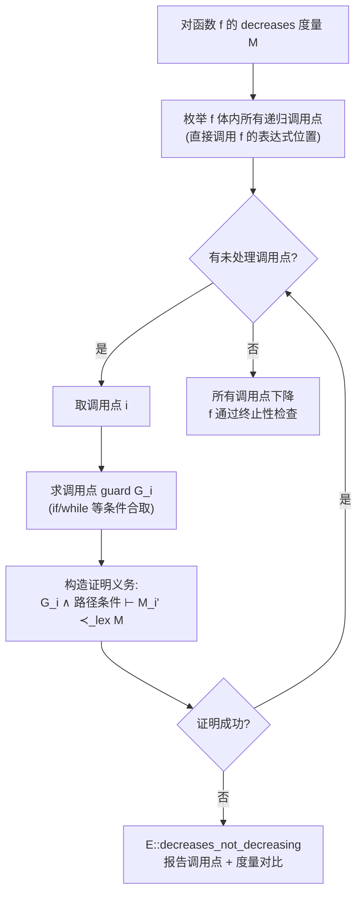
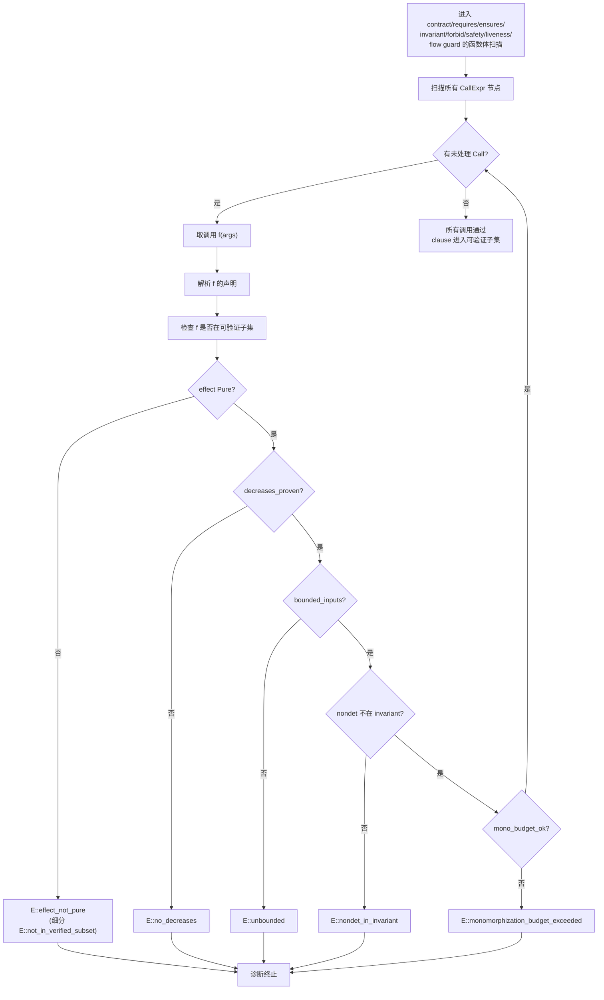
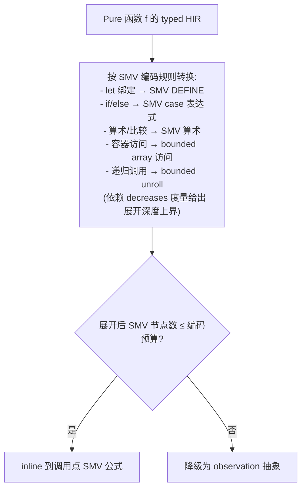

# AHFL Effect 系统与可验证子集详细设计

本文是 [corelib-rfc.zh.md](./corelib-rfc.zh.md) §3.2.4（effect 系统）、§3.4（可验证子集）、§5（SMV 编码）的**可实施细化**。术语、对标与诊断码命名与主 RFC 严格一致；遇到冲突以主 RFC 与 [core-language.zh.md](../spec/core-language.zh.md) §4.6.8 为准。

定位：本文**只冻结 effect 系统的静态语义与可验证子集的编译器检查规则**，以及它们与 SMV backend 的衔接。`emit-smv` 本身的语义边界仍由 [formal-backend.zh.md](./formal-backend.zh.md) 冻结，本文不重新定义 SMV lowering 的承诺范围，只定义"什么样的 AHFL 函数**有资格**被 lower"。

---

## 1. 目标与边界

### 1.1 目标

本文把主 RFC §3.2.4 / §3.4 / §5 拆成可实施细节，覆盖：

1. **effect 语法**：`Pure` / `Nondet` / `<Capability>+` 三类 effect 子句的精确语法与含义。
2. **effect 推导规则**：每种表达式 / 语句 / 调用如何合成 effect，以一张推导规则表给出。
3. **Pure 的精确定义**：确定 + 终止 + 无副作用 + 无 nondet 能力。
4. **decreases 终止度量**：度量表达式语法、lexicographic 下降证明算法、度量推导、失败诊断。
5. **可验证子集的静态检查算法**：进入 contract / requires / ensures / invariant / safety / liveness / flow guard 的调用检查流程，bounded refinement 推导算法，完整诊断码表。
6. **effect 系统与现有 capability effect / `ExprEffect` 的统一**：决议开放问题 3，给映射表与改名决策。
7. **SMV 编码与 effect 的映射**：可验证子集函数 → SMV 编码的转换规则，与 [formal-backend.zh.md](./formal-backend.zh.md) 衔接。

### 1.2 不在本文范围

- **闭包捕获 refinement 的运行期固化策略**（开放问题 2，由后续 closure RFC 决议）。
- **`std::result` 与错误模型交互**（开放问题 4）。
- **prelude stability policy**（开放问题 5）。
- **P5 容器库化对现有 SMV 编码的迁移策略**（开放问题 6，独立迁移 RFC）。
- **泛型 refinement 交互**（开放问题 7，P2 fn/泛型 RFC 覆盖）。

---

## 2. effect 系统完整规则

### 2.1 effect 语法（冻结）

```ebnf
EffectClause    ::= "effect" EffectSpec [ DecreasesClause ] ;
EffectSpec      ::= "Pure"
                  | "Nondet"
                  | CapabilityEffectList ;
CapabilityEffectList ::= CapabilityEffectRef { "+" CapabilityEffectRef } ;
CapabilityEffectRef  ::= QualifiedIdent ;     (* 引用一个 capability 声明 *)
DecreasesClause ::= "decreases" DecreasesExpr ;
DecreasesExpr   ::= DecreasesTerm { "," DecreasesTerm } ;     (* 元组 → lexicographic *)
DecreasesTerm   ::= Expr ;
```

约束：

1. `EffectClause` 只允许出现在 `fn` 签名、`trait` 内的 `FnSignature`、`capability` 声明的 `effect` block 与 `predicate` 隐式签名上（见 §2.4）。
2. `EffectSpec` 三选一，**互斥**：
   - `Pure`：见 §2.3 精确定义。
   - `Nondet`：调用真非确定环境源（`now` / 随机源 / 任何 reading wall-clock 的 `@builtin`）。
   - `CapabilityEffectList`：列出本函数体可能调用的 capability。每个 `CapabilityEffectRef` 必须解析到当前作用域可见的 `capability` 声明。
3. **缺省规则**：`fn` / `trait` method 签名**必须**显式写 `EffectClause`（对标 F\* 的 `TOT/ST/IO` 显式标注）。`predicate` 隐式为 `effect Pure`，用户不得手写 effect 子句（见 §2.4）。
4. `DecreasesClause` 对 `effect Pure` 的函数**必填**（非纯函数可选）——这是可验证子集的入场券（§3.1）。允许显式写 `decreases *` 表示"度量恒星/平凡终止"，仅对**非递归**且无循环的函数合法（用于 constant-complexity 的 helper）；递归函数禁止 `decreases *`。
5. `CapabilityEffectList` 是**上界集合**：函数体允许调用子集，但声明的列表必须**覆盖**所有可能被传递调用的 capability（compiler 校验，见 §2.6.4）。

```ahfl
// Pure + decreases：可验证子集
fn sum_le(xs: List<Int> where length <= 16)
    effect Pure decreases length(xs) -> Int {
    fold(xs, 0, \a, x -> a + x)
}

// Nondet：合法但不可进 invariant
fn backoff(n: Int) effect Nondet -> Int { ... }

// capability effect：列出可能调用
fn charge_and_refund(req: Payment)
    effect ChargeCard + RefundCard -> Receipt { ... }
```

### 2.2 effect 的抽象定义

effect 在静态语义层是函数签名上的一个**判断**：

```text
Σ ; Γ ⊢ f : T1 × ... × Tn -> T  ⨉  E(f)
```

其中 `E(f)` 取下列四种形态之一：

| 形态 | 含义 | 是否确定 | 是否终止 | 是否无副作用 |
| --- | --- | --- | --- | --- |
| `Pure` | 纯、确定、终止、无副作用 | 是 | 是（必带 decreases） | 是 |
| `Nondet` | 非确定（真随机 / wall-clock） | 否 | 不要求 | 视实现 |
| `{c1, ..., ck}` | 调用 capability 集合 `ci` | 视 capability 实现 | 视实现 | 视实现 |
| `⊥`（错误恢复哨兵） | typecheck 失败时的占位 | — | — | — |

effect 的**偏序** `⊑`：

1. `Pure ⊑ Pure`
2. `Pure ⊑ Nondet`，`Pure ⊑ {c1,...,ck}`
3. `Nondet` 与 `{c1,...,ck}` 之间**不可比**——一个函数不能同时声明 `Nondet` 和 capability（要么是读环境随机源，要么是写 capability，二选一）。若同时需要，必须把读随机源的代码提到另一个函数。
4. `{A} ⊑ {B}` 当且仅当 `A ⊇ B`（**反向**：声明越多 capability，effect 越强；调用者需要的能力越多，effect 越大）。

effect join（用于子表达式合成，见 §2.6）：

```text
join(Pure, E)            = E
join(E, Pure)            = E
join({A}, {B})           = {A ∪ B}
join(Nondet, Nondet)     = Nondet
join(Nondet, {c...})     = ⊥  (* 不允许：报 E::effect_incompatible *)
```

`⊥` 用于错误恢复，不传染二级诊断（对标 `core-language.zh.md` §4.1 的 `Error` 双向通配规则）。

### 2.3 Pure 的精确定义

一个函数 `f` 标注为 `effect Pure`，**当且仅当**下面四条全部成立：

| 属性 | 精确含义 | 校验手段 |
| --- | --- | --- |
| **确定性** | 相同输入产生相同输出（无随机源、无 wall-clock、无外部 I/O 读） | 静态：函数体不含 `Nondet` 函数调用、不含 `now`/随机 `@builtin` |
| **终止** | 对所有合法输入，求值在有限步内结束 | 静态：`decreases` 度量证明（§3.2） |
| **无副作用** | 求值不修改任何外部状态、不调用 capability | 静态：effect 推导结果为 `Pure`（§2.6） |
| **无 nondet 能力** | 即便不直接调用 `Nondet`，间接传递也不允许 | 静态：effect 推导闭包为 `Pure` |

对标：

- **Dafny**：`function` / `lemma` 默认 `reads {}`、`requires`、`decreases`；编译器证终止。
- **F\***：`TOT`（total）effect = Pure 的等价；`GT`（ghost total）/ `ST`（state）/ `IO` 严格更宽。
- **SPARK Ada**：`Global => null`、`Depends => null` 的函数。

Pure 的推导结果（§2.6）等于 `E(f) = Pure` **等价于**上述四条全部静态可证。

### 2.4 与现有 `predicate` 声明的关系

现有 `predicate p(args) -> Bool`（见 [core-language.zh.md](../spec/core-language.zh.md) §3.4）是 Pure 函数的**特例**，语义与 effect 系统对齐如下：

```text
predicate p(x: T) -> Bool;
≡
fn p(x: T) effect Pure -> Bool;        (* 不可写 decreases，因无函数体 *)
```

约束：

1. `predicate` 不允许带 `effect` 子句（隐式 Pure）；写 `predicate p(...) effect ...` 直接报 `E::effect_on_predicate`。
2. `predicate` 不允许带 `decreases`（因为它是声明而非定义——函数体在 verification 阶段以未解释符号处理，对标 Dafny `predicate`）。
3. `predicate` 不得调用 `capability`、不得调用非 Pure 函数（继承自 [core-language.zh.md](../spec/core-language.zh.md) §3.4 语义约束 3，由 §2.6 effect 推导自然落实）。

P4 落地后 `predicate` 与 `fn ... effect Pure` 的**唯一差别**是：`predicate` 无函数体、作为 verification 中的未解释布尔符号；`fn ... effect Pure` 有函数体、verification 中作为**可展开定义**。

### 2.5 capability effect 的表达

主 RFC 开放问题 3 的核心：`effect <Capability>+` 与现有 capability 的 `CapabilityEffectKind`（`Unknown` / `Read` / `ExternalSideEffect` / `DurableWrite` / `FinancialWrite`，见 [ast.hpp](../../include/ahfl/compiler/frontend/ast.hpp) `CapabilityEffectKind`）如何合一。

**决议（见 §6）**：`CapabilityEffectKind` 是 capability 声明**自身**的 effect profile（用于 assurance / recovery obligation，见 [formal-backend.zh.md](./formal-backend.zh.md) "Call/Effect/Recovery Event 边界"），而 `effect <Capability>+` 是**函数签名**对"我会调到哪些 capability"的上界声明。二者是**正交维度**：

```text
capability ChargeCard(req: Payment) -> Receipt {
    effect: financial_write;           // ← CapabilityEffectKind (capability 自身的副作用强度)
    receipt: required;
}

fn settle(req: Payment)
    effect ChargeCard + RefundCard     // ← CapabilityEffectList (函数调用了哪些 capability)
    -> Receipt { ... }
```

一个函数标 `effect ChargeCard`，编译器把 `ChargeCard` 的 `CapabilityEffectKind` 作为该调用点的 effect 强度记录到 typed HIR 的 effect trace 上（供 assurance 分析），但**函数签名层面只关心 capability 身份，不关心其 effect profile**——effect profile 由 capability 声明自身承载，不需要在函数上重复声明。

### 2.6 effect 推导规则表

effect 推导在 typecheck 阶段与类型判断同时进行（对标 [core-language.zh.md](../spec/core-language.zh.md) §4.6.8 现有 `ExprEffect` 推导，但语义维度扩展为 §2.2 的 effect 偏序）。

对每个表达式 / 语句，记其推导 effect 为 `ε(x)`，取值为 `Pure` / `Nondet` / `{c1,...,ck}` / `⊥`。

#### 2.6.1 表达式 effect 推导

| 表达式 | 推导规则 | 备注 |
| --- | --- | --- |
| 字面量（`true`/`123`/`3.14`/`"s"`/`30s`/`none`/`3.14d`） | `Pure` | 对应现 `ExprEffect::Pure` |
| `some(e)` | `ε(e)` | 容器构造无副作用 |
| Path 引用 `x` / `input.f` / `ctx.f` | `Pure` | 变量/字段读取无副作用 |
| `EnumName::Variant` | `Pure` | 枚举变体引用 |
| `const c` | `Pure` | 常量引用无副作用；区分 `ConstOnly` 见 §2.7 |
| `e.f`（字段访问） | `ε(e)` | 字段访问无副作用 |
| `e[i]`（下标） | `ε(e) join ε(i)` | 下标无副作用 |
| 一元 `!e`/`-e`/`+e` | `ε(e)` | |
| 二元 `+ - * / % == != < > <= >= and or =>` | `ε(lhs) join ε(rhs)` | 所有运算符 effect 透传 |
| `[e1, ..., en]` / `set[...]` / `map[...]` | `join(ε(e1), ..., ε(en))` | 字面量构造无副作用 |
| `S { f1: e1, ... }` | `join(ε(e1), ...)` | 结构体字面量无副作用 |
| `(e)` 分组 | `ε(e)` | |
| `p(args)`（predicate 调用） | `Pure` | predicate 隐式 Pure |
| `k(args)`（capability 调用） | `{k}` | capability 调用是该 capability 的单元素集 |
| `f(args)`（fn 调用） | `E(f) join ε(args)` | fn 调用取被调函数的声明 effect；并合实参 effect |
| `λ(x) -> e`（闭包表达式） | `ε(e) ∧ 捕获 effect` | 见 §2.6.3 |
| `now` / 随机源 `@builtin` | `Nondet` | 真非确定源 |

#### 2.6.2 语句 effect 推导

| 语句 | 推导规则 | 备注 |
| --- | --- | --- |
| `let x = e;` | `ε(e)` | 绑定本身无副作用 |
| `lvalue = e;` | `ε(e)` | flow 内对 `ctx` 的赋值；不影响 Pure 判定（局部状态突变不违反 Pure 的"无副作用"，因为 Pure 的"副作用"特指外部副作用，对标 Dafny `reads {}`） |
| `if c then...else...` | `ε(c) join ε(then) join ε(else)` | 三支 effect 合取 |
| `goto S;` | `Pure` | 控制流跳转无副作用 |
| `return e;` | `ε(e)` | |
| `assert c;` | `ε(c)` | assert 无副作用（失败时 abort，不视为副作用） |
| `expr;`（表达式语句） | `ε(expr)` | |

**注意**：上述"无副作用"语义需要细化"副作用"的范围。在 Pure 函数体内，**不允许**出现赋值语句（`ctx` 突变），因为 Pure 函数没有 `ctx`（Pure 函数的局部状态是栈绑定 `let`，不是 agent context）。Pure 函数体内出现赋值 → `E::effect_not_pure`（赋值目标不存在或不可写）。这一约束在 §2.6.4 的"Pure 函数体校验"中检查。

#### 2.6.3 闭包 effect 推导

闭包 `\x -> e` 的 effect 推导：

1. 闭包的 effect = 其函数体 `e` 的 effect（按 §2.6.1/2.6.2 推导）。
2. 捕获：若闭包捕获了局部变量 `y`，则 `ε(y)` 已是 Pure（局部变量 effect 永远 Pure，见 §2.6.1 Path 规则），**捕获不引入额外 effect**。
3. **例外**：若闭包作为函数参数传递，被调函数声明了闭包参数的 `Fn(...)` 类型——闭包类型签名上的 effect 由被调函数负责。当前阶段（P2/P4）**只支持 Pure 闭包**（`Fn(A)->B` 隐式 effect Pure）；非 Pure 闭包（`Fn(A) effect Nondet -> B`）留待后续 RFC。
4. 闭包内调用非 Pure 函数 → 闭包 effect 非 Pure → 若被传给要求 Pure 的位置（如 `fold` 回调、`requires` 表达式），报 `E::effect_not_pure`。

#### 2.6.4 函数体 effect 校验

对声明 `effect E` 的函数 `f`，typecheck 阶段做下面校验：

| 校验项 | 通过条件 | 失败诊断 |
| --- | --- | --- |
| 函数体推导 effect 子句化 | 把 `ε(body)` 转成一个 `EffectSpec`（`Pure` / `Nondet` / `CapabilityEffectList`） | — |
| 声明覆盖 | `ε(body) ⊑ E(f)`（声明的 effect 是体推导 effect 的上界） | `E::effect_underdeclared` |
| Pure 完整性 | 若 `E(f) = Pure`，则 `ε(body) = Pure` 且函数体不含赋值、不含 `Nondet`/capability 调用 | `E::effect_not_pure` |
| Pure 终止性 | 若 `E(f) = Pure`，则必须有 `decreases` 度量且度量证明通过（§3.2） | `E::no_decreases` / `E::decreases_not_decreasing` |
| Nondet 不与 capability 共存 | 若 `E(f) = Nondet`，体推导 effect 不能含 capability；反之亦然 | `E::effect_incompatible` |
| Capability effect list 完整 | `ε(body)` 中出现的每个 capability 必须在声明列表里 | `E::effect_underdeclared` |
| Capability 在白名单（flow handler 内） | 若 `f` 是 flow handler 的内联函数体，capability 必须在 agent `capabilities` 白名单内 | `E::capability_not_in_allowlist`（继承自 [core-language.zh.md](../spec/core-language.zh.md) §4.6.5） |

`E::effect_underdeclared` 与 `E::effect_not_pure` 是 §2.6.4 的核心新诊断。

---

## 3. decreases 终止度量

### 3.1 度量表达式语法

度量表达式的语法定义见 §2.1 `DecreasesExpr`：

```ahfl
decreases length(xs)                              // 单项度量：nat
decreases (n, length(xs))                         // 元组度量：lexicographic
decreases (n, length(xs), depth(tree))            // 多项 lexicographic
decreases *                                       // 平凡度量（仅非递归函数）
```

度量语法约束：

1. `DecreasesTerm` 必须是 **Pure 表达式**，类型为 `Int` 或任何**良基序**（well-founded order）的可推导类型。当前阶段只接受 `Int`（含非负 `Int`）；未来若引入子类型序（如 ADT 的结构序），由后续 RFC 扩展。
2. 元组度量 `(t1, ..., tn)` 按 **lexicographic ordering** 比较（见 §3.2）。
3. `decreases *` 表示度量恒为星（任意序下的 top），仅用于证明"函数非递归"或"递归深度有限且不可达"。**仅对非递归函数合法**；递归函数禁止 `decreases *`，否则报 `E::decreases_star_on_recursive`。

### 3.2 下降证明算法（lexicographic ordering）

对每个**递归调用点** `f(args')` 在 `f(args)` 体内，编译器证明：

```text
∀ 合法前置条件 ∧ 调用点 guard,
   Measure(args')  ≺_lex  Measure(args)
```

其中 `Measure(args)` 是 `f` 的 `decreases` 度量在调用点**入口参数**上求值，`Measure(args')` 是递归调用实参上的求值，`≺_lex` 是 lexicographic 严格偏序。

#### 3.2.1 lexicographic 比较

度量 `M = (m1, m2, ..., mn)` 与 `M' = (m1', ..., mn')`：

```text
M ≺_lex M'
⟺  ∃ i ∈ [1, n],
      (∀ j < i, mj = mj')  ∧  (mi < mi' 在对应序下)
```

- 数值序 `mi < mi'`：`Int` 上的标准 `<`；要求 `mi ≥ 0`（非负）以保证良基。
- 若某 `mi` 可能为负，编译器要求函数前置 `requires` 给出 `mi ≥ 0` 的证明，否则报 `E::decreases_not_well_founded`。

#### 3.2.2 证明流程



证明手段：

1. **直接数值比较**：`length(xs') < length(xs)` 这种直接可由 SMT 处理的，走 `decreases prover`（轻量级 SMT，对标 Dafny 的 decreases prover）。
2. **结构性引理**：若 `xs' = xs.tail` 等，编译器查 trait `Foldable`/`Iterable` 的 `length` 引理（`length(tail(xs)) < length(xs) when length(xs) > 0`）。
3. **失败时**：报 `E::decreases_not_decreasing`，附调用点 source range、入口度量、调用点度量、比较失败原因。

### 3.3 递归 fn 的度量推导

对**有函数体**的递归 fn，度量必须用户显式提供（`decreases ...`）。编译器**不自动推导**度量——这是 Dafny 的标准做法（自动推导在普遍情形下不可判定，且会产生隐式依赖）。

对**无函数体的递归声明**（如 trait method signature）：

1. trait method signature 上的 `decreases` 是**契约的一部分**，由实现 `impl` 覆盖。
2. trait method 若声明 `decreases M`，每个 `impl` 实现的度量 `M_impl` 必须满足 `M_impl ≼_lex M`（即实现的度量比 trait 声明的更"强"——更小或相等），保证 trait 调用方的下降证明对实现仍成立。
3. 实现的度量比 trait 声明**弱** → `E::decreases_impl_weaker`。

### 3.4 失败诊断码

| 诊断码 | 触发条件 | 备注 |
| --- | --- | --- |
| `E::no_decreases` | `effect Pure` 函数无 `decreases` 度量 | 仅 Pure 必填；非 Pure 可选 |
| `E::decreases_not_decreasing` | 某递归调用点的度量 `M_i' ≺_lex M` 证明失败 | 附调用点与度量对比 |
| `E::decreases_not_well_founded` | 度量项可能为负（无 `requires ≥ 0` 证明） | 良基性失败 |
| `E::decreases_star_on_recursive` | 递归函数使用 `decreases *` | `*` 仅对非递复合法 |
| `E::decreases_impl_weaker` | trait method 实现的度量比 trait 声明弱 | 度量覆盖不满足 |

---

## 4. 可验证子集编译器静态检查

### 4.1 可验证子集的精确定义

一个 AHFL 函数 `f` **属于可验证子集**，当且仅当：

```text
verified(f) ≡  effect Pure(f)
              ∧ decreases_proven(f)
              ∧ bounded_inputs(f)
              ∧ mono_budget_ok(f)
```

| 条件 | 含义 | 校验位置 |
| --- | --- | --- |
| `effect Pure(f)` | f 标 `effect Pure` 且函数体推导 effect 也是 Pure | §2.6.4 |
| `decreases_proven(f)` | f 有 `decreases` 度量，且所有递归调用点通过下降证明 | §3.2 |
| `bounded_inputs(f)` | f 的所有参数类型有 bounded refinement（编译器能推出有限界） | §4.3 |
| `mono_budget_ok(f)` | f 的单态化实例数 ≤ 用户预算（默认 32） | §4.4 |

可验证子集的"进入点"：`contract` / `requires` / `ensures` / `invariant` / `forbid` / workflow `safety` / workflow `liveness` / `flow guard`（`if` 条件、`assert` 条件）中**调用**的所有函数都必须属于可验证子集。

### 4.2 调用检查流程



**特殊检查（invariant 语境）**：

| 语境 | 额外检查 |
| --- | --- |
| `contract ... invariant: ...` | 公式内不得出现 `now` 或任何 `Nondet` 函数调用 → 否则 `E::nondet_in_invariant` |
| `contract ... invariant:` 中的 `called(k)` | `called(k)` 是 temporal atom（[core-language.zh.md](../spec/core-language.zh.md) §3.11），不是函数调用，**不**走上述流程；其合法性继承自 §4.7.3 |
| `workflow ... safety/liveness:` 中的 `running/completed/called` | 同上，是 temporal atom |

### 4.3 bounded refinement 推导算法

bounded refinement 是 `T where Pred` 形式的类型 refinement，其中 `Pred` 限定 `T` 的某个数值维度有有限上界。bounded 推导的目标：对每个函数参数类型 `T`，编译器证明 `T` 能编码为有限 SMV 状态。

#### 4.3.1 类型 → bound 的映射

| 类型 | bounded 条件 | 编码上界（SMV） |
| --- | --- | --- |
| `Int` | `where v <= N`（或 `where v in [a, b]`） | `b - a` 个 bit 槽 |
| `String` | `where length <= N` | N 个 char 槽 |
| `List<T>` | `where length <= N` 且 `T` bounded | N 个 `T` 槽 + valid bit |
| `Set<T>` | `T` 是有限域类型（枚举）| bit-vector over finite `T` |
| `Map<K, V>` | `K` 是有限域 + `V` bounded | array over finite `K` |
| `Optional<T>` | `T` bounded | `T` + valid bit |
| `Bool` / 枚举 | 永远 bounded | 1 bit / 枚举基数 |
| ADT (`enum` with payload) | payload 类型 bounded | tagged union over bounded payload |

#### 4.3.2 推导规则

```mermaid
flowchart TD
    A["参数类型 T"] --> B{T 有显式 where refinement?}
    B -->|是| C["取 refinement 中的 bound<br/>(length <= N / v <= N)"]
    B -->|否| D{T 是有限域类型?<br/>(Bool / enum / 受限 String min,max)}
    D -->|是| E["bound = 类型基数"]
    D -->|否| F{T 是容器/ADT?<br/>元素/载荷可推导 bound?}
    F -->|是| G["递归推导元素 bound"]
    F -->|否| H["E::unbounded<br/>报告参数 + 类型"]
    C --> I["合并：取最紧 bound"]
    E --> I
    G --> I
    I --> J{bound ≤ 全局 SMV 编码预算?}
    J -->|是| K["bounded 通过"]
    J -->|否| L["E::unbounded<br/>(SMV 编码规模超预算)"]
```

推导细节：

1. **多 refinement 合取**：`List<Int> where length <= 16 where Int.v <= 255` 取每个维度的最紧约束。
2. **跨函数传递**：若 `f(x: List<Int> where length <= 16)` 调用 `g(x: List<Int>)`（`g` 不带 refinement），`g` 在可验证子集语境下必须推导出 `length <= 16` 的 bound（从 `f` 的前置 refinement 流入）。
3. **闭包捕获**：闭包捕获的容器，其 bound 在**闭包定义点固化**（开放问题 2 的当前决议——见 §7）。
4. **`now` / wall-clock**：`Timestamp` 类型本身不是 bounded 问题；问题是 `now`（wall-clock 读取）是 `Nondet`，进 invariant 报 `E::nondet_in_invariant`（见 §4.2）。

### 4.4 单态化预算

进可验证子集的函数特化实例数（即在编译期生成的 typed HIR 节点副本数）设上限，缓解单态化状态空间膨胀（对标主 RFC §3.5）：

| 预算 | 默认值 | 计入方式 |
| --- | --- | --- |
| 用户函数单态化预算 | 32 | 每个用户函数特化实例 +1 |
| stdlib 自身特化预算 | 独立，不计入用户额度 | stdlib 内部特化（如 `List<Int>`、`Option<String>`）独立池 |

超出预算 → `E::monomorphization_budget_exceeded`，附超出预算的特化链。

预算由编译期命令行 `--mono-budget <N>` 覆盖（仅调高，不可调低到 0）。

### 4.5 完整诊断码表

| 诊断码 | 触发条件 | 触发阶段 | 备注 |
| --- | --- | --- | --- |
| `E::not_in_verified_subset` | 伞码：进入可验证子集语境的调用不符合子集条件 | typecheck | 总是附带下列细分码之一 |
| `E::effect_not_pure` | 调用点的被调函数 effect 非 Pure | typecheck | §4.2 V1 |
| `E::no_decreases` | Pure 函数无 decreases 度量 / 度量证明失败 | typecheck | §4.2 V2；细分 `E::decreases_not_decreasing` |
| `E::decreases_not_decreasing` | 递归调用点度量不下降 | typecheck | §3.4 |
| `E::decreases_not_well_founded` | 度量项良基性失败 | typecheck | §3.4 |
| `E::decreases_star_on_recursive` | 递归函数使用 `decreases *` | typecheck | §3.4 |
| `E::decreases_impl_weaker` | trait method 实现的度量弱于 trait 声明 | typecheck | §3.4 |
| `E::unbounded` | 参数类型无有限 bound / bound 超 SMV 编码预算 | typecheck | §4.3 |
| `E::nondet_in_invariant` | invariant / safety / liveness 公式出现 `Nondet` 函数或 `now` | typecheck | §4.2 特殊检查 |
| `E::monomorphization_budget_exceeded` | 单态化特化数超预算 | typecheck | §4.4 |
| `E::effect_underdeclared` | 函数声明 effect 未覆盖体推导 effect | typecheck | §2.6.4 |
| `E::effect_incompatible` | `Nondet` 与 capability effect 共存 | typecheck | §2.6.4 |
| `E::effect_on_predicate` | `predicate` 声明带了 `effect` 子句 | parse/typecheck | §2.4 |
| `E::effect_not_pure_assign` | Pure 函数体内出现赋值（无 `ctx` 可写） | typecheck | §2.6.2 备注 |

每个诊断附 source range、调用链、相关度量/bound/effect 信息，方便用户定位（对标 [formal-backend.zh.md](./formal-backend.zh.md) "Counterexample Source Mapping" 的 source range 习惯）。

---

## 5. effect 推导结果到 typed HIR

effect 推导结果是 typed HIR 的**附加静态事实**，与现有 `ExprEffect` 在 typed HIR 中的角色一致（[effects.hpp](../../include/ahfl/compiler/semantics/effects.hpp)），但维度扩展。

### 5.1 typed HIR 上的 effect 标注

每个 typed HIR 节点（`TypedExpr` / `TypedStmt` / `TypedFn`）携带：

```text
effect : EffectJudgement
       = Pure | Nondet | CapabilitySet(caps) | Bottom
```

```text
decreases_measure : Option<(DecreasesTerm, ...)>    (* 仅 Pure 函数有 *)
verified_subset_eligible : Bool                      (* 是否在可验证子集 *)
```

typed HIR 序列化时（对标 `typed_hir_serialization.cpp` 现有 `effect` 字段），扩展为：

```json
{
  "effect": "Pure" | "Nondet" | { "capabilities": ["ChargeCard", ...] } | "Bottom",
  "decreases": ["length(xs)"] | null,
  "verified_subset": true | false
}
```

### 5.2 与现 `is_pure` 二元判断的关系

现有 `is_effect_pure(ExprEffect)` 返回 `bool`（[effects.cpp](../../src/compiler/semantics/effects.cpp)）。在新 effect 系统下：

```text
is_pure(e) ≡  effect(e) = Pure
```

`is_effect_pure` 保留为兼容入口（§6 决议），内部委托给新的 effect 判断。

---

## 6. 决议：effect 系统与现有 capability effect / `ExprEffect` 的统一粒度

主 RFC 开放问题 3 的决议。本节是**结论 + 理由**。

### 6.1 现有 `ExprEffect` 6 级 → 新 effect 系统推导结果的映射

现有 `ExprEffect` 6 级（`Pure` / `ConstOnly` / `PredicateCall` / `CapabilityCall` / `ExternalEffect` / `Unknown`）是**表达式层面**的 effect 分级，定义在 [core-language.zh.md](../spec/core-language.zh.md) §4.6.8 与 [effects.cpp](../../src/compiler/semantics/effects.cpp)。新 effect 系统（§2.2）是**函数签名层面**的判断。

决议：**`ExprEffect` 6 级作为新 effect 系统在表达式层面的推导中间结果保留**，新 effect 系统的最终判断（`Pure` / `Nondet` / `CapabilitySet`）由 `ExprEffect` 推导结果**投影**得到。

映射表：

| 现有 `ExprEffect` | 新 effect 系统投影 | 说明 |
| --- | --- | --- |
| `Pure` | `Pure` | 字面量、变量、字段、纯算术 |
| `ConstOnly` | `Pure` | 常量/枚举引用，仍是 Pure 的子情形（保留细分用于 const folding） |
| `PredicateCall` | `Pure` | predicate 隐式 Pure（§2.4） |
| `CapabilityCall` | `CapabilitySet({k})` | capability 调用，effect 是该 capability 的单元素集 |
| `ExternalEffect` | `CapabilitySet({k})` 且 `k.CapabilityEffectKind ∈ {ExternalSideEffect, DurableWrite, FinancialWrite}` | effect profile 在 capability 声明上，投影到函数 effect 时只关心 capability 身份 |
| `Unknown` | `Bottom`（`⊥`） | 无法判定的 effect，作为错误恢复哨兵，不传染二级诊断 |

投影函数：

```text
project : ExprEffect -> EffectJudgement
project(Pure)            = Pure
project(ConstOnly)       = Pure
project(PredicateCall)   = Pure
project(CapabilityCall)  = CapabilitySet({called_capability})
project(ExternalEffect)  = CapabilitySet({called_capability})
project(Unknown)         = Bottom
```

### 6.2 capability effect → `effect <Capability>+`

现有 capability 声明上的 `CapabilityEffectKind`（5 级：`Unknown` / `Read` / `ExternalSideEffect` / `DurableWrite` / `FinancialWrite`，见 [ast.hpp](../../include/ahfl/compiler/frontend/ast.hpp)）映射规则：

| capability 声明的 `CapabilityEffectKind` | capability 自身的 effect profile（不变） | 在函数 `effect <Cap>+` 中如何出现 |
| --- | --- | --- |
| `Read` | 只读副作用（无写入） | 函数声明 `effect <Cap>` 即可 |
| `ExternalSideEffect` | 外部副作用 | 同上 |
| `DurableWrite` | 持久化写入 | 同上 |
| `FinancialWrite` | 财务写入 | 同上 |
| `Unknown` | 未声明 profile | 函数仍可声明 `effect <Cap>`，但 assurance gate 会独立报错（继承自 [formal-backend.zh.md](./formal-backend.zh.md) "Call/Effect/Recovery Event 边界" 末段） |

**关键决议**：`CapabilityEffectKind` **保留在 capability 声明上**，用于 assurance / recovery / receipt obligation；**不在函数签名上重复声明**。函数签名只声明 `effect <Cap>+`（capability 身份），effect profile 由 capability 声明自身承载。这避免"函数声明 `effect financial_write`，capability 声明 `effect durable_write`"这种**双源不一致**。

### 6.3 是否保留 `ExprEffect` 名字

**决议：保留 `ExprEffect` 名字，不统一改名**。

理由：

1. `ExprEffect` 6 级在 typecheck 内部代码（[typecheck_expr.cpp](../../src/compiler/semantics/typecheck_expr.cpp) 等十几个文件，见 §0 grep 结果）作为**推导中间结果**已被广泛使用，统一改名涉及大规模 mechanical refactor，价值低。
2. `ExprEffect` 与新 effect 系统的关系是**层级关系**（推导中间层 vs 最终判断层），不是重复关系——保留两个名字反而清晰区分。
3. 对标 F\*：F\* 内部也有 `Effect` 顶层判断与更细的 `EffectL` 推导层，二者并存。

**实现指引**：

- `ExprEffect` 6 级继续作为表达式推导中间结果。
- 新增 `EffectJudgement` 类型作为 typed HIR / 函数签名层的最终判断（§5.1）。
- `is_effect_pure(ExprEffect)` 保留为兼容入口；新增 `is_pure(EffectJudgement)` 作为规范入口，内部当 `EffectJudgement` 为 `Pure` 时返回 true。
- typecheck 内的"是否纯表达式"检查（[core-language.zh.md](../spec/core-language.zh.md) §4.6.8 `rank(ε) ≤ 2`）保留语义不变。

### 6.4 与主 RFC §3.2.4 的一致性

主 RFC §3.2.4 末段原文："现有 `ExprEffect`（Pure/ConstOnly/PredicateCall/CapabilityCall/ExternalEffect/Unknown）成为该 effect 系统在表达式层面的**推导结果**，而非并行机制——消除双轨冗余。"

本节落实该原则：

- 推导中间层（`ExprEffect`）→ 推导投影（§6.1）→ 最终判断层（`EffectJudgement`）。
- 双轨冗余被消除：**最终判断层只有一套语义**（§2.2 的 effect 偏序），`ExprEffect` 不再有独立的"是否纯"判断（委托给投影）。

---

## 7. 闭包捕获 refinement（开放问题 2 的当前决议）

主 RFC 开放问题 2：闭包捕获 `List<T>` 时是否在闭包定义点固化长度上界。

**当前决议（用于本文档完整性，可由后续 closure RFC 覆盖）**：

1. 闭包在定义点**固化**捕获的容器的 bound。
2. 即 `\a, x -> ...` 捕获外层 `xs: List<Int> where length <= 16`，则闭包内 `xs` 的 bound 固化为 `length <= 16`。
3. 若闭包被传递到可验证子集语境（如 `fold` 的回调），闭包内的容器访问使用固化的 bound。

理由：闭包捕获的 bound 固化与单态化天然兼容（每个特化实例的 bound 是编译期常量），且与 SMV bounded 编码直接对齐。这一决议**不影响闭包作为一等值的传递性**（传递的是带固化 bound 的闭包值）。

---

## 8. SMV 编码与 effect 的映射

本节定义"可验证子集函数 → SMV 编码"的转换规则，与 [formal-backend.zh.md](./formal-backend.zh.md) 衔接。**不重定义 SMV lowering 的语义承诺范围**——`emit-smv` 的总体定位仍是 [formal-backend.zh.md](./formal-backend.zh.md) "当前 backend 边界" 冻结的状态机/工作流/temporal exporter；本节只定义"什么样的 AHFL Pure 函数**有资格**被 inline 到 SMV 公式中"。

### 8.1 可验证子集函数进入 SMV 的资格

可验证子集函数 `f`（§4.1 定义）可以在 SMV 公式中以下列三种方式出现：

| 出现方式 | 条件 | SMV 编码 |
| --- | --- | --- |
| **直接 inline** | `f` 是 Pure、bounded、`decreases` 已证、且 SMV 编码预算内 | `f(args)` 在 SMV `DEFINE` / `LTLSPEC` 中展开为表达式树 |
| **观察变量抽象** | `f` 是 Pure 但 inline 会超出 SMV 编码预算 | `f(args)` 编码为 observation `IVAR`（[formal-backend.zh.md](./formal-backend.zh.md) "Observation Abstraction"） |
| **拒绝进入** | `f` 不在可验证子集（任何上述条件失败） | 编译器在 contract lowering 前报 §4.5 的诊断码 |

### 8.2 Pure 函数 inline 的转换规则

对一个 Pure 函数 `f(x1: T1, ..., xn: Tn) -> T`，其 SMV inline 编码规则：



具体规则：

| AHFL 构造 | SMV 编码 | 前置条件 |
| --- | --- | --- |
| `let x = e; ...` | `DEFINE x := <e 的 SMV>;` 后续引用 `x` | `e` 可 inline |
| `if c then a else b` | `case c : <a>; 1 : <b>; esac` | `c` 是 bounded bool |
| `+ - * / % == != < > <= >= and or not =>` | SMV 同义运算符 | 操作数 bounded |
| `xs.length` | `DEFINE` 计算 bounded array 的 valid count | `xs` 有 `length <= N` |
| `xs[i]` | bounded array 索引 | `i` 有 `i < N` 的 refinement |
| `xs.tail` / `xs.head` | bounded array slice / first element | trait `Iterable` 引理 |
| 递归调用 `f(xs')` | 按 `decreases` 度量给出展开深度上界 `D`，unroll 到深度 `D`；超过深度视为未定义（`BOTTOM`），由 bounded refinement 保证不可达 | `decreases_proven(f)` 且度量可量化为数值深度 |
| `match` 模式匹配 | `case` 分派 over ADT tag | ADT payload bounded |

### 8.3 与 [formal-backend.zh.md](./formal-backend.zh.md) 的衔接

[formal-backend.zh.md](./formal-backend.zh.md) "Observation Abstraction" 段冻结了"contract 语境中的纯布尔 `Expr`、temporal formula 中内嵌的纯布尔 `Expr`"作为 observation 抽象的边界。本文**强化**该边界：

1. **bounded Pure 表达式 / 函数**：直接 inline 到 SMV（[formal-backend.zh.md](./formal-backend.zh.md) 已有此规则——"bounded boolean/integer expression 会直接 lower 到 SMV"）。本文把这一规则**推广到任意 bounded Pure 函数调用**。
2. **unbounded Pure 表达式 / 函数**：抽象为 observation `IVAR`（[formal-backend.zh.md](./formal-backend.zh.md) 现有规则）。本文新增诊断 `E::unbounded`——在**进入可验证子集语境时**就报错，不等到 SMV lowering 时才失败（更早、更精准）。
3. **非 Pure 函数**：在 contract 语境直接拒绝（§4.2 V1），不进入 SMV。
4. **`Nondet` 函数（如 `now`）**：在 invariant / safety / liveness 语境直接拒绝（§4.2 特殊检查），不进入 SMV。这与 [formal-backend.zh.md](./formal-backend.zh.md) "现在不会把 `now` 直接建模"的现有边界一致——本文把"不建模"提前到"不允许进 invariant"的静态诊断。

### 8.4 单态化与 SMV 的对齐

主 RFC §3.5 采用单态化，与 SMV bounded 编码天然兼容。本文补充：

1. **每个单态化实例独立 SMV 节点**：`List<Int>` 与 `List<String>` 在 SMV 中是两套独立的 bounded array（对标 [formal-backend.zh.md](./formal-backend.zh.md) "bounded boolean/integer expression 直接 lower"）。
2. **单态化预算 = SMV 节点预算**：用户函数单态化预算（§4.4，默认 32）同时是 SMV 节点数的上界，保证 SMV 模型规模可控。
3. **超出预算**：`E::monomorphization_budget_exceeded`（§4.5），不进入 SMV lowering。

### 8.5 不进入 SMV 的代码路径

下列代码合法存在，但**不进入** SMV 编码（服务 runtime 路径，对标主 RFC §3.4 末段）：

- `effect Nondet` 函数（`now`、随机源、wall-clock 读取）。
- `effect <Capability>+` 函数（capability 调用、外部副作用）。
- 无 `decreases` 的递归函数（合法但不可证终止，不进 invariant）。
- unbounded refinement 的函数（合法但不可编码为有限 SMV 状态）。

这些代码在 runtime / IR / codegen 路径正常编译，只是不能进 contract / invariant / safety / liveness / flow guard。这正是主 RFC §3.4 强调的"**语言不因验证而降级，验证靠子集**"。

---

## 9. 与主 RFC 的对齐小结

| 主 RFC 章节 | 本文细化章节 | 一致性 |
| --- | --- | --- |
| §3.2.4 effect 系统 | §2 effect 系统完整规则 | effect 语法 / Pure 定义 / Nondet / `<Capability>+` 完全对齐 |
| §3.2.4 末段（ExprEffect 成为推导结果） | §6 决议 | 落实双轨冗余消除 |
| §3.4 可验证子集 | §4 静态检查算法 | Pure + decreases + bounded 完全对齐 |
| §3.4 末段（Dafny/F\* 范式） | §2.3 Pure 精确定义、§3 decreases | 对标 Dafny `decreases` 与 F\* `TOT` |
| §5 SMV 编码约束 | §8 SMV 编码与 effect 映射 | bounded 编码、单态化预算、`now` 不建模完全对齐 |
| §5 `now` 进 invariant 报错 | §4.2 特殊检查、§4.5 `E::nondet_in_invariant` | 落实为静态诊断 |
| §5 单态化预算 ≤ 32 | §4.4 单态化预算 | 默认值与超出诊断对齐 |
| §7 开放问题 3 | §6 决议 | 见下 §10 |

---

## 10. 开放问题 3 决议总结

**问题**：effect 系统与 capability effect 的统一粒度——`effect <Capability>+` 与现有 capability effect 系统如何合一。

**决议**：

1. **`ExprEffect` 6 级保留**作为表达式层面的推导中间结果，通过投影函数（§6.1）映射到新 effect 系统的最终判断层（`Pure` / `Nondet` / `CapabilitySet`）。
2. **`CapabilityEffectKind`（5 级）保留在 capability 声明上**，作为 capability 自身的 effect profile，用于 assurance / recovery / receipt obligation；**不在函数签名上重复声明**。
3. **函数签名上的 `effect <Capability>+` 只声明 capability 身份**（调用上界），不声明 effect profile——避免双源不一致。
4. **`ExprEffect` 名字保留不统一改名**——它与新 `EffectJudgement` 是层级关系（推导中间层 vs 最终判断层），不是重复关系。
5. **`is_effect_pure(ExprEffect)` 保留为兼容入口**，新增 `is_pure(EffectJudgement)` 作为规范入口。

**理由（对标 Dafny / F\*）**：

- **Dafny** 的 `reads {}` / `modifies {}` 子句在函数声明上控制副作用粒度，capability 列表在 Dafny 中对应 `reads` 集合的元素——粒度匹配本文的 `effect <Capability>+`。
- **F\*** 的 effect 系统（`TOT` / `GT` / `ST` / `IO`）在函数签名上声明 effect，effect 的强弱偏序（§2.2）直接对标 F\* 的 effect 子typing。
- **SPARK Ada** 的 `Global` / `Depends` 子句把"函数依赖哪些全局状态"显式声明，与本文 `effect <Capability>+` 的"函数调用了哪些 capability"在粒度上一致。

消除双轨冗余的关键：**最终判断层只有一套语义**（§2.2 的 effect 偏序），`ExprEffect` 与 `CapabilityEffectKind` 都是该层的推导来源/profile 元数据，不再各自独立判定"是否纯"。

---

## 11. 实施落点（给 P4 阶段）

P4（主 RFC §6）的工程落点参考：

| 子任务 | 涉及代码 | 工程量 |
| --- | --- | --- |
| `EffectJudgement` 类型与投影函数 | 新增 `include/ahfl/compiler/semantics/effect_judgement.hpp` | S |
| `effect` / `decreases` 语法与 AST | `grammar/AHFL.g4`、`ast.hpp`、`ast.cpp` | M |
| effect 推导规则表落地 | `typecheck_expr.cpp`、`typecheck.cpp`、`effects.cpp` | L |
| decreases 下降证明 prover | 新增 `src/compiler/semantics/decreases_prover.cpp` | L |
| 可验证子集检查流程 | 新增 `src/compiler/semantics/verified_subset.cpp` | M |
| bounded refinement 推导 | 扩展 `type_resolver.cpp` / `type_relations.cpp` | M |
| 诊断码全表 | `diagnostics.cpp` | S |
| typed HIR 序列化扩展 | `typed_hir_serialization.cpp` | S |
| `emit-smv` Pure 函数 inline | `src/compiler/backends/smv/smv.cpp` | M（与 [formal-backend.zh.md](./formal-backend.zh.md) 衔接） |
| 测试 | `tests/unit/compiler/semantics/effect_*`、`tests/formal/verified_subset_*` | L |

依赖：P2（fn/泛型/闭包）稳定。风险：decreases prover 的 SMT 集成、bounded refinement 跨函数传递的复杂度。

---

## 12. 结论

本文把主 RFC §3.2.4 / §3.4 / §5 落实到可直接据以实施的细节：

1. **effect 系统完整规则**（§2）：三类 effect（Pure / Nondet / `<Capability>+`）的语法、偏序、推导规则表、Pure 的四属性精确定义。
2. **decreases 终止度量**（§3）：lexicographic 下降证明算法、递归 fn 度量推导、5 个失败诊断码。
3. **可验证子集静态检查**（§4）：调用检查流程图、bounded refinement 推导算法、14 个完整诊断码。
4. **开放问题 3 决议**（§6 / §10）：`ExprEffect` 6 级 → 推导中间层；`CapabilityEffectKind` → capability 声明自身 profile；函数签名只声明 capability 身份；保留 `ExprEffect` 名字。
5. **SMV 编码映射**（§8）：Pure 函数 inline / observation 抽象 / 拒绝进入的三种资格，与 [formal-backend.zh.md](./formal-backend.zh.md) 衔接。

所有决议的对标基线（Dafny / F\* / SPARK Ada）与主 RFC §1 / §4 完全一致，未引入新的设计哲学偏离。本文不落代码，等待 owner 评审后进入 P4 实施。
