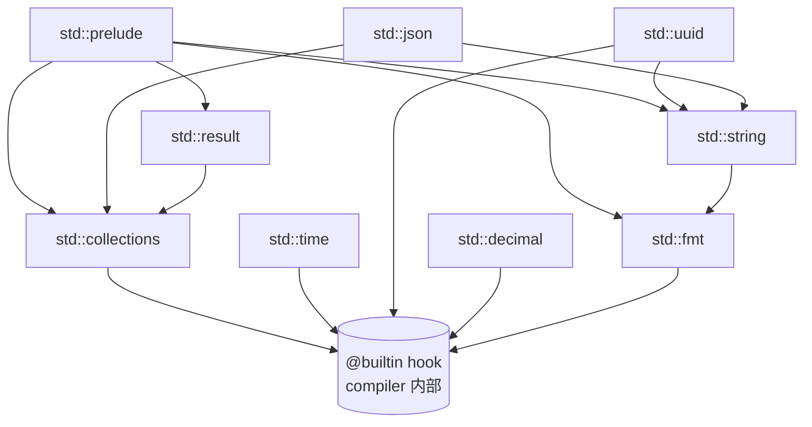
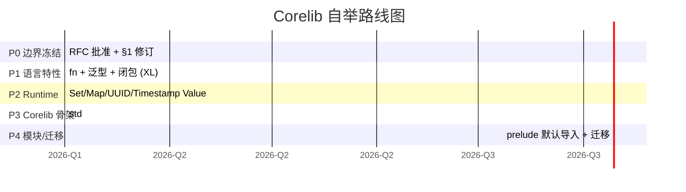

# AHFL Corelib 边界设计 RFC

本文是关于在 AHFL 引入 **标准库（corelib / `std`）** 与 **内置 vs 库划分** 的设计提案。当前阶段定位为 RFC，**仅讨论，不落代码**。

本 RFC 同时附带两份附件草案（不直接修改 spec/plan 文件，留 owner 批准）：

- `core-language.zh.md §1` out-of-scope 修订建议措辞
- 形式化验证可判定性影响评估

关联文档：

- [core-language.zh.md](../spec/core-language.zh.md)
- [semantics-typecheck-hardening.zh.md](../plans/archive/semantics-typecheck-hardening.zh.md)（已归档，有效内容已并入 issue-backlog）
- [module-loading.zh.md](./module-loading.zh.md)
- [module-resolution-rules.zh.md](./module-resolution-rules.zh.md)
- [native-runtime-architecture.zh.md](./native-runtime-architecture.zh.md)
- [formal-backend.zh.md](./formal-backend.zh.md)
- [optional-narrowing-rfc.zh.md](./optional-narrowing-rfc.zh.md)

---

## 1. 现状与问题

### 1.1 当前 builtin 的两层结构

AHFL 当前**零 corelib**：仓库中没有任何用 ahfl 自身写的库代码（96 个 `.ahfl` 文件全部是测试 / 示例）。所有内置能力硬塞在两个互不相通的层里：

**第一层：语法层（前端）**

`core-language.zh.md §2.2` 保留字列表里直接固化了两类关键字：

1. `primitiveType` 关键字：`Unit Bool Int Float String UUID Timestamp Duration Decimal`。
2. 内置泛型构造子：`Optional List Set Map`，且**类型参数文法写死**（无法接受用户自定义类型参数）。

**第二层：runtime 层（`src/runtime/evaluator/evaluator.cpp`）**

算术 / 逻辑 / 比较、`list.length` / `list[i]` 等操作在 evaluator 内部硬编码 switch。`Set` / `Map` / `UUID` / `Timestamp` 在 evaluator 中直接返回 `'not supported in v0.51'`，`value.hpp` 中根本没有对应 `Value` 变体——它们目前是"语法存在、runtime 落空"的死类型。

### 1.2 两层结构带来的具体问题

| 问题 | 表现 | 影响 |
| --- | --- | --- |
| **关键字膨胀** | 每加一个内置类型都要进 §2.2 保留字表 + lexer + parser + printer + LSP hover/semantic-token。`UUID` / `Timestamp` 已经躺在这张表里但 runtime 不实现。 | 语言核心无法保持收敛；LSP / formatter 等下游工具每个新类型都要逐个改。 |
| **runtime 不可扩展** | 算术 / 容器方法以 C++ switch 形式焊死在 evaluator 里。新增 `string.contains`、`list.fold` 之类的能力必须改 C++ 代码并重编译 runtime。 | 用户无任何自助手段；与"语言即数据"的 DSL 定位冲突。 |
| **类型层与运行时层断层** | `Set` / `Map` / `UUID` / `Timestamp` 在 typecheck 阶段是合法类型，在 evaluator 阶段直接报 not supported。 | 用户能写出来却跑不动；契约 / flow 中使用这些类型时行为不可预测。 |
| **无用户侧算法** | 没有任何可在源码层表达的"函数"。所有复用只能靠 predicate（且无 body、仅布尔上下文）。 | 工作流逻辑无法提炼成可复用单元；测试夹具重复度高。 |

### 1.3 自举硬缺口

要让 corelib **用 ahfl 自己写**，必须先有若干今天完全不存在的语言特性。当前缺口：

| 缺口 | 现状 | corelib 写作影响 |
| --- | --- | --- |
| `fn`（带 body 的函数声明） | 不存在。`predicate` 是唯一带参构造，但**无 body**且仅限布尔上下文。 | 任何算法（`string.contains`、`list.fold`）无处安放。 |
| 用户自定义泛型 | 不存在。`Optional/List/Set/Map` 的类型参数文法写死，用户无法声明 `fn id<T>(x: T): T`。 | 容器算法、序列化、`Optional` 工具都写不出。 |
| 闭包 / 一等函数 | 不存在。无 lambda、无函数值类型。 | `list.fold`、`list.map`、`list.filter` 无法给出回调参数。 |
| `struct` / `enum` 方法 | 不存在。struct / enum 仅承载数据，无方法体。 | `string.length()` 只能写成全局 `fn` 而非成员方法（可接受，但影响人体工程学）。 |

### 1.4 关键规范障碍

这是本 RFC 必须正面处理的边界争议：

- `docs/spec/core-language.zh.md §1` 把 **"通用高阶函数与用户自定义泛型"** 明确列为 out-of-scope（第 6 项）。
- [已归档] `docs/plans/archive/semantics-typecheck-hardening.zh.md` 在多处重申："不引入用户自定义泛型 / higher-kinded type / union / intersection type"。

引入 corelib **必然**要求 fn + 用户泛型 + 闭包（至少其中两者），因此**本 RFC 的实质动作之一就是提议把这条边界从 frozen out-of-scope 改为 in-scope-but-disciplined**。详见 §3。

### 1.5 业内对标

| 语言 | 原语层（语言核心） | 标准库层（可写、可换） |
| --- | --- | --- |
| **Rust** | 字面量、运算符、原始类型 `i32/u64/...`、`fn`/`struct`/`enum`/`trait`/泛型语法。`str` 与 `[T]` 是 unsized 原语，但方法全在 `std`。 | `std::collections` / `std::string` / `std::time` / `std::fmt` / `std::io`。`prelude` 默认导出 `Option/Vec/Box/...`。 |
| **Swift** | 字面量、运算符、`Int/Double/Bool/String`（注意 `String` 是标准库类型不是关键字，靠 compiler magic 注入）、`Array/Dictionary/Set` 是标准库泛型。 | `stdlib` 几乎包揽所有"看起来像语言"的能力。编译器对 stdlib 有少量 `@_silgen_name` / `Builtin` 桥接。 |
| **Zig** | 字面量、运算符、原始整数 / 浮点 / `bool`。`[]T` slice 是语言原语。无字符串类型关键字。 | `std` 几乎是 Zig 自举的招牌。所有容器 / 算法 / IO / 格式化都在 `std`，由 `comptime` 泛型承载。 |
| **Move** | 整数 / bool / vector / address 是 builtin types。`vector<T>` 是语言原语。 | 标准库（`std` / `aptos-stdlib`）用 Move 自己写，无闭包，靠资源 / ability 系统。 |
| **Lean** | 类型构造、依赖函数、`Prop`。 | `Init` / `Std` / `Mathlib` 分层。基本类型也是 stdlib 中定义的归纳类型，编译器只识别少量 primitive reduction。 |

**共性结论**：

1. **语言核心只保留"语法无法表达"的东西**：字面量、运算符、原语类型构造子、（必要的）函数 / 泛型 / 抽象语法。
2. **看起来像"语言"但其实是"库"的东西**（容器方法、字符串方法、时间、序列化、格式化）一律下沉到 stdlib。
3. **stdlib 通常用语言自己写**（Rust/Zig/Swift/Lean/Move 都是），通过少量编译器 hook（Rust lang items、Swift `Builtin` module、Zig `callconv`）桥接真正的原语。

AHFL 当前的两层结构恰好踩在这条共识的**反面**：把本应是库的东西焊死成关键字 + C++ switch。本 RFC 提议沿 Rust/Swift 路线收敛。

---

## 2. 边界设计

### 2.1 划分原则

> **判定准则**：如果一个能力离开特定文法形态就无法表达（字面量、运算符、类型构造子的关键字拼写），它属于**语言核心**；否则它属于**库**。

由此推导出三条硬约束：

1. **必须内置**：字面量（`1`、`"s"`、`true`、`now`）、运算符（`+ - * / % == != < > and or not is`）、内置类型构造子语法（`Optional<T>`、`List<T>`、`Set<T>`、`Map<K,V>`，以及它们在 typecheck / IR 中需要的结构性操作如 `length` / 下标）。
2. **可以下沉到库**：UUID/Timestamp 的构造与解析、集合算法（`fold/map/filter/contains`）、string 方法（`contains/starts_with/upper/format`）、序列化（`json::encode/decode`）、格式化（`fmt::format`）。
3. **必须保留少数"编译器 hook"**：Rust 的 lang item、Swift 的 `Builtin` 模块对应物——AHFL 需要给 `std` 暴露极少量 `@builtin` / `extern "ahfl-builtin"` 入口，让库代码可以调用真正的原语（如 raw list 下标、raw string bytes、wall-clock 源），但**这些 hook 数量被冻结**，新增必须经 RFC。

### 2.2 决策表

下表逐项给出当前归属、推荐归属、迁移代价与对标。

| 能力 | 当前归属 | 推荐归属 | 代价 | 对标 |
| --- | --- | --- | --- | --- |
| `Unit/Bool/Int/Float` 字面量与运算 | 语法关键字 + evaluator 焊死 | **内置**（保留） | 无 | Rust 原语、Zig 原语 |
| `String` 字面量 `"..."` | 语法关键字 | **字面量内置；类型与方法下沉** | M：方法迁出 evaluator | Rust `&str` 原语 / `String` 库；Swift `String` 库 |
| `String` 方法（`length/contains/format`） | 不存在 | **库** `std::string` | M | Rust `str` / Zig `std.mem` |
| `Optional<T>` 语法 + `some/none` | 关键字 + refinement | **语法构造子内置**；`map/and_then/or_else` 库 | L | Rust `Option`（库）+ `?` 操作符（内置） |
| `List<T>` 字面量 + `length` + 下标 | 语法 + evaluator | **结构性 op 内置**（`length`、`[]`、字面量）；算法 `fold/map/filter` 库 | L | Rust `[T]` slice 原语 / `Vec` 库 |
| `Set<T>` 类型关键字 | 关键字（runtime not supported） | **类型构造子内置**；算法与构造 `insert/remove/contains/union` 库；**runtime 补 Value 变体** | M | Swift `Set` 库、Move `vector`+stdlib |
| `Map<K,V>` 类型关键字 | 关键字（runtime not supported） | **类型构造子内置**；方法库；**runtime 补 Value 变体** | M | Swift `Dictionary`、Rust `HashMap` |
| `UUID` / `Timestamp` / `Duration` / `Decimal` | 关键字（部分 runtime not supported） | **`Decimal`/`Duration` 内置原语**（数值语义无法在库中复刻）；`UUID`/`Timestamp` 构造与格式化**库** | M | Swift `Decimal`/`Date` 库、Rust `std::time` |
| `now` / wall-clock | 不存在 / 隐式 | **内置原语 hook**（`@builtin now`），库封装 | S | Zig `std.time` |
| 算术 / 比较 / 逻辑运算符 | evaluator 焊死 | **内置**（保留） | 无 | 所有 |
| `json::encode/decode` | 不存在 | **库** `std::json` | M | Swift `Codable`、Rust `serde` |
| `fmt::format` | 不存在 | **库** `std::fmt`，背后调内置 hook | M | Rust `std::fmt`、Zig `std.fmt` |
| `list.fold/map/filter` | 不存在 | **库** `std::collections`（需先有 `fn` + 闭包） | XL | Rust `Iterator`、Swift `Sequence` |

**代价图例**：S = 小（< 1 人周），M = 中（1–4 人周），L = 大（4–8 人周），XL = 极大（> 8 人周，跨阶段工程）。

### 2.3 关键边界裁定（必读）

下列裁定是本 RFC 的核心建议，违反任一条都会破坏可判定性或自举：

1. **`Optional` / `List` / `Set` / `Map` 的类型构造子语法保留为内置**。理由：它们的字面量、refinement、pattern 都已经深入 typechecker / IR / SMV 编码，下沉会牵动整个形式化后端。
2. **容器的"结构性 op"（`length`、下标、字面量构造、`is` 判别）保留为内置**。理由：这些是 SMV 编码中 State 变量的基础操作；库化会把它们推进 invariant 谓词的可判定性雷区（见 §4）。
3. **`UUID` / `Timestamp` 不再作为关键字新增语义**：保留类型构造子（因为 §2.2 已写死），但所有"构造 / 格式化 / 算术"一律走 `std::time` / `std::uuid`，由库用 `@builtin` hook 实现。
4. **`Decimal` / `Duration` 保留原语地位**：定点十进制与时间算术无法在库中无损复刻（精度 / 单位），且它们频繁进入 contract invariant，下沉会引入未建模副作用。
5. **库函数默认对形式化验证不可见**（见 §4）。需要进入 contract / invariant 的库函数必须显式 `@pure @verifiable` 标注，并接受 SMV 编码限制。

---

## 3. `core-language.zh.md §1` out-of-scope 修订草案

> 本节是**提案措辞**，不直接修改 spec 文件。最终是否落地由 owner 批准。

### 3.1 当前原文（`core-language.zh.md §1` 第 23–30 行）

```text
不包含以下能力：

1. capability/tool 实现体
2. 原生 `llm_config`
3. `observability` / `compliance`
4. `main` 与服务启动
5. CTL
6. 通用高阶函数与用户自定义泛型
```

### 3.2 修订建议（替换第 6 项）

将原第 6 项**整体删除**，替换为如下两条，区分"语言特性"与"corelib 范围"：

```text
不包含以下能力：

1. capability/tool 实现体
2. 原生 `llm_config`
3. `observability` / `compliance`
4. `main` 与服务启动
5. CTL

关于函数抽象与标准库的边界，单独由 RFC [corelib-rfc.zh.md](../design/corelib-rfc.zh.md) 定义，本规范不再将其整体排除。引入用户自定义泛型 / 闭包 / 库函数须遵循该 RFC 的约束：

6. 用户自定义泛型、闭包、带 body 的 `fn` 声明：作为 corelib 自举的前置语言特性引入，**仅限单态化（monomorphization）**，不引入 higher-kinded type、union / intersection type、trait / typeclass。
7. 库函数（`std::*`）默认对 CTL/LTL 形式化验证不可见；需要进入 contract / invariant 的库函数必须显式标注 `@pure @verifiable` 并接受 SMV 编码约束。
```

### 3.3 配套修订：`semantics-typecheck-hardening.zh.md` 第 53、69 行

> 同样是提案措辞，不直接修改 plan 文件。

**第 53 行**当前：

```text
| Type relation / constraint framework | 并入 Milestone 1；当前目标是统一 relation API，不提前引入泛型或 union/intersection。 | 否 |
```

建议替换为：

```text
| Type relation / constraint framework | 并入 Milestone 1；统一 relation API。用户自定义泛型按 [corelib-rfc.zh.md](../design/corelib-rfc.zh.md) 单独推进，仍不引入 union / intersection / HKT。 | 否 |
```

**第 69 行**当前：

```text
2. 不引入用户自定义泛型、higher-kinded type、union / intersection type。
```

建议替换为：

```text
2. 不引入 higher-kinded type、union / intersection type。用户自定义泛型仅在 [corelib-rfc.zh.md](../design/corelib-rfc.zh.md) 框架内、以单态化形式引入，且其进入形式化验证的路径受显式 `@pure/@verifiable` 标注约束。
```

### 3.4 修订边界说明

本次修订**只移动边界，不撤除纪律**：

- `HKT / union / intersection` 维持 out-of-scope。
- `trait / typeclass` 暂不引入（见 §5.4 评估）。
- 用户泛型被收进 **单态化 + verifiable 标注** 双重闸门。

---

## 4. 形式化验证可判定性影响评估

> 这是本 RFC **最大风险**所在。用户泛型 + 递归 `fn` 直接关系到 CTL/LTL → SMV 编码的可判定性。本节给出特性级风险评估与缓解策略。

### 4.1 AHFL 验证链回顾

AHFL 把 `agent` 状态机 / `flow` / `contract` 编码为 SMV（CTL/LTL 模型检测），见 `formal-backend.zh.md`。SMV 的状态空间是**有限、bounded**的：

- 状态变量来自 typecheck 后的强类型 HIR。
- 不受控的递归 / 无界数据结构会让状态空间无限，**SMV 编码失败**。
- 因此**任何可能进入 contract / invariant / flow 谓词的能力都必须 bounded**。

### 4.2 特性风险分级

| 库 / 语言特性 | 进入验证路径的风险 | 级别 | 说明 |
| --- | --- | --- | --- |
| 纯表达式算术（`+ - * / %`） | 无（已是 builtin） | 🟢 安全 | SMV 已建模。 |
| `string` 方法（`length/contains`） | 中 | 🟡 中 | 字符串在 SMV 中需 bounded；`length` 安全，`contains` 需限定长度上界。 |
| `list.length` / `list[i]` | 无（已是 builtin） | 🟢 安全 | SMV 已建模（fixed-size array）。 |
| `list.fold / map / filter` | **高** | 🔴 高 | 需闭包，闭包被编译为有限展开。必须证明列表长度 bounded + 闭包体非递归。 |
| `set/map` 算法 | **高** | 🔴 高 | 集合在 SMV 中是 fixed-size bit-vector；`union/intersect` 可建模，`fold`/迭代回调同 list。 |
| 递归 `fn` | **极高** | 🔴 极高 | 递归 → 可能不终止 → SMV 状态空间无限。**默认禁止进入验证**，见 §4.3。 |
| 用户泛型实例化 | 中 | 🟡 中 | 单态化导致类型膨胀，每实例化一组类型参数产生一份 fn 拷贝。**实例化爆炸风险**。 |
| `UUID` / `Timestamp` 字面构造 | 中 | 🟡 中 | 不进入 invariant 时安全；进入时需建模为 bounded opaque token。 |
| `now` / wall-clock | **极高** | 🔴 极高 | 时间是真非确定环境输入，SMV 无法直接建模。**禁止进入 invariant**，仅允许在 capability / effect 上下文使用。 |
| `json::encode/decode` | 高 | 🔴 高 | 序列化结果无界；**禁止进入 invariant**，仅运行时使用。 |
| `fmt::format` | 无 | 🟢 安全 | 仅影响输出，不进状态空间。 |

### 4.3 缓解策略（强制）

为把上述风险关在笼子里，本 RFC 提出以下**强制约束**（写入 spec 修订与 compiler 校验）：

1. **库函数默认对验证不可见**
   - 默认：`std::*` 函数在 lowering 到 SMV 时被当作 `opaque`，**不能**出现在 `contract` / `invariant` / `safety` / `liveness` / flow 的 transition guard 中。
   - 显式 opt-in：函数标注 `@pure` 表示纯（无副作用、确定、终止）；标注 `@verifiable` 表示愿意接受 SMV 编码约束（bounded 输入、非递归、非时间相关）。
   - 校验：typecheck 阶段扫描 contract / invariant 谓词，对其中出现的非 `@pure @verifiable` 函数调用报 `E::corelib_not_verifiable`。

2. **递归受限**
   - `@verifiable` 函数**禁止直接或间接递归**（compiler 通过 call-graph 检测）。
   - 普通库函数允许递归但**不能进入验证路径**（已被规则 1 拦截）。
   - 可选未来扩展：`@verifiable(recursion_bound = N)` 显式声明有界递归深度，由 compiler 展开为 N 层。本期 RFC **不引入**，仅留位。

3. **泛型单态化（monomorphization）**
   - 用户泛型**只走单态化**，不做 boxing / 虚函数表。
   - 每个具体类型参数组合产生一份特化代码，**与 Rust 一致**。
   - **实例化爆炸缓解**：compiler 维护单态化缓存；同型参数合并；对 `@verifiable` 函数的特化数量设上限（推荐默认 ≤ 16），超出报 `E::monomorphization_budget_exceeded`。

4. **闭包有限化**
   - 闭包只能捕获**值类型且 bounded 大小**的变量（不允许捕获 `List<T>` 除非其长度上界已知）。
   - 闭包体经 typecheck 后被 inline 到唯一调用点（lambdas-as-macros），不产生一等函数值。
   - 仅 `@verifiable` 函数允许接受闭包参数；非 verifiable 函数接受闭包不影响验证（因函数本身不进验证）。

5. **bounded 容器**
   - `List<T>` / `Set<T>` / `Map<K,V>` / `String` 进入 `@verifiable` 函数或 invariant 时，必须能在 typecheck 阶段推断出**长度上界**（来自 refinement，如 `List<Msg> where length <= 8`）。
   - 推不出上界 → 报 `E::unbounded_in_verifiable`。
   - 这一约束与现有 refinement 系统一致，不引入新机制。

6. **`now` / 副作用源隔离**
   - `@builtin now`、`json::encode`、IO 类函数编译器直接标记 `effect = nondet`。
   - 出现在 invariant / contract 谓词中 → `E::effect_in_invariant`。

### 4.4 风险矩阵小结

把 §4.2 与 §4.3 合并得到一张可执行矩阵：

| 是否进入 invariant/contract | 函数属性 | 允许？ |
| --- | --- | --- |
| 是 | builtin 算术 / `length` / 下标 | ✅ |
| 是 | `@pure @verifiable` 非递归、bounded 输入 | ✅ |
| 是 | 普通 `std` 函数（无标注） | ❌ `E::corelib_not_verifiable` |
| 是 | 递归函数 | ❌ `E::recursive_in_verifiable` |
| 是 | `now` / 副作用函数 | ❌ `E::effect_in_invariant` |
| 是 | bounded 不可推的 `List/Set/Map` | ❌ `E::unbounded_in_verifiable` |
| 否（仅 runtime） | 任意库函数 | ✅（无验证约束） |

**核心原则一句话**：库的扩张能力用"默认不可验证"换可判定性，用"显式标注"换 opt-in 的可验证子集。这与 Rust `const fn` 的"默认不可 const，opt-in const"思路一致。

---

## 5. 自举前置语言特性设计

> 本节给出 EBNF 级语法草案，供讨论。**不是最终文法**，落地前需经 grammar owner 评审。

### 5.1 `fn` 声明（带 body / 参数 / 返回类型 / effect 标注）

```ebnf
FnDecl      ::= DocComment? Visibility? "fn" Ident TypeParams?
                "(" [ ParamList ] ")" ( ":" Type )?
                EffectClause? WhereClause? Block ;

ParamList   ::= Param { "," Param } ;
Param       ::= Ident ":" Type ;

TypeParams  ::= "<" TypeParam { "," TypeParam } ">" ;
TypeParam   ::= Ident ( ":" TypeBound )? ;      (* 单态化，无 HKT *)

EffectClause ::= "effect" EffectSpec ;
EffectSpec  ::= "pure" | "nondet" | EffectName { "+" EffectName } ;

WhereClause ::= "where" Constraint { "," Constraint } ;
Constraint  ::= Ident ":" TypeBound ;            (* e.g. T: Numeric *)

Block       ::= "{" { Stmt } [ Expr ] "}" ;      (* 末尾表达式即返回值 *)
```

示例：

```ahfl
module std::collections;

/// 求列表长度。纯、可验证、非递归。
@pure @verifiable
fn length<T>(xs: List<T>) effect pure -> Int {
    xs.length            // 委托给内置结构性 op
}

/// 折叠。闭包参数；仅 verifiable 函数才能在 invariant 中调用。
@pure @verifiable
fn fold<T, A>(xs: List<T> where length <= 16, init: A, f: Fn(A, T) -> A)
    effect pure -> A {
    // 实现：单态化 + 闭包 inline
}
```

要点：

- `effect pure` 是 `@pure` 的文法糖，二者等价。
- `WhereClause` 只支持简单 type bound（如 `T: Numeric`、`T: Eq`），**不支持 HKT**。
- `Block` 末尾表达式作为返回值，与 `let` / `if` 表达式风格一致（AHFL 已是表达式导向）。

### 5.2 用户自定义泛型

```ebnf
(* 用户泛型 *)
fn id<T>(x: T) effect pure -> T { x }

(* 类型构造子泛型 *)
type Pair<A, B> = struct { fst: A; snd: B };
```

**实现路线：单态化（推荐）vs 装箱**

| 路线 | 优点 | 缺点 | AHFL 选择 |
| --- | --- | --- | --- |
| 单态化（Rust / C++ / Zig） | 零运行时开销；与现有 typed HIR / SMV 编码天然兼容（每实例独立 typed 节点）；可对每实例做 refinement 检查 | 编译时间膨胀；需要实例化预算 | ✅ 推荐 |
| 装箱（Java / OCaml 旧式） | 编译快、二进制小 | 引入间接、破坏 typed-IR 的可验证等价性；与 SMV bounded 编码冲突 | ❌ 不采用 |

**单态化的关键工程含义**：每个泛型实例在 typed HIR / IR 阶段被替换为具体类型节点，SMV 编码看到的就是普通具体类型——**泛型本身不增加可判定性负担**，负担来自实例化数量（§4.3-3 缓解）。

### 5.3 闭包 / lambda

```ebnf
Lambda      ::= "\\" ParamList "->" Expr
              | "{" ParamList "->" Block "}" ;

FnType      ::= "Fn" "(" [ TypeList ] ")" "->" Type ;     (* 一等函数类型 *)
```

示例：

```ahfl
@pure @verifiable
fn sum_squares(xs: List<Int> where length <= 16) effect pure -> Int {
    fold(xs, 0, \a, x -> a + x * x)
}
```

**取舍**：

- 闭包类型 `Fn(A, T) -> A` 是**新引入的一等函数类型**。这是本 RFC 最重的让步。
- 为控制风险，**仅允许 `@verifiable` 函数接受闭包参数**（见 §4.3-4）。普通函数不接受闭包，避免库代码无意中变成高阶。
- 闭包在编译期 inline 到唯一调用点，**不在 runtime 中产生一等函数值**——AHFL 仍然不是函数式语言，闭包只是语法糖。

### 5.4 trait / method 评估

是否引入 trait（Rust）或 typeclass（Haskell）以支持 `xs.length()` 成员方法语法？

**结论：本期 RFC 推荐不引入，改用全局 `fn`。**

| 选项 | 代价 | 收益 | 推荐 |
| --- | --- | --- | --- |
| 引入 trait + 方法分发 | XL：需 trait resolution + coherence + 适配 typed HIR / SMV | 人体工程学（`xs.length()` 比 `length(xs)` 好看） | ❌ |
| 仅全局 `fn`，无方法 | L | 简单、与现有 module 系统 1:1 对齐 | ✅ |
| 引入有限 `impl` 块（无 trait） | M | 折中：`impl List<T> { fn len() {...} }` | 🟡 留作 P5 评估 |

**理由**：

1. AHFL 是 DSL，不是通用语言；trait 系统的复杂度（coherence / orphan rule / HKT 边界）与"可验证、单遍、bounded"目标冲突。
2. 全局 `fn` + module 命名空间（`std::collections::length(xs)`）足以覆盖 corelib 需求。
3. 若 P3 corelib 骨架落地后发现 `xs.length()` 写法是高频痛点，再评估"有限 `impl`"折中方案。

### 5.5 与现有 `predicate` / `capability` 语义关系

| 现有构造 | 与新 `fn` 的关系 |
| --- | --- |
| `predicate Foo(x: Int): Bool = ...` | 保留。`predicate` 是**布尔、无 body、可进入 contract/invariant 的特化 fn**。等价于 `@pure @verifiable fn Foo(x: Int) -> Bool`，但保留独立关键字以维持可读性与 contract 上下文识别。 |
| `capability Bar(...) -> ...` | 保留。capability 是 effect 资源，不能被 fn 替代。fn 中可声明 `effect Bar` 表示该 fn 使用此 capability。 |
| `agent` / `contract` / `flow` / `workflow` | 保留，与 fn 正交。fn 提供可复用纯算法，不参与 agent 状态机。 |

**关键约束**：fn 的 `effect` 子句中若引用 capability，则该 fn **自动不可验证**（`@verifiable` 与 `effect <Capability>` 互斥）。

---

## 6. `std` 目录与命名空间设计

### 6.1 顶层模块

| 模块 | 职责 | 主要导出 | 依赖 |
| --- | --- | --- | --- |
| `std::prelude` | 默认导入的常用项 | `Option/Some/None`（重导出）、`length`、`fold`、`error`、`fmt::format` 重导出 | collections, string, fmt |
| `std::collections` | 容器算法 | `length/fold/map/filter/contains/insert/remove/union/intersect` for `List/Set/Map` | 无 |
| `std::string` | 字符串方法 | `contains/starts_with/ends_with/upper/lower/format/parse` | fmt |
| `std::time` | 时间类型与算法 | `Timestamp/Duration` 的构造与算术、`now` 重导出（背后 `@builtin now`）、`diff/add` | 无（`Duration` 是原语） |
| `std::uuid` | UUID 构造与格式化 | `new`（背后 `@builtin uuid_new`）、`parse`、`to_string` | string |
| `std::fmt` | 格式化 | `format/Display`-like trait（本期不引入 trait，改用 `fmt::format(template, args...)`） | 无 |
| `std::json` | 序列化 | `encode/decode`（**禁止进入 invariant**） | string, collections |
| `std::decimal` | Decimal 算术扩展 | 精度控制、四舍五入、与 Int/Float 互转 | 无（`Decimal` 是原语） |
| `std::result` | `Result<T, E>` 与错误传播 | `Result/Ok/Err`、`try`、`map_err` | 无 |

### 6.2 依赖图



约束：

- **无环**（除 `prelude` 重导出形成的概念环，物理依赖单向）。
- `@builtin` hook 是单向出边：只有 std 模块可调用，用户代码不可直接调用 `@builtin`。
- `std::json` 依赖 `collections` 但 `collections` 不反向依赖 `json`，保证容器算法可被独立验证。

### 6.3 包 / 模块系统如何承载 std 分发

AHFL 已有 project-aware 模块系统（见 `module-loading.zh.md` / `module-resolution-rules.zh.md`）：`module foo::bar;` 声明 + `import foo::bar;` 装载 + search root 查找 `foo/bar.ahfl`。

**std 分发方案**：把 std 作为编译器内置 search root，物理形态有两条候选路径：

| 方案 | 描述 | 优缺点 |
| --- | --- | --- |
| A. 源码 std（推荐 P3） | std 以 `.ahfl` 源码形式随编译器分发，编译器在标准 search root 之前注入一个内置 `<compiler>/share/ahfl/std/` 目录。 | ✅ 真正自举：std 用 ahfl 写；用户可读 std 源码；与现有 module 系统零特殊化。 ❌ 编译开销：每次都解析 std 源。 |
| B. 预编译 std cache | std 预先编译为 typed HIR cache，编译器直接加载。 | ✅ 编译快。 ❌ 引入 cache 格式与版本兼容问题；与"语言即数据"略有冲突。 |

**推荐**：P3 用方案 A（源码 std）；若编译开销显著，P4 引入方案 B cache。无论 A/B，对前端 resolver 都**只是多一个内置 search root**，不需要新机制。

**`prelude` 默认导入**：编译器在每个 source file 的 import 表前隐式注入 `import std::prelude as _prelude;`，并将 `_prelude` 内的导出名注入本地作用域（类似 Rust prelude）。其余 std 模块需显式 `import`。

### 6.4 命名空间冲突处理

- 用户代码定义的 `length` / `Option` 等与 prelude 冲突时，**本地声明优先**（与现有 resolver 行为一致）。
- 用户可通过 `import std::collections as coll;` 显式别名绕开冲突（现有 alias 机制已支持）。
- 不引入 wildcard import（现有约束）。

---

## 7. 自举路线图

> 每阶段标注：依赖、风险、工程量、验收。工程量图例：S/M/L/XL 同 §2.2。



### P0. 边界冻结（工程量 S，前置）

**目标**：RFC 评审通过、§1 out-of-scope 修订落地、可验证边界写入 spec。

**依赖**：本 RFC 被 owner 接受。

**交付物**：

- `core-language.zh.md §1` 按本 RFC §3.2 修订（另一 agent 执行，本 RFC 仅出措辞）。
- `semantics-typecheck-hardening.zh.md` 按本 RFC §3.3 修订。
- 在 `formal-backend.zh.md` 增加 "corelib 默认对验证不可见" 的约束声明。

**风险**：边界修订触发社区 / 文档读者认知断裂。**缓解**：本 RFC §1.4 已显式说明"只移动边界，不撤除纪律"。

**验收**：spec / plan 修订合并；CI green；RFC 链接进 `docs/README.md`（仅链接，不改 README 主体——README 由另一 agent 维护）。

### P1. 补 `fn` + 用户泛型 + 闭包（工程量 XL）

**目标**：让 ahfl 能写带 body 的函数、单态化泛型、有限闭包。**这是 typechecker 现代化级别的工程**，应作为 `semantics-typecheck-hardening.zh.md` 的下一阶段任务。

**依赖**：P0 完成；typed HIR 已稳定（参见 `ahfl-typed-hir-migration-audit-v1` memory）。

**子任务**：

1. 文法：`fn` / TypeParams / Lambda（§5）。
2. Name resolution：泛型参数作用域、闭包捕获。
3. Typecheck：单态化、effect 子句、`@pure/@verifiable` 标注语义。
4. typed HIR lowering：泛型实例化、闭包 inline。
5. SMV 后端：默认 opaque 规则、`@verifiable` 展开规则、`E::corelib_not_verifiable` 等诊断。
6. 单态化预算与缓存。

**风险（高）**：

- 单态化导致 typed HIR / SMV 状态空间爆炸。**缓解**：§4.3-3 预算 + 缓存。
- 闭包捕获引发别名 / 副作用逃逸。**缓解**：§4.3-4 仅捕获 bounded 值类型 + inline。
- 与现有 `predicate` / refinement 交互复杂。**缓解**：先不支持泛型 predicate；predicate 保留为现有形态。

**验收**：

- `fn id<T>(x: T) -> T { x }` 可声明、可调用、可单态化。
- `@pure @verifiable fn length<T>(xs: List<T>) -> Int` 可进入 invariant 且 SMV 编码成功。
- 普通库函数进入 invariant 触发 `E::corelib_not_verifiable`。
- 单态化预算超限触发 `E::monomorphization_budget_exceeded`。

### P2. Runtime 补 `Set` / `Map` / `UUID` / `Timestamp`（工程量 M）

**目标**：消除 §1.2 中"语法存在、runtime 落空"的死类型。

**依赖**：P0 完成。**可与 P1 并行**（不同子系统：P1 是 frontend/typecheck，P2 是 runtime/value）。

**子任务**：

1. `value.hpp` 增加 `SetValue` / `MapValue` / `UuidValue` / `TimestampValue` 变体。
2. evaluator 实现基础构造与算术。
3. typecheck 与 runtime 对齐（消除 `'not supported in v0.51'`）。
4. 更新现有测试中误用这些类型的 case（部分会被 P3 的库 API 替换）。

**风险（中）**：`Set` / `Map` 的相等性 / 哈希语义与 SMV 编码冲突。**缓解**：本期仅在 runtime 层补值，**不**进入 invariant（`@verifiable` 规则在 P1 已就位拦截）。

**验收**：

- `let s: Set<Int> = set;` 可执行基础 `insert/remove/contains`。
- `UUID` 可构造与比较；`Timestamp` 可构造与算术。
- evaluator 不再返回 `'not supported'`。

### P3. Corelib 骨架（工程量 L）

**目标**：建立 `std::collections` / `std::string` / `std::time` / `std::fmt` / `std::uuid` / `std::json` / `std::result` 模块，用 ahfl 自身写出最常用算法。

**依赖**：P1 + P2 均完成。

**子任务**：

1. 在 `<compiler>/share/ahfl/std/` 建立 std 源码树（§6.3 方案 A）。
2. 编译器注入内置 search root。
3. 写出 `length/fold/map/filter/contains`、`string::*`、`time::diff/add`、`fmt::format`、`uuid::new/parse`、`json::encode/decode`、`result::Ok/Err/try`。
4. 为每个 std 函数加 `@pure` / `@verifiable` / `effect nondet` 标注。
5. prelude 默认导入。

**风险（中）**：

- 部分函数（`json::encode`）天然不可验证，需在文档中明确 `effect nondet` 并禁止 invariant 使用。
- 单态化预算下 std 自身的实例化数量可能挤压用户预算。**缓解**：std 内部用尽可能少的泛型（很多算法可写成具体类型版本，如 `Int` 专用 `sum`）。

**验收**：

- 用户 `import std::collections;` 后可调用 `fold` 等。
- prelude 默认导出可零配置使用。
- 所有 std 函数 effect 标注齐全；invariant 中误用触发诊断。

### P4. 高级模块与迁移（工程量 L）

**目标**：完善 std 生态，迁移现有测试 / 示例 / 内置算术到 std 调用。

**依赖**：P3 完成。

**子任务**：

1. 补 `std::decimal` 精度算法。
2. 引入预编译 std cache（§6.3 方案 B），若 P3 编译开销显著。
3. 评估 `impl` 块（§5.4 折中）必要性。
4. 迁移现有 96 个 `.ahfl` 中可受益于 std 的重复逻辑。
5. 把 evaluator 中已焊死的算术 / `list.length` 等改为 std 调用背后的 `@builtin` 入口（让 evaluator 仅保留 `@builtin` 实现）。

**风险（中）**：迁移可能引入行为回归。**缓解**：每迁移一类操作配对应的等价性测试（与 builtin 行为对照）。

**验收**：

- evaluator 不再直接实现算法逻辑，仅保留 `@builtin` 原语。
- 现有测试全绿；新增 std 自测试全绿。

---

## 8. 开放问题（Open Questions）

留待 RFC 讨论阶段决议：

1. **泛型 refinement**：`List<T> where length <= 8` 中 `T` 与 `length` 约束的交互是否需要在 P1 一并支持？还是先冻结 refinement 仅作用于内置类型。
2. **闭包捕获 refinement**：闭包捕获的 `List<T>` 是否需在闭包定义点固化长度上界？
3. **`std::result` 与现有错误模型**：AHFL 当前错误处理如何与 `Result<T, E>` 交互？是否引入 `try` 表达式？
4. **`impl` 块折中**：P5 是否引入有限 `impl`（无 trait）以支持 `xs.length()` 语法。
5. **prelude 内容稳定化**：prelude 是 lang stability 边界，需要一份独立的 stability policy。

---

## 9. 结论

本 RFC 提议把 AHFL 的内置能力从"语法关键字 + runtime 焊死"两层结构，迁移到"语言核心（字面量 / 运算符 / 必要类型构造子）+ 用 ahfl 自身写的 `std`"两层结构，对标 Rust / Swift / Zig。

核心代价是必须正面突破 `core-language.zh.md §1` 中"用户自定义泛型与高阶函数"的 out-of-scope 边界，但通过 **单态化 + `@pure/@verifiable` 双闸门** 把可判定性风险关进笼子：库函数默认对形式化验证不可见，opt-in 子集接受 bounded / 非递归 / 非副作用 约束。

路线图按 P0 → P1（XL，typechecker 现代化级别）→ P2（M，runtime）→ P3（L，骨架）→ P4（L，迁移）分阶段推进，P1 与 P2 可并行。

本 RFC 不落代码，等待 owner 评审。
