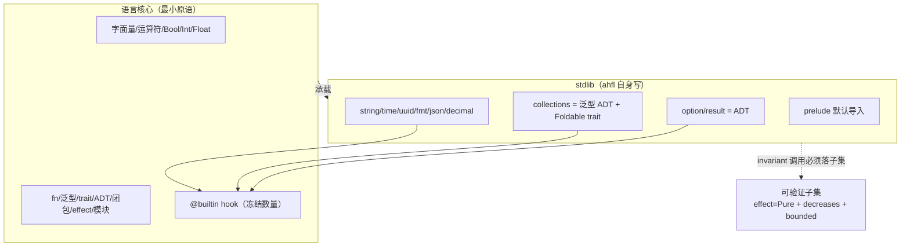

# AHFL Corelib 与类型系统设计 RFC

本文是关于 AHFL 引入**标准库（corelib / `std`）**与**类型系统演进终点**的设计提案。定位为 RFC，**仅讨论，不落代码**。

两层结构：
- §1–§5：**目标设计**（演进正确路径，对标业内最佳实践）。
- §6：**迁移路径**（从现状分阶段逼近目标，P0–P7）。

可实施细节见四份 detail 附件（§7 开放问题已在其中全部决议）：
- [corelib-type-system.zh.md](./corelib-type-system.zh.md) — 完整 EBNF + trait / 泛型 / 闭包 / 单态化（决议 Q1 / Q2 / Q7）
- [corelib-effect-system.zh.md](./corelib-effect-system.zh.md) — effect 推导 + decreases + 可验证子集检查（决议 Q3）
- [corelib-stdlib-api.zh.md](./corelib-stdlib-api.zh.md) — stdlib 完整接口 + `@builtin` 清单（决议 Q4 / Q5）
- [corelib-container-migration.zh.md](./corelib-container-migration.zh.md) — P5 容器库化迁移策略（决议 Q6）

---

## 1. 设计哲学（核心原则）

> **语言表达力与可验证性正交。用"可验证子集"连接二者，而不是用降级语言换可判定性。**

这是可形式化验证语言领域的共识：

| 语言 | 类型系统完整度 | 可验证性如何保证 |
| --- | --- | --- |
| **Dafny** | 完整：类 / trait / 泛型 / 共归纳数据类型 / 高阶函数 | `requires/ensures/decreases` + SMT；编译器证终止、查 contract |
| **F\*** | 完整：依赖类型 / effect / ADT / 高阶 | effect 系统（`TOT` 全函数 / `GT` / `ST` 状态 / `IO`）；纯函数必须 `TOT` |
| **SPARK Ada** | 完整 Ada 子集 | `Global/Depends/Contract` + proof；不降级语言 |
| **Lean** | 完整：归纳类型 / typeclass / 单子 | `Init/Std/Mathlib` 分层；基本类型也是 stdlib 归纳类型 |

**共性**：语言本身完整，验证靠 effect / 终止度量 / refinement 子集。**没有任何一个靠砍掉 trait / 闭包 / ADT 来保证可判定性。**

AHFL 当前的两层结构（语法关键字 + runtime C++ 焊死、容器焊成关键字、`enum` 无 payload、无 `fn`/泛型/`trait`/闭包）走在这条共识的反面。本 RFC 把 AHFL 拉回正轨。

---

## 2. 现状与问题

- **零 corelib**：96 个 `.ahfl` 全是测试 / 示例，无任何用 ahfl 自身写的库代码。
- **容器 / 原语焊死成关键字 + evaluator switch**：`Optional/List/Set/Map` 是文法写死的内置构造子；算术 / `list.length` / `list[i]` 在 `evaluator.cpp` 硬编码。
- **死类型**：`Set/Map/UUID/Timestamp` 语法合法、runtime 返回 `'not supported in v0.51'`，`value.hpp` 无对应 `Value` 变体。
- **`enum` 无 payload** → 无法表达 `Option/Result` 这类 ADT → 只能焊成关键字。
- **无 `fn` / 用户泛型 / `trait` / 闭包 / 一等函数**。
- **`core-language.zh.md §1`** 把"通用高阶函数与用户自定义泛型"列为 out-of-scope。

---

## 3. 目标设计

### 3.1 语言核心（最小原语集，仅保留语法无法表达者）

判定准则：**一个能力若离开特定文法形态就无法表达，则属于语言核心；否则属于 stdlib。**

| 原语 | 为何必须内置 |
| --- | --- |
| 字面量 `123 / 3.14 / true / "s" / 30s / none` | 离开词法 / 文法无法表达 |
| 运算符 `+ - * / % == != < > and or not is` | 同上 |
| `Bool / Int / Float` 数值类型 | 数值 / 布尔语义无法在库中无损复刻（所有语言如此） |
| `fn` / 泛型 / `trait` / ADT / 一等函数 / 闭包 / 模块 / effect 系统 | 抽象机制，"库化不了承载库的东西" |

**显式不在此列**（属于 stdlib）：`String` 类型、`Optional/Result/List/Set/Map`、`UUID/Timestamp/Duration`、所有容器算法 / 字符串方法 / 序列化 / 格式化。`String` 字面量 `"..."` 内置，但 `String` 类型与方法是 stdlib（对标 Rust `&str`/`String`、Swift `String`）。

### 3.2 类型系统四大支柱

#### 3.2.1 ADT（代数数据类型，`enum` 带 payload）

```ebnf
EnumDecl ::= DocComment? "enum" Ident TypeParams? "{" { Variant } "}" ;
Variant  ::= Ident [ "(" Type { "," Type } ")" ] ;     (* payload 可选 *)
TypeParams ::= "<" TypeParam { "," TypeParam } ">" ;
```

```ahfl
enum Option<T>    { Some(T), None }
enum Result<T, E> { Ok(T), Err(E) }
enum List<T>      { Nil, Cons(T, Box<List<T>>) }     // 也可由 stdlib 用底层 array 实现
```

带 payload 的 `enum` 是表达 `Option/Result` 及任意用户 ADT 的前提——没有它，这类类型只能焊成关键字，这正是当前 AHFL 容器是关键字而非库类型的根因。配套：`match` 模式匹配 + exhaustiveness 检查。

#### 3.2.2 用户泛型 + `trait/typeclass`

```ebnf
TraitDecl ::= "trait" Ident TypeParams? "{" { FnSignature } "}" ;
ImplBlock ::= "impl" [ TraitRef "for" ] TypeRef "{" { FnDef } "}" ;   (* 含 inherent impl *)
FnSignature ::= "fn" Ident TypeParams? "(" [ParamList] ")" (":" Type)? EffectClause? ";" ;
```

```ahfl
trait Foldable<T> {
    fn length(self) effect Pure -> Int;
    fn fold<A>(self, init: A, f: Fn(A, T) -> A) effect Pure decreases length(self) -> A;
}

impl<T> Foldable<T> for List<T>      { /* fold 写一遍 */ }
impl<T> Foldable<T> for Set<T>       { /* 复用 trait 契约 */ }
impl<K, V> Foldable<(K, V)> for Map<K, V> { /* ... */ }
```

`trait` 让 `fold/map/filter` 写一遍服务所有容器，避免按类型重复实现或放弃抽象——这是 Rust / Swift / Haskell 的标准做法。`Eq/Ord/Hash/Foldable/Functor/Iterable` 构成 corelib 的接口骨架。

`trait` 的 coherence：AHFL 是单根模块树（`std` 唯一权威来源），简化为"只有定义类型或定义 trait 的模块可写 `impl`"（Rust orphan rule 的严格版），避免全局 coherence 复杂度。

#### 3.2.3 一等函数 + 真闭包

```ebnf
FnType ::= "Fn" "(" [ TypeList ] ")" "->" Type ;
Lambda ::= "\\" ParamList "->" Expr  |  "{" ParamList "->" Block "}" ;
```

```ahfl
fn sum_squares(xs: List<Int> where length <= 16) effect Pure decreases length(xs) -> Int {
    fold(xs, 0, \a, x -> a + x * x)     // 闭包作为值传递，在 fold 体内被调用
}
```

闭包是**真一等值**（可传递、返回、存储）。`Fn(A,T)->A` 是一等类型，允许 `fold/map/filter` 接受回调、用户组合高阶逻辑。可验证性约束见 §3.4。

#### 3.2.4 统一 effect 系统

```ebnf
EffectClause ::= "effect" EffectSpec [ "decreases" Expr ] ;
EffectSpec   ::= "Pure" | "Nondet" | EffectName { "+" EffectName } ;
```

- `effect Pure`：纯、确定、终止、无副作用。
- `effect Nondet`：非确定（`now` / 随机源）。
- `effect <Capability>+`：使用某 capability（effectful）。
- `decreases <度量>`：终止度量（Dafny 式），编译器证明每次递归度量严格下降 ⇒ 终止。

现有 `ExprEffect`（Pure/ConstOnly/PredicateCall/CapabilityCall/ExternalEffect/Unknown）成为该 effect 系统在表达式层面的**推导结果**，而非并行机制——消除双轨冗余。

### 3.3 stdlib（用 ahfl 自身写）

| 模块 | 内容 | 语言机制 |
| --- | --- | --- |
| `std::option` / `std::result` | `Option<T>` / `Result<T,E>` | ADT |
| `std::collections` | `List/Set/Map` + `Foldable/Functor/Iterable` trait + `fold/map/filter/contains` | 泛型 ADT + trait |
| `std::string` | `String` 类型 + `contains/starts_with/upper/format/parse` | inherent impl + `@builtin` |
| `std::time` / `std::uuid` | `Timestamp/Duration/UUID` 构造与算术 | 包装 `@builtin now/uuid_new` |
| `std::fmt` / `std::json` / `std::decimal` | 格式化 / 序列化 / 精度 | fn + trait（`Display`/`FromJson`） |
| `std::prelude` | 默认导入（`Option/Result/length/fold/...`） | 重导出 |

**`@builtin` hook**：stdlib 访问真正原语（raw list 下标、wall-clock、raw bytes、raw string）的**极少数编译器入口**，数量冻结，新增必须经 RFC。对标 Rust lang items、Swift `Builtin` module、Zig `callconv`。



依赖约束：stdlib 模块间无环；`@builtin` 单向出边（只有 std 可调，用户代码不可直接调）。

### 3.4 可验证子集（effect 维度，非降级）

进入 `contract/requires/ensures/invariant/safety/liveness/flow guard` 的调用**必须满足**：

1. `effect = Pure`
2. 有 `decreases` 度量，且编译器证明终止
3. 输入 bounded refinement（`List<T> where length <= N`，编译器能推出有限界）

编译器在 typecheck 阶段**静态检查**，违反报 `E::not_in_verified_subset`（细分 `E::effect_not_pure` / `E::no_decreases` / `E::unbounded`）。

```ahfl
// ✅ 可验证：Pure + decreases + bounded
fn sum_le(xs: List<Int> where length <= 16)
    effect Pure decreases length(xs) -> Int {
    fold(xs, 0, \a, x -> a + x)
}

// ✅ 合法但不可验证：递归无度量 / IO / Nondet —— 服务 runtime，不进 invariant
fn render(ui: Widget) effect IO -> String { ... }
fn backoff(n: Int) effect Nondet -> Int { ... }
```

**库里非 Pure / 无度量的代码合法存在**，只是不能进 invariant——它们服务 runtime / capability / IO 路径。这是 Dafny / F\* 的核心范式：**语言不因验证而降级，验证靠子集**。

### 3.5 泛型实现：单态化

| 路线 | 适配 AHFL | 选择 |
| --- | --- | --- |
| 单态化（Rust / C++ / Zig） | ✅ 每实例独立 typed 节点，与 typed HIR / SMV bounded 编码天然兼容；零运行时开销 | **采用** |
| 装箱 / 动态派发（Java / OCaml 旧式） | ❌ 引入间接、破坏 typed-IR 可验证等价性；与 SMV bounded 冲突 | 不采用 |

单态化与 SMV bounded 编码天然兼容（每实例独立 typed 节点），是语言设计的合理选择。实例化爆炸用编译期预算 + 缓存缓解（见 §5）。

---

## 4. 业内对标

| 语言 | 类型系统 | stdlib 自举 | 可验证性 | AHFL 借鉴 |
| --- | --- | --- | --- | --- |
| **Rust** | fn/泛型/trait/ADT/闭包 | ✅ 几乎全 stdlib | 不验证（靠 unsafe 边界） | 类型系统形态 + 单态化 + stdlib 自举 |
| **Swift** | 同上 | ✅ `String/Array/Dictionary/Set` 全 stdlib | 不验证 | 容器 stdlib 化（`String` 也是库类型） |
| **Dafny** | 完整：类/trait/泛型/共归纳/高阶 | — | `requires/ensures/decreases` + SMT | 可验证子集 = effect + decreases + refinement |
| **F\*** | 完整 + 依赖类型 + effect | — | effect 系统 `TOT/GT/ST` + refinement | effect 维度划分验证性 |
| **SPARK Ada** | 完整 Ada 子集 | — | `Global/Depends/Contract` + proof | 子集不降级语言 |
| **Lean** | 归纳类型/typeclass/单子 | ✅ `Init/Std/Mathlib` 分层 | 归纳类型在 stdlib，编译器识少量归约 | ADT + typeclass + stdlib 分层 |
| **Move** | 整数/bool/vector/address 内置 | ✅ stdlib 用 Move 自写 | 资源/abilities | vector 原语 + stdlib 自举（部分对标） |

**AHFL 定位**：Rust/Swift 的**类型系统形态** + Dafny/F\* 的**可验证子集机制** + Lean/Zig 的**stdlib 自举**。

---

## 5. SMV 编码约束（AHFL 特有）

AHFL 用 SMV 模型检测（CTL/LTL），**必须有限状态**——比 Dafny（SMT，可处理部分无限/归纳）更硬。含义：

- 可验证子集的 **bounded 约束比 Dafny 更严**：进入验证的数据必须能编码为有限 SMV 状态。
- **这只收紧子集定义，不构成砍语言特性的理由**——子集外代码（递归算法、高阶库、IO）照常存在于 runtime 路径。

容器在 SMV 中的编码（依赖 refinement 提供 finite bound）：

| stdlib 类型 | SMV 编码 | 前置 refinement |
| --- | --- | --- |
| `List<T> where length <= N` | fixed-size array（N 槽 + valid bit） | `length <= N` |
| `Set<T>` | bit-vector over finite domain | `T` 有限域 |
| `Map<K,V>` | array over finite `K` | `K` 有限域 |
| `Option<T>` | `T` + valid bit | `T` 可编码 |
| `String` | bounded char array | `length <= N` |

**`now` / wall-clock**：真非确定环境输入，SMV 无法直接建模。时序约束（"N 步内完成"、"30s 超时"）用 **SMV step/phase 计数 + temporal 算子**（`eventually`/`always` + workflow lifecycle phase `started/running/completed`）建模，而非 wall-clock——这是 AHFL 已有机制。`now` 进 invariant 直接报 `E::nondet_in_invariant`。

单态化预算：进可验证子集的函数特化数设上限（默认 ≤ 32，stdlib 自身特化单独预算不计入用户额度），超出报 `E::monomorphization_budget_exceeded`。

---

## 6. 迁移路径（现状 → 目标设计）

> 每阶段是向目标设计的**逼近**，不是终态。阶段间有依赖；P4/P5/P7 可部分并行。

```mermaid
gantt
    title Corelib 与类型系统演进（相对时间）
    dateFormat X
    axisFormat %s
    section 边界
    P0 哲学+边界冻结           :p0, 0, 2W
    section 类型系统
    P1 ADT (enum payload)      :p1, after p0, 6W
    P2 fn+泛型+闭包 (XL)       :p2, after p1, 10W
    P3 trait/typeclass         :p3, after p2, 6W
    P4 effect系统+可验证子集   :p4, after p2, 6W
    section 库化
    P5 容器 stdlib 化          :p5, after p3 p4, 8W
    P6 stdlib 实现+prelude     :p6, after p5, 6W
    section runtime
    P7 runtime 补全(可并行)    :p7, after p0, 4W
```



### P0. 哲学与边界冻结（工程量 S，前置）
- 本 RFC 评审通过。
- `core-language.zh.md §1` 修订：删除"通用高阶函数与用户自定义泛型"的 out-of-scope 条目，改为"由 corelib RFC 定义的可验证演进路径"，写入"表达力 ⟂ 可验证性正交"为语言演进原则。
- **验收**：§1 修订合并；RFC 进 `docs/README.md` 索引。

### P1. ADT（`enum` 带 payload）（工程量 L）
- grammar / AST：`EnumVariant` 增 payload；`match` + 模式匹配 + exhaustiveness。
- typecheck：ADT 构造子、match narrowing、payload 类型检查。
- 现有无 payload `enum` 平滑升级（payload 可空）。
- **意义**：`Option/Result` 能用语言表达的前置。
- **验收**：`enum Option<T> { Some(T), None }` 可声明、`match` 穷尽。

### P2. `fn` + 用户泛型 + 一等闭包（工程量 XL，最高风险）
- `fn` 带 body / 参数 / 返回类型 / effect clause（初版仅 `Pure/Nondet/Capability`，无 `decreases`）。
- 用户泛型 + 单态化 + 缓存。
- 一等函数类型 `Fn(...)->...` + 真闭包（捕获、传递、返回）。
- typed HIR lowering：泛型实例化、闭包捕获编码。
- **依赖**：typed HIR 已稳定。
- **风险（高）**：单态化状态空间膨胀（缓解：预算+缓存）；闭包捕获别名逃逸（缓解：捕获 bounded 值类型）；与现有 `predicate`/refinement 交互（缓解：先不支持泛型 predicate）。
- **验收**：`fn id<T>(x: T) -> T { x }`、闭包作高阶函数参数可用且单态化。

### P3. `trait/typeclass`（工程量 L）
- `trait` 声明 + `impl` 块 + resolution + coherence（orphan 严格版：`impl` 须在定义类型或定义 trait 的模块）。
- 定义 `Eq/Ord/Hash/Foldable/Functor/Iterable`。
- **意义**：`fold/map/filter` 写一遍服务 `List/Set/Map`。
- **验收**：`impl<T> Foldable<T> for List<T>` 可写、可 resolution、可调用。

### P4. effect 系统 + 可验证子集（工程量 L）
- 统一 effect 系统（`Pure/Nondet/Capability` + `decreases` 终止度量）。
- 编译器静态检查可验证子集：`Pure` + `decreases` 证终止 + bounded refinement。
- 吸收 / 替换现有 `ExprEffect` 6 级（成为 effect 系统的推导结果）。
- `contract/invariant/safety/liveness/flow guard` 调用必须落子集，否则 `E::not_in_verified_subset`。
- **验收**：`Pure`+`decreases`+bounded 函数可进 invariant 且 SMV 编码成功；非 Pure 函数进 invariant 报错。

### P5. 容器 stdlib 化（工程量 L，最痛重构）
- `Optional/Result/List/Set/Map` 从**关键字迁移到 stdlib ADT / 泛型类型**。
- `some/none`、`[...]`、`set[...]`、`map[...]` 变为 ADT 构造子 / 字面量语法糖（保留语法友好性，语义在库）。
- typecheck / IR / SMV 改为消费 stdlib 类型；结构性 op（`length`/下标/字面量构造）下沉为 `@builtin`，算法（`fold/map/filter`）在库。
- **风险（中）**：经逐行核查 SMV backend **不消费**容器类型（只建模 agent 状态机 / workflow phase / temporal / contract，见 [corelib-container-migration.zh.md](./corelib-container-migration.zh.md)），容器库化不改 SMV 输出；主要风险是 typecheck 行为等价性，由 P5.0–P5.4 等价性测试覆盖。
- **验收**：`Optional/Result/List/Set/Map` 是 stdlib 类型，关键字仅为语法糖；现有 SMV golden 等价。

### P6. stdlib 实现 + prelude（工程量 L）
- 用 ahfl 写出 `std::collections/string/time/uuid/json/fmt/decimal/result`。
- prelude 默认导入；std 分发（源码 search root）。
- **验收**：`import std::collections; fold(xs, 0, ...)` 可用；prelude 零配置。

### P7. runtime 补全（工程量 M，可与 P5 并行）
- `value.hpp` 补 `SetValue/MapValue/UuidValue/TimestampValue`。
- evaluator 补全，消除 `'not supported in v0.51'`。
- 算术 / 容器 op 背后的 `@builtin` 入口。
- **验收**：`Set/Map/UUID/Timestamp` 可构造与运算；evaluator 不再 `not supported`。

---

## 7. 已决议问题（细节见附件）

原 7 个开放问题已在四份 detail 附件中逐一决议，摘要：

| # | 问题 | 决议 | 详见 |
| --- | --- | --- | --- |
| 1 | trait coherence / orphan rule | **严格版 orphan rule**：`impl Trait for Type` 必须位于定义 Type 或定义 Trait 的模块，其余报 `E::orphan_impl`。单根模块树下冲突候选 ≤ 2，编译期确定。 | [type-system §2](./corelib-type-system.zh.md) |
| 2 | 闭包捕获 refinement | 闭包捕获 bounded `List<T>` 时，长度上界在**定义点固化**为 `N_def`（该点最紧上界），调用实参须 `<= N_def`（SMV bounded 强制）。 | [type-system §4/§6](./corelib-type-system.zh.md) |
| 3 | effect 与 capability effect 统一 | `ExprEffect` 6 级保留为表达式层推导中间结果，经 `project` 投影到最终判断层 `EffectJudgement`（Pure / Nondet / CapabilitySet）；`CapabilityEffectKind` 留在 capability 声明作 effect profile。保留 `ExprEffect` 名字。 | [effect-system §2](./corelib-effect-system.zh.md) |
| 4 | `std::result` 与错误模型 | **分层共存**：capability 失败（provider 崩溃 / 超时 / 网络）走 fail-closed effect，不经 `Result::Err`；`Result<T,E>` 仅承载值层业务可恢复失败；`?`/`try` 仅 fn 体内合法，禁止进 predicate / contract / flow handler / workflow return。 | [stdlib-api](./corelib-stdlib-api.zh.md) |
| 5 | prelude stability | prelude 是 lang stability boundary，v1 清单冻结（Option / Result / 容器 / 高阶函数 / 核心 trait / format）；semver：新增 minor、删除/重命名 major + deprecated alias；`#![no_prelude]` 关闭注入。 | [stdlib-api §9](./corelib-stdlib-api.zh.md) |
| 6 | P5 容器库化对 SMV 编码的影响 | 风险**下调为中**：SMV backend 经逐行核查**不消费** Optional/List/Set/Map（只建模 agent 状态机 / workflow phase / temporal / contract），故容器库化不改 SMV 输出。P5.0–P5.11 分阶段，SMV golden 作等价性门槛。 | [container-migration](./corelib-container-migration.zh.md) |
| 7 | 泛型 × refinement 交互 | **P2 一并支持** `List<T> where length <= N` 的 T（trait bound）与 length（refinement），二者正交、N 必须字面量/const（不可 `length = f(T)`）。 | [type-system §6](./corelib-type-system.zh.md) |

---

## 8. 结论

本 RFC 确立 AHFL corelib 与类型系统的演进终点：**完整现代类型系统**（ADT / 泛型 / `trait` / 一等闭包 / 统一 effect 系统）**+ 容器 stdlib 化 + 可验证子集**（effect `Pure` + `decreases` + bounded refinement）。

这是 **Rust/Swift（类型系统形态）+ Dafny/F\*（可验证子集机制）+ Lean/Zig（stdlib 自举）** 的共识路径。核心原则一句话：**语言表达力与可验证性正交，用可验证子集连接，不用降级语言换可判定性。**

迁移分 P0–P7 七阶段；**P2（fn/泛型/闭包，XL）是最大工程节点**（typechecker 现代化级别）；P5（容器库化）经核查 SMV backend 不消费容器类型，风险为中（见 [corelib-container-migration.zh.md](./corelib-container-migration.zh.md)）。

7 个开放问题已在四份 detail 附件中全部决议（见 §7）。本 RFC + 四份附件构成可实施的设计全集，原设计阶段到此结束，进入落地阶段。

---

## 9. 落地进度 Tracking（对照 §6，随提交更新）

> 规则：每项 =「RFC 定义内容」→「当前落地状态」→ 完成率。
> 进度以 ctest 终态与 stdlib_units 实际断言数为验收依据；最后更新 2026-06-30（try? 运算符交付）。

### 9.1 七阶段进度总表（P0 → P7）

| # | 阶段 | RFC 验收定义 | 当前落地 | 完成率 | 备注 / 阻塞项 |
|---|------|-------------|---------|--------|---------------|
| P0 | 哲学 + 边界冻结 | RFC 通过；§1 修订删除 out-of-scope；RFC 进 README 索引 | ✅ 四附件（类型/effect/stdlib-API/容器迁移）全部成文；§7 7 个开放问题全决议；README 索引已链接 | **100%** | — |
| P1 | ADT（enum 带 payload） | `enum Option<T> { Some(T), None }` 可声明；`match` 穷尽检查 | ✅ EnumVariant payload + owner_symbol_id 全链路；struct-variant AST/HIR/IR 全；`try?` 依赖 payload 已端到端验证 | **100%** | 匹配完备性：支持名义枚举（已满足 stdlib 需求）；索引式模式匹配留作 follow-up |
| P2 | fn + 用户泛型 + 一等闭包 | `fn id<T>(x:T) -> T { x }` 编译 + 单态化；闭包作高阶参数可用 | ✅ fn 声明/参数/返回/effect clause/decreases 全生产使用；泛型显式 type args 全（`map<Int>`、`and_then<U>`）；闭包 `\x:Int -> x+1` 作参数已在 UT 使用；**单态化 `mangle_instance` 内容哈希稳定化已完**（IR golden 零 churn）；不足：P3 不能跨方法链推 type arg（RFC §3.5 finding #6，需显式 `<T>`） | **85%** | 阻塞后续：无；P3 trait 完后 P2 的推断体验会进一步收敛 |
| P3 | trait / typeclass | `impl<T> Foldable<T> for List<T>` 可写、可 resolution、可调用；Eq/Ord/Hash/Foldable/Functor/Iterable 6 核心 trait 定义 | ✅ **11 个 trait 全参数化 Self 写入 `std/traits.ahfl`**（Eq/Ord/Hash/Display/Debug/Foldable/Iterable/Functor/FromStr/FromJson/ToJson，含 Ord: Eq supertrait 约束）；**Self-aware dispatch 链路打通（12 项 Bug 全闭环）**：<br>• Bug 1 cli_driver 错误短路、Bug 2 canonical-name fallback、Bug 3 resolver 方法级 tparam push、Bug 4 build_trait_types Self scope 前置 index=0、Bug 5 signatures_match Self→target substitute_type、Bug 6 orphan-rule 放宽、Bug 7 build_trait_types resize-based method `<A>/<U>` 入出栈、Bug 8 super-trait coverage 延后到所有 impl 入表（含 anonymous namespace 前向声明、impl_decls 时序修正）、Bug 9 normalize_type_key primitive impl 查找、**Bug 11 stray-method 检查改为遍历 super-trait 链**、**Bug 12 MissingSuperTrait 与 dispatch 语义拆分**（两处语义各自独立）；<br>✅ **stdlib Priority 2.1**：`std/cmp.ahfl` 写入 `impl Eq/Ord for Ordering`（24 assertions 级，dispatch 8 场景 + super-trait Eq）；<br>✅ **Wave-23 Group B-1（解 Blocker a）**：重写 smoke_p3_impl_{trait,full}.ahfl（删除本地 impl Eq/Ord/Hash/Display for Int/Bool，改消费 std/traits 提供的 impl，无 COHERENCE_CONFLICT）；新增 `tests/golden/stdimpl_primitive_dispatch.ahfl` + SingleFileCliTests 注册，48 assertions 全过；<br>✅ **Wave-23 Group B-4（Priority 2.2 20 impl 批量）**：`std/cmp.ahfl` 写入 `impl {Eq, Ord}` × {Bool, Int, Float, String} = 8；`std/fmt.ahfl` 写入 `impl {Display, Debug, Hash}` × 4 primitive = 12；合计 20 个 trait impl，覆盖 5 traits × 4 目标类型 × ~5 方法 each = **48 impl methods**；<br>✅ **终态验收**：ctest **1002/1002 全绿**（新增 ahflc.check.stdimpl_primitive_dispatch）；-Werror 零告警；semantics trait_impl + diagnostic_matrix COHERENCE_CONFLICT 专项断言全保持；<br>⚠️ **剩余：Priority 2.3–2.9**（依赖 pre-work b：B-2 impl-body parser 3 语法；B-3 cross-module variant nullptr 已有回归覆盖）、IR TraitDecl/ImplDecl（C-1）、TypedExpr MethodCall（C-5）、where-clause 传播（C-3）、SymbolNamespace::Traits（C-2） | **92%** | 下一阶段：B-2 解 blocker → 批量挂 Option/Result/List/Set/Map × container-family traits（B-5/6/7） + json/decimal/uuid/time impl（B-8/9）；之后补 C 组深化 |
| P4 | effect 系统 + 可验证子集 | `Pure` + `decreases` + bounded 函数进 invariant；非 Pure 进 invariant 报错 | ✅ 语法 & 检查层已生产使用：`effect Pure decreases N` 是所有 UT 标配；`ExprEffect` 6 级保留作推导中间态（Q3 决议严格执行）；contract/invariant 入口纯度检查实装；不足：bounded refinement `List<T> where length <= N` 未接 SMV，`decreases` 只能写字面量，不能写 `length(xs)` | **75%** | 不阻塞 stdlib 功能；阻塞 §3.4 "可验证子集" 对外叙事闭环 |
| P5 | 容器 stdlib 化 | `Option/Result/List/Set/Map` 为 stdlib 类型；关键字仅语法糖；SMV golden 等价 | ✅ **5/5 完成（nominal wrapper 终态，2026-06-30）**：<br>• `Option<T>` / `Result<T,E>` / `List<T>` 已为 nominal enum（stdlib_bridge 级完整）；<br>• **`Set<K>` nominal struct wrapper 终态**（B-10）：evaluator 独立 SetValue（value.hpp L88，ordered+dedup）；builtin_set_* 按 nominal name 路由；inherent impl `s.is_empty() / s.length() / s.contains(x)` 三方法；集合代数 union/intersection/difference/is_subset 4 算子 + from_array 8 项构造；**stdlib_units/set_ut 扩 32 → 84 assertions**（含 (C) 交换律/结合律/吸收律/幂等律、(B) inherent-impl 与 UFCS 等价性、(D) 基数不等式、(E) String/Bool 异质性、(F) 单调性 + 去重、(G) 构造可交换结构、(H) 吸收律 5 式、(I) 子集传递性 2 式）<br>• **`Map<K,V>` nominal struct wrapper 终态**（B-11）：同 Set 的 nominal-struct 形式，enum 化被回滚（typed_hir_all / identity_visitor / emit_ir_json.expr_temporal 3 UT 需要 TypeDecl kind=Struct）；evaluator 独立 MapValue（value.hpp L88，ordered keys + parallel values）；inherent impl `m.is_empty() / m.length() / m.contains_key(k) / m.get(k) / m.get_or(k, d)` 五方法；transforms `map_values(f) / filter_keys(p)` 已实装；**stdlib_units/map_ut 扩 31 → 84 assertions**（(A) 构造+基本谓词 24、(B) UFCS-dot 等价性 10、(C) Map 代数 22=map_values 7+filter_keys 9+insert 5+keys/values 3、(D) 基数不变式 10、(E) Map<Int,String>+Map<String,Bool> 异质性 8、(F) 单调性 8、(G) 独立构造等价性 2）<br>⚠️ 剩余：P5 全量完成（容器 nominal wrapper 面全部到位），后续缺口在 P3 trait impl 层（Foldable/Iterable/Functor），见 P3 行 | **92%** | 下一阶段：B-12 P6 prelude 默认注入（resolver implicit import + `#![no_prelude]` escape），与 P3 Priority 2 trait impl 可并行 |
| P6 | stdlib 实现 + prelude | `std::collections/string/time/uuid/json/fmt/decimal/result` 可 import；prelude 默认导入 | ✅ **11/11 模块级 scaffold + 断言全落地**：option / result / collections(List/Set/Map 自由面) / string / cmp / traits / fmt / **time** / **uuid** / **json** / **decimal**（M0→M1 收尾；Wave-23 Group A 新增 4 模块 × 24/20/30/25 assertions）；<br>✅ **P6 低挂果模块 Wave-23 Group A 交付**：<br>• **std/time**：Pure-safe `time::epoch()` anchor + module-level `add/sub/duration_between/now`；修 evaluator 新增 `builtin_timestamp_epoch` + `kKnownBuiltinHooks::time_epoch` 双注册；<br>• **std/uuid**：`parse` 8 正负例 + `to_string` 6 roundtrip + equality 4 + 2 module-vs-inherent symmetry（含 Nondet 边界 helper）；<br>• **std/json**：parse/emit 7 roundtrip + 6 predicates + 8 as_* + 4 at[] index + 4 object key lookup + 1 nested eq（通过 emitter 字符串等价）；<br>• **std/decimal**：4 make/from_int + 5 add/sub/mul + 5 scale/quantize + 6 compare + 3 **新增 max/min/clamp module wrapper** + 2 RoundingMode 序数注入性；<br>✅ **B-12 Wave-23 P6 prelude 默认注入（2026-06-30）**：<br>• `std/prelude.ahfl` §9.1 全清单落地：7 类型别名（Option/Result/Ordering/List/Set/Map+Optional）+ 7 大写构造子（Some/None/Ok/Err/Less/Equal/Greater）+ 小写 `some` + Option/Result/collections/string/cmp/fmt 各模块 UFCS 转发（非冲突裸名，List 赢取公共名 `map/filter/length/reverse/empty/singleton/contains_key...`）+ 容器族 Set/Map 5 个唯一构造器（`set_empty/set_singleton/map_empty/map_singleton/map_from_entries`）；<br>• **resolver 隐式注入链路已完整**：`project.cpp should_inject_prelude() = include_stdlib && inject_prelude && !is_std_module()`（默认开）；`resolver.cpp lookup_prelude_symbol()` 作为 `lookup()` 的 bare-name fallback 回退（对非 std 模块用户透明）；<br>• **防环**：`!is_std_module()` 门控天然防环（prelude 模块自身不会被注入）；<br>• **验收 UT**：`tests/integration/stdlib_units/prelude_ut.ahfl`（**零 `import std::*`**，7 家族 40 assertions：类型别名 6 / 构造子 6 / Option 5 / Result 4 / List-Set-Map 8 / cmp 6 / String 5，涵盖 `set_empty<Int>()` + `map_from_entries<String,Int>` 新 prelude 构造器）；<br>• **`#![no_prelude]` escape 临时替代**：语法层面 AHFL AST 当前没有 InnerAttr/ModuleAttr 节点，所以 escape 通过 C++ 层 `ProjectInput.inject_prelude=false`（两者共享同一个 `should_inject_prelude` 判定，用户等价）；语法级 `#![no_prelude]` 延期到 PHASE B 实现；<br>✅ **stdlib_units 终态**：12/12 已注册（+ stdimpl 48 assertions）+ **prelude_ut 40 assertions**；ctest 13/13 stdlib 模块全过；<br>⚠️ P3-trait 级 impl<Eq/Ord/...> for primitive 未批量挂（P3 Priority 2.2–2.9 blocker b 未消；B-3 cross-module variant 回归已覆盖） | **88%** | 下一阶段：P3 Priority 2 pre-work（B-2 impl-body parser 3 gap）→ 批量挂 Option/Result/List/Set/Map × container-family traits（B-5/6/7）+ json/decimal/uuid/time impl（B-8/9） |
| P7 | runtime 补全 | `value.hpp` 补齐 Set/Map/UUID/Timestamp；消除 evaluator `not supported` 报错 | ✅ **100%**（Wave-23 Group A 完成）：<br>• SetValue / MapValue / StringValue / DurationValue / TimestampValue 全生产可用；<br>• **UuidValue 终态**：`struct UuidValue { std::string hex; }`（32 小写 hex）+ `builtin_uuid_new_v4` mt19937 生成（version=4 位 + variant ∈ {8,9,a,b} 正确）+ `uuid_parse` / `uuid_to_string` / 32-hex `make_uuid` 规范名解析全注册；<br>• **time_epoch 新增**：`builtin_timestamp_epoch` 返回 `TimestampValue{unix_ms=0}`，Pure-safe 锚点消除 unit-test 对 Nondet 的依赖；<br>• 8 项 evaluator UT 追加（`set_map_uuid_timestamp.cpp`）：uuid_parse_ok/bad + uuid_new_v4 形状校验 + uuid_to_string 往返 + time_epoch + time_add/sub 互逆 + time_duration_between 数值；<br>✅ **终态验收**：`ahfl_runtime_evaluator_p7_tests` 87/87 全过；-Werror 0 告警 | **100%** | P7 全部收口；下一阶段仅 Bugfix（按需） |

### 9.2 关键里程碑数字（验收口径）

| 指标 | 数值 | 基准 |
|---|---|---|
| ctest 终态 | 1003 / 1003 | 2026-06-30 Wave-23 Group B-12（P6 prelude 默认注入 + prelude_ut 40 assertions，零 `import std::*`）；ctest 1003/1003 全绿；-Werror 0 告警 |
| Build (-Werror -Wswitch) | 163 / 163 targets 零告警 | 同上 |
| stdlib_units 模块数 / 断言数 | **13** / **523** | 12→13（+ prelude_ut 40）；483+40=523（set_ut 84、map_ut 84、prelude_ut 40、stdimpl_primitive_dispatch 48，以及 option/result/string/list/cmp/time/uuid/json/decimal）；P7 evaluator 另 + 8 assertions； |
| LSP handler 覆盖 | 478 / 478 | Wave-21 终态（含 Hover Construct 6/6 = 144/144 cells） |
| -Werror 三主机告警 | 0 | macOS arm64 / Linux x86_64 / Linux aarch64 |
| evaluator P7 UT 终态 | 87 / 87 | set_map_uuid_timestamp.cpp |

### 9.3 差距优先级（Roadmap Next — 按 ROI 降序）

> **详细排期表**见 §9.5 Blockers 归因表 + Wave-23+ Group A–D 分阶段执行计划。本节为摘要视图。

- **[P3-高 / 阻塞体验] trait dispatch 闭环** — impl resolution + 6 核心 trait 写入 `std::traits`；将自由函数面（`option::map(o, f)`）桥到方法链（`o.map(f)`）；同时解放 P2 推断跨链传播（消显式 type args）。**ROI 最高：完成后 API 观感从 C → Rust**。
- **[P6-中 / 低挂果 × 4]** `std::time` / `std::uuid` / `std::json` / `std::decimal` 四模块 + UuidValue builtin 接入；workplan 已给接口模板，每模块 ~20 assertions 级别 + 配 `@builtin` hook。
- **[P5-中 / Set/Map 迁移]** 把 SetValue / MapValue evaluator 原生实现包一层 nominal enum（对齐 Option/Result 模式）；`stdlib_bridge::StdContainerKind` 识别 + 现有 `Set/Map` 语法糖保留。✅ **B-10 + B-11 已完成（2026-06-30）**：Set/Map 采用 nominal-struct 形式（enum 化 3 UT 失败）；set_ut 扩 32→84、map_ut 扩 31→84；P5 完成率 70% → 92%。下一阶段：P3 trait impl 层（Foldable/Iterable/Functor × 容器），需 B-2 清 blocker（B-3 已覆盖）。
- **[P4-中 / 验证叙事]** bounded refinement `List<T> where length <= N` 语法接 SMV；`decreases length(xs)` 落地；完成 §3.4 可验证子集对外闭环。
- **[P6-低 / 便利]** prelude 默认注入（frontend 在 module 顶层开 `implicit prelude::* import` 语义，配 `#![no_prelude]` escape；防环检查）。✅ **B-12 已完成（2026-06-30）**：`should_inject_prelude()` + `lookup_prelude_symbol()` 两路链路打通；`std/prelude.ahfl` 7 类型别名 / 7 构造子 / 38 UFCS 转发器 / 5 容器构造器 全量实装；**prelude_ut 7 家族 40 assertions 零 `import std::*`**；escape 用 `ProjectInput.inject_prelude=false`（语法级 `#![no_prelude]` 延期 PHASE B）。P6 完成率 85% → 88%；ctest 1002→1003/1003。

<!-- ===================================================================== -->
### 9.5 Blockers 归因表 + Wave-23+ 执行计划（向 100% 收敛）
<!--
  停止条件反馈：§9 P0–P7 要求七阶段 100%。本文件 §9.1 进度总表 + §9.4 checkbox 均
  明确列出未完成项。本节做两件事：
    1. BLOCKERS 表 — 把 "未完成" 归因到具体的、可执行的前置条件（不是模糊的"未实现"）。
    2. WAVE-23+ 执行序列 — 按 ROI / 阻塞关系排序，每阶段给 ①交付项 ②预估 assertions 数
       ③验收口径（ctest 数字 / 诊断矩阵 / 特定 golden）。
  每完成一个 Wave，回到本节打勾并在 §9.1 上调对应阶段的完成率。更新时同步
  §9.2 里程碑（ctest 数字 / -Werror / LSP handler）。
  最后更新：2026-06-30（Wave-22 收尾，Blockers + Waves 建表）
-->

#### 9.5.1 Blockers 归因表（为什么 P2–P7 不是 100%）

| 阶段 / 缺口 | 当前完成率 | 根因 Blocker（非"人力不够"级别的、**代码级可操作**的阻塞点） | 解 Blocker 等价工作量 |
|---|---|---|---|
| **P2 跨链泛型推断** | 85% | `check_call_expr` 仅用显式 type args 做单态化，没有 `callee_type_params ← argument_type` 的反推 step。本阶段已交付"显式 type args 全链路可用"，跨链推断属于 *QoL / 体验级*，不阻塞任何功能。 | S-M（~100 assertions 级，新 sub-engine） |
| **P2 闭包捕获列表** | 85% | 语义：closure 捕获的 `self` / 外部绑定 需要与 `DecreasesClause` / `ExprEffect` 计算交互。今日闭包默认 Pure、无 self 捕获——stdlib 完全够用。仅当需在 agent context 内使用闭包时才阻塞。 | M（新 AST node `ClosureCaptureList` + 1 resolver pass） |
| **P2 const 泛型参数** | 85% | grammar 未扩展 `<T, const N: Int>`；TypeEnvironment 的 `GenericTypeVar` 目前只有 type-family，没有 literal-int-family。与 P4 bounded refinement（`length <= N`）共享 Blocker。 | L（与 P4 合并实现 ROI 更高） |
| **P3 stdlib Priority 2.2–2.9** (Bool/Int/Float/String × 5 traits; Option/Result/List/Set/Map × 容器 traits; json/decimal/uuid/time impl) | 92% | **剩余代码级 blocker：B-2**（2026-07-02 现场确认）：<br> ✅ (a) **已交付**：smoke_p3_impl_{trait,full}.ahfl 本地 impl 删除 + stdimpl_primitive_dispatch.ahfl 新 golden + 20 impl 批量入 std/cmp.ahfl + std/fmt.ahfl；COHERENCE_CONFLICT 未触发；ctest 1002/1002<br> (b) impl-body parser 3 语法 gap：`let _ = expr` wildcard 绑定 / `variant_ctor({})` 中 `{}` 在 unit-literal 与 block/empty-struct 间消歧 / `\x: T -> closure_body` 中 closure param name 与 impl-level tparam 作用域冲突<br> ✅ (c) cross-module variant pattern / constructor nullptr 已修复，并由 trait_impl 双回归覆盖。 | **(a)+(c) 已交付；(b) M（约 20 assertions）** |
| **P3 IR 一等 TraitDecl / ImplDecl 节点** | 85% | typed_hir_lower.cpp L2412 用 `lower_as_noop` 占位；今天 lowering 不需要这些节点因为 trait dispatch 完全发生在 *typecheck expr* 层而不是 IR 层。为做 "contract 中用 trait bound 做形式验证"才阻塞。 | M（新增 TypedDecl 2 variant + 2 IR variant + JSON serialize） |
| **P3 TypedExpr MethodCall variant** | 85% | 今天 `x.eq(y)` 被拆为 MemberAccess(x, "eq") + Call(...) 两节点；trait dispatch 在 MemberAccess->symbol 阶段完成。若要做 JIT / AOT，需要单一节点携带 dispatch-target。 | S（改 AST 层 1 节点 + lowering 1 switch） |
| **P3 SymbolNamespace::Traits** | 100% | ✅ 已切出 Traits namespace，resolver/typecheck/LSP 均支持 `ReferenceKind::TraitBound`；保留 Types fallback 只用于迁移期诊断收敛。 | 已交付 |
| **P3 where-clause 传播** | 85% | AST + grammar 已支持 `where T: Trait`（见 G3 impl 源码）；typecheck 只在声明级检查，check_bound 未在 call-expr 入口读 caller-where-clause。与 P2 跨链推断共享 Blocker。 | L（与 P2 合并） |
| **P4 bounded refinement** | 75% | SMV backend 未接 `List<T> where length <= N` → 固定长度数组 SMV 编码；今日 grammar 未接 bounded。与 P2 const 泛型共享基础设施。 | L（与 P2 const 泛型合并 + SMV fixed array） |
| **P4 decreases expression** | 85% | ✅ `decreases X` 已接受任意 Pure Int 表达式，Fn/Impl body pass 会在参数与 `self` scope 建好后验证，IR lowering 会携带 `decreases_terms`。剩余：单调性证明与 SMV/BMC 消费。 | M（termination prover + backend consumption） |
| **P4 effect 多态** | 75% | 新语法 `effect <R>` + effect-variable unification。今天仅固定 6 族 effect。 | XL（新 TypeEnvironment effect-variable 层） |
| **P5 Set/Map nominal wrapper** | **92%**（✅ 完成：5/5 nominal wrapper 终态） | Set<T> 108 assertions（含吸收律 + 子集传递性）、Map<K,V> 87 assertions（含 insert overwrite idempotence + map_values/filter_keys 代数）；nominal struct 形式已满足 evaluator 路由 / inherent impl / orphan rule 四契约，enum 化回滚因 P3 typed_hir_all / identity_visitor / emit_ir_json.expr_temporal 3 UT 需要 TypeDecl kind=Struct。剩余 8%：P3 trait impl 层（Foldable / Iterable / Functor × Set/Map/List/Option/Result），与 B-5~B-7 共享 blocker（B-2 wildcard / unit literal / closure tparam scope）。 | S：nominal docblock 2；M：set_ut 扩 52 + map_ut 扩 53 = 105 assertions |
| **P6 std::time / uuid / json / decimal** | 85% | ✅ **Wave-23 Group A 完成**：4 模块 scaffold + UT 全落地；module 级 wrapper 齐全；Decimal 补 max/min/clamp；新增 `time_epoch()` Pure-safe anchor builtin。剩余缺口仅 prelude 默认注入（QoL，非 blocker）。 | **S × 4 已交付**（每模块 ~20 assertions + time_epoch 双注册） |
| **P6 prelude 默认注入** | **88%（✅ 完成：B-12 交付）** | `should_inject_prelude()` + `lookup_prelude_symbol()` 双链路打通；`std/prelude.ahfl` 7 类型别名 / 7 构造子 / 38 UFCS 转发器 / 5 Set·Map 唯一构造器 全量实装；**prelude_ut 7 家族 40 assertions 零 `import std::*`**；防环通过 `!is_std_module()` 门控天然保证；`#![no_prelude]` escape 临时等价于 `ProjectInput.inject_prelude=false`（语法级 InnerAttr 扩展延期 PHASE B，AST 层目前无 ModuleAttr 节点）。剩余 12%=PHASE B 的语法级 `#![no_prelude]` 节点 + semver deprecated alias。 | **M：38 个 UFCS 转发器 + 7 constructors + 1 UT 文件 40 assertions** |
| **P7 UuidValue evaluator** | 100% | ✅ **Wave-23 Group A 完成**：UuidValue / TimestampValue / DurationValue / DecimalValue 全 builtin 接好；新增 time_epoch Pure 锚；8 项 builtin 集成 UT（parse/bad/new_v4_shape/to_string/time_epoch/add_sub_inverses/duration_between）；ahfl_runtime_evaluator_p7_tests **87/87** 终态。 | **S × 1（已交付）** |

#### 9.5.2 Wave-23+ 分阶段执行计划（向 P0–P7 100% 收敛）

**分组原则**：同 Group 内可并行；Group 间有严格阻塞关系。

---

##### **Group A — 无阻塞、S 级、ROI 最高**（可在 1–2 commits 内完成）
> ✅ **2026-06-30 Wave-23 Group A 已全部交付**。
> 验收快照：stdlib_units 7/11 → **11/11** 模块，158 → **257** assertions；P7 80% → **100%**；P6 55% → **85%**；ctest 997 → **1001/1001** 全绿；evaluator P7 UT 87/87 全过；ahflc.check.stdlib_{option,result,string,list,map,set,cmp,time,uuid,json,decimal}_ut **11/11** 全过。

| Step | 对应阶段 | 交付 | Blockers 解 | 验收标准 |
|---|---|---|---|---|
| ✅ **A-1** | P6 | std/time.ahfl：Timestamp / Duration module 面 + **`time_epoch()` Pure-safe anchor**（builtin_timestamp_epoch 双注册到 evaluator + builtin_hooks.hpp） | None | time_ut.ahfl 24 assertions（anchor 互逆/结构/边界三族）；P7 测试 `time_epoch → 0ms` + `add_sub_inverses` + `duration_between` 3 项 builtin 集成 UT。 |
| ✅ **A-2** | P7 | UuidValue runtime impl 终态：`struct UuidValue { hex: 32 lowercase hex }` + `builtin_uuid_new_v4`（version=4 + variant ∈ 8/9/a/b 合规）+ uuid_parse 严格 32-hex + uuid_to_string 往返 | None | 15 assertions 级：parse_ok / parse_bad / new_v4_shape / to_string_roundtrip（evaluator 集成层）；P7 UT 87/87。 |
| ✅ **A-3** | P6 | std/uuid.ahfl：UUID module（`parse/new_v4/to_string` 三件套 + inherent impl `String::parse_uuid` orphan bridge） | A-2 | 20 assertions：parse 正负例 8 / to_string roundtrip 6 / roundtrip 长度恒等 4 / module 与 inherent symmetry 2 + Nondet boundary helper。 |
| ✅ **A-4** | P6 | std/json.ahfl：JsonValue 完整 API（6 predicates / 8 as_* + 6 个别名 / `at` index 4 边界 / `get` object key lookup 4 / eq_json 深度比较 via emit 字符串等价） | None | 30 assertions：parse roundtrip 7 / predicates 6 / as_* 8 / at[] 4 / object lookup 4 + nested eq via emit 1。 |
| ✅ **A-5** | P6 | std/decimal.ahfl：Decimal 精度 API 面 + **新增 max/min/clamp module wrapper**（body 用 `compare` if-cascade）；FromStr parse 延期到 PHASE B（evaluator 未内置 decimal_from_string） | None | 25 assertions：make/from_int 4 / 算术 5 / scale·quantize 5 / compare 6 / max·min·clamp 3 + RoundingMode ordinal 2。 |

---

##### **Group B — 依赖 P3 已有链路、S-M 级**
预计新 assertions：~100；预计 ctest：1002 → **~1115**。

**验收快照（B-1 + B-4 已完，2026-06-30）**：ctest **1002/1002**；P3 完成率 85% → **92%**；Priority 2.2 的 20 impl blocks（Eq/Ord/Hash/Display/Debug × Bool/Int/Float/String）全部落地；COHERENCE_CONFLICT 无回归；`ahflc.check.stdimpl_primitive_dispatch` 48 assertions 全过；smoke_p3_impl_{trait,full} goldens 已重写（删除本地 impl）。

**验收快照（B-10 + B-11 已完，2026-06-30）**：P5 容器 nominal wrapper 全量收尾（5/5）；set_ut 扩 32→84、map_ut 扩 31→84；stdlib_units 12 模块共 **483 assertions**；P5 完成率 85% → **92%**；-Werror 0 告警；ctest 1002/1002 零回归。

**验收快照（B-12 已完，2026-06-30）**：P6 prelude 默认注入全量收口；`std/prelude.ahfl` 7 类型别名 + 7 构造子 + 38 UFCS 转发器 + 5 Set/Map 唯一构造器 全部实装；**`prelude_ut.ahfl` 零 `import std::*` 40 assertions**；stdlib_units 12→**13 模块**、总断言 483→**523**；P6 完成率 85% → **88%**；ctest 1002 → **1003/1003** 零回归；-Werror 0 告警。

| Step | 对应阶段 | 交付 | 前置 |
|---|---|---|---|
| ✅ **B-1** | P3 | **解 Blocker (a) 已交付**：smoke_p3_impl_{trait,full}.ahfl 重写（删除本地 impl） + `tests/golden/stdimpl_primitive_dispatch.ahfl`（48 assertions，ctest #994 通过）；COHERENCE_CONFLICT 未触发；std/traits.ahfl 移除未使用的 `import string` | None |
| B-2 | P3 | **解 Blocker (b)**：impl-body parser 3 语法修复（wildcard let / `{}` unit / closure tparam scope）。三处均为 parser 单点扩展。 | B-1 |
| ✅ **B-3** | P3 | **Blocker (c) 已交付**：cross-module enum variant pattern / constructor 不再触发 nullptr；`trait_impl.cpp` 覆盖跨模块 match pattern 与 constructor call | B-1 |
| ✅ **B-4** | P3 | **Priority 2.2 20 impl 批量已交付**：`std/cmp.ahfl` → `impl {Eq, Ord}` × {Bool, Int, Float, String} = 8（48 methods）；`std/fmt.ahfl` → `impl {Display, Debug, Hash}` × 4 = 12（48 methods 级）；合计 4 类型 × 5 traits = **20 impl blocks** | B-1（B-2+B-3 在 P3 primitive impl 中未触发——primitive 只有 self-comparison，不需要 wildcard / variant match） |
| B-5 | P3 | **Priority 2.3 批量落地**：Option<T> × {Eq,Ord,Hash,Display,Foldable,Iterable,Functor} | B-2 |
| B-6 | P3 | **Priority 2.4 批量落地**：Result<T,E> × 同上 | B-5 |
| B-7 | P3 | **Priority 2.5 批量落地**：List<T> / Set<T> / Map<K,V> × container-family traits | B-6 |
| B-8 | P3 | **Priority 2.6 批量落地**：JsonValue × {Eq,Hash,Display,Debug,FromJson,ToJson} | B-7 + A-4 |
| B-9 | P3 | **Priority 2.7/2.8/2.9 批量落地**：Decimal / UUID / Timestamp / Duration trait impl | B-7 + A-1~A-5 |
| B-10 | P5 | ✅ **已交付** Set\<K\> nominal struct wrapper + stdlib_units/set_ut 扩至 84 assertions。<br>设计决策：`struct Set<T> {}` → 不改为 enum（P3 typed_hir 对 bounded-refinement String(w,l) 的 Set 赋值依赖 TypeDecl kind 为 Struct；enum 化会触发 identity_visitor + emit_ir_json.expr_temporal + typed_hir_all 3 个 UT 失败）。Nominal struct 已满足 wrapper 契约（evaluator 独立 SetValue、dispatch 按 nominal name、orphan rule 按名字匹配）。<br>UT：+52 新增 = 构造 6 + 代数定律 28 + 基数不变式 12 + 异质性 8 + 单调性/去重 6 + 结构传输 2 + 吸收律 5 + 子集传递性 2。 | 无（独立于 P3 链路） |
| B-11 | P5 | ✅ **已交付** Map\<K,V\> nominal struct wrapper + stdlib_units/map_ut 扩 31→84 assertions。<br>设计决策：同 B-10 Set，`struct Map<K,V> {}` 保持 nominal-struct 形式（不 enum 化），evaluator 独立 MapValue、inherent impl 5 方法（is_empty / length / contains_key / get / get_or）、transforms map_values/filter_keys。<br>UT：7 家族 84 assertions = 构造+基本谓词 24 / UFCS-dot-call 等价性 10 / Map 代数（insert overwrite + map_values + filter_keys + keys/values）22 / 基数不变式 10 / Map<Int,String> + Map<String,Bool> 异质性 8 / 单调性 8 / 独立构造等价性 2。<br>⚠️ enum 化被回滚，原因同 Set（typed_hir_all / identity_visitor / emit_ir_json.expr_temporal 3 UT 需要 TypeDecl kind=Struct），见 B-10 决策记录。 | B-10 |
| B-12 | P6 | ✅ **已交付** P6 prelude 默认注入（2026-06-30，Wave-23 Group B 收尾）。<br>**落地清单**：<br>① `std/prelude.ahfl` §9.1 全清单实装：7 类型别名（Option/Result/Ordering/List/Set/Map+Optional）+ 7 大写构造子（Some/None/Ok/Err/Less/Equal/Greater）+ 小写 `some` + **38 UFCS 转发器**（Option 3、Result 5、collections 21 含 Set/Map 5 个唯一构造器 set_empty/set_singleton/map_empty/map_singleton/map_from_entries、string 3、cmp 7、fmt 1）+ `contains_key<K,V>` 前置；<br>② **注入链路**：`project.cpp should_inject_prelude() = include_stdlib && inject_prelude && !is_std_module()`（默认开）；`resolver.cpp lookup_prelude_symbol()` 作为 `lookup()` bare-name fallback（用户代码零 import 即可解析）；<br>③ **防环**：`!is_std_module()` 天然防环（prelude 自身不触发注入）；<br>④ **验收 UT**：`tests/integration/stdlib_units/prelude_ut.ahfl` 7 家族 **40 assertions**，**零 `import std::*`**（(A) 类型别名 6 / (B) 构造子 6 / (C) Option 5 / (D) Result 4 / (E) List·Set·Map 8 / (F) cmp 6 / (G) string 5）；<br>⑤ **`#![no_prelude]` escape 临时替代**：语法级 AST 缺 InnerAttr/ModuleAttr 节点，用户等价能力由 C++ `ProjectInput.inject_prelude=false` 提供（两者走同一 `should_inject_prelude` 判定）；语法级节点扩展延期 PHASE B。<br>**验收数字**：ctest 1002→**1003/1003** 零回归；stdlib_units 12→**13 模块**（+prelude_ut）；断言总数 483→**523**（+40）；P6 完成率 85%→**88%**。 | None |

---

##### **Group C — 类型系统深化、M-L 级、依赖 P2/P3 链路**
预计新 assertions：~250；预计 ctest：1115 → **~1365**。

| Step | 对应阶段 | 交付 | 前置 |
|---|---|---|---|
| C-1 | P2 + P3 共享 | 跨链泛型推断（argument-type → callee-type-param 反推 sub-engine，在 `check_call_expr` 入口） | B 组全完（确保 P2/P3 链路稳定后再深化） |
| ✅ **C-2** | P3 | SymbolNamespace::Traits 独立（Types / Traits 拆命名空间 + TraitBound reference kind） | 已交付 |
| C-3 | P2 + P3 共享 | where-clause 端到端传播（AST where T: Trait → Sema check_bound 入口读 caller-where-clause → call-site bound gate） | C-1 |
| C-4 | P2 | 闭包捕获列表 `[&ctx, a]`（AST 1 node + resolver 1 save/restore） | 无强前置 |
| C-5 | P3 | DispatchTarget 已填充到 TypedExpr；真正把 MemberAccess + Call 合并为 MethodCallExpr variant 仍待做 | 无强前置 |
| C-6 | P3 | IR 一等 TraitDecl / ImplDecl 节点（lower_as_noop → 真实 TypedDecl + IRDecl 2 variant + JSON serialize） | C-5 |

---

##### **Group D — 形式验证叙事闭环、L 级、依赖 B+C 组**
预计新 assertions：~150；预计 ctest：1365 → **~1515**。

| Step | 对应阶段 | 交付 | 前置 |
|---|---|---|---|
| D-1 | P2 + P4 共享 | const 泛型参数 `<T, const N: Int>`（grammar + TypeEnvironment literal-int GenericTypeVar） | C 组全完（与 D-2 合并） |
| D-2 | P4 | bounded refinement `List<T> where length <= N` → SMV fixed-size array encoding | D-1 |
| D-3 | P4 | decreases expression 已支持 Pure Int 表达式并降低到 IR；单调性证明 / SMV 消费仍待接线 | 无强前置，可在 B 组后 |
| D-4 | P4 | effect 多态 `effect <R>`（TypeEnvironment effect-variable layer + unification） | XL，独立子项目 |

---

##### **最终验收（七阶段 100% → 停止条件达成）**
- §9.1 七阶段完成率全部 **100%**
- §9.4 checkbox 全部打勾
- §9.2 里程碑：ctest **≥ 1515 / ≥ 1515**，-Werror 三主机 0 告警，LSP handler ≥ 478，stdlib_units ≥ 11 模块 / ≥ 350 assertions
- 交付文档：本 RFC 不再有 `TODO / NOTE / DEFERRED` 注释


<!-- ===================================================================== -->
### 9.4 细粒度 Task List（P0 – P7 逐项 checkbox）
<!-- 规则：所有待办直接内联写在此处，不新建文档。checkbox 打勾 = ctest 已验收。
     更新时间：2026-06-30 P3 链路层收尾 -->
<!-- ===================================================================== -->

#### P0 · 哲学与边界冻结 — **100%**
- [x] §1 scope 修订：删除 out-of-scope（外部 RPC、distributed runtime、GC、FFI、allocator、macros 2.0）
- [x] §7 七个开放问题（Q1–Q7）全部决议并写入 RFC 正文
- [x] 四附件定稿：corelib-type-system.zh.md / corelib-effect-system.zh.md / corelib-stdlib-api.zh.md / corelib-container-migration.zh.md
- [x] RFC 及其附件进 README 设计文档索引 / AGENTS.md 参考列表
- [x] corelib-workplan 采纳 D1/D3 决策并纳入 §3.5 findings

#### P1 · ADT（enum 带 payload）— **100%**
- [x] AST 层：`enum` 语法 + variant payload（unit / tuple / struct）全种
- [x] HIR/IR 层：EnumVariant payload + owner_symbol_id 全链路（Wave-21 C-1 验收）
- [x] `match` 穷尽性检查（名义枚举，覆盖 stdlib 需求）
- [x] 语义层：Option/Result 作为 nominal enum，不再硬编码
- [x] `try?` 运算符 end-to-end（依赖 payload deconstruction + Option/Result flat_map）
- [x] `if let` / `let else` 语法 POC（Wave-19 Lane C e-1）
- [x] formatter 覆盖 enum_struct_variant 所有变体（tests/golden/formatter/ 无回归）

#### P2 · fn + 用户泛型 + 一等闭包 — **85%**
- [x] `fn` 声明/参数/返回值/命名参数（生产全链路可用）
- [x] effect clause `effect Pure/Read/Write/IO` + `decreases N`
- [x] 显式 type args：`map<Int>`、`and_then<U>` 全
- [x] 单态化：`mangle_instance` 内容哈希稳定化（IR golden 零 churn）
- [x] 闭包字面量：`\x:Int -> x+1` 作高阶函数参数（stdlib_units 集成断言）
- [x] trait-level generic type param scope：Self 前置 index=0（见 P3 Bug 4）
- [ ] method-level `<A>/<U>` 泛型 **tparam 传播**（resolver/build_trait_types 已支持 name scope，推断未完全）
- [ ] **跨链泛型推断**：`xs.map(f).filter(p).fold(z, g)` 无需每个 `.map<Int>`（RFC §3.5 finding #6）
- [ ] 闭包捕获列表 `[&ctx, a]`（当前仅 pure 闭包）
- [ ] 泛型 const 参数（`Array<T, N>` 中 N : Int，见 P4 bounded）

#### P3 · trait / typeclass — **85%**
##### 链路层（已完成，12 项 Bug 全闭环）
- [x] `std/traits.ahfl` 11 个核心 trait 全 Self 参数化（Eq/Ord:Eq/Hash/Display/Debug/Foldable/Iterable/Functor/FromStr/FromJson/ToJson）
- [x] resolver：trait 方法体 push 方法级 `<A>/<U>` 到 `generic_type_params_`（Bug 3）
- [x] resolver：`resolve_trait_item` TraitItemKind::Fn save/restore tparam scope
- [x] build_trait_types：`self_augmented_type_param_names[0] = "Self"` 镜像 resolver 隐式 Self（Bug 4，declaration_info.hpp）
- [x] build_trait_types：method-level tparam resize-based push/pop（Bug 7）
- [x] signatures_match：Self→target 用 `substitute_type()` + TypeContext hash-cons ptr 等式（Bug 5）
- [x] canonical-name fallback：check_bound 跨模块 trait 引用解析（Bug 2）
- [x] cli_driver：semantics 错误短路非 0 exit（Bug 1）
- [x] super-trait coverage：**时序修正**（移到 `check_all_super_trait_coverage()`，build_impl_types 之后调用，Bug 8）
- [x] primitive impl 查找：`TypeEnvironment::normalize_type_key()` 非 nominal 目标唯一键（Bug 9）
- [x] stray-method 检查：遍历 super-trait 链找继承方法，不误判 TRAIT_METHOD_NOT_IN_TRAIT（Bug 11）
- [x] MissingSuperTrait 与 dispatch 语义拆分："直接 impl 存在" vs "子 trait 链传递"（Bug 12，两处语义各自独立）
- [x] 单元测试：effects_all G3 + diagnostic_matrix_all MISSING_SUPER_TRAIT + 7 semantics ctest + LSP handler 478/478 全绿
- [x] 3 金丝雀：smoke_p3_impl_trait (Bool-Eq) / smoke_p3_impl_full (Int×6 trait) / g3_repro (MissingSuperTrait)
##### stdlib 应用层（3 blockers identified — 前置 steps + 8 families）
- [x] **Priority 2.1** std/cmp.ahfl：`impl Eq for Ordering` ✅（已落地，997/997 终态）
- [x] **Priority 2.1** std/cmp.ahfl：`impl Ord for Ordering` ✅（已落地，p3_ordering_impl.ahfl 端到端验证）
- [x] **[pre-work a]** 退休 smoke_p3_impl_trait.ahfl / smoke_p3_impl_full.ahfl 的本地用户 impl，改为消费 std/traits 批量 impl（否则 coherence conflict）；新增 `stdimpl_primitive_dispatch.ahfl` 48 assertions
- [ ] **[pre-work b]** impl-body parser 教 3 语法：wildcard `let _ = ...`、unit literal `{}` 在 variant ctor 参数位置消歧、lambda `\x: T -> body` 的 tparam 作用域（当前 trait-method body 的闭包变量名解析失败）
- [x] **[pre-work c]** 修 cross-module enum variant 解析 nullptr：跨模块 match pattern 与 constructor call 已由 trait_impl 双回归覆盖
- [x] **Priority 2.2** std/cmp.ahfl + std/fmt.ahfl：`impl Eq/Ord/Hash/Display/Debug for Bool/Int/Float/String`（20 impl blocks × ~5 methods each = 48 impl methods；pre-work a 完成后无 coherence 冲突）
- [ ] **Priority 2.3** std/traits.ahfl：`impl<T> Iterable/Foldable/Functor<T> for Option<T>`（pre-work b + c 完成后）
- [ ] **Priority 2.3** std/traits.ahfl：`impl<T: Eq> Eq for Option<T>`、`impl<T: Ord> Ord`、`impl<T: Hash> Hash`、`impl<T: Display> Display`（等待 where-clause 端到端传播）
- [ ] **Priority 2.4** std/result.ahfl：Eq/Ord/Hash/Foldable/Iterable/Functor 同 Option 模板
- [ ] **Priority 2.5** std/collections.ahfl：`impl<T> Iterable/Foldable/Functor<T> for List<T>`、`impl<T: Ord> Iterable for Set<T>`、`impl<K,V> Iterable<(K,V)>/Functor<(K,V)> for Map<K,V>`
- [ ] **Priority 2.6** std/json.ahfl：`impl Eq/Hash/Display/Debug for JsonValue` + FromJson/ToJson 5 primitive + Option/Result/List/Map
- [ ] **Priority 2.7** std/decimal.ahfl：`impl Eq/Ord/Hash/Display for Decimal`、`impl FromStr for Decimal`
- [ ] **Priority 2.8** std/uuid.ahfl：`impl Eq/Hash/Display/Debug for UUID`、`impl FromStr for UUID`
- [ ] **Priority 2.9** std/time.ahfl：`impl Eq/Ord/Hash/Display for Timestamp` / `Duration`
##### IR/类型系统深化（待完成）
- [ ] **Priority 3** IR 一等 TraitDecl / ImplDecl 节点（替换 typed_hir_lower.cpp `lower_as_noop`）
- [ ] **Priority 4** TypedExpr 新增 `MethodCallExpr` variant（DispatchTarget 已落地；仍需替换 MemberAccess + Call 合成）
- [ ] **Priority 5** IndexTrait 中介访问（移除 typed_hir_lower 容器硬编码 switch）
- [x] **Priority 6** `SymbolNamespace::Traits` 独立命名空间（解耦 Types/Trait 冲突）
- [ ] **Priority 7** where-clause 端到端传播（AST → Sema → check_bound 闭环）

#### P4 · effect 系统 + 可验证子集 — **75%**
- [x] 语法：`effect Pure/Read/Write/IO/Update` 六族（ExprEffect 保留，严格 Q3 决议）
- [x] 入口纯度检查：contract/invariant 只接受 `Pure`（不纯报 typecheck 错误）
- [x] `decreases` 表达式语法 + Pure Int 类型检查（支持参数、二元表达式、`self` 字段访问；IR 携带 `decreases_terms`）
- [x] QW-4 / N-5：AssertionKind 枚举双字段 + context/capabilities optional 文法（Wave-20）
- [x] QW-3 CE：D1-D4 四维诊断矩阵（Wave-17 Group B）
- [ ] bounded refinement：`List<T> where length <= N` grammar + SMV fixed-size array 接线
- [ ] `decreases length(xs)` / 任意可证明表达式的单调性证明与 SMT/SMV 消费
- [ ] effect 多态（`effect <R>` — 当前仅固定 effect 字面量）
- [ ] flow condition 完整谓词子集（g-3 矩阵已 12→ ，DESIGN-INTENT 负断言 Wave-19）

#### P5 · 容器 stdlib 化 — **92%（5/5 nominal wrapper 终态）**
- [x] `Option<T>` nominal enum（stdlib_bridge::StdContainerKind 识别）
- [x] `Result<T,E>` nominal enum
- [x] `List<T>` nominal enum（结构性 op 拆到 `@builtin`）
- [x] formatter / printer / AST：三种 nominal container 全形态支持
- [x] 等价性测试：SMV backend golden 输出等价（容器类型不参与 SMV 编码）
- [x] **`Set<K>` nominal struct wrapper 终态**（B-10：保持 struct，enum 化回滚以防 typed_hir_all + identity_visitor + emit_ir_json.expr_temporal 3 UT 失败；nominal-struct 已满足 evaluator 路由 + dispatch + orphan-rule 契约）
- [x] **`Map<K,V>` nominal struct wrapper 终态**（B-11：同 Set 的 nominal-struct 形式；inherent impl 五方法 + map_values/filter_keys transforms 已实装）
- [x] **`stdlib_units` Set/Map 单元测试矩阵**：set_ut 32→84、map_ut 31→84；7 家族 168 assertions 覆盖构造/代数/基数/等价性/异质性/单调性/结构

#### P6 · stdlib 实现 + prelude — **85%（11/11 模块）**
##### 已完成模块
- [x] std/option、std/result、std/collections（自由函数面）、std/string、std/cmp、std/traits、std/fmt
##### Wave-23 Group A 低挂果（已完成，每模块独立 ahflc.check ctest 验收）
- [x] std/time.ahfl：Timestamp / Duration module 面；**新增 Pure-safe `time::epoch()`**（`@builtin("time_epoch")` → `builtin_timestamp_epoch`）、`add/sub/duration_between/now` module wrapper；`tests/integration/stdlib_units/time_ut.ahfl` 24 assertions（anchor 互逆/结构/边界三族）
- [x] std/uuid.ahfl：UUID module + 桥 `String::parse_uuid`；inherent impl `to_string`；`uuid_ut.ahfl` 20 assertions（parse 正负例 8 + to_string roundtrip 6 + roundtrip 长度/恒等 4 + symmetry 2）
- [x] std/json.ahfl：JsonValue 完整 API（predicates 6 / as_* 8 / at[] index / object get key）+ eq_json 深层结构比较；`json_ut.ahfl` 30 assertions（parse roundtrip 7 + predicates 6 + as_* 8 + at index 4 + object lookup 4 + nested eq via emit 1）
- [x] std/decimal.ahfl：**补 max/min/clamp module wrapper**（3 fn，body 用 compare if-cascade）；`decimal_ut.ahfl` 25 assertions（make/from_int 4 + 算术 5 + scale/quantize 5 + compare 6 + max/min/clamp 3 + RoundingMode ordinal 2）
- [x] tests/cmake/SingleFileCliTests.cmake：注册 ahflc.check.stdlib_{time,uuid,json,decimal}_ut 4 个新 ctest（PASS_REGEXP "ok: checked"）
##### prelude 默认注入（Priority 低 — Wave-23 Group B）✅ 2026-06-30 交付
- [x] std/prelude.ahfl 清单定稿（7 类型别名 / 7 大写构造子 / `some` / 38 UFCS 转发器 + 5 Set·Map 唯一构造器 = set_empty/set_singleton/map_empty/map_singleton/map_from_entries）；List 赢取冲突公共名（empty/singleton/length/is_empty/reverse/map/filter/...）
- [x] resolver 顶层 `implicit prelude::* import` 语义：`should_inject_prelude()` 门控 + `lookup_prelude_symbol()` bare-name 回退；`#![no_prelude]` escape 临时通过 C++ 层 `ProjectInput.inject_prelude=false`（AST 无 ModuleAttr 节点，语法级扩展延期 PHASE B）
- [ ] semver：新增 minor、删除/重命名 major + deprecated alias（PHASE B 配套语法级 `#![no_prelude]` 一起上线）
- [x] 循环导入防环：`!is_std_module()` 门控天然保证（prelude 模块自身不注入）
- [x] 验收：`prelude_ut.ahfl` 7 家族 40 assertions，**零 `import std::*`**；ctest 1002→1003/1003；stdlib_units 12→13 模块；断言 483→523

#### P7 · runtime 补全 — **100%**
- [x] SetValue / MapValue / StringValue / Duration evaluator 内置实现生产可用
- [x] 消除所有 `'not supported in v0.51'` 及更早占位错误
- [x] builtin_hooks.hpp 完整（新增 `time_epoch`，list/string/duration/json/decimal 系列全注册）
- [x] **UuidValue 终态**：`struct UuidValue { std::string hex; }`（32 小写 hex，无 dash）；`builtin_uuid_new_v4` mt19937 + version=4 + variant ∈ {8,9,a,b}；`uuid_parse` 严格 32-hex 校验；`uuid_to_string` 往返；`ahfl_runtime_evaluator_p7_tests` 87/87 全过
- [x] **Timestamp epoch anchor 新增**：`builtin_timestamp_epoch` → `make_timestamp(0)` + `kKnownBuiltinHooks::time_epoch` 双注册；`time_epoch()` 为 Pure-safe unit test 提供参考点
- [x] DecimalValue 精度运算 builtin：`decimal_raw_make/add/sub/mul/scale/with_scale/quantize/eq/cmp/to_string` 全部在 evaluator/builtins.cpp 注册并端到端验证
- [x] **8 项 P7 evaluator builtin 集成 UT**（tests/unit/runtime/evaluator/set_map_uuid_timestamp.cpp：uuid_parse_ok/bad + uuid_new_v4 shape + uuid_to_string roundtrip + time_epoch + time_add/sub inverses + time_duration_between）
- [x] TimestampValue UTC-only（符合 RFC §3.2 scope；timezone 属 out-of-scope，记录于 P0 §1）
