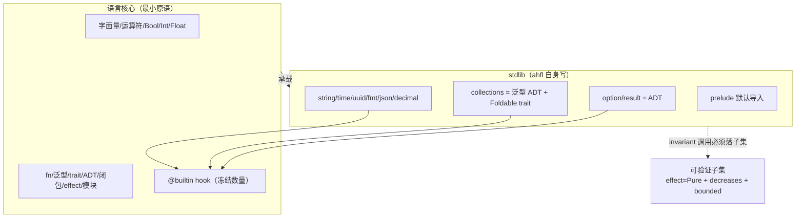

# AHFL Corelib 与类型系统设计 RFC

本文是关于 AHFL 引入**标准库（corelib / `std`）**与**类型系统演进终点**的设计提案。定位为 RFC，**仅讨论，不落代码**。

两层结构：
- §1–§5：**目标设计**（演进正确路径，对标业内最佳实践）。
- §6：**迁移路径**（从现状分阶段逼近目标，P0–P7）。

---

## 1. 设计哲学（核心原则）

> **语言表达力与可验证性正交。用"可验证子集"连接二者，而不是用降级语言换可判定性。**

这是可形式化验证语言领域的共识：

| 语言 | 类型系统完整度 | 可验证性如何保证 |
| --- | --- | --- |
| **Dafny** | 完整：类 / trait / 泛型 / 共归纳数据类型 / 高阶函数 | `requires/ensures/decreases` + SMT；编译器证终止、查 contract |
| **F\*** | 完整：依赖类型 / effect / ADT / 高阶 | effect 系统（`TOT` 全函数 / `GT` / `ST` 状态 / `IO`）；纯函数必须 `TOT` |
| **SPARK Ada** | 完整 Ada 子集 | `Global/Depends/Contract` + proof；不降级语言 |
| **Lean** | 完整：归纳类型 / typeclass / 单子 | `Init/Std/Mathlib` 分层；基本类型也是 stdlib 归纳类型 |

**共性**：语言本身完整，验证靠 effect / 终止度量 / refinement 子集。**没有任何一个靠砍掉 trait / 闭包 / ADT 来保证可判定性。**

AHFL 当前的两层结构（语法关键字 + runtime C++ 焊死、容器焊成关键字、`enum` 无 payload、无 `fn`/泛型/`trait`/闭包）走在这条共识的反面。本 RFC 把 AHFL 拉回正轨。

---

## 2. 现状与问题

- **零 corelib**：96 个 `.ahfl` 全是测试 / 示例，无任何用 ahfl 自身写的库代码。
- **容器 / 原语焊死成关键字 + evaluator switch**：`Optional/List/Set/Map` 是文法写死的内置构造子；算术 / `list.length` / `list[i]` 在 `evaluator.cpp` 硬编码。
- **死类型**：`Set/Map/UUID/Timestamp` 语法合法、runtime 返回 `'not supported in v0.51'`，`value.hpp` 无对应 `Value` 变体。
- **`enum` 无 payload** → 无法表达 `Option/Result` 这类 ADT → 只能焊成关键字。
- **无 `fn` / 用户泛型 / `trait` / 闭包 / 一等函数**。
- **`core-language.zh.md §1`** 把"通用高阶函数与用户自定义泛型"列为 out-of-scope。

---

## 3. 目标设计

### 3.1 语言核心（最小原语集，仅保留语法无法表达者）

判定准则：**一个能力若离开特定文法形态就无法表达，则属于语言核心；否则属于 stdlib。**

| 原语 | 为何必须内置 |
| --- | --- |
| 字面量 `123 / 3.14 / true / "s" / 30s / none` | 离开词法 / 文法无法表达 |
| 运算符 `+ - * / % == != < > and or not is` | 同上 |
| `Bool / Int / Float` 数值类型 | 数值 / 布尔语义无法在库中无损复刻（所有语言如此） |
| `fn` / 泛型 / `trait` / ADT / 一等函数 / 闭包 / 模块 / effect 系统 | 抽象机制，"库化不了承载库的东西" |

**显式不在此列**（属于 stdlib）：`String` 类型、`Optional/Result/List/Set/Map`、`UUID/Timestamp/Duration`、所有容器算法 / 字符串方法 / 序列化 / 格式化。`String` 字面量 `"..."` 内置，但 `String` 类型与方法是 stdlib（对标 Rust `&str`/`String`、Swift `String`）。

### 3.2 类型系统四大支柱

#### 3.2.1 ADT（代数数据类型，`enum` 带 payload）

```ebnf
EnumDecl ::= DocComment? "enum" Ident TypeParams? "{" { Variant } "}" ;
Variant  ::= Ident [ "(" Type { "," Type } ")" ] ;     (* payload 可选 *)
TypeParams ::= "<" TypeParam { "," TypeParam } ">" ;
```

```ahfl
enum Option<T>    { Some(T), None }
enum Result<T, E> { Ok(T), Err(E) }
enum List<T>      { Nil, Cons(T, Box<List<T>>) }     // 也可由 stdlib 用底层 array 实现
```

带 payload 的 `enum` 是表达 `Option/Result` 及任意用户 ADT 的前提——没有它，这类类型只能焊成关键字，这正是当前 AHFL 容器是关键字而非库类型的根因。配套：`match` 模式匹配 + exhaustiveness 检查。

#### 3.2.2 用户泛型 + `trait/typeclass`

```ebnf
TraitDecl ::= "trait" Ident TypeParams? "{" { FnSignature } "}" ;
ImplBlock ::= "impl" [ TraitRef "for" ] TypeRef "{" { FnDef } "}" ;   (* 含 inherent impl *)
FnSignature ::= "fn" Ident TypeParams? "(" [ParamList] ")" (":" Type)? EffectClause? ";" ;
```

```ahfl
trait Foldable<T> {
    fn length(self) effect Pure -> Int;
    fn fold<A>(self, init: A, f: Fn(A, T) -> A) effect Pure decreases length(self) -> A;
}

impl<T> Foldable<T> for List<T>      { /* fold 写一遍 */ }
impl<T> Foldable<T> for Set<T>       { /* 复用 trait 契约 */ }
impl<K, V> Foldable<(K, V)> for Map<K, V> { /* ... */ }
```

`trait` 让 `fold/map/filter` 写一遍服务所有容器，避免按类型重复实现或放弃抽象——这是 Rust / Swift / Haskell 的标准做法。`Eq/Ord/Hash/Foldable/Functor/Iterable` 构成 corelib 的接口骨架。

`trait` 的 coherence：AHFL 是单根模块树（`std` 唯一权威来源），简化为"只有定义类型或定义 trait 的模块可写 `impl`"（Rust orphan rule 的严格版），避免全局 coherence 复杂度。

#### 3.2.3 一等函数 + 真闭包

```ebnf
FnType ::= "Fn" "(" [ TypeList ] ")" "->" Type ;
Lambda ::= "\\" ParamList "->" Expr  |  "{" ParamList "->" Block "}" ;
```

```ahfl
fn sum_squares(xs: List<Int> where length <= 16) effect Pure decreases length(xs) -> Int {
    fold(xs, 0, \a, x -> a + x * x)     // 闭包作为值传递，在 fold 体内被调用
}
```

闭包是**真一等值**（可传递、返回、存储）。`Fn(A,T)->A` 是一等类型，允许 `fold/map/filter` 接受回调、用户组合高阶逻辑。可验证性约束见 §3.4。

#### 3.2.4 统一 effect 系统

```ebnf
EffectClause ::= "effect" EffectSpec [ "decreases" Expr ] ;
EffectSpec   ::= "Pure" | "Nondet" | EffectName { "+" EffectName } ;
```

- `effect Pure`：纯、确定、终止、无副作用。
- `effect Nondet`：非确定（`now` / 随机源）。
- `effect <Capability>+`：使用某 capability（effectful）。
- `decreases <度量>`：终止度量（Dafny 式），编译器证明每次递归度量严格下降 ⇒ 终止。

现有 `ExprEffect`（Pure/ConstOnly/PredicateCall/CapabilityCall/ExternalEffect/Unknown）成为该 effect 系统在表达式层面的**推导结果**，而非并行机制——消除双轨冗余。

### 3.3 stdlib（用 ahfl 自身写）

| 模块 | 内容 | 语言机制 |
| --- | --- | --- |
| `std::option` / `std::result` | `Option<T>` / `Result<T,E>` | ADT |
| `std::collections` | `List/Set/Map` + `Foldable/Functor/Iterable` trait + `fold/map/filter/contains` | 泛型 ADT + trait |
| `std::string` | `String` 类型 + `contains/starts_with/upper/format/parse` | inherent impl + `@builtin` |
| `std::time` / `std::uuid` | `Timestamp/Duration/UUID` 构造与算术 | 包装 `@builtin now/uuid_new` |
| `std::fmt` / `std::json` / `std::decimal` | 格式化 / 序列化 / 精度 | fn + trait（`Display`/`FromJson`） |
| `std::prelude` | 默认导入（`Option/Result/length/fold/...`） | 重导出 |

**`@builtin` hook**：stdlib 访问真正原语（raw list 下标、wall-clock、raw bytes、raw string）的**极少数编译器入口**，数量冻结，新增必须经 RFC。对标 Rust lang items、Swift `Builtin` module、Zig `callconv`。



依赖约束：stdlib 模块间无环；`@builtin` 单向出边（只有 std 可调，用户代码不可直接调）。

### 3.4 可验证子集（effect 维度，非降级）

进入 `contract/requires/ensures/invariant/safety/liveness/flow guard` 的调用**必须满足**：

1. `effect = Pure`
2. 有 `decreases` 度量，且编译器证明终止
3. 输入 bounded refinement（`List<T> where length <= N`，编译器能推出有限界）

编译器在 typecheck 阶段**静态检查**，违反报 `E::not_in_verified_subset`（细分 `E::effect_not_pure` / `E::no_decreases` / `E::unbounded`）。

```ahfl
// ✅ 可验证：Pure + decreases + bounded
fn sum_le(xs: List<Int> where length <= 16)
    effect Pure decreases length(xs) -> Int {
    fold(xs, 0, \a, x -> a + x)
}

// ✅ 合法但不可验证：递归无度量 / IO / Nondet —— 服务 runtime，不进 invariant
fn render(ui: Widget) effect IO -> String { ... }
fn backoff(n: Int) effect Nondet -> Int { ... }
```

**库里非 Pure / 无度量的代码合法存在**，只是不能进 invariant——它们服务 runtime / capability / IO 路径。这是 Dafny / F\* 的核心范式：**语言不因验证而降级，验证靠子集**。

### 3.5 泛型实现：单态化

| 路线 | 适配 AHFL | 选择 |
| --- | --- | --- |
| 单态化（Rust / C++ / Zig） | ✅ 每实例独立 typed 节点，与 typed HIR / SMV bounded 编码天然兼容；零运行时开销 | **采用** |
| 装箱 / 动态派发（Java / OCaml 旧式） | ❌ 引入间接、破坏 typed-IR 可验证等价性；与 SMV bounded 冲突 | 不采用 |

单态化与 SMV bounded 编码天然兼容（每实例独立 typed 节点），是语言设计的合理选择。实例化爆炸用编译期预算 + 缓存缓解（见 §5）。

---

## 4. 业内对标

| 语言 | 类型系统 | stdlib 自举 | 可验证性 | AHFL 借鉴 |
| --- | --- | --- | --- | --- |
| **Rust** | fn/泛型/trait/ADT/闭包 | ✅ 几乎全 stdlib | 不验证（靠 unsafe 边界） | 类型系统形态 + 单态化 + stdlib 自举 |
| **Swift** | 同上 | ✅ `String/Array/Dictionary/Set` 全 stdlib | 不验证 | 容器 stdlib 化（`String` 也是库类型） |
| **Dafny** | 完整：类/trait/泛型/共归纳/高阶 | — | `requires/ensures/decreases` + SMT | 可验证子集 = effect + decreases + refinement |
| **F\*** | 完整 + 依赖类型 + effect | — | effect 系统 `TOT/GT/ST` + refinement | effect 维度划分验证性 |
| **SPARK Ada** | 完整 Ada 子集 | — | `Global/Depends/Contract` + proof | 子集不降级语言 |
| **Lean** | 归纳类型/typeclass/单子 | ✅ `Init/Std/Mathlib` 分层 | 归纳类型在 stdlib，编译器识少量归约 | ADT + typeclass + stdlib 分层 |
| **Move** | 整数/bool/vector/address 内置 | ✅ stdlib 用 Move 自写 | 资源/abilities | vector 原语 + stdlib 自举（部分对标） |

**AHFL 定位**：Rust/Swift 的**类型系统形态** + Dafny/F\* 的**可验证子集机制** + Lean/Zig 的**stdlib 自举**。

---

## 5. SMV 编码约束（AHFL 特有）

AHFL 用 SMV 模型检测（CTL/LTL），**必须有限状态**——比 Dafny（SMT，可处理部分无限/归纳）更硬。含义：

- 可验证子集的 **bounded 约束比 Dafny 更严**：进入验证的数据必须能编码为有限 SMV 状态。
- **这只收紧子集定义，不构成砍语言特性的理由**——子集外代码（递归算法、高阶库、IO）照常存在于 runtime 路径。

容器在 SMV 中的编码（依赖 refinement 提供 finite bound）：

| stdlib 类型 | SMV 编码 | 前置 refinement |
| --- | --- | --- |
| `List<T> where length <= N` | fixed-size array（N 槽 + valid bit） | `length <= N` |
| `Set<T>` | bit-vector over finite domain | `T` 有限域 |
| `Map<K,V>` | array over finite `K` | `K` 有限域 |
| `Option<T>` | `T` + valid bit | `T` 可编码 |
| `String` | bounded char array | `length <= N` |

**`now` / wall-clock**：真非确定环境输入，SMV 无法直接建模。时序约束（"N 步内完成"、"30s 超时"）用 **SMV step/phase 计数 + temporal 算子**（`eventually`/`always` + workflow lifecycle phase `started/running/completed`）建模，而非 wall-clock——这是 AHFL 已有机制。`now` 进 invariant 直接报 `E::nondet_in_invariant`。

单态化预算：进可验证子集的函数特化数设上限（默认 ≤ 32，stdlib 自身特化单独预算不计入用户额度），超出报 `E::monomorphization_budget_exceeded`。

---

## 6. 迁移路径（现状 → 目标设计）

> 每阶段是向目标设计的**逼近**，不是终态。阶段间有依赖；P4/P5/P7 可部分并行。

```mermaid
gantt
    title Corelib 与类型系统演进（相对时间）
    dateFormat X
    axisFormat %s
    section 边界
    P0 哲学+边界冻结           :p0, 0, 2W
    section 类型系统
    P1 ADT (enum payload)      :p1, after p0, 6W
    P2 fn+泛型+闭包 (XL)       :p2, after p1, 10W
    P3 trait/typeclass         :p3, after p2, 6W
    P4 effect系统+可验证子集   :p4, after p2, 6W
    section 库化
    P5 容器 stdlib 化          :p5, after p3 p4, 8W
    P6 stdlib 实现+prelude     :p6, after p5, 6W
    section runtime
    P7 runtime 补全(可并行)    :p7, after p0, 4W
```



### P0. 哲学与边界冻结（工程量 S，前置）
- 本 RFC 评审通过。
- `core-language.zh.md §1` 修订：删除"通用高阶函数与用户自定义泛型"的 out-of-scope 条目，改为"由 corelib RFC 定义的可验证演进路径"，写入"表达力 ⟂ 可验证性正交"为语言演进原则。
- **验收**：§1 修订合并；RFC 进 `docs/README.md` 索引。

### P1. ADT（`enum` 带 payload）（工程量 L）
- grammar / AST：`EnumVariant` 增 payload；`match` + 模式匹配 + exhaustiveness。
- typecheck：ADT 构造子、match narrowing、payload 类型检查。
- 现有无 payload `enum` 平滑升级（payload 可空）。
- **意义**：`Option/Result` 能用语言表达的前置。
- **验收**：`enum Option<T> { Some(T), None }` 可声明、`match` 穷尽。

### P2. `fn` + 用户泛型 + 一等闭包（工程量 XL，最高风险）
- `fn` 带 body / 参数 / 返回类型 / effect clause（初版仅 `Pure/Nondet/Capability`，无 `decreases`）。
- 用户泛型 + 单态化 + 缓存。
- 一等函数类型 `Fn(...)->...` + 真闭包（捕获、传递、返回）。
- typed HIR lowering：泛型实例化、闭包捕获编码。
- **依赖**：typed HIR 已稳定。
- **风险（高）**：单态化状态空间膨胀（缓解：预算+缓存）；闭包捕获别名逃逸（缓解：捕获 bounded 值类型）；与现有 `predicate`/refinement 交互（缓解：先不支持泛型 predicate）。
- **验收**：`fn id<T>(x: T) -> T { x }`、闭包作高阶函数参数可用且单态化。

### P3. `trait/typeclass`（工程量 L）
- `trait` 声明 + `impl` 块 + resolution + coherence（orphan 严格版：`impl` 须在定义类型或定义 trait 的模块）。
- 定义 `Eq/Ord/Hash/Foldable/Functor/Iterable`。
- **意义**：`fold/map/filter` 写一遍服务 `List/Set/Map`。
- **验收**：`impl<T> Foldable<T> for List<T>` 可写、可 resolution、可调用。

### P4. effect 系统 + 可验证子集（工程量 L）
- 统一 effect 系统（`Pure/Nondet/Capability` + `decreases` 终止度量）。
- 编译器静态检查可验证子集：`Pure` + `decreases` 证终止 + bounded refinement。
- 吸收 / 替换现有 `ExprEffect` 6 级（成为 effect 系统的推导结果）。
- `contract/invariant/safety/liveness/flow guard` 调用必须落子集，否则 `E::not_in_verified_subset`。
- **验收**：`Pure`+`decreases`+bounded 函数可进 invariant 且 SMV 编码成功；非 Pure 函数进 invariant 报错。

### P5. 容器 stdlib 化（工程量 L，最痛重构）
- `Optional/Result/List/Set/Map` 从**关键字迁移到 stdlib ADT / 泛型类型**。
- `some/none`、`[...]`、`set[...]`、`map[...]` 变为 ADT 构造子 / 字面量语法糖（保留语法友好性，语义在库）。
- typecheck / IR / SMV 改为消费 stdlib 类型；结构性 op（`length`/下标/字面量构造）下沉为 `@builtin`，算法（`fold/map/filter`）在库。
- **风险（高）**：牵动现有 SMV 编码最深；需逐容器迁移 + 等价性测试。
- **验收**：`Optional/Result/List/Set/Map` 是 stdlib 类型，关键字仅为语法糖；现有 SMV golden 等价。

### P6. stdlib 实现 + prelude（工程量 L）
- 用 ahfl 写出 `std::collections/string/time/uuid/json/fmt/decimal/result`。
- prelude 默认导入；std 分发（源码 search root）。
- **验收**：`import std::collections; fold(xs, 0, ...)` 可用；prelude 零配置。

### P7. runtime 补全（工程量 M，可与 P5 并行）
- `value.hpp` 补 `SetValue/MapValue/UuidValue/TimestampValue`。
- evaluator 补全，消除 `'not supported in v0.51'`。
- 算术 / 容器 op 背后的 `@builtin` 入口。
- **验收**：`Set/Map/UUID/Timestamp` 可构造与运算；evaluator 不再 `not supported`。

---

## 7. 开放问题

1. **trait coherence**：单根模块树能否进一步简化 orphan rule（如 `impl` 必须与类型或 trait 同模块）。
2. **闭包捕获 refinement**：闭包捕获 `List<T>` 时是否在闭包定义点固化长度上界。
3. **effect 系统与 capability effect 的统一粒度**：`effect <Capability>+` 与现有 capability effect 系统如何合一。
4. **`std::result` 与现有错误模型**：AHFL capability fail-closed 错误模型如何与 `Result<T,E>` + `?`/`try` 交互。
5. **prelude stability policy**：prelude 是 lang stability 边界，需独立策略。
6. **P5 容器库化对现有 SMV 编码的迁移策略**：最大工程风险，需 P5 前出独立迁移 RFC。
7. **泛型 refinement 交互**：`List<T> where length <= 8` 中 `T` 与 `length` 约束是否在 P2 一并支持。

---

## 8. 结论

本 RFC 确立 AHFL corelib 与类型系统的演进终点：**完整现代类型系统**（ADT / 泛型 / `trait` / 一等闭包 / 统一 effect 系统）**+ 容器 stdlib 化 + 可验证子集**（effect `Pure` + `decreases` + bounded refinement）。

这是 **Rust/Swift（类型系统形态）+ Dafny/F\*（可验证子集机制）+ Lean/Zig（stdlib 自举）** 的共识路径。核心原则一句话：**语言表达力与可验证性正交，用可验证子集连接，不用降级语言换可判定性。**

迁移分 P0–P7 七阶段；**P2（fn/泛型/闭包，XL）与 P5（容器库化）是两大关键工程节点**，前者是 typechecker 现代化级别，后者牵动 SMV 编码最深。

本 RFC 不落代码，等待 owner 评审。
