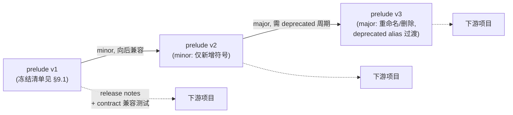
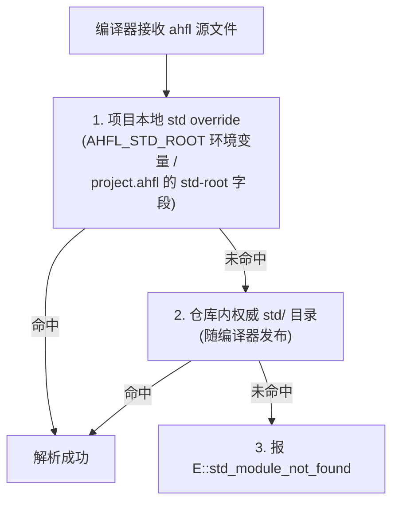
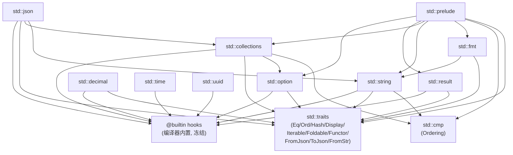

# AHFL Corelib stdlib 完整接口规范

本文是 [corelib RFC](./corelib-rfc.zh.md) §3.3 stdlib 各模块的**详细接口规范**附件，把 RFC 表格中的模块清单展开为可直接据以实现的完整签名。同时决议主 RFC §7 的开放问题 4（`std::result` 与现有错误模型）与开放问题 5（prelude stability policy）。

- 母文档：[corelib-rfc.zh.md](./corelib-rfc.zh.md)（设计哲学、类型系统四大支柱、可验证子集、迁移路径 P0–P7）
- 语言规范：[core-language.zh.md](../spec/core-language.zh.md)（§4.6.8 ExprEffect 6 级、§3.4 capability、§4.6.5 capability 调用规则）
- 形式化后端：[formal-backend.zh.md](./formal-backend.zh.md)（SMV 编码、observation 抽象）
- 模块解析：[module-resolution-rules.zh.md](./module-resolution-rules.zh.md)

风格与母文档严格一致：中文正文、技术对照用表格、EBNF 用 ```` ```ebnf ```` 代码块、ahfl 示例用 ```` ```ahfl ````、架构/流程用 mermaid、诊断码用 `E::xxx` 形式。本文不落代码，只产出接口规范与决议；模块实现见 RFC P6。

---

## 1. 设计约束与术语

### 1.1 类型系统前置

本文所有签名假设主 RFC §3.2 的类型系统四大支柱已落地：

1. **ADT**（§3.2.1）：`enum` 带 payload + `match` 模式匹配 + exhaustiveness
2. **用户泛型 + trait**（§3.2.2）：`fn`/`impl`/`trait`/orphan 严格版 coherence
3. **一等闭包**（§3.2.3）：`Fn(A,T)->A` 是一等类型，闭包可传递/返回/存储
4. **统一 effect 系统**（§3.2.4）：`effect Pure | Nondet | <Capability>+`，`decreases <度量>` 终止度量

签名中出现的语法元素含义：

| 元素 | 含义 |
| --- | --- |
| `effect Pure` | 纯、确定、终止、无副作用；可进可验证子集 |
| `effect Pure decreases E` | 纯且编译器证终止，度量 `E` 严格下降 |
| `effect Nondet` | 非确定（读 wall-clock / 随机源） |
| `effect IO` / `effect <Capability>` | 调用 capability（effectful），不进子集 |
| `@builtin("name")` | 编译器原语 hook，仅 `std` 模块可调用 |
| `where length <= N` | bounded refinement，SMV 编码前置 |
| `impl<T> Trait<T> for Type<T>` | trait 实现，受 orphan rule 约束 |

### 1.2 effect 与现有 ExprEffect 6 级的关系

主 RFC §3.2.4 已确立：现有 `ExprEffect`（Pure / ConstOnly / PredicateCall / CapabilityCall / ExternalEffect / Unknown，见 `effects.cpp` 与 spec §4.6.8）成为统一 effect 系统在**表达式层面的推导结果**，而非并行机制。本文签名中的 `effect` 子句对应 stdlib 函数自身的声明级 effect，调用点的 `ExprEffect` 由其推导：

| stdlib 函数 effect 子句 | 调用点的 `ExprEffect`（推导结果） | 是否纯（rank ≤ 2） |
| --- | --- | --- |
| `effect Pure` | `Pure` 或 `PredicateCall`（视是否含输入） | 是 |
| `effect Pure decreases E` | `Pure` / `PredicateCall` | 是 |
| `effect Nondet` | `ExternalEffect`（非确定环境输入） | 否 |
| `effect <Capability>+` | `CapabilityCall` 或 `ExternalEffect`（按 effect profile） | 否 |

因此 `fold`（`effect Pure decreases length(self)`）调用点推导为 `PredicateCall`，可自由进入 `requires` / `ensures` / `if` / `assert`；而 `now`（`effect Nondet`）调用点推导为 `ExternalEffect`，禁止进入纯表达式位置，违反报 `E::effect_not_pure`。

### 1.3 `@builtin` hook 的约束

`@builtin("name")` 是 stdlib 访问真正原语的**唯一入口**，约束与 RFC §3.3 一致：

1. 数量冻结，新增必须经 RFC（完整清单见 §5）
2. 单向出边：只有 `std::*` 模块可声明/调用 `@builtin`；用户模块直接调用报 `E::builtin_outside_std`
3. `@builtin` 函数自身的 effect 由其语义决定，必须显式标注（不允许省略）
4. `@builtin` 不进入可验证子集；调用 `@builtin` 的 stdlib 包装函数若想进子集，必须把非纯 `@builtin` 排除在 `effect Pure` 体内

---

## 2. std::option — `Option<T>` ADT

对标 Rust `core::option::Option`、Swift `Optional`、Haskell `Maybe`。

### 2.1 类型定义

```ahfl
module std::option;

enum Option<T> {
    Some(T),
    None,
}
```

构造子受现有文法 `some(e)` / `none` 字面量语法糖覆盖（见 RFC P5：`some(e)` desugar 为 `Option::Some(e)`，`none` 在期望类型为 `Option<T>` 时 desugar 为 `Option::None`）。模式匹配：

```ahfl
match opt {
    Some(x) => ...,
    None    => ...,
}
```

### 2.2 完整接口

```ahfl
// —— 谓词（effect Pure）——
fn is_some<T>(self: Option<T>) effect Pure -> Bool;
fn is_none<T>(self: Option<T>) effect Pure -> Bool;

// —— 同型变换（effect Pure，回调必须 effect Pure）——
fn map<T, U>(self: Option<T>, f: Fn(T) -> U)
    effect Pure -> Option<U>
    requires effect_of(f) == Pure
    ensures   is_none(result) == is_none(self);

fn and_then<T, U>(self: Option<T>, f: Fn(T) -> Option<U>)
    effect Pure -> Option<U>
    requires effect_of(f) == Pure;

fn or_else<T>(self: Option<T>, alt: Fn() -> Option<T>)
    effect Pure -> Option<T>
    requires effect_of(alt) == Pure;

fn filter<T>(self: Option<T>, p: Fn(T) -> Bool)
    effect Pure -> Option<T>
    requires effect_of(p) == Pure;

// —— 取值（effect Pure）——
fn unwrap_or<T>(self: Option<T>, default: T) effect Pure -> T;
fn unwrap_or_else<T>(self: Option<T>, default: Fn() -> T)
    effect Pure -> T
    requires effect_of(default) == Pure;
fn get_or_insert<T>(self: Option<T>, value: T) effect Pure -> T;     // self: 不可变, 返回 T 副本
fn zip<T, U>(self: Option<T>, other: Option<U>) effect Pure -> Option<(T, U)>;

// —— 折叠/比较（依赖 trait）——
impl<T> Iterable<T> for Option<T>;
impl<T> Foldable<T> for Option<T>     { /* length: 0 or 1 */ }
impl<T: Eq>  Eq  for Option<T>;
impl<T: Ord> Ord for Option<T>        { /* None < Some(_) */ }
impl<T: Hash> Hash for Option<T>;
impl<T: Display> Display for Option<T>;
```

注：`requires effect_of(f) == Pure` 是 trait-bound 形式的 effect 约束，闭包参数 `f` 必须自身是 `effect Pure`，否则 `Option::map` 调用点会被推导为非纯，禁止进入纯表达式位置。`effect_of(f)` 是 effect 系统的反射查询，对标 F\* 的 `effect_of`。

### 2.3 与现有 `Optional<T>` 的迁移

RFC P5 把现有关键字 `Optional<T>` 迁移为 `Option<T>` ADT。过渡期 `Optional<T>` 作为 `Option<T>` 的 type alias 保留（spec §4.3.1 别名透明），现有 `some(e)` / `none` 字面量语法保留为构造子语法糖。

---

## 3. std::result — `Result<T,E>` ADT

对标 Rust `core::result::Result`、Swift `Result`、Haskell `Either`。

### 3.1 类型定义

```ahfl
module std::result;

enum Result<T, E> {
    Ok(T),
    Err(E),
}
```

### 3.2 完整接口

```ahfl
// —— 谓词 ——
fn is_ok<T, E>(self: Result<T, E>) effect Pure -> Bool;
fn is_err<T, E>(self: Result<T, E>) effect Pure -> Bool;

// —— 同型变换 ——
fn map<T, U, E>(self: Result<T, E>, f: Fn(T) -> U)
    effect Pure -> Result<U, E>
    requires effect_of(f) == Pure;

fn map_err<T, E, F>(self: Result<T, E>, f: Fn(E) -> F)
    effect Pure -> Result<T, F>
    requires effect_of(f) == Pure;

fn and_then<T, U, E>(self: Result<T, E>, f: Fn(T) -> Result<U, E>)
    effect Pure -> Result<U, E>
    requires effect_of(f) == Pure;

fn or_else<T, E, F>(self: Result<T, E>, f: Fn(E) -> Result<T, F>)
    effect Pure -> Result<T, F>
    requires effect_of(f) == Pure;

// —— 取值 ——
fn unwrap<T, E: Display>(self: Result<T, E>) effect Pure -> T
    requires is_ok(self)
    ensures  result matches Ok(_);                  // 运行时 panic 由 §8.2 决议, 编译期不可达
fn unwrap_or<T, E>(self: Result<T, E>, default: T) effect Pure -> T;
fn unwrap_or_else<T, E>(self: Result<T, E>, default: Fn(E) -> T)
    effect Pure -> T
    requires effect_of(default) == Pure;

// —— 副作用转换：try 操作符 desugar 入口 ——
// `expr?` desugar 为 try(expr)
fn try<T, E>(r: Result<T, E>) effect Pure -> T
    requires is_ok(r)
    ensures  matches Ok(result);

// —— Option 互转 ——
fn ok<T, E>(self: Result<T, E>) effect Pure -> Option<T>;
fn err<T, E>(self: Result<T, E>) effect Pure -> Option<E>;
fn from_option<T, E>(opt: Option<T>, err: Fn() -> E)
    effect Pure -> Result<T, E>
    requires effect_of(err) == Pure;

// —— trait 实现 ——
impl<T, E> Iterable<T> for Result<T, E>;   // 只迭代 Ok 值
impl<T: Eq, E: Eq>   Eq  for Result<T, E>;
impl<T: Ord, E: Ord> Ord for Result<T, E>;  // Err < Ok, 同型按内层比较
impl<T: Hash, E: Hash> Hash for Result<T, E>;
impl<T: Display, E: Display> Display for Result<T, E>;
```

### 3.3 `try` / `?` 操作符

`?` 操作符是语法糖，**仅**在返回类型为 `Result<T, E>` 或 `Option<T>` 的 `fn` 体内合法。`expr?` desugar 规则：

```text
expr : Result<T, E>   in fn returning Result<R, E>
------------------------------------------------------
match expr {
    Ok(v)  => v,
    Err(e) => return Err(e),
}

expr : Option<T>      in fn returning Option<R>
------------------------------------------------------
match expr {
    Some(v) => v,
    None    => return None,
}
```

`?` 在 capability `flow` handler 中**不允许**——`flow` 的失败由 capability fail-closed 模型承载（见 §8 决议 4）。`?` 在 predicate / contract 表达式中**不允许**——这些位置要求纯表达式，`?` 携带隐式 `return` 属于控制流副作用。

---

## 4. std::collections — `List/Set/Map` + 高阶 trait

对标 Rust `std::collections` + `Iterator`/`FromIterator`、Swift `Array/Set/Dictionary`、Haskell `Foldable`/`Functor`。

### 4.1 类型定义

```ahfl
module std::collections;

// 三个容器底层由 @builtin 暴露的原语数组实现 (RFC P5: 结构性 op 下沉为 @builtin)
// 用户看到的形态是带 bounded refinement 的泛型类型
type List<T> where length <= MAX_LIST_LEN;       // 默认 65536, 用户可显式收窄
type Set<T: Hash>;
type Map<K: Hash, V>;
```

字面量语法糖（保留 RFC P5 的语法友好性）：

```ahfl
[1, 2, 3]                       // List<Int>
set[1, 2, 3]                    // Set<Int>
map["a": 1, "b": 2]             // Map<String, Int>
```

### 4.2 完整接口（List）

```ahfl
// —— 构造 ——
fn empty<T>() effect Pure -> List<T>;
fn singleton<T>(x: T) effect Pure -> List<T>;

// —— 谓词 ——
fn is_empty<T>(self: List<T>) effect Pure -> Bool;
fn contains<T: Eq>(self: List<T>, x: T) effect Pure -> Bool;
fn length<T>(self: List<T>) effect Pure -> Int
    ensures result >= 0;

// —— 访问 (下标走 @builtin) ——
fn get<T>(self: List<T>, i: Int) effect Pure -> Option<T>
    ensures (i < 0 or i >= length(self)) == is_none(result);
fn first<T>(self: List<T>) effect Pure -> Option<T>;
fn last<T>(self: List<T>)  effect Pure -> Option<T>;
fn head<T>(self: List<T>) effect Pure -> T requires length(self) > 0;
fn tail<T>(self: List<T>) effect Pure -> List<T>;

// —— 拼接/切片 ——
fn append<T>(self: List<T>, other: List<T>) effect Pure -> List<T>
    ensures length(result) == length(self) + length(other);
fn concat<T>(xs: List<List<T>>) effect Pure -> List<T>;
fn slice<T>(self: List<T>, from: Int, to: Int) effect Pure -> List<T>
    requires 0 <= from and from <= to and to <= length(self);

// —— 变更 (返回新容器, 函数式不可变语义) ——
fn insert<T>(self: List<T>, i: Int, x: T) effect Pure -> List<T>
    requires 0 <= i and i <= length(self)
    ensures  length(result) == length(self) + 1;
fn remove<T: Eq>(self: List<T>, x: T) effect Pure -> List<T>;
fn remove_at<T>(self: List<T>, i: Int) effect Pure -> List<T>
    requires 0 <= i and i < length(self);

// —— 高阶 (依赖 trait, 可验证子集友好) ——
fn map<T, U>(self: List<T>, f: Fn(T) -> U)
    effect Pure decreases length(self) -> List<U>
    requires effect_of(f) == Pure
    ensures  length(result) == length(self);

fn filter<T>(self: List<T>, p: Fn(T) -> Bool)
    effect Pure decreases length(self) -> List<T>
    requires effect_of(p) == Pure
    ensures  length(result) <= length(self);

fn fold<T, A>(self: List<T>, init: A, f: Fn(A, T) -> A)
    effect Pure decreases length(self) -> A
    requires effect_of(f) == Pure;

fn fold_right<T, A>(self: List<T>, init: A, f: Fn(T, A) -> A)
    effect Pure decreases length(self) -> A
    requires effect_of(f) == Pure;

fn for_each<T>(self: List<T>, f: Fn(T) -> Unit)
    effect <EffectOf f> decreases length(self) -> Unit;   // 效果透传回调

fn flat_map<T, U>(self: List<T>, f: Fn(T) -> List<U>)
    effect Pure decreases length(self) -> List<U>
    requires effect_of(f) == Pure;

// —— 排序 (依赖 Ord) ——
fn sort<T: Ord>(self: List<T>) effect Pure -> List<T>
    ensures length(result) == length(self);
fn sort_by<T, K: Ord>(self: List<T>, key: Fn(T) -> K)
    effect Pure -> List<T>
    requires effect_of(key) == Pure;
fn reverse<T>(self: List<T>) effect Pure -> List<T>;

// —— 转换 ——
fn to_set<T: Hash>(self: List<T>) effect Pure -> Set<T>;
fn keys<K: Hash, V>(self: Map<K, V>) effect Pure -> List<K>;
fn values<K, V>(self: Map<K, V>) effect Pure -> List<V>;
fn entries<K, V>(self: Map<K, V>) effect Pure -> List<(K, V)>;
```

### 4.3 完整接口（Set）

```ahfl
// —— 构造/谓词 ——
fn empty<T: Hash>() effect Pure -> Set<T>;
fn singleton<T: Hash>(x: T) effect Pure -> Set<T>;
fn is_empty<T: Hash>(self: Set<T>) effect Pure -> Bool;
fn contains<T: Hash>(self: Set<T>, x: T) effect Pure -> Bool;
fn length<T: Hash>(self: Set<T>) effect Pure -> Int
    ensures result >= 0;

// —— 变更 ——
fn insert<T: Hash>(self: Set<T>, x: T) effect Pure -> Set<T>;
fn remove<T: Hash>(self: Set<T>, x: T) effect Pure -> Set<T>;

// —— 集合运算 ——
fn union<T: Hash>(self: Set<T>, other: Set<T>) effect Pure -> Set<T>;
fn intersection<T: Hash>(self: Set<T>, other: Set<T>) effect Pure -> Set<T>;
fn difference<T: Hash>(self: Set<T>, other: Set<T>) effect Pure -> Set<T>;
fn is_subset<T: Hash>(self: Set<T>, other: Set<T>) effect Pure -> Bool;
fn is_disjoint<T: Hash>(self: Set<T>, other: Set<T>) effect Pure -> Bool;

// —— 高阶 ——
fn map<T: Hash, U: Hash>(self: Set<T>, f: Fn(T) -> U)
    effect Pure decreases length(self) -> Set<U>
    requires effect_of(f) == Pure;
fn filter<T: Hash>(self: Set<T>, p: Fn(T) -> Bool)
    effect Pure decreases length(self) -> Set<T>
    requires effect_of(p) == Pure;
fn fold<T: Hash, A>(self: Set<T>, init: A, f: Fn(A, T) -> A)
    effect Pure decreases length(self) -> A
    requires effect_of(f) == Pure;
```

### 4.4 完整接口（Map）

```ahfl
// —— 构造/谓词 ——
fn empty<K: Hash, V>() effect Pure -> Map<K, V>;
fn is_empty<K: Hash, V>(self: Map<K, V>) effect Pure -> Bool;
fn contains_key<K: Hash, V>(self: Map<K, V>, k: K) effect Pure -> Bool;
fn length<K: Hash, V>(self: Map<K, V>) effect Pure -> Int
    ensures result >= 0;

// —— 访问/变更 ——
fn get<K: Hash, V>(self: Map<K, V>, k: K) effect Pure -> Option<V>;
fn get_or<K: Hash, V>(self: Map<K, V>, k: K, default: V) effect Pure -> V;
fn insert<K: Hash, V>(self: Map<K, V>, k: K, v: V) effect Pure -> Map<K, V>;
fn remove<K: Hash, V>(self: Map<K, V>, k: K) effect Pure -> Map<K, V>;

// —— 高阶 ——
fn map_values<K: Hash, V, U>(self: Map<K, V>, f: Fn(V) -> U)
    effect Pure decreases length(self) -> Map<K, U>
    requires effect_of(f) == Pure;
fn filter<K: Hash, V>(self: Map<K, V>, p: Fn(K, V) -> Bool)
    effect Pure decreases length(self) -> Map<K, V>
    requires effect_of(p) == Pure;
fn fold<K: Hash, V, A>(self: Map<K, V>, init: A, f: Fn(A, K, V) -> A)
    effect Pure decreases length(self) -> A
    requires effect_of(f) == Pure;
```

### 4.5 SMV 编码对应

容器 SMV 编码策略与 RFC §5 表格一致：

| stdlib 类型 | SMV 编码 | 前置 refinement | 编码位置 |
| --- | --- | --- | --- |
| `List<T> where length <= N` | fixed-size array（N 槽 + valid bit + length 计数器） | `length <= N` | emit-smv bounded array |
| `Set<T: Hash>` over finite `T` | bit-vector over finite domain | `T` 有限域 | emit-smv bitset |
| `Map<K: Hash, V>` over finite `K` | array over finite `K` | `K` 有限域 | emit-smv array |
| `Option<T>` | `T` + valid bit | `T` 可编码 | emit-smv option |
| `Result<T,E>` | `(T, E, is_ok)` 三元组 | `T`/`E` 可编码 | emit-smv tagged union |

进可验证子集的容器操作（`fold`/`map`/`filter`）必须是 `effect Pure decreases length(self)`，使编译器能在 SMV 中展开为有限 bounded 循环；`sort`/`flat_map` 默认不进子集（终止度量复杂，需用户显式 `decreases` 提示）。

---

## 5. `@builtin` hook 完整清单

冻结清单，对标 Rust lang items、Swift `Builtin` module、Zig `@builtin`。新增必须经 RFC，且只能在 `std::*` 模块调用。

### 5.1 容器结构性原语

| hook 签名 | 语义 | 效果 |
| --- | --- | --- |
| `@builtin("list_raw_get") fn list_raw_get<T>(xs: List<T>, i: Int) -> T` | 原始下标读，越界 UB（仅 std 内部用，外层 `get` 包装为 `Option<T>`） | Pure |
| `@builtin("list_raw_set") fn list_raw_set<T>(xs: List<T>, i: Int, x: T) -> List<T>` | 原始下标写 | Pure |
| `@builtin("list_raw_length") fn list_raw_length<T>(xs: List<T>) -> Int` | 原始长度 | Pure |
| `@builtin("list_raw_alloc") fn list_raw_alloc<T>(n: Int) -> List<T>` | 分配 N 槽未初始化 list | Pure |
| `@builtin("set_raw_contains") fn set_raw_contains<T: Hash>(s: Set<T>, x: T) -> Bool` | 哈希集合成员判定 | Pure |
| `@builtin("map_raw_get") fn map_raw_get<K: Hash, V>(m: Map<K,V>, k: K) -> V` | 哈希映射读，缺键 UB | Pure |
| `@builtin("map_raw_contains_key") fn map_raw_contains_key<K: Hash, V>(m: Map<K,V>, k: K) -> Bool` | 哈希映射键存在 | Pure |

调用约束：`list_raw_get`/`map_raw_get` 不做边界检查，由 `std::collections::get` 在其上包一层 `Option<T>` 返回。直接在用户模块调用任一 `@builtin` 报 `E::builtin_outside_std`。

### 5.2 字符串/字节原语

| hook 签名 | 语义 | 效果 |
| --- | --- | --- |
| `@builtin("string_raw_bytes") fn string_raw_bytes(s: String) -> List<Int>` | 取 UTF-8 字节码点列表（bounded） | Pure |
| `@builtin("string_raw_from_bytes") fn string_raw_from_bytes(bs: List<Int>) -> String` | 由码点列表构造字符串 | Pure |
| `@builtin("string_raw_length") fn string_raw_length(s: String) -> Int` | 字符数 | Pure |
| `@builtin("string_raw_slice") fn string_raw_slice(s: String, from: Int, to: Int) -> String` | 子串 | Pure |
| `@builtin("string_raw_concat") fn string_raw_concat(a: String, b: String) -> String` | 拼接 | Pure |

### 5.3 数值/类型原语

| hook 签名 | 语义 | 效果 |
| --- | --- | --- |
| `@builtin("int_to_string") fn int_to_string(n: Int) -> String` | 整数转十进制字符串 | Pure |
| `@builtin("float_to_string") fn float_to_string(x: Float) -> String` | 浮点转字符串 | Pure |
| `@builtin("string_to_int") fn string_to_int(s: String) -> Option<Int>` | 字符串解析为整数 | Pure |
| `@builtin("decimal_raw_add") fn decimal_raw_add(a: Decimal, b: Decimal, scale: Int) -> Decimal` | 固定 scale 十进制加 | Pure |
| `@builtin("decimal_raw_mul") fn decimal_raw_mul(a: Decimal, b: Decimal, scale: Int) -> Decimal` | 固定 scale 十进制乘 | Pure |

### 5.4 时间/非确定原语

| hook 签名 | 语义 | 效果 |
| --- | --- | --- |
| `@builtin("wall_clock_now") fn wall_clock_now() -> Timestamp` | 读 wall-clock 当前时间戳 | Nondet |
| `@builtin("duration_from_ms") fn duration_from_ms(ms: Int) -> Duration` | 构造 Duration | Pure |
| `@builtin("timestamp_add") fn timestamp_add(t: Timestamp, d: Duration) -> Timestamp` | 时间戳算术 | Pure |

### 5.5 标识/序列化原语

| hook 签名 | 语义 | 效果 |
| --- | --- | --- |
| `@builtin("uuid_new") fn uuid_new() -> UUID` | 生成 v4 UUID（随机源） | Nondet |
| `@builtin("uuid_from_string") fn uuid_from_string(s: String) -> Option<UUID>` | 解析 UUID 字符串 | Pure |
| `@builtin("json_parse_raw") fn json_parse_raw(s: String) -> Option<JsonValue>` | 原始 JSON 解析（结果类型见 §10） | Pure |
| `@builtin("json_emit_raw") fn json_emit_raw(v: JsonValue) -> String` | 原始 JSON 序列化 | Pure |

### 5.6 调用约束小结

```ahfl
// ✅ 合法：在 std::string 内调用 @builtin
module std::string;
fn length(s: String) effect Pure -> Int {
    @builtin("string_raw_length")(s)
}

// ❌ 非法：用户模块直接调用 @builtin
module app::service;
fn bad(s: String) -> Int {
    @builtin("string_raw_length")(s)    // E::builtin_outside_std
}
```

诊断：`E::builtin_outside_std`（用户模块直接调用 `@builtin`）、`E::builtin_unknown`（hook 名不在冻结清单内）、`E::builtin_missing_effect`（`@builtin` 函数声明省略 effect 标注）。

---

## 6. trait 完整签名

对标 Rust `std::iter`/`std::cmp`/`std::fmt`/`std::hash`、Haskell typeclass、Swift protocol。

### 6.1 `Eq` / `Ord` / `Hash`

```ahfl
trait Eq {
    fn eq(self, other: Self) effect Pure -> Bool;
    fn ne(self, other: Self) effect Pure -> Bool { not eq(self, other) }   // 默认实现
}
// 自反/对称/传递由 contract 承载 (用户写 impl 时可选):
//   requires: forall x. eq(x, x);
//   requires: forall x y. eq(x, y) => eq(y, x);
//   requires: forall x y z. eq(x, y) and eq(y, z) => eq(x, z);

trait Ord: Eq {
    fn compare(self, other: Self) effect Pure -> Ordering;     // Ordering = enum { Less, Equal, Greater }
    fn lt(self, other: Self) effect Pure -> Bool { compare(self, other) == Less }
    fn le(self, other: Self) effect Pure -> Bool { compare(self, other) != Greater }
    fn gt(self, other: Self) effect Pure -> Bool { compare(self, other) == Greater }
    fn ge(self, other: Self) effect Pure -> Bool { compare(self, other) != Less }
    fn max(self, other: Self) effect Pure -> Self { if gt(self, other) { self } else { other } }
    fn min(self, other: Self) effect Pure -> Self { if lt(self, other) { self } else { other } }
    fn clamp(self, lo: Self, hi: Self) effect Pure -> Self;
}

trait Hash {
    fn hash(self) effect Pure -> Int;        // 一致性契约: eq(x,y) => hash(x) == hash(y)
}
```

`Ordering` 在 `std::cmp` 模块定义：`enum Ordering { Less, Equal, Greater }`，进 prelude。

### 6.2 `Foldable` / `Functor` / `Iterable`

```ahfl
// —— 可迭代: 提供 element-by-element 推进 ——
trait Iterable<T> {
    fn next(self) effect Pure -> Option<(Self, T)>;   // 返回 (剩余迭代器, 当前元素), None 表耗尽
    // 注: AHFL 函数式不可变语义下, Iterable 用 (remaining, value) 元组替代 Rust 的 &mut self
}

// —— 可折叠: 提供终止度量 ——
trait Foldable<T> {
    fn length(self) effect Pure -> Int
        ensures result >= 0;
    fn fold<A>(self, init: A, f: Fn(A, T) -> A)
        effect Pure decreases length(self) -> A
        requires effect_of(f) == Pure;
    fn for_each(self, f: Fn(T) -> Unit)
        effect <EffectOf f> decreases length(self) -> Unit;
    fn to_list(self) effect Pure decreases length(self) -> List<T>;
}

// —— 函子: 提供 element-wise 映射 ——
trait Functor<T> {
    fn map<U>(self, f: Fn(T) -> U)
        effect Pure -> Self/*<U>*/
        requires effect_of(f) == Pure;
    // 注: AHFL trait 暂不支持 higher-kinded type (Self<_>),
    //     Functor 通过具体类型而非 HKT 表达, 各容器各自 impl<T,U> map.
    //     此 trait 主要用于约束 effect 签名, 实例化为 List/Set/Map/Option/Result.
}
```

HKT 限制说明：AHFL 当前 trait 系统（RFC P3）不引入 Higher-Kinded Type，避免与 SMV 单态化编码冲突。`Functor<T>` 作为"返回同容器不同元素类型"的契约存在，各容器各自 `impl<T> map<U>`；编译器不强求 `Self<U>` 形态。这与 Rust 当前不提供 `Functor` trait、由各类型各自实现 `map` 的取舍一致。

### 6.3 `Display` / `FromJson` / `ToJson`

```ahfl
trait Display {
    fn display(self) effect Pure -> String;
}

trait Debug {
    fn debug(self) effect Pure -> String;
}

trait FromJson {
    fn from_json(v: JsonValue) effect Pure -> Option<Self>;
    // 失败返回 None; 严格模式用 Result<Self, JsonError> (见 §10.4)
}

trait ToJson {
    fn to_json(self) effect Pure -> JsonValue;
}
```

`Display`/`Debug`/`FromJson`/`ToJson` 全部 `effect Pure`，使其结果可进入纯表达式上下文（`std::fmt::format` 的格式串展开需要 `display` 是纯的）。

### 6.4 默认 trait 实现清单（stdlib 内）

| 类型 | impl 的 trait | 备注 |
| --- | --- | --- |
| `Bool` / `Int` / `Float` / `String` / `Decimal` / `UUID` / `Timestamp` / `Duration` | `Eq`, `Ord`, `Hash`, `Display`, `ToJson` | 全 `effect Pure` |
| `Option<T>` | `Iterable<T>`, `Foldable<T>`, `Eq`/`Ord`/`Hash`/`Display`（依赖内层 T 的对应 trait） | 见 §2.2 |
| `Result<T,E>` | `Iterable<T>`, `Eq`/`Ord`/`Hash`/`Display`（依赖 T、E） | 见 §3.2 |
| `List<T>` | `Iterable<T>`, `Foldable<T>`, `Eq`/`Ord`/`Hash`（依赖 T）, `Display`（依赖 T） | 见 §4.2 |
| `Set<T>` | `Iterable<T>`, `Foldable<T>`, `Eq`/`Hash`（依赖 T） | `Ord` 不实现（无序） |
| `Map<K,V>` | `Iterable<(K,V)>`, `Foldable<(K,V)>`, `Eq`/`Hash`（依赖 K） | `Ord` 不实现 |
| `JsonValue` | `Eq`, `Display`, `ToJson` | 见 §10 |
| 用户 `struct` / `enum` | 由用户写 `impl`；stdlib 不自动 derive（P3 之后通过 `derive(Display,Eq)` 宏扩展） | — |

---

## 7. std::string / std::fmt / std::decimal

### 7.1 std::string

```ahfl
module std::string;

// String 是 stdlib 类型, 字面量 "..." 内置但 String 类型本身在库 (RFC §3.1)
type String where length <= MAX_STRING_LEN;     // 默认 1 << 16

// —— 谓词 ——
fn is_empty(s: String) effect Pure -> Bool;
fn length(s: String) effect Pure -> Int
    ensures result >= 0;
fn contains(haystack: String, needle: String) effect Pure -> Bool;
fn starts_with(s: String, prefix: String) effect Pure -> Bool;
fn ends_with(s: String, suffix: String) effect Pure -> Bool;
fn equals(a: String, b: String) effect Pure -> Bool;

// —— 变换 ——
fn upper(s: String) effect Pure -> String;
fn lower(s: String) effect Pure -> String;
fn trim(s: String) effect Pure -> String;
fn replace(s: String, from: String, to: String) effect Pure -> String;
fn concat(a: String, b: String) effect Pure -> String;     // 支持 a + b 操作符语法糖
fn slice(s: String, from: Int, to: Int) effect Pure -> String
    requires 0 <= from and from <= to and to <= length(s);

// —— 分解 ——
fn split(s: String, sep: String) effect Pure -> List<String>;
fn split_lines(s: String) effect Pure -> List<String>;
fn join(parts: List<String>, sep: String) effect Pure -> String;

// —— 解析 (依赖 FromStr trait) ——
fn parse<T: FromStr>(s: String) effect Pure -> Option<T>;

trait FromStr {
    fn from_str(s: String) effect Pure -> Option<Self>;
}

// —— trait 实现 ——
impl Eq    for String;
impl Ord   for String;          // 字典序
impl Hash  for String;
impl Display for String { fn display(self) effect Pure -> String { self } }
impl FromStr for String { fn from_str(s: String) effect Pure -> Option<String> { Some(s) } }
```

### 7.2 std::fmt

```ahfl
module std::fmt;

// 位置/命名占位符格式化, 对标 Rust format! / Swift String(format:)
fn format(template: String, args: List<DisplayValue>) effect Pure -> String
    requires effect_of_all(args) == Pure;

// DisplayValue 是存在类型封装: (value: T, display_fn: Fn(T) -> String)
type DisplayValue;

// 把任意 Display 包装成 DisplayValue
fn display<T: Display>(x: T) effect Pure -> DisplayValue;

// 模板语法 (冻结, 不支持任意格式指令):
//   {}     位置占位 (依次填入 args)
//   {n}    索引占位
//   {name} 命名占位 (args 中按 name 解析, 仅 FromJson 上下文用)
fn format_to(buf: List<String>, template: String, args: List<DisplayValue>)
    effect Pure -> List<String>;

impl Display for Bool;
impl Display for Int;
impl Display for Float;
impl Display for Decimal;
impl Display for Duration;
impl Display for Timestamp;
impl Display for UUID;
```

### 7.3 std::decimal

```ahfl
module std::decimal;

type Decimal(scale: Int);   // 与 spec §3.2 一致, scale = 小数位数

fn make(n: Int, scale: Int) effect Pure -> Decimal;
fn from_int(n: Int) effect Pure -> Decimal;     // scale = 0
fn add(a: Decimal, b: Decimal) effect Pure -> Decimal
    requires scale_of(a) == scale_of(b);       // 与 spec §4.6.7 一致
fn sub(a: Decimal, b: Decimal) effect Pure -> Decimal
    requires scale_of(a) == scale_of(b);
fn scale_of(a: Decimal) effect Pure -> Int;
fn with_scale(a: Decimal, new_scale: Int) effect Pure -> Decimal;   // 显式 scale 转换
fn compare(a: Decimal, b: Decimal) effect Pure -> Ordering;
fn quantize(a: Decimal, new_scale: Int, mode: RoundingMode) effect Pure -> Decimal;

enum RoundingMode { HalfUp, HalfDown, HalfEven, Truncate, Ceiling, Floor }

impl Eq  for Decimal;
impl Ord for Decimal;
impl Hash for Decimal;
impl Display for Decimal;
```

---

## 8. 开放问题 4：`std::result` 与现有错误模型

### 8.1 现状（错误模型）

AHFL 当前是 **capability fail-closed 错误模型**（spec §3.4 capability、formal-backend §"Call / Effect / Recovery Event 边界"）：

1. capability 是外部 effectful 调用点，自带 effect profile（`read` / `external_side_effect` / `durable_write` / `financial_write` / `unknown`）
2. capability 失败由 runtime / flow handler 的 retry / compensation / recovery lifecycle 承载，不进语言层值通道
3. `flow` handler 的 `with { retry: N; retry_on: [...]; timeout: 30s; }` 是失败策略声明
4. workflow node 有 `AHFL_NODE_FAILED` / `AHFL_NODE_RECOVERING` / `AHFL_NODE_COMPENSATING` / `AHFL_NODE_TERMINAL_FAILED` 等 phase

这套模型由 SMV 的 failure/recovery lifecycle 直接建模（formal-backend 已落地），是 AHFL 可信工作流定位的核心。

### 8.2 决议

`Result<T,E>` **不替代** capability fail-closed 模型，而是**分层共存**。规则如下。

#### 规则 R1：capability 调用结果类型不变，失败仍走 fail-closed

capability 声明的返回类型 `R` 可以是任意值类型（包括 `Result<T,E>`），但 **capability 自身的调用失败（外部 provider 超时、网络错误、effect 失败）不通过 `Result::Err` 编码**，仍由 capability effect profile + retry/compensation/recovery lifecycle 承载。

理由：capability 失败是**效应语义**（effect semantics），不是值语义（value semantics）。SMV 编码已经把失败建模为 phase 迁移（`FAILED`→`RECOVERING`→`RECOVERED`），如果再让失败进值通道，会出现双轨：值层的 `Result::Err` 与 phase 层的 `FAILED` 同时存在且必须同步，违反形式化后端的 observation abstraction 边界。对标 Dafny/F\*：effectful 操作的失败由 effect/trait 承载，不由 ADT 模拟。

#### 规则 R2：`Result<T,E>` 用于值层"业务可恢复失败"

`Result<T,E>` 表达**业务语义层**的、由 capability 返回值显式携带的可恢复失败。例如 `OrderQuery -> Result<OrderInfo, NotFoundError>`，这里 `NotFoundError` 是 provider 正常返回的业务事实（"订单不存在"），不是 provider 自身的崩溃。

| 错误种类 | 承载方式 | 进 SMV |
| --- | --- | --- |
| Provider 崩溃 / 超时 / 网络 | capability effect profile + retry/compensation lifecycle | phase 迁移 |
| Provider 正常返回但业务失败（`NotFound` / `InsufficientFunds`） | `Result<T,E>` 值通道 | tagged union |
| 用户 fn 内部判定的非法状态 | `Result<T,E>` 值通道 | tagged union |
| 完全不可恢复（违反 contract） | `assert false` / runtime panic | 不编码（保证不可达） |

#### 规则 R3：`?` / `try` 仅在 `fn` 内、返回 `Result`/`Option` 的语境下生效

`expr?` 是 `fn` 体内的**控制流语法糖**（见 §3.3 desugar）。它**不允许**出现在：

1. `predicate` 体（predicate 必须纯、终止、无控制流副作用）
2. `contract` 的 `requires` / `ensures` / `invariant` / `forbid` 表达式（必须纯表达式）
3. `flow` handler 体（失败由 capability fail-closed 承载，handler 不写 `Result` 控制流；handler 调用的 capability 若返回 `Result`，则用显式 `match` 处理）
4. `workflow` 的 `return` 表达式（必须纯）

理由：`?` 的 desugar 含隐式 `return`，是控制流副作用，与"纯表达式 / fail-closed handler"两类位置的语义约束冲突。

#### 规则 R4：capability 失败的 effect 表达

capability 调用点的 `ExprEffect` 推导规则（与 spec §4.6.8 + effects.cpp 一致）**不变**：

| capability effect profile | `ExprEffect`（调用点） | 是否纯 |
| --- | --- | --- |
| `read` | `CapabilityCall` | 否 |
| `external_side_effect` / `durable_write` / `financial_write` | `ExternalEffect` | 否 |
| `unknown` | `Unknown` | 否 |

即使该 capability 的返回类型是 `Result<T,E>`，调用点的 `ExprEffect` 仍按其 effect profile 推导。即 `Result<T,E>` 是**值类型**，不改变 `ExprEffect`——这保证现有 6 级 effect 系统与 spec §4.6.8 完全兼容，无须为 `Result` 改造。

#### 规则 R5：fail-closed 与 fail-open 的边界

| 边界 | 失败处理策略 |
| --- | --- |
| `flow` handler → capability 调用 | **fail-closed**（capability 失败由 retry/compensation/recovery 承载） |
| `fn` 体内调用其他 `fn` | **fail-open**（被调用 fn 返回 `Result`，调用者用 `?`/`match` 处理） |
| `predicate` 调用 | **无失败**（predicate 是全函数，spec §3.4） |
| `workflow` `return` 表达式 | **fail-closed**（纯表达式，不允许 `Result` 控制流） |

### 8.3 与其他语言对标的依据

| 语言 | capability 失败 | 值层失败 |
| --- | --- | --- |
| **Rust** | `std::io::Error`（外部 IO 错误）+ `Result` | `Result<T, E>`（统一值通道） |
| **Swift** | `throws`（effectful，控制流） | `Result<T, Error>`（值通道） |
| **F\*** | effect `ST`/`IO`/`GT`（effect 系统） | `Result`/`option`（ADT） |
| **AHFL（本决议）** | capability effect profile + retry/compensation（effect 层） | `Result<T,E>`（值层） |

AHFL 的分层最接近 **Swift + F\*** 的混合：effectful capability 失败由 effect 系统承载（像 Swift `throws`），业务失败由 `Result<T,E>` 承载（像 Swift `Result`）。这与 AHFL 已有的 SMV failure/recovery phase 模型天然吻合，无需重做形式化后端。

### 8.4 示例

```ahfl
// ✅ 业务失败用 Result, capability 调用失败走 fail-closed
capability OrderQuery(order_id: String) -> Result<OrderInfo, OrderNotFound> {
    effect: read;
    retry: safe;
}

flow for RefundAudit {
    state Auditing with { retry: 2; retry_on: [TimeoutError]; timeout: 30s; } {
        // capability 调用: 失败 (timeout/network) 由 retry/lifecycle 承载
        // 返回值是 Result<OrderInfo, OrderNotFound>, 业务失败在值层
        let result = OrderQuery(input.order_id);
        match result {
            Ok(order)   => { ctx.order = order; goto Approved; }
            Err(NotFound) => { ctx.reason = "not found"; goto Rejected; }
        }
    }
}

// ✅ fn 体内可以用 ? 操作符 (返回类型为 Result)
fn fetch_and_check(id: String) -> Result<Bool, FetchError> {
    let order = OrderQuery(id)?;       // Err(NotFound) 被包装/透传
    Ok(order.amount > 0)
}

// ❌ 非法: 在 flow handler 内用 ? (违反 R3)
flow for Bad {
    state S {
        let order = OrderQuery(input.id)?;   // E::try_in_flow_handler
        goto Next;
    }
}

// ❌ 非法: capability 调用失败伪装成 Err (违反 R1)
capability BadQuery(id: String) -> Result<T, NetworkError>;   // NetworkError 应走 effect profile
```

新增诊断码：`E::try_in_flow_handler`（`?` 出现在 flow handler）、`E::try_in_pure_context`（`?` 出现在 predicate / contract 表达式）、`E::try_return_type_mismatch`（`?` 表达式类型与外层 fn 返回类型的 Err/None 不兼容）。

---

## 9. 开放问题 5：prelude stability policy

### 9.1 prelude 导出清单（冻结）

`std::prelude` 是默认注入的模块，对标 Rust `std::prelude`、Swift 默认 import。当前版本（v1）冻结导出下列符号。

#### 9.1.1 类型与构造子

```text
Option, Option::Some, Option::None
Result, Result::Ok,   Result::Err
Ordering, Ordering::Less, Ordering::Equal, Ordering::Greater
List, Set, Map
String
```

#### 9.1.2 函数

```text
// option/result
is_some, is_none, is_ok, is_err, map, map_err, and_then, or_else,
unwrap_or, unwrap_or_else, ok, err, try

// collections
length, is_empty, contains, contains_key, get, get_or,
first, last, head, tail, append, concat, slice, insert, remove, remove_at,
fold, fold_right, filter, flat_map, for_each, sort, reverse,
keys, values, entries,
union, intersection, difference, is_subset, is_disjoint,
to_set, to_list

// string
starts_with, ends_with, contains, upper, lower, trim, replace,
split, split_lines, join, parse, format

// cmp
compare, min, max, clamp

// common constructors
empty (overloaded for List/Set/Map), singleton
```

#### 9.1.3 trait

```text
Eq, Ord, Hash, Display, Debug, FromStr, FromJson, ToJson,
Iterable, Foldable, Functor
```

#### 9.1.4 不在 prelude（需显式 `import`）

| 模块 | 不在 prelude 的原因 |
| --- | --- |
| `std::time` | wall-clock 引入 `Nondet`，默认导入会污染纯表达式默认假设 |
| `std::uuid` | UUID 生成引入 `Nondet`，同上 |
| `std::json` | `JsonValue` 与领域无关，避免命名污染 |
| `std::decimal` | `Decimal` 已是 spec 原生 primitive type，但其方法（`add`/`scale_of`）非通用，按需导入 |
| `std::fmt` 的底层 `DisplayValue` | 仅 `format` 进 prelude，底层类型按需导入 |
| 任何 `@builtin` 函数 | 永远不进 prelude（永远只在 std 内部用） |

### 9.2 稳定性策略

prelude 是 **language stability boundary**（语言稳定性边界），与 spec / grammar 同级冻结。策略与 Rust prelude / Swift stdlib 对齐。

#### 9.2.1 semver 边界

| 变更类型 | 语义化版本影响 | 是否允许 | 迁移机制 |
| --- | --- | --- | --- |
| 新增 prelude 符号（不与用户符号冲突） | minor（向后兼容） | 允许 | 自动可用 |
| 新增 prelude 符号（与用户已有同名符号冲突） | — | **不允许** | 改名后进 prelude |
| 重命名 prelude 符号 | major（破坏性） | 仅在 major 版本允许 | 旧名保留为 deprecated alias 至少 1 个 major 周期 |
| 删除 prelude 符号 | major（破坏性） | 仅在 major 版本允许 | deprecated 至少 1 个 major 周期后再删 |
| 改变 prelude 符号的签名（参数/返回类型/effect） | major | 仅在 major 版本允许 | 同上 |
| 改变 prelude 符号的语义（保持签名） | patch（向后兼容） | 允许，但需 release notes | 通过 contract 兼容性测试守住 |
| 改变 prelude 默认导入清单（仅新增，不冲突） | minor | 允许 | — |

#### 9.2.2 名字冲突解析

当 prelude 符号与用户模块 local 符号同名时，按 [module-resolution-rules.zh.md](./module-resolution-rules.zh.md) §"lookup 顺序"的优先级：**当前 module local > 原始 canonical > alias 展开**。具体到 prelude：

1. 用户模块若声明了同名符号（如自定义 `map`），其 local declaration 优先
2. prelude 符号相当于"零开销默认 import"，但**任何显式 local 声明都遮蔽它**
3. 用户若想强制使用 prelude 版本，写全限定名 `std::collections::map`

这与 Rust prelude 行为一致：用户 `use std::collections::HashMap;` 之后 local `HashMap` 遮蔽 prelude 中的 `Vec`/`String` 等；Rust 还允许 `pub use` 重导出。

#### 9.2.3 版本演化与下游兼容



每个 prelude 版本变更必须满足：

1. **contract 兼容测试**：stdlib 自身的 `requires`/`ensures`/`invariant` 套件在新旧版本上等价（spec §4.7 contract 规则不变）
2. **SMV golden 兼容**：对相同源码，新 prelude 不能改变 SMV 输出（formal-backend 已要求 backend 不读 parse tree）
3. **release notes**：每个 minor/major 变更必须在 release notes 列出 prelude diff
4. **deprecated alias 周期**：major 变更必须保留 deprecated alias 至少 1 个 major 周期，编译器对 deprecated alias 报 warning `W::prelude_deprecated`

#### 9.2.4 与其他语言对标的依据

| 语言 | prelude 策略 | AHFL 借鉴 |
| --- | --- | --- |
| **Rust** | `std::prelude` 每个 edition 冻结，跨 edition 才允许新增；删除走 edition gate | 冻结清单 + edition（major 版本）边界 |
| **Swift** | `Swift` 模块默认 import，符号集稳定；删除极其罕见 | 默认导入 + 极度保守的删除策略 |
| **Haskell** | `Prelude` 由 report 冻结，扩展走 `Prelude2021` 等显式 opt-in | 冻结清单 + 通过新模块而非原地扩展演进 |
| **Lean** | `Init` 模块默认 import，按 Lean 版本演进 | 单根模块树 + 版本绑定 |

AHFL 取 Rust edition + Haskell 显式模块演进折中：**prelude 清单冻结在 v1**，新增通过 minor 版本，删除/重命名通过 major 版本（deprecated alias 过渡）。

---

## 10. std::time / std::uuid / std::json

### 10.1 std::time

```ahfl
module std::time;

type Timestamp;
type Duration;     // 与 spec §3.2 primitive Duration 同名, 是同一类型

// —— 构造 ——
fn now() effect Nondet -> Timestamp;     // 包装 @builtin("wall_clock_now")
fn from_unix_ms(ms: Int) effect Pure -> Timestamp;
fn duration_from_ms(ms: Int) effect Pure -> Duration;
fn duration_from_seconds(s: Int) effect Pure -> Duration;

// —— 算术/比较 ——
fn add(t: Timestamp, d: Duration) effect Pure -> Timestamp;
fn sub(t: Timestamp, d: Duration) effect Pure -> Timestamp;
fn diff(a: Timestamp, b: Timestamp) effect Pure -> Duration;
fn duration_add(a: Duration, b: Duration) effect Pure -> Duration;
fn duration_compare(a: Duration, b: Duration) effect Pure -> Ordering;

// —— 访问 ——
fn to_unix_ms(t: Timestamp) effect Pure -> Int;
fn to_unix_seconds(t: Timestamp) effect Pure -> Int;
fn as_ms(d: Duration) effect Pure -> Int;

// —— trait ——
impl Eq  for Timestamp;
impl Ord for Timestamp;
impl Hash for Timestamp;
impl Display for Timestamp;
impl Eq  for Duration;
impl Ord for Duration;
impl Hash for Duration;
impl Display for Duration;
```

### 10.2 std::uuid

```ahfl
module std::uuid;

type UUID;

fn new() effect Nondet -> UUID;                       // v4, 包装 @builtin("uuid_new")
fn from_string(s: String) effect Pure -> Option<UUID>; // 包装 @builtin("uuid_from_string")
fn to_string(u: UUID) effect Pure -> String;
fn equals(a: UUID, b: UUID) effect Pure -> Bool;

impl Eq  for UUID;
impl Ord for UUID;       // 字节序
impl Hash for UUID;
impl Display for UUID;
impl FromStr for UUID;
```

### 10.3 std::json

```ahfl
module std::json;

// JsonValue 是 ADT, 表示任意 JSON 值
enum JsonValue {
    Null,
    Bool(Bool),
    Number(JsonNumber),       // 整数或浮点
    String(String),
    Array(List<JsonValue>),
    Object(Map<String, JsonValue>),
}

enum JsonNumber {
    Int(Int),
    Float(Float),
}

// —— 解析/序列化 (走 @builtin) ——
fn parse(s: String) effect Pure -> Option<JsonValue>;     // 包装 @builtin("json_parse_raw")
fn emit(v: JsonValue) effect Pure -> String;              // 包装 @builtin("json_emit_raw")

// —— 类型谓词/访问 ——
fn is_null(v: JsonValue) effect Pure -> Bool;
fn is_bool(v: JsonValue) effect Pure -> Bool;
fn is_number(v: JsonValue) effect Pure -> Bool;
fn is_string(v: JsonValue) effect Pure -> Bool;
fn is_array(v: JsonValue) effect Pure -> Bool;
fn is_object(v: JsonValue) effect Pure -> Bool;

fn as_bool(v: JsonValue) effect Pure -> Option<Bool>;
fn as_int(v: JsonValue) effect Pure -> Option<Int>;
fn as_float(v: JsonValue) effect Pure -> Option<Float>;
fn as_string(v: JsonValue) effect Pure -> Option<String>;
fn as_array(v: JsonValue) effect Pure -> Option<List<JsonValue>>;
fn as_object(v: JsonValue) effect Pure -> Option<Map<String, JsonValue>>;

fn get(v: JsonValue, key: String) effect Pure -> Option<JsonValue>;
fn at(v: JsonValue, index: Int) effect Pure -> Option<JsonValue>;

impl Eq for JsonValue;
impl Display for JsonValue { fn display(self) effect Pure -> String { emit(self) } }
impl ToJson for JsonValue { fn to_json(self) effect Pure -> JsonValue { self } }
```

### 10.4 严格解析模式（`FromJson` trait）

`FromJson::from_json` 默认返回 `Option<Self>`（宽松模式，解析失败即 `None`）。需要错误细节的场景，类型可额外提供严格版本：

```ahfl
fn from_json_strict<T: FromJson>(v: JsonValue)
    effect Pure -> Result<T, JsonError>;

struct JsonError {
    path: String,        // JSON path, 例如 ".users[3].name"
    reason: JsonErrorKind,
}

enum JsonErrorKind {
    MissingField,
    TypeMismatch { expected: String, actual: String },
    InvalidValue,
}
```

`from_json_strict` 不进 trait（避免 trait 签名二选一），由类型按需 implement 为 free function。

---

## 11. 模块分发与默认导入

### 11.1 源码 std search root

stdlib 源码以**单一权威根**分发。借鉴 Rust sysroot（`rustlib`）与 Swift 标准 library 源码树，AHFL 的 std 源码位于仓库内 `std/` 目录（与 `include/` / `src/` / `grammar/` 同级），编译器在以下位置按序查找：



模块路径到文件路径映射沿用 [module-resolution-rules.zh.md](./module-resolution-rules.zh.md) 的约定：

```text
std::collections              -> std/collections.ahfl
std::collections::hash_map    -> std/collections/hash_map.ahfl   (子模块)
std::prelude                  -> std/prelude.ahfl
```

`AHFL_STD_ROOT` 主要用于：工具链测试、自定义 std 分支、编译器自举场景。普通项目不应覆盖，违反 warn `W::std_root_overridden`。

### 11.2 prelude 默认导入注入

prelude 默认导入由编译器在**每个 source unit 的 resolver 阶段之前**自动注入一条隐式 `import`，等价于在源文件头部追加：

```ahfl
import std::prelude;
```

注入规则：

1. **每个 source unit 注入一次**，注入发生在 `module` 声明（若有）之后、第一个顶层声明之前
2. **注入不引入 alias**（沿用 module-resolution-rules.zh.md §"不带 alias 的 import"），所有 prelude 符号通过 canonical 名 `std::prelude::xxx` 解析；prelude 模块内部对每个符号做 `pub use std::option::Option;` 之类的重导出，使其在 canonical lookup 中可见
3. **用户可以用 `#![no_prelude]` 属性关闭注入**（对标 Rust `#![no_std]`），此时所有 std 符号需显式 `import`
4. **局部遮蔽优先**：用户模块的 local 声明遮蔽 prelude 符号（见 §9.2.2）
5. **不影响 source graph 依赖计数**：prelude 是隐式依赖，但依赖解析仍按显式 `import` 计算（避免每个文件都"依赖"prelude 而污染增量编译）

### 11.3 std 模块依赖图（无环）



无环约束（RFC §3.3 依赖约束）：stdlib 模块间不允许循环依赖。`std::traits` 是叶子模块，只依赖 `@builtin` 与语言核心；`std::prelude` 是聚合模块，依赖其他 std 模块但不被其他 std 模块依赖。编译器在 resolver 阶段检测循环，违反报 `E::std_cyclic_dependency`。

### 11.4 与 RFC P6 的对应

本文档是 RFC P6（stdlib 实现 + prelude）的接口冻结。落地步骤：

1. P5 完成容器库化后，stdlib 各模块按本文签名实现
2. `std/` 目录建立，每个模块一个 `.ahfl` 文件
3. 编译器注入 prelude 隐式 import（resolver 阶段）
4. search root 解析按 §11.1 落地
5. SMV 编码按 §4.5 表格落地
6. prelude 稳定性按 §9.2 落地（CI 加入 contract 兼容测试）

---

## 12. 完整诊断码清单（本文新增）

| 诊断码 | 触发条件 | 严重级 |
| --- | --- | --- |
| `E::builtin_outside_std` | 用户模块直接调用 `@builtin` | error |
| `E::builtin_unknown` | `@builtin("name")` 的 `name` 不在冻结清单（§5） | error |
| `E::builtin_missing_effect` | `@builtin` 函数声明省略 effect 标注 | error |
| `E::try_in_flow_handler` | `?` 操作符出现在 `flow` handler 体内 | error |
| `E::try_in_pure_context` | `?` 操作符出现在 predicate / contract 表达式 | error |
| `E::try_return_type_mismatch` | `?` 表达式类型与外层 fn 返回类型的 Err/None 不兼容 | error |
| `E::effect_not_pure` | 非 `Pure` 函数进入可验证子集位置（沿用 RFC §3.4） | error |
| `E::nondet_in_invariant` | `now`/`uuid_new` 等 Nondet 函数进入 invariant（沿用 RFC §5） | error |
| `E::std_module_not_found` | std 模块在 search root 中找不到 | error |
| `E::std_cyclic_dependency` | std 模块间检测到循环依赖 | error |
| `W::prelude_deprecated` | 使用了 deprecated prelude alias | warning |
| `W::std_root_overridden` | `AHFL_STD_ROOT` 覆盖了仓库内 std | warning |

---

## 13. 决议小结

### 13.1 开放问题 4 决议

**结论**：`Result<T,E>` 与 capability fail-closed 错误模型**分层共存**。

- capability **调用失败**（provider 崩溃/超时/网络）走 fail-closed：由 capability effect profile + retry/compensation/recovery lifecycle 承载，不通过 `Result::Err` 编码（规则 R1）。
- capability **返回值中的业务失败**（`NotFound` / `InsufficientFunds`）走值通道 `Result<T,E>`（规则 R2）。
- `?`/`try` 仅在 `fn` 体内、返回 `Result`/`Option` 的语境下生效，禁止进入 predicate / contract 表达式 / flow handler / workflow return（规则 R3）。
- capability 调用点的 `ExprEffect` 推导规则不变，`Result<T,E>` 是值类型不影响 effect 等级（规则 R4）。
- 边界：flow handler 调用 capability 是 fail-closed；fn 体内调用其他 fn 是 fail-open；predicate 无失败；workflow return 是 fail-closed（规则 R5）。

**理由**：对标 Swift `throws`/`Result` 与 F\* effect/ADT 的分层；与 AHFL 已有的 SMV failure/recovery phase 模型天然吻合，不需要重做形式化后端；与 spec §4.6.8 的 6 级 `ExprEffect` 完全兼容。

### 13.2 开放问题 5 决议

**结论**：prelude 是 language stability boundary，v1 清单冻结（§9.1）。

- prelude 导出：`Option`/`Result`/`Ordering`/`List`/`Set`/`Map`/`String` + 高阶函数（`map`/`fold`/`filter`/`contains`/`length` 等）+ trait（`Eq`/`Ord`/`Hash`/`Display`/`Iterable`/`Foldable`/`Functor`/`FromJson`/`ToJson`/`FromStr`）。
- 不在 prelude：`std::time`/`std::uuid`（引入 `Nondet`）、`std::json`/`std::decimal`（领域特定）、任何 `@builtin`。
- semver 边界：新增走 minor（不与用户符号冲突），删除/重命名走 major + deprecated alias 至少 1 个 major 周期。
- 名字冲突：local 声明 > prelude 符号，强制用 prelude 版本写全限定名。
- 版本演化：minor 通过 release notes + contract 兼容测试守；major 通过 deprecated alias 过渡。

**理由**：对标 Rust prelude edition 边界 + Haskell `Prelude` 显式模块演进的折中；保证 stdlib 自举（RFC §3.3）下下游项目跨版本不破。

---

## 14. 推荐阅读顺序

1. [corelib-rfc.zh.md](./corelib-rfc.zh.md) §3.2 类型系统四大支柱、§3.3 stdlib 表格、§3.4 可验证子集
2. [core-language.zh.md](../spec/core-language.zh.md) §4.6.8 ExprEffect 6 级、§3.4 capability、§4.6.5 capability 调用
3. [formal-backend.zh.md](./formal-backend.zh.md) "Call / Effect / Recovery Event 边界"（fail-closed 模型的 SMV 落地）
4. [module-resolution-rules.zh.md](./module-resolution-rules.zh.md) §"lookup 顺序"、§"不带 alias 的 import"（prelude 注入与名字遮蔽）
5. 本文 §8 / §9 决议、§5 `@builtin` 清单、§9.1 prelude 清单

本附件冻结后，RFC P6 的实现可直接据本文签名落地；对本文任何修改需经 RFC 评审，并通过 contract 兼容测试与 SMV golden 兼容测试。
