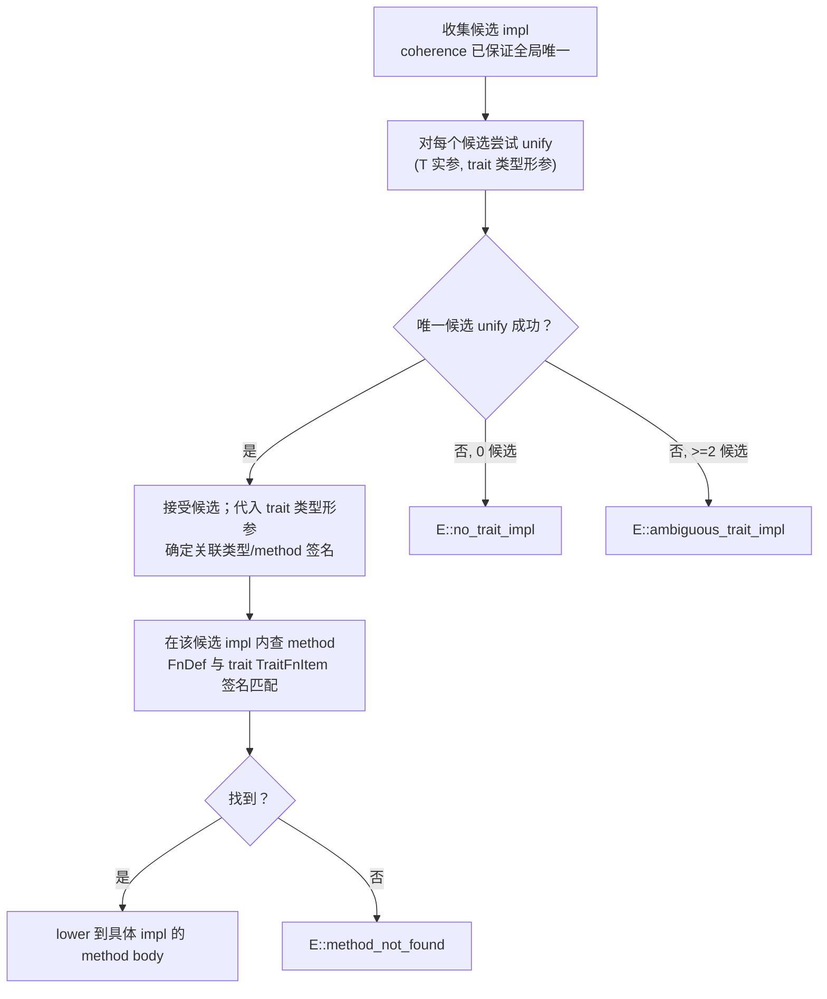
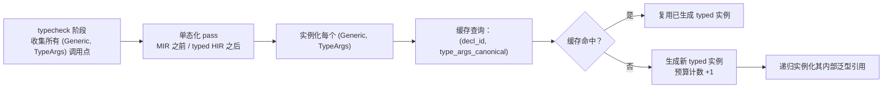

# AHFL 类型系统四大支柱：完整实施设计

本文是 [`corelib-rfc.zh.md`](./corelib-rfc.zh.md) §3.2「类型系统四大支柱」的**可实施细节附件**。它把母文档给出的目标形态补到「grammar / AST / typecheck / 单态化」层面，可直接据以编码；同时**决议**母文档 §7 的开放问题 **1、2、7**。

阅读前置：母 RFC（哲学与边界）、[`core-language.zh.md`](../spec/core-language.zh.md)（现有类型系统/语义）、[`formal-backend.zh.md`](./formal-backend.zh.md)（SMV 编码）、[`semantics-architecture.zh.md`](./semantics-architecture.zh.md)（现有 typechecker 管线）。

风格与母 RFC 严格一致：中文正文、技术对照用表格、EBNF 用 ```` ```ebnf ````、AHFL 示例用 ```` ```ahfl ````、架构用 mermaid、诊断码用 `E::xxx`。

---

## 0. 本文范围与术语约定

### 0.1 范围

| 母 RFC 节 | 本文补全内容 | 是否决议开放问题 |
| --- | --- | --- |
| §3.2.1 ADT | 完整 EBNF + match/pattern + exhaustiveness + narrowing | 否 |
| §3.2.2 泛型 + trait | trait resolution / coherence / bound / where | **决议 Q1** |
| §3.2.3 一等闭包 | 闭包类型 + 捕获语义 + subtyping | **决议 Q2** |
| §3.2.4 effect 系统 | 由 [`corelib-effect-system.zh.md`](./corelib-effect-system.zh.md) 承接，本文只列契约边界 | 否 |
| §3.5 单态化 | 实例化时机 / 缓存键 / 预算 / 与 typed HIR 交互 | 否 |
| §3.4 refinement | 泛型 × refinement 交互 | **决议 Q7** |

### 0.2 术语

| 术语 | 含义 |
| --- | --- |
| **名义类型 (nominal)** | 类型身份由声明名决定，而非结构（现状 §4.4 已采，本文延续） |
| **TypeParams** | 类型形参声明 `<T, U: Ord, ...>`，位于声明头部 |
| **TypeArgs** | 类型实参 `List<Int>`，位于使用点 |
| **泛型实例 (instantiation)** | 把 `List<T>` + `T := Int` 代入得到 `List<Int>` 的过程 |
| **单态化 (monomorphization)** | 每个使用的实例生成独立 typed 代码（Rust/C++/Zig 路线） |
| **trait bound** | 对类型形参的能力约束 `T: Ord` |
| **associated item** | trait 内声明的关联函数 / 关联类型 / 关联常量 |
| **可验证子集** | `effect Pure + decreases + bounded`，见母 RFC §3.4 |
| **bounded refinement** | 带 finite bound 的 refinement，如 `List<T> where length <= 8` |

### 0.3 与现状的对齐原则

1. **现状 §4.3 类型关系求解器（`type_relations.cpp`）的 `MemoizedRelationSolver` 不重写**：本文在其上增加泛型实例化与 trait resolution 两层，复用其 `equivalent` / `subtype` / `exact_schema` 公开 API
2. **现状 §4.6.8 `ExprEffect` 6 级不重写**：它是统一 effect 系统在表达式层的**推导结果**（母 RFC §3.2.4），本文不与之平行
3. **现状 §4.5 上下文定型（`none`/`[]`/`set[]`/`map[]`）保留**：泛型 ADT 化后，`nil`/`Cons` 构造子沿用同一上下文定型规则
4. **现状 §4.6.5 capability 调用语义不变**：本文不引入「函数也能调 capability」的扩展；`fn` 默认不能调 capability，除非带 `effect <Capability>+` clause

---

## 1. 顶层 EBNF（ANTLR 级，可直接转 grammar）

本节给出涉及四大支柱的**新增/修改文法产生式**。现有 `AHFL.g4` 的产生式（`agent/contract/flow/workflow/capability/predicate/...`）保持不变，仅在 `topLevelDecl` 处**增量追加**新分支。

### 1.1 顶层声明增量

```ebnf
(* 增量：topLevelDecl 追加 fn / trait / impl；enum / typeAlias / struct 升级带 TypeParams *)

TopLevelDecl   ::=                                              (* 增量追加 *)
                   FnDecl
                 | TraitDecl
                 | ImplDecl
                 | (* 现有：ConstDecl | StructDecl | EnumDecl | CapabilityDecl
                     | PredicateDecl | AgentDecl | ContractDecl
                     | FlowDecl | WorkflowDecl *) ;

TypeAliasDecl  ::= DocComment? Visibility? "type" Ident TypeParams?
                   "=" Type WhereClause? ";" ;                   (* 升级：带 TypeParams / WhereClause *)

StructDecl     ::= DocComment? Visibility? "struct" Ident TypeParams? WhereClause?
                   "{" { StructFieldDecl } "}" ;                  (* 升级：带 TypeParams *)

EnumDecl       ::= DocComment? Visibility? "enum" Ident TypeParams? WhereClause?
                   "{" { Variant } "}" ;                          (* 升级：Variant 带 payload *)
```

### 1.2 `fn` 声明（含 body / 泛型 / effect / decreases / where）

```ebnf
FnDecl         ::= DocComment? Visibility? "fn" Ident TypeParams?
                   "(" [ ParamList ] ")" ( ":" Type )?
                   EffectClause? WhereClause?
                   ( FnBody | ";" ) ;

FnBody         ::= Block ;

ParamList      ::= Param { "," Param } [ "," ] ;
Param          ::= ( "self" | Ident ) [ ":" Type ] ;               (* self 仅在 impl 块内 *)

TypeParams     ::= "<" TypeParam { "," TypeParam } ">" ;
TypeParam      ::= Ident ( ":" TypeBoundList )? [ "=" Type ] ;     (* 可选默认类型实参 *)

TypeBoundList  ::= TypeBound { "+" TypeBound } ;                   (* 多 bound 用 + 组合 *)
TypeBound      ::= TraitRef
                 | Lifetime ;                                     (* Lifetime 占位，本阶段一律 "_"，留扩展位 *)
TraitRef       ::= QualifiedIdent [ "<" TypeArgList ">" ] ;

WhereClause    ::= "where" WhereConstraint { "," WhereConstraint } ;
WhereConstraint::= TypeBoundList "for" Type                       (* `T: Trait for <类型>` *)
                 | Type ":" TypeBoundList ;                        (* `T: Trait` 短形式 *)

EffectClause   ::= "effect" EffectSpec [ "decreases" DecreasesExpr ] ;
EffectSpec     ::= "Pure"
                 | "Nondet"
                 | CapabilityRef { "+" CapabilityRef } ;            (* one or more capabilities *)
CapabilityRef  ::= "Capability" "<" QualifiedIdent ">" ;            (* 引用一个已声明 capability *)

DecreasesExpr  ::= Expr                                          (* 终止度量，详见 effect-system 文档 *)
                 | "(" Expr { "," Expr } ")" ;                     (* lexicographic tuple *)
```

说明：

1. `EffectClause` 是 **`fn` 与 `capability` 共有的语法节点**，复用母 RFC §3.2.4 的产生式；本文仅限定其在 `fn` 上的语义
2. `decreases` 必须出现在 `effect` 之后；二者绑定（`decreases` 隐式 `effect Pure`），详见 [`corelib-effect-system.zh.md`](./corelib-effect-system.zh.md)
3. `TypeParam` 的 `[ "=" Type ]` 是**默认类型实参**，对标 C++/TypeScript；首版可只允许末尾参数有默认值，编译器实现自由选择是否在 P2 启用，本文不强求
4. `self` 参数仅允许在 `impl` 块内的 `fn` 出现，且必须是第一个参数；对 trait method 的 `self` 类型推导见 §3.4

### 1.3 `trait` 声明（含 associated items）

```ebnf
TraitDecl      ::= DocComment? Visibility? "trait" Ident TypeParams?
                   [ ":" TypeBoundList ]                           (* super-trait（可选）*)
                   "{" { TraitItem } "}" ;

TraitItem      ::= TraitFnItem
                 | AssocTypeItem
                 | AssocConstItem ;

TraitFnItem    ::= "fn" Ident TypeParams?
                   "(" [ ParamList ] ")" ( ":" Type )?
                   EffectClause? WhereClause? ";" ;                (* trait method：仅签名 *)

AssocTypeItem  ::= "type" Ident TypeParams? [ ":" TypeBoundList ] [ "=" Type ] ";" ;
AssocConstItem ::= "const" Ident ":" Type [ "=" ConstExpr ] ";" ;
```

说明：

1. `TraitDecl` 的 `[ ":" TypeBoundList ]` 是 **super-trait 列表**（对标 Rust `trait B: A + Clone`）；其语义是「实现 `B` 的类型必须同时实现所有 super-trait」，由 typecheck 自动追加 bound
2. `AssocTypeItem` 的 `[ "=" Type ]` 允许给 trait 提供**默认关联类型**；若 impl 未提供，使用默认
3. `TraitFnItem` 不带 body；若需要默认方法实现，对标 Rust 的 `fn f() { default_body }`，**首版不引入**（保持 trait 纯接口语义），留 P3+ 决议
4. `TraitItem` 顺序**任意**，但所有 `AssocTypeItem` 必须能在 typecheck 阶段唯一确定（不允许在 trait 内部 forward reference 自身关联类型）

### 1.4 `impl` 块（inherent impl + trait impl）

```ebnf
ImplDecl       ::= DocComment? "impl" TypeParams?
                   [ TraitRef "for" ]
                   TypeRef
                   WhereClause?
                   "{" { FnDef | AssocItemDef } "}" ;

TypeRef        ::= PathType
                 | TupleType
                 | ArrayType ;                                    (* 允许对复合类型 impl，对标 Rust *)

FnDef         ::= "fn" Ident TypeParams? "(" [ ParamList ] ")" ( ":" Type )?
                  EffectClause? WhereClause? FnBody ;             (* 与 FnDecl 一致，但强制 body *)

AssocItemDef  ::= "type" Ident "=" Type ";"                      (* impl 内补全关联类型 *)
                | "const" Ident "=" ConstExpr ";" ;
```

inherent impl vs trait impl 的区分：**仅由是否出现 `TraitRef "for"` 决定**。

- 出现 → trait impl：所有 `FnDef` 必须与 trait 中某个 `TraitFnItem` 签名匹配
- 不出现 → inherent impl：附加方法到 `TypeRef`，不能与任何 trait 重名

### 1.5 ADT enum（带 payload）

```ebnf
EnumDecl       ::= DocComment? Visibility? "enum" Ident TypeParams? WhereClause?
                   "{" { Variant } "}" ;

Variant        ::= DocComment? Ident [ "(" TupleFieldList ")" ] ;

TupleFieldList ::= Type { "," Type } ;                            (* payload 是位置元组 *)
```

设计选择（与现状 `enumDecl: IDENT` 的差异）：

| 维度 | 现状 | 目标 | 理由 |
| --- | --- | --- | --- |
| 变体 payload | 无 | 位置元组 `(T1, T2, ...)` | 对标 Rust/Swift/Haskell；`Option<T>`/`Result<T,E>` 必须有 payload |
| 命名字段 | — | **不支持** | 母 RFC §3.2.1 示例全部用位置 payload；命名字段需额外 `match` binding 语法，留 P3+ |
| 重复变体 | 检测 | 保留检测 | 报 `E::duplicate_variant` |
| 单变体 enum | 合法 | 合法 | 等价于带 tag 的 struct，零成本 |

变体类型本身用 `QualifiedIdent` 引用：`Option::Some`、`Result::Err`。变体的**值类型**是「其父 enum 的实例化类型」`Option<T>`，而非变体名本身——这点与现状 §4.6.1 中 `QualifiedValueExpr`（`AuditResult::Approve : AuditResult`）一致，无需新增 AST 节点。

### 1.6 `match` + 模式

```ebnf
MatchExpr      ::= "match" Expr "{" { MatchArm } "}" ;

MatchArm       ::= Pattern [ "if" Expr ]                          (* guard 可选 *)
                  "=>" Expr "," ;                                  (* 逗号或换行结尾，对标 Rust 宽松度 *)

Pattern        ::= OrPattern ;

OrPattern      ::= ConcatPattern { "|" ConcatPattern } ;          (* or-pattern *)

ConcatPattern  ::= LiteralPattern
                 | VariantPattern
                 | WildcardPattern
                 | BindingPattern
                 | TuplePattern
                 | "(" Pattern ")" ;

LiteralPattern ::= BoolLiteral
                 | [ "-" ] IntLiteral
                 | [ "-" ] FloatLiteral
                 | StringLiteral
                 | "none" ;                                       (* Option::None 字面量糖 *)

VariantPattern ::= QualifiedIdent [ "(" PatternList ")" ] ;       (* Option::Some(x) *)
                 | Ident "::" Ident [ "(" PatternList ")" ] ;     (* 短形式：Some(x) 当 Some 在 scope 内 *)

WildcardPattern::= "_" ;

BindingPattern ::= "mut"? Ident [ "@" Pattern ] ;                  (* x @ Some(y)，mut 可选 *)

TuplePattern   ::= "(" [ PatternList ] ")" ;
PatternList    ::= Pattern { "," Pattern } [ "," ] ;

```

模式语义（对标 Rust/Swift/Haskell）：

| 模式 | 含义 | narrowing 推出的类型事实 |
| --- | --- | --- |
| `LiteralPattern` | 字面量相等匹配 | 把 scrutinee 类型收窄到对应字面量类型 |
| `VariantPattern` | ADT 变体匹配 + payload 绑定 | 在分支内把 scrutinee 收窄到该变体的 payload 类型元组 |
| `WildcardPattern` | 总匹配，不绑定 | 无 |
| `BindingPattern` | 绑定 scrutinee 到名字，可选 `@` 嵌套 | 绑定变量的类型 = scrutinee 类型 |
| `OrPattern` | 任一支匹配 | 各支 narrowing 取并（编译器要求各支的 payload 类型等价） |
| `TuplePattern` | 元组结构匹配 | 各元素分别 narrowing |

`guard`（`if Expr`）：**首版约束 `Expr` 必须满足可验证子集前提之 1**（`effect Pure`），与 `if` 条件同约束（现状 §4.8.2）。不要求 `decreases`，因为 guard 是布尔判定。

### 1.7 闭包 / lambda

```ebnf
LambdaExpr     ::= "\\" [ LambdaParamList ] "->" Expr             (* 短形式：\a, x -> a + x*x *)
                 | "\\" "{" LambdaParamList "->" Block "}" ;       (* 块形式 *)

LambdaParamList::= LambdaParam { "," LambdaParam } ;
LambdaParam    ::= Ident [ ":" Type ] ;                            (* 类型标注可选；缺省推导 *)
```

说明：

1. `\\` 是反斜杠（与现状 §3.10 表达式层无冲突）；保留 `\` 仅用于转义
2. 闭包返回类型由 body 推导；用户可显式标注返回类型的方式是**块形式 + 参数类型完整标注**时附加 `-> Type`，本文为简化首版不强制，类型推导由 typecheck 完成
3. 闭包**不写 `effect` clause**：闭包的 effect 由捕获与 body 推导，必须能被调用点的 effect clause 容纳（详见 §4.4）

### 1.8 `Fn` 一等类型

```ebnf
FnType         ::= "Fn" "(" [ TypeList ] ")" [ "->" Type ] ;       (* 函数指针，闭包的"擦除后"类型 *)
TypeList       ::= Type { "," Type } [ "," ] ;
```

设计选择：

| 维度 | 决策 | 理由 |
| --- | --- | --- |
| 仅 `Fn`（不可变捕获） | **首版仅 `Fn`**，不区分 `Fn`/`FnMut`/`FnOnce`（Rust） | AHFL 无可变借用语义（单根值类型 + 无引用），所有闭包都是 `Fn`；与 §4.2 捕获语义一致 |
| 是否带 effect 类型 | **不带**（与现状 `Type` 系统对齐） | 闭包 effect 由 body 推导，由调用点 `effect` clause 容纳，类型签名不携带 effect；详见 §4.4 |
| 是否支持 trait object | **不支持** | 单态化路线（§5）；动态派发留 P3+ 决议 |
| 是否支持 `Fn` 字面量 | **支持**：`let f: Fn(Int) -> Int = \x -> x + 1;` | 闭包值通过上下文定型推导出 `Fn` 类型 |

`Fn(...)` 是**结构类型**（structural），不是名义类型：`Fn(Int) -> Int` 与 `Fn(Int) -> Int` 永远等价，无论闭包来自哪个 lambda。这与现状 §4.4 名义 enum / struct 的策略**故意不同**——理由见 §4.3 subtyping。

### 1.9 模块声明 + visibility

```ebnf
ModuleDecl     ::= "module" QualifiedIdent ";" ;                   (* 现状不变 *)

Visibility     ::= "pub"
                 | "pub" "(" "crate" ")"                           (* crate-local；AHFL 术语见下 *)
                 | "pub" "(" "self" ")"
                 | "pub" "(" "super" ")" ;
```

AHFL 术语映射（避开 Rust 词汇歧义，但语义对齐）：

| Rust 术语 | AHFL 关键字 | 含义 |
| --- | --- | --- |
| `pub` | `pub` | 当前 crate（编译单元）外可见，对标 `pub` |
| `pub(crate)` | `pub(crate)` | crate-local，不导出到外部消费方 |
| `pub(self)` | `pub(self)` | 模块私有（默认） |
| `pub(super)` | `pub(super)` | 仅父模块可见 |

**默认可见性**：所有顶层声明不带 `Visibility` 时为 `pub(crate)`，即「当前编译单元内可见、不外导」。这与 Rust 默认私有不同，理由是 AHFL 工作流（`agent/workflow/flow`）现状默认对外可见；保留 Rust `pub(self)` 语义给需要真正私有的场景。

> **首版简化建议**：若 P2/P3 实现压力，可只实现 `pub` 与默认 `pub(crate)` 两种，`pub(self)`/`pub(super)` 留到后续。本文 EBNF 给全集以锁定语法。

---

## 2. trait 系统：resolution + coherence + bound

本节是 §1.3 / §1.4 文法的**语义层补充**，决议开放问题 **Q1**（orphan rule 具体形式）。

### 2.1 trait resolution 算法

给定调用 `T::method(args)`（或 method call `e.method(args)`），编译器执行：



候选选择的形式化规则（对标 Rust chalk / Haskell typeclass resolution）：

1. **候选集**：所有全局可见、coherence 通过、且其 `TypeRef` 与目标类型同名（同名前再做 unify）的 `impl` 块
2. **unify 规则**：trait 类型形参与目标类型按 §3 的 nominal + 泛型实例化等价规则 unify；unify 必须给出**唯一**的 `T := Concrete` 代换
3. **where clause 检查**：unify 出的实参必须满足候选 impl 的 `WhereClause`（含 trait bound）；否则该候选**不可用**
4. **歧义判定**：若 ≥2 候选 unify 成功且 where clause 都满足 → `E::ambiguous_trait_impl`，附两个候选的源位置
5. **递归 resolution**：当 impl 的 `WhereClause` 自身依赖另一 trait bound（`T: Ord for impl<T: Eq + Hash> ...`），递归 1–4

诊断码全集：

| 错误 | 触发 | 诊断信息要点 |
| --- | --- | --- |
| `E::no_trait_impl` | 0 候选 | 「类型 `T` 未实现 trait `Trait`」+ 最近似 trait 提示 |
| `E::ambiguous_trait_impl` | ≥2 候选 | 列出所有候选 + 提示加 where clause 消歧 |
| `E::trait_bound_not_satisfied` | where clause 失败 | 「impl 需要 `T: Bound`，但 `T` 未提供」 |
| `E::method_not_found` | impl 内无匹配 method | 「trait `Trait` 声明 method `m`，但 impl 未提供」 |
| `E::method_signature_mismatch` | impl method 与 trait 签名不一致 | 给出 trait 签名 vs impl 签名 diff |
| `E::assoc_type_not_found` | impl 未补全关联类型 | 「trait 声明关联类型 `A`，impl 缺失」 |

### 2.2 coherence 规则（决议 Q1：orphan rule）

#### 决议结论

> **AHFL 采用「严格 orphan rule」：一个 `impl Trait for Type` 块必须位于**（满足以下任一条件）**的模块内：**
> 1. **定义 `Type` 的模块**（类型与 impl 同模块）；或
> 2. **定义 `Trait` 的模块**（trait 与 impl 同模块）。
>
> 否则报 `E::orphan_impl`。

这是 Rust orphan rule 的**严格版**（Rust 允许「在定义任一类型的下游 crate 写 impl」的弱化版本）。AHFL 进一步收紧到「必须同模块」。

#### 理由（对标 + AHFL 约束）

| 对标项 | Rust | Haskell | **AHFL** |
| --- | --- | --- | --- |
| 模块结构 | 多 crate（每 crate 独立 coherence 边界） | 单 package 多 module | **单根模块树**（母 RFC §3.2.2 + 现状 `module-loading.zh.md`） |
| orphan rule | 弱化版：`T` 或 `Trait` 之一在本 crate 即可 | 严格版：必须定义 `T` 或 `Trait` 的 module | **严格版** |
| coherence 复杂度 | 需跨 crate 推断 | 单 package 简单 | **单根树，可静态判定** |

AHFL 单根模块树的关键含义：**没有「下游 crate」概念**——所有模块都在一棵树里。如果允许「在定义 `T` 或 `Trait` 的模块之外」写 impl，那么在树中任意位置都可能产生冲突 impl，全局 coherence 检查退化为「全树遍历所有 impl」，且无法靠模块边界阻止冲突。严格版把冲突可能性压缩到「类型模块或 trait 模块」，每个 impl 只可能由 ≤2 个模块写出 → 编译期确定性极强。

附加细则：

1. **同模块** = 模块路径字符串完全相等（如 `std::collections::list` 与 `std::collections::list`）。子模块**不**算同模块
2. **`pub` 重导出不算重新定义**：`pub use std::collections::List` 不让重导出模块获得「定义 `List`」的身份
3. **`@builtin` 类型的归属**：`Bool/Int/Float/String/UUID/Timestamp/Duration/Decimal` 由语言核心模块（`std::core`）拥有；用户对它们写 trait impl 必须 `use` 对应模块路径或在 `std::core` 内（用户不能写，需 RFC）
4. **本地类型 + 外部 trait**：合法（在定义本地类型的模块写 `impl ExternalTrait for LocalType`），唯一性由 Rust 同款规则保证
5. **外部类型 + 本地 trait**：合法（同上对偶）
6. **外部类型 + 外部 trait**：**禁止**（典型 orphan，报 `E::orphan_impl`）

诊断格式：

```
E::orphan_impl
  impl `Display for Foo` is an orphan: neither `Foo` nor `Display` is defined in module `app::handlers`
  hint: move this impl to the module that defines `Foo` (`app::types`) or `Display` (`std::fmt`)
```

### 2.3 trait bound 语法与 where 子句

三种等价的 bound 写法（编译器内部统一归约到 `WhereClause`）：

```ahfl
// (a) inline bound
fn max<T: Ord + Hash>(a: T, b: T) -> T { ... }

// (b) where clause
fn max<T>(a: T, b: T) where T: Ord + Hash -> T { ... }

// (c) 混合
fn lookup<K, V>(m: Map<K, V>, k: K) -> Optional<V>
    where K: Hash + Eq
{ ... }
```

where clause 的额外能力（inline bound 不支持）：

1. **对复合类型施加 bound**：`where List<T>: Foldable<T>`（inline 只能写 `T: Bound`）
2. **higher-ranked bound**（首版不实现，留 P3+）：`where for<U> F<U>: Fn(U) -> U`
3. **关联类型约束**：`where <T as Iterator>::Item: Ord`（首版**不**实现，留 P3+）

### 2.4 super-trait 语义

```ahfl
trait Ord: Eq {     // 实现 Ord 必须先实现 Eq
    fn compare(self, other: Self) effect Pure -> Ordering;
}
```

typecheck 自动把 `T: Ord` 展开为 `T: Ord + Eq`（含传递闭包），用户无需重复声明。若 impl `Ord` 而未 impl `Eq`，报 `E::missing_super_trait`。

---

## 3. 泛型实例化与类型等价

本节定义单态化的**前置**：泛型实例化、类型等价、子类型规则。§5 给出单态化**算法本身**。

### 3.1 实例化规则

| 实例化目标 | 规则 |
| --- | --- |
| `List<T>` + `T := Int` → `List<Int>` | 名义类型按形参顺序代入，得到新名义类型实例 |
| `Optional<List<T>>` + `T := Int` | 递归实例化内层 |
| `Fn(A, T) -> T` + `T := Int` | 函数类型结构化代入 |
| trait method `fn id<T>(x: T) -> T` | 实参类型 `T := Int` 后，签名变为 `fn id(x: Int) -> Int` |
| 关联类型 `<T as Iterator>::Item := Int` | 首版**不支持**作为独立类型；必须先实例化 trait 再引用关联类型 |

### 3.2 类型等价

复用现状 `type_relations.cpp::are_types_equivalent`，新增泛型规则：

1. `List<T>` ≡ `List<T>`（同名 + 同形参）
2. `List<Int>` ≡ `List<Int>`（同实例化）
3. `List<T>` ≢ `List<U>`，即使 `T` 与 `U` 在通用环境中等价（**形参身份由位置决定**，对标 Rust）
4. `Optional<T>` ≡ `Optional<T>`，不与 `T` 等价（现状 §4.3.2 规则 5 保留）
5. `Fn(A) -> B` ≡ `Fn(A) -> B`（结构等价），与 `Fn(A) -> C` 在 `B ≢ C` 时不等价

### 3.3 子类型

新增规则（在现状 §4.3.2 基础上追加）：

1. **泛型不变性（默认）**：`List<Int>` 不是 `List<Any>` 的子类型。理由：可变容器逆变破坏类型安全（Rust 同款）。**AHFL 首版无 `&` 不可变借用，所有容器都按不变处理**
2. **`Optional<T>` 协变**：现状 §4.3.2 规则 1 保留（`Optional` 是只读包裹）
3. **`Fn(A) -> B` 协变于返回、逆变于参数**：`Fn(Int) -> Int <: Fn(Int) -> Any`（返回协变），`Fn(Any) -> Int <: Fn(Int) -> Int`（参数逆变）。这是函数类型 subtyping 的标准规则（对标 TypeScript/Haskell rank-N type 简化版）。**首版可选实现**；若实现压力，可退化为「`Fn` 等价即子类型」严格版，留 P3+
4. **ADT 协变**：`enum Option<T> { Some(T), None }`，若所有变体 payload 都按协变位置使用 `T`，则 `Option<Int> <: Option<Any>`。**首版规则**：所有用户 ADT 默认协变（足够安全，因 AHFL 不可变捕获），与现状 `Optional/List` 协变策略一致

诊断码：

| 错误 | 触发 |
| --- | --- |
| `E::type_arg_count_mismatch` | `List<Int, Float>` 给 `List<T>`（期望 1 实参） |
| `E::type_arg_bound_not_satisfied` | `max<List<Int>>` 但 `List<Int>: Ord` 不成立 |
| `E::invariant_type_arg` | 试图把 `List<Int>` 用作 `List<Any>` 子类型（变性问题） |

---

## 4. 闭包与捕获（决议 Q2）

### 4.1 捕获语义

**AHFL 闭包是纯值捕获（capture-by-value），无可变借用、无引用**：

1. 闭包捕获其 body 引用的、来自**定义点作用域**的自由变量
2. 捕获是**值拷贝**（深拷贝，因 AHFL 无引用语义）；闭包内对捕获值的修改**不影响**外部
3. 闭包内不能 `mut` 外部捕获——若 body 需要 `mut`，必须是闭包内 `let mut x = captured_x;` 局部重新声明
4. 捕获类型 = 被捕获变量的**值类型**（不是 `&T`），与现状 §4.1 类型宇宙一致

对标与理由：

| 语言 | 捕获 | AHFL 选择 |
| --- | --- | --- |
| Rust | `move` 或借用，`Fn/FnMut/FnOnce` 三分 | 仅 `Fn`（不可变值捕获），因 AHFL 无借用 |
| Swift | 默认 capture-by-reference（class）/ value（struct） | capture-by-value，因 AHFL 全值语义 |
| Haskell | 闭包捕获惰性 thunk | 不对标（AHFL 严格求值） |
| OCaml | capture-by-reference | 不对标 |

### 4.2 闭包类型推导

闭包的静态类型 = `Fn(ParamTypeList) -> ReturnType`，其中：

- `ParamTypeList` 来自 `LambdaParam` 的类型标注，若缺省则由闭包**调用点**的期望类型双向推导（bidirectional）
- `ReturnType` 由 body 推导；若无 body 类型标注，由 body 最后一个表达式推导

双向推导（对标 Swift/TypeScript）：

```ahfl
fn fold<A, T>(xs: List<T>, init: A, f: Fn(A, T) -> A) -> A { ... }

// f 的期望类型 Fn(A, T) -> A 已知 → 推导 \a, x -> a + x*x 中
//   a: A（从期望），x: T（从期望），返回 A（= Int 当 A=Int）
let r = fold(xs, 0, \a, x -> a + x * x);
```

若期望类型缺失（如 `let f = \x -> x + 1;` 无标注），编译器尝试**单态化推断失败**时报 `E::closure_type_ambiguous`；要求用户提供参数与返回标注或显式 `Fn` 类型注解。

### 4.3 闭包 subtyping

`Fn(A1) -> B1 <: Fn(A2) -> B2` 当且仅当 `A2 <: A1`（参数逆变）且 `B1 <: B2`（返回协变）。**首版可退化为严格等价**（见 §3.3 规则 3），下表给出两条路线对比：

| 决策 | 实现 | 优势 | 劣势 |
| --- | --- | --- | --- |
| **首版：严格等价** | `Fn(A)->B <: Fn(A)->B` 仅当 `A≡A, B≡B` | 实现简单（复用 `equivalent`） | 灵活性低，无法把 `Fn(Int)->Int` 用作 `Fn(Int)->Any` |
| **P3+：完整 subtyping** | 实现参数逆变 + 返回协变 | 表达力对标 Swift | 需扩展 `subtype_impl` |

### 4.4 effect 推导

闭包 effect 由捕获与 body 推导：

1. **捕获 effect**：捕获纯值变量 → effect `Pure`；捕获含 capability 引用的变量（罕见）→ 由该变量类型决定
2. **body effect**：body 内表达式按现状 §4.6.8 `ExprEffect` 6 级合成（`join_effects`）
3. **闭包总 effect** = join（捕获 effect，body effect）

**调用点约束**：闭包作为参数传入 `fn f(g: Fn(...) -> ..., effect E)`，必须满足 `closure_effect ⊆ E`（即 closure effect rank ≤ fn 允许的 effect rank）。否则报 `E::closure_effect_exceeds_context`。

### 4.5 决议 Q2：闭包捕获 `List<T>` 时是否在定义点固化长度上界

#### 决议结论

> **是的。闭包捕获 `List<T> where length <= N`（或任何带 bounded refinement 的值）时，长度上界 N 在闭包定义点固化。** 闭包类型的捕获类型签名中，该 `List` 的 refinement 写成 `List<T> where length <= N_def`，其中 `N_def` 是定义点该变量的**当前上界**（不是变量声明类型的上界，也不是闭包被调用时的上界）。

#### 形式化规则

设闭包定义点的环境为 `Γ_def`，被捕获变量 `x : List<T> where length <= N_def`（`N_def` 来自 `Γ_def(x)` 的当前 refinement），则：

1. 闭包类型的捕获字段类型 = `List<T> where length <= N_def`
2. 闭包类型本身不暴露 `length` refinement（与 §1.8 `Fn` 结构类型一致）
3. 进入闭包 body 时，`x` 在 body 环境中的 refinement = `List<T> where length <= N_def`
4. 闭包被调用时，实参 `List<T> where length <= N_call` 必须 `N_call <= N_def`（否则捕获时的值可能超过闭包内 SMV 编码的 bound）

#### 理由（对标 + AHFL 约束）

| 对标 | Rust | Swift | F* | Dafny | **AHFL** |
| --- | --- | --- | --- | --- | --- |
| 捕获 refinement | 无（无 refinement 类型） | 无 | sequence 类型无 bound | 不区分 def/use 点 | **定义点固化** |
| SMV bounded | N/A | N/A | 不限长 | SMT 可处理 unbounded | **必须 finite bound** |

核心理由：**SMV 编码必须 finite**。如果闭包允许「调用时再决定上界」，那么：

- 闭包的 typed HIR 节点无法在编译期确定捕获字段的 SMV 编码宽度
- 同一闭包被多次调用、传入不同长度上界的 `List` 时，SMV 模型需要为每次调用重新展开——破坏单态化的 typed 节点独立性

固化到**定义点**（而非声明点）的理由：

- 声明点上界往往过宽（如 `List<T> where length <= 1024`），固化到声明点会让 SMV 编码爆炸
- 定义点上界反映实际可达的最紧约束（如 `x` 经过 narrowing 后 `length <= 16`），更贴合实际验证需求

诊断码：

| 错误 | 触发 |
| --- | --- |
| `E::closure_capture_unbounded` | 捕获变量类型为 `List<T>` 无 `length` refinement，且闭包将进入可验证子集 |
| `E::closure_capture_bound_too_loose` | 调用时实参上界 > 定义点固化的上界 |

降级路径：若闭包不进入可验证子集（如仅服务 runtime），允许捕获 unbounded `List<T>`，编译器只警告 `W::closure_capture_unbounded_runtime`，不阻塞编译。

---

## 5. 单态化算法

本节落实母 RFC §3.5「单态化」与 §5 的「≤32 预算」衔接。

### 5.1 实例化时机



实例化发生位置：**typed HIR 之后、IR lowering 之前**。理由：

1. typed HIR 是 typecheck 输出，已携带完整类型信息，是实例化的最佳输入
2. IR lowering 之前完成，IR 阶段看到的全是具体实例（零泛型），简化 IR 与 SMV 编码
3. 不在 typecheck 阶段做实例化，避免 typecheck pass 内的双递归

### 5.2 缓存键

```
cache_key = (decl_canonical_id, type_args_canonical, where_clause_substituted)
```

- `decl_canonical_id`：泛型声明的规范 ID（含模块路径），如 `std::collections::List::fold`
- `type_args_canonical`：类型实参的规范化字符串（含嵌套实例化），如 `List<Int>`、`Map<String, Optional<Int>>`
- `where_clause_substituted`：实参代入后的 where clause 求值结果（True / 具体约束），用于区分同名不同约束的实例（罕见，如 conditional impl）

两个实例共享缓存当且仅当三者完全相等。

### 5.3 预算（与母 RFC §5 ≤32 衔接）

**预算分两层**：

| 预算 | 默认值 | 适用范围 | 超额诊断 |
| --- | --- | --- | --- |
| 用户预算 | ≤ 32 | 用户代码（非 `std::` 模块）触发的实例化 | `E::monomorphization_budget_exceeded` |
| stdlib 预算 | ≤ 256 | `std::` 模块触发的实例化 | `E::stdlib_monomorphization_budget_exceeded` |

预算计数规则：

1. 每生成一个新 typed 实例（缓存未命中），计数 +1
2. **递归实例化**只算根实例 +1（内部嵌套实例化不重复计数），否则会指数膨胀；但内部嵌套实例化仍计入**全局实例表**用于去重
3. **可验证子集**内的实例化（`effect Pure + decreases + bounded`）单独计数，**不**与 runtime 实例化混算
4. stdlib 自身特化（如 stdlib 内部 `fold<List<Int>>`）**不计入用户额度**（母 RFC §5 已声明）

诊断格式：

```
E::monomorphization_budget_exceeded
  monomorphization budget exceeded: 33 > 32
  largest contributors:
    1. app::sum_squares (12 instances)
    2. app::lookup (8 instances)
  hint: reduce generic call-site diversity or mark some functions as non-generic helpers
```

### 5.4 与 typed HIR 的交互

typed HIR 节点新增两类字段（不破坏现有 typed-tree 稳定性，作为**可选附加 side-table**）：

| 字段 | 含义 |
| --- | --- |
| `monomorphization_id` | 实例化后 typed 节点的唯一 ID（缓存命中则复用） |
| `generic_origin` | 源泛型声明的 ID + 原始 type_params（调试用） |

实例化后的 typed HIR 是**新节点**，不修改原泛型节点（保持原节点可被其他调用点共享）。这要求 IR lowering 与 SMV 编码消费的是**实例化后的 typed HIR**，而非原泛型节点。

### 5.5 单态化诊断码全集

| 错误 | 触发 |
| --- | --- |
| `E::monomorphization_budget_exceeded` | 用户预算超额 |
| `E::stdlib_monomorphization_budget_exceeded` | stdlib 预算超额 |
| `E::recursive_type_instantiation` | 实例化递归爆栈（如 `List<List<List<...>>>` 无限自引用） |
| `E::type_arg_bound_not_satisfied` | 实例化时 where clause 失败（与 §3.3 重叠，由单态化 pass 二次校验） |

---

## 6. 泛型与 refinement 交互（决议 Q7）

### 6.1 决议结论

> **`List<T> where length <= N` 中，`T` 与 `length` 是两类正交约束，P2 一并支持。** 具体规则：
>
> 1. **类型实参约束** `T: SomeTrait` 由 trait bound 系统（§2.3）处理，作用于类型层
> 2. **值 refinement** `where length <= N` 由 refinement 系统（现状 §4.1 + 母 RFC §3.4）处理，作用于值层
> 3. **二者可组合但不可互相引用**：`T` 不能出现在 `where length <= N` 的 N 中；`length` 不能出现在 trait bound 中
> 4. **组合实例**：`fn sum<T: Numeric>(xs: List<T> where length <= 16) effect Pure decreases length(xs) -> T` 合法
> 5. **首版排除**：泛型函数内**不允许**写 `T` 与 `length` 同时依赖一个未实例化的「`length = f(T)`」类约束——首版约束 N 必须是字面量或 const 表达式，不依赖类型形参

### 6.2 理由（对标 + AHFL 约束）

| 对标 | Dafny | F* | Lean | Rust | **AHFL** |
| --- | --- | --- | --- | --- | --- |
| 泛型 + refinement 组合 | 完整支持 | 完整支持（依赖类型） | 完整支持 | 不支持 refinement | **P2 一并支持，但 N 不依赖 T** |

AHFL 选择 P2 一并支持的核心理由：

1. **不可分性**：若 P2 只支持 `T: Trait` 而不支持 `length <= N`，则闭包捕获 `List<T>`（§4.5 决议 Q2）无 refinement 可固化 → 闭包无法进入可验证子集 → 母 RFC §3.2.3 闭包示例全部失效
2. **typed HIR 一致性**：若 P2 不支持，则 `List<T>` 的 typed HIR 节点不带 bound，到 P4 加 refinement 时需返工 typed HIR 节点结构 → 违反 typed-tree 稳定性原则
3. **工程并发性**：P2 是 XL 阶段，P4 是 L 阶段；若 P2 完全不做 refinement，则 P4 需要在已经过 P3 trait 实例化的代码上重新插入 refinement 推断 → 工作量翻倍

选择「N 不依赖 T」的核心理由：

1. **可判定性**：`length <= f(T)` 在 `T` 未实例化时不可判定（依赖类型），首版避免引入 SMT solver 依赖
2. **单态化预算可控**：N 为字面量或 const 时，缓存键的 `where_clause_substituted` 字段（§5.2）可在编译期完全求值，缓存命中率高
3. **SMV 编码可行性**：N 为字面量时，SMV fixed-size array 编码宽度在编译期确定；若 N 依赖 T，则宽度需对每个 T 实例重新推导，与单态化的 typed 节点独立性冲突

### 6.3 语法

```ebnf
RefinedType     ::= BaseType "where" RefinementClause ;
RefinementClause ::= RefinementPred { "," RefinementPred } ;
RefinementPred   ::= Ident RelOp Expr                    (* length <= 16, size > 0 *)
                   | Ident "in" "{" ExprList "}" ;       (* x in {1, 2, 3} *)
RelOp            ::= "<=" | "<" | ">=" | ">" | "==" | "!=" ;
```

适用范围（首版）：

| 类型 | 支持 refinement | 允许的谓词 |
| --- | --- | --- |
| `List<T>` | 是 | `length <= N`、`length >= N`、`length == N` |
| `Set<T>` | 是 | `size <= N` |
| `Map<K,V>` | 是 | `size <= N` |
| `String` | 是（现状 §4.3.2 已支持 `String(min, max)`） | 沿用现状语法，不重复 |
| `Optional<T>` | 否 | — |
| ADT `enum` | 否（首版） | 留 P4+ |
| `Fn(...)` | 否 | — |

### 6.4 实例化时的 refinement 推导

`fn sum<T: Numeric>(xs: List<T> where length <= 16)` 在调用点 `sum(my_list)`，其中 `my_list : List<Int> where length <= 8`：

1. 实例化 `T := Int`
2. 检查 `length <= 8`（实参）是否蕴含 `length <= 16`（形参 refinement）：是（`8 <= 16`）
3. 调用合法，函数内 `xs` 的 refinement 保持 `length <= 16`（**形参声明的最松上界**，不是实参的更紧上界 8——除非函数 body 内有 narrowing）

这与现状 §4.6.5 capability 调用的 `U <: T` 规则一致：refinement 上界按子类型方向蕴含。

### 6.5 与闭包捕获的联动

Q2 决议（§4.5）与 Q7 决议联动：

- 闭包捕获 `List<T> where length <= N_def` → 闭包类型包含该 refinement
- 若函数泛型声明 `fn f<T>(xs: List<T> where length <= 16, g: Fn() -> T)`，闭包 `g` 内部对 `xs` 的引用固化为 `length <= 16`（定义点上界）

诊断码：

| 错误 | 触发 |
| --- | --- |
| `E::refinement_bound_depends_on_type_param` | `where length <= T.something`（N 依赖 T） |
| `E::refinement_not_satisfied` | 实参上界不蕴含形参上界（`my_list: length <= 32` 传入 `length <= 16` 形参） |
| `E::refinement_predicate_unsupported` | 首版不支持的 refinement 谓词 |

---

## 7. 实现分阶段对照（与母 RFC §6 衔接）

本节把上述设计**按母 RFC 的 P1–P7 阶段切分**，给出每个阶段的可交付清单。本节不替换母 RFC §6，只补「本文档对应哪些代码点」。

| 阶段 | 本文涉及内容 | 主要代码点（建议） |
| --- | --- | --- |
| **P1 ADT** | §1.5 enum payload、§1.6 match/pattern、§3.2 enum 等价 | `grammar/AHFL.g4`（enumDecl/Variant/match）、`include/ahfl/compiler/frontend/ast.hpp`（EnumVariantDeclSyntax 增 payload）、`src/compiler/syntax/frontend/`、`src/compiler/semantics/typecheck_expr.cpp`（match narrowing） |
| **P2 fn+泛型+闭包** | §1.1–1.4 / §1.7–1.8 / §3 / §4 / §5 / §6 | `grammar/AHFL.g4`（FnDecl/LambdaExpr/FnType）、`ast.hpp`（新增 FnDecl/TraitDecl/ImplDecl/LambdaExpr 等 NodeKind）、`semantics/` 新增 monomorphization pass、`ir/` 在 lowering 前消费实例化 typed HIR |
| **P3 trait** | §1.3 / §1.4 / §2 | `grammar/AHFL.g4`（TraitDecl/ImplDecl）、`semantics/` 新增 trait_resolution.cpp、coherence.cpp |
| **P4 effect+可验证子集** | §4.4 effect 推导、§4.5 Q2 闭包捕获固化 | 详见 [`corelib-effect-system.zh.md`](./corelib-effect-system.zh.md) |

---

## 8. 未决议项与本文不覆盖范围

明确**不在本文范围**：

1. **Q3 effect 系统与 capability effect 统一粒度** → [`corelib-effect-system.zh.md`](./corelib-effect-system.zh.md)
2. **Q4 `std::result` 与现有错误模型** → [`corelib-stdlib-api.zh.md`](./corelib-stdlib-api.zh.md)
3. **Q5 prelude stability policy** → [`corelib-stdlib-api.zh.md`](./corelib-stdlib-api.zh.md)
4. **Q6 P5 容器库化对 SMV 编码迁移** → [`corelib-container-migration.zh.md`](./corelib-container-migration.zh.md)
5. **关联类型约束 `<T as Iter>::Item: Ord`** → P3+ 决议
6. **higher-ranked bound `for<U>`** → P3+ 决议
7. **闭包 subtyping 完整版（参数逆变 + 返回协变）** → P3+ 决议
8. **`FnMut`/`FnOnce` 区分** → 不引入（AHFL 无借用语义，无需求）
9. **trait object（动态派发）** → 不引入（单态化路线）

---

## 9. 结论

本文把母 RFC §3.2 的类型系统四大支柱补到**可直接据以实现**的细节层级：

- **EBNF 完整**：§1 给出 ANTLR 级文法，可直接转 `AHFL.g4`
- **trait 系统完整**：§2 给出 resolution 算法、coherence 规则、bound/where 语法
- **闭包与捕获完整**：§4 给出捕获语义、类型推导、subtyping、effect 推导
- **单态化完整**：§5 给出实例化时机、缓存键、预算（衔接母 RFC §5 ≤32）、与 typed HIR 交互
- **泛型 × refinement**：§6 给出交互规则与首版约束

三项决议：

| 问题 | 决议（一句话） | 详见 |
| --- | --- | --- |
| **Q1** orphan rule | 严格版：impl 必须在定义 `Type` 或 `Trait` 的模块（单根模块树适配） | §2.2 |
| **Q2** 闭包捕获 `List<T>` 长度上界 | 定义点固化（SMV bounded 编码强制） | §4.5 |
| **Q7** 泛型 × refinement | P2 一并支持，但 N 必须为字面量或 const，不依赖 T | §6 |

核心约束来源：**AHFL 单根模块树（驱动 Q1 严格 orphan）+ SMV bounded（驱动 Q2 定义点固化 + Q7 N 不依赖 T）+ typed HIR 稳定性（驱动 Q7 P2 一并支持）**。这三条约束是 AHFL 区别于 Rust/Swift/Dafny 的硬边界，所有设计选择都围绕这三条。

本文等待 owner 评审。
