# AHFL Durable Store Import 架构 V0.1

本文合并原先 V0.15 到 V0.45 的 `native-durable-store-*` 逐版本 bootstrap 设计文档，作为 durable-store-import 与 provider artifact pipeline 的当前设计入口。历史版本文档不再作为维护入口；当前实现以 `src/pipeline/persistence/durable_store_import/`、`src/tooling/cli/` 下的 registry 与 leaf header 为准。

## 设计目标

durable-store-import 体系的目标是把 workflow execution 的结果逐步提升为 machine-facing artifact，并在真实 provider 写入之前建立可验证、可审计、secret-free 的 provider handoff pipeline。

当前设计强调三条边界：

1. artifact chain 是事实来源，review / CLI text / host log 只能是 projection。
2. provider pipeline 在真实 SDK、secret manager、object store、database writer 之前先冻结 schema、readiness、failure attribution 与 production gate。
3. public include surface 不再用 `ahfl/*.hpp` 或 `provider_*.hpp` 一跳转发制造假 seam；调用者应包含真实 leaf header。

## 总体架构

```mermaid
flowchart LR
    Plan[ExecutionPlan] --> Session[RuntimeSession]
    Session --> Journal[ExecutionJournal]
    Journal --> Replay[ReplayView]
    Replay --> Snapshot[SchedulerSnapshot]
    Snapshot --> Checkpoint[CheckpointRecord]
    Checkpoint --> Persistence[CheckpointPersistenceDescriptor]
    Persistence --> Export[PersistenceExportManifest]
    Export --> StoreImport[StoreImportDescriptor]
    StoreImport --> Request[DurableStoreImportRequest]
    Request --> Decision[DurableStoreImportDecision]
    Decision --> Receipt[DurableStoreImportReceipt]
    Receipt --> ReceiptPersistenceStage[ReceiptPersistenceStage]
    ReceiptPersistenceStage --> ReceiptPersistence[ReceiptPersistenceRequest Projection]
    ReceiptPersistenceStage --> Response[ReceiptPersistenceResponse Projection]
    Response --> AdapterExecution[AdapterExecutionReceipt]
    AdapterExecution --> RecoveryPreview[RecoveryCommandPreview]
    Request --> ProviderBinding[Provider Binding]
    ProviderBinding --> ProviderRuntime[Provider Runtime]
    ProviderRuntime --> ProviderHost[Host Execution]
    ProviderHost --> ProviderSdk[SDK Adapter]
    ProviderSdk --> ProviderConfig[Configuration and Secret]
    ProviderConfig --> ProviderReliability[Reliability]
    ProviderReliability --> ProviderGovernance[Governance]
    ProviderGovernance --> ProviderProduction[Production Gates]
```



## Core Durable Store Import 链路

core chain 负责从 store-import descriptor 走到 local fake durable-store execution receipt。它仍然不代表真实 provider 写入已经发生。

| Stage | Artifact role | Implementation header |
| --- | --- | --- |
| Request | durable-store-import-facing request boundary | `src/pipeline/persistence/durable_store_import/request.hpp` |
| Decision | adapter contract decision | `src/pipeline/persistence/durable_store_import/decision.hpp` |
| Receipt | adapter receipt boundary | `src/pipeline/persistence/durable_store_import/receipt.hpp` |
| ReceiptPersistenceStage | receipt persistence state transition source of truth | `src/pipeline/persistence/durable_store_import/receipt_persistence_stage.hpp` |
| Receipt persistence projections | CLI / golden stable request and response projections | `src/pipeline/persistence/durable_store_import/receipt_persistence.hpp`, `src/pipeline/persistence/durable_store_import/receipt_persistence_response.hpp` |
| Adapter execution | deterministic local fake durable-store execution | `src/pipeline/persistence/durable_store_import/adapter_execution.hpp` |
| Recovery preview | reviewer-facing recovery projection | `src/pipeline/persistence/durable_store_import/recovery_preview.hpp` |

这些 stages 的共同规则：

1. 只消费直接上游 machine-facing artifact。
2. 每个 artifact 带 source format-version 链。
3. review summary 不能反向成为 machine-facing 输入。
4. local fake durable store 只用于 deterministic regression，不暴露真实 store URI、object path、database key、credential、resume token 或 retry token。

Receipt persistence 的核心 seam 是 `ReceiptPersistenceStage`。`PersistenceRequest` 与 `PersistenceResponse` 保留为当前 wire projection，用于现有 CLI、golden 和 schema drift regression；状态、boundary、blocker 与 identity 映射不得在两个 projection builder 中重复实现。

C++ model 层只暴露短语义名，例如 `Request`、`Decision`、`Receipt`、`PersistenceRequest`、`PersistenceResponse`。`durable-store-import-*` 长命名只能作为稳定外部 contract 出现在 CLI command、JSON field、format version、artifact id 或 golden 名称中，不能再作为内部 alias、builder shim 或 enum member 的命名策略。

## Provider Pipeline 领域

provider pipeline 从 durable store import request 派生 provider-side contract。真实 SDK / network / secret access 仍被隔离在当前 artifact contract 之外。

| Domain | Role | Implementation headers |
| --- | --- | --- |
| Binding | provider adapter config、capability matrix、write attempt、driver binding | `src/pipeline/persistence/durable_store_import/provider/binding/adapter.hpp`, `src/pipeline/persistence/durable_store_import/provider/binding/driver.hpp` |
| Runtime | runtime profile、preflight、SDK envelope | `src/pipeline/persistence/durable_store_import/provider/runtime/runtime.hpp`, `src/pipeline/persistence/durable_store_import/provider/runtime/sdk.hpp` |
| HostExecution | host execution policy、local host receipt、harness、local filesystem alpha | `src/pipeline/persistence/durable_store_import/provider/execution/*.hpp` |
| Sdk | SDK adapter request、interface、payload materialization、mock adapter | `src/pipeline/persistence/durable_store_import/provider/sdk/*.hpp` |
| Configuration | config load、config snapshot、secret resolver placeholders | `src/pipeline/persistence/durable_store_import/provider/configuration/*.hpp` |
| Reliability | retry decision、commit receipt、recovery checkpoint / plan / review、failure taxonomy | `src/pipeline/persistence/durable_store_import/provider/reliability/*.hpp` |
| Governance | audit events、release-gate manifest/report、registry selection、conformance, schema drift evidence | `src/pipeline/persistence/durable_store_import/provider/governance/*.hpp` |
| Production | release evidence, approval, opt-in, runtime policy, integration dry run | `src/pipeline/persistence/durable_store_import/provider/production/*.hpp` |

Provider artifact metadata 的 source of truth 是：

- `src/pipeline/persistence/durable_store_import/provider_artifacts.def`
- `src/pipeline/persistence/durable_store_import/provider/artifacts.hpp`
- `src/pipeline/persistence/durable_store_import/provider/artifacts.cpp`

CLI provider emission 的 source of truth 是：

- `src/tooling/cli/provider/pipeline_durable_store_import_provider_artifacts.def`
- `src/tooling/cli/provider/provider_artifact_catalog.*`（CLI 查询 / help / 解析）
- `src/tooling/cli/provider/provider_artifact_graph.*`（build-time dependency / builder / printer graph）
- `src/tooling/cli/provider/pipeline_durable_store_import_provider.hpp`
- `src/tooling/cli/provider/pipeline_durable_store_import_provider.cpp`

## CLI Provider Pipeline 边界

CLI 不再为每个 provider artifact 暴露独立 `emit_*_with_diagnostics` wrapper。当前 seam 是 `ProviderPipeline`：

```cpp
ProviderPipeline::build(ProviderArtifactKind kind)
```

`ProviderArtifactKind`、provider-local `artifact_id`、visibility、provider-local order、dependency list、builder 和 printer 都由同一个 `pipeline_durable_store_import_provider_artifacts.def` 生成。`provider_artifact_catalog` 只服务 CLI 查询、内部诊断 help 和 `ahflc emit-provider-artifact provider/...` 解析；`provider_artifact_graph` 服务 build-time dependency 预取、builder 调用和 printer 调度。新增 provider artifact 时应修改这一条 registry 记录，而不是手写新的 command handler / printer closure / builder declaration / dependency entry。

`visibility = Public` 的 artifact 是默认可解析的 provider diagnostic artifact；`visibility = Internal` 的 artifact 属于 pipeline 中间节点，只能在显式 `--show-hidden` 时通过内部诊断入口 emit。Provider artifact 不挂到用户态 `ahflc emit <artifact>` 命令面，主要用于 golden 覆盖、诊断和回归定位。

## Include 边界

当前 include 规则：

1. public headers 只保留真实领域路径，例如 `ahfl/compiler/frontend/frontend.hpp`、`ahfl/compiler/ir/ir.hpp`、`ahfl/compiler/backends/driver.hpp`。
2. internal headers 使用 `src/` 下真实 Module 路径，例如 `durable_store_import/provider/runtime/runtime.hpp`。
3. 不新增 `include/ahfl/*.hpp` 平铺 facade。
4. 不新增 `src/pipeline/persistence/durable_store_import/provider_*.hpp` 一跳兼容 shim。
5. artifact metadata 中的 `source_header` 必须指向真实 leaf header，不得指向已删除的兼容路径。

## 非目标

当前 durable-store-import/provider pipeline 仍不承诺：

1. 真实 provider SDK invocation。
2. 真实 secret manager / credential material 读取。
3. 真实 object storage、database writer、transaction commit protocol。
4. 分布式 recovery daemon、worker lease、resume token 或 retry queue。
5. operator console 或 production traffic enablement。

这些能力进入实现前，需要先扩展 artifact contract、validation 与 golden tests，而不是绕过 artifact chain 在 CLI 或脚本层补临时状态。
