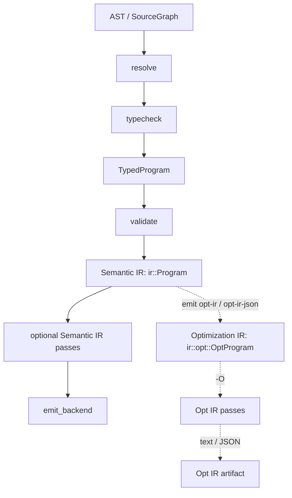

# AHFL IR And Backend Architecture

本文说明 AHFL Core V0.2 中 `ir` 与 `backends` 层的实现概念，重点解释稳定 IR 边界、`ExprArena`、declaration provenance、shared `formal_observations`、Opt IR text / JSON artifact，以及 backend driver 的分层方式。

关联文档：

- [compiler-architecture.zh.md](./compiler-architecture.zh.md)
- [compiler-evolution.zh.md](./compiler-evolution.zh.md)
- [formal-backend.zh.md](./formal-backend.zh.md)
- [ir-format.zh.md](../reference/ir-format.zh.md)
- [source-graph.zh.md](./source-graph.zh.md)

## 目标

本文主要回答四个问题：

1. 为什么 AHFL 在 `validate` 之后还要再 lower 一次到 `ir::Program`。
2. project-aware 模式下，声明归属信息为什么要进入 IR。
3. `formal_observations` 为什么是 IR 级共享对象，而不是某个 backend 私有产物。
4. 新 backend 或新 IR 节点应按什么顺序扩展。

## 总体定位

当前 backend 主链路固定为：



设计意图是：

1. frontend / semantics 负责把语言事实和静态语义判定完成。
2. Typed HIR 负责承载自包含的 typed semantic model。
3. Semantic IR (`ir::Program`) 负责冻结稳定的后端消费边界。
4. Opt IR 负责承载可诊断的 CFG/SSA 风格优化层；当前只作为显式 artifact 输出，不改变普通 backend contract。
5. backend 负责把稳定 IR 渲染成文本或机器可消费输出。

因此：

1. backend 不应直接消费 parse tree。
2. backend 不应自己重跑 resolver / typecheck。
3. 普通 backend 当前不消费 Opt IR。
4. 任何需要多个 backend 共享的语义，都应先进入 Semantic IR。

## IR 公共边界

当前公共 IR 头位于：

- `include/ahfl/compiler/ir/ir.hpp`

主要对象包括：

- `ir::Expr`
- `ir::TemporalExpr`
- `ir::Statement`
- declaration variants，例如 `StructDecl`、`AgentDecl`、`WorkflowDecl`
- `DeclarationProvenance`
- `FormalObservation`
- `ir::Program`

外部入口包括：

- `lower_program_ir(const ast::Program &, ...)`
- `lower_program_ir(const SourceGraph &, ...)`
- `lower_typed_program(const TypedProgram &, ...)`
- `verify_ir_program(const ir::Program &)`
- `collect_formal_observations(const ir::Program &)`
- `print_program_ir(...)`
- `print_program_ir_json(...)`
- `ir::opt::lower_to_opt(const ir::Program &)`
- `ir::opt::print_opt_program(...)`
- `ir::opt::print_opt_program_json(...)`

这说明 Semantic IR 在当前仓库中承担两层角色：

1. 稳定中间表示
2. backend 共享的序列化/导出边界

Opt IR 则是 Semantic IR 下方的诊断/优化层。它通过 CLI `emit opt-ir` / `emit opt-ir-json` 可见，但不在当前 core backend registry 中作为普通 backend 消费合同。当前生产路径决策是 artifact-only：普通 backend 不消费 Opt IR，`--optimize` 不把 Opt IR 回降 Semantic IR，也不让 backend 隐式直连 Opt IR。

## 为什么需要稳定 IR

即使前面已经有 AST、ResolveResult、TypeCheckResult，IR 仍然有必要单独存在，因为它解决的是 backend 边界问题，而不是语义分析问题。

IR 的职责包括：

1. 把 backend 需要的 declaration / expression / statement / temporal 形状固定下来。
2. 把 resolver 得到的 canonical name 和 typecheck 得到的稳定类型描述转成后端友好的字段，包括 JSON IR 中的 `SymbolRef` / `TypeRef` 机器可读伴随字段。
3. 把 source range 和 project-aware 元信息显式写入 IR 节点，而不是让 backend 自己回溯 source graph 或重新解析展示字符串。
4. 把多个 backend 共享的 formal observation 提前统一收集。
5. 用 `ExprArena` / `ExprRef` 固定普通 expression 的权威所有权和 program-local handle。

如果直接让 backend 消费 AST + 语义对象，会出现三个问题：

1. backend 需要知道太多 parser / AST trivia。
2. 不同 backend 会复制相似的语义提取逻辑。
3. project-aware 元信息容易被各 backend 以不同方式“猜出来”。

## IrLowerer 的设计

`src/compiler/ir/typed_hir_lower.cpp` 中的 Typed HIR lowerer 是当前主实现，负责把自包含 `TypedProgram` lower 成 `ir::Program`。`src/compiler/ir/ir_lower.cpp` 中的 `lower_program_ir(...)` 保留为 AST / `SourceGraph` 兼容入口，并委托到 `lower_typed_program(...)`。

当前接口形态刻意保持简单：

1. 主输入是：
   - `TypedProgram`
   - 可选 AST / `SourceGraph`，仅用于兼容旧入口和 source graph 语境
2. 兼容入口仍接受：
   - AST / `SourceGraph`
   - `ResolveResult`
   - `TypeCheckResult`
3. 输出只产生：
   - `ir::Program`

它不输出：

- backend-specific 状态
- CLI-specific metadata
- parser context

### Typed HIR cache envelope

Typed HIR 已经可以脱离 AST / `ResolveResult` 生命周期序列化；当前缓存生产化入口是 `serialize_typed_program_cache_json(...)` / `load_typed_program_cache_json(...)`。cache envelope 包含：

1. `schema_version`：当前为 `AHFL_TYPED_HIR_CACHE_V1`。
2. `source_graph_revision`：调用方提供的 source graph revision。
3. `source_content_hash`：调用方提供的 source content hash。
4. `resolver_snapshot_version`：调用方提供的 resolver snapshot/version。
5. `typed_program`：内嵌现有 `AHFL_TYPED_HIR_V1` snapshot。

加载缓存时必须先校验 envelope metadata，再反序列化 `TypedProgram`。失效原因有明确状态：schema mismatch、source revision mismatch、content hash mismatch、resolver snapshot mismatch、invalid payload。LSP 或 project-aware incremental driver 可以据此决定 cache hit、重新 typecheck 或降级到完整编译。

### 单文件与 project-aware 统一

Typed HIR lowerer 同时支持：

1. 单个 `ast::Program`
2. `SourceGraph`
3. AST-free `TypedProgram`

在 graph 模式下，它会按 source 顺序遍历各 `SourceUnit`，逐个 lower declaration。

这条规则的意义是：

1. IR 的 declaration 序列保留 source graph 的稳定展开顺序。
2. provenance 可以在 lower 时就地附着到 declaration。
3. backend 不需要再反查“这个 declaration 来自哪个 source”。

## DeclarationProvenance

当前多数 IR declaration 都带有：

```text
DeclarationProvenance {
  module_name
  source_path
}
```

其设计目的不是为了调试方便，而是为了冻结 project-aware 所有权边界。

### 为什么 provenance 进 IR

project-aware 模式下，同名 declaration 可能来自不同 source/module 语境。若 provenance 不进入 IR，就会导致：

1. JSON IR 无法稳定表达声明归属。
2. backend 无法在不接触 frontend 的情况下保留所有权信息。
3. 后续工具链无法只看 IR 就知道 declaration 来自哪里。

### 当前行为

`IrLowerer::current_provenance()` 的规则是：

1. 单文件模式下，返回空 provenance。
2. graph 模式下，使用当前 `module_name` 和逻辑 source path 生成 provenance。

这表示：

1. provenance 是 project-aware 增量能力。
2. 单文件兼容模式不会为了“看起来一致”而伪造归属信息。

## IR 节点设计原则

当前 IR 没有把复杂语义压成字符串，而是保留结构化节点：

- `ExprNode`
- `TemporalExprNode`
- `StatementNode`
- `ContractClause`
- `WorkflowNode`
- `TypeRef` / `SymbolRef`
- `source_range`

例如：

1. contract clause 的值是：
   - `ExprRef`
   - 或 `TemporalExprPtr`
2. flow body 是显式 `Block` + `Statement`
3. workflow safety/liveness 保留为递归 temporal 树

这样做的好处是：

1. 文本 IR、JSON IR、SMV backend 可以共享同一结构。
2. 后续若增加新 backend，不需要重新从字符串中解析语义。
3. golden test 可以验证结构而不是格式偶然性。

## Path Root 语义边界

Path expression 的根语义由 `PathRootKind` 明确表达，而不是由 `root_name` 字符串隐式约定。Typed HIR 与 Semantic IR 当前保持同一组 root kind：

1. `Input`
2. `Context`
3. `Output`
4. `State`
5. `Local`
6. `Identifier`

这条边界对 backend 和 runtime 的约束是：

1. 判断执行上下文路径时读取 `Context`，不要重新匹配 `ctx` 字符串。
2. 判断 flow local binding 时读取 `Local`，不要和 workflow node output 混在同一个 identifier 语义里。
3. `Identifier` 保留给 workflow node output 或其他普通 identifier 根，不再承担 context/state/local 的兼容桶角色。
4. 新增 root kind 时必须同步 Typed HIR serialization、Semantic IR JSON、文本 printer、runtime/backend 消费端和 Opt IR lowering。

## readonly 语言边界

Core V0.1 当前不引入 `readonly` 修饰符或 readonly 容器语法。容器 variance 是类型关系层的内部能力：`Optional<T>`、`List<T>`、`Set<T>` 的元素类型可协变，`Map<K, V>` 的 key 保持 invariant、value 可协变；这些规则不要求在 AST、Typed HIR、Semantic IR `TypeRef` 或 JSON IR 中新增 readonly bit。

若未来要把 readonly 变成源码级语言能力，必须作为新的 language/spec/grammar/typecheck/IR 任务推进，不能把它作为 IR 或 type relation 的隐式兼容字段混入当前 backend contract。

## ExprArena 与 ExprRef

当前普通 expression 已经不再由嵌套 `Owned<Expr>` tree 分散持有，而是由 `Program::expr_arena` 统一分配并拥有。IR 节点之间通过 `ExprRef` 引用表达式：

1. `ExprRef.index` 是 arena 内的 program-local handle。
2. `Expr::id` 是 lowering 时分配的 stable numeric ID，适合在同一次 IR 输出、测试和诊断中关联节点。
3. `Expr::resolved_type` 保留 typechecker 结果，pass 和 backend 不需要反查 Typed HIR。
4. JSON IR 仍输出结构化 expression tree；外部 consumer 不应把 `ExprRef` 内存布局当成跨版本 ABI。

statement 和 temporal expression 当前明确保留 owning tree，不引入 `StatementArena` / `TemporalArena`：

1. statement 只作为 block 的顺序子节点存在，没有跨 block 共享引用；已有 `Statement::id` 可满足同一 program 内的诊断和测试关联。
2. temporal expression 只在 contract clause、workflow safety/liveness 的 recursive formula 内部拥有，没有跨 owner 的跳转、共享或回边。
3. printer、JSON、SMV、Opt IR lowering 与 runtime 都按 owning tree 递归消费 statement / temporal；改成 arena/ref 会扩大迁移面，但当前不能消除真实共享或悬空引用问题。
4. verifier 负责补足 owning tree 安全网：statement 指针不得为空、statement ID 不得重复、temporal 指针和 unary/binary child 不得为空、embedded temporal expr 必须引用合法 `ExprRef`。

后续只有在出现跨 formula 引用、temporal pass 需要稳定 node handle、或 statement rewrite 需要跨 block 移动并保留引用身份时，才重新评估 `StatementRef` / `TemporalRef`。

## Semantic IR Verifier

`verify_ir_program(...)` 是 Semantic IR 的结构安全网。CLI 在 validate 之后、backend/package/Opt IR 分发之前统一运行它。

当前 verifier 首版覆盖：

1. `ExprRef.index` 与 `Program::expr_arena` 指针一致。
2. expression / statement / declaration provenance ID 的 program-local 唯一性。
3. `SymbolRef.id` 与已知 declaration canonical identity 不冲突。
4. `TypeRef` 复合类型 child 完整性。
5. contract / workflow / temporal embedded expression 不为空。
6. source range 半开区间合法。
7. analyzed / optimized phase 至少携带对应的基础 derived analysis。
8. `AnalysisBundle::source_program_revision` 与 `Program::analysis_revision` 匹配，避免 backend 或 pass 读取 stale derived analyses。

`recompute_derived_analyses` 会把 state handler summary、workflow expr summary 和 formal observations 重算到同一个 bundle，并记录当前 `analysis_revision`。pass manager 的合同是：

1. pass 可声明 `required_derived_analyses()`，运行前由 manager 调用 `ensure_derived_analyses`。
2. pass 修改 IR 后按 `invalidated_derived_analyses()` 标记 stale 并重算，默认 invalidates 全部 derived analyses。
3. 自定义 analysis pass 的 `required_analyses()` / `invalidated_analyses()` 仍负责 pass-manager-local analysis result 缓存。

backend emission 的合同是：`emit_backend` 在调用具体 backend emitter 前统一保证 derived analyses fresh。具体 backend emitter 仍通过 const `EmitContext` 读取 IR，不直接修复或猜测 stale summary。

它不是类型检查器替代品；它只验证 IR 自身能被后端和 pass 安全消费。

## Workflow Value Summary

V0.3 在 `WorkflowNode` 与 `WorkflowDecl` 上新增了一层受限 value summary：

- `WorkflowNode::input_summary`
- `WorkflowDecl::return_summary`

这层摘要的目标不是替代原始 `Expr`，而是把 workflow 数据流里最常被 backend/tooling 重新推导的读取来源冻结成稳定 IR 字段。

### 当前保留的信息

1. workflow node 输入表达式读取了哪些 `workflow_input`
2. workflow node 输入表达式读取了哪些上游 `workflow_node_output`
3. workflow 返回表达式读取了哪些 `workflow_input`
4. workflow 返回表达式读取了哪些 `workflow_node_output`

### 当前刻意不保留的信息

1. 表达式内部的逐步求值顺序
2. 值流的 path-sensitive 条件分支
3. 调度、缓存、并发或 materialization 语义
4. `after` 执行依赖与值依赖之间的自动推断关系

因此，workflow value summary 的角色应理解为：

- backend/tooling 的稳定读依赖入口

而不是：

- 完整 workflow 执行/数据流引擎

## Formal Observations

### 作用

`FormalObservation` 是当前 IR 最值得单独理解的共享对象。

它表示：

1. formal backend 可消费的“外部可观察布尔事实”
2. 这些事实来自多个语义位置，但需要统一命名和统一导出

当前 scope 种类包括：

- `ContractClause`
- `WorkflowSafetyClause`
- `WorkflowLivenessClause`

节点种类包括：

- `CalledCapabilityObservation`
- `EmbeddedBoolObservation`

### 为什么是 IR 级共享对象

`formal_observations` 被放在 `ir::Program` 顶层，而不是只留给 SMV backend，原因是：

1. JSON IR 也要导出同一套 observation 清单。
2. observation symbol 的稳定性应该由 IR 定义，而不是由具体 backend 命名。
3. contract / workflow temporal 中的 embedded expr 抽象规则属于 backend 边界，而不是 emitter 细节。

### 收集阶段

`lower_typed_program(...)` 当前不是直接把 lowerer 的结果返回，而是会继续：

```text
recompute_derived_analyses(program_ir, ProgramPhase::Analyzed)
```

这意味着 state summary、workflow summary 和 observation 收集都是 lowering 后的独立派生分析，而不是和 declaration lowering 交织在一起。

这样设计的好处是：

1. declaration lowering 保持聚焦，只负责构造 IR 树。
2. observation 收集可以把 contract / workflow / agent 三类来源统一遍历。
3. 新 backend 若复用 observation，不需要关心它们最初来自哪个 AST pass。

### 当前收集来源

`FormalObservationCollector` 目前会遍历：

1. `AgentDecl`
   - 为 capability 列表建立 `called(...)` 观察符号。
2. `ContractDecl`
   - 收集 expr-shaped clause
   - 收集 temporal clause 中的 embedded expr 和 `called(...)`
3. `WorkflowDecl`
   - 收集 safety/liveness 中的 embedded expr

### 稳定命名

当前实现通过 symbol 去重和 scope 编码，保证：

1. 同一 observation symbol 只输出一次。
2. 同一 owner / clause / atom 位置的 embedded expr 会得到稳定命名。
3. backend 不需要自己发明 observation 名字。

如果后续新增 observation 来源，应先定义 symbol 规则，再增加 emitter 消费逻辑，不要反过来先在某个 backend 里临时起名。

## Backend Driver 分层

当前 backend 入口位于：

- `include/ahfl/compiler/backends/driver.hpp`
- `src/compiler/backends/driver.cpp`

核心对象：

- `BackendKind::Ir`
- `BackendKind::IrJson`
- `BackendKind::NativeJson`
- `BackendKind::ExecutionPlan`
- `BackendKind::PackageReview`
- `BackendKind::Summary`
- `BackendKind::Smv`
- `BackendKind::AssuranceJson`

当前没有 `BackendKind::OptIr`。Opt IR 由 CLI `emit opt-ir` / `emit opt-ir-json` 直接调用 `ir::opt::lower_to_opt(...)`，再通过 `print_opt_program(...)` 或 `print_opt_program_json(...)` 输出，属于 compiler diagnostic artifact，而不是 core backend registry 的一员。

driver 只暴露一组 backend-facing 入口：

1. 直接消费 `ir::Program`
2. 通过 `BackendRegistry` 查找已注册的 core backend
3. `emit_backend(...)` 返回布尔状态，调用方必须处理未注册 backend

其设计意图是：

1. backend 的公共 seam 固定在 IR，不让 AST / SourceGraph 泄漏给 backend。
2. CLI 可以用统一入口分发 backend。
3. lowering 逻辑集中在 CLI pipeline 和 IR 层，而不是散落到各 backend。
4. core backend 分发必须 fail-closed，而不是静默吞掉未注册 backend。

### driver 该做什么

应该做：

- 选择 backend kind
- 将已构造好的 `ir::Program` 交给具体 emitter

不该做：

- 新增语义检查
- 直接读取文件
- 在 driver 内部写 backend-specific 语义分支

## Backend 与 Artifact Pipeline 的边界

当前仓库存在五类相邻但不同的输出层：

1. Core backend：消费 `ir::Program`，通过 `BackendKind` / `BackendRegistry` / `emit_backend(...)` 分发。
2. Runtime artifact pipeline：消费 package metadata、execution plan、dry-run trace、runtime session、checkpoint、persistence、durable-store 等 machine artifact，由 `dispatch_package_command(...)` 显式分发。
3. Durable store import artifact emitter：消费 `ahfl::durable_store_import` 领域模型，位于 `include/ahfl/durable_store_import/artifacts.hpp` 与 `src/pipeline/persistence/durable_store_import/artifacts.cpp`，由 `ahfl_durable_store_import_artifacts` 构建目标承载。
4. Compiler diagnostic artifact：当前代表是 `emit opt-ir` / `emit opt-ir-json`，消费 `ir::Program` 后降到 `ir::opt::OptProgram` 并输出诊断 dump 或 `AHFL_OPT_IR_V1` JSON artifact。
5. Target generator：消费目标平台专用 config，例如 WASM、K8s CRD、OpenAPI、Terraform。

这五类不能被混称为同一种 backend。若一个输出需要沿 runtime artifact chain 逐层构造状态，它应落在 package pipeline；若它只把稳定 IR 渲染成目标格式，它才应接入 core backend registry。Opt IR 当前虽然消费 `ir::Program`，但它的目标是诊断和优化验证，不是 backend registry 的输出合同。

`src/compiler/backends` 不承载 durable-store import 的 request / review / decision / receipt / provider SDK adapter 等 artifact printer。这些 printer 不是 compiler backend：它们不消费 `ir::Program`，而是序列化 durable-store import 的领域 artifact。把它们收敛到 `src/pipeline/persistence/durable_store_import/artifacts.cpp` 可以让 backend Module 保持 IR-facing，让 durable-store import Module 自己拥有 artifact 输出 Locality，同时避免每个 artifact 一对浅 header/source。

## 当前 core backend 与诊断 artifact 的边界

### 1. Text IR

`print_program_ir(...)` / `emit_program_ir(...)` 提供面向人读的稳定文本表示。

用途：

- 调试 lowering 结果
- golden test
- 作为后端边界的可视化形式

### 2. JSON IR

`print_program_ir_json(...)` / `emit_program_ir_json(...)` 提供机器可消费的结构化导出。

用途：

- 下游工具消费
- 保留 declaration provenance
- 保留结构化类型/符号引用
- 保留 shared `formal_observations`

### 3. SMV

`src/compiler/backends/smv/smv.cpp` 消费稳定 IR，输出当前受限 formal backend。

SMV 具体语义边界由 [formal-backend.zh.md](./formal-backend.zh.md) 冻结；本文只强调它在架构上的位置：

1. SMV 是 IR 之上的具体 emitter。
2. 它可以使用 `formal_observations`，但不拥有 observation 模型本身。
3. 它不应越过 IR 回头读 AST 或 parse tree。

### 4. Native / execution / review / assurance 输出

`NativeJson`、`ExecutionPlan`、`PackageReview` 与 `AssuranceJson` 仍以 `ir::Program` 为入口。它们可以投影到 handoff 或 assurance 子模型，但不应从 CLI、AST 或项目描述符重新推导语义。

其中 `emit-execution-plan` 在带 package metadata 的 CLI 路径下可走 package pipeline，以便输出诊断；在无 package metadata 的路径下仍保留 core backend fallback。

### 5. Opt IR artifact (非 core backend)

`emit opt-ir` 输出 `ir::opt::OptProgram` 的文本 dump，`emit opt-ir-json` 输出同一模型的 `AHFL_OPT_IR_V1` JSON artifact。它们的用途是：

1. 观察 Semantic IR 到 CFG/SSA 风格 Opt IR 的 lowering 结果。
2. 对比 `-O` 前后的 constant propagation、copy propagation、dead store elimination 效果。
3. 为 `verify_opt_program`、workflow / contract / temporal lowering 覆盖和 pass 行为提供 golden surface。
4. 在 artifact 输出前运行 `verify_opt_program`，并在 `-O` 后再次验证 pass 输出没有破坏 CFG/local/type 基础不变量。
5. 用 `skipped_temporal` 显式记录无法降成 pure expression fragment 的 `called` / `running` / `completed` / `in_state` temporal atom。
6. 为脚本或 IDE 等机器 consumer 提供不用解析文本 dump 的 Opt IR 结构化入口。

它当前不是：

1. JSON IR 的替代格式。
2. BackendRegistry 中的 core backend。
3. 普通 backend 输出链路的前置阶段。
4. `--optimize` 后回写 Semantic IR 的机制。
5. backend 直连 Opt IR 的隐式开关。

当前生产路径结论是 artifact-only。若未来要让普通 backend 复用 Opt IR 结果，必须先单独设计并实现其中一种路径：`OptProgram` 回降 Semantic IR，或特定 backend 显式声明直接消费 Opt IR；不能让 `--optimize` 通过隐式旁路改变 backend contract。

## 扩展落点指南

### 新增 IR 节点

建议顺序：

1. 先确定它是否是 backend 共享语义。
2. 若是，先改 `include/ahfl/compiler/ir/ir.hpp` 的节点形状。
3. 再改 `IrLowerer`。
4. 再改文本 IR / JSON IR / 相关 backend。

### 新增 provenance 字段

先问三个问题：

1. 这是 declaration 归属信息，还是 backend 私有调试信息。
2. 是否需要被 JSON IR 稳定导出。
3. 是否所有 backend 都会受益。

只有前两项答案都是“是”，才应该进入 IR。

### 新增 formal observation 来源

建议顺序：

1. 先定义 scope 和 symbol 规则。
2. 再扩展 `FormalObservationCollector`。
3. 再让 JSON IR / SMV 等 emitter 消费。

不要先在某个 emitter 里硬编码新 observation 变量，再回头补 IR。

### 新增 backend

建议顺序：

1. 先判断它是 core backend、runtime artifact pipeline，还是 target generator。
2. 若是 core backend，扩展 `BackendKind` 并通过 `BackendRegistrar` 注册到 `BackendRegistry`。
3. 若是 runtime artifact pipeline，沿已有 artifact chain 增加 helper / printer / dispatcher；durable-store import printer 必须放在 `artifacts.hpp` / `artifacts.cpp` 这个 seam 下，不要放回 `src/compiler/backends`。
4. 若它需要的语义已有多个 backend 会共享，先把该语义推进 IR。

## 推荐阅读顺序

建议按下面顺序读：

1. `include/ahfl/compiler/ir/ir.hpp`
2. `include/ahfl/compiler/backends/driver.hpp`
3. `src/compiler/ir/typed_hir_lower.cpp`
4. `src/compiler/ir/ir_lower.cpp`
5. `src/compiler/ir/ir_json.cpp`
6. `src/compiler/ir/verify.cpp`
7. `src/compiler/ir/opt/opt_lower.cpp`
8. `src/compiler/ir/opt/opt_print.cpp`
9. `src/compiler/ir/opt/opt_verify.cpp`
10. `src/compiler/backends/driver.cpp`
11. `src/compiler/backends/smv/smv.cpp`

阅读重点：

1. 先看 `ir::Program` 和 declaration / expr / temporal 节点形状。
2. 再看 `DeclarationProvenance` 和 `FormalObservation`。
3. 最后再看具体 emitter 如何消费这些稳定对象。

## 对后续实现的约束

后续继续扩展 `ir` / `backends` 时，应保持以下原则：

1. IR 是 backend 共享边界，不是某个单一 emitter 的私有数据结构。
2. provenance 由 IR 冻结，不由 backend 临时猜测。
3. observation 命名由 IR 统一定义，不由 backend 各自发明。
4. backend 只消费稳定语义结果，不回头接触 parser、AST 或文件系统。
5. 若某项语义不能稳定进入 IR，就说明它还没有准备好成为 backend 约束。
6. CLI 必须显式区分 core backend command 与 package pipeline command，不能靠“dispatcher 试试看”来决定语义路径。
7. Durable-store import artifact printer 必须链接到 `ahfl_durable_store_import_artifacts`，不能作为 `ahfl_backend_*` target 进入 backend aggregate。
8. Opt IR 当前保持 artifact-only；已有 verifier、`AHFL_OPT_IR_V1` JSON artifact 和 workflow / contract / temporal lowering 覆盖。进入普通 backend 输出路径之前，必须明确回降 Semantic IR 或 backend 直连策略。
