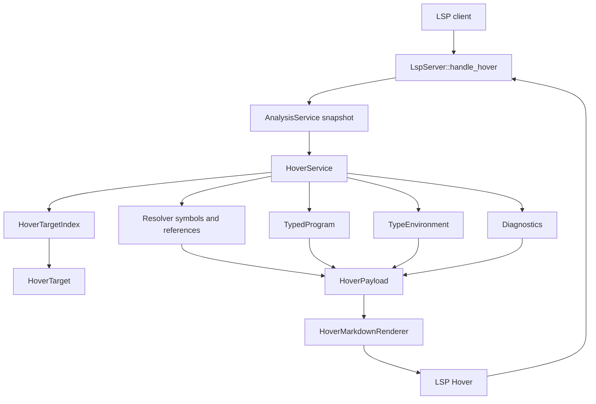
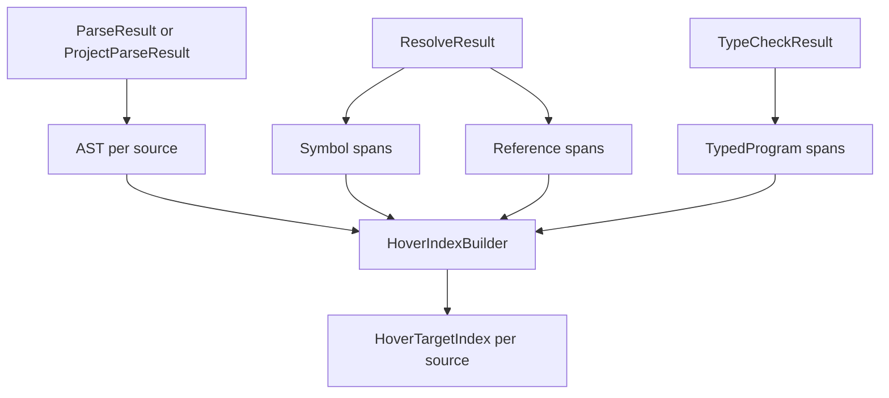

# AHFL LSP Hover Architecture V0.1

| 项目 | 内容 |
|------|------|
| 文档类型 | design |
| 状态 | implemented |
| 版本 | v0.1 |
| 目标模块 | `src/tooling/lsp/`、`include/ahfl/compiler/semantics/typed_hir.hpp`、`include/ahfl/compiler/semantics/resolver.hpp` |
| 当前审计日期 | 2026-06-15 |

---

## 一、问题结论

当前 hover 已经接入 `textDocument/hover`，但实现仍是 handler 内的特判组合：

1. 先用 `TypedProgram::find_expr_containing(...)` 找表达式类型。
2. 再用手写 schema label 搜索补 `input` / `context` / `output`。
3. 最后用 resolver symbol/reference 回退到声明符号。

这条链路只能覆盖“表达式整体”和“顶层声明/引用”，没有统一的 token 目标模型，因此会出现三个问题：

1. 鼠标停在部分 identifier 上没有 hover。
2. 鼠标停在 schema label 或声明内部 token 上时，可能被更大的表达式或声明范围抢占。
3. hover 内容格式不一致：有的只显示裸类型，有的显示 symbol 名，有的显示临时拼接的 schema 信息。

目标不是继续给 `server.cpp` 增加更多 `if`，而是把 hover 做成一个独立的 IDE 语义模块。

## 二、外部约束

官方依据：

- [Language Server Protocol 3.17 specification](https://microsoft.github.io/language-server-protocol/specifications/lsp/3.17/specification/)
- [VS Code Programmatic Language Features: Show Hovers](https://code.visualstudio.com/api/language-extensions/programmatic-language-features#show-hovers)

LSP 3.17 对 hover 的协议约束是：

1. 请求方法为 `textDocument/hover`。
2. 响应结果是 `Hover | null`。
3. `Hover.contents` 应使用 `MarkupContent`。
4. `Hover.range` 是可选字段，用于客户端高亮被 hover 的源码范围。

VS Code 的语言功能文档把 hover 定义为“鼠标下 symbol/object 的信息，通常包括类型和描述”，并要求 server 在 initialize response 中声明 hover capability 后响应 `textDocument/hover`。

AHFL 的实现策略应满足这些协议约束，但不把 VS Code 当成唯一客户端：server 输出标准 LSP `MarkupContent(markdown)`，客户端只负责展示。

## 三、设计目标

Hover 模块的目标状态：

1. 所有具有语义含义的 identifier / symbol token 都有 hover。
2. 每次 hover 都命中最小、最精确的 token range，而不是整个表达式或声明块。
3. hover 内容使用统一 Markdown 结构，按“签名、类型、归属、声明、附加语义”展示。
4. resolver 和 Typed HIR 是权威语义输入；Semantic IR / Opt IR 不进入常驻 hover 路径。
5. `server.cpp` 只负责 JSON-RPC 参数解析和响应序列化，不负责 hover 目标定位和 Markdown 拼装。
6. 未解析或错误状态不能显示错误对象；只能返回 null 或显示带 diagnostic 上下文的失败 hover。
7. hover 的覆盖面有测试矩阵约束，不靠人工试用判断。

## 四、非目标

1. 不把 hover 做成 AST 文本搜索功能。
2. 不在每次 hover 请求中重新 parse / resolve / typecheck。
3. 不把 backend IR dump 当作 hover 内容。
4. 不为 punctuation、括号、逗号、分号等非语义 token 返回 hover。
5. 不在本设计里实现 doc comment 语法；但渲染模型预留文档字段。

## 五、总体架构



模块边界：

| 模块 | 职责 | 禁止事项 |
|------|------|----------|
| `LspServer::handle_hover` | 解析 `TextDocumentPositionParams`，取得 snapshot，调用 hover service，序列化 LSP response | 遍历 AST、查 symbol、拼 Markdown |
| `HoverService` | 统一 hover 查询入口，协调 index、resolver、Typed HIR、diagnostics | 重新构建 compiler pipeline |
| `HoverTargetIndex` | 为每个 source 建立可 hover token 的有序 span index | 用字符串包含关系猜语义 |
| `HoverPayloadBuilder` | 把 `HoverTarget` 转成结构化 hover payload | 直接输出 LSP JSON |
| `HoverMarkdownRenderer` | 把 payload 渲染成稳定 Markdown | 查询语义模型 |

建议文件布局：

| 文件 | 内容 |
|------|------|
| `src/tooling/lsp/hover_service.hpp` | `HoverService`、`HoverTarget`、`HoverPayload` 公共接口 |
| `src/tooling/lsp/hover_service.cpp` | target lookup、payload 构建、renderer 调度 |
| `src/tooling/lsp/hover_index.hpp` | `HoverTargetIndex` 数据结构 |
| `src/tooling/lsp/hover_index.cpp` | AST / resolver / typed result 到 index 的构建 |
| `src/tooling/lsp/hover_markup.hpp` | Markdown builder 小工具 |
| `src/tooling/lsp/hover_markup.cpp` | code fence、section、escaping、formatting |
| `tests/unit/tooling/lsp/hover_service.cpp` | hover service 单元测试 |
| `tests/unit/tooling/lsp/server_handlers.cpp` | JSON-RPC handler 集成回归 |

## 六、权威数据源

Hover 必须从 `LspAnalysisSnapshot` 读取现有分析结果：

| 信息 | 首选数据源 | 用途 |
|------|------------|------|
| 顶层声明符号 | `ResolveResult::symbol_table` / `TypedProgram::symbols` | declaration hover、canonical name、definition |
| 引用绑定 | `ResolveResult::references()` / `TypedProgram::references` | type ref、call target、agent capability、workflow target |
| 表达式类型 | `TypedProgram::expressions` | path、member access、call、literal、struct init、return expr |
| 声明结构 | `TypedDecl::payload` / `TypeEnvironment` | struct field、enum variant、capability params、agent schema、workflow node |
| 类型描述 | `Type::describe()` | 用户可读类型签名 |
| 错误状态 | parse / resolve / typecheck / validate diagnostics | unresolved hover 或错误提示 |
| source ownership | `LspSourceSnapshot` + `SourceId` | 跨文件 range 和 uri |

Hover 不应默认读取 Semantic IR 或 Opt IR。它们丢失或重排源码位置，对 IDE 交互不是主模型。

## 七、目标定位模型

核心原则：先定位 token，再解释语义。不能先找一个大表达式，再猜鼠标是不是落在其中某个名字上。

建议数据模型：

```cpp
enum class HoverTargetKind {
    ModuleName,
    ImportPath,
    ImportAlias,
    DeclarationName,
    TypeReference,
    ConstReference,
    CallableReference,
    StructField,
    EnumVariant,
    CapabilityParam,
    PredicateParam,
    AgentSchemaLabel,
    AgentState,
    AgentTransition,
    FlowState,
    WorkflowSchemaLabel,
    WorkflowNode,
    WorkflowDependency,
    Expression,
    MemberAccess,
    LocalBinding,
    Diagnostic
};

struct HoverTarget {
    HoverTargetKind kind;
    SourceRange token_range;
    std::optional<SourceId> source_id;
    std::optional<SymbolId> symbol_id;
    std::optional<std::uint32_t> typed_expr_index;
    std::optional<std::uint32_t> typed_decl_index;
    std::string local_name;
    std::string role;
};
```

`HoverTargetIndex` 为每个 source 持有按 `begin_offset` 排序的 target spans。lookup 规则：

1. 只在当前 source 的 target list 中查找。
2. 命中多个 target 时，选择 `token_range` 最小者。
3. 同 range 多 target 时，按优先级选择：diagnostic-attached target > explicit token target > expression target > declaration fallback。
4. whitespace / punctuation / comment 上返回 null。
5. 所有 qualified name 的每个 identifier 段都应有 target；完整 qualified name 也可以有组合 target，但不能吞掉段级 hover。

## 八、覆盖矩阵

### 8.1 顶层与模块

| 源码位置 | Hover 内容 |
|----------|------------|
| `module lib::agents` 的每个段 | module 名、source 文件、project descriptor |
| `import lib::types as types` 的 `lib` / `types` 路径段 | imported module、目标 source、导出 symbol 摘要 |
| import alias `types` | alias 到 target module |
| `struct` / `enum` / `type` / `const` / `capability` / `predicate` / `agent` / `workflow` 名 | declaration signature、canonical name、module、source |

### 8.2 类型与声明内部

| 源码位置 | Hover 内容 |
|----------|------------|
| type alias 左侧名称 | alias declaration、canonical name |
| type alias 右侧类型引用 | declared spelling、resolved canonical type |
| struct field 名 | field name、field type、default 状态、所属 struct |
| struct field 类型 | resolved type、canonical declaration |
| enum variant | variant、所属 enum |
| const 名 | const type、value range |
| capability 参数名 | parameter name、type、parameter index |
| capability return type | resolved return type |
| capability effect item | effect kind、domain、receipt/retry/timeout 信息 |
| predicate 参数名 | parameter name、type |

### 8.3 Agent / Flow / Contract

| 源码位置 | Hover 内容 |
|----------|------------|
| agent 名 | agent signature、input/context/output、states 摘要 |
| `input` / `context` / `output` label | schema role、resolved type、declared spelling |
| states 列表里的状态名 | state role、是否 initial/final、transition 出入边 |
| `initial` / `final` label | schema role、目标状态 |
| capabilities 列表里的 capability 名 | capability signature、effect 摘要 |
| transition 两端状态名 | source/target state、是否合法 |
| contract target | agent canonical name |
| contract clause 内表达式 | typed expression hover |
| flow target | agent canonical name |
| state handler 名 | state role、policy 摘要 |
| goto 目标状态 | target state、是否 final |
| `input` / `context` / `output` path root | root role、root type |

### 8.4 Workflow

| 源码位置 | Hover 内容 |
|----------|------------|
| workflow 名 | workflow signature、input/output |
| workflow `input` / `output` label | schema role、resolved type、declared spelling |
| node 名 | node name、target agent、input expr type、dependency 摘要 |
| node target agent | agent signature |
| `after` 里的 dependency | referenced node、target agent、ordering role |
| safety / liveness temporal call target | temporal operator、target node/capability/state |
| return expression | output type compatibility |

### 8.5 表达式

| 源码位置 | Hover 内容 |
|----------|------------|
| local binding | local name、inferred/declared type、declaring statement |
| path root | root kind、root type |
| member access field | member name、member type、base type |
| call target | capability/predicate signature、effect/purity |
| call argument | parameter name、expected type、actual type |
| struct literal type | struct signature |
| struct literal field | field type、required/default 状态 |
| enum qualified value | enum name、variant name |
| literal | literal type |

## 九、渲染规范

Hover Markdown 必须稳定、简洁、可扫描。统一结构：

1. 第一段：AHFL code fence，展示签名或类型。
2. 第二段：短摘要，展示 kind / role。
3. 后续段落：canonical name、declared spelling、source module、effect、diagnostic 等可选信息。

示例：

````markdown
```ahfl
input: lib::types::Request
```

agent schema field

declared as `types::RequestAlias`

module `lib::agents`
````

````markdown
```ahfl
capability Fetch(request: lib::types::Request) -> lib::types::Response
```

capability

canonical `lib::tools::Fetch`

effect `network_read`, receipt `required`, retry `safe_if_idempotent`
````

````markdown
```ahfl
field category: String
```

struct field

declared in `lib::types::Request`
````

渲染规则：

1. code fence language 使用 `ahfl`。
2. canonical name 一律用 inline code。
3. declared spelling 与 resolved type 同时存在时必须同时展示。
4. unknown / unresolved 不伪装成 `Any`，除非 compiler 语义结果本来就是 `Any`。
5. 如果 target 关联 diagnostic，末尾增加 `diagnostic` 段，摘录简短错误原因。
6. 单个 hover 默认不超过 10 行；复杂 declaration 使用摘要，不 dump 整个声明块。

## 十、Payload 模型

Renderer 不应直接读 compiler 对象。`HoverService` 应先构造结构化 payload：

```cpp
struct HoverPayload {
    std::string ahfl_signature;
    std::string summary;
    std::string canonical_name;
    std::string declared_spelling;
    std::string module_name;
    std::string source_label;
    std::vector<std::string> facts;
    std::vector<std::string> diagnostics;
    SourceRange token_range;
};
```

好处：

1. 测试可以直接断言 payload，不必只比对 Markdown 字符串。
2. Markdown 样式调整不会影响语义测试。
3. 未来支持 plaintext client capability 时，只替换 renderer。

## 十一、构建 HoverTargetIndex

Index 构建应发生在 snapshot 构建完成后，作为 `LspAnalysisSnapshot` 的派生缓存。建议在 `AnalysisService::build_snapshot(...)` 末尾构建：



Index builder 分四层追加 target：

1. AST token 层：声明名、字段名、参数名、状态名、workflow node、schema label。
2. Resolver 层：顶层 declaration symbol、resolved references、import alias。
3. Typed HIR 层：表达式、member access、call target、path root、literal。
4. Diagnostic 层：未解析或类型错误 range 上的 diagnostic target。

其中 AST token 层必须补足当前 AST 缺失的精确 name range 问题。若 AST 现在只保留 declaration range 而不保留 name range，则优先补 AST builder，让 declaration 记录 name/token range，而不是继续在 LSP 中用字符串反查。

## 十二、与现有代码的迁移关系

当前代码中的临时能力应按以下方式迁移：

| 当前逻辑 | 目标位置 | 处理方式 |
|----------|----------|----------|
| `schema_label_range(...)` | AST token range 或 `HoverIndexBuilder` | 短期可迁移，长期删除字符串反查 |
| `schema_type_hover(...)` | `HoverPayloadBuilder::build_agent_schema(...)` / `build_workflow_schema(...)` | 保留语义，统一渲染 |
| `schema_hover_at(...)` | `HoverTargetIndex` + payload builder | 删除 handler 特判 |
| `symbol_at(...)` for hover | `HoverTargetIndex` | definition/references 可继续复用 symbol lookup，但 hover 不直接调用 |
| Typed expr fallback | `HoverTargetKind::Expression` | 降为最低优先级 semantic fallback |
| handler 内 Markdown 拼接 | `HoverMarkdownRenderer` | 从 handler 删除 |

最终 `LspServer::handle_hover` 应接近：

```cpp
void LspServer::handle_hover(const JsonRpcRequest &req) {
    const auto request = parse_hover_request(req);
    const auto *snapshot = analysis_.snapshot_for_uri(request.uri);
    const auto *source = snapshot != nullptr ? snapshot->source_for_uri(request.uri) : nullptr;
    if (snapshot == nullptr || source == nullptr || source->source == nullptr) {
        send_null(transport_, req.id);
        return;
    }

    HoverService hover_service;
    const auto hover = hover_service.hover_at(*snapshot, *source, request.position);
    send_hover_or_null(req.id, hover);
}
```

## 十三、性能与缓存

Hover 是高频请求，必须遵守：

1. 单次 lookup 为 `O(log n + k)`，`n` 是当前 source target 数，`k` 是同 offset overlap 数。
2. 不在 hover request 中扫描所有 declarations / references。
3. `HoverTargetIndex` 跟随 `LspAnalysisSnapshot` 生命周期缓存。
4. Markdown renderer 可以即时运行，但 payload 查询不能重做全局分析。
5. snapshot revision / content hash 变化时 index 自动失效。

对于当前 AHFL 规模，简单 vector + binary search 足够；不需要 interval tree。只有当单文件 target 数超过数万且 profiling 证明 binary search 不够时，才引入更重的数据结构。

## 十四、错误与降级策略

| 场景 | 行为 |
|------|------|
| hover 在 whitespace / punctuation | 返回 null |
| source 没有 snapshot | 返回 null |
| AST 存在但 resolver 失败 | 优先展示 AST-level declaration/token hover；引用 hover 展示 diagnostic 上下文 |
| resolver 成功但 typecheck 失败 | 展示 symbol hover；type 信息缺失处显示 diagnostic，不显示伪造类型 |
| type alias 无法解析 | 展示 alias declaration 和 diagnostic |
| range 命中大表达式但 token 无语义 | 返回表达式类型 hover，但 range 仍应是最小表达式或 token |
| 多个 target 重叠 | 选择最小 range；同 range 按 target priority |

## 十五、测试策略

测试必须分三层：

1. `HoverTargetIndex` 单元测试
   - 给定 fixture，断言每个关键 offset 命中正确 `HoverTargetKind` 和 `token_range`。
2. `HoverPayloadBuilder` 单元测试
   - 断言 canonical name、declared spelling、type、role、diagnostic facts。
3. LSP handler 集成测试
   - 通过真实 JSON-RPC `textDocument/hover` 断言 `contents.kind == markdown`、`range`、关键 Markdown 片段。

必须覆盖的回归 fixture：

| Fixture | 断言 |
|---------|------|
| `tests/integration/check_fail_state/lib/agents.ahfl` | `input` label 显示 schema type，不显示 `AliasAgent` |
| `tests/integration/check_fail_state/lib/agents.ahfl` | `types::RequestAlias` 显示 alias 与 resolved canonical type |
| `tests/integration/check_fail_state/lib/agents.ahfl` | `AliasAgent` 名称 hover 显示 agent declaration |
| 多文件 import fixture | import alias 和 qualified type reference hover 指向 imported module |
| agent state fixture | states / initial / final / transition / goto 都有 state hover |
| workflow fixture | node name、target agent、after dependency、return expression 都有 hover |
| struct/enum fixture | field、variant、struct literal field、enum qualified value 都有 hover |
| error fixture | unresolved reference 上显示 diagnostic，不显示错误 symbol |

验收标准：

1. 新增 helper 能列出 fixture 中所有 identifier token，并断言每个 symbol-bearing token 有 hover。
2. 所有 hover 的 range 都等于 token range，除非目标明确是表达式整体。
3. Markdown output 通过 golden 片段测试，但语义字段以 payload 断言为主。
4. VS Code 端无需特殊逻辑；标准 LSP client 可展示同样 hover。

## 十六、实施顺序

### P0：抽离模块，不改变行为

1. 新增 `HoverService` 和 `HoverMarkdownRenderer`。
2. 把现有 `handle_hover` 逻辑搬出 `server.cpp`。
3. 保持现有 tests 通过。

### P1：引入 HoverTargetIndex

1. 构建 source-local target index。
2. 将 declaration/reference/schema label lookup 迁移到 index。
3. 修复 `input` / declaration name / type alias / qualified name 的 range 和优先级。

### P2：补齐 symbol-bearing token 覆盖

1. 覆盖 struct field、enum variant、capability param、predicate param。
2. 覆盖 agent state、transition、flow state、goto。
3. 覆盖 workflow node、after dependency、temporal target。

### P3：统一 rich Markdown

1. 引入 `HoverPayload`。
2. 按 target kind 输出签名、canonical name、declared spelling、module、effect、diagnostic。
3. 支持 client `contentFormat` 偏好；markdown 优先，plaintext 可降级。

### P4：硬化测试和性能

1. 增加 identifier coverage helper。
2. 增加 payload-level tests。
3. 增加 snapshot cache / index invalidation tests。
4. 对大 fixture 做 hover lookup 微基准。

## 十七、架构原则

1. Hover 是语义查询，不是文本搜索。
2. Range 精度属于语义模型质量的一部分，不能留给客户端猜。
3. `TypedProgram` 和 resolver result 是 IDE 主状态；backend IR 只能按需预览。
4. Handler 越薄越好；复杂逻辑必须可单测。
5. Markdown 是展示层，不是语义层。
6. 错误状态必须诚实，不显示“看似正确”的 fallback。

## 十八、落地状态

V0.1 已按本设计落地到 `src/tooling/lsp/`：

| 模块 | 文件 |
|------|------|
| hover target index | `hover_index.hpp`、`hover_index.cpp` |
| hover payload / query service | `hover_service.hpp`、`hover_service.cpp` |
| Markdown renderer | `hover_markup.hpp`、`hover_markup.cpp` |
| snapshot cache wiring | `analysis_service.hpp`、`analysis_service.cpp` |
| JSON-RPC handler wiring | `server.cpp` |
| handler / payload 回归 | `tests/unit/tooling/lsp/server_handlers.cpp` |

已验证命令：

```bash
cmake --build --preset build-dev --target ahfl_tooling_lsp_handler_tests
./build/dev/tests/ahfl_tooling_lsp_handler_tests
ctest --preset test-dev --output-on-failure -L v0.58-lsp
git diff --check
/opt/homebrew/opt/llvm@18/bin/clang-format --dry-run --Werror --style=file src/tooling/lsp/hover_index.hpp src/tooling/lsp/hover_index.cpp src/tooling/lsp/hover_markup.hpp src/tooling/lsp/hover_markup.cpp src/tooling/lsp/hover_service.hpp src/tooling/lsp/hover_service.cpp src/tooling/lsp/analysis_service.hpp src/tooling/lsp/analysis_service.cpp src/tooling/lsp/server.cpp tests/unit/tooling/lsp/server_handlers.cpp
```

实景 fixture `tests/integration/check_fail_state/lib/agents.ahfl` 已直接通过 `ahfl-lsp` 验证：

1. `input` label 返回 `input: lib::types::Request`，不再错选 `lib::agents::AliasAgent`。
2. `types::RequestAlias` 返回 alias 签名与 `lib::types::Request` canonical 解析。
3. `capabilities` label 返回 agent capabilities hover。
