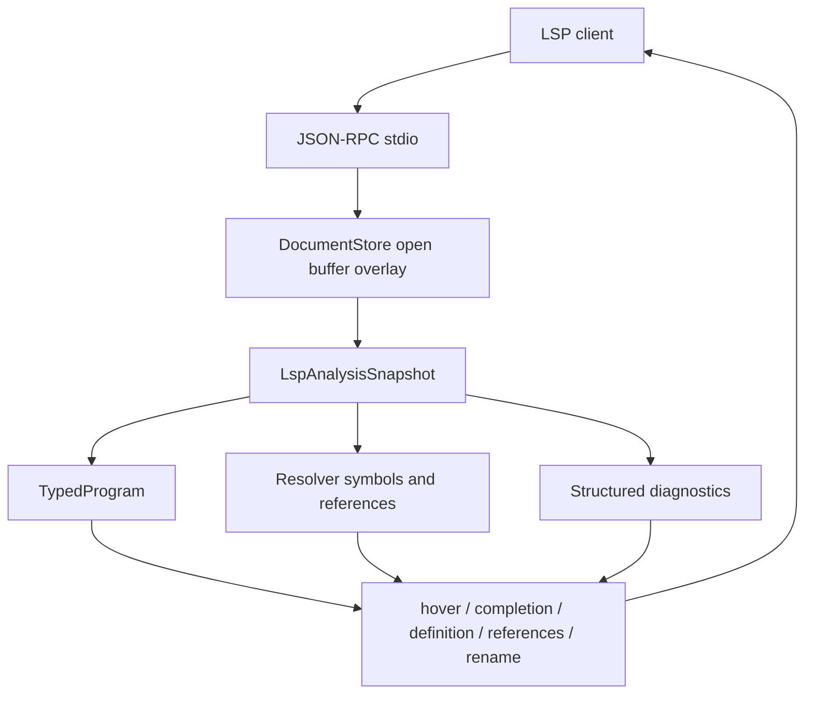
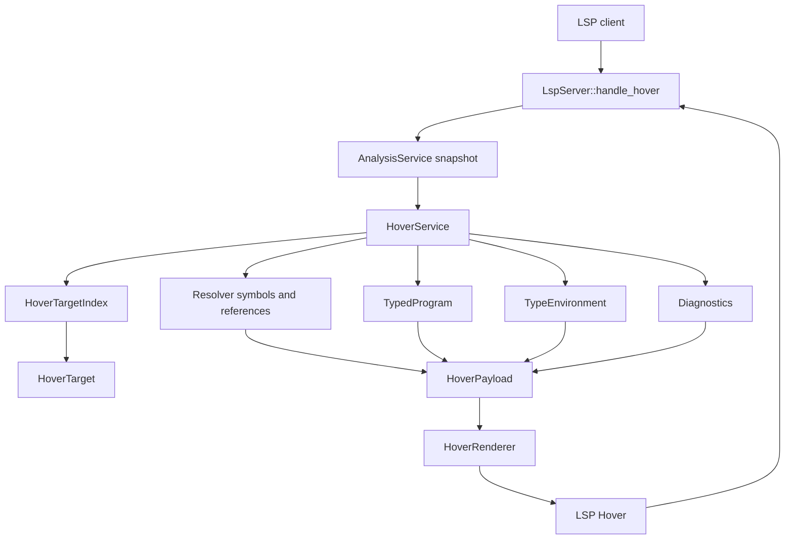
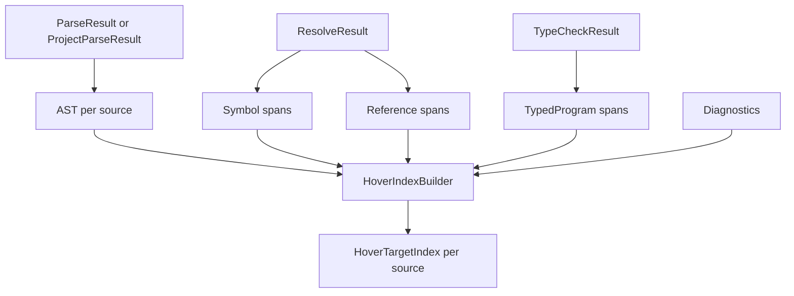
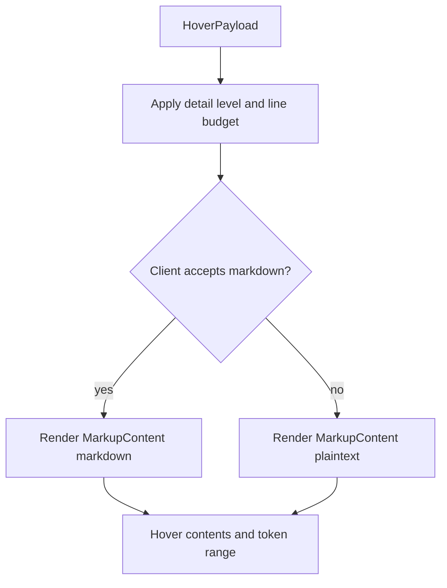

# AHFL LSP Hover Architecture

| 项目 | 内容 |
|------|------|
| 文档类型 | design |
| 状态 | 核心实现已落地；VS Code extension-host hover 回归已落地 |
| 目标模块 | `src/tooling/lsp/`、`tools/vscode/`、`tests/unit/tooling/lsp/` |
| 当前审计日期 | 2026-06-15 |

## 一、设计结论

AHFL LSP hover 的目标是提供 quick info，而不是 compiler inspector。用户把鼠标放在 identifier 或 symbol 上时，默认 hover 必须快速回答三个问题：

1. 这是什么。
2. 它的类型、角色或声明是什么。
3. 当前上下文里最需要注意的事实是什么。

核心结论如下：

1. Hover 服务以 `TypedProgram`、resolver symbol/reference、diagnostic 和 source snapshot 为权威输入；Semantic IR / Opt IR 不进入常驻 hover 路径。
2. Server 先定位最小语义 token，再构造结构化 payload，最后由统一 renderer 输出 Markdown 或 plaintext。
3. 默认 hover 只显示用户正在写代码时马上需要的信息；canonical name、module、source path、owner id 等调试元数据默认隐藏。
4. VS Code 的 hover 容器不是 AHFL 扩展可以重绘的自定义 UI；可控面是 LSP 返回内容的信息架构。
5. `LspServer::handle_hover` 只负责 JSON-RPC 参数解析、snapshot 获取和响应序列化，不负责语义查询或 Markdown 拼装。

LSP 整体主状态已经落到 `TypedProgram` + resolver symbol/reference + diagnostics snapshot。已完成的 production-readiness plan 不再作为独立 plan 维护；当前 LSP 架构事实以后只更新本文和 VS Code 打包参考。



当前已落地能力：

| 能力 | 当前事实来源 |
|------|--------------|
| diagnostics | parse / resolve / typecheck / validate diagnostics with versioned publish、`textDocument/diagnostic` full report 和 `workspace/diagnostic` full report；open/change/close 后刷新全部已打开文档，`workspace/didChangeWatchedFiles` 后失效 analysis cache，`workspace/didChangeWorkspaceFolders` 后更新 workspace roots，覆盖未保存跨文件依赖变化、未打开 imported source 修改和 PackageGraph context 切换 |
| hover | `HoverTargetIndex` + `HoverService` + `HoverRenderer` |
| completion | keyword / type / member / enum / state / workflow context |
| definition / references / rename | resolver references and declaration ranges |
| document / workspace symbol | project-aware symbol data |
| VS Code packaging | [lsp-vscode-extension.zh.md](../reference/lsp-vscode-extension.zh.md) |

这意味着截图中类似下面的输出是不合格的信息架构：

````markdown
```ahfl
states: [Init, Done]
```

agent state set

canonical `lib::agents::AliasAgent.states`

module `lib::agents`

source `tests/integration/check_fail_state/lib/agents.ahfl`

state count 2
````

目标输出应为：

````markdown
```ahfl
states: [Init, Done]
```

Defines 2 states for `AliasAgent`

- `Init` initial
- `Done` final
````

debug 模式才展示调试细节：

````markdown
Details: `lib::agents::AliasAgent.states` in `lib::agents`
Source: `tests/integration/check_fail_state/lib/agents.ahfl`
````

## 二、范围与状态

本设计把 hover 能力拆成三层，避免把“核心协议正确性”和“VS Code 客户端回归”混在一起判断。

| 层级 | 范围 | 状态 |
|------|------|------|
| Core LSP semantics | token 定位、target index、payload 构造、diagnostic 降级、range 精确性 | 已落地 |
| Content rendering | Markdown / plaintext、detail level、fact importance、默认隐藏调试元数据 | 已落地 |
| Client wiring | VS Code extension 配置、`initializationOptions.hover`、client `contentFormat` 协商 | 已落地 |
| Coverage hardening | 更多真实 fixture 的 symbol-bearing hover target 覆盖 | 已有 `HoverTargetIndex`-driven coverage helper，并覆盖 `tests/integration/check_ok` |
| Client regression | VS Code extension host 中执行 `vscode.executeHoverProvider`，覆盖 schema label、state label、type alias、struct field、workflow node | 已落地 |

非目标：

1. 不自定义 VS Code hover DOM、CSS、颜色或 tooltip 组件。
2. 不为 hover 引入 Semantic IR / Opt IR 查询路径。
3. 不在 hover request 中重新 parse / resolve / typecheck。
4. 不把 source path、canonical name、module 当成默认主视觉。
5. 不把 VS Code tooltip 像素截图作为自动门禁；hover DOM/CSS 属于 VS Code 实现细节，稳定门禁使用 extension-host hover provider 结果。

当前实现状态对应的文件：

| 能力 | 文件 |
|------|------|
| hover target index | `src/tooling/lsp/hover_index.hpp`、`src/tooling/lsp/hover_index.cpp` |
| hover payload / query service | `src/tooling/lsp/hover_service.hpp`、`src/tooling/lsp/hover_service.cpp` |
| Markdown / plaintext renderer | `src/tooling/lsp/hover_markup.hpp`、`src/tooling/lsp/hover_markup.cpp` |
| JSON-RPC hover wiring | `src/tooling/lsp/server.cpp`、`src/tooling/lsp/server.hpp` |
| LSP protocol serialization | `src/tooling/lsp/protocol_types.hpp`、`src/tooling/lsp/protocol_types.cpp` |
| VS Code hover options | `tools/vscode/package.json`、`tools/vscode/src/extension.ts` |
| handler / renderer / coverage 回归 | `tests/unit/tooling/lsp/server_handlers.cpp` |

## 三、外部调研基线

本文以 LSP 与主流语言服务实践为基线。AHFL 仍兼容早期 LSP hover 行为，因为 `textDocument/hover`、`MarkupContent` 和 `Hover.range` 的核心约束没有影响本设计的差异。

| 来源 | 对 AHFL 的约束或启发 |
|------|----------------------|
| [LSP Hover Request](https://microsoft.github.io/language-server-protocol/specifications/lsp/3.18/specification/#textDocument_hover) | `textDocument/hover` 返回 `Hover | null`，`contents` 可为 `MarkupContent`，`range` 用于高亮 hover 对象。 |
| [LSP MarkupContent](https://microsoft.github.io/language-server-protocol/specifications/lsp/3.18/specification/#markupContent) | client 可声明 `markdown` / `plaintext` 偏好，server 必须按能力降级。 |
| [VS Code Show Hovers](https://code.visualstudio.com/api/language-extensions/programmatic-language-features#show-hovers) | hover 应提供鼠标下 symbol/object 的类型、描述和上下文。 |
| [VS Code Hover API](https://code.visualstudio.com/api/references/vscode-api#Hover) | VS Code hover 是内容集合，多个 provider 结果可能聚合，单个 provider 应短且低重复。 |
| [VS Code Extension Capabilities](https://code.visualstudio.com/api/extension-capabilities/overview) | 扩展适合通过 language feature 提供 hover，但不应依赖重绘 VS Code 内置 UI。 |
| [gopls Hover](https://go.dev/gopls/features/passive#hover) | 成熟 hover 聚焦 name、kind、type、value、abbreviated declaration、doc comment、文档链接。 |
| [clangd Hover](https://clangd.llvm.org/features#hover) | C/C++ hover 聚焦 type、documentation、definition，复杂信息通过配置扩展。 |
| [clangd Hover Configuration](https://clangd.llvm.org/config#hover) | hover 需要信息预算和可配置细节层级，例如 AKA、宏展开长度、doc comment 格式。 |
| [Sorbet Hover](https://sorbet.org/docs/hover) | server 应按客户端能力在 Markdown 与 plaintext 之间降级。 |
| [Angular Language Service](https://angular.dev/tools/language-service#quick-info-and-navigation) | quick info 与 go-to-definition 互补，应说明 symbol 来源和当前上下文含义。 |
| [TypeScript QuickInfo](https://github.com/microsoft/TypeScript/blob/main/src/services/types.ts) | quick info 是 identifier 位置上的结构化语义结果，应有长度预算，避免无限展开。 |

抽象出的行业基线：

1. 第一屏先回答“这是什么、类型是什么、为什么重要”。
2. 声明签名是主视觉；调试元数据不是主视觉。
3. 默认内容必须短；详细内容通过配置或 debug 模式展开。
4. Hover 必须尊重客户端 `contentFormat`，Markdown 不是所有 LSP client 的共同能力。
5. 同一个事实不能在 signature、headline、facts 中重复出现。
6. source path、canonical name、module 只在消歧、跨文件定位、declaration hover 或 debug 模式中默认展示。

## 四、用户体验契约

AHFL hover 面向 DSL 作者，而不是 compiler 调试者。默认输出规则：

1. 最多 4 到 8 行完成主要解释。
2. 第一个 block 是最短可识别 AHFL 签名。
3. 第二段是一句自然语言 headline。
4. facts 默认不超过 3 条。
5. 单条 fact 不超过 100 个字符。
6. 列表超过 5 项时截断为前 5 项加剩余数量，例如 `` `Init`, `Review`, `Done` +2 more ``。
7. 当前文件 source path 默认不显示。
8. canonical name 默认只在 declaration、type alias、import alias、跨文件引用消歧或 debug 模式显示。
9. diagnostic 命中当前 token 时必须展示；不能把错误状态伪装成已解析 symbol。
10. Markdown 表格不进入默认 hover；窄 tooltip 容器中表格可读性差。

推荐文案：

| 不推荐 | 推荐 |
|--------|------|
| `agent schema field` | `Input schema for AliasAgent` |
| `agent state set` | `Defines 2 states for AliasAgent` |
| `state count 2` | `` `Init` initial, `Done` final `` |
| `canonical lib::agents::AliasAgent.states` | debug 模式下 `Details: lib::agents::AliasAgent.states` |
| `module lib::agents` | 跨文件或 declaration hover 下 `Module: lib::agents` |
| `source tests/integration/...` | debug 模式下 `Source: tests/.../agents.ahfl` |

## 五、目标语义覆盖

覆盖原则：

1. 每个具有语义含义的 identifier / symbol token 都应有 hover。
2. whitespace、punctuation、括号、逗号、分号、普通 comment 默认返回 null。
3. qualified name 的每个 identifier 段都应有段级 hover；完整 qualified name 可以有组合 target，但不能吞掉段级 hover。
4. 如果当前 token 同时命中 expression 和 symbol target，选择 token range 更小、语义更具体的 target。

### 5.1 顶层与模块

| 源码位置 | Hover 内容 |
|----------|------------|
| `module lib::agents` 的每个段 | module 名、source 文件、PackageGraph / manifest 摘要 |
| `import lib::types as types` 的路径段 | imported module、目标 source、导出 symbol 摘要 |
| import alias `types` | alias 到 target module |
| `struct` / `enum` / `type` / `const` / `capability` / `predicate` / `agent` / `workflow` 名 | declaration signature、kind、必要时 canonical name |

### 5.2 类型与声明内部

| 源码位置 | Hover 内容 |
|----------|------------|
| type alias 左侧名称 | alias declaration、resolved canonical type |
| type alias 右侧类型引用 | declared spelling、resolved type |
| struct field 名 | field name、field type、required/default 状态、所属 struct |
| struct field 类型 | resolved type、canonical declaration |
| enum variant | variant、所属 enum |
| const 名 | const type、value 摘要 |
| capability 参数名 | parameter name、type、parameter index |
| capability return type | resolved return type |
| capability effect item | effect kind、domain、receipt/retry/timeout 摘要 |
| predicate 参数名 | parameter name、type |

### 5.3 Agent / Flow / Contract

| 源码位置 | Hover 内容 |
|----------|------------|
| agent 名 | agent signature、input/context/output、states 摘要 |
| `input` / `context` / `output` label | schema role、resolved type、declared spelling |
| states 列表里的状态名 | state role、是否 initial/final、transition 出入边 |
| `initial` / `final` label | schema role、目标状态 |
| capabilities 列表里的 capability 名 | capability signature、effect 摘要 |
| transition 两端状态名 | source/target state、合法性 |
| contract target | agent canonical name |
| contract clause 内表达式 | typed expression hover |
| flow target | agent canonical name |
| state handler 名 | state role、policy 摘要 |
| goto 目标状态 | target state、是否 final |
| `input` / `context` / `output` path root | root role、root type |

### 5.4 Workflow

| 源码位置 | Hover 内容 |
|----------|------------|
| workflow 名 | workflow signature、input/output |
| workflow `input` / `output` label | schema role、resolved type、declared spelling |
| node 名 | node name、target agent、input expr type、dependency 摘要 |
| node target agent | agent signature |
| `after` dependency | referenced node、target agent、ordering role |
| safety / liveness temporal call target | temporal operator、target node/capability/state |
| return expression | output type compatibility |

### 5.5 表达式

| 源码位置 | Hover 内容 |
|----------|------------|
| local binding | local name、inferred/declared type、declaring statement |
| path root | root kind、root type |
| member access field | member name、member type、base type |
| call target | capability/predicate signature、effect/purity |
| call argument | parameter name、expected type、actual type |
| struct literal type | struct signature |
| struct literal field | field type、required/default 状态 |
| enum qualified value | enum name、variant name |
| literal | literal type |

## 六、总体架构



模块边界：

| 模块 | 职责 | 禁止事项 |
|------|------|----------|
| `LspServer::handle_hover` | 解析 `TextDocumentPositionParams`，取得 snapshot，调用 hover service，序列化 LSP response | 遍历 AST、查 symbol、拼 Markdown |
| `HoverService` | 统一 hover 查询入口，协调 index、resolver、Typed HIR、diagnostics | 重新构建 compiler pipeline |
| `HoverTargetIndex` | 为每个 source 建立可 hover token 的有序 span index | 用字符串包含关系猜语义 |
| `HoverPayload` 构造逻辑 | 把 `HoverTarget` 转成结构化 hover payload | 直接输出 LSP JSON |
| `HoverRenderer` | 把 payload 渲染为 Markdown 或 plaintext | 查询语义模型 |

`handle_hover` 的目标形态：

```cpp
void LspServer::handle_hover(const JsonRpcRequest &req) {
    const auto request = parse_hover_request(req);
    const auto *snapshot = analysis_.snapshot_for_uri(request.uri);
    const auto *source = snapshot != nullptr ? snapshot->source_for_uri(request.uri) : nullptr;
    if (snapshot == nullptr || source == nullptr || source->source == nullptr) {
        send_null(transport_, req.id);
        return;
    }

    HoverService hover_service(hover_options_);
    const auto hover = hover_service.hover_at(*snapshot, *source, request.position);
    send_hover_or_null(req.id, hover);
}
```

## 七、权威数据源

Hover 必须从 `LspAnalysisSnapshot` 读取现有分析结果：

| 信息 | 首选数据源 | 用途 |
|------|------------|------|
| 顶层声明符号 | `ResolveResult::symbol_table` / `TypedProgram::symbols` | declaration hover、canonical name、definition |
| 引用绑定 | `ResolveResult::references()` / `TypedProgram::references` | type ref、call target、agent capability、workflow target |
| 表达式类型 | `TypedProgram::expressions` | path、member access、call、literal、struct init、return expr |
| 声明结构 | `TypedDecl::payload` / `TypeEnvironment` | struct field、enum variant、capability params、agent schema、workflow node |
| 类型描述 | `Type::describe()` | 用户可读类型签名 |
| 错误状态 | parse / resolve / typecheck / validate diagnostics | unresolved hover 或错误提示 |
| source ownership | `LspSourceSnapshot` + `SourceId` | 跨文件 range 和 uri |

Hover 不默认读取 Semantic IR 或 Opt IR。它们可能重排或丢失源码位置，对 IDE 交互不是主模型。

## 八、目标定位模型

核心原则：先定位 token，再解释语义。不能先找一个大表达式，再猜鼠标是不是落在其中某个名字上。

```cpp
enum class HoverTargetKind {
    ModuleName,
    ImportPath,
    ImportAlias,
    DeclarationName,
    TypeReference,
    ConstReference,
    CallableReference,
    StructField,
    EnumVariant,
    CapabilityParam,
    PredicateParam,
    AgentSchemaLabel,
    AgentState,
    AgentTransition,
    FlowState,
    WorkflowSchemaLabel,
    WorkflowNode,
    WorkflowDependency,
    Expression,
    MemberAccess,
    LocalBinding,
    Diagnostic,
};
```

lookup 规则：

1. 只在当前 source 的 target list 中查找。
2. 命中多个 target 时，选择 `token_range` 最小者。
3. 同 range 多 target 时，按优先级选择：diagnostic-attached target > explicit token target > expression target > declaration fallback。
4. whitespace / punctuation / comment 上返回 null。
5. AST 当前若缺少精确 name range，应优先补 AST builder，而不是在 LSP 中继续做字符串反查。

Index 构建流程：



Index builder 追加 target 的层次：

1. AST token 层：声明名、字段名、参数名、状态名、workflow node、schema label。
2. Resolver 层：顶层 declaration symbol、resolved references、import alias。
3. Typed HIR 层：表达式、member access、call target、path root、literal。
4. Diagnostic 层：未解析或类型错误 range 上的 diagnostic target。

## 九、HoverPayload 模型

Renderer 不直接读取 compiler 对象。`HoverService` 先构造结构化 payload，再交给 renderer。

```cpp
enum class HoverFactImportance {
    Primary,
    Secondary,
    Debug,
};

struct HoverFact {
    HoverFactImportance importance;
    std::string label;
    std::string value;
};

struct HoverPayload {
    std::string signature;
    std::string headline;
    std::vector<HoverFact> facts;
    std::vector<std::string> documentation;
    std::vector<std::string> diagnostics;
    std::string canonical_name;
    std::string module_name;
    std::string source_label;
    SourceRange token_range;
};
```

payload 规则：

1. `signature` 是第一视觉，不能在 facts 中重复。
2. `headline` 必须是一句自然语言，不使用内部 enum 名。
3. `Primary` facts 默认展示。
4. `Secondary` facts 只在 debug 模式或预算允许时展示。
5. `Debug` facts、`canonical_name`、`module_name`、`source_label` 默认隐藏。
6. `diagnostics` 命中当前 token 时总是展示，不受 detail level 隐藏。

## 十、Renderer 信息架构

Renderer 按固定层级渲染，不允许 payload 字段按添加顺序直接串接。

| 层级 | 默认展示 | 内容 | 规则 |
|------|----------|------|------|
| L0 Signature | 是 | code fence 或 inline code | 只放最短可识别签名；不得重复出现在 facts 中。 |
| L1 Headline | 是 | 一句自然语言摘要 | 回答“这是什么”。 |
| L2 Primary facts | 是 | 1 到 3 条关键事实 | 只放用户马上要用的信息，例如 initial/final、field type、effect。 |
| L3 Documentation | 有 doc 时展示 | doc comment 摘要 | 默认最多 1 段；长文档以后通过详细模式展开。 |
| L4 Diagnostics | 命中错误时展示 | 当前 token 相关错误 | 错误必须诚实，不能伪造成已解析 symbol。 |
| L5 Details | 默认隐藏 | canonical、module、source、owner id、index key | 只在 declaration hover、跨文件引用、debug 模式下展示。 |

Markdown 规则：

1. AHFL 代码块只用于签名或声明。
2. 短 facts 用 bullet list。
3. label 使用自然语言，值使用 inline code。
4. 不使用 HTML、内联样式、颜色或图片。
5. 不输出 Markdown 表格作为默认 hover。
6. Renderer 必须提供 plaintext 降级路径。

渲染流程：



detail level：

| 配置 | 默认 | 行为 |
|------|------|------|
| `ahfl.hover.detailLevel` | `standard` | `compact` / `standard` / `debug` |
| `ahfl.hover.showSource` | `false` | 在 `debug` 模式下可强制展示 source path |
| `ahfl.hover.maxFacts` | `3` | 控制默认 facts 数量 |
| `ahfl.hover.markupKind` | `auto` | `auto` / `markdown` / `plaintext`；`auto` 尊重 client capability |

| 模式 | 展示内容 |
|------|----------|
| `compact` | signature + headline；适合窄屏或低噪声偏好。 |
| `standard` | signature + headline + primary facts；默认模式。 |
| `debug` | standard + canonical/module/source/owner/debug facts；适合调试 LSP。 |

## 十一、推荐模板

### 11.1 Agent schema label

````markdown
```ahfl
input: lib::types::Request
```

Input schema for `AliasAgent`

- Declared as: `types::RequestAlias`
````

### 11.2 Agent property: states

````markdown
```ahfl
states: [Init, Done]
```

Defines 2 states for `AliasAgent`

- `Init` initial
- `Done` final
````

### 11.3 Agent state

````markdown
```ahfl
state Done
```

Final state of `AliasAgent`

- Incoming transition from `Init`
````

### 11.4 Goto target

````markdown
```ahfl
goto Done
```

Jumps to final state `Done`
````

### 11.5 Struct field

````markdown
```ahfl
category: String
```

Field of `Request`
````

### 11.6 Type alias

````markdown
```ahfl
type RequestAlias = Request
```

Type alias for `lib::types::Request`
````

### 11.7 Capability

````markdown
```ahfl
capability Echo(value: String) -> Request
```

Capability

- Effect: pure or declared effect
- Used by: `AliasAgent`
````

### 11.8 Workflow node

````markdown
```ahfl
node run: AliasAgent(input)
```

Workflow node in `MainFlow`

- Agent output: `lib::types::Response`
- Dependencies: none
````

### 11.9 Member access

````markdown
```ahfl
input.category: String
```

Field access on `Request`
````

## 十二、错误与降级策略

| 场景 | 行为 |
|------|------|
| hover 在 whitespace / punctuation | 返回 null |
| source 没有 snapshot | 返回 null |
| AST 存在但 resolver 失败 | 优先展示 AST-level declaration/token hover；引用 hover 展示 diagnostic 上下文 |
| resolver 成功但 typecheck 失败 | 展示 symbol hover；type 信息缺失处显示 diagnostic，不显示伪造类型 |
| type alias 无法解析 | 展示 alias declaration 和 diagnostic |
| range 命中大表达式但 token 无语义 | 返回表达式类型 hover，但 range 仍应是最小表达式或 token |
| 多个 target 重叠 | 选择最小 range；同 range 按 target priority |
| client 不支持 Markdown | 输出 plaintext，保留 signature/headline/facts 顺序 |

## 十三、性能与缓存

Hover 是高频请求，必须遵守：

1. 单次 lookup 为 `O(log n + k)`，`n` 是当前 source target 数，`k` 是同 offset overlap 数。
2. 不在 hover request 中扫描所有 declarations / references。
3. `HoverTargetIndex` 跟随 `LspAnalysisSnapshot` 生命周期缓存。
4. Renderer 可以即时运行，但 payload 查询不能重做全局分析。
5. snapshot revision / content hash 变化时 index 自动失效。

对于当前 AHFL 规模，简单 vector + binary search 足够；只有 profiling 证明单文件 target 数过大时，才引入 interval tree。

## 十四、测试与验收

测试分四层：

| 层级 | 目标 | 当前状态 |
|------|------|----------|
| `HoverTargetIndex` | 给定 fixture，断言关键 offset 命中正确 `HoverTargetKind` 和 `token_range` | 已覆盖 rich fixture 与 `tests/integration/check_ok` |
| Payload / renderer | 断言 signature、headline、facts importance、diagnostics、Markdown/plaintext、compact/standard/debug | 已落地 |
| LSP handler | 通过真实 JSON-RPC `textDocument/hover` 断言 `contents.kind`、`range`、关键内容片段 | 已落地 |
| VS Code client regression | 在 VS Code extension host 中执行 `vscode.executeHoverProvider`，验证 schema label、state label、type alias、struct field、workflow node | 已落地 |

必须覆盖的回归 fixture：

| Fixture | 断言 |
|---------|------|
| `tests/integration/check_fail_state/lib/agents.ahfl` | `input` label 显示 schema type，不显示 `AliasAgent` |
| `tests/integration/check_fail_state/lib/agents.ahfl` | `types::RequestAlias` 显示 alias 与 resolved canonical type |
| `tests/integration/check_fail_state/lib/agents.ahfl` | `states` label 默认不显示 source path、canonical name、`state count N` |
| `tests/integration/check_fail_state/lib/agents.ahfl` | `AliasAgent` 名称 hover 显示 agent declaration |
| 多文件 import fixture | import alias 和 qualified type reference hover 指向 imported module |
| agent state fixture | states / initial / final / transition / goto 都有 state hover |
| workflow fixture | node name、target agent、after dependency、return expression 都有 hover |
| struct/enum fixture | field、variant、struct literal field、enum qualified value 都有 hover |
| error fixture | unresolved reference 上显示 diagnostic，不显示错误 symbol |

功能验收：

1. coverage helper 必须基于 `HoverTargetIndex` 产物断言每个 semantic hover target 都能返回 hover；不得维护第二套手写词法扫描。
2. grammar lexer 只能作为定位辅助或额外 audit 输入，不能成为 parallel language implementation。
3. helper 能列出 fixture 中所有 indexed hover target，并断言每个 symbol-bearing target 有 hover。
4. 所有 hover 的 range 都等于 token range，除非目标明确是表达式整体。
5. `states` label hover 在 standard 模式下不展示 source path。
6. `states` label hover 在 standard 模式下不展示 canonical name。
7. `state count N` 这类内部字段文案不得出现在 standard hover。
8. 同一个签名不得在一个 hover response 中出现两次。
9. `source_label` 只在 debug detail level 或跨文件 declaration 消歧时展示。
10. Markdown output 必须有对应 plaintext 快照测试。
11. VS Code extension-host 回归应覆盖 schema label、state label、type alias、struct field、workflow node。

架构验收：

1. `server.cpp` 不新增 hover 语义特判。
2. Renderer 不读取 resolver、Typed HIR、TypeEnvironment。
3. `HoverService` 不触发 parse / resolve / typecheck。
4. Payload tests 断言语义字段；renderer tests 断言最终 Markdown/Plaintext。
5. 所有架构图保持 Mermaid 语法。

## 十五、当前验证入口

当前仓库中的验证命令：

```bash
cmake --build --preset build-dev --target ahfl_tooling_lsp_handler_tests ahfl-lsp
./build/dev/tests/ahfl_tooling_lsp_handler_tests
ctest --preset test-dev --output-on-failure -L lsp
ctest --preset test-dev --output-on-failure
pnpm --dir tools/vscode run check
pnpm --dir tools/vscode run test:hover
git diff --check
```

已验证的核心行为：

1. `tests/integration/check_fail_state/lib/agents.ahfl` 中 `input` label 返回 schema type，不再错选 `lib::agents::AliasAgent`。
2. `types::RequestAlias` 返回 alias 签名与 `lib::types::Request` canonical 解析。
3. `capabilities` label 返回 agent capabilities hover。
4. `states` label 在 standard 模式下隐藏 canonical/source/internal count，并显示 `Defines 2 states for Agent` 与 initial/final facts。
5. Renderer 支持 `compact` / `standard` / `debug` detail level。
6. Server 尊重 client hover `contentFormat`，并支持 Markdown / plaintext 输出。
7. VS Code 扩展提供 `ahfl.hover.detailLevel`、`ahfl.hover.showSource`、`ahfl.hover.maxFacts`、`ahfl.hover.markupKind` 配置，并通过 `initializationOptions.hover` 传给 server。
8. Handler 测试提供 `HoverTargetIndex`-driven coverage helper，覆盖 rich hover fixture 与 `tests/integration/check_ok` 中已经建模的 semantic target，并断言每个 target 均有 hover。
9. VS Code extension-host hover 回归使用 `@vscode/test-electron` 启动扩展测试宿主，打开 `tests/integration/check_ok`，通过 `vscode.executeHoverProvider` 覆盖 schema label、state label、type alias、struct field、workflow node。
