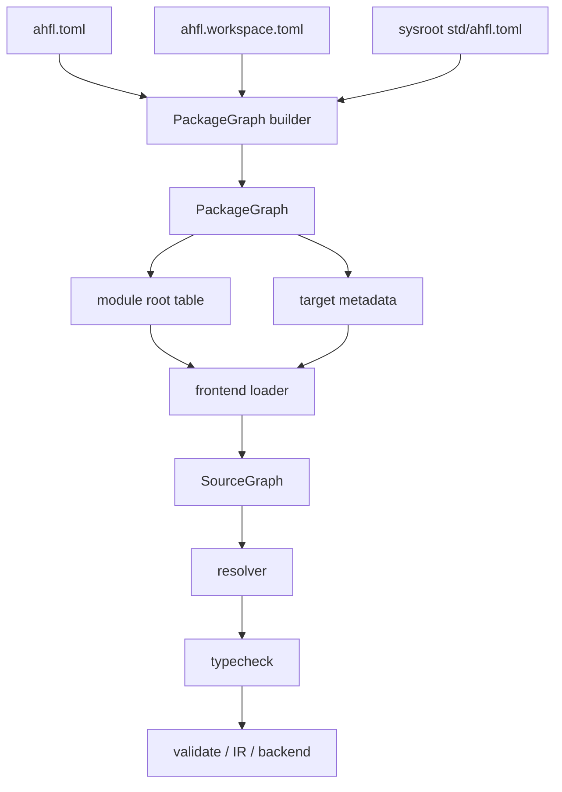

# AHFL Module Loading

本文冻结 AHFL 当前的多文件 module / import 装载边界。公开工程入口以
`ahfl.toml`、`ahfl.workspace.toml` 和 sysroot `std/ahfl.toml` 构建
PackageGraph；frontend loader 只消费 PackageGraph 下发的 module root table，
再构建 SourceGraph。

关联文档：

- [module-resolution-rules.zh.md](./module-resolution-rules.zh.md)
- [source-graph.zh.md](./source-graph.zh.md)
- [semantics-architecture.zh.md](./semantics-architecture.zh.md)
- [project-usage.zh.md](../reference/project-usage.zh.md)
- [RFC 0005：Package Configuration System](../rfcs/0005-package-configuration-system.zh.md)

适用范围：

- `include/ahfl/compiler/frontend/frontend.hpp`
- `src/compiler/syntax/frontend/project.cpp`
- `src/compiler/package_graph/`
- `src/tooling/cli/cli_driver.cpp`
- `src/tooling/lsp/analysis_service.cpp`

## 目标

1. 固定 PackageGraph-first 的多文件装载模型。
2. 固定 `module` / `import` 在 project-aware 模式下的所有权、可见性和名称边界。
3. 明确 PackageGraph builder、frontend loader、resolver / checker 的诊断分层。
4. 防止工具层重新发明工程发现、stdlib 位置和 package visibility 规则。

## 非目标

本文不定义：

1. 远程 registry。
2. 多版本依赖求解。
3. 增量编译缓存。
4. Native runtime artifact 的部署格式。

## 术语

### PackageGraph

由 package manifest、workspace manifest 和 sysroot manifest 构建出的工程输入图。
它拥有 package identity、dependency DAG、module root table、target metadata 和
package-level diagnostics。

### Module Root Entry

PackageGraph 中的一条 module root 记录，包含：

- package id
- module prefix
- 源码根目录
- exported modules
- dependency prefixes
- compiler intrinsic allowlist

### Source File

单个 `.ahfl` 源文件，对应一个 `SourceFile` 内容对象和一个物理路径。

### Entry Source

某个 target 或工具请求的入口源码。PackageGraph 模式下它来自 target metadata；
LSP 可以在没有目标入口时把当前打开文件作为 fallback entry。

### Module Owner

声明某个 `module foo::bar;` 且被 SourceGraph 接受的唯一 source file。

### SourceGraph

由 entry source 出发，经 `import` 递归装载得到的 source file 集合及其 import
边。resolver、typecheck、validate 只消费已经冻结的 SourceGraph。

### Raw ProjectInput

`ProjectInput` 是 frontend loader 的内部结构。它可以服务单文件调试和 C++ 层
低级测试，但不是公开工程模型。用户、CLI、LSP、formatter 和文档入口必须通过
PackageGraph，而不是直接暴露 raw loader 输入。

## 总体架构

## 兼容性立场

当前保留两类入口，但只有第一类是公开工程模型：

1. PackageGraph-backed project-aware 模式。
2. raw loader / single-file 兼容模式。

兼容规则：

1. `check <file>` 继续支持单文件心智模型，不要求 manifest。
2. 单文件兼容模式不自动递归装载其他源码，也不默认注入 prelude。
3. 多文件工程、stdlib、formatter、LSP 和 target-aware backend 必须通过
   PackageGraph。
4. raw loader 的 `search_roots` 通道只允许内部测试和低层调试使用；不得重新作为
   CLI、LSP 或文档化工程入口。

## Module Ownership 规则

在 project-aware 模式下固定采用以下规则：

1. 每个被装载进入 SourceGraph 的 source file 必须且只能有一个 `module` 声明。
2. 一个 module 只能有一个 module owner。
3. 两个 source files 声明相同 module 属于 loader / project-level 错误。
4. 无 `module` 声明的源码只能存在于单文件兼容模式；一旦进入 SourceGraph，
   即视为错误。
5. `module` 名字是逻辑所有权，不等于文件路径字符串本身。

## Module 到文件路径的映射

PackageGraph builder 先建立 module root table：

1. 每个 package manifest 提供 `[module].prefix` 和 `[module].root`。
2. sysroot `std/ahfl.toml` 必须声明 package name `std`、kind
   `standard-library`、prefix `std`、module root `.`。
3. 同一个 PackageGraph 内 duplicate package name 和 duplicate module prefix
   在 builder 阶段直接报错。
4. dependency DAG 在 builder 阶段确定；loader 不重新解析 package dependency。

frontend loader 对 import 目标按如下规则定位：

1. import 目标必须匹配某个 module prefix；最长 prefix 胜出。
2. 若目标等于 prefix，例如 `std`，优先映射到该 root 下的 `mod.ahfl`。
3. 若目标是 prefix 的子模块，例如 `std::option`，映射到 prefix 后剩余路径：
   `option.ahfl`；目录模块形式为 `option/mod.ahfl`。
4. loader 不扫描目录树，也不猜测未声明 package。
5. PackageGraph 模式下跨 package import 必须满足声明过的 dependency edge。
6. 跨 package import 只能访问 dependency manifest 中 `[exports].modules` 暴露的
   module。

## `import` 的语义

明确区分两类 `import`：

1. `import foo::bar;`
2. `import foo::bar as baz;`

其语义固定如下：

1. `import` 首先是 SourceGraph 装载请求。
2. 不带 alias 的 `import` 只声明依赖关系，不向本地作用域注入新的简写名字。
3. 不带 alias 的跨模块引用仍应使用完整限定名，例如 `foo::bar::Order`。
4. 带 alias 的 `import` 会在当前 source file 的本地导入表中引入一个局部别名。
5. alias 只在声明它的 source file 内有效，不跨文件传播。
6. 不支持 wildcard import。
7. 不支持 re-export 语义；package 对外可见性由 manifest `[exports]` 表达。

## SourceGraph 构建规则

从 entry source 构建 SourceGraph 时，固定遵守以下顺序：

1. PackageGraph builder 先完成 manifest、workspace、sysroot、dependency 和
   target 校验。
2. CLI / LSP / formatter 把 PackageGraph 转换为 frontend loader 所需的 module
   root table 与 entry source。
3. loader 装载 entry source。
4. loader 读取并校验其 `module` 声明。
5. loader 收集该 source 的所有 `import` 目标。
6. loader 按 module root table 查找依赖源文件。
7. loader 对尚未装载的依赖模块递归重复上述过程。
8. loader 对已装载模块复用已有 source unit，不重复解析。

额外规则：

1. import graph 可以有环；loader 只负责去重和终止递归，不在本阶段拒绝环。
2. import graph 的环不自动等于语义错误。
3. 真正的非法循环仍由后续更具体的语义规则处理，例如 type alias cycle。

## Diagnostics 分层

PackageGraph builder 负责：

1. manifest / workspace schema 错误。
2. sysroot `std/ahfl.toml` 缺失或不符合标准库契约。
3. duplicate package name。
4. duplicate module prefix。
5. dependency 缺失、来源不匹配或版本不匹配。
6. workspace member 不存在或重复。
7. target 不存在、target kind 不合法或 target entry 不可解释。

frontend loader 负责：

1. import 目标模块不存在。
2. module 到文件路径映射失败。
3. 两个源文件声明同一 module。
4. project-aware 模式下源文件缺失 `module`。
5. 跨 package import 缺少 dependency edge。
6. 跨 package import 访问未导出的 private module。
7. source overlay 与磁盘路径归一化后的内容装载。

resolver / checker 继续负责：

1. duplicate type / const / capability / agent / workflow。
2. unknown type / unknown callable / ambiguous callable。
3. import alias 归一化后的符号解析。
4. contract / flow / workflow 的语义错误。
5. type alias cycle、effect、decreases、trait impl 等语义规则。

换句话说，PackageGraph 和 loader 负责“文件集合是否成立”，resolver / checker 负责
“语言语义是否成立”。

## 对 resolver 的约束

进入 project-aware 模式后，resolver 不应再承担以下职责：

1. 读取文件系统。
2. 决定 PackageGraph、sysroot 或 module root。
3. 决定 module 到路径的映射。
4. 决定 package dependency 或 exported module visibility。

resolver 只消费已经冻结好的 SourceGraph，并负责：

1. 注册跨文件顶层符号。
2. 解析 alias-qualified 与 canonical-qualified 名称。
3. 继续产出稳定的 resolved reference。

更细的名称归一化、canonical name 和 lookup 顺序规则，见
[module-resolution-rules.zh.md](./module-resolution-rules.zh.md)。

## `std` 与 prelude

`std` 是 sysroot package，不是普通 search path：

1. sysroot 目录必须包含 `std/ahfl.toml`。
2. `std/ahfl.toml` 必须声明 package name `std`、kind `standard-library`、
   prefix `std`、module root `.`。
3. 普通 package 依赖 std 必须写作 `std = { source = "sysroot" }`。
4. `std::prelude` 由 sysroot manifest 声明，但 public PackageGraph 入口采用
   explicit prelude：用户需要显式 import 或通过 std 模块暴露的全限定名使用。
5. raw ProjectInput 的 `inject_prelude` 仅保留给内部测试和后续语法实验，不是当前
   公开 package 语义。

## 当前不承诺的能力

以下能力不在本设计承诺范围内：

1. registry / remote import。
2. 多版本依赖解析。
3. vendor override。
4. 条件导入。
5. 基于 build graph 的增量重编译。
6. 隐式目录扫描发现 module。

## 对后续实现的约束

多文件装载相关实现必须遵守以下规则：

1. 公开工程入口先构建 PackageGraph，再构建 SourceGraph。
2. 新增 CLI 参数不得绕过 `ahfl.toml` / `ahfl.workspace.toml` / `std/ahfl.toml`
   的 PackageGraph 链路。
3. LSP、formatter、diagnostics、semantic tokens 和 hover 不得各自推断工程根、
   stdlib 位置或 package visibility。
4. project-aware regression tests 必须覆盖 missing module、duplicate module
   owner、private module import、undeclared package dependency、duplicate module
   prefix 和 sysroot std contract。
