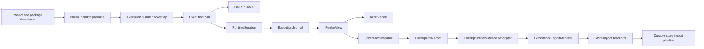

# AHFL Native Runtime Architecture

本文是 AHFL native / runtime-adjacent artifact 的当前设计入口，合并原先按阶段拆开的 native bootstrap 设计文档。历史阶段说明不再作为维护入口；当前实现和后续设计只更新本文、[durable-store-import-architecture.zh.md](./durable-store-import-architecture.zh.md) 以及对应 reference 文档。

关联文档：

- [native-runtime-artifacts.zh.md](../reference/native-runtime-artifacts.zh.md)
- [native-handoff-usage.zh.md](../reference/native-handoff-usage.zh.md)
- [project-usage.zh.md](../reference/project-usage.zh.md)
- [durable-store-import-architecture.zh.md](./durable-store-import-architecture.zh.md)
- [project-status.zh.md](../plans/project-status.zh.md)

## 设计目标

Native runtime architecture 的目标不是在 compiler 仓库里实现完整生产 runtime，而是冻结 compiler 可以稳定交给 runtime、review tooling、dry-run、scheduler、checkpoint 和 store-import pipeline 的 machine-facing artifact chain。

当前设计坚持四条边界：

1. `ahfl.package.json` 是 package authoring 输入，`emit-native-json` / handoff package 是 compiler 输出；二者不能混成一个 descriptor。
2. artifact chain 是事实来源；review summary、CLI 文本和 audit report 只能是 projection。
3. 每个下游 artifact 只能依赖它声明的直接上游 source artifact，不能重新解析 source 或私自反推上游状态。
4. 真实 connector、secret、distributed worker、durable queue、object store 和 recovery daemon 不属于当前 compiler-native artifact contract。

## 总体链路

`DryRunTrace` 是 local deterministic execution projection，不进入 durable chain。`AuditReport` 是 reviewer-facing projection，也不能成为后续 machine-facing artifact 的第一事实来源。

## Artifact 职责

| Artifact | 事实来源职责 | 非职责 |
| --- | --- | --- |
| Package authoring descriptor | 描述 package identity、entry/export target、capability binding alias | deployment secret、runtime endpoint、connector SDK config |
| Native handoff package | 冻结 compiler 输出给 native/runtime 的 package、graph、capability surface 与 policy/contract 摘要 | 完整 AST、resolver/typechecker 内部对象、真实 runtime 状态 |
| Execution planner bootstrap | 读取 handoff package 并投影最小 planner 输入 | 生产 scheduler、retry、timeout、parallel execution |
| ExecutionPlan | 冻结 workflow node、dependency、input expression 与 source package 关系 | agent state machine interpreter、真实 connector invocation |
| DryRunTrace | 冻结 local dry-run 的 mock binding、deterministic trace 与 skipped boundary | 生产 runtime log、provider payload、secret |
| RuntimeSession | 冻结 workflow/node 当前状态、partial / failed session summary | durable checkpoint、recovery token、worker lease |
| ExecutionJournal | 冻结 session 事件序列、ordering 与 failure event family | host telemetry、wall-clock performance log |
| ReplayView | 冻结 session / journal 的 consistency projection | 重新定义 session 状态或 journal 事件 |
| AuditReport | 冻结 reviewer-facing aggregate conclusion | machine-facing recovery input |
| SchedulerSnapshot | 冻结 ready set、blocked reason、executed prefix 与 scheduler cursor | production scheduling policy 或 distributed queue |
| CheckpointRecord | 冻结 checkpoint-facing state 与 resume basis | crash recovery protocol、durable object identity |
| CheckpointPersistenceDescriptor | 冻结 persistence-facing identity、boundary 与 blocker | object store schema、transaction protocol |
| PersistenceExportManifest | 冻结 export bundle、source artifact chain 与 store import preview | durable adapter invocation |
| StoreImportDescriptor | 冻结 store-import-facing machine state | provider SDK invocation、secret material |

Durable store import 之后的 provider pipeline 已经有独立设计入口：[durable-store-import-architecture.zh.md](./durable-store-import-architecture.zh.md)。

## Package Authoring 边界

`ahfl.package.json` 当前只承诺 package authoring 语义：

1. package identity 与 project identity 分离。
2. entry/export target 指向 package 暴露给 native/runtime 的入口。
3. capability binding alias 是 package metadata，不是 deployment secret。
4. descriptor 结构错误、metadata reference 错误和 metadata consistency 错误必须分层诊断。

Package authoring 不承诺：

1. endpoint、region、tenant、secret、connector SDK 或 deployment target。
2. runtime launcher、scheduler 或 worker host。
3. production traffic enablement。

## Handoff Package 边界

Native handoff package 应保留：

1. package / project identity。
2. workflow execution graph 与 exported entry。
3. external capability surface。
4. policy / contract surface。
5. restricted control / data summary，足够让 reference consumer 建立 planner bootstrap。

Native handoff package 不应保留：

1. parser trivia、AST 私有节点、resolver/typechecker 内部指针。
2. deployment secret、endpoint、tenant、region。
3. runtime execution history。
4. review-only text 或 CLI formatting。

## Runtime Projection 边界

Runtime-adjacent artifact 必须按层次消费：

1. `ExecutionPlan` 只依赖 handoff package / planner bootstrap。
2. `RuntimeSession` 只依赖 execution plan 和当前 execution result。
3. `ExecutionJournal` 只依赖 runtime session 与事件生成规则。
4. `ReplayView` 只校验 plan / session / journal 的一致性。
5. `AuditReport` 只给 reviewer/CI 使用，不能反向成为 machine input。
6. `SchedulerSnapshot` 只能消费 replay / session / journal 提供的 machine facts。
7. Checkpoint / persistence / export / store-import 只能继续沿 machine-facing chain 追加，不得从 audit text、CLI output 或 source file 重建状态。

## 变更规则

1. 新增 artifact 时，先在本文定义事实来源、直接上游和非目标，再在 [native-runtime-artifacts.zh.md](../reference/native-runtime-artifacts.zh.md) 登记格式标识与消费规则。
2. 修改 artifact 语义时，必须同步代码中的 format-version 常量、golden output、reference 表和相关 CTest label。
3. 如果只是 reviewer 文案或 CLI display 变化，不应创建新的 architecture 文档。
4. 如果进入真实 provider / durable-store 写入领域，应扩展 durable-store-import 设计，而不是继续扩大 native runtime artifact。

## 当前状态

原 `native-*-bootstrap` 系列文档已合并到本文。后续维护时不要再为每个小阶段创建新的 bootstrap 文档；同一 artifact chain 的架构变化应直接更新本文，具体命令和格式参考更新 [native-runtime-artifacts.zh.md](../reference/native-runtime-artifacts.zh.md)。
