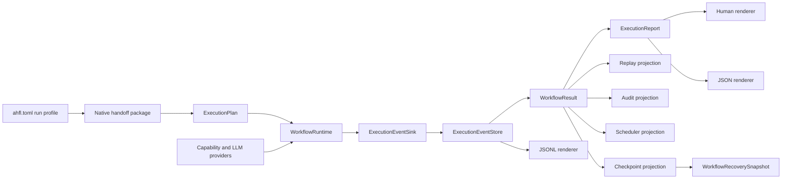

# AHFL Native Runtime Architecture

本文定义 AHFL runtime kernel 的当前架构。编译期 handoff artifact 与运行期事实严格分层：`ExecutionPlan` 是编译器到 runtime 的静态输入，`WorkflowResult.events` 是一次真实运行的唯一动态事实源。replay、audit、scheduler、checkpoint、human/JSON/JSONL 输出和 recovery snapshot 都是 canonical event log 的投影，不再形成彼此串联的第二条 artifact 链。

关联文档：

- [结构化执行事件 RFC](../rfcs/0012-structured-workflow-execution-ux.zh.md)
- [Native handoff 使用](../reference/native-handoff-usage.zh.md)
- [执行与包指南](../reference/user-guide-execution.zh.md)
- [项目状态](../plans/project-status.zh.md)

## 用户故事

一个高风险 Agent workflow 在第三个节点调用外部 capability 时被 `SIGKILL`。操作者重启同一个工程，检查已持久化 checkpoint，批准恢复，然后继续执行。恢复过程必须满足：

1. 已完成节点不会再次执行副作用。
2. scheduler、audit、replay 和恢复候选来自同一组 execution events。
3. 部分写入通过原子替换协议被拒绝或恢复，不产生半份 snapshot。
4. human、JSON 和 JSONL 输出不能对同一次运行给出不同终态。
5. runtime 关联依赖数值 ID；source name 只在诊断与展示边界出现。

## 总体架构

```mermaid
flowchart LR
    Manifest[ahfl.toml run profile] --> Handoff[Native handoff package]
    Handoff --> Plan[ExecutionPlan]
    Plan --> Runtime[WorkflowRuntime]
    Runtime --> Sink[ExecutionEventSink]
    Provider[Capability and LLM providers] --> Runtime
    Sink --> Store[ExecutionEventStore]
    Store --> Result[WorkflowResult]
    Result --> Report[ExecutionReport]
    Result --> Replay[Replay projection]
    Result --> Audit[Audit projection]
    Result --> Scheduler[Scheduler projection]
    Result --> Checkpoint[Checkpoint projection]
    Checkpoint --> Recovery[WorkflowRecoverySnapshot]
    Report --> Human[Human renderer]
    Report --> JSON[JSON renderer]
    Store --> JSONL[JSONL renderer]
```

`DryRunTrace` 是 `ExecutionPlan` + deterministic capability mocks 的离线演练结果，不冒充真实 runtime event log，也不进入 crash/recovery 主链。

## 核心不变量

### 唯一动态事实源

1. 运行期状态变化只能通过 `ExecutionEventSink` 追加到 `ExecutionEventStore`。
2. `WorkflowResult` 持有 event store、runtime value store、diagnostic store 和静态 ID metadata。
3. replay、audit、scheduler、checkpoint 与 report builder 只能读取 `WorkflowResult.events`；禁止读取 CLI 文本、旧 snapshot、源码名称映射或再次执行 workflow。
4. projection 不得互相依赖。例如 checkpoint 不消费 scheduler projection 的私有状态；二者都从 canonical events 独立构造。

### 数值身份

canonical identity 使用独立强类型 index：

- `RunId`
- `WorkflowId`
- `WorkflowNodeId`
- `AgentId`
- `CapabilityId`
- `ProviderId`
- `AgentStateId`
- `InvocationId`
- `RuntimeValueId`
- `DiagnosticId`
- `ExecutionEventId`
- `CheckpointId`

这些 ID 引用 flat stores。workflow name、node name、target string 和 provider display name 只用于 source correlation、diagnostic 与 renderer。

### Terminal invariant

每个 started identity 必须恰有一个 terminal event：

- `RunStarted` / `RunResumed` -> `RunCompleted`
- `WorkflowStarted` -> `WorkflowCompleted` 或 `WorkflowFailed`
- `NodeStarted` -> `NodeCompleted`、`NodeFailed` 或 `NodeSkipped`
- `CapabilityStarted` -> `CapabilityCompleted` 或 `CapabilityFailed`

预算拒绝、timeout、retry exhaustion、fallback、cancellation、process interruption 和恢复都必须写入 event log，不能仅打印诊断后提前返回。

### 时间与顺序

1. `ExecutionEventId` 是单次运行内的追加顺序。
2. `monotonic_offset` 只允许单调不减。
3. DAG 因果关系来自 dependency IDs，不从 vector 位置或 wall-clock timestamp 推断。
4. wall-clock metadata 可用于展示，但不能参与 identity 或恢复决策。

## Event Families

| Family | Events | 语义 |
| --- | --- | --- |
| Run | `RunStarted`, `RunResumed`, `RunCancellationRequested`, `RunInterrupted`, `RunCompleted` | 单次运行生命周期 |
| Workflow | `WorkflowStarted`, `WorkflowCompleted`, `WorkflowFailed` | workflow 终态 |
| Node | `NodeScheduled`, `NodeStarted`, `NodeRestored`, `NodeCompleted`, `NodeFailed`, `NodeSkipped` | DAG 节点执行与恢复 |
| Agent | `AgentStateEntered` | Agent 状态机推进 |
| Capability | `CapabilityStarted`, `CapabilityCompleted`, `CapabilityFailed`, `CapabilityRetryScheduled` | 外部调用、重试与预算 |
| Usage | `CapabilityUsageRecorded` | invocation-scoped token/cost 与 policy notice |
| Provider | `ProviderDegraded` | fallback 与 provider 降级 |
| Recovery | `CheckpointSaved` | 可恢复边界 |

payload 使用 `std::variant`，不使用 data inheritance 或虚派发。

provider 内部 cache/stream/secret lifecycle vectors 只用于 provider 单测和实现诊断。
公开运行事实必须 materialize 为 canonical event：usage/cost 用
`CapabilityUsageRecorded`，cache outcome 用 `CapabilityCompleted.cache_hit`，fallback 用
`ProviderDegraded`，budget fail 用 `CapabilityFailed(BudgetRejected)`。禁止再生成平行的
provider audit JSON。

## Projection Contracts

| Projection | 输入 | 输出职责 |
| --- | --- | --- |
| `ExecutionReport` | event span | workflow/node status、execution order、output value ID、diagnostic ID |
| `ExecutionReplayProjection` | `WorkflowResult` | 每个 node 的 scheduled/started/terminal/restored 状态 |
| `ExecutionAuditProjection` | `WorkflowResult` | event counts、terminal invariant、failure/degradation/checkpoint 摘要 |
| `ExecutionSchedulerProjection` | `WorkflowResult` | completed prefix、dependency satisfaction、blocking dependencies、next candidate |
| `ExecutionCheckpointProjection` | `WorkflowResult` | completed node value IDs、resume candidate、resume readiness |
| `WorkflowRecoverySnapshot` | checkpoint projection + value store | 可序列化的 completed node values，供重启恢复 |
| `ExecutionOtelTrace` | canonical event span + run wall-clock anchor | OTLP-compatible run/workflow/node/capability spans |

projection builder 返回结构化 `std::expected` 错误。无效 event stream、unknown node、missing checkpoint 等问题不能降级成空结果。

## Recovery Contract

当前 recovery schema 是 `ahfl.workflow-recovery.v1`。

1. checkpoint projection 只保存 completed nodes 与对应 `RuntimeValueId`。
2. materialization 从 `WorkflowResult` 的 value store 深拷贝 runtime values，禁止保存悬空引用。
3. `WorkflowRecoveryStore` 通过 atomic replace 保存 snapshot。
4. load 必须验证 schema、ID、节点唯一性和值结构；损坏或部分写入 fail closed。
5. resume 发出 `RunResumed` 与 `NodeRestored`，已恢复节点不能再次触发 capability side effect。
6. operator approval 属于 reference workflow 的外部恢复门禁，不被伪造成编译器静态证明。

## Compiler / Runtime Boundary

| Layer | Contract | 不负责 |
| --- | --- | --- |
| Package manifest | package、target、run profile、capability binding handle | secret material、运行历史 |
| Native handoff package | workflow graph、capability surface、policy summary | runtime values、checkpoint |
| `ExecutionPlan` | 静态 node/dependency/lifecycle/input summary | 执行结果、retry、provider 状态 |
| `WorkflowRuntime` | 解释 plan、执行 Agent/capability、产生 events | 终端文案 |
| Renderer | 消费 report/events | 执行 workflow、修复 event stream |

## 非目标

当前 runtime kernel 不承诺：

1. Native gRPC / Protobuf transport；继续服从 RFC 0004 decision gate。
2. 多 region distributed scheduler 或 remote worker lease。
3. 官方 object store / database schema 或 registry service。
4. OpenTelemetry SDK / collector transport；当前只提供从 canonical events 派生的 OTLP-compatible JSON adapter。
5. Web Playground、Marketplace adapter 或第三方框架 wrapper。
6. 真实部署环境的跨平台长期趋势与 production-ready 声明。当前 hour-scale
   production-confidence gate 只在单一长生命周期 reference worker 上验证至少 3600 秒、
   RSS/allocator 趋势和一次受控 provider 断连后的 canonical retry；它不能替代真实
   provider、目标平台和部署拓扑复跑。

## 变更规则

1. 新 event kind 必须先定义 identity、start/terminal 配对、failure path 和 source range/diagnostic 行为。
2. projection 需要新事实时，优先扩 event payload；禁止新增平行 snapshot source。
3. schema 变化必须同步 recovery compatibility policy、测试和 evidence generator。
4. renderer 变化不能改变 event 或 report 语义。
5. 修改 runtime kernel 后至少运行 event、report、projection、recovery、workflow runtime 和 reference recovery smoke。
