# AHFL Repository Layout

本文冻结当前仓库的目录分层与放置规则，目标是避免源码、构建脚本、测试和文档继续回到“全部平铺”的状态。

关联文档：

- [compiler-architecture.zh.md](./compiler-architecture.zh.md)
- [compiler-phase-boundaries.zh.md](./compiler-phase-boundaries.zh.md)
- [testing-strategy.zh.md](./testing-strategy.zh.md)
- [docs/README.md](../README.md)

## 目录分层

```mermaid
flowchart TD
    Root["AHFL/"]

    Root --> CMakeRoot["CMakeLists.txt"]
    Root --> CMake["cmake/"]
    CMake --> RunExpectedFailure["RunExpectedFailure.cmake"]
    CMake --> RunExpectedOutput["RunExpectedOutput.cmake"]
    CMake --> CMakeModules["modules/"]
    CMakeModules --> AhflCompileCommands["AhflCompileCommands.cmake"]
    CMakeModules --> AhflCompiler["AhflCompiler.cmake"]
    CMakeModules --> AhflFormatting["AhflFormatting.cmake"]
    CMakeModules --> AhflTesting["AhflTesting.cmake"]

    Root --> Include["include/ahfl/"]
    Include --> IncludeBase["base/"]
    IncludeBase --> IncludeSupport["support/"]
    Include --> IncludeCompiler["compiler/"]
    IncludeCompiler --> IncludeBackends["backends/"]
    IncludeCompiler --> IncludeFrontend["frontend/"]
    IncludeCompiler --> IncludeHandoff["handoff/"]
    IncludeCompiler --> IncludeIr["ir/"]
    IncludeCompiler --> IncludeSemantics["semantics/"]

    Root --> Src["src/"]
    Src --> SrcBase["base/"]
    Src --> SrcCompiler["compiler/"]
    SrcCompiler --> SrcBackends["backends/"]
    SrcCompiler --> SrcHandoff["handoff/"]
    SrcCompiler --> SrcIr["ir/"]
    SrcCompiler --> SrcSemantics["semantics/"]
    SrcCompiler --> SrcSyntax["syntax/"]
    SrcSyntax --> SrcFrontend["frontend/"]
    SrcSyntax --> GeneratedParser["parser/generated/"]
    Src --> Pipeline["pipeline/"]
    Src --> Runtime["runtime/"]
    Src --> Tooling["tooling/"]
    Src --> Verification["verification/"]

    Root --> Tests["tests/"]
    Root --> Docs["docs/"]
    Docs --> Spec["spec/"]
    Docs --> Design["design/"]
    Docs --> Plan["plan/"]
    Docs --> Reference["reference/"]
    Docs --> DocsReadme["README.md"]

    Root --> Grammar["grammar/"]
    Root --> Examples["examples/"]
    Root --> ThirdParty["third_party/"]
    ThirdParty --> Antlr["antlr4/"]
```

## 文档职责边界

### `docs/spec`

放规范性、可被其他文档引用为 source of truth 的内容。

### `docs/design`

放架构、边界、实现约束和工程设计说明。

### `docs/plan`

放 roadmap、backlog、milestone 和执行计划。

### `docs/reference`

放长期参考资料，例如 how-to、glossary 和命令参考。

### `docs/README.md`

作为文档目录入口和命名规范说明，是 `docs/` 根目录下的常规例外文件。

## 源码职责边界

### `include/ahfl/base/support`

放最底层、无业务语义的公共基础设施：

- 所有权工具
- source range
- diagnostics

要求：

1. 不依赖 frontend / semantics / ir / backend
2. 尽量保持 header-only 或极薄依赖

### `include/ahfl/compiler/frontend` + `src/compiler/syntax/frontend`

放 surface syntax 与 parse/lowering 边界：

- 手写 AST
- parse result
- ANTLR parse tree 到 AST lowering

要求：

1. `src/compiler/syntax/frontend/frontend.cpp` 是唯一允许常规接触 ANTLR parse tree 的手写模块
2. frontend 不承载 resolver、typecheck、validate 规则

### `include/ahfl/compiler/semantics` + `src/compiler/semantics`

放静态语义阶段：

- resolver
- typecheck
- validate
- semantic type model

要求：

1. 只能消费 AST 与语义对象
2. 不直接依赖 generated parser 类型
3. 不直接承担 backend emission

### `include/ahfl/compiler/ir` + `src/compiler/ir`

放 validate 通过后的稳定中间表示与其序列化：

- recursive IR
- textual IR emitter
- JSON IR emitter

要求：

1. 不回看 parse tree
2. IR 是 backend 的稳定输入边界

### `include/ahfl/compiler/handoff` + `src/compiler/handoff`

放 V0.4 之后新增的 runtime-facing handoff package 模型与其 lowering：

- handoff package / package metadata 数据结构
- 由稳定 IR 投影到 handoff package 的 lowering
- 供 future Native/runtime consumer 使用的公共对象边界

要求：

1. 建立在稳定 IR 之上，不直接回看 AST 或 parse tree
2. 不在这一层承载 CLI 参数解析或 runtime deployment 细节
3. 不把 handoff package 反向塞回 `ir` 或 `backends` 的私有实现

### `src/pipeline/persistence/durable_store_import`

放 durable-store import 的领域模型、validator、builder 与 artifact printer：

- request / review / decision / receipt
- provider driver / runtime / SDK / host execution 相关 artifact
- `artifacts.hpp` / `artifacts.cpp` 下的 JSON / review printer

要求：

1. 领域模型与校验留在 `durable_store_import` Module 内
2. artifact printer 放在 `artifacts.hpp` / `artifacts.cpp` seam，由 `ahfl_pipeline_durable_store_import_artifacts` 承载
3. 不把 request / review / decision / receipt / provider SDK adapter printer 放回 `backends`
4. 不在 artifact printer 中执行网络、secret、host env、filesystem write 等副作用

### `include/ahfl/compiler/backends` + `src/compiler/backends`

放 backend driver 与 backend-specific lowering：

- `driver`
- `emit-smv`
- 后续 formal backend

要求：

1. 只消费 validate 后语义模型与稳定 IR
2. 抽象边界必须有文档，不允许藏在 emitter 实现里
3. 不承载 durable-store import artifact printer；这些属于 `durable_store_import` 的 `artifacts.hpp` / `artifacts.cpp` seam

### `src/tooling/cli`

放最终可执行入口：

- `ahflc`

要求：

1. 只负责参数分发和驱动流水线
2. 不吸收 backend 的实现细节
3. 后续若 CLI 继续膨胀，应优先做 backend/driver 抽象而不是继续堆在这里

### `src/compiler/syntax/parser/generated`

只放 ANTLR 生成物。

要求：

1. 不手改
2. 只通过 `scripts/regenerate-parser.sh` 更新
3. CMake 单独建 target，不与手写 frontend 源码混编到同一目录语义层

## 公共头组织规则

当前仓库只保留模块化 include 路径：

1. 模块化路径，例如 `ahfl/compiler/frontend/ast.hpp`
2. 领域路径，例如 `ahfl/compiler/backends/driver.hpp`

规则：

1. 新增代码优先包含模块化路径
2. 不新增 `ahfl/*.hpp` 平铺兼容转发头
3. 真实实现头按领域目录承载，避免通过一跳转发文件制造假 seam

## 文档分层规则

当前文档目录也属于仓库 layout 的一部分，应遵守：

1. 规范性语言规则进 `docs/spec`
2. 实现边界与架构说明进 `docs/design`
3. 路线图、backlog 和执行拆解进 `docs/plan`
4. how-to 和命令参考进 `docs/reference`

不要再向 `docs/` 根目录直接堆新文档；常规例外只保留：

- `docs/README.md`

## CMake 分层

当前构建系统按以下边界拆分：

1. 根 `CMakeLists.txt` 只负责项目入口、模块引入和顶层编排
2. `third_party/antlr4/CMakeLists.txt` 只负责 ANTLR runtime
3. `src/*/CMakeLists.txt` 分别负责各模块 target
4. `tests/CMakeLists.txt` 只负责引入测试注册分片
5. `tests/cmake/*.cmake` 负责具体 test target、project regression、single-file CLI regression 和 label 注册
6. `cmake/modules/*.cmake` 放可复用的 CMake 函数

## 新增文件的放置规则

1. 新的 AST / parsing 代码放 `src/compiler/syntax/frontend`
2. 新的 resolver / type / validator 代码放 `src/compiler/semantics`
3. 新的稳定 IR 与其序列化放 `src/compiler/ir`
4. 新的 runtime-facing handoff 模型与 lowering 放 `src/compiler/handoff`
5. 新的 backend lowering 放 `src/compiler/backends`
6. 新的 CLI/driver 代码放 `src/tooling/cli`
7. 新的 generated parser 文件只放 `src/compiler/syntax/parser/generated`
8. 新的 CMake helper 不直接塞根目录，放 `cmake/modules`

## 当前已知后续演进点

1. `tests/` 目前仍是数据文件分组，后续若测试规模继续增大，可再拆成多个 `tests/*/CMakeLists.txt`
2. backend API 已在 Issue 20 中抽象为独立 driver；后续新增 backend 应继续沿用该分层，而不是把分发逻辑重新塞回 `ahflc`
3. 仓库不保留平铺兼容头；public header 必须直接落在 `include/ahfl/base` 或 `include/ahfl/compiler` 的真实领域路径下
4. V0.4 已新增独立 `compiler/handoff` 层；后续 Native/runtime-facing 数据模型应优先落在该层，而不是继续堆进 `compiler/ir` 或 `compiler/backends`
