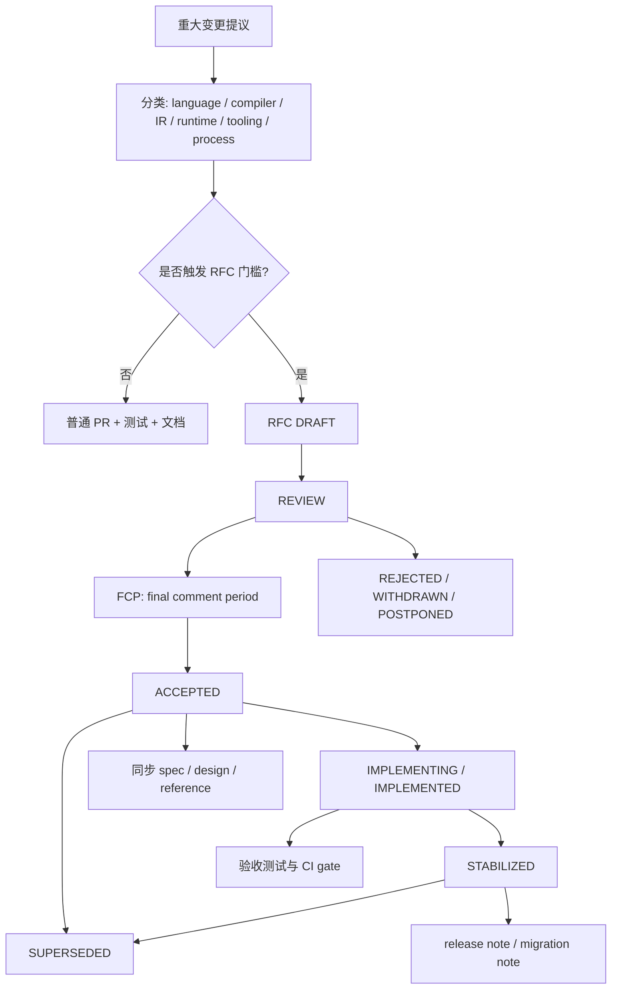
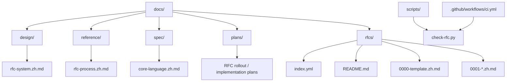
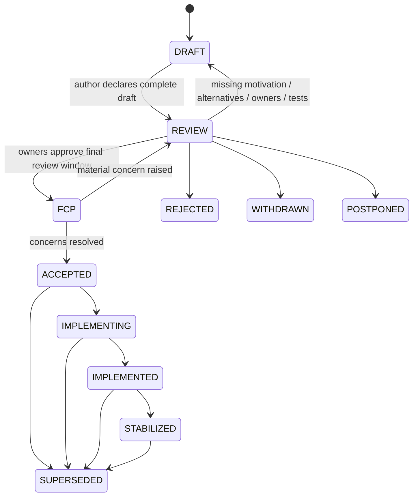
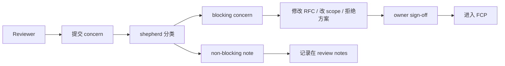

# AHFL RFC System

本文设计 AHFL 的 RFC 系统。它不是普通文档模板，而是语言、编译器、运行时与工具链重大变更的治理边界。目标是让 AHFL 的演进像成熟 PL 项目一样可审计、可执行、可回滚，并且不把关键语言决策藏在 issue、聊天记录或单个 PR 里。

本文定位为非规范性工程设计。RFC 被接受后，仍必须把规范性结果同步到 [core-language.zh.md](../spec/core-language.zh.md)、相关设计文档或 reference 文档；RFC 本身不是最终语言规范。

具体创建、评审、推进和关闭 RFC 的操作者流程，以 [rfc-process.zh.md](../reference/rfc-process.zh.md) 为准。本文只定义治理模型、状态机、门禁原则和仓库边界。

## 目标

AHFL 的 RFC 系统必须解决五个问题：

1. **设计权威**：任何影响语言语义、IR、稳定 artifact、stdlib public surface、runtime capability contract 或开发者可见诊断的变更，都必须有可追踪的设计决策。
2. **实现可验证**：RFC 必须给出可执行验收标准，不能只有愿景或自然语言偏好。
3. **责任明确**：每个 RFC 都有 author、shepherd、area owners、required reviewers 和 implementation owner。
4. **机器可检查**：编号、状态、必填字段、链接、Mermaid 图、owner 覆盖、index 同步和过期引用都要由脚本检查。
5. **状态诚实**：`ACCEPTED` 不等于已实现，`IMPLEMENTED` 不等于已稳定。状态机必须表达真实生命周期。

## 非目标

1. RFC 系统不替代 issue backlog。任务拆分仍放在 `docs/plans/` 或 issue tracker。
2. RFC 系统不冻结 immature 项目的 forward compatibility。AHFL 当前仍允许 aggressive refactoring；破坏性变更需要明确记录影响和迁移路径，但不需要为早期内部 API 保持兼容层。
3. RFC 系统不让所有小改动都流程化。拼写、内部重命名、非 public bug fix 和测试补强不需要 RFC。
4. RFC 系统不把投票当成设计质量。核心机制是 owner sign-off、concern resolution 和可执行验收，而不是简单多数。

## 总体结构



## 仓库布局

RFC 系统需要一个专门的决策记录区，同时继续遵守当前 docs taxonomy。



`docs/rfcs/` 是 RFC 决策记录区，不承载最终规范权威。它是 `docs/` taxonomy 的一个显式例外，必须由 `docs/rfcs/README.md` 和 `scripts/check-rfc.py` 约束；如果不引入机器 gate，就不要引入这个例外。

推荐落地文件：

| 路径 | 角色 |
| --- | --- |
| `docs/design/rfc-system.zh.md` | 本文：RFC 系统设计和治理模型 |
| `docs/reference/rfc-process.zh.md` | 操作手册：如何创建、评审、推进、关闭 RFC |
| `docs/rfcs/README.md` | RFC registry 入口、状态定义、owner 表、index 说明 |
| `docs/rfcs/0000-template.zh.md` | 新 RFC 模板 |
| `docs/rfcs/index.yml` | 机器可读 RFC index |
| `scripts/check-rfc.py` | RFC 结构检查器 |

## RFC 触发门槛

下列变更必须走 RFC：

| 类别 | 必须 RFC 的例子 | 可不走 RFC 的例子 |
| --- | --- | --- |
| Language semantics | grammar、type system、effect、pattern matching、name resolution、module system、verification subset | parser bug fix，不改变合法程序集合 |
| IR / ABI / artifacts | JSON IR schema、Typed HIR serialization、runtime-facing package schema、stable diagnostics code | 内部 printer formatting |
| Stdlib public surface | `std::` 新模块、prelude 暴露、`@builtin` hook、public trait/API 语义 | stdlib body bug fix，不改变 signature |
| Runtime capability contract | LLM provider contract、secret policy、capability binding ABI、streaming/tool calling semantics | 单 provider 内部重试 bug fix |
| Tooling user contract | LSP protocol behavior、formatter stable style、CLI public flags/output | 内部 telemetry 字段 |
| Process / governance | release gate、docs taxonomy、RFC process、compatibility policy | typo、索引补链 |

判断原则：

1. **用户是否能观察到行为变化**：能观察到，倾向 RFC。
2. **是否影响多模块契约**：跨 parser / sema / IR / runtime / LSP，倾向 RFC。
3. **是否需要长期记忆**：半年后仍需要知道为什么这样设计，倾向 RFC。
4. **是否可逆**：不可逆或迁移成本高，必须 RFC。

## RFC 分类

每个 RFC 必须有一个主 area，允许多个 secondary areas。

| Area | 范围 | Required owner |
| --- | --- | --- |
| `language` | grammar、type system、static semantics、verification subset | language owner |
| `compiler` | parser/frontend/resolver/typecheck/lowering pipeline | compiler owner |
| `ir` | Semantic IR、JSON IR、Typed HIR serialization、backend input contract | IR owner |
| `stdlib` | `std/`、prelude、builtin hook、surface API | stdlib owner |
| `runtime` | evaluator、runtime engine、LLM/capability provider | runtime owner |
| `tooling` | CLI、LSP、formatter、VS Code extension、diagnostics UX | tooling owner |
| `formal` | SMV/backend verification semantics | formal owner |
| `process` | release gate、RFC process、docs governance | project lead |

Area owner 不是“橡皮图章”。他们必须确认 RFC 与对应层的架构边界一致，并能指出需要的测试、迁移和文档同步。

## 编号与文件命名

新 RFC 使用全局递增四位编号，不再使用 wave-local ID。

格式：

```text
docs/rfcs/0001-short-slug.zh.md
docs/rfcs/0002-another-topic.zh.md
```

Frontmatter 只保留 canonical 编号：

```yaml
rfc: "0001"
title: "Enum variant payload forms"
status: "draft"
area: ["language", "compiler"]
created: "2026-07-02"
updated: "2026-07-02"
authors: ["..."]
shepherd: "..."
owners:
  language: "..."
  compiler: "..."
tracking_issue: "TBD"
discussion: "TBD"
implementation_prs: []
```

迁移现有 wave-local 草稿时，不应直接重命名后宣称完成。正确做法是：

1. 为每份草稿分配 `000N-*` canonical 文件名。
2. 删除旧式文件和旧式编号，不保留 redirect、alias 或兼容层。
3. 补齐 frontmatter、required sections、owner、tracking issue、状态。
4. 在 `index.yml` 中登记。
5. 修复所有活跃文档中的旧式引用。

## 状态机



状态定义：

| Status | 含义 | 不允许的误用 |
| --- | --- | --- |
| `DRAFT` | 作者正在成文，设计未准备好正式评审 | 用 DRAFT 阻塞实现但不给 review 入口 |
| `REVIEW` | 内容完整，等待 owner 和社区评审 | 还有 TBD、无测试计划、无 owner |
| `FCP` | 最终意见窗口，原则上只收 blocking concern | 用 FCP 继续大改设计 |
| `ACCEPTED` | 设计决策通过，可以实施 | 说成“已实现” |
| `IMPLEMENTING` | 实现进行中 | 无 tracking issue / PR |
| `IMPLEMENTED` | 代码、测试、文档已落库 | 说成“稳定对外承诺” |
| `STABILIZED` | 已纳入规范/参考文档和 release evidence | 跳过真实发布验证 |
| `REJECTED` | 方案被拒绝 | 删除历史记录 |
| `WITHDRAWN` | 作者撤回 | 当作技术否决 |
| `POSTPONED` | 方向可能成立，但时机不对 | 无限期假装 active |
| `SUPERSEDED` | 被后续 RFC 取代 | 保持双事实来源 |

## 阶段门禁

### DRAFT -> REVIEW

必须满足：

1. frontmatter 完整。
2. Motivation、scope、non-goals、design、alternatives、migration、test plan、rollout plan 全部存在。
3. 所有架构图使用 Mermaid。
4. 明确是否 breaking change。
5. 指定 shepherd 和 required owners。
6. 给出至少一个可执行验收命令或需要新增的测试目标。
7. `scripts/check-rfc.py` 通过。

### REVIEW -> FCP

必须满足：

1. required owners 均已 sign off。
2. 所有 blocking concerns 关闭或写入 unresolved questions。
3. 设计与现有 spec/design/reference 冲突点明确列出。
4. implementation owner 确认可实施。
5. testing owner 确认测试策略足够覆盖行为变化。

### FCP -> ACCEPTED

必须满足：

1. FCP 至少持续 5 个工作日，除非项目 lead 明确 emergency override。
2. 无未解决 blocking concern。
3. RFC 文档无 `TBD`、`TODO`、`DEFERRED` 作为验收关键字段。
4. `accepted_at`、`accepted_by`、`decision_summary` 写入 frontmatter 或 decision section。
5. 生成或更新 implementation tracking issue。

### IMPLEMENTED -> STABILIZED

必须满足：

1. 代码实现合并。
2. 对应 spec/design/reference 文档更新。
3. golden / conformance / negative diagnostics / migration tests 通过。
4. 若改变 user-facing 行为，release note 或 migration note 已写。
5. 若引入 breaking change，commit footer 或 PR 描述中有 `BREAKING CHANGE:`、影响范围和迁移指南。

## RFC 模板

每份 RFC 必须包含以下章节，顺序固定：

1. `Summary`
2. `Motivation`
3. `Goals`
4. `Non-Goals`
5. `Design`
6. `User Impact`
7. `Compatibility and Migration`
8. `Implementation Plan`
9. `Test Plan`
10. `Rollout and Stabilization`
11. `Alternatives`
12. `Open Questions`
13. `Decision History`

关键要求：

| 章节 | 必须回答的问题 |
| --- | --- |
| Summary | 一句话说清楚改变了什么 |
| Motivation | 为什么现在必须做，不做会怎样 |
| Goals | 可验证结果，不写抽象愿景 |
| Non-Goals | 明确拒绝 scope creep |
| Design | 语法、语义、数据模型、边界、错误处理 |
| User Impact | 用户代码、CLI、LSP、runtime 行为如何变化 |
| Compatibility and Migration | 是否 breaking，如何迁移 |
| Implementation Plan | parser/sema/IR/runtime/tooling/docs 分层怎么落 |
| Test Plan | 新增哪些测试，跑哪些现有测试 |
| Rollout and Stabilization | 从 flag / experimental 到 stable 的路径 |
| Alternatives | 至少两个认真考虑过的替代方案 |
| Open Questions | REVIEW 前允许，ACCEPTED 前必须清零或转 issue |
| Decision History | 记录关键变更和 owner 结论 |

## Concern-Based Review

AHFL 不采用简单投票制。评审采用 concern-based 模型：



Blocking concern 必须满足至少一项：

1. 违反 AHFL 核心设计原则，例如字符串身份、继承式 AST、无 SourceRange 诊断。
2. 与现有 spec 或已接受 RFC 冲突。
3. 缺少可执行验证路径。
4. 会破坏 runtime / IR / LSP / stdlib contract 但 migration plan 不充分。
5. 方案复杂度明显超过收益，且 alternatives 未充分评估。

非 blocking note 可以记录，但不能无限阻塞 RFC。

## 与现有文档的关系

RFC 不是最终事实来源。接受后的同步规则：

| RFC 类型 | 接受后必须同步 |
| --- | --- |
| language | `docs/spec/core-language.zh.md` |
| formal | `docs/spec/assurance.zh.md`、formal backend design |
| compiler / IR | `docs/design/compiler-architecture.zh.md`、IR/reference docs |
| stdlib | corelib design/reference/cookbook |
| runtime | runtime architecture/reference/user guide |
| tooling | CLI/LSP/reference docs |
| process | `docs/README.md`、contributor guide、CI docs |

如果 RFC 内容和 spec 冲突，`ACCEPTED` 阶段可以暂时记录冲突；`STABILIZED` 阶段必须消除冲突。否则状态必须停在 `IMPLEMENTED` 或更早。

## 机器检查

`scripts/check-rfc.py` 至少检查：

| 检查项 | 规则 |
| --- | --- |
| 文件名 | `NNNN-kebab-slug.zh.md`，编号唯一且递增 |
| frontmatter | 必填字段完整，status 合法，日期 ISO 格式 |
| index | `docs/rfcs/index.yml` 与文件集合一致 |
| section order | 模板章节存在且顺序正确 |
| owner coverage | area 对应 required owner 不为空 |
| status gates | REVIEW/FCP/ACCEPTED/IMPLEMENTED/STABILIZED 满足字段约束 |
| Mermaid | 所有图用 fenced `mermaid`，禁止 ASCII architecture diagram |
| links | 相对链接存在，禁止机器本地绝对路径 |
| stale markers | ACCEPTED 之后禁止关键字段存在 `TBD` / `TODO` |
| wave-local refs | 旧式 ID 必须替换为 canonical RFC |

CI 推荐新增独立 job：

```yaml
rfc-check:
  name: RFC Check
  runs-on: ubuntu-24.04
  steps:
    - uses: actions/checkout@v4
    - run: python3 scripts/check-rfc.py
```

## PR 与标签规则

RFC PR 使用标签：

| 标签 | 含义 |
| --- | --- |
| `rfc` | RFC 文档变更 |
| `rfc:language` / `rfc:compiler` / ... | area |
| `rfc:draft` / `rfc:review` / ... | 目标状态 |
| `breaking-change` | 影响用户或稳定 artifact 的破坏性变更 |
| `needs-owner-signoff` | owner 未全签 |
| `needs-test-plan` | 验收测试不足 |

实现 PR 必须引用 RFC：

```text
Implements: RFC-0007
Status: implementing -> implemented
```

若实现偏离 RFC，必须二选一：

1. 更新 RFC 并重新进入 REVIEW/FCP。
2. 在实现 PR 中明确记录 deviation，由 area owner 批准，并在后续 RFC 中修正设计。

## Breaking Change 政策

AHFL 仍处于快速演进阶段，允许 breaking change，但必须显式化。

RFC 中必须有：

1. 影响范围：source language、IR、runtime artifact、CLI、LSP、stdlib、diagnostics。
2. 迁移方式：自动化、机械替换、手工迁移或不可迁移。
3. 验收方式：旧行为如何被测试删除，新行为如何被测试覆盖。
4. release note 摘要。

不接受“当前没人用所以不写迁移说明”。即便不维护前向兼容，也要维护决策可理解性。

## 稳定性等级

每个 RFC 必须声明目标稳定性：

| Stability | 含义 |
| --- | --- |
| `experimental` | 可快速破坏，默认不承诺兼容 |
| `internal` | 只供编译器/测试内部消费 |
| `developer-facing` | CLI/LSP/diagnostics 可见，但仍可随 minor 调整 |
| `stable-language` | 语言规范或用户代码依赖 |
| `stable-artifact` | machine-facing artifact / schema / IR 依赖 |

`stable-language` 和 `stable-artifact` 进入 `STABILIZED` 前必须有 conformance 或 golden gate。

## 与实现计划的分离

RFC 回答“应不应该这样设计”。Plan 回答“谁在什么时候做哪些 PR”。

推荐拆分：

1. RFC: `docs/rfcs/0007-try-operator.zh.md`
2. Spec update: `docs/spec/core-language.zh.md`
3. Design update: `docs/design/frontend-lowering-architecture.zh.md`
4. Plan: `docs/plans/try-operator-rollout.zh.md`
5. Tests: parser/sema/IR/runtime/LSP 对应目标

如果一个 RFC 同时包含 20 个 implementation tickets，应该把 tickets 移到 plan 或 issue tracker。

## 现有 RFC 草稿迁移路径

当前仓库曾有未纳入 taxonomy/index 的 wave-local 草稿。建议按三阶段迁移：

### Phase 0: 建立治理骨架

1. 创建 `docs/rfcs/README.md`、`0000-template.zh.md`、`index.yml`。
2. 创建 `scripts/check-rfc.py`。
3. CI 接入 `rfc-check`。
4. `docs/README.md` 增加 RFC registry 说明。

验收：空 registry + template 能通过 checker。

### Phase 1: 导入现有草稿

1. `0001-enum-variant-payload.zh.md`
2. `0002-optional-narrowing.zh.md`
3. `0003-match-exhaustiveness-diagnostics.zh.md`
4. `0004-native-grpc-transport.zh.md`

每份都删除旧式 ID，补齐 required owners 和 open questions。

验收：checker 通过，所有旧链接更新或 redirect。

### Phase 2: 强制执行

1. CI 阻止不合规 RFC。
2. PR template 要求重大变更填写 `RFC: N/A` 或 `RFC-XXXX`。
3. 对 language / IR / stdlib / runtime stable artifact 改动，如果 `RFC: N/A`，reviewer 必须确认未触发 RFC 门槛。

验收：新增重大变更不能绕过 RFC 解释。

## 成功标准

RFC 系统落地后，应满足：

1. 任意 language/IR/runtime 重大变更都能在 30 秒内找到对应 RFC 或明确的 `RFC: N/A` 解释。
2. `ACCEPTED` RFC 不存在 owner 为空、测试计划为空或 open question 未处理的情况。
3. `IMPLEMENTED` RFC 能链接到实现 PR、测试证据和文档同步。
4. `STABILIZED` RFC 与 spec/reference 不冲突。
5. checker 在本地和 CI 中都能稳定运行。
6. 现有 wave-local RFC ID 全部迁移到 canonical 编号。

## 设计结论

AHFL 的 RFC 系统应当是“轻量入口、严格出口”：

1. 写 DRAFT 应该容易，避免阻止早期设计讨论。
2. 进入 REVIEW 必须完整，避免评审者替作者补设计。
3. 进入 ACCEPTED 必须有 owner 签核和可执行验收。
4. 进入 STABILIZED 必须有代码、测试、文档和 release evidence。
5. 任何无法被机器检查的治理规则，都应被视为建议而不是 gate；真正的 gate 必须进入 `scripts/check-rfc.py` 和 CI。

这套系统的核心不是增加流程，而是保护 AHFL 的语言一致性：让每个重大设计决定都有上下文、有取舍、有验收、有归档，并且能被未来维护者信任。
