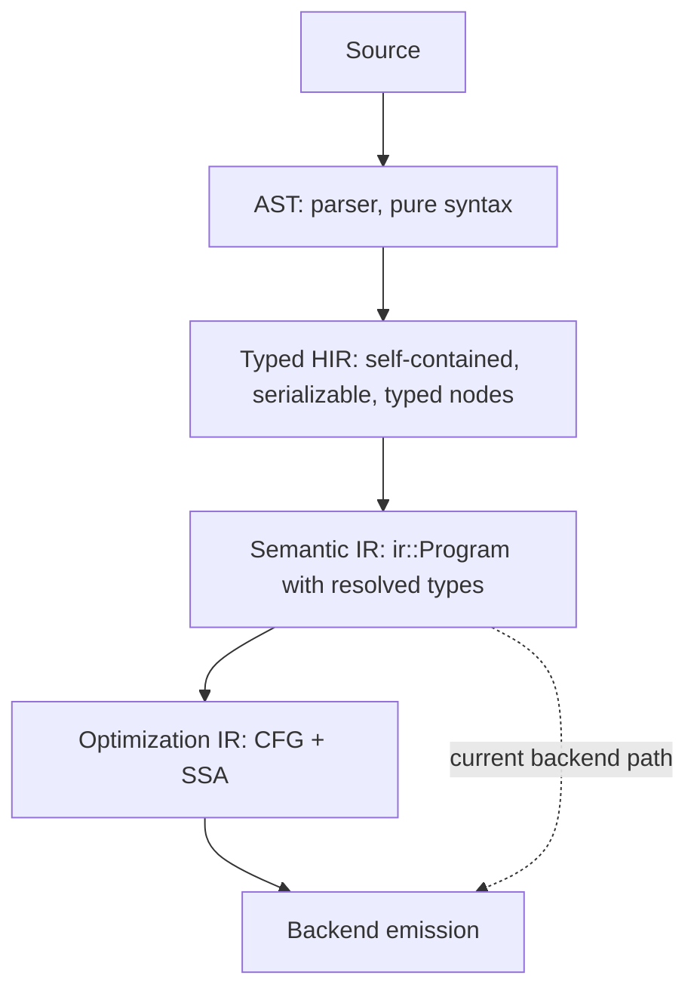

# AHFL IR 架构演进计划

| 项目 | 内容 |
|------|------|
| 文档类型 | plan |
| 状态 | implemented / tracking v0.2 backlog |
| 版本 | v0.1 |
| 目标模块 | `include/ahfl/compiler/ir/`、`include/ahfl/compiler/semantics/typed_hir.hpp`、`src/compiler/ir/`、`src/compiler/semantics/` |
| 前置完成 | T1.8 声明级 typed-store 迁移 |
| 当前审计日期 | 2026-06-13 |

---

## 零、当前结论

本轮已经把原计划中的 A/B/C/D/E/F 主体实现落到代码与 CTest。此前遗留的 **D-2 enum singleton narrowing** 与 **E-1 全量 `ExprRef` 权威化** 已完成：类型系统新增 `EnumVariantT`，分支内 enum 值可收窄到 variant singleton；Backend IR 表达式不再由嵌套 owning pointer 树持有，而由 `Program::expr_arena` 的 chunked bump arena 统一分配，IR 节点字段保存 `ExprRef` handle。

| 阶段 | 当前状态 | 代码证据 | 剩余事项 |
|------|----------|----------|----------|
| Phase A：Backend IR 增强 | 已完成 | `Expr::resolved_type`、`SymbolRef::id`、无 `GroupExpr`、`TypeRef::source_range`、`VisitAction` visitor | 无 |
| Phase B：Typed HIR 自包含化 | 已完成 | `TypedDeclPayload`、`declaration_info.hpp`、`lower_typed_program(const TypedProgram&)`、`typed_hir_serialization.hpp` | 无 |
| Phase C：TypeChecker 性能修正 | 已完成 | `TypedProgram` expression index、`FlowFacts` hash map、source-id 缓存 | 无 |
| Phase D：类型系统增强 | 已完成 | 容器 variance、Int→Decimal、Decimal scale、`EnumVariantT`、`IsVariant` / `IsNotVariant` narrowing | 无 |
| Phase E：IR 内存布局优化 | 已完成 | `ExprArena` chunked bump allocator、`ExprRef`、`Expr::id`、`Statement::id`、`DeclarationProvenance::id` | 无 |
| Phase F：Optimization IR 层 | 已完成首版 | `ir::opt::OptProgram`、`lower_to_opt`、constant/copy/dead-store passes、CLI `--optimize` 接入 | Opt IR 当前作为独立优化层；未改变既有后端输出路径 |

## 一、原始审计发现

本节保留制定计划时的原始问题背景；实际完成情况以“零、当前结论”和各任务状态为准。

### 1.1 原始管线结构


| 层 | 数据结构 | 自包含 | 类型信息 | 布局 | 序列化 |
|----|----------|--------|----------|------|--------|
| AST | 树（Owned 指针） | 是 | 无 | 散装堆 | 否 |
| Typed HIR | Flat vectors + index | 原始为否；现已自包含 | 每 expr 有 TypePtr | 连续 vector | 现已支持 JSON round-trip |
| Backend IR | Arena-owned `ExprRef` 图 + flat expr index | 是 | 现已保留 `resolved_type` | chunked bump arena + handle | 是 |

### 1.2 对标业界

| 实践 | Rust (HIR→THIR→MIR→LLVM) | Swift (SIL) | MLIR | AHFL 现状 |
|------|--------------------------|-------------|------|-----------|
| 每层自包含 | ✅ MIR 不引用 AST | ✅ SIL 独立 | ✅ Dialect 独立 | ✅ Typed HIR 已移除 AST/TypeCheckResult 裸指针 |
| 类型贯穿 | ✅ MIR 每个 Place 有 Ty | ✅ SILValue 有 SILType | ✅ Value 有 Type | ✅ Backend IR 表达式已有 `resolved_type` |
| SSA/CFG 优化层 | ✅ MIR | ✅ SIL | ✅ 可选 | ✅ 已有首版 Opt IR |
| Arena/Flat 布局 | ✅ IndexVec | — | ✅ | ✅ `ExprArena` 为权威所有者，IR 边使用 `ExprRef` |
| Numeric ID 引用 | ✅ Local(u32) | ✅ | ✅ | ✅ SymbolRef / Expr / Statement / Decl 已有 numeric ID |

### 1.3 发现的具体问题

**Type Checker：**

| 编号 | 问题 | 影响 | 位置 |
|------|------|------|------|
| TC-1 | `append_typed_child` O(n) 线性扫描 expressions vector | 大程序 O(n²) | typecheck.cpp:72-103 |
| TC-2 | `FlowFacts::has_fact` O(n) 线性扫描 | 深嵌套 if 退化 | flow_facts.hpp:33-40 |
| TC-3 | `source_unit_for` O(n) 线性扫描 source files | 多文件项目每声明触发 | typecheck.cpp:561-573 |
| TC-4 | `TypeCheckResult` back-pointer 维护脆弱 | move-from 后悬空 | typecheck.hpp:334-370 |
| TC-5 | 容器类型子类型关系 invariant（无协变） | 用户可能期望 `List<Dog> <: List<Animal>` | type_relations.cpp:505-509 |
| TC-6 | 数值提升有限：仅 Int→Float | 无 Int→Decimal、Decimal scale 互操作 | type_relations.cpp:534 |
| TC-7 | 条件 narrowing 仅 IsNone/IsNotNone | 无 enum variant、type test narrowing | condition_facts.hpp |

**Backend IR：**

| 编号 | 问题 | 影响 | 位置 |
|------|------|------|------|
| IR-1 | 表达式无类型标注 | Pass 无法做 type-aware 分析 | expr.hpp:180 |
| IR-2 | 非 SSA、无 CFG、无 use-def | 无法做经典 dataflow 优化 | expr.hpp 全文 |
| IR-3 | 表达式 owning pointer 树 → 散装堆分配 | cache locality 差 | 原 Backend IR 表达式边 |
| IR-4 | SymbolRef 仅 string identity | 查找 O(name_len)，无 O(1) handle | types.hpp:146-151 |
| IR-5 | TypeRef 无 source range | 类型错误诊断无法指向注解位置 | types.hpp:157-165 |
| IR-6 | GroupExpr 保留到 IR | 增加无意义 visitor 分支 | expr.hpp:153 |
| IR-7 | Visitor 无 pre/post、无 skip/abort | 限制 pass 灵活性 | visitor.hpp:7-49 |
| IR-8 | IR 节点无 stable numeric ID | 无法构建高效外部引用 | 全文 |

**Typed HIR：**

| 编号 | 问题 | 影响 | 位置 |
|------|------|------|------|
| TH-1 | 持有 `ast_program*`、`resolve_result*` 裸指针 | 不可独立消费、不可序列化 | typed_hir.hpp:268-271 |
| TH-2 | `TypedDecl` 只有骨架，声明数据分散在 TypeEnvironment | 消费者需查多个 store | typed_hir.hpp:177-191 |
| TH-3 | 表达式/block/temporal bridge 仍需 AST 节点做 .range 载体 | 不能完全脱离 AST | typed_hir_lower.cpp 注释 |

---

## 二、演进目标



---

## 三、任务分解

### Phase A：Backend IR 增强（短期，高 ROI）

#### A-1：IR 表达式加类型标注

**当前状态**：已完成。`ir::Expr` 已携带 `resolved_type`，JSON 输出已包含表达式类型。

**目标**：`ir::Expr` 增加 `TypeRef resolved_type` 字段，lowering 时从 TypedExpr 填充。

**变更范围**：
- `include/ahfl/compiler/ir/expr.hpp`: `Expr` 结构体加字段
- `src/compiler/ir/typed_hir_lower.cpp`: 表达式 lowering 时填充 `resolved_type`
- `src/compiler/ir/ir_print.cpp` / `ir_json.cpp`: 序列化输出（可选）
- Pass Manager 变换 pass 在 rewrite 后维护类型一致性

**验收**：全量 golden 测试通过；新增测试验证 lowered expr 携带正确类型。

**优先级**：P0 | **预估**：0.5d

#### A-2：SymbolRef 加 numeric ID

**当前状态**：已完成。`ir::SymbolRef` 已携带 numeric `id`，`ProgramIndex` 已优先支持 ID lookup。

**目标**：`ir::SymbolRef` 增加 `std::optional<std::size_t> id` 字段，lowering 时从 SymbolId 填充。保留 `canonical_name` 作为序列化 fallback。

**变更范围**：
- `include/ahfl/compiler/ir/types.hpp`: 加字段
- `src/compiler/ir/typed_hir_lower.cpp`: `symbol_ref_from_symbol` 填充 id
- `include/ahfl/compiler/ir/program.hpp`: `ProgramIndex` 利用 numeric id 做 O(1) lookup

**验收**：全量测试通过；ProgramIndex lookup 提速。

**优先级**：P1 | **预估**：0.5d

#### A-3：删除 GroupExpr

**当前状态**：已完成。IR `ExprNode` variant 已不包含 `GroupExpr`，括号表达式在 lowering 中展开。

**目标**：lowering 时展开 `GroupExpr`，IR 中不再出现纯括号节点。

**变更范围**：
- `src/compiler/ir/typed_hir_lower.cpp`: `visit_group` 直接返回 inner expr 的 lowering 结果
- `include/ahfl/compiler/ir/expr.hpp`: 从 `ExprNode` variant 删除 `GroupExpr`
- 所有 visitor/pass 删除 GroupExpr 分支

**验收**：全量测试通过（golden 输出中 Group 消失）；编译无 -Wswitch 警告。

**优先级**：P1 | **预估**：0.5d

#### A-4：TypeRef 加 source range

**当前状态**：已完成。`ir::TypeRef` 已有 `source_range`，类型语法路径会传播 range。

**目标**：`ir::TypeRef` 增加 `std::optional<SourceRange> source_range` 字段。

**变更范围**：
- `include/ahfl/compiler/ir/types.hpp`: 加字段
- `src/compiler/ir/typed_hir_lower.cpp`: `type_ref_from_type` / `type_ref_from_syntax` 传播 range

**验收**：全量测试通过。

**优先级**：P2 | **预估**：0.3d

#### A-5：Visitor 增强（pre/post hook + VisitAction）

**当前状态**：已完成。Visitor 已支持 `VisitAction{Continue, Skip, Abort}` 与 pre/post 风格遍历控制，并有覆盖测试。

**目标**：`ProgramVisitor` 支持 `on_expr_pre`/`on_expr_post` 双阶段回调，`on_*` 返回 `VisitAction{Continue, Skip, Abort}`。

**变更范围**：
- `include/ahfl/compiler/ir/visitor.hpp`: 定义 `VisitAction`，重构 visitor 接口
- `src/compiler/ir/visitor.cpp`: 实现 action-based 递归控制
- 现有 pass 适配新接口

**验收**：现有 pass 行为不变；新增测试验证 Skip/Abort 语义。

**优先级**：P2 | **预估**：1d

---

### Phase B：Typed HIR 自包含化（中期）

#### B-1：TypedDecl 合并声明结构数据

**当前状态**：已完成。`TypedDeclPayload` 已覆盖 module/import/const/type alias/struct/enum/capability/predicate/agent/contract/flow/workflow 的结构化信息。

**目标**：将 `TypeEnvironment` 中 `StructTypeInfo`、`AgentTypeInfo` 等声明数据嵌入 `TypedDecl`，使 `TypedProgram` 单一结构即可提供所有语义信息。

**变更范围**：
- `include/ahfl/compiler/semantics/typed_hir.hpp`: `TypedDecl` 增加 variant payload（或 `std::any`）
- `src/compiler/semantics/typecheck_decls.cpp`: 构建 TypedDecl 时同步填充
- `src/compiler/ir/typed_hir_lower.cpp`: 从 `TypedDecl` 读声明数据（替代 `environment().get_xxx()`）

**验收**：全量测试通过；IR lowerer 不再直接查 `TypeEnvironment`（仅查 `TypedProgram`）。

**优先级**：P1 | **预估**：2d

#### B-2：去除 AST 裸指针依赖

**当前状态**：已完成。`TypedProgram` 已移除 AST / ResolveResult / TypeCheckResult 裸指针，新增 `lower_typed_program(const TypedProgram&)` 作为 AST-free lowering 入口。

**目标**：`TypedProgram` 不再持有 `ast_program*`、`resolve_result*`、`type_check_result*`。所有必要数据内化。

**变更范围**：
- `include/ahfl/compiler/semantics/typed_hir.hpp`: 删除指针字段
- 表达式/block/temporal bridge 改为 range-based lookup（不需要 AST 节点引用）
- 影响 LSP（目前通过 `typed_program.ast_program` 获取 source text）

**前置**：B-1 完成

**验收**：`TypedProgram` 可独立存在（无 AST 生命周期依赖）。

**优先级**：P2 | **预估**：1.5d

#### B-3：TypedProgram 序列化支持

**当前状态**：已完成。Typed HIR JSON snapshot 支持 serialize / deserialize / index rebuild，并有 round-trip 测试。

**目标**：`TypedProgram` 可序列化到磁盘 / 从磁盘加载，支持 LSP 增量缓存。

**前置**：B-2 完成

**验收**：round-trip 测试（serialize → deserialize → 与原始 TypedProgram 等价）。

**优先级**：P3 | **预估**：2d

---

### Phase C：TypeChecker 性能修正（短期）

#### C-1：append_typed_child reverse index

**当前状态**：已完成。`TypedProgram` 维护 expression node-id 索引，child append 不再依赖全量线性扫描。

**目标**：为 `TypedProgram::expressions` 建 `node_id → vector_index` 反向索引，`append_typed_child` 从 O(n) 降为 O(1)。

**变更范围**：
- `include/ahfl/compiler/semantics/typed_hir.hpp`: 加 `std::unordered_map<uint64_t, uint32_t> expr_node_id_index_`
- TypeChecker 构建 expressions 时维护索引

**验收**：全量测试通过；大文件 typecheck 时间不退化。

**优先级**：P0 | **预估**：0.3d

#### C-2：FlowFacts 换 hash map

**当前状态**：已完成。`FlowFacts` 已使用 `unordered_map<Place, vector<TypeFact>>`，并支持 variant / not-variant fact 查找。

**目标**：`FlowFacts` 从 `vector<Fact>` 换成 `unordered_map<Place, vector<TypeFact>>`，`has_fact` O(1)。

**变更范围**：
- `include/ahfl/compiler/semantics/flow_facts.hpp`
- `src/compiler/semantics/flow_facts.cpp`

**验收**：全量测试通过。

**优先级**：P1 | **预估**：0.3d

#### C-3：source_unit_for 加缓存/索引

**当前状态**：已完成。TypeChecker 已维护 source id lookup 缓存，避免多文件声明定位重复线性扫描。

**目标**：为 SourceGraph 建 `range → SourceId` 索引，消除线性扫描。

**变更范围**：
- `src/compiler/semantics/typecheck.cpp`: `source_unit_for` 使用索引

**验收**：多文件 typecheck 不退化。

**优先级**：P2 | **预估**：0.3d

---

### Phase D：类型系统增强（中期）

#### D-1：容器协变 / readonly 注解

**当前状态**：关系层已完成，语言语法层未新增 readonly 修饰符。当前实现支持只读语义下的容器 variance：`List<T>`/`Set<T>` 元素协变，`Map<K,V>` key invariant、value covariant。

**目标**：在子类型关系中支持 `List<+T>` 协变（只读视图 covariant），`Map<K, +V>` covariant on value。

**变更范围**：
- `include/ahfl/compiler/semantics/type_relations.hpp`: 新增 variance 参数
- `src/compiler/semantics/type_relations.cpp`: `subtype_impl` 递归时区分 covariant/invariant/contravariant position
- 文档化协变策略

**前置**：语言规范决定是否引入 readonly 修饰符

**优先级**：P2 | **预估**：2d

#### D-2：Enum variant narrowing

**当前状态**：已完成。`extract_condition_facts` 已识别 `x == Enum::Variant`、`Enum::Variant == x`、`x != Enum::Variant`，并产生 `IsVariant` / `IsNotVariant` true/false 边事实；类型系统新增 `types::EnumVariantT` singleton variant type，typecheck 在 flow facts 命中时把 enum 本体收窄为具体 variant。二值 enum 的 `x != Enum::Variant` then 分支会在只剩一个候选时收窄到剩余 variant。

**目标**：`if (x == Enum.Variant)` 后在 then 分支中把 `x` 的类型收窄。

**变更范围**：
- `include/ahfl/compiler/semantics/types.hpp`: 新增 `TypeKind::EnumVariant` / `types::EnumVariantT`
- `include/ahfl/compiler/semantics/type_context.hpp`: 新增 interned enum variant type factory
- `include/ahfl/compiler/semantics/flow_facts.hpp`: 新增 `TypeFactKind::IsVariant` / `IsNotVariant`
- `src/compiler/semantics/typecheck.cpp`: 识别 enum 比较并在 `check_path` / `check_member_access` 应用 narrowing
- `src/compiler/semantics/type_relations.cpp`: 支持 `EnumVariantT <: EnumT`
- `src/compiler/semantics/typed_hir_serialization.cpp`: enum variant type JSON round-trip
- `src/compiler/ir/ir_lower.cpp`、`src/compiler/ir/typed_hir_lower.cpp`、`src/compiler/ir/ir_json.cpp`: IR type ref 携带 `variant_name`

**优先级**：P2 | **预估**：1d

#### D-3：数值提升扩展（Int→Decimal、Decimal scale 互操作）

**当前状态**：已完成。类型关系已支持 `Int <: Decimal` 和 decimal scale widening。

**目标**：在子类型关系中允许 `Int <: Decimal(any_scale)` + `Decimal(s1) <: Decimal(s2) where s2 >= s1`。

**变更范围**：
- `src/compiler/semantics/type_relations.cpp`: `subtype_impl` 新增 Decimal 规则

**优先级**：P3 | **预估**：0.5d

---

### Phase E：IR 内存布局优化（长期）

#### E-1：表达式 Arena 分配

**当前状态**：已完成。`ExprArena` 现在是 `Program` 内表达式节点的权威所有者，使用 chunked bump allocator 分配 `Expr` 并通过 flat index 暴露 `ExprRef`。Backend IR、visitor、passes、SMV backend、runtime evaluator、Opt IR lowering 和测试辅助构造均已迁移到 `ExprRef`；仓库代码中已不再保留旧表达式指针 API。

**目标**：用 arena allocator 替代 per-expression owning pointer，所有 `Expr` 由 `Program::expr_arena` 的 chunked arena 统一分配并以 index handle 引用。

**变更范围**：
- 引入 `ExprArena` (bump allocator + `ExprRef` = index)
- `ir::Program` 持有 arena，所有表达式边改为 `ExprRef`
- 所有 visitor/pass 适配 arena-based 引用

**验收**：`cmake --build --preset build-dev` 与 `ctest --preset test-dev --output-on-failure` 通过；`ahfl.ir.identity_visitor` 断言 `ExprRef.index` 可回查到 `Program::expr_arena` 中的同一节点。

**优先级**：P3 | **预估**：3d

#### E-2：IR 节点 stable numeric ID

**当前状态**：已完成首版。`Expr`、`Statement`、顶层声明 provenance 均在 lowering 时分配 monotonic `uint32_t` ID。

**目标**：每个 `Expr`、`Statement`、`Decl` 在 lowering 时分配 monotonic `uint32_t` ID，支持高效外部引用。

**前置**：E-1（arena 天然提供 index-based ID）

**优先级**：P3 | **预估**：1d

---

### Phase F：Optimization IR 层（远期，按需）

#### F-1：CFG + SSA 表示

**当前状态**：已完成首版。已新增 `ir::opt::OptProgram` / `OptFunction` / `BasicBlock` / `Local` / `Terminator`。

**目标**：在 Semantic IR 下方引入 Control Flow Graph + Static Single Assignment 层，支持经典 dataflow 分析。

**结构设计**（参考 Rust MIR）：
```mermaid
flowchart TD
    OptProgram[OptProgram] --> OptFunction[OptFunction per state handler or workflow node]
    OptFunction --> BasicBlock[BasicBlock array]
    BasicBlock --> OptStatement[Statement array: assign / storage live / storage dead]
    BasicBlock --> Terminator[Terminator: goto / switch / return / call / assert]
    OptFunction --> Local[Local array: SSA variables with types]
    OptFunction --> SourceScope[SourceScope array]
    OptProgram --> TypeTable[TypeTable: interned types for O(1) comparison]
```

**前置**：A-1（IR 表达式有类型）、B-1（Typed HIR 自包含）

**优先级**：P3 | **预估**：10d+

#### F-2：Lowering pass (Semantic IR → Optimization IR)

**当前状态**：已完成首版。`lower_to_opt(const ir::Program&)` 会把 flow state handler 降到 OptFunction / BasicBlock / SSA locals。

**目标**：statement 序列 → basic blocks + terminators；expressions → SSA values；let bindings → locals。

**优先级**：P3 | **预估**：5d

#### F-3：基础 dataflow 优化

**当前状态**：已完成首版。已实现 constant propagation、dead store elimination、copy propagation，并接入 CLI `--optimize` 路径做 Opt IR pipeline 执行。

**目标**：在 Optimization IR 上实现 constant propagation、dead store elimination、copy propagation。

**优先级**：P3 | **预估**：5d

---

## 四、优先级总览与执行结果

| 优先级 | 任务 | 当前结果 |
|--------|------|----------|
| **P0** | C-1 append_typed_child reverse index | 已完成 |
| **P0** | A-1 IR 表达式加类型标注 | 已完成 |
| **P1** | A-2 SymbolRef 加 numeric ID | 已完成 |
| **P1** | A-3 删除 GroupExpr | 已完成 |
| **P1** | C-2 FlowFacts hash map | 已完成 |
| **P1** | B-1 TypedDecl 合并声明数据 | 已完成 |
| **P2** | A-4 TypeRef 加 source range | 已完成 |
| **P2** | A-5 Visitor pre/post + VisitAction | 已完成 |
| **P2** | B-2 去除 AST 裸指针 | 已完成 |
| **P2** | C-3 source_unit_for 索引 | 已完成 |
| **P2** | D-1 容器协变 | 关系层已完成；readonly 语法未引入 |
| **P2** | D-2 Enum variant narrowing | 已完成；fact 提取 + `EnumVariantT` singleton narrowing |
| **P3** | B-3 TypedProgram 序列化 | 已完成 |
| **P3** | D-3 数值提升扩展 | 已完成 |
| **P3** | E-1 表达式 Arena 分配 | 已完成；`ExprArena` 权威所有权 + `ExprRef` |
| **P3** | E-2 IR 节点 stable numeric ID | 已完成首版 |
| **P3** | F-* Optimization IR | 已完成首版；尚无回降 Semantic IR |

**推荐执行波次**：

1. **Wave 1**（P0）：已完成。
2. **Wave 2**（P1）：已完成。
3. **Wave 3**（P2）：已完成；D-2 已从 fact 层推进到类型层 singleton narrowing。
4. **Wave 4**（P3）：已完成；B-3、D-3、E-1、E-2、F-* 均已落地，F 层作为独立 Opt IR 首版存在。

---

## 五、设计约束

1. **可验证迁移**：AHFL 仍是不成熟项目，不维护前向兼容；破坏性重构必须用 golden / CTest / JSON round-trip 证明行为迁移结果。
2. **渐进式**：每个 task 独立可验收，不依赖后续 task 完成。
3. **优化层隔离**：Phase F 可先作为独立分析/优化 IR 落地；在没有 Semantic IR 回降前，不改变 backend emission 结果。
4. **类型贯穿原则**：任何新增 IR 层都必须让每个值/表达式携带类型信息。
5. **自包含原则**：每层 IR 必须可独立序列化/遍历，不依赖前序阶段的运行时状态。

---

## 六、验收标准

- 每个 task 完成后：全量 golden 测试通过 + 新增覆盖测试
- Wave 1 完成后：Typed HIR → IR lowering 中的 `append_typed_child` 不再是热点；IR 表达式携带类型
- Wave 2 完成后：`TypedProgram` 可作为 IR lowerer 的唯一输入（不查 TypeEnvironment）；SymbolRef 有 O(1) ID
- Wave 3 完成后：`TypedProgram` 可序列化；Visitor 支持灵活遍历控制
- Wave 4 完成后：存在 CFG+SSA 层，可做 dataflow 优化；Backend IR 表达式由 `ExprArena` 权威持有并通过 `ExprRef` 引用

---

## 七、后续工作清单（v0.2+）

本节记录 v0.1 完成后的下一阶段工作。它们不是 A/B/C/D/E/F 的遗留未完成项，而是基于当前三层 IR 体系继续生产化、统一化和可验证化所需的新任务。

### 7.0 完成结论

截至 2026-06-13，A/B/C/D/E/F 主体和 G-1/G-2/G-3/G-4/G-5/H-1/H-2/H-3/I-1/I-2/I-3/J-1/J-2/K-1 当前阶段已经落地；可执行清单 T-1 至 T-12 已全部闭环。长期 reference/design/spec 文档已同步本轮核心事实，并新增 `ahfl.docs.ir_sync_gate` 作为 IR 文档同步门禁。

当前完成状态如下：

1. **Opt IR 覆盖与可观测性**：`lower_to_opt` 已能为 contract 普通 clause、contract temporal embedded expression、workflow node input、workflow return、workflow safety/liveness embedded expression 生成 OptFunction；非 embedded temporal atom 会输出 `skipped_temporal` 记录；专项单元测试、文本 Opt IR golden、`AHFL_OPT_IR_V1` JSON golden 和目标 CTest 已覆盖。
2. **Opt IR 生产路径二阶段决策**：继续 artifact-only。普通 backend 仍消费 Semantic IR；`--optimize` 对普通 backend 路径只运行 Semantic IR passes，不回降 Opt IR，也不让 backend 隐式直连 Opt IR。未来若要改变，必须新增显式 Opt 回降或 backend 直连设计。
3. **IR 模型一致性**：`PathRootKind` 已统一到 Identifier/Input/Context/Output/State/Local；普通 expression 由 `ExprArena` / `ExprRef` 权威持有；statement / temporal 明确保持 owning tree，不引入 `StatementRef` / `TemporalRef`。
4. **Derived analysis freshness**：`Program::analysis_revision` 与 `AnalysisBundle::source_program_revision` 建立 freshness contract；pass 可声明 required / invalidated derived analyses；`emit_backend` 发射前统一 ensure；verifier 能发现 stale analysis bundle。
5. **安全网与性能基线**：已补 `verify_ir_program`、`verify_opt_program`、mutation safety tests 和 `ahfl.bench.ir_pipeline` smoke benchmark。
6. **Typed HIR cache**：新增 `AHFL_TYPED_HIR_CACHE_V1` cache envelope，能区分 schema/source/content/resolver/invalid payload 失效。
7. **文档门禁**：`scripts/check-ir-doc-sync.py` / `ahfl.docs.ir_sync_gate` 检查 IR 长期文档、README 索引、Opt IR JSON、Typed HIR cache、analysis freshness、artifact-only 决策和 Mermaid 架构图要求。
8. **readonly 决策**：当前不引入 `readonly` 源码语法，也不在 AST、Typed HIR、Semantic IR `TypeRef` 或 JSON IR 中新增 readonly bit。容器 variance 保持为类型关系层规则：`Optional/List/Set` 元素协变，`Map` key invariant、value covariant。

因此，本 v0.1 演进计划内已无剩余未完成项。后续只保留重新评估触发条件：新增 backend 要消费 Opt IR、语言规范决定引入 readonly、或 IR/Typed HIR/backend contract 出现新的公共边界。

### 7.1 优先级总览

| 优先级 | 任务 | 当前缺口 | 目标结果 |
|--------|------|----------|----------|
| **P0** | G-1 Opt IR 生产路径决策 | 已完成二阶段决策：继续 artifact-only；普通 backend 仍消费 Semantic IR，`--optimize` 不回降 Opt IR，不隐式直连 backend | 后续若要改变 backend 输出，必须单独实现 Opt IR 回降或显式 backend 直连 |
| **P0** | G-2 Opt IR 可观测输出 | 已完成：新增 `emit opt-ir` 文本 artifact 与 `emit opt-ir-json` / `AHFL_OPT_IR_V1` JSON artifact，并覆盖原始/`-O` golden | 后续新增 Opt IR 字段必须同步文本、JSON、golden 和 reference docs |
| **P1** | G-3 Opt IR lowering 覆盖扩展 | 已完成：专项单元测试、workflow safety/liveness golden、`skipped_temporal` 记录和目标 CTest 均已覆盖 | 后续若扩展新 temporal atom，再沿用 function / skipped fragment 双路径 |
| **P1** | G-4 Opt IR 类型与 source fidelity | Flow state handler 已完成首版：locals/rvalues/statements/terminators/function source 和 input/ctx/output 参数类型已贯穿 | Workflow/contract lowering 扩展时必须沿用同一 fidelity 规则 |
| **P1** | H-1 Path root 语义统一 | 已完成：Semantic IR `PathRootKind` 已扩展为 Identifier/Input/Context/Output/State/Local，Typed HIR path root kind 可序列化并贯穿 lowering / JSON / printer / runtime / Opt lowering | 后续新增 path root 必须同步 typed HIR serialization、IR JSON、printer 和 runtime/backend 消费端 |
| **P2** | G-5 CFG / SSA verifier | 已完成：新增 `verify_opt_program`，并在 `emit opt-ir` raw / `-O` 路径运行 | 后续随 G-3 扩展 workflow/contract lowering 时继续补 verifier 规则 |
| **P2** | H-3 Derived analysis freshness contract | 已完成：`Program::analysis_revision` 与 `AnalysisBundle::source_program_revision` 建立 freshness contract，pass manager 支持 required / invalidated derived analyses，`emit_backend` 发射前统一 ensure，verifier 可发现 stale bundle | 后续新增 derived analysis 时必须加入 `DerivedAnalysisKind`、ensure/recompute、verifier 和 pass invalidation 测试 |
| **P2** | H-2 Statement / Temporal ownership 统一 | 已完成：当前明确不引入 `StatementRef` / `TemporalRef`；statement / temporal 保持 owning tree，statement 继续用 ID 做诊断关联，temporal 不暴露跨 owner handle | 后续只有在出现跨 formula 引用、temporal pass 稳定 handle 或 statement 跨 block 引用需求时才重评 arena/ref |
| **P2** | I-1 IR invariant verifier | 已完成首版：新增 `verify_ir_program`，CLI common lowering 后运行；H-3 已补 stale analysis revision 检查 | 后续随 I-3 扩展 pass mutation 场景 |
| **P2** | I-2 性能回归基准 | 已完成：新增 `ahfl.bench.ir_pipeline` smoke benchmark 和文档基线 | 后续若扩展新 pipeline 热点，继续补 benchmark case |
| **P3** | J-1 Typed HIR 增量缓存生产化 | 已完成：Typed HIR cache envelope 具备 schema/source revision/content hash/resolver snapshot metadata 和明确失效状态 | LSP / project-aware driver 可基于 load status 选择 cache hit、re-typecheck 或完整降级 |
| **P3** | J-2 IR 文档同步门禁 | 已完成：同步 design/reference/spec/README，并新增 `ahfl.docs.ir_sync_gate` 检查关键长期文档口径和 Mermaid 图要求 | 后续 IR / Opt IR / backend contract 变更必须保持门禁通过 |
| **P3** | K-1 readonly 语言能力决策 | 已完成当前决策：不引入 readonly 源码语法；variance 仅作为类型关系层规则，不进入 IR ABI | 若未来语言规范接受 readonly，另起 spec/grammar/AST/typecheck/IR 任务 |

### 7.2 G 组：Opt IR 从首版走向生产路径

#### G-1：Opt IR 生产路径决策

**当前状态**：已完成二阶段决策与实现。普通 backend 路径仍以 `ir::Program` 为唯一消费契约；`--optimize` 对普通 backend 路径只运行 Semantic IR pass。Opt IR 通过 `emit opt-ir` 文本 artifact 和 `emit opt-ir-json` / `AHFL_OPT_IR_V1` JSON artifact 显式可观察；`-O` 会输出运行 Opt pass 后的 Opt IR。

**已评估路径**：

1. **回降路径**：`OptProgram` 优化后回写 Semantic IR，再沿现有 backend contract 输出。
2. **直连路径**：部分 backend 直接消费 Opt IR，Semantic IR 仅作为高层共享输入。
3. **artifact-only 路径**：Opt IR 只作为 compiler diagnostic artifact，不改变普通 backend contract。

**当前选择**：继续 artifact-only。原因是当前 backend 生态全部围绕 `ir::Program`，直接改变 backend 输出路径会扩大风险；Opt IR 当前的价值是可观察、可测试、可 verifier 化的优化层，而不是普通 backend 的隐式前置阶段。若未来要选择回降或直连，必须作为新设计单独实现。

**验收**：

- 已完成：文档明确当前 Opt IR 不改变普通 backend 的 `ir::Program` contract。
- 已完成：`emit opt-ir` / `emit opt-ir-json` 和对应 `-O` 形态让 Opt IR 与 Opt pass 结果可观察。
- 已完成：文本和 JSON golden 测试证明开启/关闭优化的输出差异符合预期。

#### G-2：Opt IR 可观测输出

**当前状态**：已完成文本和机器可读输出入口。CLI 新增 `emit opt-ir` / `emit-opt-ir` 文本 artifact，以及 `emit opt-ir-json` / `emit-opt-ir-json` JSON artifact。文本由 `print_opt_program` 输出，JSON 由 `print_opt_program_json` 输出，格式标识为 `AHFL_OPT_IR_V1`。`-O` 会先运行 Semantic IR pass，再输出 Opt pass 优化后的 Opt IR。

**目标**：新增稳定调试面和机器消费面：

- `emit-opt-ir`
- `emit-opt-ir-json`
- `emit opt-ir`
- `emit opt-ir-json`

**验收**：

- 已完成：有文本 Opt IR artifact。
- 已完成：有 `AHFL_OPT_IR_V1` JSON Opt IR artifact。
- 已完成：输出覆盖 basic block、terminator、local、operand、rvalue、source range、type。
- 已完成：golden 测试覆盖 `ok_expr_temporal` 的 flow state handler、if/else、goto、return、assert、capability call，并覆盖 `-O` 后 copy/dead-store 优化效果。
- 已完成：`ok_expr_temporal` 覆盖 contract / workflow node / workflow return；`ok_flow_workflow_semantics` 覆盖 workflow safety/liveness 的 embedded expression 和 non-embedded temporal atom skipped record。
- 已完成：文本和 JSON golden 均覆盖 raw / optimized 两种形态。

#### G-3：Opt IR lowering 覆盖扩展

**当前状态**：已完成。`lower_to_opt(const ir::Program&)` 会把 `FlowDecl` state handler 降成 `OptFunction`，并额外为 contract 普通 clause、contract temporal embedded expression、workflow node input、workflow return、workflow safety/liveness embedded expression 生成 expression function。`called`、`running`、`completed`、`in_state` 等非 embedded temporal atom 会进入 `OptProgram::skipped_temporal_fragments`，文本 dump 输出 `skipped_temporal` 记录。

**目标**：补齐当前设计中“每个 state handler 或 workflow node 一个 function”的覆盖：

- workflow node input expression
- workflow return expression
- contract clause 中可优化的 embedded boolean expression
- workflow safety/liveness 中的 embedded expression

**验收**：

- 已完成：`WorkflowDecl` 能生成 workflow node input / return 对应的 OptFunction。
- 已完成：contract 普通 clause 和 temporal embedded expression 有 lowering 策略。
- 已完成：`lower_to_opt` 专项单元测试直接断言 contract / workflow / safety / liveness function name、argument local、return type 和 skipped fragment。
- 已完成：workflow safety/liveness embedded expression 有 CLI golden 覆盖。
- 已完成：`called`、`running`、`completed`、`in_state` 等非 embedded temporal atom 记录明确 skip reason，不再静默忽略。
- 已完成：`cmake --build --preset build-dev --target ahfl_compiler_ir_opt_tests ahflc` 与 Opt IR 目标 CTest 通过。

#### G-4：Opt IR 类型与 source fidelity

**当前状态**：Flow state handler lowering 已完成首版。`Local.type`、`Rvalue.result_type`、statement / terminator / function source range 已从 Semantic IR 贯穿到 Opt IR；function 参数 local 预置为 `input`、`ctx`、`output`，并携带 Agent 的 input/context/output 类型。Path assignment 使用完整 storage name（例如 `ctx.note`），不再把字段赋值错误写回 root local。

**目标**：类型和诊断位置贯穿 Opt IR：

- `Local.type` 来自 binding / expression / function input-output 类型。
- `Rvalue.result_type` 来自对应表达式的 `resolved_type`。
- statement / terminator source range 可追溯到原 DSL 节点。
- function arg_count 和参数 local 明确表达 input/context/state/output 等入口值。

**验收**：

- 已完成：Opt IR dump 能看到稳定类型和 source range。
- 已完成首版：verifier 已检查 local def/use、terminator condition 类型和 assignment / return 类型兼容（见 G-5）。
- 已完成首版：现有优化 pass 会保留已有 local/rvalue/source 结构，并在 `emit opt-ir -O` 后重新 verifier。

#### G-5：CFG / SSA verifier

**当前状态**：已完成首版。`verify_opt_program` / `verify_opt_function` 会检查 function/block/local ID、terminator target、local use、arg operand、rvalue arity、Bool 条件类型、return/result 类型兼容和 source range；不可达 block 作为 warning 记录。CLI `emit opt-ir` 在 lowering 后运行 verifier，`emit opt-ir -O` 在 Opt pass 后再次运行 verifier。

**目标**：新增 `verify_opt_program`：

- 每个 basic block 必须有合法 terminator。
- terminator target 必须指向存在的 block。
- local use 必须在范围内，并满足 def/use 基础约束。
- return/assert/switch condition 类型必须符合预期。
- dead block、空 entry、无效 local、悬空 source range 等问题能输出诊断。

**验收**：

- 已完成：verifier 单元测试覆盖合法 lowered program、非法 block target、非法 local use、非 Bool switch condition、unreachable block warning。
- 已完成：`emit opt-ir` raw 路径运行 verifier。
- 已完成：`emit opt-ir -O` 在优化 pass 后重新 verifier。

### 7.3 H 组：IR 模型一致性

#### H-1：Path root 语义统一

**当前状态**：已完成。Typed HIR 的 path root kind 和 Backend IR 的 `PathRootKind` 均能区分 `Identifier/Input/Context/Output/State/Local`；Typed HIR JSON round-trip 会保留 path root kind，typed lowering、AST fallback lowering、IR JSON、text printer、runtime assignment executor 和 Opt lowering 已同步消费结构化 root。

**目标**：选择并执行一种统一策略：

1. 扩展 `ir::PathRootKind`，显式加入 `Context`、`State`、`Local`。
2. 或删除 Typed HIR 里更细的 root kind，把所有非 input/output 根都规范化为 identifier，并把该决策写入设计文档。

**已选策略**：扩展 `ir::PathRootKind`。当前项目不维护前向兼容，保留结构化语义比字符串约定更适合作为后端边界。

**验收**：

- 已完成：Typed HIR、Semantic IR、JSON IR、printer、analysis、SMV/native/runtime 和 Opt lowering 对 path root 的处理一致。
- 已完成：不再存在“Typed HIR 注释声称一一映射，但 IR enum 实际不一致”的情况。
- 已完成：新增测试覆盖 `input/context/output/state/local/identifier` 的 JSON/text IR 输出；golden 覆盖 DSL 中的 input/context/local/output/identifier 实际路径。

#### H-2：Statement / Temporal ownership 统一

**当前状态**：已完成当前阶段决策。普通 expression 继续由 `Program::expr_arena` 权威持有；statement 与 temporal expression 明确保留 owning tree，不引入 `StatementArena` / `TemporalArena`。

**目标**：评估是否引入：

- `StatementArena` + `StatementRef`
- `TemporalArena` + `TemporalRef`
- 或至少统一 ID 分配、visitor traversal 和 verifier 规则

**验收**：

- 已完成：普通 expression 需要 arena/ref，因为它被多个 IR 节点通过 `ExprRef` 交叉引用；statement / temporal 当前保持 owning tree。
- 已完成：长期设计文档说明不引入 `StatementRef` / `TemporalRef` 的工程理由：statement 无跨 block 共享引用，temporal 无跨 owner handle 需求，现有 printer/JSON/SMV/Opt/runtime 均按 tree 递归消费。
- 已完成：verifier 覆盖 owning tree 不变量：statement pointer 不为空、statement ID 不重复、temporal pointer / child 不为空、embedded temporal expr 引用合法 `ExprRef`。

#### H-3：Derived analysis freshness contract

**当前状态**：已完成。`Program::analysis_revision` 与 `AnalysisBundle::source_program_revision` 共同表达 derived analysis freshness；`mark_derived_analyses_stale` / `has_fresh_derived_analyses` / `ensure_derived_analyses` 是统一入口。pass manager 会在 pass 运行前确保 required derived analyses fresh，并在 pass 修改 IR 后按 invalidated derived analyses 重算；`emit_backend` 会在发射前统一保证 Semantic IR 的 derived analyses fresh；`verify_ir_program` 会拒绝 analyzed / optimized phase 中 revision stale 的 analysis bundle。

**目标**：建立 analysis freshness 规则：

- 每个 pass 声明会 invalidated 哪些 derived analysis。
- backend emission 前统一保证 required analyses fresh。
- `ProgramPhase` 不只表达阶段名，也能辅助判断 analysis 是否可信。

**验收**：

- 已完成：pass manager 测试覆盖 custom analysis invalidation / rerun，以及 required derived analyses 在 pass 运行前为 fresh。
- 已完成：backend driver `emit_backend` 在输出前保证 required analyses fresh，backend registry 测试覆盖裸 `Program` 发射前自动补 analyzed derived bundle。
- 已完成：stale analysis revision 在 verifier 测试中可失败。

### 7.4 I 组：验证、性能和安全网

#### I-1：Semantic IR invariant verifier

**当前状态**：已完成首版。`verify_ir_program` 会检查 `ExprRef` arena index/pointer、expression / statement / declaration provenance ID 唯一性、`SymbolRef.id` 与已知 canonical identity、`TypeRef` 复合 child、contract / workflow / temporal embedded expr、source range 以及 analyzed phase 的基础 analysis bundle。CLI common lowering 后会运行 verifier，失败时返回 compile error。

**目标**：新增 `verify_ir_program(const ir::Program&)`，至少检查：

- 所有 `ExprRef.index` 可回查到同一个 `Expr*`。
- `Expr::id`、`Statement::id`、`DeclarationProvenance::id` 在同一 program 内满足唯一性策略。
- 所有 `SymbolRef.id` 与 canonical name lookup 一致。
- `TypeRef` 结构合法，复合类型 child 不缺失。
- contract / workflow / temporal 中的 embedded expr 不为空。
- `AnalysisBundle` 与当前 `ProgramPhase` 不矛盾。

**验收**：

- 已完成：verifier 单元测试覆盖真实 lowered program、越界 `ExprRef`、坏 `TypeRef`、重复 statement ID、stale analysis bundle。
- 已完成：CLI common lowering 后运行 `verify_ir_program`，覆盖 `emit-ir`、`emit-ir-json`、`emit-smv`、`emit opt-ir` 等关键路径。
- 已完成：H-3 已补 pass invalidation contract；I-3 已补 mutation safety 场景。

#### I-2：性能回归基准

**当前状态**：已完成当前阶段。已有 `tests/bench/compile_time.cpp`、`memory_usage.cpp`、`smv_size.cpp` 三个历史 benchmark；本轮新增 `tests/bench/ir_pipeline.cpp`，用真实 AHFL source 跑 parse、resolve、typecheck、validate、source-id lookup、Semantic IR lowering、visitor traversal、Opt IR lowering 和 Opt pass smoke。

**目标**：建立可重复 benchmark：

- 大量 expression children 验证 `TypedProgram::expr_index_`。
- 深嵌套 branch 验证 `FlowFacts` hash lookup。
- 多文件 SourceGraph 验证 source-id lookup。
- 大量 expression lowering 验证 `ExprArena` 分配和 visitor traversal。
- 大量 state handler 验证 `lower_to_opt` 和 Opt pass fixpoint。

**验收**：

- 已完成：benchmark 数据进入 `tests/bench/ir_pipeline.cpp`，并作为 `ahfl.bench.ir_pipeline` CTest 运行。
- 已完成：CI 可跑轻量 smoke；测试只断言结构正确性和耗时非负，避免机器波动造成误报。
- 已完成：当前本机基线记录如下；后续只将数量级突变视为回归信号，不能把单次 wall-clock 微秒数当硬阈值。

| 指标 | 当前基线 |
|------|----------|
| source bytes | 10142 |
| typed exprs | 307 |
| IR exprs | 307 |
| Opt functions | 1 |
| parse | 17228 us |
| resolve | 57 us |
| typecheck | 7640 us |
| validate | 29 us |
| source-id lookup | 231 us |
| Semantic IR lowering | 933 us |
| visitor traversal | 36 us |
| Opt lowering | 1398 us |
| Opt pass fixpoint | 4856 us |

#### I-3：IR mutation safety tests

**当前状态**：已完成当前阶段。visitor / rewriter 已支持 pre/post、skip/abort；新增 mutation safety 测试覆盖 expression rewrite 后 `ExprRef`/arena verifier、flow summary 重算、temporal rewrite 后 formal observations 重算，以及 mutation 后 JSON emission 仍保留 expression id、source range、resolved type。

**目标**：增加 pass 层安全测试：

- rewrite 后 `ExprRef` 不悬空。
- 删除/替换 statement 后 summary 可重算。
- temporal rewrite 后 formal observations 可重算。
- JSON round-trip 后 ID、source range、type ref 保持稳定。

**验收**：

- 已完成：在 `ahfl.ir.identity_visitor` suite 中新增 mutation safety 用例，覆盖 expression rewrite、summary recompute、temporal observation recompute 和 JSON emission 结构保留。
- 已完成：`verify_ir_program` 在 mutation 后继续验证 `ExprRef` arena index/pointer、temporal child、statement ID 和 analysis freshness。
- 当前说明：Semantic IR JSON 目前只有 emitter，没有 JSON IR deserializer；因此本阶段验证的是 mutation 后 JSON emission 的 ID/source/type 结构保留，真正的 JSON IR round-trip 需要先在 T-10/J-1 类工作中引入对应机器可读 artifact 或缓存格式。

### 7.5 J 组：Typed HIR 缓存与文档同步

#### J-1：Typed HIR 增量缓存生产化

**当前状态**：已完成当前阶段。Typed HIR 已支持 JSON serialize / deserialize / index rebuild；本轮新增 `AHFL_TYPED_HIR_CACHE_V1` cache envelope，外层 metadata 包含 schema version、source graph revision、source content hash、resolver snapshot version，内层嵌入现有 `AHFL_TYPED_HIR_V1` snapshot。

**目标**：把 round-trip 能力推进到 LSP/project-aware 缓存：

- 缓存 schema version。
- source graph revision / content hash。
- resolver snapshot version。
- cache invalidation 策略。
- 反序列化失败时的降级路径。

**验收**：

- 已完成：LSP 或 project-aware 路径可以调用 `load_typed_program_cache_json`，根据 `TypedProgramCacheLoadStatus` 区分 cache hit、schema mismatch、source revision mismatch、content hash mismatch、resolver snapshot mismatch、invalid payload。
- 已完成：缓存失效场景有测试：schema mismatch、source revision mismatch、content hash mismatch、resolver snapshot mismatch、invalid payload。
- 当前边界：source graph revision / content hash / resolver snapshot version 由调用方生成；本层只定义 envelope、序列化和失效判定，不负责文件系统 watch 或 LSP cache 存储策略。

#### J-2：设计与参考文档同步门禁

**当前状态**：已完成。本轮已同步长期文档的核心口径，并新增 `scripts/check-ir-doc-sync.py` / `ahfl.docs.ir_sync_gate`：

- `docs/design/ir-backend-architecture-v0.2.zh.md`：补充 Typed HIR → Semantic IR → Opt IR 的真实边界、`ExprArena` / `ExprRef`、Opt IR artifact-only 决策、`emit opt-ir-json` / `AHFL_OPT_IR_V1`、readonly 非语法边界。
- `docs/reference/ir-format-v0.3.zh.md`：补充 Opt IR text / JSON artifact 边界、`ExprRef` / expression ID / source range / resolved type 消费规则、analysis freshness 和 readonly 非 ABI 字段。
- `docs/reference/cli-commands-v0.11.zh.md`：补充 `emit opt-ir` / `emit-opt-ir`、`emit opt-ir-json` / `emit-opt-ir-json`、`-O` 对普通 backend 与 Opt IR artifact 的不同含义。
- `docs/spec/core-language-v0.1.zh.md`：同步容器 variance 规则，并明确不引入 `readonly` 源码语法。
- `docs/README.md`：保持 IR plan / design / reference / spec 索引可发现。

**目标**：把文档同步变成后续 IR 工作的门禁：

- 改 IR/backend architecture 时，同步 `docs/design`。
- 改 JSON/text IR 或 `ExprRef` / source range / type ref 输出时，同步 `docs/reference/ir-format-v0.3.zh.md`。
- 改 CLI artifact、`--optimize` 语义或 backend contract 时，同步 `docs/reference/cli-commands-v0.11.zh.md`。
- 改 compiler phase boundary 或 Typed HIR 自包含化边界时，同步 phase-boundary 文档。

**验收**：

- 已完成：docs index 保持更新。
- 已完成：长期设计/参考/spec 文档不再与当前代码事实冲突。
- 已完成：新增 `ahfl.docs.ir_sync_gate` CTest，检查 IR 关键长期文档、`AHFL_OPT_IR_V1`、`AHFL_TYPED_HIR_CACHE_V1`、analysis freshness、artifact-only、readonly 决策和 README 索引。
- 已完成：IR 架构图使用 Mermaid，检查脚本拒绝 IR 架构文档中的 ASCII/box drawing 图形片段。

### 7.6 K 组：语言层后续决策

#### K-1：readonly 语言能力决策

**当前状态**：已完成当前决策。类型关系层已经支持容器 variance：`Optional<T>`、`List<T>`、`Set<T>` 元素协变，`Map<K, V>` key invariant、value covariant。语言层不引入 `readonly` 修饰符，AST、Typed HIR、Semantic IR `TypeRef` 与 JSON IR 都不新增 readonly bit。

**当前结论**：不引入 readonly 语法。若未来重新评估并决定引入，需要单独覆盖：

- language spec
- grammar
- AST
- Typed HIR
- type relations
- diagnostics
- IR `TypeRef`
- JSON IR
- migration tests

**验收**：

- 已完成：spec 明确当前没有 `readonly` 源码语法，容器 variance 是类型关系层规则。
- 已完成：当前语言没有容器写入语法，不需要 readonly 才能保证现有 variance 规则安全。
- 已完成：backend IR 不表达 readonly；文档明确 readonly 不是当前 `TypeRef` / JSON IR ABI 字段。

### 7.7 可执行待办清单

本清单按后续可直接拆 issue / commit 的粒度列出。优先级越高，越应该先做；每项完成时必须同步对应测试和长期文档。

| 优先级 | 编号 | 工作项 | 需要改动 | 完成判定 |
|--------|------|--------|----------|----------|
| **Done** | T-1 | 闭环 G-3 Opt IR 覆盖验收 | `tests/unit/compiler/ir/opt_ir.cpp`、`tests/golden/ir/`、`tests/cmake/SingleFileCliTests.cmake` | 单元测试断言 contract / workflow / safety / liveness OptFunction；CLI golden 覆盖 workflow safety/liveness embedded expression；目标 CTest 通过 |
| **Done** | T-2 | 为非 embedded temporal atom 建立 Opt IR 跳过记录 | `include/ahfl/compiler/ir/opt/opt_ir.hpp`、`src/compiler/ir/opt/`、Opt IR dump | `called` / `running` / `completed` / `in_state` 输出 `skipped_temporal`，明确标记为非 pure expression fragment，不再静默忽略 |
| **Done** | T-3 | 统一 Path root 语义 | `include/ahfl/compiler/ir/types.hpp`、Typed HIR serialization、IR lowering、printer、JSON、runtime、Opt lowering、tests | `input/context/output/state/local/identifier` 在 Typed HIR / Semantic IR / JSON IR / printer / runtime / Opt lowering 中含义一致 |
| **Done** | T-4 | 建立 derived analysis freshness contract | pass manager、`recompute_derived_analyses`、backend driver、`verify_ir_program` | pass 声明 required / invalidated derived analyses；backend emission 前统一保证 required analyses fresh；stale analysis revision 测试可失败 |
| **Done** | T-5 | Statement / Temporal ownership 决策与实现 | `include/ahfl/compiler/ir/expr.hpp`、`src/compiler/ir/verify.cpp`、长期设计/参考文档、verifier tests | 明确保持 owning tree，不引入 `StatementRef` / `TemporalRef`；verifier 覆盖 statement/temporal owning tree 不变量 |
| **Done** | T-6 | 建立 IR mutation safety 测试套件 | `tests/unit/compiler/ir/identity_visitor.cpp` | pass rewrite 后 `ExprRef` 不悬空；summary / formal observations 可重算；JSON emission 保持 ID、source range、resolved type |
| **Done** | T-7 | 决定 Opt IR 生产路径第二阶段 | backend driver、Opt IR lowering、设计文档、CLI/reference docs | 已明确继续 artifact-only；普通 backend 仍消费 Semantic IR，`--optimize` 不回降 Opt IR，不隐式直连 backend；未来回降或直连必须另起设计 |
| **Done** | T-8 | 建立性能回归基准 | `tests/bench/ir_pipeline.cpp`、`tests/bench/CMakeLists.txt`、benchmark label | 覆盖 typecheck expression index、FlowFacts/source-id lookup smoke、ExprArena、visitor、Opt lowering / pass fixpoint；CI 有轻量 smoke 和文档基线 |
| **Done** | T-9 | Typed HIR 增量缓存生产化 | typed HIR serialization、cache envelope tests、architecture docs | cache schema version、source revision/hash、resolver snapshot、失效和降级路径都有测试 |
| **Done** | T-10 | 补 Opt IR machine-readable 输出 | CLI、Opt IR serializer、golden、reference docs | `emit opt-ir` 保留文本调试面；新增 `emit opt-ir-json` / `emit-opt-ir-json` 输出 `AHFL_OPT_IR_V1`，raw / optimized golden 和 CTest 覆盖 |
| **Done** | T-11 | 建立 IR 文档同步门禁 | `docs/design/`、`docs/reference/`、`docs/spec/`、`docs/README.md`、`scripts/check-ir-doc-sync.py`、CTest | `ahfl.docs.ir_sync_gate` 检查 IR pipeline、Opt IR JSON、typed-store cache、backend contract、README 索引和 Mermaid 图要求 |
| **Done** | T-12 | readonly 语言能力决策 | spec、architecture/reference docs、type relation tests | 明确当前不引入 readonly 源码语法；容器 variance 作为类型关系层规则，IR `TypeRef` / JSON IR 不表达 readonly |

#### 7.7.1 近期建议批次

1. **第一批：G-3 验收闭环**
   已完成 T-1、T-2，并已跑 `cmake --build --preset build-dev --target ahfl_compiler_ir_opt_tests ahflc` 与 Opt IR 相关 CTest。G-3 当前已从“已有首版实现”提升为“可证明完成”。

2. **第二批：IR 模型一致性**
   T-3、T-4、T-5 已完成。这个批次触碰跨层模型和后端契约，已同步 `docs/design/ir-backend-architecture-v0.2.zh.md`、`docs/reference/ir-format-v0.3.zh.md`。

3. **第三批：长期生产化安全网**
   T-6、T-8、T-9、T-10、T-11、T-12 已完成。这个批次让 IR 体系具备可持续演进的测试、性能、机器可读 Opt IR artifact、文档门禁和 readonly 语言边界决策。

#### 7.7.2 非目标

- v0.2 不默认要求所有 backend 改成消费 Opt IR；T-7 当前明确选择 artifact-only，只有未来新设计显式选择回降或直连路径时才改变。
- v0.2 不维护旧 IR JSON / CLI artifact 的前向兼容；AHFL 当前仍按不成熟项目处理，允许破坏性重构。
- readonly 不作为 D-1 的“补丁式收尾”混入当前语法或 IR ABI；T-12 当前明确不引入，未来若引入必须作为独立语言能力推进。
