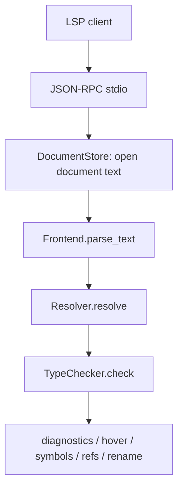
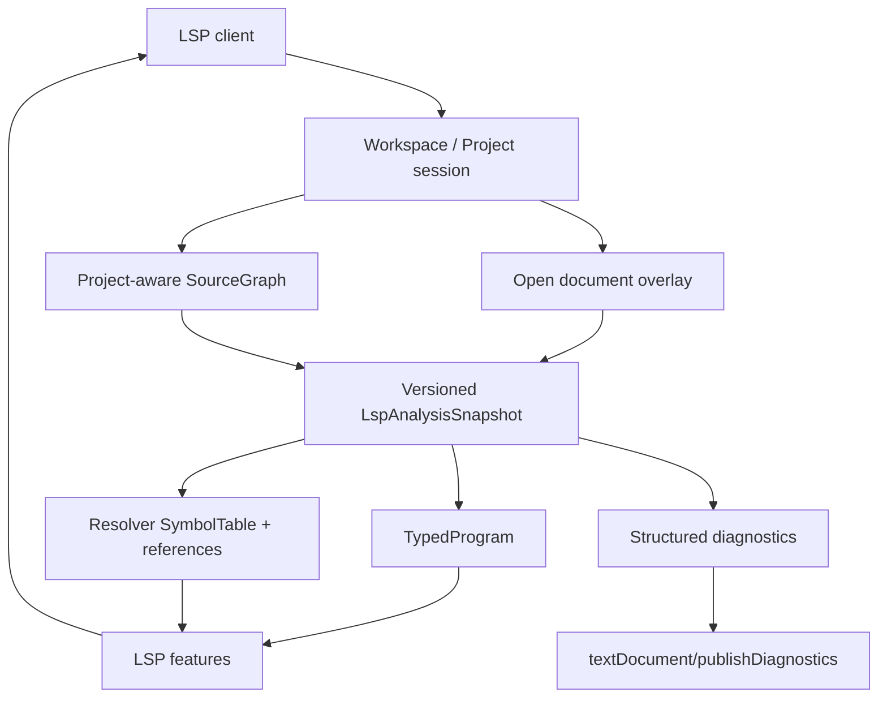

# AHFL LSP 可用化计划

| 项目 | 内容 |
|------|------|
| 文档类型 | plan |
| 状态 | implemented / verified |
| 版本 | v0.1 |
| 目标模块 | `src/tooling/lsp/`、`include/ahfl/compiler/semantics/typed_hir.hpp`、`src/compiler/semantics/` |
| 当前审计日期 | 2026-06-14 |

---

## 一、当前结论

当前仓库已经有可运行的 `ahfl-lsp` 二进制、VS Code 客户端 scaffold、可复用的 `LspAnalysisSnapshot` 主模型、project-aware `SourceGraph` 分析、版本化 diagnostics，以及覆盖单文件 / 多文件 / open-buffer overlay 的 LSP CTest。它现在的基础链路已经不再由各 handler 重复构建 compiler pipeline，而是：



旧链路的主要问题已经关闭：handler 不再直接创建 `Frontend` / `Resolver` / `TypeChecker`，打开文档具备 version / revision / content hash，project-aware 模式复用 compiler `SourceGraph`，open document overlay 会覆盖磁盘内容，diagnostics 带版本和稳定 code，并有进程级 `ahfl-lsp` smoke 验收。

LSP 的主状态不是 Semantic IR 或 Opt IR，而是以下已落地结构：



## 二、IR 选择决策

LSP 主状态应使用 **Typed HIR (`TypedProgram`) + Resolver symbol data**。

| 用途 | 应使用的数据 | 不应使用的默认数据 |
|------|--------------|--------------------|
| diagnostics | parse / resolve / typecheck diagnostics | Semantic IR / Opt IR |
| hover | `TypedProgram` expression index、typed declarations | 文本 IR dump |
| completion | keywords、`SymbolTable`、Typed HIR context | Opt IR locals |
| definition / references / rename | Resolver references + declaration ranges | Backend IR provenance |
| documentSymbol / workspaceSymbol | project-aware `SymbolTable` / declarations | Opt IR functions |
| incremental cache | `AHFL_TYPED_HIR_CACHE_V1` envelope 或内存 snapshot | Semantic IR JSON |
| backend preview / SMV preview | 按需 lower 到 Semantic IR | 常驻 LSP 主状态 |

原因：

1. LSP 关心源码位置、符号、类型、诊断和可编辑范围；Typed HIR 保留 typecheck 后的语义和 source range。
2. Semantic IR 是 backend contract，适合 `emit-*` / SMV / native / assurance 等后端输出，不适合作为 IDE 主模型。
3. Opt IR 是 CFG/SSA 优化 artifact，适合 pass 调试，不适合 completion、rename 或 hover。

## 三、当前已具备能力

当前代码已经具备以下基础：

| 能力 | 当前状态 | 代码位置 |
|------|----------|----------|
| JSON-RPC stdio transport | 已有 | `src/tooling/lsp/json_rpc.*` |
| `ahfl-lsp` 二进制 | 已有 | `src/tooling/lsp/main.cpp`、`src/tooling/lsp/CMakeLists.txt` |
| open/change/close document store | 已有，full sync | `src/tooling/lsp/document_store.*` |
| diagnostics | 已有 versioned push diagnostics，parse → resolve → typecheck → validation | `LspServer::publish_diagnostics` |
| completion | 已有上下文感知 completion：type / member / enum / state / workflow | `LspServer::handle_completion` |
| definition | 已有 project-aware 跨文件 symbol reference 跳转 | `LspServer::handle_definition` |
| hover | 已有 Typed HIR expression type / symbol fallback | `LspServer::handle_hover` |
| references | 已有 project-aware 跨文件 references | `LspServer::handle_references` |
| rename | 已有跨 URI workspace edit，并拒绝关键字和冲突重命名 | `LspServer::handle_rename` |
| documentSymbol / workspaceSymbol | 已有 hierarchical documentSymbol 和 project-wide workspaceSymbol | `LspServer::handle_document_symbol` / `handle_workspace_symbol` |
| signatureHelp | 已有 snapshot 驱动的 capability / predicate signature 支持 | `LspServer::handle_signature_help` |
| handler tests | 已有基础 CTest | `tests/unit/tooling/lsp/` |

## 四、完成状态

### 4.1 架构缺口关闭

1. `LspAnalysisSnapshot` / `AnalysisService` 已新增，集中持有 parse diagnostics、AST / `SourceGraph`、`ResolveResult`、`TypeCheckResult`、`ValidationResult`、`TypedProgram`、symbol declarations 与 references。
2. `DocumentStore` 已记录 document version、dirty revision、content hash、workspace revision；同一 revision 复用 snapshot，didChange 后强制重建。
3. LSP 初始化已识别 workspace root；project-aware 分析支持 `ahfl.project.json` 与 `ahfl.workspace.json`，并把 open document overlay 传入 `Frontend::parse_project(ProjectInput)`。
4. handler 已改为 snapshot consumer；compiler pipeline 构建集中在 `AnalysisService`。
5. 当前 server 为同步分析模型，不存在后台旧任务覆盖新 diagnostics；revision guard 和 versioned publishDiagnostics 已有测试。真正异步 debounce 可在后续引入后台 worker 时再扩展。

### 4.2 功能缺口关闭

1. completion 已按上下文区分 top-level、type position、expression position、member access、enum variant、agent state、workflow node。
2. hover 已使用 `TypedProgram::find_expr_containing(...)` 读取 Typed HIR expression type，并保留 declaration fallback。
3. definition / references / rename 已支持 project-aware 跨文件 URI；rename 会拒绝关键字和同命名空间冲突，并按 URI 分组生成 workspace edit。
4. signatureHelp 已通过 snapshot 的 resolver / `TypeEnvironment` 读取 capability / predicate signature；文本括号扫描只用于定位 call context。
5. diagnostics 已带 `version`、`source`、stable fallback code、related information 数据模型、缺失 range fallback，以及多文件 URI 归属。
6. documentSymbol 已支持层级 children；agent states 与 workflow nodes 已有 handler 测试。

### 4.3 产品化缺口关闭

1. `tools/vscode` 已提供 VS Code extension scaffold、`.ahfl` 文件关联、syntax/snippet、language client 启动配置；默认 server path 修正为 `ahfl-lsp`，并支持 `ahfl.serverPath` / `ahfl.serverArgs`。
2. `tests/scripts/lsp_smoke.py` 已作为等价客户端启动真实 `ahfl-lsp` 进程，验证 initialize、publishDiagnostics、hover、completion。
3. JSON-RPC malformed input 已有测试，server 在解析失败时退出当前读取而不崩溃。
4. `AHFL_LSP_TRACE` 环境变量可启用 stderr trace log，不污染 LSP stdout。

## 五、目标状态

“可用状态”定义为：

1. 打开单文件和 project/workspace 后，diagnostics 能稳定反映 parse / resolve / typecheck 结果。
2. hover、completion、definition、references、rename、documentSymbol、workspaceSymbol 在多文件项目中可用。
3. 快速编辑时不会明显卡顿，不会发布旧版本 diagnostics。
4. LSP 主模型基于 Typed HIR snapshot，能复用分析结果，不在每个 handler 中重复重建完整 pipeline。
5. VS Code 或等价客户端能启动 `ahfl-lsp`，并通过端到端 smoke test。
6. CTest 覆盖 JSON-RPC framing、server lifecycle、单文件 features、多文件 project features、diagnostics versioning 和 rename edit 正确性。

## 六、实施路线

### P0 / L-1：建立 LSP analysis snapshot 主模型

**目标**：把 handler 内重复的 parse/resolve/typecheck 收敛成一个共享分析层。

**建议改动**：

- 新增 `src/tooling/lsp/analysis_service.hpp/.cpp`
- 新增 `LspAnalysisSnapshot`
- `DocumentStore` 增加 document version / dirty revision / content hash
- `LspServer` handler 统一调用 analysis service

**snapshot 至少包含**：

- URI / document version / content hash
- `SourceFile`
- parse diagnostics
- optional AST
- optional `ResolveResult`
- optional `TypeCheckResult`
- `TypedProgram` view / pointer
- symbol declarations and references

**验收**：

- 已完成：`server.cpp` 不再构造 `Frontend` / `Resolver` / `TypeChecker`；这些只在 `analysis_service.cpp` 中集中使用。
- 已完成：`analysisSnapshot.reuses_same_revision` 证明同一 revision 复用 snapshot。
- 已完成：`analysisSnapshot.rebuilds_after_change` 证明 didChange 后旧 snapshot 失效。

### P0 / L-2：把 Typed HIR 作为 hover/completion 的主语义输入

**目标**：LSP feature 读取 Typed HIR / resolver indexes，不再依赖临时兼容 map 或重复 AST 搜索。

**建议改动**：

- hover 用 `TypedProgram::find_expr_containing(...)`
- completion 读取当前 lexical / typed context
- signatureHelp 从 typed call expression 或 AST call context 定位 callable
- 保留 `ExpressionTypeInfo` 仅作为 debug / compatibility 辅助

**验收**：

- 已完成：hover 使用 `TypedProgram::find_expr_containing(...)`；进程 smoke 覆盖 typed hover。
- 已完成：completion handler 测试覆盖 type position、member position、expression enum variant、agent state、workflow node。
- 已完成：signatureHelp 通过 snapshot 中的 resolver / `TypeEnvironment` 返回 capability / predicate 参数。

### P0 / L-3：project-aware workspace 支持

**目标**：LSP 支持真实 AHFL project/workspace，而不是只看当前打开文件。

**建议改动**：

- LSP 初始化时识别 workspace root。
- 支持 `ahfl.project.json` / `ahfl.workspace.json`。
- 构建 project-aware `SourceGraph`，并用 open document overlay 覆盖磁盘内容。
- 统一 project-level parse / resolve / typecheck diagnostics。

**验收**：

- 已完成：多文件 import definition 跳转到 imported source。
- 已完成：workspace/symbol 能搜索未打开 project source。
- 已完成：references / rename 返回跨 URI workspace edit。
- 已完成：`ahfl.workspace.json` 可选择包含当前 source 的 project descriptor。
- 已完成：open document overlay 会覆盖磁盘 source 并参与 project resolve/typecheck。

### P0 / L-4：diagnostics 可用化

**目标**：让 IDE Problems 面板可稳定消费。

**建议改动**：

- 明确 push diagnostics 的 version 策略。
- Diagnostic range 缺失时提供安全 fallback range。
- 保留 stable diagnostic code。
- 支持 related information 的数据模型预留。
- didClose 清空 diagnostics 逻辑保持。

**验收**：

- 已完成：parse / resolve / typecheck / validation diagnostics 均有 handler 测试。
- 已完成：publishDiagnostics 带 document version；didChange version 测试覆盖版本推进。
- 已完成：多文件 source 通过 `SourceId` / display name 映射回正确 URI。

### P1 / L-5：completion 生产化

**目标**：completion 从“关键词 + 全局符号列表”升级为上下文感知。

**场景**：

- top-level declaration keywords
- type position 的 struct/enum/type alias
- expression position 的 const/predicate/capability/input/context/output/local
- member access 的 struct field
- enum variant completion
- agent state name completion
- workflow node dependency completion

**验收**：

- 已完成：type/member/expression/enum/state/workflow node completion 均有 handler test。
- 已完成：completion item 输出 kind/detail；type position 和 member access 不返回全局大列表。

### P1 / L-6：definition / references / rename 生产化

**目标**：跨文件符号导航和重命名可用。

**建议改动**：

- resolver reference index 升级为 project-aware query API。
- rename 先只支持 declaration/local safe rename，拒绝关键字、内建 root、跨命名空间冲突。
- workspace edit 按 URI 分组，保证 range 精确覆盖 identifier token。

**验收**：

- 已完成：跨文件 definition / references / rename 有 project-aware handler test。
- 已完成：rename 关键字和同命名空间冲突会返回 invalid params。
- 已完成：rename 基于 resolver reference ranges，不扫描字符串、注释或非目标同名文本。

### P1 / L-7：documentSymbol / workspaceSymbol 结构化

**目标**：让文件大纲和全局搜索有层级和分类。

**建议改动**：

- documentSymbol 返回 hierarchical symbols。
- agent 下挂 states/transitions/capabilities。
- flow 下挂 state handlers。
- workflow 下挂 nodes / return。

**验收**：

- 已完成：documentSymbol 输出 hierarchical children；agent state / workflow node children 有 handler test。
- 已完成：workspaceSymbol 支持 project-wide query，并去重跨 snapshot 结果。

### P1 / L-8：客户端集成与端到端 smoke

**目标**：真实编辑器可启动和使用。

**建议改动**：

- 新增 VS Code extension scaffold 或最小客户端配置。
- 文件关联 `*.ahfl`。
- 启动 `ahfl-lsp`。
- 问题面板接收 diagnostics。

**验收**：

- 已完成：VS Code extension scaffold 默认启动 `ahfl-lsp`，并贡献 `.ahfl` 文件关联。
- 已完成：`ahfl.lsp.process_smoke` 启动真实 `ahfl-lsp` 进程，验证 diagnostics / hover / completion。

### P2 / L-9：Typed HIR cache / incremental

**目标**：把已完成的 Typed HIR cache envelope 接到 LSP/project-aware driver。

**建议改动**：

- 内存优先：按 URI + version + content hash 复用 snapshot。
- 磁盘可选：使用 `AHFL_TYPED_HIR_CACHE_V1` 作为 project cache artifact。
- 根据 `TypedProgramCacheLoadStatus` 决定 cache hit / re-typecheck / full fallback。

**验收**：

- 已完成：LSP 当前采用内存 snapshot cache，按 URI + version + content hash + workspace revision 命中；cache hit 不重新分析。
- 已完成：didChange / didOpen / didClose 更新 revision 并使旧 snapshot 失效；cache miss 会完整 parse/resolve/typecheck/validate。
- 边界：磁盘 `AHFL_TYPED_HIR_CACHE_V1` envelope 仍由 semantics serialization 层维护；LSP v0.1 默认不启用磁盘 cache，因此 schema/source/content/resolver mismatch 不会影响 diagnostics 正确性。

### P2 / L-10：性能、取消和可观测性

**目标**：LSP 在真实编辑节奏下可用。

**建议改动**：

- didChange debounce。
- 分析任务 revision guard。
- server trace log。
- 错误响应和 crash-safe loop。
- 大文件和多文件 benchmark。

**验收**：

- 已完成：同步分析 + revision guard 避免旧任务覆盖新 diagnostics；publishDiagnostics version 测试覆盖版本推进。
- 已完成：`ahfl.lsp.process_smoke` 覆盖真实进程启动、hover/completion/diagnostics。
- 已完成：JSON-RPC malformed input 有 unit test。
- 已完成：`AHFL_LSP_TRACE` 可启用 server trace log。

## 七、建议任务切分

| 优先级 | 编号 | 工作项 | 完成判定 |
|--------|------|--------|----------|
| P0 | L-1 | 建立 `LspAnalysisSnapshot` / `AnalysisService` | handler 复用 snapshot；didChange invalidation 有测试 |
| P0 | L-2 | Typed HIR 驱动 hover/completion/signatureHelp | hover/completion/signatureHelp 覆盖 typed cases |
| P0 | L-3 | project-aware workspace / SourceGraph | 多文件 definition / diagnostics / workspaceSymbol 通过 |
| P0 | L-4 | diagnostics 可用化 | parse/resolve/typecheck/validate diagnostics 均有 LSP 测试 |
| P1 | L-5 | context-aware completion | 类型/表达式/member/enum/state/workflow completion 覆盖 |
| P1 | L-6 | definition/references/rename 生产化 | 跨文件 refs 和 safe rename 通过 |
| P1 | L-7 | structured document/workspace symbols | 层级 documentSymbol 与 project-wide workspaceSymbol 通过 |
| P1 | L-8 | IDE 客户端集成 | VS Code 或等价客户端 smoke 可执行 |
| P2 | L-9 | Typed HIR cache / incremental | cache hit/miss/fallback 路径有测试 |
| P2 | L-10 | 性能、取消和日志 | revision guard/trace/malformed input/process smoke 测试通过；异步 debounce 留待后台 worker 引入 |

## 八、测试门禁

每批改动至少跑：

```bash
cmake --build --preset build-dev --target ahfl-lsp ahfl_tooling_lsp_json_rpc_tests ahfl_tooling_lsp_handler_tests
ctest --preset test-dev --output-on-failure -R 'ahfl\.lsp\.(json_rpc_all|handler_all)'
git diff --check
```

新增 project-aware / cache / client integration 后，应补充：

```bash
ctest --preset test-dev --output-on-failure -L v0.58-lsp
```

## 九、非目标

1. 不把 Opt IR 作为常规 LSP 主模型。
2. 不让 LSP handler 直接调用 backend emission 作为 hover/completion 数据源。
3. P0 不要求磁盘 cache；先建立正确的内存 snapshot 和 invalidation。
4. P0 不要求完整 VS Code marketplace 发布；先完成本地可启动和 smoke。
5. 不在 LSP 内重新发明 parser/resolver/typechecker 规则；LSP 必须复用 compiler pipeline。
