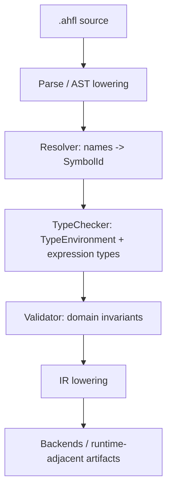
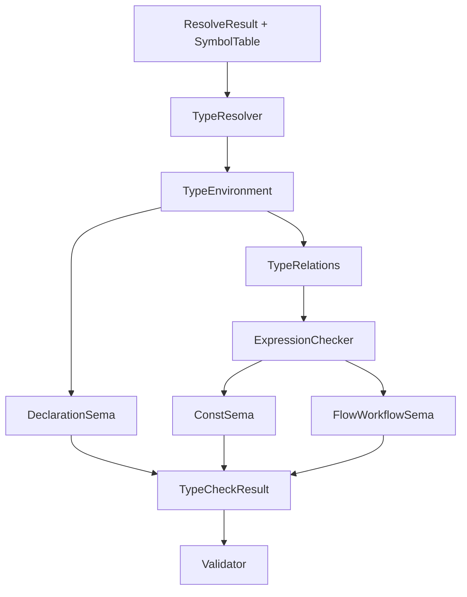

# AHFL TypeCheck / Sema 硬化实施计划

| 项目 | 内容 |
|------|------|
| 文档类型 | plan |
| 状态 | proposed |
| 目标模块 | `src/compiler/semantics/`、`include/ahfl/compiler/semantics/`、语义相关 golden / unit / integration 测试 |
| 关联规范 | [core-language.zh.md](../spec/core-language.zh.md) |
| 关联设计 | [semantics-architecture.zh.md](../design/semantics-architecture.zh.md)、[compiler-phase-boundaries.zh.md](../design/compiler-phase-boundaries.zh.md)、[diagnostics-architecture.zh.md](../design/diagnostics-architecture.zh.md)、[testing-strategy.zh.md](../design/testing-strategy.zh.md) |

## 一、背景

当前 AHFL 的语义阶段已经形成 `resolve -> typecheck -> validate -> IR lowering` 的基本流水线，`TypeChecker` 能建立 declaration-level `TypeEnvironment`，并能对常量、结构体默认值、contract、flow、workflow 中的表达式做局部类型检查。

但当前实现仍是“可工作的工程化 checker”，还不是“规范闭包的 PL 级 sema”。核心差距不在于缺少 Clang / tsc 级复杂算法，而在于 AHFL 自己已经写入规范的 typing judgment、effect 约束、exact schema 边界、ConstExpr 规则和领域 invariant 没有全部落成可测试的语义关系。

本计划的目标是用最小必要复杂度，把 TypeCheck / Validate 硬化为可维护、可测试、可演进的 sema 系统。

## 二、当前语义流水线



当前分层方向正确。计划不会把 `validate` 重新并回 `typecheck`，也不会引入不必要的全局 constraint solver。硬化重点是让每个阶段拥有更清晰的语义关系和更完整的规范覆盖。

## 三、目标

1. 建立显式 Type Relation 模块，统一管理等价、子类型、可赋值、exact schema matching。
2. 将名义类型 identity 从字符串比较逐步升级到 `SymbolId` / interned `TypeId`。
3. 完整实现规范中的 exact schema 边界。
4. 补齐 declaration-level 和 domain-level invariant。
5. 建立独立 ConstExpr 语义与常量求值边界。
6. 将 purity 从布尔值演进为可扩展 effect model。
7. 将 typecheck / validate diagnostics code 化、结构化。
8. 拆深 sema 模块，提高局部性和测试杠杆。
9. 建立语义矩阵测试，避免只靠少数 golden 覆盖。

## 三点五、合并后的下一阶段架构任务

本文合并原 `typechecker-next-architecture` 与 `typechecker-t1.4-stmt-temporal-design` 的仍有效内容。后续 typechecker / sema 计划只维护本文，避免把同一条 sema hardening 路线拆成多个并行 plan。

| 主题 | 当前口径 | 是否仍需独立 plan |
|------|----------|------------------|
| Typed HIR | 已成为当前 typecheck / lowering / LSP 的核心事实来源；后续只跟踪缺口，不再作为独立引入计划维护。 | 否 |
| Flow-sensitive typing / CFA-lite | 保留为 P1，先聚焦 Optional narrowing 与局部事实传播，不引入全局路径敏感 solver。 | 否 |
| Type relation / constraint framework | 并入 Milestone 1；当前目标是统一 relation API，不提前引入泛型或 union/intersection。 | 否 |
| 解释型诊断 | 并入 Milestone 7；expected/found 来源、related notes、diagnostic code 是主线验收。 | 否 |
| TypeContext 生命周期与并发模型 | 保留为 session-scoped interning / daemon-ready 的后续 hardening 项。 | 否 |
| Statement / temporal typed-tree | T1.4 时间点判定为 Medium ROI；表达式子树已经通过 Typed HIR 桥接覆盖。只有出现 statement-level rewrite、temporal rewrite 或 block-level analysis 需求时，才在本文下启动 T1.6 子任务。 | 否 |

Statement / temporal typed-tree 的 T1.6 触发条件：

1. 需要 post-typecheck statement rewrite，并且 rewrite 必须被 lowering 观察到。
2. 需要 temporal formula rewrite，例如 de-Morgan、redundancy elimination 或 formula-level diagnostics。
3. 需要 block-level typed representation 承载 `if` / handler / workflow return body 的控制结构。

若触发 T1.6，实现顺序应是 `TypedBlock` -> `TypedStatement` -> `TypedTemporalExpr` -> lowerer 迁移 -> equivalence tests。不要只新增 statement node 而继续从 AST 回查 block；那会保留最昂贵的耦合点。

## 四、非目标

1. 不引入 Hindley-Milner、Algorithm W 或全局类型方程求解。
2. 不引入用户自定义泛型、higher-kinded type、union / intersection type。
3. 不引入 tsc 风格 control-flow narrowing。
4. 不维护 immature 语义的向前兼容；必要时可以做 breaking change。
5. 不改变 `parse -> ast -> resolve -> typecheck -> validate -> emit` 的阶段边界。

## 五、发现的问题

### 5.1 Type Relation 分层不清

现状：

- `are_types_equivalent`、`is_subtype_of`、`is_exact_schema_match` 位于 `include/ahfl/compiler/semantics/types.hpp`。
- `check_assignable` 位于 `src/compiler/semantics/typecheck.cpp`。
- exact schema matching 当前几乎只是等价判断的薄包装。

问题：

- 类型等价、子类型、赋值兼容和运行时边界 schema 匹配语义混杂。
- 调用方无法从接口上区分“普通表达式赋值”和“agent / workflow 边界检查”。
- 旧计划曾把 `Optional<T>`、`List<T>`、`Set<T>`、`Map<K,V>` 全部不变作为目标；当前规范已明确为 `Optional/List/Set` 元素协变、`Map` key 不变且 value 协变，应以规范为准。
- 数值 subtyping 曾默认允许 `Int <: Float`、`Int <: Decimal(p)`、`Decimal(p1) <: Decimal(p2)`，这与规范不一致。

### 5.2 名义类型 identity 依赖字符串

现状：

- semantic `StructT` / `EnumT` / `EnumVariantT` 已携带 optional `SymbolId`，`type_relations` 的等价关系已优先使用 symbol identity，canonical name 只作为缺少 symbol 时的 fallback。
- `TypeEnvironment::get_struct(Type)` / `get_enum(Type)` 已优先使用 type payload 里的 `SymbolId`；`find_struct` / `find_enum` 仍保留为 canonical name fallback 和展示/旧入口。
- dump-types 已按 `SymbolId` 从 `TypeEnvironment` 查询声明；IR lowering 已通过 `SymbolRef.id` 保留 declaration/reference identity，`TypeRef` 仅作为 canonical 类型边界和可读输出，不承担内部名义 identity。

问题：

- 字符串适合展示，不适合作为 sema 内部 identity。
- 跨模块 rename、diagnostics note、IR provenance 与 future incremental cache 都需要稳定 identity。

### 5.3 exact schema boundary 已落地，后续转入维护矩阵

规范要求以下边界采用精确 schema 匹配：

- agent 输入
- agent 输出
- agent context 默认值
- workflow 输入
- workflow 输出
- workflow node 调用实参

现状：

- `SchemaBoundaryKind` 已覆盖 agent input/output/context default、workflow input/output、workflow node input。
- workflow node input、workflow output、agent output 和 agent context default 已通过 `check_exact_schema_boundary` 走 `is_exact_schema_match`。
- agent input 与 workflow input 在编译期没有外部输入表达式；当前以声明级 schema boundary 校验它们必须解析为 struct type，并使用稳定 `typecheck.INVALID_AGENT_TYPE` diagnostic code 与 `SchemaBoundaryTypeRequiresStruct` message template。
- typecheck golden 已覆盖 agent input 非 struct、agent context default exact mismatch、agent output exact mismatch、workflow input 非 struct、workflow output exact mismatch、workflow node input exact mismatch。

### 5.4 声明级 invariant 不完整

规范要求但当前需要补齐或强化的检查：

- struct 字段名唯一。
- enum variant 唯一。
- agent context struct 的所有字段必须有默认值。
- flow 中可写根对象需要明确，至少应判断 `input` 是否只读。

### 5.5 ConstExpr 语义不完整

规范要求 `ConstExpr`：

- 只能引用 const、enum variant、literal。
- 不允许引用 `input`、`ctx`、`output`。
- 不允许调用 capability 或 predicate。
- 必须可在编译期求值。

现状：

- 常量初始化器和结构体默认值已通过 `ConstSema` 语法 gate 与 `ExprEffect` gate 检查。
- `ConstEvalOutcome` 已在 `const_sema.*` 边界区分并构造 `KnownConst`、`NotConst` 和 `Error`，`ConstEvalPipeline` 已编排 const gate、dependency scheduling 和 const value tree recording，`ConstExpressionDriver` 已编排 expression checker callback、const pipeline 和 diagnostic forwarding，`ConstValueTreeRecorder` 的 evaluate-and-record 已直接返回 outcome，const expr required diagnostic message/code/range 已由 `const_sema.*` 描述并随 pipeline diagnostic report 返回，`ConstDiagnosticEmitter` 已负责按当前 source 转发 const diagnostic report；expression checker 的 context/value/call contract、place/path-root helper、path resolution helper、flow narrowing helper、field access helper 和 value factory 已抽到 `expression_sema.*`，`ExpressionChecker` dispatch object、path/unary/member/index/binary/qualified-value/struct-literal/list-literal/set-literal/map-literal/call expression handler、对应旧 `TypeCheckPass` handler 声明/实现清理、`ExpressionCheckerServices` adapter、metadata query direct environment read、resolver/symbol snapshot direct read、assignability direct relation check、type symbol resolver callback、diagnostic sink callback、recursive checker callback、friend removal、field/flow helper 直连与具体 handler 已拆到 `typecheck_expr.cpp`，`TypeCheckPass` 现在保留 expression checker callback，并把结果转换为 `ConstCheckedExpression` 作为 const pipeline 输入；adapter 已不再持有或友元访问 `TypeCheckPass`，diagnostic 与 recursive `check_expr` 均通过 callback 转发，`TypeResolver` boundary 与 alias cache/cycle state 已移入 `type_resolver.*`，`ahfl.semantics.type_resolver_all` 已直接覆盖 alias cache/cycle，并接管 AST type syntax、type symbol、alias cache 与 alias cycle 处理，剩余 `TypeCheckPass` 行为依赖集中在 source/diagnostic context 注入与更上层 pass 调度。非纯 const expression 诊断会报告具体 effect，例如 capability call。
- `TypedExpr::const_value` 已能为通过 `ConstSema` 的表达式记录可序列化 const value tree，覆盖 literal、enum variant、const reference、结构体字面量、容器字面量、`some` / `none`，并通过 Typed HIR JSON 往返测试。
- `ConstSema` 已能递归求值前序、forward 与跨 source const initializer，做值内联，并折叠基础 bool / Int unary/binary、Float 算术与比较、同 scale Decimal `+` / `-` 与比较、String `+`、Duration 比较/等价、struct member access、list/map index access；Duration const value artifact 已规范化为毫秒单位，Set / Map const value 已按稳定 key 规范化，Typed HIR 已输出 `AHFL_CONST_VALUE_ARTIFACT_V1` schema gate 和直接 const dependency graph artifact，const 依赖循环会报告稳定 `typecheck.CONST_DEPENDENCY_CYCLE`。`ConstValue` child 构造、等价比较、稳定排序、Set/Map 规范化、Duration artifact、unary/binary/member/index folding、AST / Resolver 到 const value tree 的递归构造、TypedExpr const value tree evaluate-and-record 编排及其成功 outcome 返回、const dependency reference 收集、TypedProgram const dependency edge 写入、const value cache / active / failed 状态管理、const cycle begin result / failed-state 标记、assignable 后 const value cache commit 与 resolution finish 决策、const cache write / resolution success API 封装、effect/syntax const gate 分类、const expr required diagnostic message/code/range 与 pipeline diagnostic report、const diagnostic sink forwarding、const type-relation validator、const checked-expression pipeline input、const expression driver、expression checker context/value/call contract、expression place/path-root helper、expression path resolution helper、expression flow narrowing helper、expression field access helper、`ExpressionValueFactory`、`ExpressionChecker` dispatch object、path/unary/member/index/binary/qualified-value/struct-literal/list-literal/set-literal/map-literal/call expression handler、对应旧 `TypeCheckPass` handler 声明/实现清理、`ExpressionCheckerServices` adapter、metadata query direct environment read、resolver/symbol snapshot direct read、assignability direct relation check、type symbol resolver callback、diagnostic sink callback、recursive checker callback、friend removal、field/flow helper 直连与 handler implementation file、struct default expectation/schema-boundary policy、const eval outcome 构造，以及 const eval pipeline 编排边界、const dependency cycle diagnostic spec / code / range / related-note report、const initializer validation policy 和 struct default validation policy 已移入 `const_sema.*` / `expression_sema.*` / `typecheck_expr.cpp` 的 `ConstEvaluator` / `ConstValueTreeRecorder` / `ConstDependencyResolver` / `ConstDependencyScheduler` / `ConstEvalPipeline` / `ConstExpressionDriver` / `ConstValueResolutionState` / `ConstValueResolutionBeginResult` / `ConstExprGateResult` / `ConstTypeCheckDiagnostic` / `ConstDiagnosticReport` / `ConstDiagnosticEmitter` / `ConstTypeRelationValidator` / `ConstCheckedExpression` / `ExpressionContext` / `ExpressionValue` / `ExpressionCallContext` / `ExpressionValueFactory` / `ExpressionChecker` / `ExpressionCheckerServices` / `ConstExprRequiredDiagnostic` / `ConstEvalOutcome` / `ConstDependencyCycleDiagnostic` / `ConstInitializerValidationPolicy` / `ConstStructDefaultValidationPolicy`。
- Const expression 的 evaluation / diagnostic 编排已进入 `const_sema.*`，expression checker 数据契约、place/path-root helper、path resolution helper、flow narrowing helper、field access helper 与 value factory 已进入 `expression_sema.*`，`ExpressionChecker` dispatch object、path/unary/member/index/binary/qualified-value/struct-literal/list-literal/set-literal/map-literal/call expression handler、`ExpressionCheckerServices` adapter、metadata query direct environment read、resolver/symbol snapshot direct read、assignability direct relation check、type symbol resolver callback、diagnostic sink callback、recursive checker callback、friend removal、field/flow helper 直连与具体 handler 已进入 `typecheck_expr.cpp`；当前 checker 已不直接友元访问 `TypeCheckPass`，且 literal / error value construction、path expression typing、unary expression typing、member access typing、index access typing、binary expression typing、qualified value typing、struct literal typing、list literal typing、set literal typing、map literal typing 与 call expression typing 已脱离 adapter，对应旧 `TypeCheckPass` handler 声明/实现已清理，adapter 中的 high-level expression handler 转发和旧 `TypeCheckPass` metadata query wrappers、旧 resolver/symbol lookup 转发、旧 assignability forwarding、旧 type symbol direct forwarding、旧 direct diagnostic forwarding、旧 direct recursive check forwarding、`TypeCheckPass::field_access` / `TypeCheckPass::apply_flow_narrowing` 薄包装已清理，剩余工作是继续剥离 source/diagnostic context 注入等 `TypeCheckPass` 状态依赖并补齐剩余语义测试矩阵。

### 5.6 Purity 表达力不足

现状：

- `ExpressionTypeInfo` 已记录 `ExprEffect`，`bool is_pure` 保留为兼容派生状态。
- 表达式 checker 已能区分 `Pure`、`ConstOnly`、`PredicateCall`、`CapabilityCall`、`ExternalEffect` 和 `Unknown`；const expression、contract、temporal embedded expression、if condition 和 assert condition 的非纯诊断已输出具体 effect 名称。

问题：

- AHFL 已经存在 capability、predicate、assurance、runtime effect 等概念。
- 二值 purity 不足以支撑后续 effect policy、assurance report 和更细 diagnostics。

### 5.7 Diagnostics 未完全结构化

现状：

- `diagnostics.hpp` 已定义 typecheck error code 和 message template。
- type mismatch、exact schema、const expr、schema declaration、non-pure expression、bool semantic boundary、callable arity、capability gating、predicate argument purity、member/field access、struct literal field/target、qualified enum value、declaration duplicate field/variant、agent context default、index access（list index 与非集合目标）、empty literal、`none` context、expression operation、flow assignment target、unknown path root、unknown type / qualified value / callable missing-reference fallback、invalid type reference fallback、invalid callable reference fallback、missing callable metadata fallback、missing const/type metadata fallback 和 let shadowing warning 已有稳定 typecheck code 覆盖；schema declaration、missing-reference fallback、invalid type/callable reference fallback、missing callable/const/type metadata fallback 与 shadowed binding 也已迁移到 message template 并有单测覆盖，list/set/map 推断类型 mismatch 已能用 related note 指回首个推断元素/key/value。
- validation agent/flow invalid-state、duplicate capability、workflow graph 和 temporal formula 已使用稳定 validation code 和 message template；duplicate capability 已从兜底 `validation.SEMANTIC_INVARIANT` 拆为 `validation.DUPLICATE_CAPABILITY` 并有单测覆盖。
- `typecheck.cpp` / `validate.cpp` 中直接裸字符串诊断已明显收敛；当前 `validate.cpp` 不再有 in-tree `validation.SEMANTIC_INVARIANT` 发射路径，剩余重点转向 related notes 与测试矩阵一致性。

问题：

- IDE / LSP 难以稳定消费错误类型。
- 类型不匹配缺少 expected type 来源、actual type 来源和边界上下文 note。

### 5.8 TypeCheckPass 过大

现状：

- `src/compiler/semantics/typecheck.cpp` 中 `TypeCheckPass` 同时负责声明索引、类型解析、表达式检查、assignability、purity、flow / workflow 表达式检查。

问题：

- 模块接口不深，局部性不足。
- 新语义规则容易继续堆进一个 pass，造成回归风险。
- 单元测试只能通过 CLI / golden 兜底，不利于精确覆盖类型关系。

## 六、目标架构



建议模块职责：

| 模块 | 主要职责 | 建议文件 |
|------|----------|----------|
| `TypeResolver` | AST type syntax 到 semantic type，type symbol resolution，alias 展开，alias cache/cycle state | `type_resolver.*` 与 `ahfl.semantics.type_resolver_all` 已落库 |
| `TypeRelations` | equivalence、subtyping、assignability、exact schema | `type_relations.*` |
| `ExpressionChecker` | 表达式 typing、contextual typing、effect 聚合 | `expression_checker.*` |
| `DeclarationSema` | declaration-level invariant 与 signature 建模 | `declaration_sema.*` |
| `ConstSema` | ConstExpr 判定、常量求值边界 | `const_sema.*` |
| `FlowWorkflowSema` | flow / workflow 中表达式相关 sema | `flow_workflow_sema.*` |
| `Validator` | 状态机、DAG、temporal atom 语境等整体结构约束 | 保持 `validate.*`，但逐步消费更结构化结果 |

## 七、实施路线

### Milestone 1：Type Relation 闭包

目标：

- 建立类型关系的单一入口。
- 固化规范定义的容器 variance。
- 默认禁止规范未列出的数值子类型。
- 为 exact schema boundary 铺路。

任务：

1. 新增 `include/ahfl/compiler/semantics/type_relations.hpp`。
2. 新增 `src/compiler/semantics/type_relations.cpp`。
3. 迁移 `are_types_equivalent`、`is_subtype_of`、`is_exact_schema_match`。
4. 将 `Optional<T>`、`List<T>`、`Set<T>`、`Map<K,V>` 按 `docs/spec/core-language.zh.md` 固化：`Optional/List/Set` 元素协变，`Map` key 不变、value 协变。
5. 默认关闭数值 widening：`Int` 不是 `Float` 或 `Decimal(p)` 的子类型，`Decimal(p1)` 不是 `Decimal(p2)` 的子类型。
6. 增加 type relation 单元测试矩阵。

验收：

- `String(2, 8) <: String` 通过。
- `String(2, 8) <: String(0, 16)` 通过。
- `List<String(2,8)> <: List<String>` 通过。
- `Map<String(2,8), Int> <: Map<String, Int>` 不通过。
- `Map<String, String(2,8)> <: Map<String, String>` 通过。
- 源码级 `const` / empty container / `none` 路径通过 `TypeCheckPass::check_assignable` 消费上述 variance 规则。
- CLI fail golden 覆盖 `Optional/List/Set<String> -> Optional/List/Set<String(2,8)>`
  反向协变拒绝路径、`Map<String(2,8), Int> -> Map<String, Int>` key invariant
  拒绝路径，以及 `Map<String, String> -> Map<String, String(2,8)>` value 反向协变拒绝路径。
- `Decimal(2) <: Decimal(4)` 不通过。
- CLI fail golden 覆盖 `Decimal(2) -> Decimal(4)` numeric widening 拒绝路径。
- CLI fail golden 覆盖 `Decimal(4) -> Decimal(2)` scale narrowing 拒绝路径。
- `Decimal(2) <: Float` 不通过。
- CLI fail golden 覆盖 `Decimal(2) -> Float` 拒绝路径。
- `Int <: Float` 不通过。
- CLI fail golden 覆盖 `Int -> Float` numeric widening 拒绝路径。
- `Int <: Decimal(2)` 不通过。
- CLI fail golden 覆盖 `Int -> Decimal(2)` numeric widening 拒绝路径。

### Milestone 2：名义类型 identity 硬化

目标：

- 内部类型等价不再依赖字符串。
- 保留 canonical name 仅用于展示和诊断。

任务：

1. 已为 semantic `Type` 增加 nominal identity 字段，优先使用 `SymbolId`。
2. 已调整 struct / enum / enum variant type 构造入口和 relation 等价规则。
3. 已调整并回归覆盖 `TypeEnvironment::get_struct(Type)` / `get_enum(Type)` 的主要查询路径。
4. 保留 name fallback，仅用于错误恢复或旧 IR 展示。
5. 已审计 dump-types 与 IR TypeRef/lowering 的类型来源：内部 identity 走 `SymbolId`/`SymbolRef.id`，`TypeRef` 输出 canonical name 供后端和诊断展示。

验收：

- 跨模块同名但不同 owner 的 struct 不会误判等价。
- alias 展开后保持目标类型 identity。
- dump-types 输出仍保持 canonical name 可读。

### Milestone 3：exact schema boundary

目标：

- 运行时边界全部使用明确的 exact schema relation；没有表达式 source 的 input 声明边界使用明确的 declaration-level schema 校验。

任务：

1. 已新增 `SchemaBoundaryKind`：
   - `AgentInput`
   - `AgentOutput`
   - `AgentContextDefault`
   - `WorkflowInput`
   - `WorkflowOutput`
   - `WorkflowNodeInput`
2. 已新增 `check_exact_schema_boundary(source, target, kind, range)`。
3. 已替换 workflow node input / workflow return 的普通 `check_assignable`。
4. 已检查 agent context 默认值与 field default 的 exact schema 语义。
5. 已为每类边界补 negative golden。

验收：

- 普通 let / assignment 仍可使用 `assignable`。
- workflow node input 必须满足 exact schema。
- workflow return 必须满足 exact schema。
- agent context default 必须满足 exact schema。
- agent input / workflow input 的声明类型必须解析为 struct type。
- 报错信息能指出具体边界类型，并通过 message template 稳定输出。

### Milestone 4：声明级 invariant

目标：

- 补齐规范中的 declaration-level 检查。

任务：

1. 检查 struct 字段重复。
2. 检查 enum variant 重复。
3. 检查 agent context struct 的所有字段都有默认值。
4. 明确 flow assignment 的可写根：
   - `ctx` 可写。
   - `input` 默认只读。
   - 局部 `let` 是否可写按当前语言决策固化。
5. 将相关错误归类到 typecheck 或 validate，避免语义职责漂移。

验收：

- `struct S { x: Int; x: String; }` 失败。
- `enum E { A, A }` 失败。
- agent context 缺默认字段失败。
- `input.foo = ...` 在 flow 中失败。

### Milestone 5：ConstExpr / ConstSema

目标：

- 将 const initializer 和 struct default 从“pure expression”提升到“编译期常量表达式”。

任务：

1. 已新增 `ConstSema` 语法 gate。
2. 已定义 `ConstEvalOutcome`：
   - `KnownConst`
   - `NotConst`
   - `Error`
3. 支持 literal、enum variant、const reference、结构体字面量、容器字面量、`some` / `none`。
4. 已禁止 capability / predicate call；capability call 会优先报告具体 `ExprEffect`。
5. 已禁止 `input`、`ctx`、`output` 和普通局部路径。
6. 已将 struct default 和 const initializer 改为消费 `ConstSema` / `check_const_expr`。
7. 已将 const expression 的结构化值写入 `TypedExpr::const_value`，并纳入 Typed HIR JSON 序列化/反序列化；Typed HIR JSON 已强制携带 `AHFL_CONST_VALUE_ARTIFACT_V1` schema。
8. 已支持前序、forward 与跨 source const value inline、基础 bool / Int folding、Float/同 scale Decimal/String/Duration folding、Duration artifact 毫秒规范化、Set/Map const value 规范化、member access folding、list/map index folding 和直接 const dependency graph artifact；`ConstValue` 值层 helper、AST 到 const value tree 的递归 evaluator、TypedExpr const value tree evaluate-and-record 编排及其成功 outcome 返回、const dependency reference 收集、TypedProgram dependency edge 写入、const value resolution state 管理、const cycle begin result / failed-state 标记、assignable 后 const value cache commit 与 resolution finish 决策、const cache write / resolution success API 封装、effect/syntax const gate 分类、const expr required diagnostic message/code/range 与 pipeline diagnostic report、const diagnostic sink forwarding、const type-relation validator、const checked-expression pipeline input、const expression driver、expression checker context/value/call contract、expression place/path-root helper、expression path resolution helper、expression flow narrowing helper、expression field access helper、`ExpressionValueFactory`、`ExpressionChecker` dispatch object、path/unary/member/index/binary/qualified-value/struct-literal/list-literal/set-literal/map-literal/call expression handler、对应旧 `TypeCheckPass` handler 声明/实现清理、`ExpressionCheckerServices` adapter、metadata query direct environment read、resolver/symbol snapshot direct read、assignability direct relation check、type symbol resolver callback、diagnostic sink callback、recursive checker callback、friend removal、field/flow helper 直连与 handler implementation file、struct default expectation/schema-boundary policy、const eval outcome 构造、const eval pipeline 编排、const dependency cycle diagnostic spec / code / range / related-note report、const initializer validation policy 和 struct default validation policy 已移入 `const_sema.*` / `expression_sema.*` / `typecheck_expr.cpp`，并由 const initializer declared-type note 与 agent context default exact-schema note 回归覆盖。
9. 已为 const dependency cycle 增加稳定 `typecheck.CONST_DEPENDENCY_CYCLE` 诊断。
10. 待补完整独立 expression checker 服务边界；context/value/call contract、place/path-root helper、path resolution helper、flow narrowing helper、field access helper 与 value factory 已移入 `expression_sema.*`，`ExpressionChecker` dispatch object、path/unary/member/index/binary/qualified-value/struct-literal/list-literal/set-literal/map-literal/call expression handler、`ExpressionCheckerServices` adapter、metadata query direct environment read、resolver/symbol snapshot direct read、assignability direct relation check、type symbol resolver callback、diagnostic sink callback、recursive checker callback、friend removal、field/flow helper 直连与具体 handler 已移入 `typecheck_expr.cpp`，adapter 中的 high-level expression handler 转发和旧 `TypeCheckPass` metadata query wrappers、旧 resolver/symbol lookup 转发、旧 assignability forwarding、旧 type symbol direct forwarding、旧 direct diagnostic forwarding、旧 direct recursive check forwarding、`TypeCheckPass::field_access` / `TypeCheckPass::apply_flow_narrowing` 薄包装已清理，剩余是继续剥离 source/diagnostic context 注入等 `TypeCheckPass` 状态依赖并补齐剩余语义测试矩阵。

验收：

- `const A: Int = 1;` 通过。
- `const B: Int = A + 1;` 是否通过取决于是否实现常量折叠；若暂不支持，必须给出明确诊断。
- `const C: Bool = SomePredicate();` 失败。
- `struct S { x: Int = input.x; }` 失败。

### Milestone 6：Effect Model

目标：

- 用 effect lattice 替代 `bool is_pure`，但保持对外兼容的查询方法。

任务：

1. 已定义 `ExprEffect`：
   - `Pure`
   - `ConstOnly`
   - `PredicateCall`
   - `CapabilityCall`
   - `ExternalEffect`
   - `Unknown`
2. 已定义 effect join 规则。
3. `ExpressionTypeInfo` 已增加 effect 字段。
4. 已保留 `is_pure` 作为兼容状态。
5. `ConstSema`、contract、assert、temporal embedded expression 和 if condition 已消费 effect 并通过 `typecheck.NON_PURE_EXPRESSION` 或 `typecheck.CONST_EXPR_REQUIRED` 报告具体 effect；assurance/formal 的复用仍需继续收口。

验收：

- contract 中 predicate call 可被识别为允许的 pure/effect-free 形式。
- contract 中 capability call 失败并带具体 effect 诊断。
- future assurance 可以复用 effect 信息，而不是重扫 AST。

### Milestone 7：结构化 Diagnostics

目标：

- sema diagnostics 可被 CLI、LSP、测试稳定消费。

任务：

1. 为 typecheck / validate 所有错误补 error code；当前 callable arity、capability gating、predicate argument purity、non-pure expression、bool semantic boundary、member/field access、struct literal field/target、qualified enum value、declaration duplicate field/variant、agent context default、index access、empty literal、`none` context、expression operation、flow assignment target、unknown path root、unknown type / qualified value / callable missing-reference fallback、invalid type reference fallback、invalid callable reference fallback、missing callable metadata fallback、missing const/type metadata fallback、let shadowing warning、validation agent/flow invalid-state、duplicate capability、workflow graph 和 temporal formula 已迁移。
2. 将字符串拼接迁移到 message template；当前 callable、bool semantic boundary、member/field、declaration、literal、schema declaration、struct literal target、qualified enum value、unknown type / qualified value / callable missing-reference fallback、invalid type/callable reference fallback、missing callable/const/type metadata fallback、index access、expression operation、flow assignment target、unknown path root、shadowed binding warning 和 validation structural diagnostics 已开始使用模板。
3. 类型不匹配诊断增加 note；当前 struct field、parameter、return、assignment、schema boundary、optional payload 和 list/set/map 推断元素/key/value 已覆盖：
   - expected type 来源。
   - actual type 来源。
   - boundary kind 或 expression kind。
4. golden tests 从只匹配片段逐步补充 code 检查。

验收：

- `TYPE_MISMATCH`、`EXACT_SCHEMA_MISMATCH`、`CONST_EXPR_REQUIRED` 等 code 稳定存在。
- LSP 可以基于 code 分类展示。
- golden 仍保留人类可读 message。

### Milestone 8：模块拆深

目标：

- 降低 `TypeCheckPass` 复杂度，提升语义规则局部性。

任务：

1. 先抽 `TypeRelations`，不改变 pass 调度。
2. 已抽 `TypeResolver`，并用 `ahfl.semantics.type_resolver_all` 覆盖 alias cache/cycle 行为。
3. 再抽 `ExpressionChecker`，使 expression typing 可单测。
4. 最后抽 `DeclarationSema` / `ConstSema` / `FlowWorkflowSema`。
5. 每一步只移动一个逻辑模块，避免混合重构。

验收：

- `typecheck.cpp` 不再同时承载所有语义关系。
- 每个新模块都有直接单元测试或 golden 覆盖。
- CLI 行为在每个阶段保持或按计划 breaking。

### Milestone 9：测试矩阵与回归门禁

目标：

- 从样例覆盖升级到规则矩阵覆盖。

任务：

1. 新增 type relation unit tests。
2. 新增 `tests/golden/typecheck/` 负例：
   - duplicate struct field
   - duplicate enum variant
   - context default missing
   - const expr predicate call
   - const expr path reference
   - exact schema mismatch
   - container variance mismatch（CLI fail golden 已覆盖 Optional/List/Set 反向协变、Map key invariant 与 Map value 反向协变）
   - numeric widening mismatch（CLI fail golden 已覆盖 `Int -> Float`、`Int -> Decimal`、`Decimal -> Float`、Decimal scale widening/narrowing）
   - readonly input assignment
3. 新增 project-aware integration：
   - cross-module nominal identity。
   - same range different source expression type lookup。
4. 更新 `tests/cmake/SingleFileCliTests.cmake` 和必要的 project tests。

验收命令：

```bash
cmake --build --preset build-dev
ctest --preset test-dev --output-on-failure -R 'ahflc\.(dump_types|fail|check)|ahfl\.fuzz\.typecheck_check'
ctest --preset test-dev --output-on-failure
git diff --check
```

## 八、提交拆分建议

每个提交只包含一个逻辑变化，并遵循 Conventional Commits：

1. `refactor(semantics): extract type relations`
2. `fix(semantics): enforce invariant container type relations`
3. `refactor(semantics): carry nominal symbol identity in semantic types`
4. `fix(typecheck): route runtime boundaries through exact schema matching`
5. `fix(validate): reject duplicate declaration members`
6. `fix(typecheck): require defaults for agent context fields`
7. `feat(typecheck): add const expression sema`
8. `refactor(typecheck): represent expression effects explicitly`
9. `fix(diagnostics): attach structured sema diagnostic codes`
10. `test(semantics): add type relation and sema matrix coverage`

若 nominal type identity、container variance 或 numeric relation 会改变用户可见行为，对应提交 footer 必须包含：

```text
BREAKING CHANGE: <影响范围与迁移说明>
```

## 九、风险与缓解

| 风险 | 影响 | 缓解 |
|------|------|------|
| 容器 variance 或 numeric relation 修复导致旧 golden 失败 | 旧程序可能被新 checker 拒绝 | 按规范接受 breaking change，补迁移说明 |
| Type identity 改动影响 IR 输出 | JSON / text IR golden 变化 | 先保留 display name，新增 identity 字段时分阶段更新 golden |
| ConstExpr 规则收紧 | 旧默认值或 const 初始化失败 | 明确诊断，必要时分两步提交 |
| effect model 影响 contract 判断 | 纯度判定行为变化 | 保留 `is_pure` 兼容 accessor，先让 effect 成为内部实现细节 |
| 模块拆分引入机械 churn | review 成本上升 | 每次只拆一个模块，行为改动与搬迁分开提交 |

## 十、完成定义

本计划完成时必须满足：

1. `TypeRelations` 是唯一类型关系入口。
2. 名义类型内部 identity 不再依赖 canonical name 字符串。
3. 规范列出的 exact schema boundary 全部通过专用接口检查。
4. ConstExpr 有独立 sema，并能拒绝非编译期表达式。
5. expression effect 可结构化记录和查询。
6. TypeCheck / Validate diagnostics 使用稳定 error code。
7. 新增语义矩阵测试覆盖主要 typing judgment。
8. `cmake --build --preset build-dev` 通过。
9. `ctest --preset test-dev --output-on-failure` 通过。
10. `git diff --check` 通过。

## 十一、推荐执行顺序

先做 Milestone 1 和 Milestone 3。原因是它们直接修正类型系统规范偏差，且能快速建立测试矩阵。然后做 Milestone 4 和 Milestone 5，补齐规范缺口。最后再做 Milestone 6 到 Milestone 8，把内部结构从“可工作”提升到“可长期维护”。

若需要拆 issue，建议按 milestone 拆成 9 个主 issue，每个主 issue 内再按测试、实现、文档验收拆子任务。
