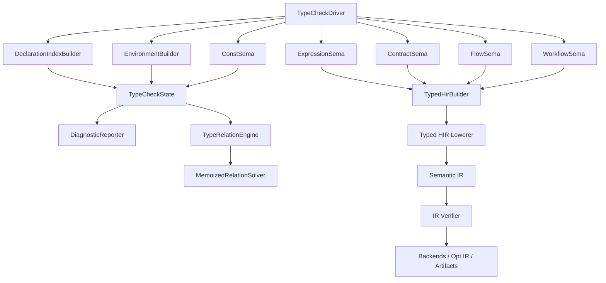

# AHFL TypeCheck、TypeRelation 与 Semantic IR 优化任务计划

| 项目 | 内容 |
|------|------|
| 文档类型 | plan |
| 状态 | completed |
| 目标模块 | `src/compiler/semantics/`、`include/ahfl/compiler/semantics/`、`src/compiler/ir/`、`include/ahfl/compiler/ir/`、Typed HIR / Semantic IR 相关 lowering 与 verifier 测试 |
| 关联规范 | [core-language.zh.md](../spec/core-language.zh.md) |
| 关联设计 | [semantics-architecture.zh.md](../design/semantics-architecture.zh.md)、[compiler-phase-boundaries.zh.md](../design/compiler-phase-boundaries.zh.md)、[ir-backend-architecture.zh.md](../design/ir-backend-architecture.zh.md) |
| 关联计划 | [semantics-typecheck-hardening.zh.md](./semantics-typecheck-hardening.zh.md) |

## 一、目标

本计划把 TypeCheck / TypeRelation 下一轮优化拆成可执行任务，目标是让 AHFL 的语义层更接近强类型 DSL 编译器的工业实现：

1. 将当前过宽的 `TypeCheckPass` 重构为薄调度 Driver 和多个深 Module。
2. 收紧 source-level arithmetic typing，禁止隐式 numeric promotion。
3. 将 type relation 求值核心从 coinductive visited-pair guard 升级为 memoized three-state solver。
4. 收口 Typed HIR -> Semantic IR 的 canonical 边界，消除正常 lowering 路径中的 AST / spelling / sentinel fallback。
5. 将 Semantic IR verifier 从结构安全网升级为 backend-ready fail-closed 门禁。
6. 保持 `resolve -> typecheck -> validate -> IR lowering` 阶段边界，不把结构性 validate 规则塞回 typecheck。

AHFL 当前仍处于快速演进阶段，本计划不维护不成熟语义的向前兼容。若实现与规范冲突，以规范和强类型可验证语义为准，必要时做 breaking change。

## 二、执行前问题快照

### 2.1 `TypeCheckPass` Interface 过宽

执行前 `TypeCheckPass` 同时承担：

- source cursor 与 current module 管理。
- diagnostic 发射。
- declaration index map。
- `TypeEnvironment` 构建。
- const evaluation 状态。
- expression checking 回调。
- contract / flow / workflow sema。
- Typed HIR 写入。

这些职责都属于 typecheck 阶段，但不应该暴露在同一个 Module 的 Interface 上。当前设计的问题不是“文件太长”，而是 Locality 不足：新增一个语义规则时，维护者必须理解太多共享状态。

### 2.2 Arithmetic promotion 与规范不一致

规范中的 arithmetic typing 是显式、保守的：

- `Int x Int -> Int`
- `Float x Float -> Float`
- `Decimal(p)` 仅允许相同 `p` 的 `+` / `-`
- `String + String -> String`

执行前 expression checker 中的 numeric promotion 更宽，允许 `Int + Float` 和 `Int + Decimal(p)`。这会把隐式精度语义带入 contract、IR 和形式化后端，不符合 AHFL 作为强类型 workflow DSL 的定位。

### 2.3 Type relation 当前是 recursion guard，不是完整 solver

执行前 coinductive visited-pair 做法能防止递归比较爆栈，也能支持递归类型的最大不动点直觉。但它不记录最终求值状态，不区分 `Equivalent` / `Subtype` / `Assignable` / `ExactSchema` 的缓存结果，也不能复用失败结论。

在执行前的有限类型系统下它基本可用；若引入递归 alias、泛型、trait-like constraints、union / intersection 或更复杂 schema relation，就需要 memoized three-state solver。

### 2.4 Semantic IR canonical 边界未完全收口

Semantic IR 的设计目标是让 backend 只消费结构化 `TypeRef` / `SymbolRef` / `ExprRef` / `AnalysisBundle`，不再回读 AST、source spelling 或 Typed HIR 内部表。但执行前 lowering 仍存在几类迁移期痕迹：

- `TypedProgram` 还没有完全承载 module/import、稳定 declaration order 和全部 provenance；normal lowering 仍会借助 AST declaration order，并对 `ModuleDecl` / `ImportDecl` 使用 direct AST fallback。
- `TypeRef` 构造仍存在从 type spelling 反解析的路径；这让源码展示文本重新变成结构化事实来源。
- `SymbolRef` 同时携带 `id`、`canonical_name`、`local_name`、`module_name`，但 backend-ready IR 还没有强制证明 `id` 与 canonical identity 一致。
- `TypeRef::display_name` 仍可能作为 fallback 参与 canonical lookup；展示字段和语义字段没有完全分离。
- 缺失 typed expr / temporal / symbol 时，lowering 会生成 `<missing-*>` 或 fallback ref，而不是让 lowering 失败。

这些问题不会立刻让 IR 不可用，但会降低 backend contract 的确定性。核心审查问题是：同一个语义事实到底哪个字段是 canonical？

### 2.5 Semantic IR verifier 仍偏结构安全网

执行前 `verify_ir_program(...)` 已能检查 `ExprRef` arena 一致性、重复 ID、复合 `TypeRef` child 完整性、source range 和 analysis freshness。但它仍偏向“IR 数据结构没有坏”，而不是“validate 后的 backend-ready IR 语义已经闭包”。

需要变硬的点：

- backend-ready IR 不应允许 `TypeRefKind::Unresolved` 出现在 required type 位置。
- declaration / reference 的 required `SymbolRef` 不应缺失 `id` 或 canonical identity。
- workflow node target、flow/contract target、agent capability refs 应按 expected kind 解析到真实 declaration。
- `Decl.name` 与 `symbol_ref` 不应漂移。
- `<missing-typed-expr>`、`<missing-typed-temporal>`、`<missing-capability>`、`<invalid-type>` 等 sentinel 不应进入 backend-ready IR。
- analyzed / optimized phase 的 analysis bundle 不应只检查“有”，还应检查数量、owner、index 与 declarations 精确对应。

## 三、目标架构



目标不是把所有函数机械搬文件，而是加深 Module：

| Module | Interface 目标 | Implementation 归属 |
|--------|----------------|----------------------|
| `TypeCheckDriver` | 只编排 phase 顺序并返回 `TypeCheckResult` | 当前 `TypeCheckPass::run` |
| `TypeCheckSession` | 只读输入：AST / SourceGraph、resolver、options、type context | 新增 session 类型 |
| `TypeCheckState` | 本次运行产物：environment、typed program、relation trace | 当前 `TypeCheckResult` 周边状态 |
| `DiagnosticReporter` | source-aware diagnostic 发射 | 当前 `error_here` / `typecheck_error_here` |
| `DeclarationIndexBuilder` | 建立 declaration index，不做类型检查 | 当前 declaration maps |
| `EnvironmentBuilder` | 建立 `TypeEnvironment` 和 declaration payload | 当前 `build_*_types` |
| `TypedHirBuilder` | 唯一写入 Typed HIR 的 Module | 当前 `remember_expression_type` 等散写逻辑 |
| `ExpressionSema` | `check(expr, context, expectation) -> TypedValue` | 当前 `typecheck_expr.cpp` |
| `ConstSema` | const gate、const eval、const dependency | 当前 `const_sema.*` 与相关 pass 状态 |
| `ContractSema` / `FlowSema` / `WorkflowSema` | AHFL 领域语义检查 | 当前 `check_contracts` / `check_flows` / `check_workflows` |
| `TypeRelationEngine` | relation policy、trace、skeleton | 当前 `type_relations.*` |
| `MemoizedRelationSolver` | relation true/false 求值核心 | 新增 solver Implementation |
| `TypedHirLowerer` | Typed HIR 到 Semantic IR 的唯一正常 lowering Seam | 当前 `typed_hir_lower.cpp` |
| `SemanticIrVerifier` | backend-ready IR invariant 门禁 | 当前 `verify.cpp` |

## 四、任务拆解

### P0：先修 source-level arithmetic typing

- [x] T0.1 补齐 expression golden / unit errorcase：`Int + Float`、`Int + Decimal(p)`、`Decimal(p1) + Decimal(p2)`、`Decimal * Decimal`、`Int < Float` 必须失败。
- [x] T0.2 保留正例：`Int + Int`、`Float + Float`、`Decimal(p) + Decimal(p)`、`Decimal(p) - Decimal(p)`、`String + String`。
- [x] T0.3 修改 expression checker 的 arithmetic typing，不再使用隐式 mixed numeric promotion。
- [x] T0.4 保留 `TypeRelationOptions::allow_numeric_widening`，但限定为非 source-level compatibility / analysis 模式，不被默认 expression checker 使用。
- [x] T0.5 更新 [core-language.zh.md](../spec/core-language.zh.md) 中 arithmetic 规则的测试说明或关联诊断说明，确保规范与实现一致。

验收：

- `ctest --preset test-dev --output-on-failure -R 'ahfl\\.semantics\\.(type_relations_all|typed_hir_all|effects_all|flow_condition_all)'`
- arithmetic errorcase 的 golden 输出包含稳定 diagnostic code。

### P1：把 `TypeCheckPass` 拆成薄 Driver 和状态对象

- [x] T1.1 新增 `TypeCheckSession`，集中保存 AST / SourceGraph、`ResolveResult`、`TypeContext`、`TypeCheckOptions`。
- [x] T1.2 新增 `TypeCheckState`，集中保存 `TypeCheckResult`、current source、current module、source index。
- [x] T1.3 将 source enter / leave、`source_unit_for`、current source id 查询迁入 state/session 边界。
- [x] T1.4 保持 `TypeChecker::check(...)` public Interface 不变，避免调用方一次性迁移。
- [x] T1.5 添加 focused smoke test，确认 single program 与 SourceGraph 两条入口输出一致。

验收：

- `TypeCheckPass::run` 行为不变。
- 无 typecheck golden 变化，除非由 P0 arithmetic 决策明确引入。
- `git diff --check` 通过。

### P2：抽出 `DiagnosticReporter`

- [x] T2.1 建立 source-aware `DiagnosticReporter` Interface。
- [x] T2.2 将 `error_here`、`note_here`、`typecheck_error_here`、non-pure diagnostic 发射迁入 reporter。
- [x] T2.3 让 Expression / Const / Flow / Workflow Module 只依赖 reporter，不直接知道 `current_source_`。
- [x] T2.4 为 reporter 增加 source-present 与 source-absent 单测。

验收：

- diagnostic range、source display name、related notes 与迁移前一致。
- LSP / CLI golden 不发生非预期变更。

### P3：抽 `DeclarationIndexBuilder` 与 `EnvironmentBuilder`

- [x] T3.1 新增 `DeclarationIndex` 类型，收纳 const/type alias/struct/enum/capability/predicate/agent/workflow declaration map。
- [x] T3.2 将 `index_program_declarations` 和跨 source declaration indexing 迁入 `DeclarationIndexBuilder`。
- [x] T3.3 将 `build_const_types -> build_contract_types` 迁入 `EnvironmentBuilder`。
- [x] T3.4 让 `EnvironmentBuilder` 返回 `TypeEnvironment` 和 declaration payload update plan，避免多个 Module 直接改 `TypedProgram::declarations`。
- [x] T3.5 补 declaration indexing 单测，覆盖多 source、同名跨 namespace、缺失 resolver reference fallback。

验收：

- declaration order、symbol id、source id 与迁移前一致。
- `ahfl.semantics.type_resolver_all` 和 typed HIR tests 通过。

### P4：引入 `TypedHirBuilder`

- [x] T4.1 将 `remember_expression_type`、`remember_const_value`、statement/block/temporal 写入集中到 `TypedHirBuilder`。
- [x] T4.2 禁止 sema Module 直接 push `result_.typed_program.expressions`。
- [x] T4.3 将 node id lookup、range fallback、child linkage 作为 `TypedHirBuilder` 内部 Implementation。
- [x] T4.4 增加 Typed HIR invariant tests，覆盖 node id、source id、range fallback、const value、child linkage。
- [x] T4.5 更新 IR lowering tests，确保 lowerer 继续优先消费 Typed HIR facts。

验收：

- `ahfl.semantics.typed_hir_all` 通过。
- IR text / JSON golden 无非预期变化。

### P5：加深 `ExpressionSema`、`ConstSema`、领域 Sema Module

- [x] T5.1 将 `ExpressionCheckerServices` 从 callback-heavy Adapter 收敛为稳定 `ExpressionSema` Interface。
- [x] T5.2 `ExpressionSema` 内部拥有 path resolve、field access、flow narrowing、call checking、operator typing。
- [x] T5.3 将 const value cache、active/failed state、dependency scheduling 全部移入 `ConstSema`。
- [x] T5.4 拆出 `ContractSema`、`FlowSema`、`WorkflowSema`，每个 Module 只接收 session/state/index/env/expr/hir/reporter。
- [x] T5.5 删除 `TypeCheckPass` 上不再需要的 friend、wrapper、shared mutable maps。

验收：

- `TypeCheckDriver` 只负责 phase 编排。
- 新 Module 的 Interface 能作为测试入口，不需要构造完整 CLI pipeline。

### P6：实现 memoized three-state relation solver

- [x] T6.1 定义 `RelationKey`，至少包含 relation kind、source type、target type、relation policy。
- [x] T6.2 定义 `RelationState`：`Visiting`、`Proven`、`Disproven`。
- [x] T6.3 新增 `MemoizedRelationSolver`，把 relation true/false 求值从 trace/skeleton 记录中分离出来。
- [x] T6.4 `TypeRelationContext` 继续负责 trace 和 constraint skeleton，不再承担求值缓存职责。
- [x] T6.5 将 `are_types_equivalent`、`is_subtype_of`、`is_assignable_to`、`is_exact_schema_match` 迁移到 solver。
- [x] T6.6 保留 coinductive 语义：遇到 `Visiting` 的同一 relation key 时按最大不动点假设临时接受，但最终缓存 `Proven` 或 `Disproven`。
- [x] T6.7 补递归/深层类型保护测试；若当前源码类型系统无法构造真实递归类型，则至少覆盖重复子问题 memoization、失败缓存和 depth guard。

验收：

- `ahfl.semantics.type_relations_all` 通过。
- trace / skeleton 输出结构保持兼容，除非显式更新 golden。
- relation solver 对相同 key 的重复查询复用 `Proven` / `Disproven`。

### P7：收口 Typed HIR -> Semantic IR canonical 边界

- [x] T7.1 在 Typed HIR 中补齐 module/import、稳定 declaration order、source provenance，确保 normal lowering 不需要 AST declaration walk。
- [x] T7.2 将 `lower_typed_program(const TypedProgram &)` 设为 canonical lowering 入口；AST / SourceGraph overload 只负责兼容输入转换，不参与语义事实补全。
- [x] T7.3 删除 normal lowering 中的 `find_ast_decl` / `find_typed_decl_for_ast` 依赖；保留迁移期测试入口时必须显式标记为 compatibility path。
- [x] T7.4 移除 `type_ref_from_spelling_or_type` 的 spelling-first 反解析策略；Typed HIR 应直接提供结构化 type annotation 或 semantic `TypePtr`。
- [x] T7.5 明确 `TypeRef` canonical 规则：`kind`、bounds、scale、child refs、`canonical_name`、`variant_name` 是语义；`display_name` 只用于展示。
- [x] T7.6 明确 `SymbolRef` canonical 规则：进程内以 `id` 为强 identity，artifact 以 `canonical_name` 为稳定 identity；二者同时存在时 verifier 必须证明一致。
- [x] T7.7 normal lowering 遇到缺失 typed expr / typed temporal / required symbol 时返回 lowering error，不再生成 `<missing-*>` sentinel IR。
- [x] T7.8 收敛 JSON / text printer 中的 projection 字段，确保 `type` / `target` 等字符串只是展示，机器消费字段以 `type_ref` / `symbol_ref` 为准。

验收：

- `lower_typed_program(const TypedProgram &)` 不依赖 AST 也能生成完整 project-aware Semantic IR。
- `ahfl.ir.identity_visitor`、`ahfl.semantics.typed_hir_all`、`ahfl.ir.opt.lower_and_passes` 通过。
- `ahflc.emit_ir.*` golden 不出现 `<missing-*>`、`<invalid-*>`、非预期 `Unresolved`。

### P8：将 Semantic IR verifier 升级为 backend-ready 门禁

- [x] T8.1 引入 verifier mode：`Structural`、`BackendReady`、`SerializedArtifact`。
- [x] T8.2 保留 `Structural` 用于手写 IR 单测和中间构造；CLI validate 后、backend 分发前使用 `BackendReady`。
- [x] T8.3 在 `BackendReady` 下要求 required `TypeRef` resolved；`Optional/List/Set/Map` child 必须完整；`Struct/Enum` canonical name 必须能解析到 declaration。
- [x] T8.4 在 `BackendReady` 下要求 declaration `SymbolRef` resolved，并校验 `id`、kind、canonical name 与 declaration 一致。
- [x] T8.5 校验 cross-reference kind：flow / contract target 必须是 agent，workflow node target 必须是 agent，agent capability refs 必须是 capability。
- [x] T8.6 校验 `Decl.name`、`SymbolRef.local_name`、`SymbolRef.canonical_name` 不互相漂移；展示字段不得覆盖 canonical identity。
- [x] T8.7 检测并拒绝 sentinel payload：`<missing-typed-expr>`、`<missing-typed-temporal>`、`<missing-capability>`、`<invalid-expr>`、`<invalid-type>`。
- [x] T8.8 对 analyzed / optimized phase 增加强 invariant：analysis owner、数量、node index、handler index 必须和 declarations 精确对应。
- [x] T8.9 增加 verifier unit tests，分别覆盖 unresolved type、missing symbol id、wrong symbol kind、stale analysis、sentinel expression、decl/ref name drift。
- [x] T8.10 更新 CLI IR verification error golden，确保 backend-ready verifier 失败能输出稳定、可定位的 `invalid IR` 诊断。

验收：

- `verify_ir_program(program, IrVerificationMode::BackendReady)` 成为 backend 分发前默认门禁。
- 所有 core backend 不再需要各自防御 missing symbol/type sentinel。
- `ctest --preset test-dev --output-on-failure -R 'ahfl\\.ir\\.(identity_visitor|opt\\.lower_and_passes)|ahflc\\.emit_ir\\.'` 通过。

## 五、完成证据

本计划已完成实现。关键落点如下：

- P0 arithmetic typing：source-level expression checker 已禁止 mixed numeric promotion；新增 `numeric_operator_int_float` CLI errorcase，`core-language.zh.md` 已同步规则说明。
- P1-P5 typecheck 分层：`TypeCheckSession`、`TypeCheckState`、`DiagnosticReporter`、`DeclarationIndexBuilder`、`EnvironmentBuilder`、`TypedHirBuilder`、`ExpressionSema`、`ConstSema`、`ContractSema`、`FlowSema`、`WorkflowSema` 已接入 `TypeCheckPass::run()` 阶段编排。
- P3 环境构建收口：`EnvironmentBuilder::run()` 直接编排环境构建并返回 `EnvironmentBuildResult`，其中包含独立 `TypeEnvironment` 和 `DeclarationPayloadUpdate`；`TypeCheckPass::build_type_environment()` 已删除，`TypedHirBuilder::apply_declaration_payload_updates(...)` 是 declaration payload 回写唯一入口。
- P5 phase 责任下沉：`TypeCheckPhaseApi` 已删除；`ConstSema` 自持 const value cache 与 const/default 检查；`ContractSema`、`FlowSema`、`WorkflowSema` 各自拥有 program traversal 与 domain check 方法，`TypeCheckPass` 退回阶段调度和共享服务宿主。
- P6 relation solver：`MemoizedRelationSolver` 已提供 `Visiting` / `Proven` / `Disproven` 三态缓存，relation public entry 已迁移到 solver。
- P7 canonical lowering：`lower_typed_program(const TypedProgram &)` 是 canonical lowering 入口；AST / SourceGraph overload 只是 API adapter。`typed_hir_serialization` 已删除 `let_type_ref_spelling`、`type_spelling`、`aliased_type_spelling`；typed lowerer 已删除 AST declaration / expression / temporal / block bridge 与 type-spelling parser；`ir_lower.cpp` 的旧 AST lowerer 已删除，公开 `lower_program_ir(...)` 统一委托 typed lowering。
- P8 backend-ready verifier：CLI backend 分发前已使用 `IrVerificationMode::BackendReady`；verifier 会拒绝 unresolved type、missing symbol id、wrong symbol kind、decl/ref drift、sentinel payload、analysis owner/index/count mismatch。

本轮已执行的 focused 验收：

```bash
cmake --build --preset build-dev --target ahfl_compiler_ir_tests ahfl_semantics_typed_hir_tests ahfl_semantics_effects_tests ahfl_semantics_type_relations_tests ahflc
ctest --preset test-dev --output-on-failure -R 'ahfl\.ir\.identity_visitor|ahflc\.emit_ir\.(alias_const|expr_temporal)'
ctest --preset test-dev --output-on-failure -R 'ahfl\.semantics\.(type_relations_all|typed_hir_all|effects_all|flow_condition_all)|ahfl\.ir\.(identity_visitor|opt\.lower_and_passes)|ahflc\.emit_ir\.'
ctest --preset test-dev --output-on-failure
git diff --check
clang-format --dry-run --Werror include/ahfl/compiler/semantics/declaration_info.hpp include/ahfl/compiler/semantics/typed_hir.hpp include/ahfl/compiler/ir/typed_hir_lower.hpp src/compiler/ir/ir_lower.cpp src/compiler/ir/typed_hir_lower.cpp src/compiler/semantics/typecheck.cpp src/compiler/semantics/typecheck_decls.cpp src/compiler/semantics/typecheck_internal.hpp src/compiler/semantics/typed_hir_serialization.cpp src/tooling/lsp/hover_service.cpp
```

上述 focused 测试结果为 12 / 12 通过；完整 `ctest` 结果为 952 / 952 通过。

自查命令：

```bash
rg -n '<missing-|<invalid-|Unresolved' tests/golden tests/integration examples
rg -n 'TypeCheckPhaseApi|friend class TypeCheckPhaseApi|check_contract_semantics|check_flow_semantics|check_workflow_semantics|TypeCheckPass::check_(contracts|flows|workflows|const|struct_defaults|agent_context_defaults)|let_type_ref_spelling|type_spelling|aliased_type_spelling|type_ref_from_type_or_spelling|type_ref_from_syntax|parse_type_ref_spelling|split_payload|parse_temporal|lower_declaration\(|lower_module\(|lower_import\(|lower_const\(|lower_type_alias\(|lower_struct\(|lower_enum\(|lower_capability\(|lower_predicate\(|lower_agent\(|lower_contract\(|lower_flow\(|lower_workflow\(' src include tests
rg -n 'result_\.typed_program\.declarations\.(push_back|emplace_back)|result_\.typed_program\.(expressions|temporal_exprs|blocks|statements)\.(push_back|emplace_back)' src include tests
```

上述自查命令均无命中。

## 六、算法与 IR 口径

### 6.1 Coinductive visited-pair guard

当前做法本质是 recursion guard：

```text
if (source, target) already visited:
    return true
mark visited(source, target)
evaluate recursive relation rules
```

优点：

- 简单。
- 防止深层或递归 relation 无限递归。
- 符合递归类型比较里的最大不动点直觉。

局限：

- 不缓存最终结论。
- 不区分 relation kind。
- 不自然携带 relation policy。
- 失败子问题无法复用。
- 对未来泛型、递归 alias、union / intersection 不够强。

### 6.2 Memoized three-state solver

目标算法：

```text
solve(kind, source, target, policy):
    key = (kind, source, target, policy)

    if memo[key] == Proven:
        return true
    if memo[key] == Disproven:
        return false
    if memo[key] == Visiting:
        return coinductive_assumption_true

    memo[key] = Visiting
    ok = evaluate_relation_rules_recursively()
    memo[key] = Proven if ok else Disproven
    return ok
```

核心区别：

| 项目 | visited-pair guard | memoized three-state solver |
|------|--------------------|-----------------------------|
| 主要目的 | 防递归爆栈 | 关系求值与缓存 |
| 状态 | seen / not seen | Visiting / Proven / Disproven |
| 是否缓存失败 | 否 | 是 |
| 是否区分 relation kind | 通常否 | 必须区分 |
| 是否携带 policy | 弱 | 必须携带 |
| 适用范围 | 当前有限类型系统 | 递归、泛型、复杂 schema relation |

### 6.3 Semantic IR canonical 口径

Semantic IR 之后，backend 只消费 Semantic IR，不回读 AST、Typed HIR 内部 map、source spelling 或 CLI 文本。字段职责如下：

| 字段 | 角色 | 是否可作为语义事实 |
|------|------|--------------------|
| `SymbolRef.id` | 进程内最强 symbol identity | 是 |
| `SymbolRef.canonical_name` | artifact 稳定 identity | 是 |
| `SymbolRef.local_name` / `module_name` | 诊断与展示 | 否，除非 verifier 已证明与 canonical 一致 |
| `TypeRef.kind` / child refs / bounds / scale | 类型结构 | 是 |
| `TypeRef.canonical_name` / `variant_name` | 名义类型 identity | 是 |
| `TypeRef.display_name` | human-readable projection | 否 |
| JSON `type` / text printer 类型字符串 | 展示投影 | 否 |

### 6.4 Semantic IR verifier 口径

Verifier 分三层：

1. `Structural`：检查 arena、指针、ID、source range、复合 child 完整性，允许手写 IR 使用部分 unresolved payload。
2. `BackendReady`：validate 后的编译产物门禁；required symbol/type/expression/analysis 必须闭包。
3. `SerializedArtifact`：外部 artifact 边界；不要求进程内 pointer，但要求可恢复的 canonical identity 与 schema 完整性。

## 七、执行顺序

1. P0：先修 arithmetic typing，因为这是语义正确性问题。
2. P1-P2：拆 session/state/reporter，降低后续重构风险。
3. P3-P5：拆深 typecheck 内部 Module，提升 Locality。
4. P7：在 Typed HIR 写入和 lowering 输入稳定后，收口 Semantic IR canonical 边界。
5. P8：在 canonical 边界清晰后，把 IR verifier 切到 backend-ready fail-closed 模式。
6. P6：relation solver 可在 P2 后并行推进；若资源有限，放在 P8 后做，避免同时改 type relation 与 IR lowering 两条高风险路径。

## 八、总体验收门禁

每个阶段至少运行对应 focused tests；计划完成后运行：

```bash
cmake --build --preset build-dev
ctest --preset test-dev --output-on-failure -R 'ahfl\\.semantics\\.(type_relations_all|typed_hir_all|effects_all|flow_condition_all)|ahfl\\.ir\\.(identity_visitor|opt\\.lower_and_passes)'
ctest --preset test-dev --output-on-failure
git diff --check
```

若涉及文档或规范同步，还需要确认：

- `docs/README.md` 已更新。
- 内部链接使用相对路径。
- 新增图示全部使用 Mermaid。
