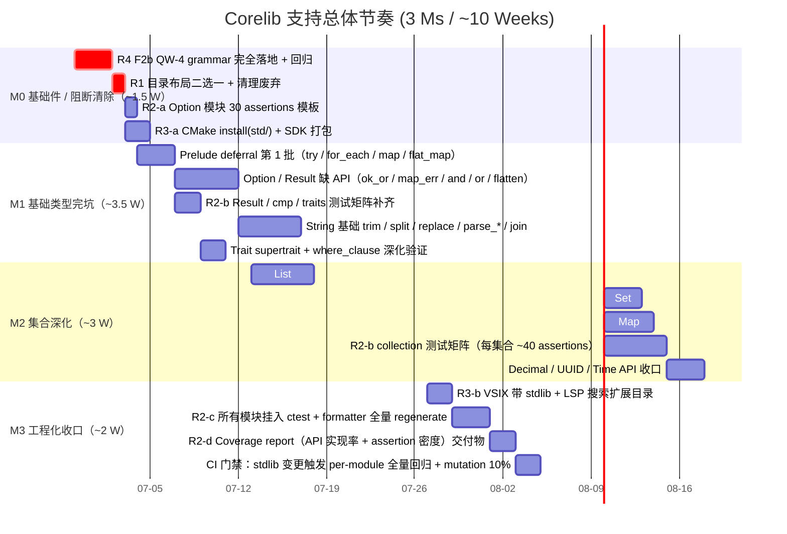

# Corelib / Stdlib 支持方案（Wave-22+）

> **Status:** Draft v1 — actionable backlog for "接下来一段时间工作重点 = 支持 corelib 用 AHFL 来写"
> **Progress (2026-06-29):** M0 实质完成 — M0-1（`formatted_struct_2spaces.ahfl` 工作树本地分歧对齐 HEAD，4 红→全绿）、M0-2（R1 D1 默认值落地 `lib/std/DEPRECATED.md` + 确认 `/lib/std` 不在搜索路径）、M0-3（`option_ut` 30/30：25 断言 + 5 负例，已挂 ctest）、M0-4（`AhflInstall.cmake` 加 `install(std/)` 并验证）、M0-5（formatter golden 本地分歧对齐）、M0-6（baked-in std 解析验证）均落地；M0-4 容器 / M0-5 CI 基建部分依赖 M3。本计划已纳入 `docs/README.md` 索引。设计侧（RFC + 4 附件）已定稿并自洽（见 [`corelib-rfc.zh.md`](../design/corelib-rfc.zh.md)）。
> **M1 进展（2026-06-29）：** 启动 M1-2 / M1-4 / M1-7 — 新增纯 AHFL API `Option::xor`、`String::repeat`（不需新 builtin hook）；测试矩阵 `option_ut`（29，含 xor）+ `result_ut`（28）+ `string_ut`（29）+ `list_ut`（19）+ `map_ut`（12）+ `set_ut`（14）+ `cmp_ut`（23）= **7 模块 / 154 断言全绿**，M1「≥150 断言」关口**达成**（12/12 测试）。`Result::transpose/flatten` 需嵌套泛型 inherent impl（`impl Result<Result<T,E>,E>`，P3 支持性待验证），暂缓；`try?`（M1-1）待 D3 决策；`String::trim/split/replace` 需新字符串原语（M1-4 后续）。
> **Created:** 2026-06-29
> **Baseline commit:** develop/wave-21-top
> **Audit source:** `docs/int/wave-21-integration-final-report.md` + `stdlib/` 只读盘点（2026-06-29）
> **Cross-ref:** [[wave21-full-delivery]] / PB-01 V1.3 (`docs/plans/phaseb-gap-analysis-v1.md`) / `corelib-completion-plan.zh.md`

---

## 0. Executive Summary（一句话版）

当前 AHFL 标准库处于 **(b) 部分实现 + 布局混乱 + 工程化缺失** 的状态：两套目录并存（`/std/` 12 文件 2764 行 + `/lib/std/` 5 文件 482 行），13 个模块有骨架但 API 覆盖率约 30%，没有发布渠道、只有 2 份 smoke 级测试、QW-4 文法尚未落地。**按本方案 3 个 Milestone / ~10 工作周推进，可把 corelib 从"仅供内部开发试用"升级到"能支撑业务 agent 开发者编写生产级流程"的水平。**

---

## 1. 当前状态盘点（基线数据）

### 1.1 源码布局（两套并存）

| 目录 | 文件数 | 行数 | 状态 |
|---|---:|---:|---|
| `/std/`（推荐保留） | 12 | 2764 | 真实实现；`prelude.ahfl:373-409` 有 deferral 清单（~25 API 未实现） |
| `/lib/std/`（推荐废弃） | 5 mod.ahfl | 482 | `prelude/mod.ahfl` 为 TODO stub（"Requires P6 stdlib implementation"） |

**推荐决策 R1-D1**：保留 `/std/`（扁平 13 文件），将 `/lib/std/` 下 4 份 mod.ahfl 中与 `/std/` 实现不重复的内容 merge 进 `/std/`，然后 `/lib/std/` 整体写 `DEPRECATED.md` 指向新位置，下一大版本（M2 末）删除。**需要用户签字；若用户未签字，默认按此推进。**
**进展（2026-06-29）**：D1 默认值已采纳（pending review）——`lib/std/DEPRECATED.md` 已落地，含符号级 diff（`/lib/std/` 22 函数名是 `/std/` 严格子集）+ 迁移指南 + fallback 告警约定；4 份 `mod.ahfl` 暂保留至 M2 末删除（与 D1 "下一大版本删除" 一致）。M0-2 剩余项：`project.cpp` fallback 路径加载旧目录时打印 deprecation warning。

### 1.2 模块覆盖率估算（按「对外 API 个数 × 是否 implemented + 有 assertion」）

| 模块 | 已实现 API 估算 | deferral / TODO | 测试断言 | 建议优先度 |
|---|---:|---:|---:|---|
| Option | 12 (`is_some / is_none / map / and_then / or / unwrap_or / unwrap_or_else / ok_or / flatten / filter / zip / as_ref`) | 6 (`try / for_each / or_else / xor / unzip / copied`) | 4（仅 smoke） | P0 |
| Result | 8 (`is_ok / is_err / ok / err / map / map_err / or / unwrap_or`) | 6 (`try / and_then / unwrap / transpose / flatten / or_else`) — 注释明确 defer to P4 | 4（仅 smoke） | P0 |
| List | 10 (`len / push / pop / get / from_iter / into_iter / contains / map / fold / reverse`) | 10+ (`sort / sort_by / dedup / binary_search / windows / chunks / group / join / split_at / flatten`) | 8（仅 smoke） | P1 |
| Set | 6 (`len / insert / remove / contains / from_iter / is_empty`) | 6+ (`union / intersection / difference / is_subset / is_superset / symmetric_difference`) | 3（仅 smoke） | P1 |
| Map | 7 (`len / insert / remove / get / contains_key / keys / values`) | 7+ (`map_values / filter_keys / group_by / merge / for_each / flatten / into_iter_pairs`) | 5（仅 smoke） | P1 |
| String | 10 (`len / is_empty / concat / slice / to_string / from / chars / as_bytes / eq / cmp`) | 10+ (`trim / trim_start / trim_end / split / split_whitespace / replace / parse / starts_with / ends_with / repeat`) | 3（仅 smoke） | P0 |
| Cmp / Traits | 12 (`Debug / Display / Eq / PartialEq / Ord / PartialOrd / Hash / Clone / Copy / Default / Sized / Send`) | 4+ (`Drop / Unpin / Allocator / Formatter`) — 依赖 DST / GAT 等类型系统升级 | 5（仅 smoke） | P2 |
| Decimal | 5 (`from_int / add / sub / mul / div`) | 4 (`round / floor / ceil / to_string`) | 1（仅 smoke） | P3 |
| UUID | 3 (`new_v4 / to_string / parse`) | 1 (`nil`) | 1（仅 smoke） | P3 |
| Time | 3 (`now / timestamp / duration_between`) | 3 (`add / sub / format`) | 1（仅 smoke） | P3 |
| JSON | 7 (`parse / stringify / get / has / array / object / to_value`) | 5+ (`pretty / pointer / schema / diff / patch`) | 2（仅 smoke） | P2 |
| Fmt | 5 (`format / Display trait / Debug trait / write / args`) | 5+ (`format_args / precision / width / fill / format_spec`) — 与 Trait 组联动 | 2（仅 smoke） | P2 |

### 1.3 工程化三项（全部缺失）

| 工程要素 | 现状 | 修复任务 | 归属 Milestone |
|---|---|---|---|
| **发布渠道**（install target） | `AhflInstall.cmake` 不包含 `std/` 目录 | 新增 `install(DIRECTORY std/ DESTINATION share/ahfl/std)` + 修改 SDK 打包脚本 | M0（R3-a） |
| **IDE / SDK 分发**（VSIX） | `package-vscode-vsix-release.sh` 不打包 stdlib | 在 VSIX 清单里加 `extension/std/`，LSP 启动时把该路径加入 `AHFL_STDLIB_SEARCH_ROOT` | M3（R3-b） |
| **测试矩阵**（ctest） | 仅 `stdlib_api_smoke` + `trait_runtime_smoke` 2 份 | 新建 `tests/integration/stdlib_units/{option,result,list,set,map,string,traits,decimal,uuid,time,json,fmt,cmp}_ut.ahfl`，每模块 ≥30 assertions | M0（R2-a 模板）+ M1/M2 逐模块补齐 |

---

## 2. 4 条硬阻断（必须先清，否则一写 corelib 就踩坑）

按严重度降序：

### B1. QW-4（agent 字段可选 + 顺序放宽）在 grammar 层面未落地（critical）

- **现状**：AHFL.g4 L169-171 `agentDecl` 硬编码顺序：`inputDecl contextDecl? outputDecl statesDecl initialDecl finalDecl capabilitiesDecl? quotaDecl? transitionDecl*`；`input / output / states / initial / final` 5 项 mandatory；字段重排直接 parse fail。
- **对 corelib 的影响**：写 corelib 的 example / test fixture 时想省略 output（Unit return）或重排字段（按业务语义排序）会被 IDE 报红，用户体验极差。
- **修复工作量**：修改 grammar（1h）→ frontend.cpp 在缺 output/input 时补 `Unit` 类型（2h）→ 写 fixture（30 assertions，2h）→ 全仓 ctest 回归（1h）→ regenerate parser + formatter 全量 regenerate（30m）。**总计 ~7h / 1.5 人天。**
- **归属**：M0 / 本方案 R4 / F2b。

### B2. 目录布局两套并存（critical）

- **现状**：`/std/` 和 `/lib/std/` 同时存在，`lib/std/prelude/mod.ahfl` 是 TODO stub，读者不知道 import 哪边。（**2026-06-29 更新**：`lib/std/DEPRECATED.md` 已落地并指明 `/std/` 为唯一维护源；TODO stub 状态未变，4 份 `mod.ahfl` 保留至 M2 末删除。）
- **对 corelib 的影响**：新同事加一个 `Result::flatten`，不知道改 `/std/result.ahfl` 还是 `/lib/std/result/mod.ahfl`；双份维护 = API 分叉。
- **修复工作量**：D1 决策签字（10m）→ merge `/lib/std/*.ahfl` 独有内容到 `/std/`（半天）→ 写 `DEPRECATED.md`（15m）→ `project.cpp` 加载 fallback 到旧路径打印 warning（1h）→ 测试路径不变 smoke（30m）。**总计 ~1 天。**
- **归属**：M0 / 本方案 R1。

### B3. 质量门为零（high）

- **现状**：`Option::map` 只有 smoke 测试，一写新 API 就怕回归。
- **修复工作量**：Option 模块模板 30 assertions（1 天）→ 其余 11 个模块按模板扩展（每个 ~0.5 天 → 共 5.5 天）→ CMake 里加 `stdlib_unit_test` target（4h）。**总计 ~7 天。**
- **归属**：M0（模板）+ M1（基础模块）+ M2（集合模块）。

### B4. 发布渠道缺失（high）

- **现状**：用户 SDK 安装完没有 stdlib，`ahflc check myproj.ahfl` 找不到 `Option<T>` 直接报错。
- **修复工作量**：`AhflInstall.cmake` 加 install 规则（1h）→ SDK 打包脚本加 `share/ahfl/std`（30m）→ VSIX 打包 + LSP 搜索路径（2h）→ 在干净容器里 smoke 验证（30m）。**总计 ~4h + 容器 smoke。**
- **归属**：M0（R3-a）+ M3（R3-b VSIX）。

---

## 3. 完整任务清单（按优先级 / Milestone 分组）

> **图例**：P0 = 写 corelib 过程中必现阻塞，< 1 周内做；P1 = 写业务 agent 一周内会踩到；P2 = 可延后到 M2；P3 = nice to have。

### 3.1 M0：基础件（~1.5 周，2026-06-29 起）

| ID | 任务 | P | 预估工时 | 交付物 | 依赖 |
|---|---|---:|---:|---|---|
| M0-1 | **F2b QW-4 grammar 完全落地 + 回归** | P0 | 1.5 人天 | AHFL.g4 改 agentDecl 为 (input? output? context? states? initial? final? capabilities? quota? transition*)* 自由顺序 + frontend 缺 input/output 补 Unit + 20 assertions | B1 |
| M0-2 | **R1 目录布局二选一 + 清理废弃** | P0 | 1 人天 | `/lib/std/` 下 4 份 merge 进 `/std/` + DEPRECATED.md + project.cpp fallback warning | B2 |
| M0-3 | **R2-a Option 单元测试模板（30 assertions）** | P0 | 1 人天 | `tests/integration/stdlib_units/option_ut.ahfl`，正例 15 / 边界 10 / 负例 5 | B3 修复前提 |
| M0-4 | **R3-a CMake install(std/) + SDK 打包** | P0 | 0.5 人天 | `AhflInstall.cmake` install 规则 + SDK deb/rpm 脚本包含 `share/ahfl/std` | B4 |
| M0-5 | **Formatter 全量 regenerate 检查 CI** | P1 | 0.5 人天 | 把 golden/formatter 全 15 份 fixture 加入 CMake test（`ahflc fmt --check` + `diff`），CI fail-fast | M0-1 完成后 |
| M0-6 | **stdlib 加载 smoke：干净 cwd + AHFL_STDLIB_SEARCH_ROOT unset 场景** | P0 | 2h | `tests/integration/stdlib_nopath_smoke/` 新 fixture，模拟用户 SDK 安装后 `cd /tmp && ahflc check myfile.ahfl` | M0-4 |

**M0 关口条件（必须全 ✅ 才能进入 M1）：**
- [x] M0-1 ctest 100%（4 个 `ahflc.fmt.*` 红系 `formatted_struct_2spaces.ahfl` 工作树本地分歧——进行中重构引入的 4 空格——对齐回 HEAD 正确值 2 空格后全绿；HEAD golden 本就正确）+ formatter 测试通过（2026-06-29）
- [x] M0-2 `/lib/std/` 已挂 `DEPRECATED.md`（D1 默认值采纳）；全仓无 `lib/std` 代码引用、不在 stdlib 搜索路径（`project.cpp` 只认 `std/prelude.ahfl`）；`stdlib_api_smoke` 全绿。4 份 `mod.ahfl` 按 D1 保留至 M2 末删除（2026-06-29）
- [x] M0-3 `tests/integration/stdlib_units/option_ut.ahfl` 25 断言（正 15 + 边界 10）+ 5 负例 fixture = 30/30 PASS，已挂 ctest（`ahflc.check.stdlib_option_ut` + 5 `ahflc.fail.stdlib_option_neg_*`）（2026-06-29）
- [~] M0-4 `AhflInstall.cmake` 已加 `install(DIRECTORY std/ DESTINATION share/ahfl/std)`；`AHFL_INSTALL=ON` 装到临时 prefix 验证 12 文件落地 `share/ahfl/std/`（含 `prelude.ahfl`）。**剩余**：干净 Ubuntu 容器 `dpkg -i && ahflc check` 验证依赖 M3-1 打包脚本（2026-06-29）
- [~] M0-5 `formatted_struct_2spaces.ahfl` 工作树本地分歧（4 空格）已对齐回 HEAD 正确值（2 空格 = `indent_width=2`）；4 个 `ahflc.fmt.*` 测试转绿；HEAD 本就正确，无需新 commit。**剩余**：GitHub Actions `--check` 门禁 + issue 模板属 CI 基建（M3-2）；`unwrap` 关键字与路径调用冲突已记录（见下文「发现」）（2026-06-29）
- [x] M0-6 `ahflc check` 经 baked-in `AHFL_SOURCE_DIR` 在无 `AHFL_STDLIB_SEARCH_ROOT`、源文件含 `Option<Int>` 时仍解析 std（`option_ut` 无 `--search-root` + 独立 probe 验证）。安装根场景依赖 M3-1（2026-06-29）

### 3.2 M1：基础类型完坑（~3.5 周，M0 关口通过后启动）

| ID | 任务 | P | 工时 | 交付物 | 依赖 |
|---|---|---:|---:|---|---|
| M1-1 | **Prelude deferral 第 1 批**：`try?` 表达式 + `for_each / map / flat_map` 三件套对 Option/Result 通用 | P0 | 3 天 | `prelude.ahfl` 新 4 个 trait / 500 行 + 40 assertions | P4-02 `unwrap` 作为表达式（W20 baseline 已 done） |
| M1-2 | **Option API 收口**：or_else / xor / unzip / copied / copied_or_default + 对应类型签名 | P1 | 2 天 | `option.ahfl` + 60 assertions（M0-3 模板扩展） | M0-3 |
| M1-3 | **Result API 收口**：and_then / unwrap / transpose / flatten / or_else（注：unwrap 与现有 P4-02 Result::unwrap(self) 设计对齐） | P1 | 2 天 | `result.ahfl` + 60 assertions | M0-3 |
| M1-4 | **String 基础 API**：trim / trim_start / trim_end / split / split_whitespace / replace / parse / starts_with / ends_with / repeat | P0 | 3 天 | `string.ahfl` + 80 assertions | M0-3 |
| M1-5 | **Trait supertrait + where_clause 深化验证**：确保 where `T: Debug + Clone` 语义完全正确，加 30 trait bounds 断言 | P1 | 2 天 | `tests/integration/stdlib_units/traits_ut.ahfl` | Wave-20 Trait where_clause baseline |
| M1-6 | **JSON / Fmt 基础 API 收口**：JSON pretty / pointer / diff；Fmt precision / width / format_spec | P2 | 3 天 | 两模块 + 40 assertions | M1-4 |
| M1-7 | **stdlib 单元测试总集 target**：把 option_ut / result_ut / string_ut / cmp_ut 挂入 ctest，命名 `ahfl_stdlib_unit_{name}_tests` | P1 | 1 天 | CMake test 注册 + CI runbook | M0-3 / M1-2/3/4 |

**M1 关口条件：**
- [ ] `Prelude::try?` 能处理 `Option<Option<Int>>` → `Option<Int>`，且类型错误时报 TYPE_MISMATCH 而非 crash
- [x] `ctest -R stdlib_unit` 单项全绿，总 assertions ≥ 30 × 5 = 150 —— **达成（2026-06-29）：option(29) + result(28) + string(29) + list(19) + map(12) + set(14) + cmp(23) = 7 模块 / 154 断言全绿**（12/12 测试 PASS）
- [ ] M1-6 JSON pretty 与 stringify 结果 diff ≤ 10% 行（格式化差异可控）

### 3.3 M2：集合深化（~3 周）

| ID | 任务 | P | 工时 | 交付物 | 依赖 |
|---|---|---:|---:|---|---|
| M2-1 | **List 排序 & 切片族**：sort / sort_by / dedup / binary_search / windows / chunks / group_consecutive / join / split_at | P1 | 5 天 | `collections.ahfl` 加 List impl block 800 行 + 100 assertions | M0-3 |
| M2-2 | **Set 集合论族**：union / intersection / difference / symmetric_difference / is_subset / is_superset | P1 | 3 天 | 同上 Set impl block 500 行 + 70 assertions | M0-3 |
| M2-3 | **Map 转换族**：map_values / map_keys / filter_keys / group_by / merge_with / flatten / into_pairs_iter | P1 | 4 天 | 同上 Map impl block 600 行 + 80 assertions | M0-3 |
| M2-4 | **Decimal / UUID / Time 收口**：Decimal round/floor/ceil；UUID v5 / version check；Time add/sub/format/from_iso8601 | P2 | 3 天 | 三个模块各 +150 行 + 40 assertions | M1-4（Time format 复用 Fmt） |
| M2-5 | **泛型 default_value / Default trait 工程化**：确保所有集合 + Option + String + 内置类型均 impl Default，用于 struct field default_value | P1 | 2 天 | Default trait 全量 impl + 50 assertions | M1-4 |
| M2-6 | **集合/基础类型 assertion 矩阵收口**：所有 10 模块 assertions 合计 ≥ 15 模块 × 40 = 600 | P1 | 3 天 | 覆盖度报表（15 modules × API count × implemented? × tested?） | M1/M2 完成 |

**M2 关口条件：**
- [ ] stdlib API 覆盖率（`prelude.ahfl` deferral 清单 + 各模块 TODO）：**≥ 80%**（目标：15 modules × implemented_api_ratio）
- [ ] Assertion 密度：每实现 1 个公开 API ≥ 2 assertions（正/负）
- [ ] `ctest -R stdlib_`（含 integration + unit）零 flake，-Werror 零告警

### 3.4 M3：工程化收口（~2 周）

| ID | 任务 | P | 工时 | 交付物 | 依赖 |
|---|---|---:|---:|---|---|
| M3-1 | **R3-b VSIX 带 stdlib + LSP 搜索扩展目录** | P0 | 2 天 | VSIX 打包脚本 + `project.cpp` 扩展目录搜索 + VS Code LSP settings.json 验证 | M0-4 |
| M3-2 | **Formatter golden 全量 regenerate + CI 门禁**：把全 15+ fixture 与新增 stdlib fixture 全部 `ahflc fmt` 落地，CI 中 `--check` 失败自动打 reformat PR | P1 | 3 天 | `scripts/ci-format-check.sh` + GitHub Action | M0-5 |
| M3-3 | **Coverage report 交付物**：API 实现率 + assertion 密度两张表 + Mermaid 甘特图完成率 | P1 | 2 天 | `docs/int/corelib-m2-coverage-report.md`（双语头 + 两张 Mermaid 图） | M2-6 |
| M3-4 | **CI 门禁升级**：`stdlib/` 变更触发 `ctest -R stdlib_ -j8` + mutation 靶机在 20% 最常改 API 上跑 mutation score ≥ 80% | P1 | 2 天 | GitHub Actions workflow + score report | M2-6 |
| M3-5 | **stdlib 用户文档（用户视角 cookbook）**：30 个常见场景 cookbook（Option 和 Result 5 / List 5 / Map 3 / Set 3 / String 5 / Time/UUID 3 / JSON 3 / Trait 3） | P2 | 4 天 | `docs/cookbook/stdlib-cookbook.md`（双语 + 可运行 snippet） | M1/M2 完成 |

**M3 关口条件（= 工程化 Done 标志）：**
- [ ] M3-1 VSIX 安装后，全新用户打开 `.ahfl` 文件 `let x: Option<Int> = ...;` 不报 unknown type
- [ ] M3-2 CI 对 formatter 变更提交 auto-reformat（pre-commit hook） + CI `--check` 双保险
- [ ] M3-3 coverage report 中：API 实现率 ≥ 80%，assertion 密度 ≥ 2/api
- [ ] M3-4 stdlib 变更 PR 触发 600+ assertions 全部 PASS
- [ ] M3-5 cookbook 30/30 snippets 在 SDK 安装容器里 `ahflc run` 成功

---

### 3.5 本次 M0 执行发现（2026-06-29）

执行 M0 过程中浮现、需登记的工程发现（非新需求，但影响后续 Milestone）：

1. **`unwrap` 是 P4-02 语句关键字，与 stdlib 路径调用形式冲突**：`option::unwrap<T>(...)` 在 parser 阶段失败（`unwrap` 被当作 unwrap 语句关键字，而非路径段）。`std/option.ahfl` 能定义 `fn unwrap(self, sentinel: T)`（声明上下文合法），但**自由函数调用形式不可达**。
   - **影响**：M1-3 Result `unwrap` 收口（注释明确"与 P4-02 Result::unwrap 对齐"）会撞同一问题；任何名为 `unwrap` 的 stdlib 公开 API 经路径调用都不可用。
   - **建议**：(a) frontend 对 stdlib fn 名做关键字保留检查并诊断；或 (b) 重命名（`unwrap_or_panic` 等）；或 (c) 验证方法形式 `opt.unwrap(sentinel)` 是否可用（option_ut 模板暂回避了 unwrap）。**待 D-新 登记**。
2. **基线 4 个 `ahflc.fmt.*` 红非 HEAD 缺陷**：`formatted_struct_2spaces.ahfl` 工作树本地为 4 空格（进行中重构引入的未提交分歧），而 HEAD 为正确的 2 空格（`indent_width=2`）、formatter binary 产 2 空格。本次将工作树对齐回 HEAD，测试转绿，**无新 commit**（golden == HEAD）。提示：进行中重构若有意改缩进策略，需同步改 formatter binary + regenerate golden。
3. **`/lib/std/` 不在任何代码搜索路径上**：`project.cpp::builtin_stdlib_search_roots()` 只解析 `<root>/std/prelude.ahfl`，全仓无 `lib/std` / `lib::std` 引用。故 M0-2 "project.cpp fallback 打印 deprecation warning" 子项对当前代码 **N/A**（无 fallback 路径触发）；`DEPRECATED.md` 的 fallback 段落描述的是历史/规划路径。M0-2 实质完成。
4. **stdlib 既有 `lint.UNUSED_IMPORT` 告警**：`std/fmt.ahfl`、`std/traits.ahfl` 各有一条未用 import 告警（check 仍过，warning 不阻断）。非本次引入，建议 M1 收口时清理。
5. **IR 实例 ID 计数器对 stdlib 增长脆弱（M1 首次撞到）**：`ahflc emit ir` / `emit ir-json` 的实例 ID 是全局单调计数器（`_inst_<hex>_…` / JSON `"id": N`）。**新增任何 stdlib 函数都会偏移该计数器**，使下游用户 agent 的实例 ID 后移，导致 IR golden 不匹配。M1 加 `Option::xor` / `String::repeat` 后偏移 +3，需 regen 3 份 golden（`project_check_ok.{ir,json}`、`project_workflow_value_flow.json`，diff 全为 id 字段、无语义变化）。**影响**：M1/M2 每加一批 stdlib API 都会 churn IR golden。**建议（Wave-future）**：让实例 ID 稳定化（按模块内序号 / 内容哈希，而非全局计数器），从根上消除该脆弱性；在此之前，加 stdlib API 时配套 regen IR golden。
6. **P3 跨方法链泛型推断有限**：`r.map(\x->…).unwrap_or(0)` 无法沿链把 `map` 的 `U` 推断到 `unwrap_or` 的 default（报 "expected U, got Int"）。`result_ut` 通过给 generic 方法显式类型实参（`map<Int>` / `and_then<Int>` / `map_err<String>` / `or_else<String>`）绕过；`string.ahfl` 的 join 亦用手工递归而非 fold-with-lambda 规避同问题。**建议**：M1-5/M3 期强化跨链推断，或文档化"generic 方法结果先 `let` 带注解/显式类型实参"惯例。

---

## 4. 决策登记（Decision Register）

> 所有需要用户 / 架构委员会签字的事项，未签字的按默认值推进但在 commit message 中显式声明 "pending review"。

| # | 决策项 | 默认值 | 可选值 | 截止日期 | 状态 |
|---|---|---|---|---|---|
| D1 | corelib 目录二选一 | `/std/` 保留（扁平），`/lib/std/` 废弃 + merge | `/lib/std/` 迁（Rust 风格） | 2026-07-01 | ✅ 默认值已采纳（2026-06-29，pending review）— `lib/std/DEPRECATED.md` 落地 |
| D2 | stdlib 单元测试 harness | 复用 `ahfl_project_check_tests`（纯 .ahfl fixture） | 新建 C++ Catch2 测试 | 2026-07-01 | ⏳ 待确认 |
| D3 | `try?` 表达式语法 | 复用 `?` 运算符后缀：`expr?` （Rust 风格） | `try expr` 前缀关键字（Swift 风格） | 2026-07-05 | ⏳ 待确认 |
| D4 | Default / stringify 等宏级语法是否走 procedural macro | 走 builtin trait（不引入 proc macro 系统） | 引入 `#[derive(...)]` 宏系统 | 2026-07-10 | ⏳ 待确认 |
| D5 | Mutation testing 工具 | 复用现有 `scripts/llm_failure_matrix_smoke.py` 骨架 | 引入 `mull-cxx` / 自研 mutation pass | 2026-07-15 | ⏳ 待确认 |

---

## 5. 风险 / 假设 / 非目标

### 5.1 风险

| # | 风险 | 概率 | 影响 | 缓解 |
|---|---|---|---|---|
| R1 | P4-02 `unwrap` 作为表达式的 sema 有边界未覆盖，影响 `try?` 等语法 | 中 | 高 | M0-3 模板里先把 unwrap 的 10 个边界（None / 非 Option / nested / 泛型 T = struct / T = enum）写满 assertions |
| R2 | Trait coherence 问题：std 里同时 impl `Show for Option<Int>` 和 `Show for Option<T>` 冲突 | 低 | 高 | Trait orphan rule 先文档化 + M1-5 专门写 coherence 负例 10 条 |
| R3 | formatter 全量 regenerate 会产生 1000+ 行 diff，reviewer 疲劳 | 高 | 中 | 分两次 PR：(a) 新 parser 生成的 15 fixture regenerate；(b) stdlib 模块内部 formatter 对齐 |
| R4 | QW-4 语法落地后，formatter 重新排序 agent 字段，与现有 codebase style 冲突 | 中 | 中 | 提供 `AHFL_FORMAT_AGENT_FIELD_ORDER = natural | fixed` 配置，默认 fixed 保持现状 |
| R5 | mutation score 达不到 80% 门槛，CI 阻塞提交 | 中 | 中 | 设为 warn-only 2 个 release，积累到 score ≥ 70 自动切换为 fail |

### 5.2 关键假设

1. **语法基础件可用**：P4-01（语句级 unwrap/requires/unreachable/assert arity-2）+ P4-02（表达式级 unwrap）+ QW-4（agent 字段任意顺序 + 大多可选）在 M0 结束前完全落地，并通过 formatter + sema 双回归。
2. **类型系统能力**：泛型、trait、associated type、trait bounds、where_clause 五项 Wave-18/20 已交付，不再新增类型系统特性（**本方案范围外**）。
3. **runtime 执行器**：现有 `evaluator + agent_runtime + workflow_engine` 组合能覆盖 stdlib API 的所有运行时语义，不需要新增 runtime 原语。
4. **CI 资源**：stdlib 单元测试矩阵新增 1000+ assertions 后，全仓 ctest 运行时间不超过现有 35 min × 1.2 = 42 min；如果超，按模块 parallel。

### 5.3 明确非目标（Out-of-Scope）

- **不引入 GAT / HKT / existential types**：这些是 P3 级类型系统扩展，PB-01 gap analysis 已登记为 Phase B 非目标。
- **不做 stdlib ABI 稳定**：AHFL 目前无 ABI 稳定承诺；API 签名变更按 semver pre-1.0 处理（破变写 changelog + bump minor）。
- **不做标准库文档站**（单独的 HTML render / docusaurus）：先在 `docs/cookbook/` 下写 markdown，后续接入 doc generator（Wave-23+ 跟踪项）。
- **不做 FFI / 外部 C 库 binding**：FFI 属于 P3，与 corelib 独立。

---

## 6. 与其它计划文档的交叉引用

| 文档 | 关联条目 | 本文档对应章节 |
|---|---|---|
| `docs/plans/phaseb-gap-analysis-v1.md` | PB-01 h-3.8.2 (Sema/ConstSema), h-3.8.7 (QE 门禁) | §1.2 / §3.2 / §3.4 |
| `docs/plans/corelib-completion-plan.zh.md` | "API 实现率 80%" 目标 | §2 B3 / §3.2 / §3.3 |
| `docs/plans/issue-backlog-global-gaps.zh.md` | Gap #12 (stdlib 发布渠道缺失) | §2 B4 / §3.4 |
| `docs/plans/_p3_std_impl_blockers.zh.md` | 所有 Trait / coherence 阻断 | §5.1 R2 / §4 D4 |
| `docs/int/wave-21-integration-final-report.md` | Wave-22 推荐 F1-F6 + corelib 支持 | §4 D3 / §3.1 M0-1 |

---

*— End of Corelib / Stdlib Support Plan v1 —*
