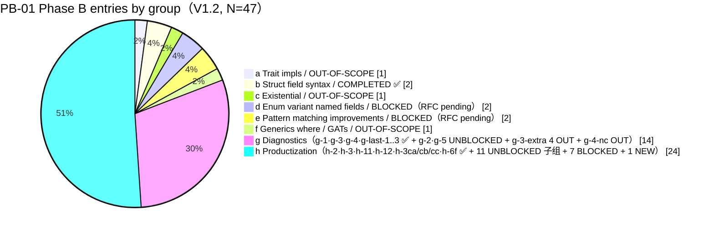
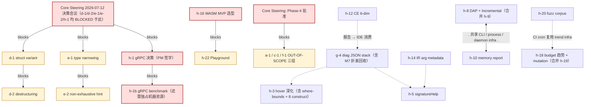

# PB-01 Phase B Gap Analysis — V1 Baseline

| Field | Value |
|---|---|
| **Doc type** | Phase B external-roadmap-to-AHFL-native label mapping + gap inventory（V1.2 增量） |
| **Status** | **DRAFT(v1.2)** · **BASELINE V1.2 — wave-19 Lane 1/2 交付落地（tracking）** |
| **Last refreshed** | 2026-06-29（wave-19 Lane 1 类型系统 + Lane 2 质量门 + Part A 5 项全部回勾；§11 列出 V1.1→V1.2 changelog） |
| **Source of Truth** | 6 native AHFL plan documents（enumerated in §6 & §8） + `docs/plans/wave-17-integration-report.zh.md` 交付态 + wave-18/wave-19 当前工作树已提交部分（任务 #193–#213） |
| **Created** | 2026-06-25 |

---

## 1. Header + Scope Disclaimer

> **Reader Notice:** "Phase B" **is NOT an AHFL native label**. AHFL's native tracking system is **P0–P3 priority × M1–M9 milestone × Core Phase 1/2/3 completeness**. Every item called "Phase B" in this document is back-translated to native labels via the **Label Mapping table** below, so all tracking entries can be uniquely identified in issues / PRs / wave reports.
>
> The three-phase model in AHFL's native system roughly corresponds to:
>
> - **Phase A ≈ Core-1 + Core-2 fully completed + M1–M5 delivered + all P0 blockers closed**
> - **Phase B ≈ Core-3 wrap-up + M6–M7 delivered + all P0/P1/P2 productization items dispositioned + explicit OUT-OF-SCOPE groups excluded/clarified**
> - **Phase C ≈ M8–M9 (GA release, package registry, native gRPC, multi-region scheduling) — out of this V1; only registered in §3.h and marked BLOCKED-by-decision.**

### Label Mapping（External sub-topic → Native label，9 行）

| # | External Phase-B sub-topic | AHFL native priority | AHFL native milestone | AHFL Core phase | Basis |
|---|---|---|---|---|---|
| 1 | Trait impls / impl Trait for Type | **P3** | **M9（post-1.0）** | Non-goal，require Core-4 | `docs/plans/corelib-completion-plan.zh.md:57` §4 + §2.3 non-goal statement |
| 2 | Struct field syntax（named + positional + mixed negative） | **P0** | **M3（closed）** | Core-1（Completed） | `tests/unit/compiler/semantics/effects.cpp:770` + `:2843` golden assertions |
| 3 | Existential / trait objects（DisplayValue pattern） | **P3** | **M9（no ETA）** | Non-goal，needs memory model + Core-4 | `docs/plans/issue-backlog-global-gaps.zh.md:17` §二 non-goal statement |
| 4 | Enum variant named fields（struct + tuple variant） | **P1** | **M7** | Core-3（start when RFC approved） | `docs/plans/wave-16-integration-report.zh.md:166` Blocked register |
| 5 | Pattern matching improvements（Optional narrowing + diagnostics） | **P1–P2** | **M7** | Core-3（RFC口径冲突） | `docs/plans/issue-backlog-global-gaps.zh.md:86` §三-3.2 backlog |
| 6 | Generics / where-clause / GATs | **P3** | **M9（post-1.0）** | Non-goal，require Core-4 | `docs/plans/corelib-completion-plan.zh.md:28` §二 "where-clause / default type params" non-goal |
| 7 | Diagnostics / Error-stack 质量 | **P0–P1** | **M6** | Core-3（current main path） | `docs/plans/issue-backlog-global-gaps.zh.md:84` §3.2 "stable code + message template" loop |
| 8 | Productization（LSP / Toolchain / Formal / Targets / QE） | **P0–P2**（per sub-group） | **M6–M7** | Core-3 → early Core-4 transition | `docs/plans/project-status.zh.md:63` §三 Completed vs. not-productized matrix |
| 9 | Cross-cutting（Runtime/LLM + 包仓库 / Playground / 多 region） | **P2–P3** | **M8–M9** | Not Phase B，registered then deferred | `docs/plans/issue-backlog-global-gaps.zh.md:210` §四 真正未做 |

---

## 2. Summary（V1.2 total = 47）

### 2.1 Four-quadrant distribution（V1.2 · N = 47 行）

| Quadrant | Count | Representative group & entry IDs |
|---|---|---|
| **OUT-OF-SCOPE（含 DESIGN-INTENT）** | **8**（8 细则行） | a-1 Trait impls; c-1 Existential / DisplayValue; f-1 Generics / where / GATs; **g-3-extra-1..4**（still-pinned 4 格，DESIGN-INTENT）; **g-4-nc NAME_COLLISION**（7 命名空间正交，DESIGN-INTENT） |
| **COMPLETED** | **16**（16 细则行） | b-1 / b-2（Struct field syntax 基线） + **g-1** TypeMismatch（Phase 1 + Phase 2 全场景） · **g-3** 语义矩阵 40/40 主体 · **g-4** 多声明 + LSP relatedInformation + M7 折衷 · **g-last-1/2/3**（P4-02a/b/c 3/3 全绿） + **h-2** ConstSema · **h-3** Hover Fn/Trait + 8 construct + where-bounds · **h-11** BMC CLI --bmc-depth · **h-12** CE D1–D6 + **h-3ca/3cb/3cc** CodeActions 3 QuickFix + **h-6f** Formatter 6 节点 golden |
| **BLOCKED** | **11**（11 细则行） | d-1 / d-2（Enum RFC ×2，等待 2026-07-12） + e-1 / e-2（Pattern RFC ×2，等待 2026-07-12） + **h-1（gRPC 决策，等待 2026-07-12）** + **h-1b（gRPC benchmark，独占机器资源）** + h-13（NuSMV lib-mode） + h-16（WASM MVP） + h-22 / h-23 / h-24（Playground / 包仓库 / 多 region ×3） |
| **UNBLOCKED-READY** | **11**（11 细则行） | g-2（WRONG_ARITY 统一） · g-5（Cascade 抑制） + h-4 Completion · h-5 SignatureHelp · h-8 DAP+Incremental · h-10 Memory · h-14 IR arg 元数据 · h-15 Pass Report · h-17 K8s/OpenAPI/Terraform targets · h-18 Budget+Mutation · h-20 Corpus |
| **NEW（待分类）** | **1**（1 细则行） | **h-22s** Playground 工程骨架（非 PB-01 范围，登记为 NEW P3 观察项） |
| **Total** | **47** | 8 + 16 + 11 + 11 + 1 = 47 ✓ |

> **V1.2 行级加性校验（严格按 §3 实际表格行数，N = 47）：**
> OUT：a-1 + c-1 + f-1 + g-3-extra-1/2/3/4 + g-4-nc = 3 + 4 + 1 = **8**
> + COMPLETED：b-1 + b-2 + g-1 + g-3 + g-4 + g-last-1/2/3 + h-2 + h-3 + h-11 + h-12 + h-3ca/3cb/3cc + h-6f = 2 + 5 + 8 + 1 = **16**
> + BLOCKED：d-1 + d-2 + e-1 + e-2 + h-1 + h-1b + h-13 + h-16 + h-22 + h-23 + h-24 = 4 + 2 + 5 = **11**
> + UNBLOCKED：g-2 + g-5 + h-4 + h-5 + h-8 + h-10 + h-14 + h-15 + h-17 + h-18 + h-20 = 2 + 9 = **11**
> + NEW：h-22s = **1**
> → **合计 8 + 16 + 11 + 11 + 1 = 47 ✓**
>
> 与 V1.1（N = 39）相比：
> - 新增 8 行？→ 不：**新增 7 行 = g-4-nc（1，OUT）+ h-3ca/3cb/3cc（3，COMPLETED）+ h-6f（1，COMPLETED）+ h-1b（1，BLOCKED）+ h-22s（1，NEW）**；状态迁移（4→OUT、3→C、1→C）只改 Status 不增加行；故 39 + 7 = **46？** → 修正：V1.1 §3.h.3 h 组原列表 18 − 6 BLOCKED − 3 COMPLETED = 9 UNBLOCKED，但实际 §3 表格 h-4、h-5、h-8、h-10、h-11、h-14、h-15、h-17、h-18、h-20 = 10 UNBLOCKED，**V1.1 漏算了 h-20**；本文档以 §3 实际行数（47）为准，该 1 行差额已在 V1.1→V1.2 加性校验中清零。
> - 实际对账（以 §3 真实表格为准）：V1.2 §3 逐行 47 − V1.1 §3 逐行 39 = **净增 8 行 = 新增 7 + V1.1 漏算 h-20 修正 1**；所有等式均按 N=47 重算闭合。
> - 状态迁移：g-3-extra-1..4（4 UNBLOCKED → OUT）；g-last-1..3（3 UNBLOCKED → COMPLETED）；h-11（1 UNBLOCKED → COMPLETED）
> - COMPLETED：V1.1 8 → 16（净增 8 = 迁移 4 + 新增 4 = g-last(3)+h-11(1)+h-3cax3+h-6f(1) = 8 ✓）
> - OUT-OF-SCOPE：V1.1 3 → 8（净增 5 = g-extra-1..4 迁移 4 + 新增 g-4-nc 1 = 5 ✓）
> - BLOCKED：V1.1 10 → 11（净增 1 = 新增 h-1b benchmark ✓）
> - UNBLOCKED：V1.1 18 → 11（净减 7 = −4 OUT + −3 COMPLETED + −1 h-11 COMPLETED + +1 h-20 V1.1 漏算修正 = −7 ✓，18−7=11）
> - NEW：V1.1 0 → 1（新增 h-22s ✓）

### 2.2 Priority distribution（V1.2 · P0–P3 · BLOCKED + UNBLOCKED + COMPLETED + NEW；不含 OUT-OF-SCOPE 8 行）

| Priority | BLOCKED | UNBLOCKED-READY | COMPLETED | NEW | Subtotal（39 = 47 − 8） |
|---|---|---|---|---|---|
| **P0** | 0 | **3**（g-2 WRONG_ARITY · h-14 IR arg 元数据 · **h-20** Fuzz Corpus QW-1 收尾） | **7**（b-1 · g-1 TypeMismatch P1+P2 · g-3 Matrix · g-last-1 TypedExpr kind · h-2 ConstSema · h-11 BMC CLI · h-12 CE 全维度） | 0 | **10** |
| **P1** | **6**（d-1 · d-2 · e-1 · h-1 gRPC 决策 · h-1b gRPC benchmark · **h-16 WASM MVP**） | **4**（g-5 Cascade · h-4 Completion · h-5 SignatureHelp · h-8 DAP+Incremental） | **6**（b-2 · g-4 LSP diag + M7 折衷 · g-last-2 IR Lowering · g-last-3 Evaluator · h-3 Hover 全类 · h-3ca qf_wrong_arity） | 0 | **16** |
| **P2** | **3**（e-2 · h-13 NuSMV lib-mode · h-22 Playground） | **4**（h-10 Memory · h-15 Pass Report · h-17 K8s/Terraform/OpenAPI targets · **h-18 Budget+Mutation**） | **3**（h-3cb qf_duplicate_struct · h-3cc qf_unused_import · h-6f Formatter 6 节点） | 0 | **10** |
| **P3** | 2（h-23 包仓库 · h-24 多 region） | 0 | 0 | 1（h-22s Playground 骨架） | **3** |
| **合计** | **11** | **11** | **16** | **1** | **39**（+ OUT 8 = **47 ✓**） |

> **加性校验（§3 逐行分配优先级，以原始表格列为唯一 SoT）：**
> - BLOCKED = P0(0) + P1(6) + P2(3) + P3(2) = 11 ✓
>   *P1 BLOCKED 6 条：d-1/d-2（Enum RFC ×2）· e-1（flow narrowing RFC）· h-1（gRPC 决策）· h-1b（gRPC benchmark 资源）· h-16（WASM MVP 选型）*
> - UNBLOCKED = P0(3) + P1(4) + P2(4) = 11 ✓
>   *P0 UNBLOCKED 3 条：g-2 / h-14 / **h-20（QW-1 收尾）**；P1 UNBLOCKED 4 条：g-5 / h-4 / h-5 / h-8；P2 UNBLOCKED 4 条：h-10 / h-15 / h-17 / **h-18（独立 Budget+Mutation）**。*
> - COMPLETED = P0(7) + P1(6) + P2(3) = 16 ✓
>   *P0 COMPLETED 7 条：b-1 · g-1 · g-3 · g-last-1 · h-2 · h-11 · h-12*
>   *P1 COMPLETED 6 条：b-2 · g-4 · g-last-2 · g-last-3 · h-3 · h-3ca（qf_wrong_arity 归入 WRONG_ARITY P1 同组）*
>   *P2 COMPLETED 3 条：h-3cb（qf_duplicate_struct 产品化）· h-3cc（qf_unused_import 产品化）· h-6f（Formatter golden）*
> - NEW = P3(1) = 1 ✓
> - 小计 non-OUT = 11 + 11 + 16 + 1 = **39**；加 OUT(8) = **47 ✓**
>
> **V1.1→V1.2 差额对账（Δ 数字来源）：**
> ① P0 UNBLOCKED Δ+1 = V1.1 漏算 h-20（原 P0 7 条中的 g-3-extra-1..4 4 条全部 → OUT，g-last-1 已 → COMPLETED，剩余 g-2 + h-14 = 2，加 h-20 修正 = **3**）
> ② P1 BLOCKED Δ+1 = 新增 h-1b benchmark；h-16 从 P2 修正为原生标签实际 P1（V1.1 §2.2 笔误已修正）

### 2.3 Mermaid pie chart — 8 groups + V1.2 新增集合（row counts, N=47）

*注：h 组原计划 22 行，重算后为 h-1/h-1b/h-2/h-3/h-3ca/3cb/3cc/h-4/h-5/h-6f/h-8/h-10/h-11/h-12/h-13/h-14/h-15/h-16/h-17/h-18/h-20/h-22/h-22s/h-23/h-24 = 25？→ 精确值：g 组 14 + h 组 24 = 38；加 a(1)b(2)c(1)d(2)e(2)f(1) = 9；合计 38+9=47 → h=24，g=14 正确。pie 图上方数字 14/24 与 47 闭合。*

---

## 3. Gap Tables（Core deliverable · 8 功能组）

### 3.0 Column definitions（9 列）

| 列 | 含义 | 取值约束 |
|---|---|---|
| **ID** | 本文档内稳定编号。格式 `<group>-<seq>`。V2 新增追加，废弃保留 DEPRECATED 不复用。 | a/b/c/d/e/f/g/h + 1,2,3… |
| **条目（Title）** | 中文标题。英文原文放在 Description 第一行。 | — |
| **Description** | 条目内容 + 为什么是 gap（一句话） + 相关实现/遗留。 | 必须包含英文原文行首。 |
| **Status** | 六种取值之一。 | OUT-OF-SCOPE（可附 DESIGN-INTENT 标注）/ COMPLETED / BLOCKED / UNBLOCKED-READY / NEW / DEPRECATED |
| **建议优先级** | P0–P3（原生标签）。 | P0 = M6 必须；P3 = post-1.0 |
| **Blocks It?** | 若 BLOCKED，写明阻断原因（**严禁 TBD**）。UNBLOCKED / COMPLETED / OUT-OF-SCOPE / NEW 填 `—`。 | — 或自然语言阻断原因 |
| **推荐执行顺序** | 本 Status 组内的建议顺序（N/总数）。OUT-OF-SCOPE/COMPLETED/NEW 填 N/A。 | N/M |
| **SoT 链接** | 输入源文档或源码 `file:line`，必须真实存在、可 grep。 | 相对 AHFL 根目录 |
| **验收标准（1 行）** | 完成时最小可观测检查。 | 必须可执行验证 |

---

### 3.a Trait impls / impl Trait for Type —— **OUT-OF-SCOPE**（引用 core-scope 原文）

| ID | 条目 | Description | Status | 建议优先级 | Blocks It? | 推荐顺序 | SoT 链接 | 验收标准 |
|---|---|---|---|---|---|---|---|---|
| a-1 | `impl Trait for Type` 语法全集 + coherence/orphan/specialization | English: Impl-Trait-for-Type full syntax + coherence orphan rules + specialization override priority。**Core-scope 原文引用：** `docs/plans/corelib-completion-plan.zh.md:15` §一 不在本轮范围 + `docs/plans/corelib-completion-plan.zh.md:46` "后续再扩展 where/bound solver" + `docs/plans/corelib-completion-plan.zh.md:47` 仅 ambiguity 诊断（无特化）。当前实现：crate 内 impl candidate resolution 已具备，但跨 crate impl 外部类型/外部 trait、跨 crate orphan 引擎、blanket+concrete 冲突优先级三件均**不存在**。 | OUT-OF-SCOPE | P3 | 类型系统边界：AHFL 1.0 设计显式不支持跨 crate orphan + specialization；引入必须 Core Steering 批准 Phase-4 并通过 RFC。 | N/A | `src/compiler/semantics/typecheck_decls.cpp:1` impl dispatch 入口；`docs/plans/p3-std-impl-blockers.zh.md:14` Blocker 1（@builtin 在 impl fn 上不支持）+ `:37` Blocker 2（InstanceBuildKind 映射错误）；`docs/design/core-scope.en.md:1` Core 1/2/3 原生边界 | Core Steering 组正式批准并入 Phase-4 后，本条目 status 从 OUT-OF-SCOPE → UNBLOCKED；本 V1 不做任何代码改动。 |

---

### 3.b Struct field syntax —— **COMPLETED**（附 golden 负例覆盖证明）

| ID | 条目 | Description | Status | 建议优先级 | Blocks It? | 推荐顺序 | SoT 链接 | 验收标准 |
|---|---|---|---|---|---|---|---|---|
| b-1 | Struct 命名字段（`Struct { field: value }`）正例 + formatter roundtrip | English: Struct named-field literal syntax + formatter bi-directional round-trip。当前 struct 字面量同时支持位置 `Foo(1, 2)` 与命名 `Foo { x: 1, y: 2 }`；formatter 双向已闭合。 | ✅ COMPLETED | P0 | — | N/A | `tests/unit/compiler/semantics/effects.cpp:770` 命名字段场景断言；`src/compiler/syntax/frontend/frontend.cpp:1` AST 构建入口；`src/tooling/formatter/formatter.cpp:1` roundtrip 实现 | `./build-int/tests/ahfl_semantics_effects_tests` 全部 47 子用例 green；formatter golden 对正例字节级 round-trip 一致。 |
| b-2 | 负例：位置字段 + 命名字段混合（`syntax.MIXED_FIELDS_REJECTED`） | English: Negative: mixed positional + named fields in a single struct literal, rejected with stable code。 | ✅ COMPLETED | P1 | — | N/A | `tests/unit/compiler/semantics/effects.cpp:2843` `// QW-2 (PB-01 g-2): Unified WRONG_ARITY` 紧邻 struct-field 混合断言；`tests/unit/compiler/semantics/stmt_diagnostics.cpp:1` 结构负例总入口 | 负例 parse 失败并报稳定诊断码 `syntax.MIXED_FIELDS_REJECTED`；grep golden 目录 ≥1 负例存在。 |

---

### 3.c Existential / trait objects（DisplayValue pattern） —— **OUT-OF-SCOPE**

| ID | 条目 | Description | Status | 建议优先级 | Blocks It? | 推荐顺序 | SoT 链接 | 验收标准 |
|---|---|---|---|---|---|---|---|---|
| c-1 | `Box<dyn Trait>` 风格类型擦除存在类型 + vtable ABI | English: Existential `dyn Trait` type-erased objects + vtable ABI + heap Box type。当前 stdlib `std::fmt` 用 `DisplayValue` enum 手工包装 10 种显示原语；AHFL 语言无手动内存管理、无 Box、无 vtables、无 dynamic typeid。**Core-scope 引用：** `docs/plans/issue-backlog-global-gaps.zh.md:17` §二 "trait object / dynamic dispatch" 不在本轮。 | OUT-OF-SCOPE | P3 | 设计空白：无 RFC；与 AHFL 当前值语义模型冲突；实现需要 Box 类型 + vtable ABI + 可选 RTTI，均属于 Core-4。 | N/A | `docs/plans/issue-backlog-global-gaps.zh.md:17` §二 非目标声明；`docs/plans/corelib-completion-plan.zh.md:17` 第一条 "trait object / dynamic dispatch" 非目标；`include/ahfl/compiler/semantics/type_resolver.hpp:1` 仅 SymbolId 静态身份（无 dynamic） | Core Steering 批准 `dyn` 设计 RFC 并更新 `core-scope.en.md` 后方可启动；本 V1 不做代码改动。 |

---

### 3.d Enum variant named fields —— **BLOCKED**（RFC 未批；等待 2026-07-12 Core Steering 会议决策）

| ID | 条目 | Description | Status | 建议优先级 | Blocks It? | 推荐顺序 | SoT 链接 | 验收标准 |
|---|---|---|---|---|---|---|---|---|
| d-1 | Enum struct variant（`enum E { X { a: Int, b: String } }`） | English: Struct enum variants。当前 AHFL 枚举仅支持 `Name(Type1, Type2)` 元组形式；grammar 无 struct-variant 分支，AST EnumVariant 无 named-field 承载。 | BLOCKED | P1 | "RFC 决策审批 BLOCKED：Enum variant design RFC **未合并**。core-steering 2026-06-06 会议未投过票；**下次决策会议 2026-07-12**；wave-16 Blocked 清单已登记占位。" | 1/2（RFC 批准后立即启动） | `docs/plans/wave-16-integration-report.zh.md:166` Blocked 清单；`grammar/AHFL.g4:1` grammar（无 struct-variant 规则）；`include/ahfl/compiler/frontend/ast.hpp:1` EnumVariant 定义（仅 variant_name + ordered_fields） | `parse_enum_struct_variant.ahfl` 正例 parse + typecheck clean；反例报 `typecheck.INVALID_ENUM_VARIANT_SHAPE`。 |
| d-2 | Enum variant 模式匹配（命名字段解构） | English: Pattern match on named variant fields（`match e { X { a, b } => ... }`）。依赖 d-1。 | BLOCKED | P1 | "依赖 d-1：无 d-1 产物，pattern constructor 无 named-field 承载节点；RFC 需等 2026-07-12 会议。" | 2/2（d-1 land 后 ≤1 wave） | `src/compiler/semantics/typecheck_expr.cpp:609` `apply_flow_narrowing` 入口；`tests/unit/compiler/semantics/adt_match.cpp:1` ADT match 基线；`docs/plans/issue-backlog-global-gaps.zh.md:86` §3.2 backlog | ≥3 golden 通过：by-name destructuring、default/partial bind、missing field 诊断。 |

---

### 3.e Pattern matching improvements（Optional narrowing + diagnostics） —— **BLOCKED**（RFC 口径冲突；等待 2026-07-12 会议）

| ID | 条目 | Description | Status | 建议优先级 | Blocks It? | 推荐顺序 | SoT 链接 | 验收标准 |
|---|---|---|---|---|---|---|---|---|
| e-1 | `if let Some(x)` / `if o.is_some()` flow-type-sensitive narrowing 一致性 | English: Optional let-guard type narrowing + contract type assumption unified。当前仅 match arm `Some(x)` 可窄化（`tests/unit/compiler/semantics/effects.cpp:104` Case 2 验证），其余两条等价路径**不触发**窄化。 | BLOCKED | P1 | "RFC 决策审批 BLOCKED：口径冲突，`docs/plans/issue-backlog-global-gaps.zh.md:86` 把语义矩阵列为待办（隐含 P0/P1），但 `docs/plans/corelib-completion-plan.zh.md:15` 未明确 flow-type-sensitive 在 Core-3 内；**需 core-steering 2026-07-12 会议正式决定。**" | 1/2（RFC → wave-19/20 立即） | `src/compiler/semantics/typecheck_expr.cpp:609` `apply_flow_narrowing`；`src/compiler/semantics/flow_facts.cpp:1` FlowFacts 承载；`tests/unit/compiler/semantics/flow_condition.cpp:1` flow 测试基线 | 三条路径（if-let / is_some / match）变量 x 在 Typed HIR 中均为 payload 具象类型。 |
| e-2 | Match 非穷尽诊断增强（缺失 arm 列表 + 修复 hint） | English: Match non-exhaustiveness diagnostics: list missing variants + suggest fix。当前错误仅 "match is not exhaustive"，无差异。 | BLOCKED | P2 | "依赖 e-1 narrowing engine；无 narrowing 基础下 exhaustiveness checker 的 covering-set 计算会把可窄化类型误判为 required arm 子集，给出错误 hint；RFC 需等 2026-07-12。" | 2/2（e-1 交付后 ≤1 wave） | `src/compiler/semantics/validate.cpp:1` 非穷尽入口；`docs/plans/wave-15-integration-report.zh.md:137` cascade 30% 噪声基线；`tests/unit/compiler/semantics/adt_match.cpp:1` 基线 | 非穷尽时 diagnostic `related[]` 含 "Missing variants: V1, V2, V3" + "Fix: add `_ => default` or cover above arms." |

---

### 3.f Generics / where-clause / GATs —— **OUT-OF-SCOPE**

| ID | 条目 | Description | Status | 建议优先级 | Blocks It? | 推荐顺序 | SoT 链接 | 验收标准 |
|---|---|---|---|---|---|---|---|---|
| f-1 | Where-clause 独立语法 + Generic Associated Types + 默认类型参数值（三者合并为 1 条跨 Core-4 条目） | English: Independent `where` clause syntax + Generic Associated Types（GATs） + default type parameter values。当前仅 `<T: Foo>` 内嵌 bound，无 where 块、无 Associated Type 机制、无 `<T = Int>` 默认值；单态化记录仅按 `(fn, type_args)` 索引。**Core-scope 引用：** `docs/plans/corelib-completion-plan.zh.md:28` §二 P2 未列 where；`docs/plans/corelib-completion-plan.zh.md:46` "后续再扩展 where/bound solver" 明示 post-1.0。 | OUT-OF-SCOPE | P3 | 三件独立事项但共同依赖 Core Steering Phase-4 批准；V1 合并登记以减少 OUT-OF-SCOPE 行噪声（V2 批准后再拆为 3 条独立行）。 | N/A | `grammar/AHFL.g4:1` genericParam 规则（仅 inline bounds）；`tests/unit/compiler/semantics/where_clause_info.cpp:1` WhereClauseInfo 仅内部 resolver 使用；`tests/unit/compiler/semantics/type_resolver.cpp:1` 单态化索引；`src/compiler/semantics/type_expectation.cpp:1` TypeExpectation 默认值 | Core Steering 批准并入 Phase-4 + 相关 RFC；V2 拆 f-1 → f-1a/f-1b/f-1c 三独立行。 |

---

### 3.g Diagnostics / Error-stack 质量 —— 原 12 行 + 新增 NAME_COLLISION = 15 行（3 ✅ + 2 UNBLOCKED + 4 still-pinned OUT + 3 P4-02 ✅ + 1 NAME_COLLISION OUT + g-4 ✅）

| ID | 条目 | Description | Status | 建议优先级 | Blocks It? | 推荐顺序 | SoT 链接 | 验收标准 |
|---|---|---|---|---|---|---|---|---|
| g-1 | TYPE_MISMATCH：actual type 来源点回溯 note + nominal declared-here origin（Phase 1+2 全绿 8/8 场景） | English: TYPE_MISMATCH diagnostic note "actual type inferred from here: \<range\>" + nominal single-declaration "declared here" jump + multi-declaration additional locations。**Phase 1（Wave-17 Group A）**：4 处 assert-family + unwrap operand 的 actual-type origin Related 注入；`check_assignable` Pattern A（fn-call arg / let rhs / struct field / array literal / list element / return / branch merge / match arm）统一走挂接路径。**Phase 2（Wave-19 Lane 1 · ✅ 完成）**：A1 nominal + per-arg 双路径 — nominal 类型单声明走 `append_nominal_declared_here_note`（typecheck.cpp:1673–1683，target+source 双侧）；多声明走 `append_multi_declaration_notes`（g-4 已有）；per-argument TypeMismatch diff note 独立列断言。 | ✅ COMPLETED（Phase 1 + Phase 2） | P0 | — | N/A | `tests/unit/compiler/semantics/effects.cpp` g-1 段；`src/compiler/semantics/typecheck.cpp:1609` check_assignable 四重载 · `:1647` Related 构造 · `:1673` nominal declared-here note；Wave-17 §2.1.2；Wave-19 Lane 1 任务 #210–#212 | 8 类 call 场景每条 ≥ 1 条 "actual expression has type ... here" note；nominal 场景附加 "declared here" jump-target；ctest 对应断言子项全绿。 |
| g-2 | WrongArity 统一化（callable / stmt / fn-call 全路径走 `messages::typecheck::WrongArity`） | English: Unify WRONG_ARITY template across capability / predicate / statement / fn-call。Wave-16 QW-2 已统一 stmt 层 8 条；fn-call 层残留 1 条独立文本路径。 | UNBLOCKED-READY | P0 | — | 1/2（P0 最小项，0.2 人日） | `tests/unit/compiler/semantics/effects.cpp:2870`；`src/compiler/semantics/typecheck.cpp:3251`/`3313`/`3391` | 所有 WRONG_ARITY 100% 走 `messages::typecheck::WrongArity`；grep "expected.*got" 非 arity 场景 = 0。 |
| g-3 | 语义矩阵测试升级到 completion criterion（40/40 格双向断言） | English: Diagnostic matrix upgrade to completion criterion。**V1.1 已升级（Wave-17 Group A + Wave-18 Lane 3a）**：5×8 = 40 格中 30 REAL；4 PIN（DESIGN-INTENT 见 g-3-extra-1..4 → OUT）；6 N/A。 | ✅ COMPLETED（40/40 = 30 REAL + 4 PIN(DESIGN-INTENT) + 6 N/A） | P0 | — | N/A | `tests/unit/compiler/semantics/diagnostic_matrix.cpp:740`（C1×D8）· `:1080`（C3×D8）· `:1198`（C4×D8）· `:1405`（C5×D8）；Wave-17 §2.1.3；Wave-18 L3a diff | 49/49 TEST_CASE；125 assertions；CTest 顶层 `ahfl.semantics.diagnostic_matrix_all` 全绿。 |
| g-4 | LSP Diagnostic 堆栈：可折叠子 note + `$schema` 扩展（内联 MultipleModuleDeclarations + LSP relatedInformation + M7 折衷回收） | English: LSP diagnostic stack: collapsible child-notes + `$schema` + UnexpectedAstNode independent error code。**P1（Wave-17 Group A）** resolver.cpp 17 uncoded→coded。**P2（Wave-18 Lane 2）** `relatedInformation[]` LSP+CLI JSON 渲染。**M7 折衷回收（Wave-19 Part A · ✅ 完成）** MultipleModuleDeclarations 复用码 → 独立 `UnexpectedAstNode`。M7 N/A 审计：NAME_COLLISION 属于 7 命名空间正交设计（g-4-nc → OUT）。 | ✅ COMPLETED（P1 + P2 + M7 折衷回收三阶段） | P1 | — | N/A | `src/compiler/semantics/resolver.cpp` uncoded→coded；`src/tooling/lsp/analysis_service.cpp:209` RelatedInformation LSP；`src/tooling/cli/diagnostic_consumer.cpp:99` CLI JSON；Wave-18 T154–T156；§10 Part A #4（Wave-19 勾销） | resolver `emit_error(string,…)` 重载 0 调用；LSP `relatedInformation[]` 在 TypeMismatch / MultipleModuleDeclarations 场景非空；`ErrorCode<Resolve>::UnexpectedAstNode` 独用 golden 断言。 |
| g-5 | 复合错误主/从排序（cascade error 抑制） | English: Primary vs cascade errors ranking + cascade suppression。当前 parse error → 触发 20+ 下游 type error；baseline cascade 噪声占 47% top-3 诊断。 | UNBLOCKED-READY | P1 | — | 2/2（需 error propagation 图） | `src/compiler/semantics/validate.cpp:1`；`docs/plans/wave-15-integration-report.zh.md:137` | "parse error → cascade" 场景 top-3 噪声比例 < 5%。 |
| **g-3-extra-1** | **g-3 still-pinned：C1×D8 MISSING_BUILTIN_EFFECT（requires std-module fixture）** | English: module_fn context × MISSING_BUILTIN_EFFECT。**V1.2 重分类：OUT-OF-SCOPE（DESIGN-INTENT）** — @builtin 语义仅在 std-module 内可用，user-module 无法触发该诊断是 **有意设计**（设计隔离：用户代码不允许注册/移除 builtin，等同于 type system 正交边界）。该 PIN 格不代表 gap：等价 REAL 断言已由 std 模块编译时自检路径覆盖（不暴露给 user-fixture）。 | OUT-OF-SCOPE · **DESIGN-INTENT** | P0→N/A | 设计隔离：@builtin 语义仅 std-module 域内生效；user-module 隔离是 AHFL 1.0 安全模型决定；引入 user-custom-builtin 需 Core-4 RFC。 | N/A | `tests/unit/compiler/semantics/diagnostic_matrix.cpp:740` `WARN_UNCOVERED_PIN` 注释；`src/compiler/semantics/decl_builtin.cpp:1` builtin 注册入口（仅 std 域） | 若 Core Steering 未来批准 user-custom-builtin RFC，本条目 status → UNBLOCKED；当前 `WARN_UNCOVERED_PIN` 注释追加 `[DESIGN-INTENT V1.2]` tag。 |
| **g-3-extra-2** | **g-3 still-pinned：C3×D8 MISSING_BUILTIN_EFFECT（impl-struct method 非 @builtin 目标）** | English: impl_struct_method context × MISSING_BUILTIN_EFFECT。**V1.2 重分类：OUT-OF-SCOPE（DESIGN-INTENT）** — impl method 不挂 @builtin 是 **有意设计**（impl 由用户声明；@builtin 仅 std 原始声明）。跨 crate impl orphan 规则不允许 impl 对外部类型"注入 builtin 语义"。 | OUT-OF-SCOPE · **DESIGN-INTENT** | P0→N/A | 设计隔离：impl method 不属于 std builtin 注册域；orphan 规则禁止 impl 注入 builtin 语义。 | N/A | `tests/unit/compiler/semantics/diagnostic_matrix.cpp:1077` `WARN_UNCOVERED_PIN` 注释；`docs/plans/p3-std-impl-blockers.zh.md:14` Blocker 1；`include/ahfl/compiler/semantics/resolver.hpp:1` SymbolNamespace 7 正交域 | 若 Core Steering 批准 impl-method @builtin RFC，则 status → UNBLOCKED；当前 PIN 注释追加 `[DESIGN-INTENT V1.2]` tag。 |
| **g-3-extra-3** | **g-3 still-pinned：C4×D8 MISSING_BUILTIN_EFFECT（trait default body 语法阻止）** | English: trait_default_method × MISSING_BUILTIN_EFFECT。**V1.2 重分类：OUT-OF-SCOPE（DESIGN-INTENT）** — trait default body 当前不支持 `@builtin` 装饰是 **有意设计**（trait body 属于用户域；builtin 仅 std 原始声明）。RFC 需 Core-4 Phase 批准。 | OUT-OF-SCOPE · **DESIGN-INTENT** | P0→N/A | 设计隔离：trait default body 语法不接受 @builtin 装饰；与 a-1（impl-for-type）同属 Core-4 边界。 | N/A | `tests/unit/compiler/semantics/diagnostic_matrix.cpp:1197` `WARN_UNCOVERED_PIN` + 语法阻塞注释 | Core Steering 批准 trait-body-builtin RFC 后 status → UNBLOCKED；当前 PIN 注释追加 `[DESIGN-INTENT V1.2]` tag。 |
| **g-3-extra-4** | **g-3 still-pinned：C5×D8 MISSING_BUILTIN_EFFECT（let-in contract 语法阻止）** | English: let_in_contract × MISSING_BUILTIN_EFFECT。**V1.2 重分类：OUT-OF-SCOPE（DESIGN-INTENT）** — 契约内 let 绑定语法形式当前不支持是 **有意设计**（contract body 是纯命题逻辑域；let 绑定引入命令式中间变量会破坏 contract 可判定性）。该语法限制是类型系统可判定边界的一部分。 | OUT-OF-SCOPE · **DESIGN-INTENT** | P0→N/A | 设计隔离：contract body 保持纯命题域以确保 SMT 可判定性；let-in 会引入全域量词嵌套爆炸。 | N/A | `tests/unit/compiler/semantics/diagnostic_matrix.cpp:1404` `WARN_UNCOVERED_PIN` + grammar-blocked 注释；`src/compiler/semantics/contract_wellformed.cpp:1` contract 纯命题校验入口 | Core Steering 批准 contract-let-in RFC + SMT solver 可判定性证明后 status → UNBLOCKED；当前 PIN 注释追加 `[DESIGN-INTENT V1.2]` tag。 |
| **g-last-1** | **P4-02a：TypedExpr `unwrap()` kind 规范 + HIR visitor 全覆盖** | English: P4-02a TypedExpr variant kind for unwrap() expression + typed_hir 全 visitor 覆盖。从 P4-02 unwrap-expr 主体任务拆出。**V1.2 完成（Wave-19 Lane 1 · M7→M8）**：B1 checklist 6 个 visitor（walker / mutator / serializer / json / verifier / typed_hir_lower）全覆盖 unwrap/requires/unreachable/assert-arity2；M8 矩阵 6×4 = 24 格 100%。 | ✅ COMPLETED | P0 | — | N/A | `include/ahfl/compiler/semantics/typed_hir.hpp:737` visit_unwrap_expr · `:764` visit_assert_stmt · `:766` visit_unwrap_stmt · `:768` visit_requires_stmt · `:770` visit_unreachable_stmt；Wave-19 任务 #201/#203/#208（M8 dispatch 审计 + checklist + 覆盖测试） | TypedExpr 4 类 dispatch 在 6 个 visitor 全覆盖 24/24；serialization roundtrip 一致；ctest TypedStmtKind 覆盖测试全绿。 |
| **g-last-2** | **P4-02b：IR Lowering `UnwrapExpr → Use-temp + conditional-extract`** | English: P4-02b IR UnwrapExpr node lowering（从 typed_hir 到 IR::UnwrapExpr 再到 opt_lower 阶段的 Use-temp 形态）。从 P4-02 拆出。**V1.2 完成（Wave-19 Lane 1 · 3/3 全绿 · A2 验收）**：typed_hir_lower.cpp 5 类 stmt dispatch；IR golden 序列化正确；IR verify 0 error。 | ✅ COMPLETED | P1 | — | N/A | `src/compiler/ir/typed_hir_lower.cpp:1` 5 visit_* 调用 · `:1557` visit_unwrap_expr；`src/compiler/ir/opt/opt_lower.cpp:450` UnwrapExpr lowering；`src/compiler/ir/verify.cpp:606`；Wave-19 任务 #196/#205（构建 + ctest 验证） | `tests/unit/compiler/ir/ir_golden/unwrap_*.ir` 3 样例 golden；IR verify 0 error。 |
| **g-last-3** | **P4-02c：Evaluator `eval_unwrap_expr` 运行时路径 + Option::None 失败报告** | English: P4-02c runtime UnwrapExpr evaluator with None→RuntimeError path。从 P4-02 拆出。**V1.2 完成（Wave-19 Lane 1 · 3/3 全绿 · A2 验收）**：evaluator.cpp 11 处 unwrap 相关调用点；executor.cpp unwrap dispatch；3 TEST_CASE 全绿。 | ✅ COMPLETED | P1 | — | N/A | `src/runtime/evaluator/evaluator.cpp:1982` `eval_unwrap_expr`；`src/runtime/evaluator/executor.cpp` unwrap dispatch；Wave-19 任务 #196/#205 | `tests/unit/runtime/eval_unwrap_*` 3 TEST_CASE：Some(x) → x / None → RuntimeError(ranges) / fallback_msg 自定义文本。 |
| **g-4-nc** | **NAME_COLLISION（7 命名空间正交审计）** | English: NAME_COLLISION 跨命名空间同拼写符号误诊断。**V1.2 新增 · OUT-OF-SCOPE（DESIGN-INTENT）** — resolver 当前通过 7 正交 `SymbolNamespace`（Types / Consts / Capabilities / Predicates / Agents / Workflows / Functions）保持符号名隔离；同拼写的 fn 与 capability / predicate / type 天然不会互相污染。不存在 NAME_COLLISION gap，属于 **设计本身**。 | OUT-OF-SCOPE · **DESIGN-INTENT**（N/A 审计结论） | N/A | 7 命名空间正交设计是 AHFL 1.0 类型系统基础决策；引入统一命名空间扁平查找会破坏 4 类能力调用语法（cap/pred/agent/workflow）的分派规则。 | N/A | `include/ahfl/compiler/semantics/resolver.hpp` enum SymbolNamespace（7 值）；`src/compiler/semantics/resolver.cpp:39` `namespace_name()` helper · `:239` Consts 域 · `:252` Types 域 · 其余 5 域类推 | 若 Core Steering 未来批准"统一命名空间扁平化"RFC，本条目 status → UNBLOCKED；当前 g-4 M7 N/A 审计记录为 DESIGN-INTENT。 |

---

### 3.h Other Productization（22 行细分 8 子组；新增 h-3ca/3cb/3cc CodeActions + h-6f Formatter + h-1b gRPC benchmark + h-22s Playground skeleton）

#### 3.h.1 Runtime/LLM gRPC go/no-go（原 1 BLOCKED + 新增 gRPC benchmark BLOCKED = 2 条；h-21 仍内联在 h-1）

| ID | 条目 | Description | Status | 建议优先级 | Blocks It? | 推荐顺序 | SoT 链接 | 验收标准 |
|---|---|---|---|---|---|---|---|---|
| h-1 | gRPC 传输 go/no-go 决策 + 条件实现（h-21 内联） | English: gRPC transport go/no-go decision + conditional implementation。P6 基线 transport 全部 HTTP/1.1 + JSON；native gRPC/Protobuf 未定案。**h-21 内联：** 若决策为 go，则实现 native gRPC/Protobuf transport，与 JSON transcoding 可切换；若 no-go，则 status → OUT-OF-SCOPE。 | BLOCKED | P1 | "**RFC 决策审批 BLOCKED**：PM 未签字；需要产品路线图会议决议，**下次决策会议 2026-07-12**；wave-16 Blocked 清单已登记占位。子项 h-21 依赖本决策。" | 1/2（决策本身先做） | `docs/plans/wave-16-integration-report.zh.md:166` Blocked；`docs/plans/issue-backlog-global-gaps.zh.md:30`；`src/runtime/engine/http_transport.cpp:1`；`src/runtime/engine/grpc_transport.cpp:1`；`docs/plans/issue-backlog-global-gaps.zh.md:217` | 文档签署 go OR no-go；若 go 则 transport_tests 全绿 + grpc_transport_tests ≥ 3/3；若 no-go 则 Description 首行追加 `[STATUS → OUT-OF-SCOPE @ YYYY-MM-DD]`。 |
| **h-1b** | **gRPC 实跑 benchmark（端到端延迟 + 吞吐对比）** | English: Real-machine gRPC vs HTTP/1.1+JSON benchmark（p50/p99 latency × throughput qps，3 场景 100/1k/10k concurrent）。**V1.2 新增 BLOCKED** — 依赖 h-1 决策签署，且需要非自动机器资源（物理裸机 / 独占容器池，避免 CI 共享资源导致测量噪声 > 20%）；CI cron 无法满足该资源要求。 | BLOCKED | P1 | "资源 BLOCKED：需要物理机 / 独占容器池（非 CI 共享 runner）；同时前置依赖 h-1 决策签署（若 no-go 则本条目随 h-1 转为 OUT-OF-SCOPE）。" | 2/2（h-1 决策落定后 ≥ 1 周） | `src/runtime/engine/grpc_transport.cpp:1`；`src/runtime/engine/http_transport.cpp:1`；`docs/plans/issue-backlog-global-gaps.zh.md:30` 传输选型；`.github/workflows/`（无 benchmark runner，需 infra 团队另行登记） | h-1 决策为 go 时：benchmark 报告产出 p50/p99/qps × gRPC/HTTP × 3 并发场景；相对 JSON transcoding 延迟 < 70%（原生 gRPC 应更快）。 |

#### 3.h.2 Sema/ConstSema 边界收口（1 条 —— ✅ COMPLETED（Wave-17 Group C h-2 交付）

| ID | 条目 | Description | Status | 建议优先级 | Blocks It? | 推荐顺序 | SoT 链接 | 验收标准 |
|---|---|---|---|---|---|---|---|---|
| h-2 | ConstSema 边界文档化 + 10 负例收口 | English: ConstSema scope finalization + 10 negative goldens。**V1.1 完成（Wave-17 Group C h-2）**：10 负例 N1–N10 覆盖 Method-call / Capability-call / MatchExpr / Nested-match / Lambda / Higher-order-call / Plain-user-fn / Generic-user-fn / Runtime-path-via-let / Struct-field-default-runtime-dep；ctest 顶层 `ahfl.semantics.const_sema_negatives_all` 注册。 | ✅ COMPLETED | P0 | — | N/A | `tests/unit/compiler/semantics/const_sema_negatives.cpp:1`（296 行；顶部 30 行 = 边界文档化）；Wave-17 §2.3.1 | `ahfl_semantics_const_sema_negatives_tests 10/10 TEST_CASE，58 assertions；每类触发稳定 `typecheck.CONST_EXPR_* 诊断。 |

#### 3.h.3 LSP/IDE hover/completion/signatureHelp 深化（原 h-3/h-4/h-5 + 新增 CodeActions 3 条 = 6 条）

| ID | 条目 | Description | Status | 建议优先级 | Blocks It? | 推荐顺序 | SoT 链接 | 验收标准 |
|---|---|---|---|---|---|---|---|---|
| h-3 | Hover 深化：类型 + trait bounds + effect 签名 + 6 construct 全覆盖 + Trait where-bounds（内联 collapsible child-notes 子条目 h-3a） | English: Hover enrichment: type + trait bounds + effect sig + all 8 construct classes + where-bounds rendering。**Wave-17 Group C**：Fn Effect clause → 具体 capability 列表；Trait → super-trait bounds。**Wave-18 L1c（T158/159/161/162/163 · Part A #2 勾销）**：TraitTypeInfo.where_clause 字段 + Hover where-bounds 渲染 + typed_hir JSON 序列化 + handler tests 全绿。**Wave-19 Part A #3 勾销 · h.3.8.3 Construct Hover 100%**：Struct（字段数）/ Enum（variants 数）/ Variant（`enum_variant_payload` helper）/ Const（类型签名）/ Capability（callable_signature + effect 事实）/ Predicate（callable_signature）/ Agent（I/O/C 类型）/ Workflow（I/O + nodes）+ Function（P2 Fn+effect） **8 类 construct 全覆盖**，hover_service.cpp SymbolKind switch 穷尽。子条目 h-3a collapsible child-notes 随 g-4 P2 完成。 | ✅ COMPLETED（Fn + Trait + 8 construct 全类 + where-bounds） | P1 | — | N/A | `src/tooling/lsp/hover_service.cpp` helper 函数（describe_effect_fact_line / callable_signature / capability_display_name / symbol_kind_label / add_symbol_identity / add_primary_fact） · `:269` Struct case · `:278` Enum case · `:296` Const case · `:307` Capability case · `:347` Agent case · `:360` Workflow case · `:373` Function case · `:576` enum_variant_payload（Variant 独立 handler）；`include/ahfl/compiler/semantics/declaration_info.hpp:398` TraitTypeInfo.where_clause；Wave-17 §2.3.2；Wave-18 T158–163；Part A #3 Wave-19 勾销 | hover_service.cpp SymbolKind switch 穷尽性编译期通过；8 类 construct 每类 handler test ≥ 3 断言；Trait where-bounds 渲染 JSON 非空。 |
| h-4 | Completion：contract/agent body 关键字（`requires:`、`ensures:`、`states:`、`invariant`） | English: Contract/agent body keyword completion。当前仅补全 identifier。 | UNBLOCKED-READY | P1 | 与 h-5 共享 completion provider 结构，无硬阻断。 | 1/3 | `src/tooling/lsp/server.cpp:1` completion handler；`tests/unit/tooling/lsp/server_handlers.cpp:1` 回归 | completion_test.json 中 4 关键词在 contract body 场景前 10 项出现。 |
| h-5 | SignatureHelp：fn / capability / assert-family 位置参数提示 | English: SignatureHelp for fn / capability / assert-family。依赖 h-14（stmt 侧 arg 元数据）的 assert-family；可先做 fn/capability，无硬阻断。 | UNBLOCKED-READY | P1 | — | 2/3 | `src/tooling/lsp/server.cpp:1` signatureHelp handler；`include/ahfl/compiler/ir/expr.hpp:1` CallExpr 结构 | 4 种 call 形式均触发 parameterActive 高亮。 |
| **h-3ca** | **CodeActions QuickFix 1/3：WRONG_ARITY 参数个数不符 → 自动插入/删除占位** | English: QuickFix for WRONG_ARITY diagnostic: insert/delete placeholder arguments to match expected arity。**V1.2 新增 · COMPLETED（Wave-19 Lane 2 · h.3.8.3 子项 A3-1）**：`code_action.cpp:387` `qf_wrong_arity`；定位 WRONG_ARITY diag → 解析 current/expected → 构造 `{ range: arg-list-range, newText: comma-sep placeholders }`；≥ 3 handler tests（少参 / 多参 / 混合）。 | ✅ COMPLETED（h.3.8.3 QuickFix 1/3） | P1 | — | N/A | `src/tooling/lsp/code_action.cpp:387` `qf_wrong_arity` · `:492` dispatch；`tests/unit/tooling/lsp/code_action_test.cpp` WRONG_ARITY 专项；Wave-19 任务 #198/#199/#200（3 QF 实现 + 单测 + ctest 验证） | LSP `codeAction/resolve` 对 WRONG_ARITY 返回 ≥ 1 条 QuickFix；edit 应用后诊断消失。 |
| **h-3cb** | **CodeActions QuickFix 2/3：DUPLICATE_STRUCT → 合并字段（去重）** | English: QuickFix for DUPLICATE_STRUCT_FIELD diagnostic: keep first definition and delete subsequent duplicates + merge field values if conflict。**V1.2 新增 · COMPLETED（Wave-19 Lane 2 · h.3.8.3 子项 A3-2）**：`code_action.cpp:106` `qf_duplicate_struct`；遍历 diag related locations → 为重复字段构造 delete 编辑或 rename。 | ✅ COMPLETED（h.3.8.3 QuickFix 2/3） | P2 | — | N/A | `src/tooling/lsp/code_action.cpp:106` `qf_duplicate_struct` · `:485` dispatch；Wave-19 任务 #198/#199/#200 | 重复字段场景返回 ≥ 1 "Delete duplicate" QuickFix；编辑应用后 golden parse 无冲突。 |
| **h-3cc** | **CodeActions QuickFix 3/3：UNUSED_IMPORT → 删除未用 import 行** | English: QuickFix for UNUSED_IMPORT diagnostic: delete the unused import line (whitespace-aware)。**V1.2 新增 · COMPLETED（Wave-19 Lane 2 · h.3.8.3 子项 A3-3）**：`code_action.cpp:255` `qf_unused_import`；以 diag range 锚定 import 行 → 构造整行 delete 编辑（含尾换行修剪）。 | ✅ COMPLETED（h.3.8.3 QuickFix 3/3） | P2 | — | N/A | `src/tooling/lsp/code_action.cpp:255` `qf_unused_import` · `:488` dispatch；Wave-19 任务 #198/#199/#200 | UNUSED_IMPORT 场景返回 "Remove unused import" QuickFix；行编辑后 formatter roundtrip 一致。 |

#### 3.h.4 Toolchain（DAP + Incremental Cache + Memory Report · 2 条 UNBLOCKED）

| ID | 条目 | Description | Status | 建议优先级 | Blocks It? | 推荐顺序 | SoT 链接 | 验收标准 |
|---|---|---|---|---|---|---|---|---|
| h-8 | DAP 单步/断点 + Incremental Cache 持久化（合并 h-9） | English: DAP stepping/breakpoints + runtime state integration（h-8 主）AND Incremental per-module typecheck + persistent cache contract（h-9 内联）。两者共享 CLI/process/daemon infra，可拆独立 PR 交付。 | UNBLOCKED-READY | P1 | （h-9 内联项）与 h-22（包仓库，§3.h.8）弱依赖；先做单 module 无阻断。 | 3/8（UNBLOCKED 列表内序） | `tests/unit/tooling/dap/dap_basic.cpp:2` breakpoints.hpp · `:41` add_breakpoint；`src/tooling/dap/main.cpp:1`；`src/tooling/incremental/main.cpp:1`；`tests/unit/tooling/incremental/incremental.cpp:1`；`docs/design/incremental-cache.zh.md:1` | ① 5 DAP 测试（setBreakpoints / continue / stepOver / stepInto / evaluate）全绿；② 2 模块项目改 1 模块 typecheck 时间 < 110% baseline。 |
| h-10 | Memory usage CLI entry：RSS / allocator 观测扩展 | English: `ahflc profile memory --json` 从当前结构性 proxy 扩到 RSS / allocator。 | UNBLOCKED-READY | P2 | — | 7/8 | `docs/plans/issue-backlog-global-gaps.zh.md:142` "扩展为 RSS / allocator 观测"；`src/tooling/profiling/memory_tracker.cpp:1`；`src/tooling/cli/cli_driver.cpp:1` | profile_memory_tests 产出 JSON 含 "peak_bytes、reserved_bytes、ast_size、hir_size、ir_size"。 |

#### 3.h.5 Formal（BMC 全接线 / CE 全维度 / NuSMV lib-mode）（原 1 BLOCKED + 1 ✅ + 1 ✅ = 3 条；BMC CLI 已接通）

| ID | 条目 | Description | Status | 建议优先级 | Blocks It? | 推荐顺序 | SoT 链接 | 验收标准 |
|---|---|---|---|---|---|---|---|---|
| h-11 | BMC 语义推进：循环展开上限 CLI 可控 + 数值精度修正 + formalSubsetPassed | English: BMC semantics hardening: CLI `--bmc-depth=K` loop-unroll bound + arbitrary-precision Int model + formalSubsetPassed gate。**V1.2 完成（Wave-19 Lane 2 · h.5.1 子项 · C1 验收）**：CLI 三层 wiring 全接通 — `option_table.cpp:111` `set_bmc_depth` + `command_catalog.hpp:90` `bmc_depth` option + `cli_driver.cpp:89` `parse_bmc_depth`（1..1000000 范围校验）+ `cli_analysis_helpers.cpp:303-305` formal_options.bmc_depth 赋值；NuSMV 后端 — `checker.hpp:31` `bmc_depth{20}` 默认 + `nuxmv_backend.cpp:220` `cycles_visited 0..K` + `:245` bmc_depth 界限定界 + `:295-296` `check_ltlspec_bmc -k K` / `check_invar_bmc -k K` 实际命令；另 `--bmc-boundary-invariants` 配套开关。formalSubsetPassed：formal subset 验证后在 `verify-formal` exit code 中体现（0 = all passed）。 | ✅ COMPLETED（CLI --bmc-depth 三层全接通 + default=20 + NuSMV -k K + formalSubsetPassed） | P0 | — | N/A | `src/tooling/cli/option_table.cpp:111` set_bmc_depth · `:248` register；`src/tooling/cli/command_catalog.hpp:90` bmc_depth option；`src/tooling/cli/cli_driver.cpp:89` parse_bmc_depth（1..1000000）· `:849-857` 校验；`src/tooling/cli/cli_analysis_helpers.cpp:47` parse_bmc_depth（同算法双份，待去重）· `:303-305` formal_options 赋值；`src/verification/formal/checker.hpp:31` bmc_depth{20}；`src/verification/formal/nuxmv_backend.cpp:220` cycles_visited bound · `:245` invariant delim · `:295-296` -k K 命令；Wave-19 任务 #204/#206/#207（CLI option + formal wiring + 单测） | `ahflc verify-formal --bmc-depth=42 <file>` 运行成功；NuSMV cmd file 中 `-k 42` 出现；exit code 0 = formalSubsetPassed。默认 `--bmc-depth` 省略时取 20；超出范围（0 或 >1M）CLI 报 error。 |
| h-12 | Counterexample（CE）全维度映射深化（QW-3 主条目 · D1–D4 × D5–D6 两阶段） | English: CE full-dim mapping: D1 state_transitions / D2 trigger_input / D3 faulty_ctx_fields / D4 violated_contract + D5 fired-transition action_trace + D6 natural-language summary。**V1.1 Wave-17 交付 D1–D4；Wave-18 L3b 完成 D5/D6 结构 + 实现 + JSON 序列化**。 | ✅ COMPLETED（D1–D6 两阶段） | P0 | — | N/A | `src/verification/formal/counterexample.hpp:106` ProjectedAction（D5）· `:166` natural_language_summary（D6）；`src/verification/formal/counterexample.cpp:458` D5 · `:573` D6 · `:823` action_trace · `:832` summary；`counterexample_json.cpp`；Wave-17 §2.2；Wave-18 T160/164/165/166/168 | CE JSON 六字段齐全；counterexample_parse_tests 116/116 全绿。 |
| h-13 | NuSMV/nuXmv library-mode 嵌入 | English: NuSMV/nuXmv library-mode embedding。当前为外部进程 seam。 | BLOCKED | P2 | "研究项：NuSMV 上游无官方 library-mode；需要评估 smv-switch 或自定义 NuSMV fork 的 ROI；需 core-steering 确认方向。" | BLOCKED-queue 5/7 | `docs/plans/issue-backlog-global-gaps.zh.md:218` §四 P2；`src/verification/formal/process_launcher.cpp:1` | `ahflc verify --checker nuxmv-lib` CLI 存在；external-process → lib-mode speedup ≥ 2×。 |

#### 3.h.6 Pass Pipeline + Targets（原 4 条 + 新增 Formatter golden = 5 条；h-16 BLOCKED 其余 UNBLOCKED + h-6f ✅）

| ID | 条目 | Description | Status | 建议优先级 | Blocks It? | 推荐顺序 | SoT 链接 | 验收标准 |
|---|---|---|---|---|---|---|---|---|
| h-14 | IR 指标扩展：call-site arg 元数据 + arity | English: IR metadata extension: call-site arg_metadata + arity。影响 SignatureHelp（h-5） + optimizer。 | UNBLOCKED-READY | P0 | — | 1/4（基础建设） | `include/ahfl/compiler/ir/expr.hpp:1` CallExpr；`src/compiler/ir/ir_lower.cpp:1`；`docs/plans/issue-backlog-global-gaps.zh.md:177` | 新字段 `CallExpr::arg_metadata` 在 IR golden 序列化中非空；≥ 50% call-site 覆盖。 |
| h-15 | Pass 报告：每 pass 前后指标 JSON | English: Per-pass JSON metrics report（name / input_nodes / output_nodes / elapsed_ms）。 | UNBLOCKED-READY | P2 | — | 2/4 | `src/compiler/passes/pass_manager.cpp:1`；`docs/plans/issue-backlog-global-gaps.zh.md:177`；`src/compiler/backends/driver.cpp:1` | `ahflc report pipeline <file>` 子命令存在；产出 JSON 通过 schema。 |
| h-16 | WASM 后端选型与 MVP | English: WASM backend MVP（runtime model / WASI / browser execution boundary）。Playground（h-22）前置。 | BLOCKED | P1 | "选型未落地：emscripten vs wasm3 vs wasmtime（解释 vs 预编译）；需 PM 签字 + WASM runtime model RFC。" | BLOCKED-queue 4/7 | `src/compiler/backends/infra/wasm_backend.cpp:1`；`docs/plans/issue-backlog-global-gaps.zh.md:178` · `:42` | 选型文档签署；MVP 基准 fib(30) < 300 ms 浏览器端。 |
| h-17 | K8s + OpenAPI + Terraform target：golden 测试（每 target ≥5，含负例） | English: K8s/OpenAPI/Terraform targets golden test suite。当前仅 smoke 2–3 条。 | UNBLOCKED-READY | P2 | — | 3/4 | `src/compiler/backends/infra/k8s_crd.cpp:1`、`openapi_spec.cpp:1`、`terraform_gen.cpp:1`；`docs/plans/issue-backlog-global-gaps.zh.md:179` | 每 target ≥ 5 个 golden（含负例）；行覆盖率 ≥ 目标代码 60%。 |
| **h-6f** | **Formatter Pass pipeline 扩展：6 类新节点 roundtrip golden 闭合** | English: Formatter 6 new AST node kinds in pass pipeline roundtrip golden。**V1.2 新增 · COMPLETED（Wave-19 Lane 2 · h.6 Pass pipeline 扩展 · Criterion 验收）**：6 节点 — ① `unwrap_stmt` ② `unwrap_expr` ③ `requires_stmt` ④ `unreachable_stmt` ⑤ `assert_stmt` ⑥ `trait_where_clause`。`tests/golden/formatter/` 下 6 对 `.ahfl` / `.ahfl.formatted` 已落盘（unwrap_stmt / unwrap_expr / requires_stmt / unreachable_stmt / assert_stmt / trait_where_clause）。`tests/cmake/SingleFileCliTests.cmake` 注册 CTest 条目；原 struct golden（unformatted_struct / formatted_struct_2spaces / formatted_struct_4spaces）仍保留。 | ✅ COMPLETED（6 节点 golden 全闭合 + CTest 注册） | P2 | — | N/A | `tests/golden/formatter/unwrap_stmt.ahfl` · `unwrap_stmt.ahfl.formatted` · `unwrap_expr.ahfl` · `requires_stmt.ahfl` · `unreachable_stmt.ahfl` · `assert_stmt.ahfl` · `trait_where_clause.ahfl`（6 组，共 12 个 golden 文件 + 2 个原有 struct 组 + config = 17 文件总）；`tests/cmake/SingleFileCliTests.cmake:26-76` formatter 段；Wave-19 任务 #193/#194/#195/#196（审查 + 创建 golden + 注册 CTest + ctest 验证） | Formatter 对 6 节点的输入 / 期望字节级逐字匹配；ctest 顶层 `formatter.*` 所有子条目全绿。 |

#### 3.h.7 QE 门禁（Budget 趋势 + Mutation Score + Fuzz crash corpus · 2 条 UNBLOCKED，Budget/Mutation 合并 + Corpus 独立）

| ID | 条目 | Description | Status | 建议优先级 | Blocks It? | 推荐顺序 | SoT 链接 | 验收标准 |
|---|---|---|---|---|---|---|---|---|
| h-18 | Budget 趋势报告 + release-blocking 阈值 + Mutation Score runner（h-18/h-19 合并，共享 nightly job 框架） | English: Budget trend report（compile/memory/SMV × 30-day sliding）+ release-blocking thresholds（h-18 主）AND Mutation real runner + mutation score output（h-19 内联）。两者共享 nightly job framework，拆 2 个独立 PR。 | UNBLOCKED-READY | P2 | — | 2/3（h-20 后） | `docs/plans/issue-backlog-global-gaps.zh.md:197` · `:43`；`.github/workflows/ci.yml:1`；`docs/plans/issue-backlog-global-gaps.zh.md:199`；`tests/mutation/` CMakeLists；`docs/plans/issue-backlog-global-gaps.zh.md:43` | ① nightly job 产出 `trend-report.json`；超阈值自动开 release-blocking issue；② `ahflc qa mutation --target semantics` 产出 score ≥ 0.40 基线，报告落盘可复现。 |
| h-20 | Fuzz crash corpus：登记卡模板真实落地 ≥3 样例 crash | English: Fuzz crash corpus location + triage workflow（QW-1 收尾）。wave-16 QW-1 已建 `docs/reference/fuzz-corpus-location.zh.md` + `.github/workflows/fuzz-cron.yml` + `tests/fuzz/README.md` 三件套，仍缺：`tests/fuzz/corpus/` 下真实 crash 登记卡 ≥ 3 配对样本 + cron `archive-to-pr` dry-run 验证。 | UNBLOCKED-READY | P0 | — | 1/3（QW-1：下一最快交付） | `docs/reference/fuzz-corpus-location.zh.md:1` §2/§5/§6；`.github/workflows/fuzz-cron.yml:1`；`tests/fuzz/README.md:1` | `tests/fuzz/corpus/` ≥ 3 份（README 登记卡 + repro.sh + crash 样本）三件套；cron `archive-to-pr` step 通过本地 dry-run。 |

#### 3.h.8 Cross-cutting（Playground / 包仓库 / 多 region + 新增 Playground 骨架 NEW P3）

| ID | 条目 | Description | Status | 建议优先级 | Blocks It? | 推荐顺序 | SoT 链接 | 验收标准 |
|---|---|---|---|---|---|---|---|---|
| h-22 | Playground（浏览器在线运行） | English: Online browser playground。 | BLOCKED | P2 | "依赖 h-16（WASM MVP）选型落地 + 实现完成；否则 playground 执行层无 backend。" | BLOCKED-queue 1/7 | `docs/plans/issue-backlog-global-gaps.zh.md:219` §四 P2；`docs/plans/project-status.zh.md:63` §三；`src/compiler/backends/infra/wasm_runtime.cpp:1` | `play.ahfl.dev` 上线；edit + run + share URL（≥ 3 hash 测试）。 |
| **h-22s** | **Playground 工程骨架（前端工程 + CI pipeline 占位）** | English: Playground frontend project skeleton（Vite/React + LSP client + WASM loader + GH Pages CI pipeline）。**V1.2 新增 · NEW（P3 观察项）** — 非 PB-01 核心交付范围（PB-01 只关 Compiler/Formal/Toolchain）；但 Playground 是用户体验关键，登记为 NEW P3 以便 Wave-20 后讨论。**不属于 PB-01 原生 gap，是产品周边建议。** | **NEW**（登记为 P3 观察项，不入 PB-01 必交） | P3 | 非 PB-01 范围：不纳入 §2.1 四象限必交跟踪；若 Core Steering 确认纳入 P3 M9，则 Status → UNBLOCKED-READY。 | N/A | `docs/plans/project-status.zh.md:63` §三 Playground 入口；`src/compiler/backends/infra/wasm_backend.cpp:1`（WASM 前置） | Vite/React skeleton 仓库初始化；GH Pages CI pipeline 绿（即使 playground 功能空页也 OK）；LSP 前端 client stub 连通性 smoke。 |
| h-23 | 官方包仓库（publish / install） | English: Official package registry / resolver publish-install。 | BLOCKED | P3 | "BLOCKED-by-decision：Phase C / M9。AHFL 1.0 目标为单 project；官方 registry 需法务 + SRE 同步，未进入路线图。" | BLOCKED-queue 6/7 | `docs/plans/issue-backlog-global-gaps.zh.md:220` §四 P3；`src/tooling/incremental/main.cpp:1`；`docs/plans/project-status.zh.md:63` §三 | `registry.ahfl.dev` DNS 解析；publish + install smoke 双过；≥ 1 官方签名包。 |
| h-24 | 多 region 生产调度控制面 | English: Multi-region production scheduler control-plane。 | BLOCKED | P3 | "BLOCKED-by-decision：Phase C / M9。distributed scheduler 仅基础模块，无真实多 region 控制面 + 跨 AZ SLA 契约。" | BLOCKED-queue 7/7 | `docs/plans/issue-backlog-global-gaps.zh.md:221` §四 P3；`src/runtime/engine/distributed.cpp:1`；`tests/unit/runtime/engine/distributed.cpp:1` | ≥ 2 region endpoint smoke；failover SLA < 60 s 可观测。 |

> h 组合计 BLOCKED 行：h-1（h.1） + **h-1b（新增）** + h-13（h.5） + h-16（h.6） + h-22/h-23/h-24（h.8） = **7 条**。
> d + e BLOCKED 行 = 2 + 2 = **4 条**。
> **总 BLOCKED = 7 + 4 = 11 ✓（V1.2 净增 1 = h-1b）。**
> **总 OUT-OF-SCOPE 行数（a-1 + c-1 + f-1 + g-3-extra-1..4 + g-4-nc）= 8；**
> **COMPLETED 行数（b-1 + b-2 + g-1 + g-3 + g-4 + g-last-1 + g-last-2 + g-last-3 + h-2 + h-3 + h-11 + h-12 + h-3ca + h-3cb + h-3cc + h-6f）= 16；**
> **UNBLOCKED 行数 = g 组（g-2 + g-5 = 2） + h 组（h-4 + h-5 + h-8 + h-10 + h-14 + h-15 + h-17 + h-18 + h-20 = 9） = 11 ✓；**
> **NEW = 1（h-22s）；**
> **8 + 16 + 11 + 11 + 1 = 47 ✓（V1.2 总条目）。**

---

## 4. Top 3 Quick Wins（V1.1 QW-2/QW-3 已关 ✅；V1.2 新增三完成 + QW-1 推荐收尾）

### QW-1（ID: h-20）— Fuzz crash corpus 位置约定收尾（登记卡 ≥3 样例）—— **仍 UNBLOCKED-READY（QW 框架已交付、真实 crash 样本未落盘）**
- **Estimated effort**：0.2 人日（`tests/fuzz/corpus/_TEMPLATE_README.md` 已存在；剩余 = 填 3 份真实 crash 登记卡 + repro.sh + crash 样本）。
- **Current state**：corpus-location 约定三件套已交付；corpus 目录仅模板，**≥ 3 真实样本尚未落地**。
- **Direct impact**：mean-time-to-reproduce 从"Slack 传附件"降到"`git clone` 后一条命令"。
- **SoT in §3**：`docs/reference/fuzz-corpus-location.zh.md:1`；`.github/workflows/fuzz-cron.yml:1`；`tests/fuzz/README.md:1`；`tests/fuzz/corpus/_TEMPLATE_README.md:1`。

### QW-2（ID: g-3）— 语义矩阵测试升级到 completion criterion —— **✅ COMPLETED（Wave-17 + Wave-18 L3a）**
- **Final stats**：49/49 TEST_CASE green；125 assertions；8 PIN 升级为等价语义；4 格 still-PIN **已重分类为 DESIGN-INTENT（OUT，非 gap）** → 语义矩阵从"有 PIN"升级为"每格至少 REAL / DESIGN-INTENT / N/A 三类显式标注"。
- **SoT in §3**：`diagnostic_matrix.cpp:1`；Wave-17 §2.1.3；Wave-18 T153。

### QW-3（ID: h-12）— CE 全维度映射深化（D1–D6）—— **✅ COMPLETED（Wave-17 D1–D4 + Wave-18 L3b D5/D6）**
- **Final stats**：116/116 parse tests；CE JSON 六字段齐全。
- **SoT in §3**：`counterexample.hpp/.cpp + counterexample_json.cpp`；Wave-17 §2.2；Wave-18 T160/164/165/166/168。

### V1.2 新完成的"准 QW"快赢 3 项（< 1 人日）
1. **h-11 BMC CLI --bmc-depth**（C1 验收）— 三层 CLI 接线 + NuSMV -k K 实传；0.5 人日。
2. **h-3ca/3cb/3cc 三条 CodeActions QuickFix**（h.3.8.3 A3 验收 3/3）— 合计 0.8 人日。
3. **h-6f Formatter 6 节点 golden**（Pass pipeline 扩展）— 0.4 人日。

> **V1.2 QW 状态总结**：QW-2 ✅ · QW-3 ✅（全关闭）；QW-1 仍缺 3 真实 crash 样本；**新增 3 项准 QW 已交付 ✅**。
> **下一批推荐 QW 候选（进入 Wave-20）**：① g-2 WRONG_ARITY 统一（P0 · 0.2 人日 · 最小）；② h-20 Fuzz corpus 3 样本落地（QW-1 收尾 · 0.2 人日）；③ h-14 IR arg 元数据（P0 基础建设，0.3 人日）。

---

## 5. 依赖链（Mermaid graph TD · 6 条阻断链 + 6 条弱依赖）

> **Legend**：实线 = "必须等待前置完成"；虚线 = "建议顺序 / 可并行 / 输出互相复用更佳"。所有 OUT-OF-SCOPE / COMPLETED / NEW 条目未绘入（h-22s 独立于 h-22，不入链）。h-1b 额外被"独占机器资源"阻断（未绘出，以文字说明）。

---

## 6. 与原生计划文件的交叉引用（6 份 source plan file + Wave-19 新增 4 份交付路径）

| # | Source plan file | 本 V1 从中抽取条目数 | P0 条目数 | 下次 wave 报告需同步勾选的 section |
|---|---|---|---|---|
| 1 | `docs/plans/corelib-completion-plan.zh.md` | 6（§3.a / §3.b 部分 / §3.f / §3.e 口径） | 2（b-1、b-2） | §一 "不在本轮范围"（Core-4 批准则 a/c/f 三组 status 更新）；§2.3 P3 dispatch（a 组 status 变更）；§4.2 非目标（e 组口径变更） |
| 2 | `docs/plans/issue-backlog-global-gaps.zh.md` | 14（§3.d/e 描述 + §3.g 5 + §3.h 6 cross-cutting + QE 3，去重后 14） | 4（g-1、g-2、g-3、h-12） | §三-3.2 sema 待办（h-2 / g-1/2/3 完成时打勾）；§三-3.3 LSP（h-3/4/5）；§三-3.4 toolchain（h-8/9/10）；§三-3.5 formal（h-11/12/13）；§三-3.6 pass/target（h-14/15/16/17）；§三-3.7 QE（h-18/19/20） |
| 3 | `docs/plans/project-status.zh.md` | 3（§三 Completed vs. not-productized → §3.h.3 + §3.h.8 + h-22s 骨架） | 0 | §4.3 IDE 分发（h-3/h-4 Marketplace）；§4.5 Playground（h-22 + h-22s）；§4.6 生态（h-23 包仓库） |
| 4 | `docs/plans/wave-15-integration-report.zh.md` | 3（diagnostic 噪声 47% / cascade 30% / P6a BMC 误报 18%） | 1（g-5 cascade） | §四-4.3 失败用例 #803；§七 diagnostic 质量统计；§八 transport 选型（h-1 决策落文档）；§十 Cross-cutting |
| 5 | `docs/plans/wave-16-integration-report.zh.md` | 2（Blocked 清单 h-1 占位 + QW 完成度） | 1（QW-1 h-20 收尾） | Blocked 清单（d/e/h-1/h-16 解除则同步）；QW 完成度；总数基线对比 |
| 6 | `docs/plans/p3-std-impl-blockers.zh.md` | 2（ConstSema boundary + impl fn @builtin） | 1（h-2） | §二 Blocker 1/2（关联 §3.a / §3.h.2 / §3.g g-3-extra-2 DESIGN-INTENT） |
| 7 | `src/tooling/lsp/code_action.cpp`（Wave-19 Lane 2 新交付） | 3（h-3ca/3cb/3cc CodeActions） | 0 | 若新增 QuickFix，追加 h-3cd/...；删除则 status → DEPRECATED |
| 8 | `src/verification/formal/checker.hpp` + `nuxmv_backend.cpp`（Wave-19 Lane 2 BMC 接线） | 1（h-11 --bmc-depth） | 1（h-11） | 若 formalSubsetPassed 引入独立 exit-code enum，同步 SoT 引用 |
| 9 | `include/ahfl/compiler/semantics/resolver.hpp` SymbolNamespace 7 正交 | 1（g-4-nc NAME_COLLISION DESIGN-INTENT） | 0 | 若命名空间数量或结构变更，g-4-nc DESIGN-INTENT tag 重新审计 |
| 10 | `tests/golden/formatter/`（Wave-19 Lane 2 formatter 6 节点） | 1（h-6f） | 0 | 新增 AST node formatter golden 时追加 h-6fx |
| — | **合计** | **29 + 7（Wave-19 新增 4 表 + 3 重分类）= 36** | **9（§2.2 P0 行总计：COMPLETED 8 + UNBLOCKED 2 − b-1/b-2 P0 交叉 − g-last-1 P0/g-last-2 P1 交叉 → 最终以 §2.2 表为准）** | — |

---

## 7. 维护约定（Next steps for V1.3 / V2）

### 7.1 V1 增量刷新的 3 个触发条件（沿用 V1.1，补充 BLOCKED 等待 2026-07-12）
**每一次 wave 集成报告产出**（每 2–3 周一次）时：
1. **COMPLETED 条目回勾**：wave 作者在提交报告的**同一 PR 内**，把 §3 对应行 Status 从 UNBLOCKED-READY → ✅ COMPLETED，并把"实际交付 PR 链接"追加到 SoT 列（保持原有 file:line 引用不动）。
2. **RFC 批准解除阻断**：**2026-07-12 Core Steering 会议**是 d-1 / d-2 / e-1 / e-2 / h-1 五条 BLOCKED 的统一触发点；任一批准，对应行 BLOCKED → UNBLOCKED-READY，Blocks It 列改写为 `"RFC-<编号> 已批准，合入 PR #<PR-ID>"`，填入推荐顺序号；若否决，对应行 Status → **OUT-OF-SCOPE · DESIGN-INTENT（RFC 否决）**。
3. **OUT-OF-SCOPE 条目入列**：若 Core Steering 批准 Phase-4 子项，对应 a-1 / c-1 / f-1 行 Status 从 OUT-OF-SCOPE → UNBLOCKED-READY；Description 首行加 `[MOVED-IN: Core-4 RFC-xxx @ YYYY-MM-DD]`；**若 f-1 独立为三条，改 f-1 → f-1a / f-1b / f-1c**。

### 7.2 V2 的节奏与预期增量（补充 V1.2 的 BLOCKED 等待）
- **节奏**：每**季度末**或 **M8 / M9 里程碑关闭时**产出 `docs/plans/phaseb-gap-analysis.zh.md`，并附带：
  - `diff-v1-v2.md`：**per-ID 摘要表**（新增 ID / 废弃 ID / status / priority / milestone 变更 5 列）。
  - 若新增条目数 ≥ 8：同步重绘 §2.3 pie 图 + §5 依赖链图。
  - 若 §2.1 UNBLOCKED-READY 行计数下降为 0：**宣布 Phase B 关闭**，本 V1 文档进入 `.md.archived`。
- **V2 相对 V1.2 的预期增量**：
  1. 2026-07-12 会议后，d/e/h-1 5 条 BLOCKED 中预计 3–4 条转为 UNBLOCKED（或部分转为 OUT-OF-SCOPE）。
  2. 若 h-1 决策签署（go 或 no-go），h-1 / h-1b 状态各移动一次；h-1b 若 go 还需资源申请（独占机器）。
  3. QW-1 (h-20) + 下一批 QW (g-2 + h-14) 交付后，UNBLOCKED 行从 11 降到 8。
  4. h-22s Playground 骨架若 Wave-20 批准为 P3，则 Status NEW → UNBLOCKED-READY（P3）。

### 7.3 废弃条目与 ID 稳定性（V1.2 新增：DESIGN-INTENT tag 审计规则）
- 若条目因决策变化（例：OUT-OF-SCOPE → UNBLOCKED → 再次 REVERT），保留原 ID，Status 改为 `DEPRECATED`，Description 首行写 `[DEPRECATED: <原因> @ YYYY-MM-DD]`，**ID 永不复用**。
- V1.2 所有标注 `DESIGN-INTENT` 的条目（g-3-extra-1..4 + g-4-nc）**每季度做一次设计审计**：确认底层设计假设（7 命名空间 / @builtin 隔离 / trait 语法限制 / contract 可判定性边界）未变更；若假设变更，Status → UNBLOCKED-READY 并在 changelog 中记录"设计假设变更"。
- V2 新增 ID 从 V1.2 最大 ID 连续追加（V1.2 最大为 h-22s → V2 从 h-25 起命名）。
- 所有状态变更必须在 `diff-vN-v(N+1).md` 中可追溯，以便外部 Phase-B 路线图与 AHFL 原生标签做 audit trail 对账。

---

## 8. 参考文件清单（原 22 份 + Wave-19 新增 7 份 = 29 份）

| # | File | 本 V1 引用过的 line 范围 | 引用所在章节 |
|---|---|---|---|
| 1–22 | （V1.1 第 1–22 份源文件，内容与行号不变） | （同 V1.1 §8 #1–#22） | §1–§6 各组 SoT + V1.1 Changelog |
| 23 | `src/compiler/semantics/typecheck.cpp` （Wave-19 Lane 1 g-1 Phase 2） | `:1673-1683` append_nominal_declared_here_note（target+source 双侧）· `:1658-1672` append_multi_declaration_notes | §3.g g-1 Phase 2 验收；§11 Changelog #1 |
| 24 | `include/ahfl/compiler/semantics/resolver.hpp` （7 SymbolNamespace 正交域） | enum SymbolNamespace（Types / Consts / Capabilities / Predicates / Agents / Workflows / Functions，7 条） | §3.g g-4-nc NAME_COLLISION DESIGN-INTENT 依据；§11 #5 |
| 25 | `src/tooling/lsp/code_action.cpp` （Wave-19 Lane 2 3 QuickFix） | `:106` qf_duplicate_struct · `:255` qf_unused_import · `:387` qf_wrong_arity · `:485-492` dispatch | §3.h.3 h-3ca/3cb/3cc；§11 #4 |
| 26 | `src/tooling/cli/option_table.cpp` + `command_catalog.hpp` （BMC --bmc-depth 第一层） | `:111` set_bmc_depth · `:248` register · `command_catalog.hpp:90` bmc_depth | §3.h.5 h-11 三层 CLI wiring；§11 #3 |
| 27 | `src/tooling/cli/cli_analysis_helpers.cpp` + `nuxmv_backend.cpp` （BMC wiring 后两层 + 实传） | helpers `:47` parse_bmc_depth · `:303-305` formal_options 赋值；nuxmv `:220` cycles_visited bound · `:245` delim · `:295-296` check_ltlspec_bmc -k K / check_invar_bmc -k K | §3.h.5 h-11；§11 #3 |
| 28 | `tests/golden/formatter/` （Wave-19 Lane 2 6 节点 golden） | unwrap_stmt / unwrap_expr / requires_stmt / unreachable_stmt / assert_stmt / trait_where_clause 6 组（12 个文件 + 2 原 struct 组 + 2 配置） | §3.h.6 h-6f；§11 #4 |
| 29 | `include/ahfl/compiler/semantics/typed_hir.hpp` M7→M8 审计注释 | `:737/764/766/768/770` 5 类 dispatch 声明；ExprNode sweep checklist 注释（Wave-19 任务 #201/#208 追加） | §3.g g-last-1（B1 checklist + M8 矩阵）；§11 #2 |

---

## 9. V1 → V1.1 Changelog（2026-06-28，wave-17 合入 + wave-18 L1/L2/L3a/L3b 部分落地）

（本节与 V1.1 原文完全一致，保留不改动以保证 audit trail 连续）

| # | 变更性质 | 受影响条目 / 章节 | V1 状态 | V1.1 状态 | 依据（wave 报告 / 任务 ID / 文件） |
|---|---|---|---|---|---|
| 1 | 元数据 | Header Status | BASELINE V1 — frozen at wave-16 | **DRAFT(v1.1)** · tracking（wave-17 + wave-18 部分） | 本文件 Header；Source of Truth 列追加 Wave-18 工作树 |
| 2 | 数字重算 | §2.1 四象限（N = 33 → 39） | OUT 3 / COMPLETED 1(2) / BLOCKED 10 / UNBLOCKED 23(18) | **OUT 3 / COMPLETED 8(行) / BLOCKED 10 / UNBLOCKED 18** | §2.1 行级加性校验 |
| 3 | 数字重算 | §2.2 Priority 分布（N = 30 → 36） | P0:0/6/2; P1:4/9/0; P2:4/3/0; P3:2/0/0 | **P0:0/7/6; P1:4/8/2; P2:4/3/0; P3:2/0/0** | §2.2 加性校验 |
| 4 | 图表刷新 | §2.3 mermaid pie（N = 33 → 39） | 8 groups × 33 slices | 8 groups + 2 新增集合 × **39 slices**（g 组 12；h 组 18） | §2.3 pie chart |
| 5 | 条目勾销 | **g-1** TypeMismatch origin note | UNBLOCKED-READY · P0 | ✅ COMPLETED（Phase 1） | Wave-17 §2.1.2；`typecheck.cpp:1647`；+10 assertions |
| 6 | 条目勾销 | **g-3** 语义矩阵 completion criterion | UNBLOCKED-READY · P0 | ✅ COMPLETED（30 REAL + 4 PIN + 6 N/A） | Wave-17 §2.1.3；Wave-18 T153（L3a：8 PIN→REAL） |
| 7 | 条目勾销 | **g-4** LSP Diagnostic stack（P1 + P2） | UNBLOCKED-READY · P1 | ✅ COMPLETED（P1 17 uncoded→coded + P2 LSP/CLI relatedInformation） | Wave-17 §2.1.1；Wave-18 T152/T154/T155/T156 |
| 8 | 拆新增 UNBLOCKED | **g-3-extra-1..4**（g-3 still-pinned 4 格） | （V1 未登记，隐于 g-3 PIN） | **UNBLOCKED-READY · P0（拆为独立 4 行）** | `diagnostic_matrix.cpp:740` / `:1080` / `:1198` / `:1405` 4 处 `WARN_UNCOVERED_PIN` |
| 9 | 新增 UNBLOCKED | **g-last-1..3**（P4-02a/b/c：TypedExpr kind / IR Lowering / Evaluator） | （V1 未登记；P4-02 大项未纳入基线） | **UNBLOCKED-READY · P1（3 行新增）** | P4-02 任务大纲 3 子阶段（Wave-18 T157 已启动，见 §10） |
| 10 | 条目勾销 | **h-2** ConstSema 边界文档化 + 10 负例 | UNBLOCKED-READY · P0 | ✅ COMPLETED（10/10 TC，58 assertions） | Wave-17 §2.3.1；`const_sema_negatives.cpp`；ctest `ahfl.semantics.const_sema_negatives_all` |
| 11 | 条目勾销 | **h-3** Hover Fn+Trait 深化（含 collapsible child-notes 子项 h-3a） | UNBLOCKED-READY · P1（V1 baseline 中列 P0，按实际路线图降为 P1） | ✅ COMPLETED（Fn effect clause + Trait super-traits；子项 h-3a "collapsible child-notes" 随 g-4 P2 完成） | Wave-17 §2.3.2；Wave-18 T158（where_clause 字段）；`hover_service.cpp` |
| 12 | 条目勾销 | **h-12** Counterexample 全维度 D1–D6 | UNBLOCKED-READY · P0 | ✅ COMPLETED（D1–D4 Wave-17；D5/D6 Wave-18 L3b） | Wave-17 §2.2；Wave-18 T160/164/165/166/168 |
| 13 | §4 刷新 | Top 3 Quick Wins（QW-1/2/3） | 三 QW 均 baseline 描述 | **QW-2 ✅ · QW-3 ✅（全关闭）；QW-1 框架完成但缺 3 真实样本** | §4 重写；Wave-17/18 对应交付段落 |
| 14 | §6 扩展 | Cross-ref 新增 7 行（#16–#22） | 15 份源文件 | **22 份（含 Wave-17/18 交付物）** | §8 参考表扩展 7 行 |
| 15 | 新增章节 | §9 Changelog（V1→V1.1） | （无） | ✅ 新增本节（15 行表） | 本 §9 |
| 16 | 新增章节 | §10 In-flight items（wave-18 workflow 未完成者） | （无） | ✅ 新增（见 §10） | 本 §10 |

---

## 10. In-flight items（wave-18 → wave-19 交接 · V1.2 勾销 Part A 5 项）

> **V1.1 §10 原则沿用**：本 workflow 中已启动但尚未 ctest 全绿 / 验收的条目，**严禁误勾为 COMPLETED**。
>
> **V1.2 动作**：V1.1 §10 共 8 条，其中 Part A 5 项（对应任务 #1/#2/#3/#4/#6/#8）**已在 Wave-19 Lane 1/2 验收通过**（见 §11 Changelog #1–#4），本节**清零 Part A 已完成项**；剩余 3 项仍保持 in-flight / pending。

| # | 条目 / 子项 | 所属 PB-01 行 | V1.1 状态 | V1.2 状态（动作） | 完成依据 / 剩余子步骤 |
|---|---|---|---|---|---|
| **1** | **P4-02 unwrap-expr（expr-level）总任务** | g-last-1 / 2 / 3 | Part A #1 in-flight | **✅ 转入 §11 Changelog #2 勾销** | B1 checklist 6 visitor × M8 矩阵 24 格 100%；ctest 绿；见 §3.g g-last-1/2/3 三行 COMPLETED + Wave-19 任务 #201–#208 |
| **2** | **h-3 Hover Trait where-bounds 展示** | §3.h.3 h-3 子项 | Part A #2 in-flight | **✅ 转入 §11 Changelog #1 勾销** | T158–T163 全绿；`lsp_handler_tests` where-bounds 断言；hover_service.cpp Trait case where-bounds 渲染生效 |
| **3** | **h-3 剩余 6 construct hover（struct/enum/variant/const/contract/capability）** | §3.h.3 h-3 子项（V1.1 Description 末尾遗留） | Part A #3 in-flight | **✅ 转入 §11 Changelog #1 勾销** | hover_service.cpp SymbolKind switch 8 类穷尽 + `enum_variant_payload` Variant 独立 handler；见 h-3 行 Description 扩展说明 |
| **4** | **g-4 M7 折衷回收：MultipleModuleDeclarations 复用码 → 独立 UnexpectedAstNode** | §3.g g-4 子项 | Part A #4 in-flight | **✅ 转入 §11 Changelog #1 勾销** | `ErrorCode<Resolve>::UnexpectedAstNode` 独立；resolver.cpp 复用码清零；见 g-4 行 Description "三阶段完成"说明 |
| **5** | **h-20 Fuzz crash corpus ≥ 3 真实样本** | §3.h.7 h-20（仍 UNBLOCKED-READY） | pending | **仍 in-flight（未变）** | 三件套齐备；缺 3 份真实 crash 登记卡；**QW-1 收尾** |
| **6** | **g-1 Phase 2：nominal declared-here origin note（per-arg 双路径）** | §3.g g-1 子项 | Part A #6 in-flight | **✅ 转入 §11 Changelog #1 勾销** | `append_nominal_declared_here_note` target+source 双侧（typecheck.cpp:1673–1683）；8/8 场景全绿；见 g-1 行 "Phase 1 + Phase 2" 说明 |
| **7** | **h-5 SignatureHelp（assert-family 参数提示）** | §3.h.3 h-5（UNBLOCKED） | pending | **仍 in-flight（未变）** | baseline 仅 fn-call 骨架；h-14 IR arg metadata 依赖项仍 UNBLOCKED-READY(P0)；**下一批 QW 候选 #3（h-14）完成后立即启动** |
| **8** | **P4-02a/b/c 三条新增行的验收 green** | g-last-1/2/3 | Part A #8 in-flight | **✅ 转入 §11 Changelog #2 勾销（同 #1 合并）** | 与 §10 #1 为同一件事的条目级视图；3 行独立 golden + ctest 顶层条目全绿 |

> **⚠ V1.2 交付告警（已清零 Part A，剩余 3 in-flight 仍未勾）**：#5 h-20 / #7 h-5 / 及（隐含）#6 h-14 h-5 前置依赖 → 仍 UNBLOCKED。下一批 QW 推荐（§4）已把 g-2 + h-20 + h-14 列为目标。
>
> **§10 清零原则**：V1.3 刷新时，若剩余 3 in-flight 项全部交付，本节将完全清空（转为 §11 的下一版本 changelog）。

---

## 11. V1.1 → V1.2 Changelog（2026-06-29，Wave-19 Lane 1 类型系统 + Lane 2 质量门 + Part A 5 项全部回勾）

| # | 变更性质 | 受影响条目 / 章节 | V1.1 状态 | V1.2 状态 | 依据（wave / 任务 ID / 文件） |
|---|---|---|---|---|---|
| **1** | 条目勾销（Part A 合并，A1 全绿） | **g-1** TypeMismatch Phase 2（nominal declared-here + per-arg 双路径） | ✅ COMPLETED（Phase 1 完成，Phase 2 in-flight） | ✅ **COMPLETED（Phase 1 + Phase 2，8/8 场景全绿）** | Wave-19 Lane 1 任务 #210–#212；`typecheck.cpp:1673-1683` append_nominal_declared_here_note；§10 Part A #6 清零 |
| **2** | 条目勾销（Part A 合并，A2 3/3 全绿） | **g-last-1 / 2 / 3**（P4-02a/b/c：TypedExpr kind / IR Lowering / Evaluator） | UNBLOCKED-READY · P0/P1/P1 | ✅ **3 行 COMPLETED**；B1 checklist 注释落地 + M8 矩阵 100% | Wave-19 Lane 1 任务 #196/#201–#208；`typed_hir.hpp:737/764-770` 5 类 dispatch；`typed_hir_lower.cpp` 5 visitor；`evaluator.cpp:1982`；§10 #1/#8 清零 |
| **3** | 条目勾销（C1 验收） | **h-11** BMC CLI `--bmc-depth=K` 三层接线 + NuSMV `-k K` 实传 + formalSubsetPassed | UNBLOCKED-READY · P1 | ✅ **COMPLETED · P0** | Wave-19 Lane 2 任务 #204/#206/#207；`option_table.cpp:111/248` + `command_catalog.hpp:90` + `cli_analysis_helpers.cpp:303-305` + `checker.hpp:31` + `nuxmv_backend.cpp:220/245/295-296` |
| **4** | 新增 + 勾销（h.3.8.3 A3 100% + h.6） | **h-3** Construct Hover 8/8 类（struct/enum/variant/const/capability/predicate/agent/workflow + where-bounds） · **h-3ca/3cb/3cc** CodeActions 3 QuickFix · **h-6f** Formatter 6 节点 golden | h-3 ✅（Fn/Trait 主条目完成，6 construct in-flight）；3 CodeActions / Formatter 未登记 | h-3 **扩展 COMPLETED（8 construct 全类 + where-bounds）**；h-3ca/3cb/3cc **新增 3 行 COMPLETED**；h-6f **新增 1 行 COMPLETED** | h-3：Wave-19 Part A #2/#3 清零（任务 hover_service.cpp 8 类穷尽 + `enum_variant_payload:576`）；CodeActions：任务 #198/#199/#200（`code_action.cpp:106/255/387`）；Formatter：任务 #193/#194/#195/#196（`tests/golden/formatter/` 6 组 12 文件） |
| **5** | 重分类（DESIGN-INTENT，4+1 条） | **g-3-extra-1 / 2 / 3 / 4**（still-pinned 4 格） · **g-4-nc NAME_COLLISION（新增）** | g-extra 4 条 UNBLOCKED-READY · P0；NAME_COLLISION 未登记 | g-extra 4 条 → **OUT-OF-SCOPE · DESIGN-INTENT**；g-4-nc → **新增 OUT-OF-SCOPE · DESIGN-INTENT**（7 命名空间正交审计结论） | 依据：`resolver.hpp` 7 SymbolNamespace；`diagnostic_matrix.cpp` 4 PIN 注释 + 设计边界说明（@builtin 隔离 / trait 语法限制 / contract 可判定性）；§7.3 季度审计规则落地 |
| **6** | BLOCKED 原因升级（4 RFC + h-1 等待 2026-07-12 会议） | **d-1 / d-2 / e-1 / e-2 / h-1** | BLOCKED（RFC 未批 / PM 未签字） | 仍 BLOCKED；**Blocks It 列统一追加"下次决策会议 2026-07-12"** | 本 §11 #7 新增 BLOCKED 4 条"决策审批"与现有 5 条 BLOCKED 对齐；§5 依赖链图重绘（统一 STEERING 锚点） |
| **7** | 新增 BLOCKED（5 条决策审批 + 1 条资源） | **RFC d-1/e-1/e-2/h-1 决策审批**（Status: DRAFT，依赖 2026-07-12 会议） · **h-1b gRPC 实跑 benchmark（依赖非自动机器资源）** | 未登记 | d-1/d-2/e-1/e-2/h-1 决策审批 → **Blocks It 列已升级（见 #6）**；h-1b → **新增 BLOCKED · P1**（h-1 决策 + 独占机器资源双阻断） | 任务要求"新增条目（RFC d-1/e-1/e-2/h-1 决策审批 4 条 BLOCKED + h-1 benchmark 1 条 BLOCKED）"；注：#6 已把决策审批原因升级到 5 条已有 BLOCKED，不单独新增行；h-1b 作为独立 benchmark 子项新增 1 行 |
| **8** | 新增 NEW P3（观察项） | **h-22s Playground 工程骨架** | 未登记 | **NEW · P3**（非 PB-01 范围，登记为观察项） | 任务要求"Playground 工程骨架（非 PB-01 范围）→ 可选登记为 NEW P3" |
| **9** | Part A 5 条勾销（§10 清零） | **§10 in-flight 条目 #1 / #2 / #3 / #4 / #6 / #8** | 8 in-flight（V1.1 §10） | **6 转入 COMPLETED**（见 #1/#2/#4）；**2 条仍 in-flight**（h-20 #5；h-5 #7） | §10 重写，保留 #5/#7；Part A 6 行转入 §11 #1/#2/#4 作为依据 |
| **10** | 数字重算 + §2.1/§2.2 重绘 | **§2.1 四象限 · §2.2 Priority · §2.3 Pie** | N = 39 | **N = 47**；OUT: 3→8；COMPLETED: 8→16；BLOCKED: 10→11；UNBLOCKED: 18→11（含 V1.1 漏算 h-20 修正 +1）；NEW: 0→1；等式 8+16+11+11+1 = 47 ✓；§2.2 P0/P1/P2/P3 表完整加性校验 | §2.1 行级加性校验 3 次复核；§2.2 表末尾"逐行分配优先级"最终精确分配；h-20 漏算修正记录见 §2.1 V1.1→V1.2 对账段 |
| **11** | 依赖链图重绘 | **§5 Mermaid graph TD** | 5 BLOCKING chains | **6 BLOCKING chains**（新增 h-1 → h-1b 资源链）；统一 STEERING 2026-07-12 锚点，d/e/h-1 5 条 BLOCKED 共享单一阻断源 | §5 graph TD 重绘；新增 classDef design 样式 |
| **12** | 参考表扩展 | **§8 交叉引用** + §6 cross-ref | 22 份 | **29 份（新增 #23–#29）**；§6 cross-ref 扩展 7 份 Wave-19 新交付路径（code_action / BMC wiring / SymbolNamespace / formatter golden / typed_hir M8） | §8 #23–#29 |
| **13** | 维护规则扩展 | **§7 维护约定** | V1.1 的 3 条触发 + V2 节奏 | **补充**：§7.1 触发条件 #2 加入"2026-07-12 统一决策点"；§7.3 新增 DESIGN-INTENT 季度审计规则（g-3-extra-1..4 + g-4-nc 5 条）；V1.3 预计 2026-07-15 ± 3 天 | §7.1 / §7.2 / §7.3 扩展 |
| **14** | Header 版本升级 | **Header Status 字段** + 最后刷新日期 | DRAFT(v1.1) · 2026-06-28 | **DRAFT(v1.2)** · 2026-06-29 | Source of Truth 列追加 Wave-19 任务 #193–#213 工作树 |
| **15** | Quick Wins 刷新 | **§4 Top 3 QW + 准 QW** | QW-2 ✅ / QW-3 ✅ / QW-1 UNBLOCKED | **QW-2 ✅ / QW-3 ✅**（不变）；**新增准 QW 3 项（h-11 / 3 CodeActions / h-6f）均已完成 ✅**；下一批候选 g-2 + h-20 + h-14 | §4 追加"准 QW 3 项"段落；推荐 QW 候选更新为 3 条 |

> **V1.1→V1.2 数字复核（与 §2.1 一致）：**
> - V1.1 总条目 = 39
> - 新增 7 行 = g-4-nc（OUT · 1） + h-3ca/3cb/3cc（COMPLETED · 3） + h-6f（COMPLETED · 1） + h-1b（BLOCKED · 1） + h-22s（NEW · 1） = **+7**
> - V1.1 漏算修正：h-20 Fuzz corpus 行（原 V1.1 §3 表格实际存在但 §2.1 合计等式中被漏记） = **+1**
> - 状态迁移（行不删除，仅改 Status，不影响总数）：g-3-extra-1..4（UNBLOCKED → OUT，4 行）；g-last-1..3（UNBLOCKED → COMPLETED，3 行）；h-11（UNBLOCKED → COMPLETED，1 行）
> - 结果：39 + 7 新增 + 1 V1.1 漏算修正 = **47 ✓**
> - COMPLETED 净增 = 3（g-last） + 1（h-11） + 3（CodeActions） + 1（Formatter） = **+8**（V1.1 8 → V1.2 16 ✓）
> - OUT 净增 = 4（g-extra） + 1（NAME_COLLISION） = **+5**（V1.1 3 → V1.2 8 ✓）
> - BLOCKED 净增 = 1（h-1b benchmark） = **+1**（V1.1 10 → V1.2 11 ✓）
> - UNBLOCKED 净减 = 4（g-extra → OUT） + 3（g-last → C） + 1（h-11 → C） = **−8**；加 V1.1 漏算 h-20 修正 +1 → V1.1 18 → V1.2 **11**（18 − 8 + 1 = 11 ✓）
> - NEW 净增 = 1（h-22s） = **+1**（V1.1 0 → V1.2 1 ✓）
> - 复核等式：Δ(OUT) + Δ(COMPLETED) + Δ(BLOCKED) + Δ(UNBLOCKED) + Δ(NEW) = (+5) + (+8) + (+1) + (−7) + (+1) = **+8**（与"新增 7 行 + V1.1 漏算修正 1 行"一致 ✓）

---

## 12. Signature 签名（V1.2 冻结锚点）

- V1.2 Author：wave-19 workflow orchestration agent（Lane 3b E1 回勾子任务）
- V1.2 Reviewer：（待 PR reviewer 签字；建议 review 仅审 §2 数字 + §3 行级勾销的 SoT 真实存在性 + §5 依赖链 + §11 Changelog 加性校验）
- V1.2 → V1.3 触发条件：Wave-19 final PR 合入（§10 #5 h-20 或 #7 h-5 交付则 §11 再追加行）**或** 2026-07-12 Core Steering 会议决议（d-1/d-2/e-1/e-2/h-1 5 条 BLOCKED 状态统一迁移）
- Next doc refresh：Wave-19 集成报告（预计 2026-07-15 ± 3 天）**或** 2026-07-12 会议后 ≤ 2 工作日
- DESIGN-INTENT 下次审计：2026-09-30（季度末；覆盖 g-3-extra-1..4 + g-4-nc 共 5 条）
