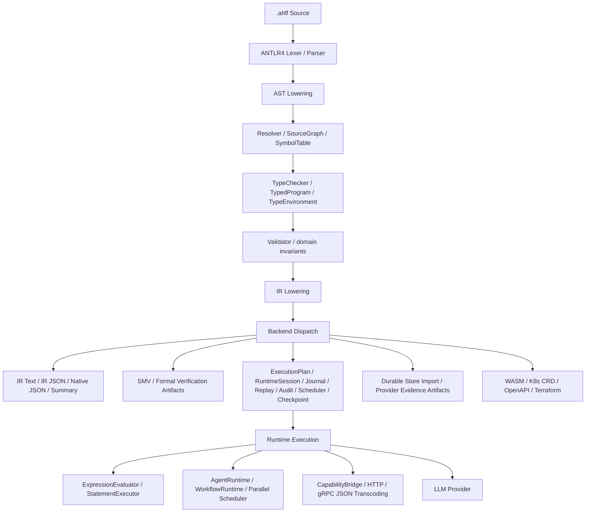
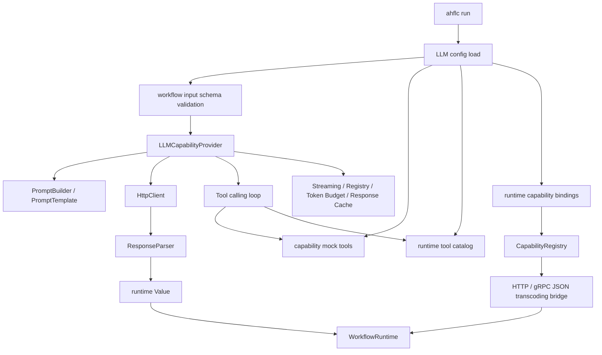

# AHFL 项目状态与演进记录

本文档汇总实现状态并提供后续工作入口。状态判断以当前源码、测试目录和 CLI 注册为准；历史 roadmap 只作为背景，不再把已经落库的模块继续列为”未实现”。

---

## 一、项目概览

| 属性 | 值 |
|------|-----|
| 项目名称 | AHFL (Agent Handoff Flow Language) |
| 语言标准 | C++23 |
| 构建系统 | CMake / Ninja |
| 解析器 | ANTLR4，vendored in `third_party/antlr4/` |
| 外部依赖 | ANTLR4 vendored；网络/外部进程路径仍以系统工具和本机环境为边界 |
| 测试框架 | 自研 golden-file、C++ unit、fuzz/bench/mutation target、compile/memory/SMV budget gate |
| CI 平台 | GitHub Actions: ubuntu-24.04、macos-14、ASan |
| 许可证 | Apache-2.0 |

**定位**：AHFL 是面向 AI Agent 工作流的强类型 DSL 编译器，覆盖状态机建模、行为契约、DAG 编排、形式化验证、runtime 执行、provider evidence chain 与开发者工具链。

---

## 二、当前编译器架构

### 各阶段职责

| 阶段 | 职责 | 关键文件 |
|------|------|----------|
| Parse | ANTLR parse tree 到前端 AST | `src/compiler/syntax/frontend/frontend.cpp` |
| Resolve | 多命名空间符号表、跨文件 import、source ownership | `src/compiler/semantics/resolver.cpp` |
| TypeCheck | TypeEnvironment、TypedProgram、类型关系、effect、schema boundary | `src/compiler/semantics/typecheck.cpp`、`src/compiler/semantics/type_relations.cpp` |
| Validate | Agent、Flow、Workflow、状态机、DAG 等结构约束 | `src/compiler/semantics/validate.cpp` |
| IR Lower | AST/TypedProgram 到 variant-based IR | `src/compiler/ir/ir_lower.cpp` |
| Pass / Opt IR | IR pass pipeline 与 diagnostic Opt IR | `src/compiler/passes/`、`src/compiler/ir/opt/` |
| Backend | IR 到核心、形式化、runtime、provider、infra target artifact | `src/compiler/backends/driver.cpp` |
| Runtime | 本地执行、capability 调用、provider 调用、调度与恢复基础设施 | `src/runtime/` |
| Tooling | CLI、LSP、formatter、REPL、DAP、incremental、telemetry、profiling | `src/tooling/` |

---

## 三、已完成工作总览

### 3.1 核心编译器与 project-aware 前端

| 阶段 | 状态 | 关键产物 |
|------|------|----------|
| 核心基础层 | 已实现 | 单文件 Parse、Resolver、TypeChecker、Validator、IR、SMV emission |
| Project-aware 扩展 | 已实现 | SourceGraph、跨文件 import/resolve、DeclarationProvenance、project-aware IR |

关联设计：`docs/design/core-scope.en.md`、`docs/design/compiler-phase-boundaries.zh.md`、`docs/design/formal-backend.zh.md`、`docs/design/module-loading.zh.md`。

### 3.2 Runtime-adjacent artifact chain

| 阶段 | 状态 | 代表 artifact |
|------|------|---------------|
| 运行时工件链早期 | 已实现 | `NativeJson`、`ExecutionPlan`、`DryRunTrace`、`RuntimeSession`、`ExecutionJournal`、`ReplayView`、`AuditReport`、`SchedulerSnapshot` |
| 持久化与导出 | 已实现 | `CheckpointRecord`、`CheckpointPersistenceDescriptor`、`CheckpointPersistenceExportManifest` |
| Durable Store Import | 已实现 | `StoreImportDescriptor`、`DurableStoreImportRequest`、`DurableAdapterDecision`、`DurableAdapterReceipt`、receipt persistence request/response |

这些 artifact 仍遵守 model、validation、bootstrap、CLI/backend emission、golden regression、release-gate 或 migration evidence 的链式边界。

### 3.3 Provider adapter 与 production evidence chain

| 阶段 | 状态 | 说明 |
|------|------|------|
| Provider 适配层 | 已实现 | Provider-neutral adapter boundary、driver binding、runtime preflight、SDK request envelope、host execution planning、config loader、secret handle artifact |
| Provider 执行基础设施 | 已实现 | Local host harness、SDK payload materialization、mock/alpha adapter、idempotency/retry、write commit/recovery、failure taxonomy、observability event、release-gate suite、multi-provider registry、readiness evidence |
| Production 准入链 | 已实现，仍有产品化后续 | Contract conformance、schema drift gate、production config bundle、release evidence archive、operator approval、real provider opt-in guard、runtime policy、production integration dry run |

核心约束不变：

- 持久化 artifact 必须 secret-free。
- 每层只能消费上一层 machine artifact。
- artifact identity 必须 deterministic。
- stable、unstable、forbidden fields 必须可验证。

### 3.4 Runtime execution baseline

| 模块 | 状态 | 关键产物 |
|------|------|----------|
| 表达式求值 | 已实现 | Expression evaluator、`EvalContext`、`Value` |
| 语句执行 | 已实现 | Statement executor、let/assign/if/goto/return/assert |
| Agent 运行时 | 已实现 | Agent state-machine runtime、quota enforcement |
| Workflow 运行时 | 已实现 | Workflow runtime、DAG execution |
| Capability 桥接 | 已实现，仍需生产化 | Capability bridge、function capability、HTTP transport、gRPC JSON transcoding、retry 基础 |

### 3.5 当前实现重点

| 模块 | 当前状态 | 后续判断 |
|------|----------|----------|
| LLM Provider 基础路径 | 已实现 | `LLMProviderConfig`、`HttpClient`、`PromptBuilder`、`ResponseParser`、`LLMCapabilityProvider` 已落库 |
| LLM 扩展模块 | 已落库但未产品化 | streaming、tool calling、provider registry、token budget、response cache 有代码与单测入口；token budget、HTTP fallback、workflow input schema validation、streaming response parsing、stream interrupted failure、mock-backed tool calling、runtime tool catalog、可选 response cache、response cache 持久化 snapshot、provider 内部 secret-free cache audit / fallback health / provider degradation summary / streaming chunk / token usage-cost / token budget 事件、稳定 token budget diagnostic code、`usage_exceeded_budget` fail-closed policy gate、`cost_exceeded_budget` policy gate、capability 粒度 token/cost override、workflow/node 累计 token/cost contract、`ahflc run` 文本摘要、`--llm-observability` machine JSON、env/vault/cloud secret provider 链、bearer/api-key-header、OAuth2 token-secret bearer、mTLS cert/key path 认证策略、`refresh_secrets_before_use` secret lifecycle audit 和 HTTP/gRPC capability auth fail-closed 已接入基础路径，剩余扩展还需要产品化 |
| `ahflc run` | 可用但未生产化 | 当前支持 `api_key_secret` 裸 env handle、`env:` / `vault:` / `cloud:` provider prefix、兼容 `api_key`、bearer/api-key-header 认证策略、`oauth2_token_secret` 驱动的 OAuth2 bearer/client-credentials token 认证、`mtls_client_cert_path` / `mtls_client_key_path` / `mtls_ca_cert_path` 与对应 secret handle 驱动的 mTLS curl 配置、`refresh_secrets_before_use` 触发 secret refresh 并在 `--llm-observability` 中写出 fingerprint-only lifecycle events、key rotation retry policy 与 secret-free rotation history、LLM token budget 配置校验、prompt accepted/truncated/rejected 结构化预算报告、OpenAI-compatible `usage` token/cost 统计、`usage_exceeded_budget` 默认 fail-closed policy gate、`cost_exceeded_budget` warning/fail policy gate、capability 粒度 `capability_token_budgets` override、workflow/node 累计 token/cost budget、workflow input schema validation、fallback provider、provider degradation summary 机器 artifact、streaming response parsing 与缺 `[DONE]` 中断诊断、可选 response cache、`response_cache_path` 持久化 snapshot、provider 内部 secret-free cache audit / fallback health / streaming chunk / token usage-cost / token budget 事件文本摘要、`--llm-observability` 机器 JSON、`--capability-mocks` 驱动的 mock-backed tool calling、`--tool-catalog` 驱动的 deterministic runtime tool catalog 成功/失败/超时诊断，以及 `--capability-bindings` 驱动的 HTTP/gRPC JSON transcoding runtime binding descriptor；后续重点转向 native gRPC / Protobuf 取舍和跨 provider audit |
| Runtime transport | 已落库但未产品化 | HTTP、gRPC JSON transcoding、connection pool、schema validator、parallel/distributed/sandbox 模块存在；HTTP/gRPC JSON transcoding 已覆盖 bearer/OAuth2/mTLS auth fail-closed、TLS client cert/key path 传递、gRPC response metadata/trailer capture、metadata/trailer `grpc-status` fail-closed、timeout/deadline、retry exhaustion、schema mismatch 和 malformed JSON 的 capability 级回归，workflow 层已覆盖 capability timeout / retry exhaustion 的状态、诊断和 invocation context 传播，CLI 层已覆盖 HTTP binding 与 gRPC JSON transcoding binding 的真实 curl-backed workflow 成功路径，以及 auth 缺 secret、HTTP retry exhaustion、HTTP malformed JSON、gRPC metadata/trailer 非 OK、gRPC deadline retry exhaustion 和 gRPC schema mismatch 的 workflow fail-closed 诊断路径；native gRPC / Protobuf transport 仍需取舍 |

---

## 四、状态分类口径

后续跟踪不再使用“有文件即完成”或“旧 roadmap 未勾选即未实现”两种极端口径。所有工作进入三类之一：

| 分类 | 含义 | 处理方式 |
|------|------|----------|
| 已实现 | 当前源码、CLI 注册、测试目标或 golden 能证明基础能力已经存在 | 从未完成 backlog 移出；只保留验证入口和维护责任 |
| 已落库但未产品化 | 模块、库、handler 或 target 已存在，但缺 CLI/IDE 接入、真实协议矩阵、端到端证据、CI 门禁或用户体验闭环 | 作为近期主 backlog |
| 真正未做或证据不足 | 当前源码没有可用实现，或只有目录/占位/研究意图，无法证明能力存在 | 保留为探索或新功能任务 |

---

## 五、关键设计边界

### 5.1 Artifact Chain 不可绕过

每一层 artifact 只能消费上一层 machine artifact 输出，不得回退读取 AST、raw source、parse tree、CLI 文本输出、host log、reviewer prose 或私有脚本结果来推导状态。

### 5.2 Secret-Free Artifact

仓库持久化 artifact 禁止包含 credential、API key、token value、secret manager response、真实 endpoint URI、object path、database table 和 host environment variable value。Secret 只能通过 handle/reference 间接表达。

### 5.3 Deterministic Identity Namespace

artifact identity 必须仅由上游 artifact identity 推导，不依赖 wall clock、process id、host path 或 random seed。少数 runtime snapshot 路径仍使用时间信息时，应标记为 productization debt。

### 5.4 Formal Backend 边界

SMV 后端的 formal subset 覆盖 Agent 状态变量、Workflow 生命周期变量、Contract clauses 到 LTLSPEC，以及 observation abstraction。不承诺完整 statement/data runtime 语义等价。

### 5.5 Runtime 不替代 Formal

Runtime 提供单路径真实执行；Formal 提供安全/活性属性验证。两者互补，不能互相替代。

### 5.6 版本演进约定

- 每个提交只推进一个逻辑变化。
- 项目未成熟，不承诺向前兼容。
- 可以 aggressive refactor，但必须同步更新实现、测试、golden 与文档。
- Artifact schema/format breaking change 必须明确影响面、迁移方式和验证证据。

---

## 六、后续工作入口

详见 [issue-backlog-global-gaps.zh.md](./issue-backlog-global-gaps.zh.md)。当前最高优先级不是“补齐旧清单所有 checkbox”，而是按当前源码重新推进以下产品化闭环：

| 优先级 | 工作 | 当前分类 | 目标 |
|--------|------|----------|------|
| P0 | Runtime / LLM Provider 生产化收口 | 已落库但未产品化 | Secret handle、env/vault/cloud provider 链、bearer/api-key-header 认证策略、OAuth2 token-secret bearer 策略、mTLS cert/key path 策略、secret refresh lifecycle audit、key rotation retry policy、secret-free rotation history、HTTP/gRPC capability auth fail-closed、token budget 结构化报告、稳定 budget diagnostic code、usage/cost 超限 warning/fail policy gate、capability 粒度预算 override、workflow/node 累计 token/cost contract、OpenAI-compatible token usage/cost 统计、workflow input schema validation、HTTP fallback、fallback health 事件、provider degradation summary 机器 artifact、streaming response parsing、streaming chunk 事件与缺 `[DONE]` 中断诊断、mock-backed tool calling、`--tool-catalog` deterministic runtime tool catalog 及其 schema/invalid args/unknown/error/timeout 失败矩阵、可选 response cache、response cache 持久化 snapshot、provider 内部 secret-free cache audit 事件、gRPC JSON transcoding metadata/trailer capture 与 `grpc-status` fail-closed 回归、HTTP/gRPC JSON transcoding timeout/retry/schema mismatch/malformed JSON capability 级矩阵、workflow 层 capability failure 传播回归、`--capability-bindings` HTTP/gRPC binding CLI smoke、binding auth negative、gRPC metadata/trailer 非 OK、timeout/retry、schema mismatch、malformed JSON CLI fail-closed 诊断、`ahflc run` 文本摘要和 `--llm-observability` machine JSON 基础门禁已落地；剩余是 native gRPC / Protobuf 取舍和跨 provider audit |
| P0 | TypeCheck / Sema 最终闭环 | 已落库但未完全闭合 | variance（含源码级 `TypeCheckPass` 回归与 CLI 正反向 fail golden 矩阵）、numeric subtyping（含 `Int -> Float`、`Int -> Decimal`、`Decimal -> Float`、Decimal scale 双向不兼容 CLI fail golden）、SymbolId-first nominal identity、exact schema boundary、schema declaration template diagnostic、Typed HIR const value tree、`AHFL_CONST_VALUE_ARTIFACT_V1` schema gate、直接 const dependency graph artifact、基础 ConstEvaluator inline/folding、Float/同 scale Decimal/String/Duration folding、Duration artifact 毫秒规范化、Set/Map const value 规范化、`ConstValue` 值层 helper、AST 到 const value tree 的递归 evaluator、TypedExpr const value tree evaluate-and-record 编排及其成功 outcome 返回、const dependency reference 收集、TypedProgram dependency edge 写入、const value resolution state 管理边界、const cycle begin result / failed-state 标记、assignable 后 const value cache commit 与 resolution finish 决策、const cache write / resolution success API 封装、effect/syntax const gate 分类、const expr required diagnostic message/code/range 与 pipeline diagnostic report、const diagnostic sink forwarding、const type-relation validator、const checked-expression pipeline input、const expression driver、expression checker context/value/call contract、expression place/path-root helper、expression path resolution helper、expression flow narrowing helper、expression field access helper、`ExpressionValueFactory`、`ExpressionChecker` dispatch object、path/unary/member/index/binary/qualified-value/struct-literal/list-literal/set-literal/map-literal/call expression handler、对应旧 `TypeCheckPass` handler 声明/实现清理、`ExpressionCheckerServices` adapter、metadata query direct environment read、resolver/symbol snapshot direct read、assignability direct relation check、type symbol resolver callback、diagnostic sink callback、recursive checker callback、friend removal、field/flow helper 直连与 handler implementation file、struct default expectation/schema-boundary policy、const eval outcome 构造、const eval pipeline 编排、const dependency cycle diagnostic spec / code / range / related-note report、const initializer validation policy 和 struct default validation policy 移入 `const_sema.*` / `expression_sema.*` / `typecheck_expr.cpp`、forward/跨 source const 递归求值、const dependency cycle diagnostic，以及 flow assignment、unknown path root、unknown type / qualified value / callable missing-reference fallback、invalid type/callable reference fallback、missing callable/const/type metadata fallback、list/set/map 推断类型 related notes、struct literal target、qualified enum value、let shadowing warning、validation duplicate capability、const initializer declared-type note 和 agent context default exact-schema note 等稳定 diagnostic 已按规范收口；剩余重点是 source/diagnostic context 注入等 `TypeCheckPass` 状态依赖拆分和剩余语义测试矩阵 |
| P1 | LSP 从 handler 可用到 IDE 可用 | 已落库但未产品化 | project-aware snapshot、Typed HIR 主状态、已打开文档跨文件 diagnostics 刷新、`textDocument/diagnostic` / `workspace/diagnostic` pull report、`workspace/didChangeWatchedFiles` cache invalidation、`workspace/didChangeWorkspaceFolders` descriptor switching、`prepareRename` 协议探测、VS Code client、TextMate grammar、snippet、基础 CodeLens、platform VSIX 打包脚本、CI VSIX artifact workflow、Marketplace package inventory gate、platform VSIX install smoke、hover/completion/rename/watched-files extension test、Problems diagnostics transcript 与 diagnostics publish/recovery extension test 已落地；剩余是 source graph 级细粒度增量性能、Typed HIR/condition facts 驱动的 hover/completion/signatureHelp 深化、workspace folder extension 序列和真实 Marketplace 发布演练 |
| P1/P2 | 工具链入口补齐 | 已落库但未产品化 | `ahflc fmt/fmt --check`、formatter 文件/目录/project/workspace 批量模式、独立 `ahfl-repl`、REPL `:simulate` 状态机 step simulation、`ahfl-dap`、`ahfl-incremental`、`--time-passes`、`--smv-size-report`、`--trace-export`、`--metrics-export`、`--structured-log` 与 `--memory-report` 已落地；剩余是 formatter 语法覆盖/import graph 策略、DAP runtime 深集成、incremental project-aware invalidation 和 memory report 的 RSS/allocator 可选观测 |
| P2 | Formal backend 真实性增强 | 已落库但未产品化 | backend capability/availability matrix、CLI/report `checker_status` 分类、verify state-space estimate、NuSMV/nuXmv parser fixture matrix 与 `--checker-timeout-seconds` 外部进程 timeout 回归已落地；剩余是 AHFL property semantics 深化、counterexample 深映射和更强真实工具 CI 证据 |
| P2 | Pass 与 target backend 产品化 | 已落库但未产品化 | `ahflc.passes.semantic_backend_effect` 已证明 `-O` 改善普通 IR/SMV backend 输出；剩余是 dead state / workflow simplification 指标、runtime plan 影响和 WASM/K8s/OpenAPI/Terraform 外部验收 |
| P2/P3 | 质量工程门禁 | 已落库但未产品化 | GitHub Actions 已显式运行 `quality-gates`，覆盖 fuzz/property、真实 compile-time budget、memory proxy budget、bench smoke、mutation config report 和真实 `emit smv` size/spec budget；剩余是 nightly 趋势化、平台可比 RSS/allocator 观测、真实 mutation score 与 corpus 管理 |

---

## 七、版本与系统索引

| 系统 | 范围 | 当前状态 |
|------|------|----------|
| 核心编译器与 project-aware 前端 | 编译器核心 | 已实现 |
| 执行工件管线 | runtime artifact | 已实现 |
| 持久化与导出工件 | checkpoint / persistence | 已实现 |
| Durable Store Import 管线 | durable-store import | 已实现 |
| Provider Adapter 契约层 | provider boundary | 已实现 |
| Provider 执行基础设施 | provider runtime | 已实现 |
| Production 准入链 | production readiness | 已实现，仍有产品化后续 |
| 解释器与 runtime baseline | runtime execution | 已实现 |
| LLM Provider、tooling、formal/infra 扩展 | 当前重点 | 已落库但未产品化 |
