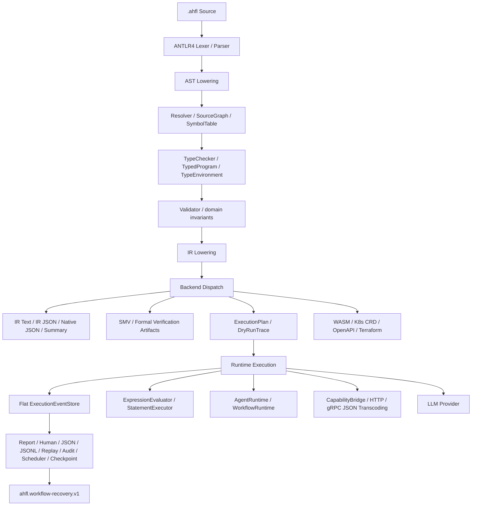
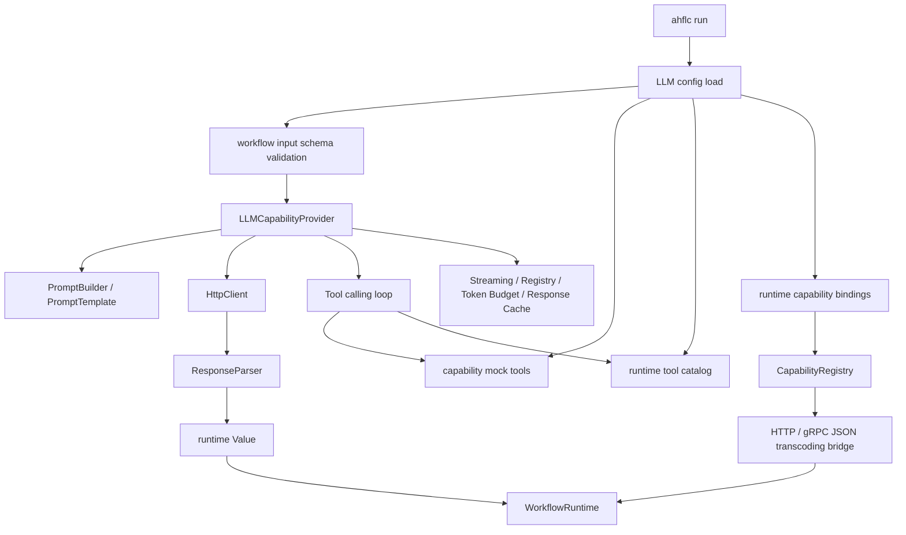

# AHFL 项目状态与演进记录

本文档汇总实现状态并提供后续工作入口。状态判断以当前源码、测试目录和 CLI 注册为准；历史 roadmap 只作为背景，不再把已经落库的模块继续列为”未实现”。

---

## 一、项目概览

| 属性 | 值 |
|------|-----|
| 项目名称 | AHFL (Agent Handoff Flow Language) |
| 语言标准 | C++23 |
| 构建系统 | CMake / Ninja |
| 解析器 | ANTLR4，vendored in `third_party/antlr4/` |
| 外部依赖 | ANTLR4 vendored；网络/外部进程路径仍以系统工具和本机环境为边界 |
| 测试框架 | 自研 golden-file、C++ unit、fuzz/bench/mutation target、compile/memory/SMV budget gate |
| CI 平台 | GitHub Actions: ubuntu-24.04、macos-14、ASan |
| 许可证 | Apache-2.0 |

**定位**：AHFL 是面向高风险 AI Agent 工作流的强类型控制平面 DSL 与 C++23 编译器，覆盖状态机建模、行为契约、DAG 编排、形式化验证、event-native runtime 执行与开发者工具链。

---

## 二、当前编译器架构

```mermaid
flowchart TD
    Source[".ahfl Source"] --> Parser["ANTLR4 Lexer / Parser"]
    Parser --> Frontend["AST Lowering"]
    Frontend --> Resolver["Resolver / SourceGraph / SymbolTable"]
    Resolver --> TypeCheck["TypeChecker / TypedProgram / TypeEnvironment"]
    TypeCheck --> Validate["Validator / domain invariants"]
    Validate --> IRLower["IR Lowering"]
    IRLower --> BackendDispatch["Backend Dispatch"]
    BackendDispatch --> CoreArtifacts["IR Text / IR JSON / Native JSON / Summary"]
    BackendDispatch --> FormalArtifacts["SMV / Formal Verification Artifacts"]
    BackendDispatch --> RuntimeArtifacts["ExecutionPlan / DryRunTrace"]
    BackendDispatch --> TargetArtifacts["WASM / K8s CRD / OpenAPI / Terraform"]
    RuntimeArtifacts --> Runtime["Runtime Execution"]
    Runtime --> Events["Flat ExecutionEventStore"]
    Events --> Projections["Report / Human / JSON / JSONL / Replay / Audit / Scheduler / Checkpoint"]
    Projections --> Recovery["ahfl.workflow-recovery.v1"]
    Runtime --> Evaluator["ExpressionEvaluator / StatementExecutor"]
    Runtime --> Engines["AgentRuntime / WorkflowRuntime"]
    Runtime --> Capability["CapabilityBridge / HTTP / gRPC JSON Transcoding"]
    Runtime --> LLM["LLM Provider"]
```

### 各阶段职责

| 阶段 | 职责 | 关键文件 |
|------|------|----------|
| Parse | ANTLR parse tree 到前端 AST | `src/compiler/syntax/frontend/frontend.cpp` |
| Resolve | 多命名空间符号表、跨文件 import、source ownership | `src/compiler/semantics/resolver.cpp` |
| TypeCheck | TypeEnvironment、TypedProgram、类型关系、effect、schema boundary | `src/compiler/semantics/typecheck.cpp`、`src/compiler/semantics/type_relations.cpp` |
| Validate | Agent、Flow、Workflow、状态机、DAG 等结构约束 | `src/compiler/semantics/validate.cpp` |
| IR Lower | AST/TypedProgram 到 variant-based IR | `src/compiler/ir/ir_lower.cpp` |
| Pass / Opt IR | IR pass pipeline 与 diagnostic Opt IR | `src/compiler/passes/`、`src/compiler/ir/opt/` |
| Backend | IR 到核心、形式化、handoff 和 infra target artifact | `src/compiler/backends/driver.cpp` |
| Runtime | 本地执行、capability 调用、provider 调用、调度与恢复基础设施 | `src/runtime/` |
| Tooling | CLI、LSP、formatter、REPL、DAP、incremental、telemetry、profiling | `src/tooling/` |

---

## 三、已完成工作总览

### 3.1 核心编译器与 project-aware 前端

| 阶段 | 状态 | 关键产物 |
|------|------|----------|
| 核心基础层 | 已实现 | 单文件 Parse、Resolver、TypeChecker、Validator、IR、SMV emission |
| Project-aware 扩展 | 已实现 | SourceGraph、跨文件 import/resolve、DeclarationProvenance、project-aware IR |

关联设计：`docs/design/core-scope.en.md`、`docs/design/compiler-phase-boundaries.zh.md`、`docs/design/formal-backend.zh.md`、`docs/design/module-loading.zh.md`。

### 3.2 Event-native Runtime Kernel

| 能力 | 状态 | 事实来源 |
|------|------|----------|
| Strong runtime IDs | 已实现 | `RunId`、`WorkflowId`、`WorkflowNodeId`、`AgentId`、`CapabilityId`、`InvocationId`、`RuntimeValueId`、`ExecutionEventId` 等 index wrapper |
| Canonical event store | 已实现 | `ExecutionEventSink` -> flat `ExecutionEventStore` |
| Lifecycle closure | 已实现 | success、skip、retry/fallback、cancel、budget rejection、timeout、interruption、checkpoint/resume |
| Report/renderers | 已实现 | human、JSON、JSONL、quiet 共享 event/report facts |
| Runtime projections | 已实现 | replay、audit、scheduler、checkpoint 全部从 `WorkflowResult.events` 构造 |
| Recovery store | 已实现 | `ahfl.workflow-recovery.v1`、atomic replace、deep-cloned values |
| Reference recovery path | 已实现 | local HTTP provider、`SIGKILL`、approval、partial write、resume、side-effect dedupe |

旧 `RuntimeSession -> ExecutionJournal -> ReplayView -> SchedulerSnapshot -> CheckpointRecord -> persistence/store-import/provider artifact` 链已物理删除。它们曾经形成第二套 name-based runtime fact source；不能再以“历史上有源码和 golden”为理由恢复。

### 3.3 Provider 与 Production Evidence

| 阶段 | 状态 | 说明 |
|------|------|------|
| LLM Provider | 已实现基础路径 | OpenAI-compatible HTTP、fallback、tool calling、streaming、token/cost budget、response cache、secret handles |
| Capability transport | 已实现基础路径 | HTTP 与 gRPC JSON transcoding；native gRPC 仍受 RFC 0004 No-Go gate 约束 |
| 真实恢复试点 | 已实现一个 reference path | 本地 HTTP provider + durable recovery snapshot + approval |
| Bounded CI soak | 已实现 | 30 秒下限、至少 12 次 reference workflow、event count/request count 稳定 |
| 网络故障矩阵 | 已实现受控试点 | disconnect、HTTP 429、timeout、partial response、process crash 全部 fail closed |
| OTel-compatible adapter | 已实现 | canonical events -> deterministic OTLP-compatible run/workflow/node/capability spans |
| Controlled-pilot gate | 已实现 | `ahfl-controlled-pilot` 显式覆盖 bounded soak、provider budget、recovery、schema rejection 与 OTel；evidence revision 必须等于当前 checkout |
| Beta evidence gate | 已实现 | `ahfl-beta-gate` 从空目录重建 10 项 evidence，拒绝 stale/mixed revision、缺项和失败状态 |
| 长时间 nightly soak | 已治理，状态由 live evidence 决定 | 单一长生命周期 worker、RSS/allocator 趋势、nightly workflow 与 `production-confidence` checker 已落地；是否 ready 必须读取当前 revision 的 gate report，不能从文档静态推断 |

### 3.4 Runtime execution baseline

| 模块 | 状态 | 关键产物 |
|------|------|----------|
| 表达式求值 | 已实现 | Expression evaluator、`EvalContext`、`Value` |
| 语句执行 | 已实现 | Statement executor、let/assign/if/goto/return/assert |
| Agent 运行时 | 已实现 | Agent state-machine runtime、quota enforcement |
| Workflow 运行时 | 已实现 | Workflow runtime、DAG execution |
| Structured execution | 已实现 | strong IDs、event store、report、projection、renderer、recovery |
| Capability 桥接 | 已实现，仍需生产化 | Capability bridge、function capability、HTTP transport、gRPC JSON transcoding、retry/fallback/budget |

### 3.5 当前实现重点

```mermaid
flowchart TD
    Run["ahflc run"] --> Config["LLM config load"]
    Config --> InputSchema["workflow input schema validation"]
    Config --> MockTools["capability mock tools"]
    Config --> ToolCatalog["runtime tool catalog"]
    Config --> CapabilityBindings["runtime capability bindings"]
    InputSchema --> Provider["LLMCapabilityProvider"]
    Provider --> Prompt["PromptBuilder / PromptTemplate"]
    Provider --> Client["HttpClient"]
    Provider --> Tools["Tool calling loop"]
    Tools --> MockTools
    Tools --> ToolCatalog
    CapabilityBindings --> RuntimeRegistry["CapabilityRegistry"]
    RuntimeRegistry --> CapabilityBridge["HTTP / gRPC JSON transcoding bridge"]
    Client --> Response["ResponseParser"]
    Provider --> OptionalModules["Streaming / Registry / Token Budget / Response Cache"]
    Response --> RuntimeValue["runtime Value"]
    RuntimeValue --> WorkflowRuntime["WorkflowRuntime"]
    CapabilityBridge --> WorkflowRuntime
```

| 模块 | 当前状态 | 后续判断 |
|------|----------|----------|
| LLM Provider 基础路径 | 已实现 | `LLMProviderConfig`、`HttpClient`、`PromptBuilder`、`ResponseParser`、`LLMCapabilityProvider` 已落库 |
| LLM 扩展模块 | 已落库但未完全产品化 | streaming、tool calling、provider registry、token/cost budget、response cache 和 secret provider 基础路径已接入；公开运行证据统一为 canonical JSONL：usage/cost、cache outcome、fallback、policy notice 与 ranged diagnostic 都按 invocation ID 关联。chunk-level、secret lifecycle 与 cache 内部 audit 只用于 provider/secret 单测，不形成平行公开 artifact；剩余重点是跨 provider audit 与真实部署长期证据 |
| `ahflc run` | Beta path 已闭环，生产信心仍有限 | 支持 manifest profile、secret handles、HTTP/gRPC JSON transcoding bindings、tool catalog、mock tools、fallback、streaming、persistent cache、token/cost/latency budget。`token_budget_policy: fail` 直接进入 `BudgetRejected` terminal lifecycle；warn 作为 ranged runtime warning。公开机器输出只使用 JSON/JSONL，旧 provider observability flag 已删除 |
| Runtime transport | 已落库但未产品化 | HTTP、gRPC JSON transcoding、connection pool、schema validator、parallel/distributed/sandbox 模块存在；HTTP/gRPC JSON transcoding 已覆盖 bearer/OAuth2/mTLS auth fail-closed、TLS client cert/key path 传递、gRPC response metadata/trailer capture、metadata/trailer `grpc-status` fail-closed、timeout/deadline、retry exhaustion、schema mismatch 和 malformed JSON 的 capability 级回归，workflow 层已覆盖 capability timeout / retry exhaustion 的状态、诊断和 invocation context 传播，CLI 层已覆盖 HTTP binding 与 gRPC JSON transcoding binding 的真实 curl-backed workflow 成功路径，以及 auth 缺 secret、HTTP retry exhaustion、HTTP malformed JSON、gRPC metadata/trailer 非 OK、gRPC deadline retry exhaustion 和 gRPC schema mismatch 的 workflow fail-closed 诊断路径；native gRPC / Protobuf transport 仍需取舍 |

---

## 四、状态分类口径

后续跟踪不再使用“有文件即完成”或“旧 roadmap 未勾选即未实现”两种极端口径。所有工作进入三类之一：

| 分类 | 含义 | 处理方式 |
|------|------|----------|
| 已实现 | 当前源码、CLI 注册、测试目标或 golden 能证明基础能力已经存在 | 从未完成 backlog 移出；只保留验证入口和维护责任 |
| 已落库但未产品化 | 模块、库、handler 或 target 已存在，但缺 CLI/IDE 接入、真实协议矩阵、端到端证据、CI 门禁或用户体验闭环 | 作为近期主 backlog |
| 真正未做或证据不足 | 当前源码没有可用实现，或只有目录/占位/研究意图，无法证明能力存在 | 保留为探索或新功能任务 |

---

## 五、关键设计边界

### 5.1 Runtime Event Source 不可绕过

运行期状态只由 `ExecutionEventStore` 持有。report、replay、audit、scheduler、checkpoint 和 recovery materialization 都必须读取 `WorkflowResult.events` 与其 flat value/diagnostic stores；不得回退读取 AST、raw source、CLI 文本、host log、provider prose 或另一个 projection。

### 5.2 Secret-Free Artifact

仓库持久化 artifact 禁止包含 credential、API key、token value、secret manager response、真实 endpoint URI、object path、database table 和 host environment variable value。Secret 只能通过 handle/reference 间接表达。

### 5.3 Strong Numeric Identity

运行期 canonical association 使用独立 numeric ID wrapper，不依赖 workflow/node/provider 字符串、wall clock、process id、host path 或 random seed。monotonic offset 只用于事件时间线，不参与 identity。

### 5.4 Formal Backend 边界

SMV 后端的 formal subset 覆盖 Agent 状态变量、Workflow 生命周期变量、Contract clauses 到 LTLSPEC，以及 observation abstraction。不承诺完整 statement/data runtime 语义等价。

### 5.5 Runtime 不替代 Formal

Runtime 提供单路径真实执行；Formal 提供安全/活性属性验证。两者互补，不能互相替代。

### 5.6 版本演进约定

- 每个提交只推进一个逻辑变化。
- 项目未成熟，不承诺向前兼容。
- 可以 aggressive refactor，但必须同步更新实现、测试、golden 与文档。
- Artifact schema/format breaking change 必须明确影响面、迁移方式和验证证据。

---

## 六、后续工作入口

详见 [issue-backlog-global-gaps.zh.md](./issue-backlog-global-gaps.zh.md)。当前最高优先级不是“补齐旧清单所有 checkbox”，而是按当前源码重新推进以下产品化闭环：

| 优先级 | 工作 | 当前分类 | 目标 |
|--------|------|----------|------|
| P0 | 受控生产试点闭环 | bounded gate 已实现；长期信心由 live gate 决定 | 当前已有 bounded fault matrix、single-process hour-scale harness、RSS/allocator 趋势合同和 nightly workflow；以 `python3 scripts/check-production-confidence-gate.py --require-ready` 判断当前 revision 是否闭环 |
| P0 | TypeCheck / Sema 最终闭环 | 已落库但未完全闭合 | variance（含源码级 `TypeCheckPass` 回归与 CLI 正反向 fail golden 矩阵）、numeric subtyping（含 `Int -> Float`、`Int -> Decimal`、`Decimal -> Float`、Decimal scale 双向不兼容 CLI fail golden）、SymbolId-first nominal identity、exact schema boundary、schema declaration template diagnostic、Typed HIR const value tree、`AHFL_CONST_VALUE_ARTIFACT_V1` schema gate、直接 const dependency graph artifact、基础 ConstEvaluator inline/folding、Float/同 scale Decimal/String/Duration folding、Duration artifact 毫秒规范化、Set/Map const value 规范化、`ConstValue` 值层 helper、AST 到 const value tree 的递归 evaluator、TypedExpr const value tree evaluate-and-record 编排及其成功 outcome 返回、const dependency reference 收集、TypedProgram dependency edge 写入、const value resolution state 管理边界、const cycle begin result / failed-state 标记、assignable 后 const value cache commit 与 resolution finish 决策、const cache write / resolution success API 封装、effect/syntax const gate 分类、const expr required diagnostic message/code/range 与 pipeline diagnostic report、const diagnostic sink forwarding、const type-relation validator、const checked-expression pipeline input、const expression driver、expression checker context/value/call contract、expression place/path-root helper、expression path resolution helper、expression flow narrowing helper、expression field access helper、`ExpressionValueFactory`、`ExpressionChecker` dispatch object、path/unary/member/index/binary/qualified-value/struct-literal/list-literal/set-literal/map-literal/call expression handler、对应旧 `TypeCheckPass` handler 声明/实现清理、`ExpressionCheckerServices` adapter、metadata query direct environment read、resolver/symbol snapshot direct read、assignability direct relation check、type symbol resolver callback、diagnostic sink callback、recursive checker callback、friend removal、field/flow helper 直连与 handler implementation file、struct default expectation/schema-boundary policy、const eval outcome 构造、const eval pipeline 编排、const dependency cycle diagnostic spec / code / range / related-note report、const initializer validation policy 和 struct default validation policy 移入 `const_sema.*` / `expression_sema.*` / `typecheck_expr.cpp`、forward/跨 source const 递归求值、const dependency cycle diagnostic，以及 flow assignment、unknown path root、unknown type / qualified value / callable missing-reference fallback、invalid type/callable reference fallback、missing callable/const/type metadata fallback、list/set/map 推断类型 related notes、struct literal target、qualified enum value、let shadowing warning、validation duplicate capability、const initializer declared-type note 和 agent context default exact-schema note 等稳定 diagnostic 已按规范收口；剩余重点是 source/diagnostic context 注入等 `TypeCheckPass` 状态依赖拆分和剩余语义测试矩阵 |
| P0 | ExprEffect 正式输入闭环 | 已实现 | Typed HIR effect 进入 `ahfl.ir.v2` expression 与 flow summary；assurance/SMV 只消费该 fact，并对 capability identity/effect 矛盾 fail closed |
| P1 | LSP 从 handler 可用到 IDE 可用 | 已落库但未产品化 | project-aware snapshot、Typed HIR 主状态、已打开文档跨文件 diagnostics 刷新、`textDocument/diagnostic` / `workspace/diagnostic` pull report、`workspace/didChangeWatchedFiles` cache invalidation、`workspace/didChangeWorkspaceFolders` descriptor switching、`prepareRename` 协议探测、VS Code client、TextMate grammar、snippet、基础 CodeLens、platform VSIX 打包脚本、CI VSIX artifact workflow、Marketplace package inventory gate、platform VSIX install smoke、hover/completion/rename/watched-files extension test、Problems diagnostics transcript 与 diagnostics publish/recovery extension test 已落地；剩余是 source graph 级细粒度增量性能、Typed HIR/condition facts 驱动的 hover/completion/signatureHelp 深化、workspace folder extension 序列和真实 Marketplace 发布演练 |
| P1/P2 | 工具链入口补齐 | 已落库但未产品化 | `ahflc fmt/fmt --check`、formatter 文件/目录/project/workspace 批量模式、独立 `ahfl-repl`、REPL `:simulate` 状态机 step simulation、`ahfl-dap`、`ahfl-incremental`、`--time-passes`、`--smv-size-report`、`--trace-export`、`--metrics-export`、`--structured-log` 与 `--memory-report` 已落地；剩余是 formatter 语法覆盖/import graph 策略、DAP runtime 深集成、incremental project-aware invalidation 和 memory report 的 RSS/allocator 可选观测 |
| P2 | Formal backend 真实性增强 | 已落库但未产品化 | backend capability/availability matrix、CLI/report `checker_status` 分类、verify state-space estimate、NuSMV/nuXmv parser fixture matrix 与 `--checker-timeout-seconds` 外部进程 timeout 回归已落地；剩余是 AHFL property semantics 深化、counterexample 深映射和更强真实工具 CI 证据 |
| P2 | Pass 与 target backend 产品化 | 已落库但未产品化 | `ahflc.passes.semantic_backend_effect` 已证明 `-O` 改善普通 IR/SMV backend 输出；剩余是 dead state / workflow simplification 指标、runtime plan 影响和 WASM/K8s/OpenAPI/Terraform 外部验收 |
| P2/P3 | 质量工程门禁 | 已落库但未产品化 | GitHub Actions 已显式运行 `quality-gates`，覆盖 fuzz/property、真实 compile-time budget、memory proxy budget、bench smoke、mutation config report 和真实 `emit smv` size/spec budget；剩余是 nightly 趋势化、平台可比 RSS/allocator 观测、真实 mutation score 与 corpus 管理 |

---

## 七、版本与系统索引

| 系统 | 范围 | 当前状态 |
|------|------|----------|
| 核心编译器与 project-aware 前端 | 编译器核心 | 已实现 |
| Execution plan / Dry run | compiler-to-runtime handoff | 已实现 |
| Event-native Runtime Kernel | runtime execution facts | 已实现 |
| Replay / Audit / Scheduler / Checkpoint | event projections | 已实现 |
| Crash / Resume | recovery | reference workflow 已实现 |
| Bounded soak / network matrix / OTel adapter | controlled pilot | 已实现 |
| Hour-scale soak / RSS trend | production confidence | 读取 live `production-confidence` gate；文档不缓存 ready 状态 |
| 解释器与 runtime baseline | runtime execution | 已实现 |
| LLM Provider、tooling、formal/infra 扩展 | 当前重点 | 已落库但未产品化 |
