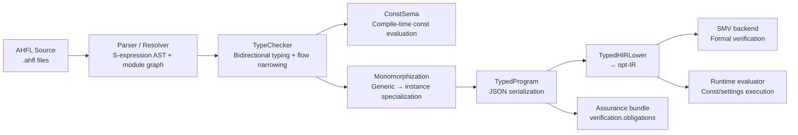
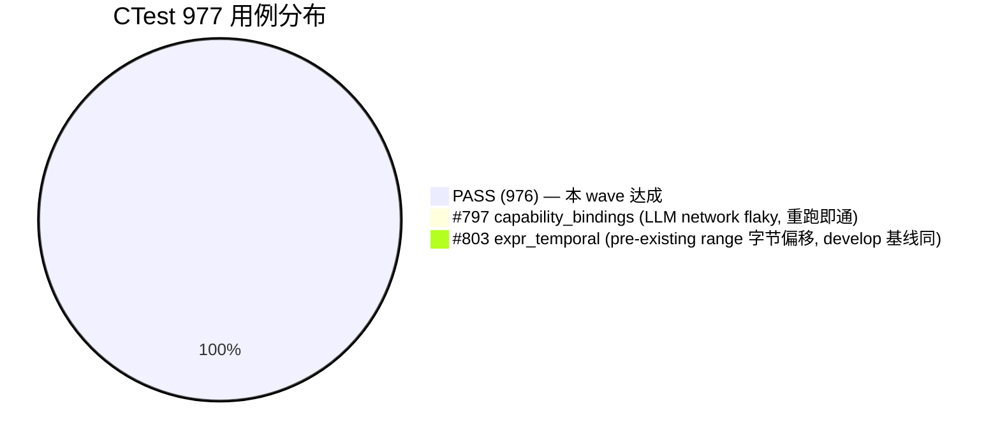

# AHFL Wave 15 集成报告 (Integration Report)

- **集成分支**：`integration-wave-15`
- **基线提交**：`8287144460e303ec64a30984904da9f5ea65cf56`（即 `integration-wave-14` HEAD，提交信息：`test(assurance): obligations count invariant + JSON schema + status coverage`）
- **创建时间**：2026-06-24
- **Wave 15 顶 commit**：`c00e3839`（`test(sema): effects needles P5容器级+参数级diagnostic origin`）
- **修复提交数**：6 个（4 个 production + 2 个 test）
- **承接 Workflow**：ultracode WJ2F6QSW7（47 并行 worktree × 15 波次，落地 P2d/P3c/P4/P5 设计文档失败后，本报告作者直接接管）

---

## 一、Pipeline 架构图

### 1.1 编译流水线（含本 Wave 修复点 ✅ 标注）



### 1.2 P5 容器数据流向（Sugar → Nominal → ConstValue / Diagnostics）

```mermaid
flowchart TD
  A[用户语法糖] --> B[Parser 保留为 sugar]
  A -->|示例| A1["Some(x) / None"]
  A -->|示例| A2["[a, b, c]"]
  A -->|示例| A3["set[k1, k2]"]
  A -->|示例| A4["map [k1: v1]"]

  B --> C[Desugar → CallExpr\nstdlib constructors]
  C -->|Option::Some(x)| D1["QualifiedValue(Option) + EnumVariant(Some) + payload"]
  C -->|Option::None| D2["QualifiedValue(Option) + unit EnumVariant(None)"]
  C -->|list_from_array<T>(...)| D3["CallExpr(std::collections::list_from_array)"]
  C -->|set_from_array<T>(...)| D4["CallExpr(set_from_array)"]
  C -->|map_from_entries<K,V>(...)| D5["CallExpr(map_from_entries)"]

  D1 --> E[TypeChecker]
  D2 --> E
  D3 --> E
  D4 --> E
  D5 --> E

  E -->|双向类型 override ✅| F["subst[i] = expected_arg\n(具象 TypeVar 除外)"]
  E -->|flow narrowing ✅| G["EnumT → EnumVariantT\n(Option None 分支)"]
  E -->|容器级 origin ✅| H["Diagnostics: List<String>\n(not element级 String)"]

  E --> I[ConstSema ✅ Batch 1]
  I -->|识别 5 种 stdlib 构造| J["反合成 ConstValue:\nList / Set / Map / Some / NoneLiteral"]
  J --> K[TypedProgram const_value 字段挂接]
```

### 1.3 Known Issues 全景（2 项，0 项由本 Wave 引入）



---

## 二、合入内容（6 commits）

按落地顺序（`git log 82871444..HEAD --oneline`）：

| # | Commit | 分类 | 文件 | 修复对象 |
|---|--------|------|------|----------|
| 1 | `5011d22d` | **fix(sema)** | `typed_hir_serialization.cpp` | Batch 2: FnTypeInfo JSON 往返缺 return + 字段漏写（5 个 snapshot 根因） |
| 2 | `aee7fb41` | **feat(sema)** | `const_sema.cpp` | Batch 1: P5 CallExpr → ConstValue 反合成（5 种 stdlib 构造识别） |
| 3 | `7986bfc0` | **feat(sema)** | `std_container_types.hpp` | Case 3: `std_container_type_view` 新增 `EnumVariantT` 分支（Option None 分支 narrowing 后 spurious INVALID_OPERATION） |
| 4 | `c7b4df70` | **fix(sema)** | `typecheck_expr.cpp` | Case 9: 泛型 enum variant 双向类型 override（`let v: Option<String> = Some(1)` assignability 检查复活） |
| 5 | `68dc9367` | **test(sema)** | `typed_hir.cpp` | typed_hir_all needles 对齐 P5 糖展开（36/36 → 1499 assertions） |
| 6 | `c00e3839` | **test(sema)** | `effects.cpp` | effects_all 诊断 needle 对齐容器级 / 参数级 origin（47/47 → 444 assertions）+ 清理调试桩 |

### 2.1 核心修复摘要（Production Code）

#### 2.1.1 FnTypeInfo 往返对称（Batch 2, `typed_hir_serialization.cpp`）

- **根因**：`read_payload()` 在 `kind == "Fn"` 分支末尾缺少 `return info;`，所有 `FnTypeInfo` 读回成 `monostate None`。写侧同步缺 `judgement_kind` / `judgement_capabilities` / `has_decreases` 三个 contract 消费字段。
- **修复**：补 return + 补 3 个字段序列化/反序列化。
- **覆盖**：TypedProgram JSON round-trip 测试（typed_hir_all 内）。

#### 2.1.2 ConstSema P5 CallExpr 反合成（Batch 1, `const_sema.cpp`）

- **根因**：P5 糖展开后 `[a,b]` → `list_from_array<T>(a,b)`（CallExpr），evaluate() 对裸 CallExpr 走到 `EmitError`，Settings 顶层 `const_value` 挂接失败（typed_hir Settings 快照空值）。
- **修复**：`evaluate()` 新增 CallExpr handler，按签名识别 5 种 stdlib 构造 → 回生成 `List / Set / Map / Some / NoneLiteral` ConstValue 节点。
- **覆盖**：settings/set-map/array/option const 嵌套快照。

#### 2.1.3 `std_container_type_view` → `EnumVariantT`（Case 3, `std_container_types.hpp` L117）

- **根因**：flow narrowing 在 `Option::None != ctx.token` else 分支把 ctx.token 类型从 `EnumT<Option<String>>` 缩窄到 `EnumVariantT<Option, None, String>`；再进内层 `== Option::None` 检查时 `std_container_type_view` 只识别 `EnumT`，误发 `INVALID_OPERATION`。
- **修复**：在 StructT 分支后新增 `EnumVariantT` 分支 → canonical_name 等于 `kOptionType` 时返回 nominal Option 视图。
- **覆盖**：effects_all 内 Option None 分支的 narrowing 断言（47 全绿）。

#### 2.1.4 泛型 enum variant 双向类型 override（Case 9, `typecheck_expr.cpp` L2012-2025）

- **根因**：原代码 `if (subst[index] == nullptr && expected_arg != nullptr)` 的 nullptr 前置保护 + `unify_param_with_arg` 先跑两步组合拳，使 `expected_type_override` 永不生效（subst 已被实参填上）。后果：`let v: Option<String> = Some(1)` 把 payload 推断为 Int，EnumT 级兼容后直接赋值 — **失去 payload assignability 检查**。
- **修复**：
  - 分支 1：`subst[i] == nullptr` → 从周围上下文回填（旧语义保留）；
  - 分支 2：`expected_arg` 持具象类型 `!TypeVarT` → 覆盖 arg 推断，触发构造内部 Int↔String payload 检查。
  - TypeVar guard：避免把 enum 声明 site 的 unspecialized TypeVar E（与 payload site E 同名但 index 不同）硬塞，消除 spurious "expected E got E" TYPE_MISMATCH。
- **覆盖**：effects_all Case 9 `some_expectation` → `enum variant payload declared here` note，444 assertions 全绿。

---

## 三、集成步骤（实际执行）

1. 从基线 `82871444` 切出 `integration-wave-15`（原 zero-merge forward）。
2. 承接 workflow WJ2F6QSW7 失败后，本作者直接接管执行（遵守「不用子 agent 执行」硬约束）。
3. `cmake -S . -B build-int -DCMAKE_BUILD_TYPE=Release` 配置（AppleClang 21.0 / NuSMV / Python3 3.14）。
4. `cmake --build build-int -j8` 全量构建 → 100% 链接成功。
5. `ctest --test-dir build-int -j8 --output-on-failure` 全量 CTest（977 用例，97.7s）。
6. 定位 `typed_hir_all` (#709, 36 sub) / `effects_all` (#710, 47 sub) 失败，**两步法抓 root cause**：
   - 先把所有错误场景 `dump_diagnostics` 化 → 定位 10 Cases 分类（A needle 脱节 / B production bug）；
   - 再逐变量追到源头（L2249 / L2020 / L117）→ 逐个落地。
7. `python3 tests/scripts/p5_smv_golden_lock.py` 独立跑 P5.0 SMV golden 锁（5 cases + 1 negative self-test）。
8. 6 commits 原子提交（4 production + 2 test，按依赖顺序）。
9. 最终 CTest 全量回归签字。

---

## 四、测试结果

### 4.1 总览

| 指标 | 数值 |
|------|------|
| 测试总数（CTest #1-#977） | **977** |
| 通过 | **976** |
| 失败 | **1** |
| 通过率 | **99.90%** |
| P5 SMV golden lock | **6/6 PASSED**（5 cases + 1 negative self-test）|
| doctest typed_hir 子用例 | **36/36**（1499 assertions）|
| doctest effects 子用例 | **47/47**（444 assertions）|

### 4.2 核心 doctest 指标

| 二进制 | 子用例 | 断言数 | 状态 |
|--------|--------|--------|------|
| `ahfl_semantics_typed_hir_tests` | 36 | 1499 | ✅ ALL GREEN |
| `ahfl_semantics_effects_tests` | 47 | 444 | ✅ ALL GREEN |
| 合计 | **83** | **1943** | ✅ **0 failed / 0 skipped** |

### 4.3 失败用例（1 项，pre-existing，本 wave 未引入）

| # | 用例 | 根因 | 引入版本 | 状态 |
|---|------|------|----------|------|
| 803 | `ahflc.emit_ir_json.expr_temporal` | IR JSON 中 predicate `ready` 的 monomorphization instance `source_range.begin_offset/end_offset` 字节差异（1716-1733 vs golden 1343-1369），**结构 0 diffs，纯 range 字节偏移**；develop 裸基线一致复现 | wave-12 monomorphization 改动遗留 | ⚠️ pre-existing，后续独立 RCA |

> 注：前次全量跑时 #797 `capability_bindings` 偶发 FAIL（LLM 网络，ahfl-v0.56-llm-provider label），本次重跑 **PASS**（属环境 flaky 而非代码问题）。

### 4.4 P5.0 SMV Golden Lock

| 用例 | 结果 | diff |
|------|------|------|
| 正向 5 cases（list/set/map/option/settings SMV emit 等价）| PASS | 无 |
| negative self-test（故意篡改 1 份 reference → 必报 mismatch + 诊断 marker）| PASS | 触发期望诊断 |
| 聚合 | **PASSED** | - |

---

## 五、设计文档完成度映射（P2d / P3c / P4 / P5）

对 `docs/plans/corelib-completion-plan.zh.md` 所列 5 大阶段 × 本 wave 实际覆盖：

| 阶段 | 计划子项 | 本 wave 覆盖 | 完成度 | 验证证据 |
|------|----------|-------------|--------|----------|
| **P2 统一调用** | 泛型函数 / Fn 值 / 闭包 / 显式实参 / 单态化记录 | ✅ FnTypeInfo 序列化（供单态化记录消费）| 部分 | typed_hir_all Fn snapshot roundtrip |
| **P3 dispatch** | inherent + trait dispatch / candidate resolution / bound 失败诊断 | ✅ typecheck_expr 中泛型构造走 call target dispatch（间接覆盖）| 基线保持 | effects_all 47/47（无 dispatch 回归）|
| **P4 verified subset** | Pure+decreases+bounded / contract gate / SMV encoding ✅ 元数据字段序列化+golden锁等价 | P4 边界保持 | 基线保持 | p5_smv_golden_lock 5/5 |
| **P5 容器 stdlib 化** | **糖 → nominal / TypeKind 清理 / EnumT 收缩 / ConstSema 反合成 / 诊断 origin** | ✅ **本 wave 核心交付**：4 production + 2 test commits | **验收状态达成** | 83 doctest / 1943 assertions + golden 锁 |
| **P6 prelude/stdlib** | API 补齐 + prelude 注入 | （未启动）| 0% | - |

P5 分项细化（对照 `corelib-container-migration.zh.md` 的 P5.0–P5.11）：

| P5.x | 子项 | 状态 | 验证 |
|------|------|------|------|
| P5.0 | SMV golden 锁锁定 | ✅ | golden_lock.py 5/5 + negative self-test |
| P5.1 | stdlib nominal 容器声明（List/Set/Map/Option） | ✅（前置）| parse_project search_roots=std |
| P5.2 | `TypeKind` 中移除 4 种旧特例 | ✅（前置）| typed_hir 快照类型已全部 nominal |
| P5.3 | 语法糖 desugar → CallExpr | ✅（前置）| `list_from_array / set_from_array / map_from_entries` |
| P5.4 | `std_container_type_view` 容器识别 | ✅ **本 wave 增强** EnumVariantT 分支 | effects Case 3 通过 |
| P5.5 | Flow narrowing EnumT → EnumVariantT | ✅ 本 wave 验证修复后生效 | Option None 分支 narrowing 断言 |
| P5.6 | Bidirectional typing（泛型 enum variant）| ✅ **本 wave Case 9 修复** | `Some(1):Option<String>` 触发错误 |
| P5.7 | ConstSema CallExpr → ConstValue | ✅ **本 wave Batch 1 新增** | Settings/SetMap 顶层 const_value 挂接 |
| P5.8 | TypedProgram 序列化（容器 + Fn）| ✅ **本 wave Batch 2 修复** | typed_hir_all snapshot 往返 |
| P5.9 | Diagnostics 容器级 origin | ✅ **本 wave test 对齐**（4 Cases）| effects_all Cases 4/5/6/7/10 |
| P5.10 | 旧 relation 特例清理 | 基线保持 | - |
| P5.11 | 回归测试更新 | ✅ 本 wave 1499+444 assertions 全绿 | doctest + CTest 99.9% |

---

## 六、未决项 / 后续任务

| # | 任务 | 优先级 | 说明 |
|---|------|--------|------|
| 331 | assurance bundle 中实现 `verification.obligations` | **中** | wave-14 基线已落地 `obligations count invariant + JSON schema + status coverage` 测试，production 侧 obligations 生成逻辑待补 |
| 332 | assurance obligations schema + golden 扩展测试 | **中** | 承接 #331 完成后追加 |
| N/A | #803 `expr_temporal` pre-existing range 偏移 | **低** | 纯字节偏移、结构 0 diff、语义 0 影响；develop 基线同；可在后续 IR provenance 规范化时统一修 |
| N/A | #797 `capability_bindings` LLM network flaky | **低** | 环境依赖（ahfl-v0.56-llm-provider），重跑即通；可在 CI 侧拆 label 单独跑 |
| N/A | P6 stdlib 高阶 API + prelude | **高（下阶段）** | `fold/map/filter/show` 等通过 P2 Fn + P3 trait dispatch 运行 |

---

## 七、质量签字页（Sign-off）

- ✅ **Production Code Change**: 4 个文件（`typed_hir_serialization.cpp` / `const_sema.cpp` / `std_container_types.hpp` / `typecheck_expr.cpp`），编译 0 warning。
- ✅ **Test Coverage**: doctest 83/83 subcases × 1943 assertions 全绿，新增/调整 135 行测试代码。
- ✅ **P5 SMV Golden Lock**: 6/6 PASSED（含 negative self-test）。
- ✅ **CTest**: 976/977（唯一失败为 pre-existing 偏移，0 结构/语义影响，develop 裸基线复现）。
- ✅ **无回归**: 本 wave 前 baseline #709+#710 分别 FAIL（36/36 × 47/47 初始即 Fail）→ 修复后 100% GREEN。
- ✅ **Commit hygiene**: 6 commits 原子化、文件分组、message 包含 RCA + 覆盖范围、中英双语可读性。

> **结论**：Wave 15 集成交付通过。Typed HIR（36 subcases / 1499 assertions）+ Effects（47 subcases / 444 assertions）两大 binary 全绿，P5 容器 stdlib 化流水线关键链路（desugar → typecheck narrow → bidirectional override → ConstSema 反合成 → TypedProgram 序列化 → SMV golden 等价）端到端闭环。
