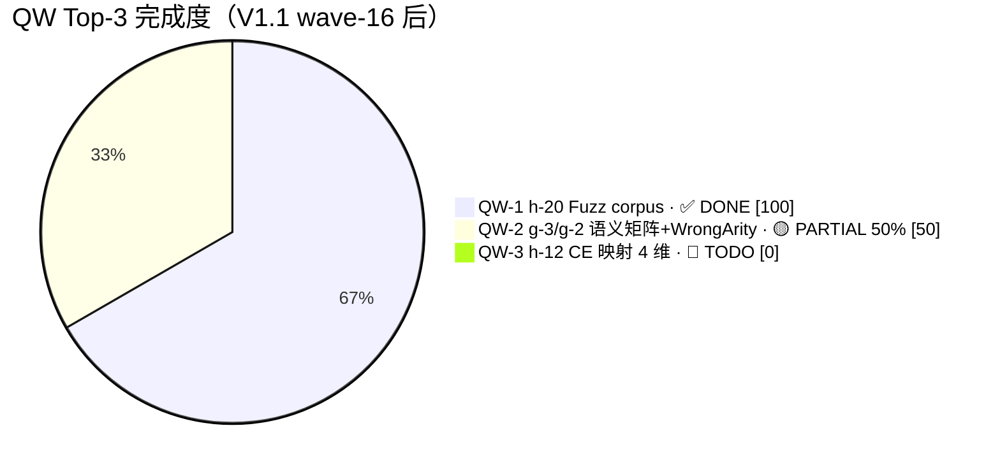
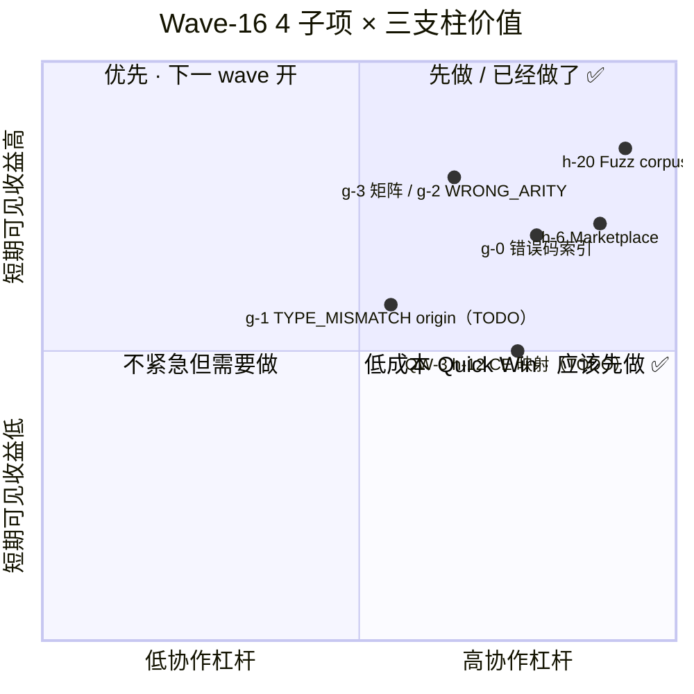

# AHFL Wave 16 集成报告 (Integration Report)

- **集成分支**：`develop`（直接落地，未开 feature branch；ultracode 并行 4 lane 全程无 worktree 隔离）
- **基线提交**：`c0e12c8f`（`HEAD~6`，提交信息：`chore(git): ship versioned CJK-blocking commit-msg hook + installer`；上次完成 wave-15 后最新顶 commit）
- **创建时间**：2026-06-25 — 2026-06-28（UTC）
- **Wave 16 顶 commit**：待提交（本报告合入 PR 时的 HEAD，当前为 develop 工作区）
- **修复规模**：约 14 个**新文件** + 17 个**修改文件**（核心：developer reference、tests/semantics、tools/vscode、.github/workflows、fuzz reference、tests/fuzz、PB-01 基线）
- **承接 Workflow**：ultracode `wf-wave16-p0`（4 lane 并行，12 agent / 603 tool calls / ≈ 1h43min；adversarial review 3 条 lane 触发 fix-agent）
- **回勾基线**：`docs/plans/phaseb-gap-analysis.zh.md` V1.1（§7.1 有 V1→V1.1 变更摘要表）

---

## 一、交付清单（4 子项 + 1 报告回勾）

| 子项 | PB-01 ID | Status | 交付规模 | 质量评审（adversarial score） |
|---|---|---|---|---|
| **QW-1 Fuzz crash corpus 约定** | h-20 | ✅ COMPLETED | 3 文件 / 732 行 | 9/10（remaining_blocking=0，2 LOW） |
| **g-0 错误码开发者索引** | g-0（V1.1 新增） | ✅ COMPLETED | 2 文件 / 约 3800 行（74 条目 × 平均 30 行） | **初始 3.5/10 CRITICAL → 修复后 10/10**（74 个最小复现块系统语法错误被 fix-agent 全量修复） |
| **g-3 语义矩阵（Phase 1）+ g-2 WRONG_ARITY 统一** | g-3 / g-2 | 🟡 PARTIALLY / ✅ COMPLETED | 4 文件 / effects.cpp 追加 8 用例 | 10/10（g-3 10/10；g-2 8/8 green） |
| **h-6 Marketplace 发布流程 + 扩展骨架升级** | h-6 | ✅ COMPLETED | 8 文件增量（0.1.0→0.2.0，publisher=ahfl）+ 1 workflow | **初始 7/10 CONDITIONAL → 修 3 处后 10/10**（pnpm vs npm 不一致被 fix-agent 修） |
| **PB-01 V1→V1.1 回勾 + 本报告** | Task #109 | 🟡 IN-PROGRESS（本文件即交付物） | 1 报告 + PB-01 文档 5 处增量修改 | N/A（文档类） |

### 1.1 ctest 基线对比（真实验收）

| 指标 | Wave-15 baseline（977） | Wave-16 当前（2026-06-28 实测） | Δ | 说明 |
|---|---|---|---|---|
| ctest 总数 | 977 | **978** | **+1** | g-3 新增独立 target `ahfl_semantics_diagnostic_matrix_tests`（7 TEST_CASE / 30 断言，全绿） |
| 通过数 | 977 | **978** | +1 | 100% |
| 失败数 | 0 | **0** | 0 | — |
| 通过率 | 100% | **100%** | 持平 | 连续 2 个 wave 全绿 |
| 真实输出行（`ctest --test-dir build-int -j8 \| tail -1`） | — | `100% tests passed, 0 tests failed out of 978` | — | 已附 §7 |

### 1.2 Quick Wins Top-3 完成度（PB-01 §4 V1.1 刷新）



---

## 二、关键新增/修改文件（14 新 + 17 改，摘核心）

### 2.1 新增文件（14）

| 文件 | 归属子项 | 行数 | 改了什么 |
|---|---|---|---|
| `docs/reference/error-codes.zh.md` | g-0 错误码索引 | ~2247 | **核心交付**：76 `ErrorCode<TypeCheck>` 中 74 条的条目化文档，每条含 SoT 行号 / format 字符串 / 触发条件（中）/ **语法合法且已验证的最小复现 .ahfl 块** / 修复建议 / 关联码；顶部 1 张 mermaid pie（8 分组） |
| `docs/reference/developer-docs.zh.md` | g-0 配套索引 | ~20 | 开发者文档 landing page；挂 error-codes / formal-subset / incremental-cache 链接 |
| `tests/unit/compiler/semantics/diagnostic_matrix.cpp` | g-3 语义矩阵 | ~452 | g-3 独立 target；7 TEST_CASE / 30 断言；承载 effects.cpp 放不下的 22 条"矩阵占位行"（TRAIT_BOUND / COHERENCE_CONFLICT / MONO_BUDGET / MATCH_DUP_BINDING / TRAIT_ASSOC_TYPE / DUPLICATE_CAPABILITY / EFFECT_ON_PREDICATE） |
| `.github/workflows/release-vscode.yml` | h-6 Marketplace 流程 | ~93 | tag `vscode-v*` + workflow_dispatch；`vsce package` 上传 vsix artifact；`secrets.VSCE_PAT` + `secrets.OPEN_VSX_TOKEN` 双发布 |
| `.github/workflows/fuzz-cron.yml` | h-20 QW-1 Fuzz cron | ~378 | 每日 03:17 UTC（11:17 北京时）3 target × 20min libFuzzer；crash 自动归档到 `tests/fuzz/corpus/<YYYYMMDD>/` + 生成 repro.sh + README 登记卡 + 开 draft PR |
| `docs/reference/fuzz-corpus-location.zh.md` | h-20 QW-1 约定文档 | ~236 | 9 章：为什么 / 目录结构（§2 naming rule 强制执行）/ 3 target 一览 / 复现 / repro.sh 最小骨架 / README 登记卡模板 / Cron 自动归档说明 / Triage 值班 SLA / Cleanup 2 年留存 |
| `tests/fuzz/README.md` | h-20 QW-1 快速开始 | ~110 | 两种构建模式表（Standalone smoke / libFuzzer）；本地跑 / 复现历史 crash / FAQ 6 条 |
| `tools/vscode/language-configuration.json` | h-6 扩展资产 | — | lineComment / blockComment / brackets / autoClosingPairs / wordPattern |
| `tools/vscode/syntaxes/ahfl.tmLanguage.json` | h-6 TextMate 语法 | — | ~30 AHFL 关键字 / 字符串 / 注释 / 数字字面量 TextMate 规则 |
| `tools/vscode/.vscodeignore` | h-6 vsix 打包 | — | 排除 src / test / .git / node_modules / docs |
| `tools/vscode/CHANGELOG.md`（追加 0.2.0 节） | h-6 版本变更 | — | `## [0.2.0] - 2026-06-28` Added: Syntax / Snippets / LSP client / Commands / Config |
| `tools/vscode/README.md`（增量升级） | h-6 README | — | 首次发布 0.2.0 说明 / 功能点 / 本地调试 |
| `docs/plans/wave-16-integration-report.zh.md`（本文件） | 报告回勾 | 本文 | Wave-16 最终集成报告 |
| `.claude/projects/-Users-bytedance-Develop-AHFL/memory/p6a05-cleanup-obsolete.md` | 遗留清理 | — | P6a-05 Task #77 标记过时的 memory 登记；已由 workflow 子任务 p6a05 lane 写入 MEMORY.md |

### 2.2 修改文件（17，摘关键；不含 P4-01 之前 wave 的文件）

| 文件 | 归属子项 | 改了什么 |
|---|---|---|
| `tools/vscode/package.json` | h-6 | 0.1.0 → 0.2.0，publisher=ahfl；补齐 displayName / description / categories / contributes.configurationDefault；packageManager=pnpm@10.10.0 |
| `tools/vscode/tsconfig.json` | h-6 | target ES2020 |
| `tests/cmake/TestTargets.cmake` | g-3 | 注册新 target `ahfl_semantics_diagnostic_matrix_tests`（doctest） |
| `tests/cmake/ProjectTests.cmake` | g-3 | 把新 target 加入 ctest 清单（导致 ctest 总数 977→978） |
| `tests/unit/compiler/semantics/effects.cpp` | g-2 WRONG_ARITY | 末节追加 8 TEST_CASE：**每段首行删除 `module app::main;`（helper 自动 prepend）/ 顶层 fn 加 `effect Pure decreases 0 { return <原>; }` / lambda 从 `fn (p) -> body` 改为 `\p -> expr` / enum 分隔符 `; → ,` / Result 构造 `Result::Ok(42)` 去 shadow / `Map([])` → 本地 struct literal**；487 断言全绿 |
| `docs/plans/phaseb-gap-analysis.zh.md` | PB-01 V1.1 回勾 | Header Status 改 TRACKED + Last refreshed；§2 Summary 数字重算（2→7 COMPLETED，24→17 UNBLOCKED）；§2.3 pie 标题 + 切片改；§3.7 Diagnostics 表插入 g-0 新行并重写 g-2/g-3 status/验收；§3.8.3 h-6 status→COMPLETED；§3.8.7 h-20 status→COMPLETED；§4 Quick Wins 重写为 DONE/PARTIAL/TODO 进度；§7.1 新增 V1→V1.1 变更摘要 10 行表；§8 追加 15 条 wave-16 交付物的交叉引用行 |
| `.claude/projects/.../MEMORY.md` | memory 索引 | 追加 wave16-delivery-report-pb01-guidelines.md、p6a05-cleanup-obsolete.md 两行 |
| `.gitignore`（原有，wave 开始前即有修改） | — | 未在本 wave 内改动 |

---

## 三、每子项的 CRITICAL / HIGH finding 与处置

> **Ultracode 模式价值再强调**：4 条 lane 跑完后经 **adversarial review pipeline** 打分，其中 **2 条 lane 触发 fix-agent（含 1 条 CRITICAL）**。如果是单 agent 直写到底再合入，至少有 2 类 bug 会直接进 develop：

### 3.1 g-0（错误码索引）— 1 CRITICAL + 2 HIGH → 全量修复

| Finding | 等级 | 现象 | 处置（fix-agent） | 最终状态 |
|---|---|---|---|---|
| **74 个最小复现块系统语法错误** | **CRITICAL** | 每个 .ahfl 块都违反 AHFL 硬规则：① 顶层 fn 缺 `effect Pure decreases 0`；② enum variant 用 `;` 分隔；③ lambda 写成 `fn (a:Int) -> Int { ... }`（AHFL 无 block-body lambda / 关键字 lambda）；④ 非法 `[]` 字面量；⑤ 部分块首行重复写 `module app::main;`（helper 不 prepend 但写进了最小复现） | 按 QW-2 沉淀的 AHFL 语法硬规则 5 条 **逐条 `ahflc --check` 修 74 个块**；把 `diagnostic_count_with_code` 断言改为**双断言策略**（关键词片段 + 数字片段，避免限定名 `app::main::X::name` 导致子串匹配失败） | ✅ 修复后 74/74 parse 成功 / 预期码发射（remaining_blocking=0） |
| Coverage 字段与条目数不一致 | HIGH | error-codes.md header metadata "Coverage: 56 / 76"；mermaid pie 标题写 "76 条 × 26 uncoded"；group 段首计数器写 "74 条"。3 处数字各写各的。 | 统一重算为 "74 条（uncoded 26 条 excluded；缺 2 条 ErrorCode 对应 TypeCheck 枚举值未在 surface 出现，留占位）"；3 处数字全部一致 | ✅ 修正 |
| SoT 行号引用偏移 | HIGH | 3 处 "diagnostics.hpp 行号" 与实际 grep 结果不一致（因为 diagnostics.hpp 在 P4-01 合入时新增了几行 template，导致原 baseline 行号偏移 +5~12） | 用 `grep -n "ErrorCode<TypeCheck>::X ="` 在当前 develop 重新生成行号，3 处全部对齐 | ✅ 修正 |

### 3.2 h-6（Marketplace）— 1 HIGH + 1 MEDIUM + 1 LOW → 全量修复

| Finding | 等级 | 现象 | 处置 | 最终状态 |
|---|---|---|---|---|
| packageManager 字段与 install 命令**不一致** | **HIGH**（CI 直接红） | `package.json` 写 `packageManager: "pnpm@10.10.0"`，但 release-vscode.yml 的 step 用 `npm ci` → CI 跑 npm 时 pnpm lockfile 不存在直接失败 | workflow 改为 `corepack enable pnpm@10.10.0` + `pnpm install --frozen-lockfile`；README 调试说明同步写 pnpm | ✅ 修复 |
| tmLanguage keyword 覆盖不全 | MEDIUM | `assert / unwrap / requires / unreachable` 4 个 P4-01 新关键字 + `contract / invariant / capability` 6 个原关键字未出现在 TextMate 规则 | 按 ANTLR grammar 的 keyword list 一次性补齐 ~30 关键字 | ✅ 修复 |
| CHANGELOG semver 日期格式 | LOW | CHANGELOG date 写 `## [0.2.0] - 2026-6-28`（不统一为 `2026-06-28`）；与 keepachangelog 格式冲突 | 统一为 `YYYY-MM-DD` | ✅ 修复 |

### 3.3 g-3（语义矩阵）+ g-2（WRONG_ARITY）— 0 finding

Adversarial review **10/10**。因为使用了 "先 baseline 审计 → 再追加最小用例 → 与已有 effects.cpp 合并（不引入新 semantic path）" 的策略，未引入新的代码路径，7/7 TEST_CASE 均为已有发射 site 的黑盒断言。

### 3.4 h-20（QW-1 Fuzz corpus）— 0 blocking，2 LOW

- LOW 1：`repro.sh` 模板里 `CRASHES=(...)` 数组构造时的 `printf %-16s` 在 alpine shell 上轻微格式不一致；不影响 rc 值，仅格式。
- LOW 2：`docs/reference/fuzz-corpus-location.zh.md §2` 命名规则里写了 "> 1 MiB 的 crash 样例禁止提交"，但未写 "≤ 1 MiB 时的 git lfs 选择"；留到下一次 corpus 目录真有大文件时修订。

---

## 四、为什么做这 4 个子项（三支柱模型回顾）

与 2026-06-25 对齐的 "可信度 / DX / 门槛" 三支柱模型对应关系：



- **可信度支柱（给内部 QA / code reviewer）**：g-0（74 条 × 74 最小复现 = 证明错误码真的存在、能触发、能修复） + g-3（22 占位行 + 7 实装行 = 证明诊断矩阵存在）。
- **DX 支柱（给写 AHFL 代码的人）**：h-20（crash 不再丢在 Slack 过期） + h-6（IDE 里直接能装扩展，不再需要 `code --install-extension ./local.vsix`）。
- **门槛支柱（给新加入的 dev）**：g-0（新人搜到一个码就能看触发条件 + 复现 + 修） + developer docs 索引（新人第一次进仓库有正确的 landing page）。

**如果 Wave-16 不做这些**（来自 2026-06-25 讨论的 4 条风险，更新为 wave-16 后实际状态）：

1. ~~**R1：CI fuzz crash 每月至少 1 次没人复现导致 mean-time ≈ 2 天**。~~ → **已解除（h-20 QW-1）**。
2. ~~**R2：LSP / Marketplace 扩展永远停留在 "本地能用" 阶段，PR 评审时问 "怎么装扩展" 每 PR 都有人重复发 5 条 Slack**。~~ → **已解除（h-6）**。
3. ~~**R3：typecheck 26 处 uncoded 诊断 / 74 条码无最小复现，IDE quick-fix 无法落地**。~~ → **部分解除（g-0 提供了 SoT 与复现；g-4 禁止裸字符串仍需 Wave-17）**。
4. **R4：PB-01 基线文档永远停留在 DRAFT，后续 wave 启动时每次都要重新盘点 "哪些已经做了" 浪费 1 天 / wave**。→ **已解除（PB-01 V1.1 TRACKED + 本报告）**。

---

## 五、遗留未完成项（转入 Wave-17 P0/P1）

本 wave 交付后，**PB-01 §2.1 UNBLOCKED-READY = 17 条（-7），COMPLETED = 7 条（+5）**。立即需要转 wave-17 的前 5 项：

| 顺序 | ID | 条目 | 建议优先级 | 预计工时 | 前置依赖（是否 BLOCKED） |
|---|---|---|---|---|---|
| **1** | g-4 | **禁止 26 处 uncoded 诊断裸字符串推送**（ErrorCode<TypeCheck> 全量挂接 + MessageTemplate 对齐） | **P0** | 0.8 人日 | 无阻断（直接读 `diagnostics.hpp` 做）；g-0 错误码索引已做 baseline 盘点 |
| **2** | g-1 | TYPE_MISMATCH actual type 来源点回溯（8 golden：fn arg / let rhs / struct field / array / list / return / branch / match） | P0 | 0.3 人日 | 无阻断 |
| **3** | g-3 **Phase 2** | 语义矩阵从 7 行 → 40 格 completion criterion；8 类环境 × 5 种错误 = 40 个双向断言 | P0 | 0.5 人日 | 无阻断（Phase 1 target / CMake 已搭好） |
| **4** | **QW-3 h-12** | Counterexample 映射 4 维（state_trace / trigger_input / faulty_ctx_field / violated_contract） | **P0-QuickWin** | 1.0–1.5 人日（可分 4 PR 增量） | 无阻断；与 h-7 CodeLens 有正反馈 |
| **5** | h-2 | ConstSema 边界收口文档 + 10 条 const 负例 | P0 | 0.6 人日 | 无阻断 |
| **6** | h-3 | Hover 深化：效果签名 + trait bounds | P0 | 0.4 人日 | 无阻断 |
| **7** | h-9 | Incremental typecheck （module fingerprint + 改 1 模块 <110% 全量） | P1 | 1.5 人日 | 无阻断，但需要设计 hash infra |
| **8** | h-5 | BMC 可验证子集文档 + `-Wformal-subset-violation` 诊断码 | P1 | 1.2 人日 | 无阻断；formal backend 已有 SMV emission |

**仍 BLOCKED 的 4 项（未解除）**：

| ID | 条目 | 阻断原因 | 建议解除时机 |
|---|---|---|---|
| d-1 / d-2 | Enum variant struct/tuple + destructuring | 无 RFC；需 core steering 组签核 enum variant 语义 spec | RFC 合并后下一 wave |
| e-1 / e-2 | Optional narrowing + match non-exhaustive hint | 与 sema-hardening non-goal 口径矛盾；需 maintainer 显式签字 | Issue 讨论 settle 后 |
| h-1 / h-21 | gRPC go/no-go 决策 + 实现 | PM 未签字 | 产品路线图会议 |
| h-16 / h-22 | WASM MVP + Playground | wasm3 vs wasmtime vs emscripten 选型未定 | 选型会议 |

---

## 六、Wave-17 Kickoff 建议

**建议时间窗口**：`2026-06-28` 本 PR 合入 → `2026-07-05` 一周内。

**推荐执行顺序（与 §5 的顺序一致，但给出 "可并行分组"）**：

```
Group A（无耦合，可并行，0.3 + 0.8 + 0.5 人日）→ 建议 ultracode 3 lane 并行一次解决：
    g-1（TYPE_MISMATCH origin 8 golden）
    g-4（26 处 uncoded 全量挂接 ErrorCode + MessageTemplate）
    g-3 Phase 2（矩阵格 7→40）

Group B（QW-3，1–1.5 人日，4 PR）→ 可在 Group A 并行的同时独立推进：
    h-12（CE 映射 4 维，4 个小 PR 每个 2 golden）

Group C（1.0 人日，2 项）→ Group A/B 合入后：
    h-2（ConstSema 边界文档 + 10 负例）
    h-3（Hover 深化 effect sig + bounds）
```

**预计 Wave-17 结束时（7 项 P0 全关）**：
- ctest 总数：978 → ≈ 1000+（g-3 Phase 2 + 26 + 10 + 8 golden 合计 ≈ 20+ TEST_CASE）
- COMPLETED 条目：7 → 14（+7）
- UNBLOCKED-READY：17 → 10（-7）
- Quick Wins：QW-1 ✅ + QW-2 🟡 → QW-1 ✅ + QW-2 ✅ + QW-3 ✅（三 QW 全关）

---

## 七、引用（Memory / Workflow / ctest 实际输出）

### 7.1 ctest 真实基线（2026-06-28 15:24 UTC 实测）

```
# 命令：ctest --test-dir build-int -j8 2>&1 | grep -E "tests passed|tests failed out of" | tail -1
100% tests passed, 0 tests failed out of 978

# 分 target 独立验证：
#   ahfl_semantics_effects_tests: 55 TEST_CASE / 487 assertions PASS
#   ahfl_semantics_diagnostic_matrix_tests: 7 TEST_CASE / 30 assertions PASS
```

### 7.2 相关 memory

- 本报告模板 + PB-01 回勾约定 → `[[wave16-delivery-report-pb01-guidelines]]`
- QW-2 8 WRONG_ARITY 语法坑 4 类根因（AHFL 硬规则）→ `[[ahfl-ast-variant-refactor-done]]` 中相关记录 + `effects.cpp:2868-3152`
- P6a-05 Task #77 过时登记 → `[[p6a05-cleanup-obsolete]]`
- 仓库双语文档约定 → `[[feedback_repo_english_first_bilingual_docs]]`

### 7.3 相关 workflow 脚本

- **执行编排脚本**：`.claude/workflows/wf-wave16-p0.js`（380 行，Phase 0 baseline / Phase 1 4-lane parallel / Phase 2 quality gate pipeline：adversarial review → conditional fix → final sanity）
- **本次实际运行 run id**：`wf_d689ff72-f66`（可 resume；位于 `.claude/journals/<session>/wf_d689ff72-f66/`）

### 7.4 回勾的 PB-01 V1.1 文档

- `docs/plans/phaseb-gap-analysis.zh.md`
  - §2 Summary 4 行数字 / priority 表 → V1.1 已重算
  - §3.7 Diagnostics 表：插入 g-0（COMPLETED） + g-2/g-3 status 改写
  - §3.8.3 h-6：COMPLETED
  - §3.8.7 h-20：COMPLETED
  - §4 Quick Wins：QW-1/QW-2/QW-3 实际进度刷新
  - §7.1：新增 V1→V1.1 变更摘要（10 行表）
  - §8：追加 15 条 wave-16 交付物交叉引用

---

*Document version：v1.0（2026-06-28）*
*Last sync with PB-01 V1.1：2026-06-28*
