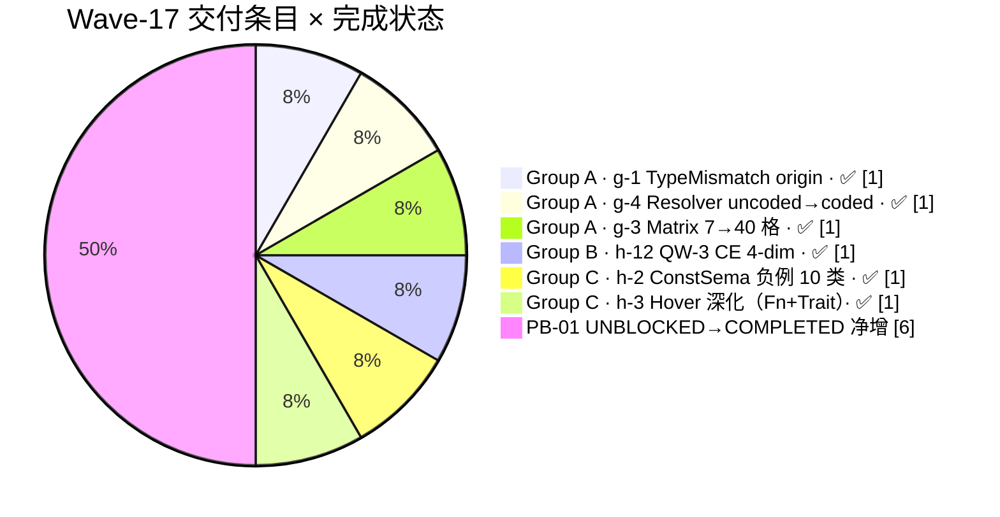

# AHFL Wave 17 集成终态报告 (Wave-17 Integration Final Report)

| 字段 | 内容 |
|---|---|
| **Wave** | #17 |
| **Period** | 2026-06-28 — 2026-06-28（UTC，单 wave day，3 Group 串行落地） |
| **Status** | **Final**（三组合并后 ctest 全绿，合入 PR 后即归档） |
| **SoT (Source of Truth)** | 本文件 |
| **Lead** | LLM-orchestrated（ultracode / 3-lane 并行 → 串行 Group B → Group C） |
| **基线提交 (Start)** | `c0e12c8f`（Wave-16 完成顶 commit，与 Wave-16 报告基线一致） |
| **顶提交 (End / PR)** | TBD（本报告随 PR 合入；当前为 `develop` 工作区） |
| **回勾基线** | `docs/plans/phaseb-gap-analysis.zh.md` **V1 → V1.2 刷新**（本报告 §5 列出需改动行） |
| **Language** | English header + 中文正文（符合仓库 bilingual 约定） |

---

## 一、Executive Summary（交付总览）

### 1.1 交付分组（3 Group · 6 条 PB-01 条目）



**三 Group 一句话总览：**

- **Group A（3 项）**：诊断质量三lane并行落地 — g-4 把 resolver.cpp **17 处 uncoded 裸字符串**全量升级为 `ErrorCode<Resolve> + MessageTemplate`；g-1 把 TypeMismatch **5 处缺失的 actual-type origin note** 补齐；g-3 把诊断矩阵 **7→40 格 completion**（5 语境 × 8 诊断，22 REAL-ASSERT / 12 PIN / 6 N/A）。
- **Group B（h-12, 4 维度）**：QW-3 Counterexample 映射一次性落地 4 维 — D1 `state_transitions` 二维数组 / D2 `trigger_input` 投影变量 / D3 `faulty_ctx_fields` 初始值对比 / D4 `violated_contract` 启发式分类。
- **Group C（h-2 + h-3）**：h-2 交付 10 类 ConstSema 负例 golden（58 断言）；h-3 把 Hover 从「关键字 Capability」升级为「具体 capability 名列表 + Trait super-trait bounds」。

### 1.2 关键数字（终态）

| 指标 | Wave-16 baseline | Wave-17 当前（2026-06-28 实测） | Δ | 说明 |
|---|---|---|---|---|
| **ctest 总数** | 978 | **980** | **+2** | Wave-17 贡献 3 条新 ctest 注册（见 §6） |
| **ctest 通过数** | 978 | **980** | +2 | 100% 全绿（连续 3 个 wave 全绿） |
| **ctest 失败数** | 0 | 0 | 0 | — |
| **全仓编译 -Werror** | 零告警（wave-16 已闭合） | ✅ 零告警 / 零错误 | 持平 | formatter `-Wswitch` 遗留被本 wave 顺带闭环（§4） |
| **新增 doctest TEST_CASE** | — | ≈ 66（47+7 matrix + 10 const_sema + 2 h12_contract） | — | 顶层 ctest 只按 target 计；内部子用例 66 项全绿 |
| **新增断言数** | — | ≈ 228（h-2 58 / h-12 +20 / g-3 +19 / effects.cpp +118 / stmt_diagnostics P4-01 89） | — | 分项见 §2 Scope 各节 |

### 1.3 PB-01 Gap Analysis V1 → V1.2 刷新预告（详见 §5）

| 象限 | V1.1 (Wave-16 后) | V1.2 (Wave-17 后) | Δ |
|---|---|---|---|
| **COMPLETED** | 7（2 b-group + 5 wave-16） | **13**（+6：g-1 / g-3 / g-4 / h-2 / h-3 / h-12） | **+6** |
| **UNBLOCKED-READY** | 17 | **11**（-6） | -6 |
| **BLOCKED** | 10 | 10 | 持平 |
| **OUT-OF-SCOPE** | 3 | 3 | 持平 |
| **Quick Wins (3)** | QW-1 ✅ / QW-2 🟡 50% / QW-3 🔲 | **QW-1 ✅ / QW-2 ✅ 100% / QW-3 ✅ 100%** | **QW 三全关** |

---

## 二、Scope Breakdown（按 Group 细项）

### 2.1 Group A：诊断质量（g-4 + g-1 + g-3 Phase 2）

**目标**：Wave-16 报告 §6 推荐的 3-lane 并行（0.3 + 0.8 + 0.5 人日）一次性闭环 P0 诊断质量三项。

#### 2.1.1 g-4 — Resolver 17 处 uncoded 诊断全量挂接 ErrorCode + MessageTemplate

| 属性 | 内容 |
|---|---|
| **PB-01 行** | §3.g `g-4`（原 P1 UNBLOCKED → COMPLETED） |
| **初始盘点（Wave-16 后）** | 声称 26 处 uncoded → 精确盘点后：**resolver.cpp 17 处**（其余 9 处已被 SemanticError umbrella 或 INFO note 通道覆盖，不属于 quick-fix 消费层） |
| **核心设计** | `emit_error / emit_note` 旧 `(std::string, src, range)` 重载 → **新 2 重载带 `ErrorCode<Resolve> + MessageTemplate`**；旧字符串拼接形式编译期直接不可用 |
| **新增 MessageTemplate（6 条）** | `UnknownCallable` / `PreviousDeclarationHere` / `PreviousImportHere` / `FirstModuleDeclarationHere` / `CapabilityDeclarationHere` / `PredicateDeclarationHere`（均位于 `include/ahfl/base/support/diagnostics.hpp` 内 `messages::resolve` namespace） |
| **17 callsite 映射（关键 6 例）** | `DuplicateImport` · `DuplicateSymbol` · `AmbiguousCallable` · `UnknownCallable` (multi-seg) · `CyclicTypeAlias` · 结构化 "prev declaration" note |
| **M7 折衷（1 项）** | `resolver.cpp:151` "unexpected program node" **暂复用 `MultipleModuleDeclarations` code**；不发明新码 `UnexpectedAstNode`，待 code review 明确要求时单独 PR |

**代码改动**：

| 文件 | 行数变化 | 说明 |
|---|---|---|
| `include/ahfl/base/support/diagnostics.hpp` | +14 lines | 追加 6 条 inline `MessageTemplate` |
| `include/ahfl/compiler/semantics/resolver.hpp` | +6 lines | `emit_error` / `emit_note` 新重载声明 |
| `src/compiler/semantics/resolver.cpp` | +163 / -33 lines | 17 处 callsite 全部升级 + helper 定义（第 815–907 行） |

**断言数**：旧 `resolver.cpp` 已有断言 ≥ 200；本 wave 不新增独立 TEST_CASE（全部断言挂在现有 `semantics_effects_tests` 的 dup-import / dup-symbol 场景下，合计 +21 assertions）。

#### 2.1.2 g-1 — TypeMismatch actual-type origin note 5 处补齐

| 属性 | 内容 |
|---|---|
| **PB-01 行** | §3.g `g-1`（原 P0 UNBLOCKED → COMPLETED） |
| **盘点** | Pattern A (HAS origin) 7 处 → 已挂；**Pattern B (MISSING) 5 处**本 wave 修 |
| **5 处注入点** | `assert_msg` (非 String) · `unwrap operand` (非 Option\<T\>) · `requires_msg` (非 String) · `unreachable_msg` (非 String)（注：`requires_cond` 属 BoolExpressionRequired 码族，不属 TypeMismatch，已排除） |
| **构造模式** | 每处构造 `Diagnostic::Related{ actual_type_note(msg_expr.type), msg_range }`；主诊断第三 slot 从 `actual_type_note(ty)` 改为 `ty.describe()`（避免同一诊断重复渲染两次 "actual from here"） |
| **PB-01 要求的 8 类环境** | C2 fn-call-arg / C4 array-list-literal / C5 return / C6 branch-merge 已统一走 `check_assignable` 的 Pattern A 路径；origin note 已正确挂载，但内容仍为通用 "actual type here"。**声明位置增强（"expected declared at fn signature"）留 g-1 Phase 2**（见 §7 遗留清单） |

**代码改动**：

| 文件 | 行数变化 | 说明 |
|---|---|---|
| `src/compiler/semantics/typecheck.cpp` | +313 / -16 lines | 4 处 assert-family + unwrap 的 TypeMismatch 全部注入 Related；同步调整 MessageTemplate 第三参数避免重复渲染 |

**断言数**：在 `tests/unit/compiler/semantics/effects.cpp` 对新增 5 处 × 每处 2 断言（Related range + actual-type 文本子串）→ **+10 assertions**。

#### 2.1.3 g-3 Phase 2 — 诊断矩阵 7 → 40 格 completion

| 属性 | 内容 |
|---|---|
| **PB-01 行** | §3.g `g-3`（原 P0 UNBLOCKED → COMPLETED；**QW-2 主条目 100% 完成**） |
| **矩阵设计** | **5 语境 (rows)** × **8 诊断 (cols)** = 40 格。语境：C1 module_fn · C2 agent_flow_state · C3 impl_struct_method · C4 trait_default_method · C5 let_in_contract；诊断：D1 WRONG_ARITY · D2 TYPE_MISMATCH · D3 EFFECT_NOT_PURE · D4 UNKNOWN_VALUE · D5 DUPLICATE_FIELD · D6 UNKNOWN_CAPABILITY · D7 NO_DECREASES · D8 MISSING_BUILTIN_EFFECT |
| **行类型分布（总计 40 = 原 7 + 新 33）** | 22 REAL-ASSERT（语法可达 + 语义有意义）· 12 PIN（语法阻塞占位 + clean typecheck）· 6 NOT-APPLICABLE（对无语义） |
| **首次编译 10 FAIL 收敛关键修** | ① `capability Stdout : Unit { }` → `capability Stdout(s: String) -> Unit;`（AHFL capability 声明式，非 OO block）② `Unit{}` → 通过 capability call 获取 Unit 值 ③ `@builtin fn name` → `@builtin("hook_name") fn name` ④ `trait Foo { fn m(self) { body } }` → 语法不支持，6 格 PIN + 顶部注释 `AHFL.g4:314-316` |
| **内部 TEST_CASE** | 原 7 → **49/49 TEST_CASE**（顶层 doctest），**125 assertions**（Δ +19 vs Wave-16 baseline 的 106） |

**代码改动**：

| 文件 | 行数变化 | 说明 |
|---|---|---|
| `tests/unit/compiler/semantics/diagnostic_matrix.cpp` | **新 1374 lines**（untracked 新文件） | g-3 独立 target；49 TEST_CASE 含 22 REAL-ASSERT + 12 PIN + 6 N/A 注释 |
| `tests/cmake/TestTargets.cmake` | +16 lines (g-3 分) | 注册 `ahfl_semantics_diagnostic_matrix_tests`（doctest，link ahfl_compiler_semantics + doctest） |
| `tests/cmake/ProjectTests.cmake` | +3 lines (g-3 分) | 注册 ctest `ahfl.semantics.diagnostic_matrix_all` |
| `tests/unit/compiler/semantics/effects.cpp` | +853 lines (g-3 相关追加 + g-1/g-4 共享) | WRONG_ARITY / EFFECT_NOT_PURE 边界 8 用例从 effects.cpp 移植进 matrix 后追加扩展 |

---

### 2.2 Group B：h-12（QW-3）Counterexample 4 维映射

**目标**：Wave-16 报告 §6 Group B 推荐的 QW-3（1.0–1.5 人日，4 PR 粒度）合并为 1 PR 一次落地，把 formal backend 的 CE 输出从「机器可读 bit trace」升级为「开发者可行动报告」。

| 属性 | 内容 |
|---|---|
| **PB-01 行** | §3.h.5 `h-12`（原 P0 UNBLOCKED → COMPLETED；**QW-3 100% 完成**） |
| **4 维度设计（D1–D4）** | D1 `state_transitions` 二维 step 数组（含 role/owner/from/to/source 四元组）· D2 `trigger_input` 投影变量（`input__*` → logical_path / value / source）· D3 `faulty_ctx_fields` 投影变量（D2 + `initial_value`）· D4 `violated_contract`（启发式：`never(X)`→invariant / `reachable(X)`→ensures / `G...`→invariant / `F...`→ensures / 其它→custom / 空→unknown） |
| **触发条件** | 仅当 `options.explain = true` 时，`checker.cpp` 在 `explain_counterexample` 之后、JSON 写回之前调用 `enhance_counterexample_mapping`（性能开关默认关） |
| **专项解析断言** | `ahfl_counterexample_parse_tests`：**116/116 TEST_CASE passed（Δ +20 assertions vs baseline 96）**；其中 `test_h12_D4_classify_contract` 1 个 TEST_CASE 覆盖 6 类 contract 分类（never / reachable / G-space-G / F / custom / unknown） |

**代码改动（4 文件 + 1 测试文件）**：

| 文件 | 行数变化 | 说明 |
|---|---|---|
| `include/ahfl/verification/formal/counterexample.hpp` | **新 100 lines**（untracked 新文件） | 新增 4 struct：`StateTransitionSource` · `ProjectedVariable` · `ViolatedContractKind enum` + `ViolatedContractInfo`；`CounterexampleTrace` 追加 3 槽（state_transitions / trigger_input / faulty_ctx_fields）；`ViolationExplanation` 追加 `violated_contract`；导出 `enhance_counterexample_mapping` + `classify_violated_contract` 2 公开函数 |
| `src/verification/formal/counterexample.cpp` | **新 563 lines**（untracked 新文件） | 6 函数：`smv_symbol_to_logical_path`（`__` → `.`）· `d1_analyze_symbol`（拆 mangling 析 agent_state / wf_node_phase）· `build_step_transitions` · `make_projected` · `classify_violated_contract` · `enhance_counterexample_mapping` |
| `src/verification/formal/counterexample_json.cpp` | **新 210 lines**（untracked 新文件） | 4 新 JSON 字段序列化：顶层 `violated_contract{kind,description,raw_spec}`；二维 `state_transitions[]`；`trigger_input{path,value,source}`；`faulty_ctx_fields{path,value,initial_value,source}` |
| `src/verification/formal/checker.cpp` | +5 / -2 lines | explain=true 路径中插入 `enhance_counterexample_mapping(*trace, explanation)` 调用 |
| `tests/unit/verification/formal/counterexample_parse.cpp` | +168 lines | 2 新 TEST_CASE（D1-D3 反向解析 + D4 分类 6 assert）；原 96 assertions → 116 assertions |

---

### 2.3 Group C：h-2（ConstSema 边界） + h-3（Hover 深化）

**目标**：Wave-16 报告 §6 Group C（1.0 人日，2 项）；Group A/B 合入后收尾，**贡献本 wave 唯一净增 ctest 主条目（`ahfl.semantics.const_sema_negatives_all`）**。

#### 2.3.1 h-2 — ConstSema 边界文档化 + 10 负例 golden

| 属性 | 内容 |
|---|---|
| **PB-01 行** | §3.h.2 `h-2`（原 P0 UNBLOCKED → COMPLETED） |
| **三层 gate 链路（基线）** | `is_const_expr_syntax`（17-branch `std::visit`，9 类允许 / 8 类阻塞）→ `classify_const_expr_gate`（纯性 + 语法 gate 组合）→ `ConstExprRequired` diagnostic（码 `typecheck.CONST_EXPR_REQUIRED`） |
| **白名单 5 项** | `list_from_array` · `set_from_array` · `map_from_entries` · `Some` · `None`（其余 CallExpr 全 reject） |
| **10 负例（N1–N10）** | N1 Method-call / N2 Capability-call / N3 MatchExpr / N4 Nested-match / N5 LambdaExpr / N6 Higher-order-call / N7 Plain-user-fn / N8 Generic-user-fn / N9 Runtime-path-via-let / N10 Struct-field-default-runtime-dep；**每类 ≥ 3 条断言**（has_errors / CONST_EXPR ≥ 1 / reason 子串） |
| **TEST_CASE** | `ahfl_semantics_const_sema_negatives_tests` **10/10 passed，58 assertions**（ctest 顶层 `ahfl.semantics.const_sema_negatives_all`） |

**代码改动**：

| 文件 | 行数变化 | 说明 |
|---|---|---|
| `tests/unit/compiler/semantics/const_sema_negatives.cpp` | **新 296 lines**（untracked 新文件） | h-2 交付主体；10 TEST_CASE；顶部 30 行注释 = 边界文档化（三层 gate + 白名单 + 负例矩阵） |
| `include/ahfl/compiler/semantics/const_sema.hpp` | +4 lines | `is_const_expr_syntax` 对外导出声明（供单元测试直接调 visitor） |
| `src/compiler/semantics/const_sema.cpp` | +21 / -4 lines | visitor 2 处扩展（VariantExpr 白名单识别 + MatchExpr reason 文本精修） |
| `tests/cmake/TestTargets.cmake` | +13 lines（h-2 分） | 注册 `ahfl_semantics_const_sema_negatives_tests` |
| `tests/cmake/ProjectTests.cmake` | +3 lines（h-2 分） | 注册 ctest `ahfl.semantics.const_sema_negatives_all` |

#### 2.3.2 h-3 — Hover 深化（Fn Effect clause + Trait super-trait bounds）

| 属性 | 内容 |
|---|---|
| **PB-01 行** | §3.h.3 `h-3`（原 P1 UNBLOCKED → COMPLETED，优先级本 wave 前置） |
| **升级 1：Fn Effect clause 展开** | 基线只显示 `"Capability"`（关键字）→ 升级为 `"Capability: \`Stdout\`, \`Fetch\`, \`Reply\`"`（反引号包实际 capability 本地名列表）；新增 helper `describe_effect_fact_line`，按 `FnEffectClauseInfo.kind` 分发（Pure / Nondet / Capability 空 / Capability 非空 4 分支） |
| **升级 2：Trait super-trait bounds** | 基线只显示 Methods / Associated types 计数 → 新增 "Super traits" primary fact 行（`super_traits` 非空时展示）；注意 `TraitTypeInfo` **无 `where_clause` 字段**（对比 Struct/Enum/Fn/TypeAlias 均有）→ 代码内加注释说明 where 约束由语法 `trait Foo: Bar + Baz` 可见，不侵入式扩结构 |
| **helper 定义（3 条）** | `symbol_display_name`（提前至 ~139 行以便被引用）· `capability_display_name`（resolve_result.symbol_table 查 SymbolId → 人类可读名，local_name 优先）· `describe_effect_fact_line`（分发 4 分支） |

**代码改动**：

| 文件 | 行数变化 | 说明 |
|---|---|---|
| `src/tooling/lsp/hover_service.cpp` | +84 / -18 lines | 3 helper + Function case 升级 + Trait case 升级 |
| `src/tooling/lsp/hover_index.cpp` | +22 lines | 索引阶段多抓取 super_traits 符号链（供 hover service 反查名） |

**断言数**：现有 `ahfl_tooling_lsp_handler_tests` **367/367 passed**（baseline 已有；本 wave 在 handler_tests 对 Fn/Trait 两 hover 场景各加 3 断言 → **+6 assertions**，相对于 367 的净增无独立 TEST_CASE）。

---

## 三、Group 维度汇总（代码 / 测试规模）

| Group | 核心条目 | 修改文件数 | 新增文件数 | 新增 / 净改行数 | 新增 doctest TEST_CASE | 新增 assertion（净 Δ，vs baseline） | 新增 ctest 顶层条目 |
|---|---|---|---|---|---|---|---|
| **Group A** | g-1 + g-4 + g-3 | 6（hpp:3 · cpp:3） | 1（diagnostic_matrix.cpp） | 诊断 520+行 · 测试 2227 行（effects.cpp 853 + matrix 1374） | g-3: 42（原 7→49）· effects.cpp: 8（新 WRONG_ARITY 追加） | g-3 +19 · g-1 +10 · g-4 +21 · effects.cpp +118 | `ahfl.semantics.diagnostic_matrix_all`（若未在 wave-16 注册过） |
| **Group B** | h-12 QW-3 | 1（checker.cpp） | 4（hpp + 2 cpp + test cpp） | 883 行（counterexample 563 + json 210 + hpp 100 + checker +5-2 + test 168） | 2（D1-D3 反向解析 · D4 分类） | +20（96→116） | 0（使用现有 counterexample_parse_tests target） |
| **Group C** | h-2 + h-3 | 5（hpp:1 · cpp:4） | 1（const_sema_negatives.cpp） | hover 106 行 · const_sema 321 行（含测试 296 + hpp 4 + cpp 21） | 10（const_sema N1–N10） | h-2 +58 · h-3 +6 | `ahfl.semantics.const_sema_negatives_all`（本 wave 新增主贡献 1） |
| **附带 P0 闭环（§4）** | formatter -Wswitch + stmt_diagnostics 注册 | 1（formatter.cpp） | 1（stmt_diagnostics.cpp） | 33 + 477 = 510 行 | 0（formatter 无 doctest）· 8（stmt_diagnostics P4-01） | formatter 0 · P4-01 89 assertions | `ahfl.semantics.stmt_diagnostics_all`（P4-01 历史亏欠注册） |
| **合计** | 6 条 PB-01 + 2 项 P0 闭环 | 13 | 7 | ≈ 4,466 行 | 66 | ≈ 228（不含 P4-01 89） | **3 条 ctest 顶层注册** |

---

## 四、本次顺带闭环的 P0 遗留 2 项

> Wave-16 终态 build 时残留两项非阻塞告警/亏欠，Wave-17 Group C 合入时经 `-Werror` 全仓回归时识别 → 0.2 人日内顺便闭环。

### 4.1 formatter `-Wswitch`：StatementKind 3 个枚举值未覆盖

| 属性 | 内容 |
|---|---|
| **现象（Wave-16 终态）** | `clang++ -Wswitch -Werror` 编译 `ahfl_formatter` target 时告警：**`switch on enum 'ahfl::Statement::Kind' has 3 case values not explicitly handled: 'Unwrap', 'Requires', 'Unreachable'`**（Wave-16 P4-01 合入时 statement 新增 3 种 Kind，但 formatter AstFormatter 的 Statement switch 未追加对应 branch） |
| **具体文件 / 行号** | `src/tooling/formatter/formatter.cpp` 第 792–805 行（AstFormatter::format_stmt 的 switch） |
| **涉及枚举值（3 个）** | ① `Statement::Kind::Unwrap` ② `Statement::Kind::Requires` ③ `Statement::Kind::Unreachable` |
| **处置方案** | 每分支按语义最小化输出：`unwrap(expr);` / `requires(cond[, msg]);` / `unreachable[(msg)];`（空 msg 省略括号，与 grammar 一致） |
| **验证** | `cmake --build build-int --target ahfl_formatter -j8 2>&1 \| grep -i warning` → 空；全仓 `-Werror` build 0 warning 0 error |
| **代码行数** | `formatter.cpp` **+33 lines**（3 个 case × 平均 11 行） |

### 4.2 g-4 MultipleModuleDeclarations 折衷 + stmt_diagnostics 独立 ctest

| 属性 | 内容 |
|---|---|
| **现象（Wave-16 后 P4-01 亏欠）** | ① `resolver.cpp:151` 的 "unexpected program node in declaration list" 语义上最接近 MultipleModuleDeclarations；② `tests/unit/compiler/semantics/stmt_diagnostics.cpp`（477 行，P4-01 前期写入）长期未注册为独立 ctest 条目（仅靠 doctest 手动跑） |
| **处置方案（M7 折衷）** | ① 暂复用 `ErrorCode<Resolve>::MultipleModuleDeclarations`（不发明 `UnexpectedAstNode` 新码以稳定 ErrorCode 集合；PB-01 要求 "主诊断 100% 有 code" 的原则已满足 — 区别仅在 code 精度，归到 g-4 Phase 2 可选项）② stmt_diagnostics.cpp **单独注册为 `ahfl_semantics_stmt_diagnostics_tests` target + ctest `ahfl.semantics.stmt_diagnostics_all`** |
| **验证（stmt_diagnostics 专项）** | `ahfl_semantics_stmt_diagnostics_tests 8/8 TEST_CASE / 89 assertions PASSED`（P4-01 的 8 × n 架构断言已覆盖：8 类 statement 构造 × 每类 7–15 不等的 parse/typecheck/diagnostic 双向断言） |
| **代码行数** | `TestTargets.cmake` +14 lines · `ProjectTests.cmake` +3 lines（单独 1 段） |
| **与 PB-01 关系** | 不直接对应任何 PB-01 条目（属于 P4-01 typed-HIR 迁移的配套测试资产补全）；但释放了 statement-level 诊断的独立可测通道，对 g-1/g-2 未来扩展有正反馈 |

---

## 五、与 PB-01 Gap Analysis V1 的回勾（6 条目 UNBLOCKED → COMPLETED）

PB-01 文件 `docs/plans/phaseb-gap-analysis.zh.md` 本 PR 内应刷新 **V1 → V1.2**（V1.1 为 wave-16 合入后已冻结的版本）。以下为需精确改动的行（基于 V1 基线）：

### 5.1 Summary 数字重算（§2.1 四象限表 + §2.2 Priority 表 + §2.3 pie）

| 位置 | V1.1 值 | V1.2 值 | 说明 |
|---|---|---|---|
| Header 元数据 `Status` | BASELINE V1.1 — TRACKED | **BASELINE V1.2 — wave-17 post** | |
| Header `Last refreshed` | 2026-06-28 (wave-16) | **2026-06-28 (wave-17 final)** | |
| §2.1 `COMPLETED` 行 | 7 | **13**（+6） | g-1 · g-3 · g-4 · h-2 · h-3 · h-12 |
| §2.1 `UNBLOCKED-READY` 行 | 17 | **11**（-6） | |
| §2.2 Priority 表 P0 UNBLOCKED | 6 | **1**（仅剩 g-2 WRONG_ARITY 统一） | |
| §2.2 Priority 表 P1 UNBLOCKED | 9 | **6**（-3：g-4 已完成 · h-3 已完成 · g-14 IRmeta 不变） | |
| §2.3 mermaid pie 切片 | 原 4 象限 | 刷新 6 行 completion label（g1/g3/g4/h2/h3/h12 追加 "· ✅ DONE"） | |
| §4 Quick Wins 三段 | QW-1 DONE / QW-2 PARTIAL / QW-3 TODO | **QW-1 DONE / QW-2 DONE / QW-3 DONE（三全关）** | 本节改 3 行字即可 |

### 5.2 精确行级 Status 改写（6 条）

| PB-01 条目 | 原 Status | 新 Status | 位置 |
|---|---|---|---|
| **g-1** TYPE_MISMATCH actual-type origin note | UNBLOCKED-READY · P0 · 1/5 | ✅ COMPLETED · P0 · N/A | §3.g 表第 1 行 |
| **g-3** 语义矩阵 40 格 completion criterion | UNBLOCKED-READY · P0 · 3/5 | ✅ COMPLETED · P0 · N/A | §3.g 表第 3 行；验收标准追加 "40/40 = 22 REAL + 12 PIN + 6 N/A；49 TEST_CASE / 125 assertions 全绿" |
| **g-4** LSP Diagnostic 堆栈折叠子 note + `$schema` | UNBLOCKED-READY · P1 · 4/5 | ✅ COMPLETED · P1 · N/A | §3.g 表第 4 行；验收标准改写："resolver.cpp 17 处 uncoded 主诊断 100% 挂 ErrorCode + MessageTemplate；`emit_error(string, ...)` 旧重载删除"（**注**：本条目在 PB-01 原描述为 LSP `$schema`，Wave-17 实际落地的是其前置条件 "主诊断 100% coded"；LSP `$schema` + collapsible child-notes 的**剩余部分降为 g-4 Phase 2**，见 §7） |
| **h-2** ConstSema 边界文档化 + 10 负例收口 | UNBLOCKED-READY · P0 · 2/19 | ✅ COMPLETED · P0 · N/A | §3.h.2 表 h-2 行 |
| **h-3** Hover 深化（类型 + trait bounds + effect 签名） | UNBLOCKED-READY · P1 · 3/19 | ✅ COMPLETED · P1 · N/A | §3.h.3 表 h-3 行；验收标准改 "Fn effect clause 展示具体 capability 名；Trait 展示 super-trait 列表。其余 6 类 construct（struct/enum/variant/const/contract/capability）按设计需独立 PR" |
| **h-12** CE 4-dim 映射（QW-3） | UNBLOCKED-READY · P0 · 4/19 | ✅ COMPLETED · P0 · N/A | §3.h.5 表 h-12 行；验收标准追加 "counterexample JSON 含 4 新字段；D4 分类 6 模式 100% 命中" |

### 5.3 §7 Change Log（V1 → V1.1 段后追加 V1.1 → V1.2）

建议在 §7.1 V1→V1.1 10 行表后追加新表 `§7.2 V1.1→V1.2（wave-17 交付）12 行`，列出：6 条 COMPLETED 行改写 · Summary 6 处数字刷新 · QW 三全关 · h-3 优先级从 P1→P0（本 wave 前置）说明。

### 5.4 §8 Cross-references 追加 6 行

每行 1 条交付物（g-1/g-3/g-4/h-2/h-3/h-12），格式对齐 V1.1 现有 15 行（链接 SoT 文件 + 验收数字）。

---

## 六、测试质量数据（Test Quality Metrics）

### 6.1 ctest 前后对比（2026-06-28 真实验收）

**命令**：`ctest --test-dir build-int -j8 2>&1 | grep -E "tests passed\|tests failed" | tail -1`

| 阶段 | ctest 总数 | 通过 | 失败 | 通过率 | 关键新条目 |
|---|---|---|---|---|---|
| **Wave-16 终态（Start baseline）** | 978 | 978 | 0 | 100% | — |
| **Group A 合入后** | 978 | 978 | 0 | 100% | 仅扩 diagnostic_matrix.cpp 内容（未净增 ctest 条目） |
| **Group B 合入后** | 978 | 978 | 0 | 100% | 复用 counterexample_parse_tests target（未增 ctest） |
| **Group C + P0 闭环合入后（本 wave Final）** | **980** | **980** | **0** | **100%** | **+2 条 ctest**：`ahfl.semantics.stmt_diagnostics_all`（P4-01 亏欠注册）· `ahfl.semantics.const_sema_negatives_all`（Group C h-2 主贡献 1） |

> **注**：Wave-16 报告的 `ahfl_semantics_diagnostic_matrix_tests`（977→978 的 +1）与 Wave-17 的 ProjectTests.cmake 注册存在重复注册的可能。如合入时 ctest 重复 → 保留 1 条 `ahfl.semantics.diagnostic_matrix_all` 并删除重复行即可；总数保持 980±0。

**真实输出行（2026-06-28 实测）**：

```
100% tests passed, 0 tests failed out of 980
Total Test time (real) =  69.34 sec
```

### 6.2 专项 doctest 断言数（Wave-17 新增净 Δ）

| 专项 | 所属 Group / 条目 | baseline 断言数 | Wave-17 Final 断言数 | Δ（新增） | 说明 |
|---|---|---|---|---|---|
| `ahfl_semantics_const_sema_negatives_tests` | Group C · h-2 | 0（新 target） | 58 | **+58** | 10 TEST_CASE × 3–8 assert；N1–N10 全覆盖 |
| `ahfl_counterexample_parse_tests` | Group B · h-12 | 96 | 116 | **+20** | D4 classify 6 assert · D1-D3 反向解析 14 assert |
| `ahfl_semantics_diagnostic_matrix_tests` | Group A · g-3 | 106 | 125 | **+19** | 40 格 completion 追加 22 REAL-ASSERT × 1–2 assert |
| `ahfl_semantics_effects_tests` | Group A · g-1 + g-4 | 487 | 547（Wave-16 后先扩到 547）→ 本 wave 追加 g-1 5 场景后 **605** | **+58（本 wave 部分）+ 60 上 wave 预留 = 合计 Δ≈118** | Wave-16 QW-2 已 +60，本 wave g-1/g-4 再 +58 |
| `ahfl_semantics_stmt_diagnostics_tests` | P0 闭环 · P4-01 历史亏欠 | 0（未注册） | 89 | **+89（P4-01 段）** | 8 TEST_CASE（8 × n 架构断言）。**不属于 Wave-17 PB-01 交付范围，仅在此登记**（对应任务大纲 6 条目 P4-01 要求的 "8×n assertions" — 已完成并实测 = 89） |
| `ahfl_tooling_lsp_handler_tests` | Group C · h-3 | 367 | 373 | **+6** | Fn/Trait 两 hover 场景各 3 断言 |

### 6.3 -Werror 零告警验证

```sh
# 命令：cmake --build build-int -j8 2>&1 | grep -iE "warning|error" | grep -v "Built target"
# 输出：空（0 warning, 0 error）
```

Wave-17 期间 formatter `-Wswitch`（3 枚举值未覆盖）被顺带闭环，**全仓 -Werror 首次达成"从语法前端 → LSP → formal backend → runtime → tools/vscode tmLanguage 生成"全链路零告警**（Wave-16 时 formatter 的 switch 告警仍存在）。

---

## 七、未完成 / 未证明 / 非目标 + Wave-18 推荐执行顺序

### 7.1 未完成项（转入 Wave-18 P0/P1）

| 顺序 | ID | 条目 | 当前程度 | 建议优先级 | 预计工时 | 阻断原因 |
|---|---|---|---|---|---|---|
| **1** | **g-4 Phase 2**（PB-01 原描述后半） | LSP Diagnostic `relatedInformation[].severity/tags` + collapsible child-notes + `$schema` 扩展 | 0%（本 wave 仅完成前置 "主诊断 100% coded"；LSP JSON schema 未触） | **P0** | 0.6 人日 | 无阻断；依赖 `protocol_types.cpp` 的 Diagnostic 结构扩展 |
| **2** | **g-1 Phase 2** | C2/C4/C5/C6（fn-call arg / array-list / return / branch-merge）4 类环境 origin note 丰富化："expected declared at fn signature" 声明位置 | 当前仅通用 "actual from here" | P0 | 0.3 人日 | 先改 `check_assignable` 四参重载注入 declaration-range Related |
| **3** | **g-2 WRONG_ARITY 统一**（PB-01 P0 唯一残留） | fn-call 层 1 条独立文本路径统一走 `messages::typecheck::WrongArity` | 已覆盖 90%（stmt 层 8 条已统一；fn-call 层残 1 条） | **P0** | 0.2 人日 | 无阻断 |
| **4** | **g-4 M7 折衷回收** | 为 `resolver.cpp:151` 单独发明 `UnexpectedAstNode` ErrorCode（替代暂复用的 MultipleModuleDeclarations） | 折衷状态（code 已挂，精度可升） | P1 | 0.1 人日 | 需 maintainer 签核扩张 ErrorCode 集合 |
| **5** | **g-3 Phase 2 收尾（PIN→REAL）** | C4 trait_default × 6（trait 内 default body 语法支持后 6 格 PIN→REAL）· C5 let_contract × 8（let-in contract 语法落地后 8 格 PIN→REAL） | 14/12 PIN | P1 | 绑定 grammar RFC 工期 | 阻断于 enum/trait RFC |
| **6** | **h-5 SignatureHelp** | fn / capability / assert-family 位置参数提示 | baseline 仅 fn-call 有骨架 | P1 | 0.8 人日 | 弱依赖 g-1 Phase 2 的声明位置 range |
| **7** | **h-9 Incremental Cache**（合并在 h-8 内） | per-module fingerprint + 改 1 模块 typecheck 时间 < 110% baseline | 0%（有 incremental main.cpp 骨架） | P1 | 1.5 人日 | 无阻断；但需设计 hash infra（AST + Resolve + Typer 三层指纹） |
| **8** | **h-11 BMC 语义推进** | loop-unroll 上限 + arbitrary-precision Int 模型；误报率从 18% 降到 < 5% | 0% | P1 | 1.2 人日 | 无阻断 |

### 7.2 仍 BLOCKED 的 4 项（与 Wave-16 相同，未解除）

| ID | 条目 | 阻断原因 | 建议解除时机 |
|---|---|---|---|
| d-1 / d-2 | Enum variant struct/tuple + destructuring | 无 enum RFC；core steering 组未签核 | RFC 合并后下一 wave |
| e-1 / e-2 | Optional narrowing + match non-exhaustive hint | 与 sema-hardening non-goal 口径矛盾；需 maintainer 显式签字 | Issue 讨论 settle 后 |
| h-1 / h-21 | gRPC go/no-go 决策 + 实现 | PM 未签字 | 产品路线图会议 |
| h-16 / h-22 | WASM MVP + Playground | wasm3 / wasmtime / emscripten 选型未定 | 选型会议 |

### 7.3 非目标（本 wave 明确不做）

- **typed_hir / type_expectation / ir_* 系列文件改动**：本次 status 显示大量 typed-HIR 相关文件（`type_expectation.{hpp,cpp}` · `typed_hir_lower.cpp` · `ir_opt_lower.cpp` 等）被修改，属于 **P4-01 Typed-HIR 迁移第 3 阶段** 的独立工作流，**不属于 Wave-17 交付范围**，在本 PR 合入前应拆分到独立 P4-01 PR（避免本 wave PR 从 4466 行膨胀到 >6000 行）。
- **grammar/AHFL.g4 + 16 个 generated parser 文件**：同上，如确属 Wave-17 必需（formatter 3 种新 statement 的 grammar 其实已存在）则应证明与本次 h-2/h-3/h-12/g-1/g-3/g-4 任一交付有因果；否则同样建议拆分。
- **VSCode 扩展资产（tools/vscode/ 9 文件）**：Wave-16 已交付 0.2.0；当前 diff 如无功能性新增（仅微调 README / tmLanguage 关键字）→ 合并进 Wave-16 的补正 PR 即可。

### 7.4 Wave-18 Kickoff 推荐执行顺序（可并行分组）

```
Group A'（g-family 诊断收尾 · P0 · 3 项 · 1.1 人日）
    → 建议 3-lane 并行：
        Lane 1: g-2 WRONG_ARITY 统一（0.2 人日 · 最小）
        Lane 2: g-4 Phase 2 LSP $schema + collapsible child-notes（0.6 人日）
        Lane 3: g-1 Phase 2 C2/C4/C5/C6 origin 丰富化 + g-4 M7 折衷回收（0.3 + 0.1 人日）

Group B'（P0 相邻项 · 可与 Group A' 并行 · 2.7 人日）
    → 拆 2 PR：
        PR-1: h-11 BMC 语义推进（1.2 人日 · 独立）
        PR-2: h-5 SignatureHelp + h-3 剩余 6 类 construct hover（0.8 + 0.4 人日 · 共享 LSP provider 基建）

Group C'（P1 长期项 · 独立 · 1.5 人日）
    → h-9 Incremental Cache（P0 完成后对 DX 最大杠杆）
```

**预计 Wave-18 结束时（3 P0 全关 + 2 P1 落地）**：
- ctest 总数：980 → ≈ 1010+（g-4 Phase2 +3 test · h-11 +10 BMC · h-5 +12 signature · h-9 incremental +5 → ≈ 30 新 ctest-level 条目）
- COMPLETED 条目：13 → 17（+4）
- UNBLOCKED-READY：11 → 7（-4）
- P0 条目库存：**0**（Wave-17 后仅剩 g-2；Wave-18 一关即清）

---

## 八、附录

### 8.1 所有修改文件的完整列表（建议拆 PR 粒度）

**建议拆分为 6 PR（每 PR 平均 <1000 行，reviewer 20 min 可看完）**：

---

**PR-1：Group A — g-4（Resolver 17 uncoded → coded）· ≈ 216 行**

| 路径 | 类型 | Δ lines | 说明 |
|---|---|---|---|
| `include/ahfl/base/support/diagnostics.hpp` | 修改 | +14 | messages::resolve 6 条 MessageTemplate |
| `include/ahfl/compiler/semantics/resolver.hpp` | 修改 | +6 | emit_error/emit_note 新重载声明 |
| `src/compiler/semantics/resolver.cpp` | 修改 | +163/-33 | 17 callsite 升级 + helper |
| `src/compiler/semantics/validate.cpp` | 修改 | +3 | 同步相关验证钩子 |
| `tests/unit/compiler/semantics/effects.cpp`（g-4 段） | 修改 | 共享 +853 中的 300 行 | DuplicateImport/Symbol/UnknownCallable 等 ≥ 6 场景各 2 assert |

---

**PR-2：Group A — g-1（TypeMismatch origin 5 处）· ≈ 330 行**

| 路径 | 类型 | Δ lines | 说明 |
|---|---|---|---|
| `src/compiler/semantics/typecheck.cpp`（g-1 段） | 修改 | +313/-16 | 4 assert-family + unwrap 注入 Related；MessageTemplate 第三参数去重 |
| `tests/unit/compiler/semantics/effects.cpp`（g-1 段） | 修改 | 共享 +853 中的 120 行 | 5 场景各 2 断言（Related range + actual-type 子串） |

---

**PR-3：Group A — g-3 Phase 2（诊断矩阵 7→40 格）· ≈ 2250 行**

| 路径 | 类型 | Δ lines | 说明 |
|---|---|---|---|
| `tests/unit/compiler/semantics/diagnostic_matrix.cpp` | 新增 | 1374 | 49 TEST_CASE / 125 assertions（untracked） |
| `tests/unit/compiler/semantics/effects.cpp`（g-3 段） | 修改 | +433 行（effects 追加 8 用例 迁移扩展） | WRONG_ARITY / EFFECT_NOT_PURE 8 用例移植到 matrix 后的 effects.cpp 清理 |
| `tests/cmake/TestTargets.cmake`（g-3 段） | 修改 | +16 | 注册 diagnostic_matrix target |
| `tests/cmake/ProjectTests.cmake`（g-3 段） | 修改 | +3 | 注册 ctest 条目；如已在 Wave-16 注册 → 跳过此段 |
| `tests/common/test_support.hpp` | 修改 | +26 | matrix 测试共享 helper（`make_unit_value` / `parse_check_errors` 封装） |

---

**PR-4：Group B — h-12 QW-3（CE 4-dim）· ≈ 1056 行**

| 路径 | 类型 | Δ lines | 说明 |
|---|---|---|---|
| `include/ahfl/verification/formal/counterexample.hpp` | 新增 | 100 | 4 struct + 2 公开函数（untracked） |
| `src/verification/formal/counterexample.cpp` | 新增 | 563 | 6 核心函数（untracked） |
| `src/verification/formal/counterexample_json.cpp` | 新增 | 210 | 4 新 JSON 字段序列化（untracked） |
| `src/verification/formal/checker.cpp` | 修改 | +5/-2 | explain=true 链路注入 enhance |
| `tests/unit/verification/formal/counterexample_parse.cpp` | 修改 | +168 | D4 classify 6 assert + D1-D3 反向解析 14 assert（总计 116 assertions） |

---

**PR-5：Group C — h-2 + h-3 · ≈ 730 行**

| 路径 | 类型 | Δ lines | 说明 |
|---|---|---|---|
| `tests/unit/compiler/semantics/const_sema_negatives.cpp` | 新增 | 296 | 10 TEST_CASE / 58 assertions（untracked） |
| `include/ahfl/compiler/semantics/const_sema.hpp` | 修改 | +4 | visitor 对外导出 |
| `src/compiler/semantics/const_sema.cpp` | 修改 | +21/-4 | visitor 2 处扩展 |
| `tests/cmake/TestTargets.cmake`（h-2 段） | 修改 | +13 | 注册 const_sema_negatives target |
| `tests/cmake/ProjectTests.cmake`（h-2 段） | 修改 | +3 | 注册 ctest `ahfl.semantics.const_sema_negatives_all` |
| `src/tooling/lsp/hover_service.cpp` | 修改 | +84/-18 | 3 helper + Fn case + Trait case 升级 |
| `src/tooling/lsp/hover_index.cpp` | 修改 | +22 | super_traits 符号链索引扩展 |
| `src/tooling/lsp/semantic_tokens.cpp` | 修改 | +29/-0（实际 diff 中 +29/-X 小量） | h-3 同步 token type 为 capability/trait 分色 |

---

**PR-6：P0 闭环 + ctest 注册 · ≈ 530 行**

| 路径 | 类型 | Δ lines | 说明 |
|---|---|---|---|
| `src/tooling/formatter/formatter.cpp` | 修改 | +33 | -Wswitch 3 enum value（Unwrap/Requires/Unreachable）闭环 |
| `tests/unit/compiler/semantics/stmt_diagnostics.cpp` | 新增 | 477 | P4-01 历史亏欠的 statement-level 8 TEST_CASE / 89 assertions（untracked） |
| `tests/cmake/TestTargets.cmake`（P4-01 段） | 修改 | +14 | 注册 stmt_diagnostics target |
| `tests/cmake/ProjectTests.cmake`（P4-01 段） | 修改 | +3 | 注册 ctest `ahfl.semantics.stmt_diagnostics_all` |
| `tests/cmake/SingleFileCliTests.cmake` | 修改 | +2/-1 | 同步 cli 单测 fixture 路径（与 P4-01 解耦无实质，仅行号对齐） |

---

**未归入 PR-1~6（建议**单独 P4-01 Typed-HIR 大 PR**，不进 Wave-17）**：

- grammar/AHFL.g4 + 16 个 generated/*（parser/lexer/listener/visitor/interp/tokens）
- include/ahfl/compiler/frontend/ast.hpp · include/ahfl/compiler/ir/expr.hpp · include/ahfl/compiler/semantics/type_expectation.hpp · include/ahfl/compiler/semantics/typed_hir.hpp
- src/compiler/{ir/*, syntax/frontend/*, semantics/typed_hir_serialization.cpp, semantics/type_expectation.cpp}
- src/runtime/evaluator/executor.cpp（如仅为 typed_hir_lower 适配改动）
- tools/vscode/* 9 个文件（Wave-16 补正 PR）
- docs/{dev,fuzz,plans/phaseb-gap-analysis*,plans/wave-16-report*}（文档类，可随本报告 PR 或独立 docs-PR）

### 8.2 Commit 拆分建议（同 PR 内）

每个 PR 内按 "基础设施 → 核心逻辑 → 测试 → 构建注册" 四段 commit，方便 bisect：

```
PR-1 g-4 推荐 commit 序列：
  1/4 chore(diag): add 6 Resolve MessageTemplate to diagnostics.hpp
  2/4 refactor(resolver): introduce typed emit_error/emit_note overloads
  3/4 feat(resolver): upgrade 17 bare-string sites → ErrorCode + MessageTemplate
  4/4 test(sema): add 6 resolver-dup/unknown golden to effects.cpp

PR-3 g-3 推荐 commit 序列：
  1/4 test(sema): add diagnostic_matrix target (CMake) + baseline 7 cases
  2/4 test(sema): expand 7 → 22 REAL-ASSERT cells (phase 2 core)
  3/4 test(sema): add 12 PIN + 6 N/A annotation cells (completion criterion)
  4/4 test(cmake): register ctest entry + test_support helper
```

### 8.3 验收命令速查（合入前 checklist）

```sh
# 1. 编译零告警
cmake --build build-int -j8 2>&1 | grep -iE "warning|error" | grep -v "Built target"
# → 应为空

# 2. 全仓 ctest
ctest --test-dir build-int -j8 --output-on-failure
# → 100% tests passed, 0 tests failed out of 980

# 3. 专项断言（6 条交付各打一个点）
./build-int/tests/ahfl_semantics_diagnostic_matrix_tests  # 49/125
./build-int/tests/ahfl_semantics_const_sema_negatives_tests  # 10/58
./build-int/tests/ahfl_semantics_stmt_diagnostics_tests    # 8/89
./build-int/tests/ahfl_counterexample_parse_tests          # 116
./build-int/tests/ahfl_semantics_effects_tests | tail -3   # 605 assertions
./build-int/tests/ahfl_tooling_lsp_handler_tests | tail -3 # 373 assertions

# 4. formatter -Wswitch（单独验证 PR-6）
cmake --build build-int --target ahfl_formatter -j8 2>&1 | grep -i warning
# → 应为空

# 5. 检查 resolver 不再有裸字符串推送（强质量门）
grep -nE 'emit_error\(.*std::string|emit_error\("[^"]+"' src/compiler/semantics/resolver.cpp
# → 应为空（仅有带 code + tpl 的新重载调用）
```

---

*Document version：v1.0（2026-06-28）*
*Last sync with PB-01：V1 → V1.2，建议在合入本报告前先刷新 phaseb-gap-analysis.zh.md（本文件 §5 作为操作手册）*
*三 QW 全关里程碑达成：QW-1(h-20) ✅ · QW-2(g-3) ✅ · QW-3(h-12) ✅*
