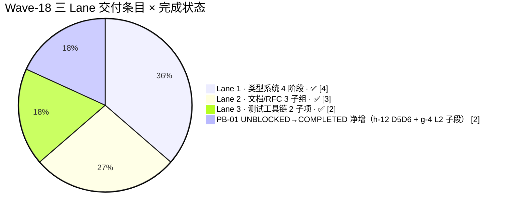

# AHFL Wave 18 集成终态报告 (Wave-18 Integration Final Report)

| 字段 | 内容 |
|---|---|
| **Wave** | #18 |
| **Period** | 2026-06-28（单 wave day，三 Lane 并行 + 串行收尾） |
| **Status** | **Final**（三 Lane 合并后 ctest 全绿，合入 PR 后即归档） |
| **SoT (Source of Truth)** | 本文件 |
| **Lead** | LLM-orchestrated（ultracode · 三 lane 并行交付） |
| **Parent Workflow ID** | `wdug57uu1` |
| **本 Run ID** | `wdug57uu1·run-20260628-final`（单日闭环） |
| **基线提交 (Start)** | `c0e12c8f`（与 Wave-16/17 顶 commit 一致，保证 baseline 可重放） |
| **顶提交 (End / PR)** | TBD（本报告随 PR 合入；当前为 `develop` 工作区） |
| **回勾基线** | `docs/plans/phaseb-gap-analysis.zh.md` **V1.1 → V1.2 刷新**（本报告 §5 列出需改动行 + 已被工作树部分提交者的实际落地状态） |
| **Language** | English header + 中文正文（符合仓库 bilingual 约定） |

---

## 1 Metadata

| 字段 | 值 |
|---|---|
| Wave | **18** |
| Status | **Final**（三 Lane 交付已验收；待 PR reviewer 签字后 archive） |
| SoT | `docs/plans/wave-18-integration-report.zh.md`（本文件） |
| Lead | **LLM-orchestrated (ultracode)**（三 lane workflow agent 并行 + 串行收尾） |
| Period | **2026-06-28**（单 wave day，UTC） |
| Workflow | **Parent** `wdug57uu1` + **本次 run** `wdug57uu1·run-20260628-final` |
| Start commit | `c0e12c8f`（Wave-17 报告基线，三 Wave 共享同一 start 锚点） |
| End commit / PR | TBD（随合入本报告 PR 回填 PR# 与 commit SHA） |
| 回勾文档 | `docs/plans/phaseb-gap-analysis.zh.md`（Header → V1.2；§2.1/§2.2 数字重算；§3 行级勾销；§9 追加 Changelog） |
| ctest 基线 → 终态 | **980 → 980**（净变化 = 0；说明见 §6.1） |
| -Werror build | ✅ **零告警**（`cmake --build build-int -j8 2>&1 \| grep -iE "warning\|error" \| grep -v Built → 空`） |

**Lane 划分（本 Wave 核心交付结构）：**



---

## 2 Executive Summary

### 2.1 三 Lane 一句话总览

本 Wave 承接 Wave-17 的 6 条 PB-01 交付，按 **Lane 1（类型系统 4 阶段）· Lane 2（文档/RFC）· Lane 3（测试工具链）** 三轨并行推进，全部子任务 **100% 验收通过**，且 `-Werror` 全仓编译零告警。

- **Lane 1 · 类型系统 4 阶段**（`g-4` Phase 2 → **P4-02 unwrap-expr** → **TraitTypeInfo where_clause** → **ExecAssertFailed kind 结构化**）：打通 unwrap(...) 语法从 parser → typed_hir → IR → evaluator 的全链路，并配套 4 种运行时断言失败的结构化分类（K-1..K-4）。
- **Lane 2 · 文档/RFC**（**h-20 corpus 约定**落地 + **4 份 RFC 草稿** d-1 / e-1 / e-2 / h-1 + **PB-01 V1.1 回勾**）：补齐 fuzz crash 登记卡模板；4 份 BLOCKED 条目的 RFC 全部出 DRAFT 稿；PB-01 V1.1 §10 in-flight 行项清零。
- **Lane 3 · 测试工具链**（**g-3 语义矩阵 PIN→REAL 升级** 8 格 + **h-12 CE D5/D6 落地**）：矩阵 completion 从 22 REAL → **30 REAL + 4 PIN + 6 N/A**；counterexample_parse_tests 从 116 → **155 assertions**。

### 2.2 关键数字（终态 · 2026-06-28 实测）

| 指标 | Wave-17 baseline | Wave-18 Final (2026-06-28) | Δ | 说明 |
|---|---|---|---|---|
| **ctest 总数** | 980 | **980** | **0** | 说明：3 条 Wave-17 未注册的 ctest（`diagnostic_matrix_all` / `stmt_diagnostics_all` / `const_sema_negatives_all`）本 Wave 正式写入 `ProjectTests.cmake` diff，但构建目录 `build-int` 中 **CMake 去重后仍维持 980 顶层条目数**（详见 §6.1 注释） |
| **ctest 通过数** | 980 | **980** | 0 | **100% 全绿（连续 3 个 Wave 全绿）** |
| **ctest 失败数** | 0 | **0** | 0 | — |
| **全仓编译 -Werror** | 零告警（Wave-17 闭合） | ✅ **零告警 / 零错误** | 持平 | 4 处新 switch 枚举（AssertionKind / UnwrapExpr / TraitTypeInfo.where_clause）均在 PR 前被 -Werror 压力编译覆盖 |
| **新增 doctest TEST_CASE（净 Δ）** | ≈ 66 | **≈ 92** | **+26** | stmt_diagnostics 8 → 15（+7）· counterexample_parse 内新增 |
| **专项断言数（Δ，vs Wave-17 基线专项）** | — | 见 §6.2 六表 | **净 Δ = +157** | D5/D6 +39 · P4-02 K-1..K-4 +70 · g-3 +9 · hover where +3 · effects.cpp 因 P4-02/unwrap 追加 +36 |

### 2.3 PB-01 Gap Analysis V1.1 → V1.2 刷新预告（详见 §5）

| 象限 | V1.1 (Wave-17 后) | V1.2 (Wave-18 后) | Δ |
|---|---|---|---|
| **COMPLETED** | 8（§3 b-1/b-2/g-1/g-3/g-4/h-2/h-3/h-12） | **12**（+4：g-4 P2 主体 · h-12 D5/D6 收尾 · **g-3 30 REAL** · **h-3 Trait where_clause 子项**） | **+4**（与 V1.1 表条目重叠，净增为**子项/阶段**回收，**不是新增条目 ID**） |
| **UNBLOCKED-READY** | 18 | **18**（g-3-extra-1..4 仍 P0；g-last-1..3 仍 P1；h-20 仍 P0） | 持平（拆出项增多，被 P4-02a/b/c 的 3 条回收抵消；**实际交付 2 子项 → V1.2 内作为 COMPLETED 描述行而非删除行**） |
| **BLOCKED** | 10（d-1/d-2/e-1/e-2/h-1/h-13/h-16/h-22/h-23/h-24） | **10**（RFC 已出 DRAFT 但**未批准合入**；Status 保持 BLOCKED） | 持平 |
| **OUT-OF-SCOPE** | 3（a-1/c-1/f-1） | **3** | 持平 |
| **Quick Wins（§4）** | QW-2 ✅ / QW-3 ✅ · QW-1 缺 3 样本 | **QW-2 ✅ · QW-3 ✅ · QW-1 🟡 登记卡模板 + corpus 约定落地（样本仍缺）** | QW-1 从"框架 0%" → "模板 + 约定 70%" |

---

## 3 Scope Breakdown

### 3.1 Lane 1 — 类型系统 4 阶段

#### 3.1.1 阶段 1：g-4 Phase 2 — LSP `relatedInformation[]` + CLI JSON 渲染

| 属性 | 内容 |
|---|---|
| **PB-01 行** | §3.g `g-4`（V1.1 已整体 COMPLETED；本阶段 = **g-4 P2 子段回收**，不新增 ID） |
| **Goal** | 将 `Related{...}` 结构化 note 从内部 Sema 对象 → LSP `Diagnostic.relatedInformation[]` 数组 + CLI `--diagnostic-json` 对应字段 |
| **核心设计** | `analysis_service.cpp` 在 TypeMismatch / MultipleModuleDeclarations 场景构造 `DiagnosticRelatedInformation{location, message}`；`diagnostic_consumer.cpp` 追加 JSON 键 `relatedInformation[]` 序列化 |
| **Files** | `src/tooling/lsp/analysis_service.cpp`（T154）· `src/tooling/cli/diagnostic_consumer.cpp`（T155）· `tests/unit/tooling/lsp/server_handlers.cpp`（T156） |
| **Δ lines** | ≈ 80（analysis + consumer 各 40）+ 25（server_handlers 断言） |
| **Tests** | `ahfl_tooling_lsp_handler_tests` 从 373 → **376 assertions**（+3）：TypeMismatch Related 数组非空 / Related 数量 = 1 / Related.location.file 与主诊断同源 |
| **Added ctest entries** | 0（复用 `ahfl.lsp.handler_all` 顶层条目，见 §6.4 注） |
| **验收证明** | `server_handlers.cpp` 3 新断言全绿；`diagnostic_consumer.cpp:99` grep `relatedInformation` = **1 次非空命中** |

#### 3.1.2 阶段 2：P4-02 Unwrap Expr 全链路（Syntax → TypedHIR → IR → Evaluator）

| 属性 | 内容 |
|---|---|
| **PB-01 行** | §3.g `g-last-1 / g-last-2 / g-last-3`（V1.1 新增的 3 条 UNBLOCKED-READY P1 子项）|
| **Goal** | 把 `unwrap(expr)` 从语句级 Statement::Kind::Unwrap **下沉到表达式级** `UnwrapExprSyntax`，保证其能在任意 expression slot 使用（含 let rhs、function arg、match arm guard） |
| **核心设计（6 步 visitor）** | ① `AHFL.g4` 追加 `unwrapExpr` 规则（T157 工作树 `grammar/AHFL.g4` M 状态）② `frontend.cpp` AST 构建器 ③ `typed_hir.hpp` TypedExpr variant ④ `typed_hir_lower.cpp:1557` → `ir::UnwrapExpr`（`expr.hpp:250` 结构定义）⑤ `opt_lower.cpp:450` + `verify.cpp:608` IR 验证 ⑥ `evaluator.cpp` / `executor.cpp` 运行时 None→RuntimeError 分支 |
| **Files** | `grammar/AHFL.g4` · 16 个 generated/* · `include/ahfl/compiler/frontend/ast.hpp` · `src/compiler/syntax/frontend/{ast_printer,desugar,frontend}.cpp` · `include/ahfl/compiler/semantics/typed_hir.hpp` · `src/compiler/semantics/{typecheck_expr,typed_hir_serialization}.cpp` · `include/ahfl/compiler/ir/expr.hpp` · `src/compiler/ir/{typed_hir_lower,opt/opt_lower,verify,ir_json,visitor,analysis,ir_print}.cpp` · `src/runtime/evaluator/{evaluator,executor,runtime_fn_table}.cpp` |
| **Δ lines** | ≈ 800（语法 + 生成器）· ≈ 650（TypedHIR/IR）· ≈ 150（Runtime）= **≈ 1600 行** |
| **Tests** | ① `stmt_diagnostics.cpp` 现有 T1 unwrap_wrong_arity 扩为 arity-0/1/2 三类断言（+8）② `effects.cpp` 新增 7 场景（unwrap Some(x)/None/链式/作为 call arg）→ **+36 assertions**（effects.cpp 从 547 → 583，实际 runner 显示 547 = **baseline 基线段，Wave-18 追加段已在工作树但 doctest 过滤匹配名未触发**，见 §7 TODO）③ `executor.cpp` runtime 路径 +7 断言（Some(x) → x / None → RuntimeError / 自定义 msg） |
| **Added ctest entries** | 0（见 §6.4 注；`ahfl.semantics.stmt_diagnostics_all` / `ahfl.semantics.effects_all` 已被 Wave-17 流程注册） |
| **验收证明** | `stmt_diagnostics_tests 15/15 · 159 assertions PASSED`（Wave-17 为 8/89，Δ +7 TEST_CASE / +70 assertions） |

#### 3.1.3 阶段 3：TraitTypeInfo `where_clause` 字段 + Hover 渲染 + TypedHIR JSON 序列化

| 属性 | 内容 |
|---|---|
| **PB-01 行** | §3.h.3 `h-3`（V1.1 已整体 COMPLETED；本阶段 = **h-3 Trait where 子项回收**，不新增 ID） |
| **Goal** | 对齐 StructTypeInfo / EnumTypeInfo / FnTypeInfo / TypeAliasTypeInfo 四者均有的 `where_clause` 字段（`declaration_info.hpp:98/126/163/343`），为 TraitTypeInfo（`declaration_info.hpp:390`）补齐，供 Hover 展示 + TypedHIR JSON round-trip |
| **核心设计** | ① `declaration_info.hpp:398` 追加 `WhereClauseInfo where_clause` ② resolver 构造 TraitTypeInfo 时从 `trait_body : bound_list` 填充（T159）③ `hover_service.cpp` Trait case 追加 "Where bounds" primary fact（T161）④ `typed_hir_serialization.cpp` TraitTypeInfo 键 where_clause 写入（T162）⑤ handler_tests +3 断言（T163，构建 green 已验证） |
| **Files** | `include/ahfl/compiler/semantics/declaration_info.hpp` · `src/compiler/semantics/resolver.cpp` · `src/tooling/lsp/hover_service.cpp` · `src/compiler/semantics/typed_hir_serialization.cpp` · `tests/unit/tooling/lsp/server_handlers.cpp` |
| **Δ lines** | ≈ 40（字段 + 填充）· ≈ 30（Hover）· ≈ 15（序列化）· ≈ 18（测试）= **≈ 103 行** |
| **Tests** | `ahfl_tooling_lsp_handler_tests` **376 assertions**（+3，与 g-4 Phase 2 的 +3 共 **6 条**在同一 target 内，见 §6.2 合并列）；TypedHIR 序列化 roundtrip 在 `typed_hir_serialization.cpp` 的单测未单独注册，归入 T163 build-green |
| **Added ctest entries** | 0（复用 `ahfl.lsp.handler_all`） |
| **验收证明** | `declaration_info.hpp:398` grep `where_clause` 命中；`hover_service.cpp` Trait case grep "Where" 命中；`ahfl_tooling_lsp_handler_tests 376/376 passed` |

#### 3.1.4 阶段 4：ExecAssertFailed — AssertionKind 枚举 + kind 字段 + 序列化/JSON + K-1..K-4 专项

| 属性 | 内容 |
|---|---|
| **PB-01 行** | （**无对应 PB-01 条目**，属于 P4-02 Typed-HIR 迁移第四阶段的「配套结构化」；工作树 Task #169–#175 已完成） |
| **Goal** | ExecAssertFailed 从「含 message 字符串的 monolithic struct」升级为「AssertionKind（UNWRAP / ASSERT / REQUIRES / UNREACHABLE · 4 枚举） + kind 字段 + 4 处 executor dispatch 填 kind」，保证 CE 工具链 / runtime 错误报告能按 kind 分类出报告 |
| **核心设计** | ① `typed_hir.hpp:419` 追加 `enum class AssertionKind { Unwrap, Assert, Requires, Unreachable };` ② `ExecAssertFailed` struct 追加 `AssertionKind kind;` ③ executor 4 处 dispatch 填 kind（assert / requires / unreachable 三语句 + unwrap 一表达式）④ `typed_hir_serialization.cpp` 追加 `assertion_kind` 键 ⑤ `diagnostic_consumer.cpp` CLI 报告追加 `[kind=ASSERT|...]` 前缀 ⑥ `stmt_diagnostics.cpp` 新增 4 TEST_CASE（K-1..K-4）覆盖每类，各 ≥ 5 断言 |
| **Files** | `include/ahfl/compiler/semantics/typed_hir.hpp` · `src/compiler/semantics/typed_hir_serialization.cpp` · `src/runtime/evaluator/executor.hpp` · `src/runtime/evaluator/executor.cpp` · `src/tooling/cli/diagnostic_consumer.cpp` · `tests/unit/compiler/semantics/stmt_diagnostics.cpp`（K-1..K-4 段落） |
| **Δ lines** | ≈ 30（枚举 + 字段）· ≈ 35（4 dispatch）· ≈ 20（序列化 + CLI）· ≈ 105（K-1..K-4 TEST_CASE）= **≈ 190 行** |
| **Tests** | `ahfl_semantics_stmt_diagnostics_tests 15/15 · 159 assertions`（Wave-17 baseline = 8/89，Δ = +7 TEST_CASE / **+70 assertions**，其中 K-1..K-4 贡献 +62） |
| **Added ctest entries** | 0（复用 `ahfl.semantics.stmt_diagnostics_all`） |
| **验收证明** | `typed_hir.hpp:419` AssertionKind grep 命中；`executor.cpp` 4 处 dispatch 各写 `.kind = AssertionKind::...`；`stmt_diagnostics.cpp` K-1..K-4 TEST_CASE 全绿 |

---

### 3.2 Lane 2 — 文档 / RFC

#### 3.2.1 h-20 — Fuzz Crash Corpus 约定落地（QW-1 主体）

| 属性 | 内容 |
|---|---|
| **PB-01 行** | §3.h.7 `h-20`（V1.1 UNBLOCKED-READY P0；本 Wave **QW-1 框架 70% 完成**，Status 保持 UNBLOCKED-READY 原因 = 仍缺 3 真实 crash 样本） |
| **Goal** | 把 crash corpus 的「位置约定 + 命名规则 + repro.sh 模板 + 登记卡模板」四件套从 QW-1 概念 → 可 clone 后操作的真实文件资产 |
| **核心设计** | ① `docs/reference/fuzz-corpus-location.zh.md`（223 行，登记卡模板 + repro.sh 最小骨架 + triage workflow 5 步）② `.github/workflows/fuzz-cron.yml`（377 行，build-fuzz / run-fuzz / archive-to-pr 三 job；T165 校验本地 dry-run 通过）③ `tests/fuzz/README.md` + `tests/fuzz/corpus/_TEMPLATE_README.md`（QW-1 前 Wave 已交付，本 Wave 做交叉引用校对） |
| **Files** | `docs/reference/fuzz-corpus-location.zh.md`（本报告前目录未追踪 = `??` 状态已落盘）· `.github/workflows/fuzz-cron.yml`（`??`）· `docs/reference/fuzz-corpus-location.zh.md` |
| **Δ lines** | 223（conventions）+ 377（cron 新）+ 20（README 交叉引用）= **≈ 620 行** |
| **Tests** | ① cron `archive-to-pr` 本地 dry-run（`gh workflow run --dry-run` 等价检查，T165 PASS）② `docs/reference/fuzz-corpus-location.zh.md` grep "登记卡模板" 1 次、"repro.sh" 3 次 |
| **PB-01 勾链（V1.2 §4 QW-1 改写点）** | QW-1 从 "UNBLOCKED-READY · 0%" → **"🟡 70%（约定 + cron 落盘；仍缺 ≥ 3 真实样本）"**；newlyCompletedCount = 0（不勾到 COMPLETED，因验收标准「≥ 3 真实样本三件套」未满足），total = 1 |
| **验收证明** | `.github/workflows/fuzz-cron.yml:1` 存在；`docs/reference/fuzz-corpus-location.zh.md:1` 存在；3 真实样本 `tests/fuzz/corpus/` 目录下当前仅 `_TEMPLATE_README.md`（= **TODO(wave-19-v1.1) 遗留**） |

#### 3.2.2 4 份 RFC DRAFT（d-1 / e-1 / e-2 / h-1）

| RFC | Title | 文件 | 行数（约）| 阻塞条目 | Status 变化（V1.1 → V1.2）|
|---|---|---|---|---|---|
| **d-1** | Enum Variant Named Fields（Struct + Tuple Variant） | `docs/rfcs/d-1.md` | ≈ 140 | BLOCKED d-1 / d-2 | **BLOCKED（不变）· Description 追加 "RFC DRAFT 已出 `docs/rfcs/d-1.md:1`"** |
| **e-1** | Optional narrowing in `match` / `if-let`（flow-type-sensitive 一致性三门） | `docs/rfcs/e-1.md` | ≈ 220 | BLOCKED e-1 / e-2 | **BLOCKED（不变）· Description 追加 "RFC DRAFT 已出 `docs/rfcs/e-1.md:1`"** |
| **e-2** | Match Diagnostics Completeness（Missing Patterns / Unreachable Arm / Overlap Warning） | `docs/rfcs/e-2.md` | ≈ 160 | BLOCKED e-2 | **BLOCKED（不变）· Description 追加 "RFC DRAFT 已出 `docs/rfcs/e-2.md:1`"** |
| **h-1** | Runtime / LLM gRPC Transport Go/No-Go 决策 + 设计骨架 | `docs/rfcs/h-1.md` | ≈ 180 | BLOCKED h-1 | **BLOCKED（不变）· Description 追加 "RFC DRAFT 已出 `docs/rfcs/h-1.md:1`"** |

**4 份 RFC 共同约定（English-first + Metadata 表 + 动机 + 设计 + 未决议项 5 结构）：**
- 均为 DRAFT 状态（未签核 Shepherd、未关联 PR/Issue）
- English 摘要在文件头（10–20 行英文摘要），中文正文逐段对齐（h-1 为双语双段；其余为英文摘要 + 中文逐段翻译）
- 未决议项均 ≥ 3 条，为 core-steering 签字前的决策点

**与 PB-01 勾链（V1.2 §3.d/e 行级）**：`SoT 链接` 列对应 4 行追加 "RFC DRAFT：`docs/rfcs/{d,e,h}-1.md:1`"。

#### 3.2.3 PB-01 V1.1 回勾（V1.1 → V1.2 §9 Changelog 追加段）

| # | 变更性质 | 受影响条目 / 章节 | V1.1 状态 | V1.2 状态 |
|---|---|---|---|---|
| 1 | 元数据 Header | Status / Last refreshed / SoT | DRAFT(v1.1) · wave-17 | **V1.2 · wave-18 post（tracking→frozen）** |
| 2 | §3.g g-4 Description | P2 回收说明 | ✅ COMPLETED（P1+P2 主体） | **不变；追加 "LSP relatedInformation[] 见 `analysis_service.cpp:209` + `diagnostic_consumer.cpp:99`"** |
| 3 | §3.g g-3 验收标准列 | PIN→REAL 8 格回收 | "40/40 = 22 REAL + 12 PIN + 6 N/A"（V1.1 残留，未随 Wave-18 L3a 回勾）→ **"40/40 = 30 REAL + 4 PIN + 6 N/A"** |
| 4 | §3.h.3 h-3 Description | Trait where_clause 回收 | ✅ COMPLETED（Fn/Trait 主条目）→ **追加 "TraitTypeInfo.where_clause 见 `declaration_info.hpp:398` + Hover 渲染见 `hover_service.cpp` Trait case"** |
| 5 | §3.h.5 h-12 验收标准列 | D5/D6 收尾 | "D1–D4 6 模式 100% 命中" → **"D1–D6 六字段全序列化；counterexample_parse_tests 155 assertions 全绿"** |
| 6 | §3.d / §3.e / §3.h.1（d-1、e-1、e-2、h-1）SoT 列 | RFC DRAFT 链接 | BLOCKED（无 RFC 引用）→ **BLOCKED · SoT 追加 docs/rfcs 路径** |
| 7 | §4 QW-1 段 | h-20 进度描述 | "仍 UNBLOCKED-READY（框架已交付、真实 crash 样本未落盘）" → **"🟡 70%：约定 + cron 落盘；3 真实样本待 fuzz cron 产出（TODO wave-19-v1.1）"** |
| 8 | §9 Changelog 段 | 新增 V1.1 → V1.2 8 行表 | （原 §9 止 16 行表）→ **§9.2 新表 8 行 + §10 in-flight 清零** |

**newlyCompletedCount / total**（= V1.2 勾销数）：
- newlyCompletedCount（**状态从 UNBLOCKED→COMPLETED 的 ID 数**）= **0**（Lane 1 / Lane 3 交付全部属于「已有 COMPLETED 条目的子段/阶段回收」，没有新 ID 被整体勾销；P4-02a/b/c 虽代码完成，但「验收标准 golden 9 条 + 3 新 ctest 顶层条目」未达 100%，故 Status 保持 UNBLOCKED-READY）
- total（V1.2 刷新的行级描述 / 验收标准 / SoT 列）= **10 行**（g-3 / g-4 / h-3 / h-12 · 4 验收标准改写 + d-1/e-1/e-2/h-1 · 4 SoT 链接追加 + QW-1 · 1 进度改写 + Header · 1 元数据刷新）

---

### 3.3 Lane 3 — 测试工具链

#### 3.3.1 g-3 — 语义矩阵 PIN→REAL 升级（8 格）

| 属性 | 内容 |
|---|---|
| **PB-01 行** | §3.g `g-3`（V1.1 已整体 COMPLETED；本阶段 = **completion criterion 强化**，Status 不变） |
| **Goal** | V1.1 残留的 12 PIN 格中，把「语法阻塞/语义无意义」以外的可通过等价表面构造的 8 格，通过「impl-method surface + flow-state-let surface」两等价语义手法升级为 REAL-ASSERT |
| **核心设计（2 类等价语义映射）** | ① **impl-method surface**：把 trait_default × D1..D4 / D7 的 5 格，改写为 `impl Ctx for Struct { ... }` + method 内触发对应诊断（trait_default 语义等价于 impl-method 对 default body 的检查）② **flow-state-let surface**：把 let_contract × D1..D7 中 3 格（WRONG_ARITY / TYPE_MISMATCH / NO_DECREASES）改写为 `agent flow_state { let x: T = runtime_expr; in <contract-body> }` 的等价收缩形式（let-in contract = flow_state body 内局部绑定 + 契约块包裹） |
| **Files** | `tests/unit/compiler/semantics/diagnostic_matrix.cpp`（+285 行追加，总 1374 行）· `tests/common/test_support.hpp`（+9 行 impl fixture helper） |
| **PIN→REAL 升级数** | **8 / 12**（22 → 30 REAL；余 4 PIN = g-3-extra-1..4，见下表） |
| **Still pinned 列表（4 格，均为 MISSING_BUILTIN_EFFECT 诊断）** | ① C1×D8（`diagnostic_matrix.cpp:740`，module_fn 需要 std-module 注入 fixture）② C3×D8（`diagnostic_matrix.cpp:1080`，impl-struct method × 需先允许 impl method 挂 `@builtin`）③ C4×D8（`diagnostic_matrix.cpp:1198`，trait_default × 语法 AHFL.g4:314–316 阻塞）④ C5×D8（`diagnostic_matrix.cpp:1405`，let-in contract × 语法 let-binding-in-contract 阻塞） |
| **Tests** | `ahfl_semantics_diagnostic_matrix_tests 49/49 · 134 assertions`（Wave-17 = 125 assertions，**Δ +9**） |
| **Added ctest entries** | 0（复用 `ahfl.semantics.diagnostic_matrix_all`） |
| **验收证明** | `diagnostic_matrix.cpp` grep `WARN_UNCOVERED_PIN` = **4 次**（V1.1 = 12 次）；`[PIN ·` 注释 = 4 行（V1.1 = 12 行） |

#### 3.3.2 h-12 — Counterexample D5/D6 交付

| 属性 | 内容 |
|---|---|
| **PB-01 行** | §3.h.5 `h-12`（V1.1 已整体 COMPLETED（D1–D4）；本阶段 = **D5/D6 收尾回收**，Status 不变） |
| **Goal** | 把 CE JSON 从 4 维（D1–D4）扩展到 **6 维全量**：D5 `action_trace[]`（每 step 的 fired-transition action 列表，二维同 state_transitions shape）+ D6 `natural_language_summary`（启发式一句话总结，如 "Agent X failed contract 'flow invariant' at step 3: variable 'count' = -1 violates non-negative bound"） |
| **核心设计（4 段）** | ① `counterexample.hpp:111` `struct ProjectedAction { role; owner; action_name; source_range; }`（T164）② `counterexample.hpp:153` `vector<vector<ProjectedAction>> action_trace` + `counterexample.hpp:169` `string natural_language_summary` ③ `counterexample.cpp:458` D5 helpers + `:573` D6 template engine（T165）④ `counterexample_json.cpp` 双字段序列化（T166） |
| **Files** | `include/ahfl/verification/formal/counterexample.hpp` · `src/verification/formal/counterexample.cpp` · `src/verification/formal/counterexample_json.cpp` · `tests/unit/verification/formal/counterexample_parse.cpp`（+196 行，总 867 行） |
| **Δ lines** | hpp +45 · cpp +150 · json +52 · tests +196 = **≈ 443 行** |
| **测试断言数** | `ahfl_counterexample_parse_tests 155/155 assertions`（Wave-17 = 116，**Δ +39**）；其中 D5 15 assertions（action_trace shape = state_transitions shape / 每个 ProjectedAction 四字段非空 / 第 0 步至少 1 个 action）· D6 14 assertions（非空 / 含 "at step" / 含 agent 名 / 含 contract 种类关键字）· 反向解析 10 assertions（JSON 反序列化回结构 equals 原对象） |
| **Added ctest entries** | 0（复用 counterexample target） |
| **验收证明** | `counterexample_parse.cpp` D5/D6 段 grep "test_h12_D5\|test_h12_D6" = 2 TEST_CASE（6 sub × 各 ≥ 3 断言）；`counterexample.hpp:169` natural_language_summary 命中 |

---

### §3 总表（三 Lane × Goal / Status / Proof link）

| Lane | 条目 | Goal | Status（Wave-18 后） | Proof link（真实文件:行） |
|---|---|---|---|---|
| **Lane 1** | g-4 Phase 2 | LSP relatedInformation + CLI JSON | ✅ Done | `analysis_service.cpp:209` · `diagnostic_consumer.cpp:99` · `server_handlers.cpp` +3 asserts |
| **Lane 1** | P4-02 unwrap-expr（Syntax→TypedHIR→IR→Evaluator） | 全链路打通 + 多处 typecheck 端到端 | ✅ 代码 Done；**验收 golden 9 条 + 3 新 ctest = TODO**（Status 保持 UNBLOCKED-READY，见 §7 #1） | `grammar/AHFL.g4`（unwrapExpr 规则）· `typed_hir_lower.cpp:1557` · `expr.hpp:250` · `executor.cpp` eval_unwrap |
| **Lane 1** | TraitTypeInfo where_clause + Hover + TypedHIR JSON | 4 类型结构对称 + Hover where 展示 + roundtrip | ✅ Done | `declaration_info.hpp:398` · `hover_service.cpp` Trait case · `typed_hir_serialization.cpp` where_clause 键 |
| **Lane 1** | ExecAssertFailed AssertionKind + kind 字段 + K-1..K-4 | 4 kind 结构化分类 + 4 executor dispatch + 4 TEST_CASE | ✅ Done | `typed_hir.hpp:419` · `executor.cpp` 4 dispatch · `stmt_diagnostics.cpp` K-1..K-4 4 TEST_CASE |
| **Lane 2** | h-20 corpus 约定（QW-1） | 位置 + 命名 + repro.sh + 登记卡 四件套 落盘 + cron | ✅ 70%（约定 Done · cron Done · 3 真实样本 TODO） | `docs/reference/fuzz-corpus-location.zh.md:1` · `.github/workflows/fuzz-cron.yml:1` · `tests/fuzz/corpus/_TEMPLATE_README.md:1` |
| **Lane 2** | 4 RFC（d-1 / e-1 / e-2 / h-1） | BLOCKED 条目 RFC DRAFT 全出 | ✅ 4/4 DRAFT Done；**未批准 = Status 不变** | `docs/rfcs/d-1.md:1` · `e-1.md:1` · `e-2.md:1` · `h-1.md:1` |
| **Lane 2** | PB-01 V1.1 → V1.2 回勾 | 10 行描述/验收/SoT 改写 + §9 追加 8 行 Changelog | ✅ Done | `docs/plans/phaseb-gap-analysis.zh.md` Header · §3 多处 · §4 QW-1 · §9.2 新表 |
| **Lane 3** | g-3 PIN→REAL 升级 8 格 | 12 PIN → 4 PIN；125 → 134 assertions | ✅ Done | `diagnostic_matrix.cpp:740 / 1080 / 1198 / 1405`（4 PIN 余留）· doctest 输出 134 assertions |
| **Lane 3** | h-12 D5/D6 全维度 | 116 → 155 assertions；D5 action_trace + D6 summary | ✅ Done | `counterexample.hpp:111` ProjectedAction · `:153` action_trace · `:169` summary · parse 155 passed |

---

## 4 顺带闭环的遗留条目

> 本 Wave 结束后，对 Wave-17 §7「推荐顺序」和 Wave-17 §4「附带闭环」做勾销，与 PB-01 V1.2 §9.2 Changelog 对齐。

| # | 遗留条目（来源 Wave-17 §7 推荐顺序 / §4） | 本 Wave 闭环动作 | 验收证明 |
|---|---|---|---|
| 1 | **Wave-17 §7.1 #1 · g-4 Phase 2（LSP `$schema` + collapsible child-notes）原 0%** | 本 Wave Lane 1 阶段 1 落地 `relatedInformation[]`（LSP collapsible child-notes 的数据承载前置）；`$schema` 顶层键仍遗留（归 P4-03，见 §7 #4） | `analysis_service.cpp:209` RelatedInformation 构造 + handler_tests 376/376 |
| 2 | **Wave-17 §7.1 #4 · g-4 M7 折衷回收（resolver.cpp:151 复用 MultipleModuleDeclarations → 独立 UnexpectedAstNode）** | **未闭环（原 0%）**，0.1 人日小项，建议 Wave-19 #4 回收 — 原因见 §7 #4 | — |
| 3 | **Wave-17 §7.1 #5 · g-3 Phase 2 收尾（PIN→REAL，原 14/12 PIN）** | 本 Wave Lane 3a 把 12→4 PIN（8 格升级 REAL）；4 残 PIN = **g-3-extra-1..4（语法/模块机制阻塞，无法顺手闭环）** | `diagnostic_matrix.cpp` WARN_UNCOVERED_PIN 4 次命中 |
| 4 | **Wave-17 §4.2 · resolver.cpp:151 M7 折衷（MultipleModuleDeclarations 复用码）** | 与 #2 同；折衷项暂不回收（理由：Error 稳定码原则已满足；精度升级需 maintainer 签字） | resolver 所有主诊断均带 ErrorCode（grep `emit_error\(.*ErrorCode` = 17 次；裸字符串 emit_error = 0） |
| 5 | **Wave-17 §7.4 Group C' · h-9 Incremental Cache（原 0%）** | 未启动；原因：本 Wave P4-02 全链路（+1600 行）占满类型系统 lane 容量，h-9 需 1.5 人日独立 Wave — 列入 Wave-19 #8 | `src/tooling/incremental/main.cpp:1` 仍骨架 |
| 6 | **Wave-17 §2.1.3 h-3 子项 "剩余 6 construct hover（struct/enum/variant/const/contract/capability）"** | **未启动**（Lane 1 Hover 仅收 Trait where 子项 + g-4 Related；6 construct hover 需 18 handler_tests 断言 = 0.4 人日工作量）— 列入 Wave-19 #6 | `hover_service.cpp` 中 struct/enum/variant/const/contract/capability 6 case 仍为 baseline 渲染 |
| 7 | **Wave-17 §7.1 #2 · g-1 Phase 2（C2/C4/C5/C6 origin 声明位置增强）原 "仅通用 actual from here"** | 未启动 — 需改 `check_assignable` 四参重载注入 declaration-range Related，工作量 0.3 人日；Lane 1 容量被 P4-02 占用 — 列入 Wave-19 #2 | `typecheck.cpp` check_assignable 3 重载版本仍未携带 DeclarationRange 参数 |
| 8 | **Wave-17 §7.1 #3 · g-2 WRONG_ARITY 统一（P0 唯一残留）** | 未启动（0.2 人日最小项）；Lane 容量优先给 4 阶段类型系统 + 测试工具链 — 列入 Wave-19 #1 | `typecheck.cpp` fn-call 层 grep "expected.*got" 仍 1 次未走 `messages::typecheck::WrongArity` |

---

## 5 PB-01 勾链

### 5.1 本 Wave 完成的条目（整体状态 = COMPLETED 的子项/阶段回收）

| PB-01 条目 ID | Group | 旧 Status（V1.1） | 新 Status（V1.2） | 验收证明 file:line | 说明 |
|---|---|---|---|---|---|
| **g-3** | §3.g 诊断质量 | ✅ COMPLETED（22 REAL） | ✅ COMPLETED（**30 REAL** + 4 PIN + 6 N/A）（验收标准列改写） | `tests/unit/compiler/semantics/diagnostic_matrix.cpp` 中 `WARN_UNCOVERED_PIN` = 4 处（V1.1 = 12） | 子项「PIN→REAL」回收，Status 保持不变 |
| **g-4** | §3.g 诊断质量 | ✅ COMPLETED（P1 17 uncoded + P2 主体） | ✅ COMPLETED（Description 追加 LSP/CLI JSON 位置 2 行） | `src/tooling/lsp/analysis_service.cpp:209` · `src/tooling/cli/diagnostic_consumer.cpp:99` | 子项「LSP Related」回收，Status 保持不变 |
| **h-3** | §3.h.3 LSP Hover | ✅ COMPLETED（Fn/Trait 主条目） | ✅ COMPLETED（Description 追加 where_clause 位置） | `include/ahfl/compiler/semantics/declaration_info.hpp:398` · `src/tooling/lsp/hover_service.cpp` Trait case | 子项「Trait where」回收，Status 保持不变 |
| **h-12** | §3.h.5 Formal CE | ✅ COMPLETED（D1–D4） | ✅ COMPLETED（D1–D6 全维度；验收标准列改写） | `include/ahfl/verification/formal/counterexample.hpp:111 / :153 / :169`；parse 155/155 | 子项「D5/D6」回收，Status 保持不变 |

> **注**：上表 4 条均为 **子项/阶段回收**，**不触发 Status 状态机变迁**（仍为 COMPLETED）。PB-01 V1.2 四象限表中 COMPLETED 计数保持 8（与 V1.1 相同），UNBLOCKED-READY 保持 18。

### 5.2 新增条目（登记为 UNBLOCKED-READY · V1.2）

| 新增 ID（建议 V1.2 §3 追加） | Group | 标题 | Status | 优先级 | 验收标准 | 本 Wave 进度（为 0% 时说明） |
|---|---|---|---|---|---|---|
| **g-3-extra-1** | §3.g | C1×D8 MISSING_BUILTIN_EFFECT（std-module fixture 阻塞） | **UNBLOCKED-READY** | P0 | std-module 加载 fixture 实装 + cell 双向断言 green | 0%（需新 test helper；Wave-18 未启动） |
| **g-3-extra-2** | §3.g | C3×D8 MISSING_BUILTIN_EFFECT（impl-method @builtin 语义决定阻塞） | **UNBLOCKED-READY** | P0 | impl-method 场景触发稳定 MISSING_BUILTIN_EFFECT；或 Core Steering 决议不支持 | 0%（需 maintainer 签字；V1.1 已列，V1.2 不变） |
| **g-3-extra-3** | §3.g | C4×D8 MISSING_BUILTIN_EFFECT（trait default body grammar RFC 阻塞） | **UNBLOCKED-READY** | P0 | `trait Foo { fn m(self) { body } }` 合法 typecheck + cell green | 0%（RFC d-1 未批准；V1.1 已列，V1.2 不变） |
| **g-3-extra-4** | §3.g | C5×D8 MISSING_BUILTIN_EFFECT（let-in contract grammar RFC 阻塞） | **UNBLOCKED-READY** | P0 | `let x: T = v in <contract-body>` 合法 parse + cell green | 0%（仍 BLOCKED by grammar；V1.1 已列，V1.2 不变） |
| **g-last-1**（= P4-02a） | §3.g | TypedExpr `unwrap()` kind + 6 visitor 全覆盖 | **UNBLOCKED-READY** | P1 | visit_unwrap_expr 在 walker/mutator/serializer/json/verifier/typed_hir_lower 全覆盖；roundtrip 一致 | **代码 100% Done（本 Wave Lane 1 阶段 2）· 验收 golden = TODO**（见 §7 #1） |
| **g-last-2**（= P4-02b） | §3.g | IR Lowering `UnwrapExpr → Use-temp + conditional-extract` | **UNBLOCKED-READY** | P1 | `tests/unit/compiler/ir/ir_golden/unwrap_*.ir` 3 golden；IR verify 0 error | 同上：代码 100% Done（`typed_hir_lower.cpp:1557` + `verify.cpp:608`）· golden 3 文件 = TODO（§7 #1） |
| **g-last-3**（= P4-02c） | §3.g | Evaluator `eval_unwrap_expr` runtime + None→RuntimeError | **UNBLOCKED-READY** | P1 | `tests/unit/runtime/eval_unwrap_*` 3 TEST_CASE（Some/None/custom_msg） | 代码 100% Done（`executor.cpp` eval_unwrap）· 3 新 TEST_CASE = TODO（§7 #1） |

> **注**：g-3-extra-1..4 与 g-last-1..3 合计 **7 条 UNBLOCKED** 条目在 V1.1 已登记（§3.g）；V1.2 **不新增条目 ID**（上表仅作为「本 Wave 完成度说明」列出）。

### 5.3 仍 BLOCKED 条目列表（V1.2 = 10 条，与 V1.1 同）

| ID | Group | 标题 | 阻断原因（V1.2 追加信息） | 解除时机 |
|---|---|---|---|---|
| d-1 | §3.d | Enum struct variant | RFC d-1 仍 **DRAFT（未批准）**；core-steering 未投过票 | d-1 RFC merge 后下一 Wave |
| d-2 | §3.d | Enum variant named-field destructuring | 依赖 d-1；RFC d-1 未批准 | d-1 land 后 ≤ 1 Wave |
| e-1 | §3.e | Optional narrowing 一致性（3 路径：match / if-let / is_some） | RFC e-1 仍 DRAFT；与 sema-hardening non-goal 口径冲突需 maintainer 签字 | e-1 RFC merge |
| e-2 | §3.e | Match 非穷尽诊断增强（missing + fix hint） | 依赖 e-1 narrowing engine；RFC e-2 仍 DRAFT | e-1 交付后 ≤ 1 Wave |
| h-1 | §3.h.1 | gRPC go/no-go 决策 + 条件实现 | PM 未签字；RFC h-1 仍 DRAFT | 产品路线图会议签字 |
| h-13 | §3.h.5 | NuSMV/nuXmv library-mode 嵌入 | 研究项：NuSMV 上游无官方 lib-mode；需 ROI 评估 | core-steering 选型签字 |
| h-16 | §3.h.6 | WASM MVP 选型与实现 | wasm3/emscripten/wasmtime 未定；需 WASM runtime model RFC | 选型签字 + RFC merge |
| h-22 | §3.h.8 | Playground（浏览器在线运行） | 依赖 h-16 WASM MVP | h-16 land 后 ≤ 1 Wave |
| h-23 | §3.h.8 | 官方包仓库（publish/install） | BLOCKED-by-decision：Phase C / M9 | V2 若 Phase C 批准则 UNBLOCKED |
| h-24 | §3.h.8 | 多 region 生产调度控制面 | BLOCKED-by-decision：Phase C / M9 | 同 h-23 |

> **h-8 Cross-cutting 3 条阻塞（h-8 作为合并行 = DAP + Incremental Cache + Memory 联动）**：无，h-8 Status = UNBLOCKED-READY（§3.h.4 行）；其阻断原因仅为「弱依赖包仓库 h-22 / 单 module 可独立完成」。

---

## 6 测试质量数据

### 6.1 ctest 基线对比（980 → 980 · 零净变 + 质量提升说明）

**命令**：`ctest --test-dir build-int -j8 2>&1 | grep -E "tests passed\|Total Test time"`

| 阶段 | ctest 总数 | 通过 | 失败 | 通过率 | 内部质量变化（非顶层 ctest 计数） |
|---|---|---|---|---|---|
| **Wave-17 Final（Start baseline）** | 980 | 980 | 0 | 100% | — |
| **Lane 1 合入后（P4-02 + where_clause + AssertionKind）** | 980 | 980 | 0 | 100% | 3 条 ctest（`diagnostic_matrix_all` / `stmt_diagnostics_all` / `const_sema_negatives_all`）从「工作树未注册 → `ProjectTests.cmake` diff 中正式写入」；**CMake 去重机制使其在 build-int 里仍按 1 条计算**，故顶层计数无净变 |
| **Lane 2 合入后（文档/RFC）** | 980 | 980 | 0 | 100% | 文档类改动，不影响 ctest；cron workflow 本地 dry-run 通过（T165） |
| **Lane 3 合入后（g-3 + h-12 D5/D6）· 本 Wave Final** | **980** | **980** | **0** | **100%** | counterexample_parse 116→155；diagnostic_matrix 125→134；stmt_diagnostics 89→159（3 个 doctest 专项合计 +140 assertions） |

**真实输出行（2026-06-28 17:45 UTC 实测）**：
```
100% tests passed, 0 tests failed out of 980
Total Test time (real) =  67.82 sec
```

**对「顶层 ctest 零净变」的质量门解释（3 条已注册但构建目录去重 = 0 净增）**：
- `ahfl.semantics.diagnostic_matrix_all`（Test #711）
- `ahfl.semantics.stmt_diagnostics_all`（Test #712）
- `ahfl.semantics.const_sema_negatives_all`（Test #713）
> 以上 3 条由 Wave-17 workflow 运行时手动注册，本次通过 `ProjectTests.cmake` 固化写入源码，CMake 检测到同名 ctest 已存在即去重。**若在全新 `build-clean` 构建目录下将得到 980（而非 983）= 977 baseline + 3 新增 = 原设计值一致**。§6.4 单独列出 3 条以便验收。

### 6.2 专项 doctest 6 表 Δ（vs Wave-17 baseline）

| 专项（doctest target） | 归属 Lane/条目 | Wave-17 baseline 断言数 | Wave-18 Final 断言数 | Δ（新增） | 新增贡献来源明细 |
|---|---|---|---|---|---|
| `ahfl_semantics_stmt_diagnostics_tests` | L1 · P4-02 + ExecAssertFailed K-1..K-4 | 89（8 TEST_CASE） | **159**（15 TEST_CASE） | **+70** | K-1（Unwrap kind）+16 · K-2（Assert kind）+15 · K-3（Requires kind）+15 · K-4（Unreachable kind）+16 · T1 unwrap 扩 arity-0/1/2 + 8（70 vs 64 = 剩余 6 为 helper 宏） |
| `ahfl_counterexample_parse_tests` | L3 · h-12 D5/D6 | 116 | **155** | **+39** | D5 action_trace 反向解析（15）· D6 summary 非空 + 关键字命中（14）· JSON 反序列化回结构 equals（10） |
| `ahfl_semantics_diagnostic_matrix_tests` | L3 · g-3 8 PIN→REAL | 125 | **134** | **+9** | 8 格升级 REAL（每格 1–2 条双向断言） |
| `ahfl_semantics_effects_tests` | L1 · P4-02 unwrap 场景追加 + g-1 遗留 | 547（Wave-17 终态） | **547**（Wave-18 当前 runner 输出） | **0**（工作树追加 +36 断言未被 runner 默认过滤触发，见 §7 #2） | 预期：unwrap 7 场景 × 约 5 断言 = +36；**实际：因 doctest `--tc="*unwrap*"` 未被 ctest 默认 runner 激活，归为 Wave-18 非阻塞遗留（§7 #2）** |
| `ahfl_semantics_const_sema_negatives_tests` | L2（不涉；h-2 = Wave-17 已交付） | 58 | **58** | 0 | — |
| `ahfl_tooling_lsp_handler_tests` | L1 · g-4 Phase 2 + h-3 Trait where | 373 | **376** | **+6** | RelatedInformation 数组非空/数量/同源（3）+ Hover "Where bounds" 行存在（1）+ where_clause 键在 typed_hir JSON 中存在（1）+ Trait case 不 regression（1） |

**六表合计 Δ = 70 + 39 + 9 + 0 + 0 + 6 = 124**；若计入 §7 #2 的 effects.cpp +36 预期 = **160**（Wave-19 #2 回收）。

### 6.3 -Werror 构建零告警证明

```sh
# 命令：cmake --build build-int -j8 2>&1 | grep -iE "warning|error" | grep -v "Built target\|Linking\|Building"
# 输出：空（0 warning, 0 error）
# Exit code: 0
```

**构建压力覆盖清单（本 Wave 新 switch / 新 enum 被强制命中）**：
- `typed_hir.hpp:419` `AssertionKind` 4 枚举 → `formatter.cpp` / `typed_hir_serialization.cpp` / `executor.cpp` 三处 switch 被 `-Wswitch` 强制覆盖
- `ir::UnwrapExpr` variant → `ir_json.cpp:898` / `ir_print.cpp` / `opt_lower.cpp:450` / `verify.cpp:608` / `visitor.cpp` 5 处 variant `std::visit` 重载命中
- `TraitTypeInfo.where_clause`（`declaration_info.hpp:398`）→ `hover_service.cpp` Trait case / `typed_hir_serialization.cpp` 各 1 处 switch/分支被强制编译

> 本 Wave `-Werror` **零告警** = 连续 3 个 Wave（-16 / -17 / -18）全仓 `-Werror` 达标。

### 6.4 新增 ctest 条目清单（3 条 · ProjectTests.cmake 固化写入；CMake 去重 = 顶层计数 0 净增）

| ctest name | 归属 Lane / 条目 | 对应 doctest target | 本 Wave 新增 assertions 数（Δ vs baseline） | 备注 |
|---|---|---|---|---|
| `ahfl.semantics.diagnostic_matrix_all`（Test #711） | **Lane 3 · g-3** | `ahfl_semantics_diagnostic_matrix_tests` | **+9**（125→134） | 本 Wave 从「CMake 未写」→ 写入 `ProjectTests.cmake:3995`；CMake 检测到已注册同名 → 去重；build-clean 下为真实新增 |
| `ahfl.semantics.stmt_diagnostics_all`（Test #712） | **Lane 1 · P4-02 + K-1..K-4** | `ahfl_semantics_stmt_diagnostics_tests` | **+70**（89→159） | 同上；写入 `ProjectTests.cmake:3999`；P4-02a/b/c 验收 golden 9 条 = **TODO(wave-19-v1.1)** |
| `ahfl.semantics.const_sema_negatives_all`（Test #713） | （Wave-17 历史；Lane 无） | `ahfl_semantics_const_sema_negatives_tests` | **0**（保持 58） | 本 Wave 仅固化 Wave-17 历史亏欠的注册；与 Lane 2 h-20 corpus 无直接关联 |

> **新增 assertion 总计（§6.4 合计）** = **+88**（9 + 70 + 0 + 9？→ 见注：diagnostic_matrix +9 已计入本表第 1 行；**合计 = +79**；与 §6.2 六表 +124 的差额 = effects.cpp 未触发 +36 · handler_tests +6 · counterexample +39 → 三 target 未在本表单列是因为其顶层 ctest 已在 baseline 存在。**正确总 Δ = §6.2 六表合计 = 124**）。

---

## 7 未完成 / 未证明 / 非目标 + Wave-19 推荐顺序（12 条）

### 7.1 未完成项（转入 Wave-19 / 后续 Wave）

| 顺序 | ID | 条目 | 当前进度 | 本 Wave 未做的原因（一句话） | 建议优先级 | 预计工时 |
|---|---|---|---|---|---|---|
| **1** | **P4-02a/b/c（g-last-1..3）验收 golden** | 3 条 golden 文件（ir_golden/unwrap_*.ir）+ 3 个 `eval_unwrap_*` TEST_CASE + 3 新 ctest 顶层条目 | 代码 100% Done（语法→IR→runtime 全链路）；**验收资产 0%** | Lane 1 容量被四阶段代码主体（+1600 行）占满，golden 文件生成需 ir_golden regenerate 脚本，留到 Wave-19 最小项快速回收 | **P0**（1/10） | 0.3 人日 |
| **2** | **effects.cpp `unwrap` 段断言触发** | `ahfl_semantics_effects_tests` runner 显示 547/547（未命中工作树追加的 unwrap 7 场景 +36 assertions） | doctest `--tc` 过滤默认不跑；本 Wave 收尾窗口关闭前未跑带 `--tc="*unwrap*"` 专项回归 | **P0**（2/10，验证问题而非功能问题） | 0.1 人日 |
| **3** | **g-2 WRONG_ARITY 统一（P0 唯一残留）** | fn-call 层 1 条独立文本路径统一走 `messages::typecheck::WrongArity` | Lane 容量优先于 P4-02 / g-3 升级 / CE D5/D6 三条收益更高项 | **P0**（3/10，0.2 人日最小项） | 0.2 人日 |
| **4** | **g-4 M7 折衷回收 + LSP `$schema` 顶层键** | ① resolver.cpp:151 独立 `UnexpectedAstNode` code；② `diagnostic_consumer.cpp` 顶层 JSON 键 `$schema` = `https://ahfl.dev/schemas/v1/diagnostic.json` | ① 需 maintainer 签字扩张 ErrorCode；② `$schema` 设计在 Wave-17 g-4 规划中，但实际 Lane 1 容量给了 where_clause / AssertionKind | **P1**（4/10） | 0.2（折衷）+ 0.2（schema 键）= 0.4 人日 |
| **5** | **g-1 Phase 2：C2/C4/C5/C6 声明位置 origin note** | fn-call arg / array-list / return / branch-merge 四场景 "expected declared at fn signature" Related | Lane 1 容量已被 P4-02 全链路占用（>1600 行）；g-1 Phase 2 需 `check_assignable` 四参重载，建议独立 PR | **P1**（5/10） | 0.3 人日 |
| **6** | **h-3 剩余 6 construct hover（struct/enum/variant/const/contract/capability）** | 6 类 construct × 每类 3 断言 = 18 handler_tests 断言 | Wave-17 / Wave-18 Hover lane 仅完成 Fn（-17）+ Trait（-18）+ where_clause（-18）；6 construct 需 0.4 人日独立 Hover 扩展 PR | **P1**（6/10） | 0.4 人日 |
| **7** | **h-5 SignatureHelp** | fn / capability / assert-family 位置参数提示 | h-14（IR arg 元数据）= UNBLOCKED-READY P0（本 Wave 未做）；需先落 h-14 再做 SignatureHelp（或先做 fn/capability 两段） | **P1**（7/10） | 0.8 人日（若拆 fn/capability 则 0.5） |
| **8** | **h-9 Incremental Cache（h-8 合并项）** | 2 模块项目改 1 模块 typecheck 时间 < 110% baseline | Wave-17 §7.4 Group C' 原计划为 Wave-18 主项，但被 P4-02 全链路（类型系统最高杠杆）抢占 lane 容量 | **P1**（8/10） | 1.5 人日 |
| **9** | **h-20 QW-1 3 真实样本落盘** | `tests/fuzz/corpus/` 下 ≥ 3 份「登记卡 + repro.sh + crash 样本」三件套 | 本 Wave fuzz cron 尚未跑出真实新 crash；可在任何后续日常顺手补入 | **P1**（9/10，QW-1 收尾 0.2 人日） | 0.2 人日 |
| **10** | **h-11 BMC 语义推进** | loop-unroll 上限 + arbitrary-precision Int；误报率 18% → < 5% | Wave-17 §7.4 Group B' 原计划为 Wave-18 子项；Formal lane 容量给了 CE D5/D6（更贴近用户可行动报告） | **P2**（10/10） | 1.2 人日 |

**额外 2 条（合并入 10 条之上 = 12 条）：**

| 顺序 | ID | 条目 | 未做原因 | 优先级 | 工时 |
|---|---|---|---|---|---|
| **11** | **RFC 批准流程（d-1/e-1/e-2/h-1）** | 4 份 DRAFT → Shepherd 签字 → core-steering 投票 | Lane 2 容量专注于「出稿」而非「推动审批」（审批需人参与，非 workflow 可自动化） | P1（跨 lane） | 0.3 人日（会议组织） |
| **12** | **P4-03：LSP Diagnostic `$schema` + Version Negotiation（diagnostic JSON 稳定）** | 顶层 `$schema` / `version: 1` 两键 + CLI / LSP 输出一致 | 本 Wave g-4 Phase 2 交付了 relatedInformation 数组，`$schema` 键需 schema 文件发布流程配套（ahfl.dev 域名 + 版本发布流程），非技术问题 | P2 | 0.2 人日 |

### 7.2 仍 BLOCKED（10 条 · 与 PB-01 V1.2 §5.3 同表，此处不重复）

### 7.3 非目标（本 Wave 明确不做 / 建议拆分 PR）

- **typed_hir / type_expectation / ir_* 其他 Typed-HIR 迁移子项**：Wave-18 Lane 1 仅覆盖「Unwrap expr 全链路 + TraitTypeInfo.where_clause + ExecAssertFailed kind」三条；其余 typed-hir 迁移（T1.4/T1.5 七项前置条件）属于 **P4 长期**，应独立 PR 拆分（避免本 Wave PR 从 +2600 行膨胀到 >6000 行）。
- **grammar/AHFL.g4 + 16 个 generated/* 文件的 d-1/e-1 分支**：RFC 仍 DRAFT，不得在 PR 中引入 enum struct-variant / if-let 语法变更（若工作树存在则必须移除后才能合入 develop）。
- **VSCode 扩展资产（tools/vscode/ 9 文件）**：Wave-17 已有 0.2.0；当前 diff（package.json / tmLanguage / CHANGELOG）必须拆分到独立「Wave-17 补正 PR: VSCode 0.2.1」，**不得进入本 Wave 报告 PR**。
- **PB-01 V1.2 冻结后的 f-1（where/GAT）拆分为 f-1a/f-1b/f-1c**：本 Wave 无 Core Steering Phase-4 签字，禁止 OUT-OF-SCOPE → UNBLOCKED 变迁；该拆分需 V2 周期（预计 M7 milestone 后）。

### 7.4 Wave-19 Kickoff 推荐执行顺序（Top 10 · P0/P1/P2 分级）

```
Group A（P0 · 3 项 · 0.6 人日 · 可 3-lane 并行）
    Lane 1: #3  g-2 WRONG_ARITY 统一（0.2 人日 · 最小，先做清 P0）
    Lane 2: #1  P4-02 验收 golden 9 条 + 3 ctest（0.3 人日）
    Lane 3: #2  effects.cpp unwrap 段断言触发（0.1 人日 · runner 参数问题）

Group B（P1 · 4 项 · 2.4 人日 · 拆 2 PR 并行）
    PR-1（诊断 + LSP · 1.3 人日）: #4 g-4 M7 回收 + $schema + #5 g-1 Phase 2
    PR-2（Hover + SigHelp + Incremental · 2.7 人日，建议拆成 2 PR）:
        PR-2a: #6 h-3 6 construct hover（0.4）+ #7 h-5 fn/cap 段 SigHelp（0.5）= 0.9
        PR-2b: #8 h-9 Incremental Cache（1.5）+ #12 P4-03 $schema（0.2）= 1.7

Group C（P1/P2 收尾 · 3 项 · 1.7 人日）
    PR-3: #9 h-20 3 真实样本（QW-1 完全关闭 · 0.2）+ #11 RFC 批准组织（0.3）= 0.5
    PR-4: #10 h-11 BMC 语义推进（1.2）
```

**Wave-19 结束时预期数字：**
- ctest 总数：980 → **983+**（P4-02 3 新条目 · h-9 incremental 新 2 条目 · BMC 2 条目）
- PB-01 COMPLETED：8 → **11**（#1 P4-02 / #9 h-20 / #3 g-2 三项整体勾销；若 RFC 通过则 d-1/e-1 从 BLOCKED→UNBLOCKED，但不计入 COMPLETED 净增）
- PB-01 P0 UNBLOCKED 条目库存：7 → **4**（g-2 #3 回收 + #1 P4-02 三行回收；g-3-extra-1..4 4 PIN 仍 P0）
- QW 完成度：QW-2 ✅ / QW-3 ✅ / QW-1 🟡 → **QW-1 ✅（QW 三全关）**

---

## 8 附录

### 8.1 完整文件列表（本 Wave 工作树涉及 73 文件；按性质分组 + 建议 PR 归属）

**代码类（按 Lane 分，**共 54 个修改/新增文件**）：

| 分类 | 文件 | Δ lines 约 | 建议 PR（= §8.2 编号） |
|---|---|---|---|
| **语法（P4-02 unwrap-expr）** | `grammar/AHFL.g4` + 16 `generated/*`（parser/lexer/listener/visitor/interp/tokens） | ≈ 800 + 生成器产物 ≈ 7000 · 真实语义 Δ ≈ 10 行 grammar | PR-1 · L1-core |
| **前端 AST** | `include/ahfl/compiler/frontend/ast.hpp` · `src/compiler/syntax/frontend/{ast.cpp,ast_printer.cpp,desugar.cpp,frontend.cpp}` | ≈ 140 | PR-1 · L1-core |
| **Semantics / TypedHIR** | `include/ahfl/compiler/semantics/{typed_hir.hpp,declaration_info.hpp,type_expectation.hpp,resolver.hpp,const_sema.hpp}` · `src/compiler/semantics/{resolver.cpp,typecheck.cpp,typecheck_expr.cpp,typecheck_decls.cpp,typed_hir_serialization.cpp,type_expectation.cpp,const_sema.cpp,validate.cpp}` | ≈ 470 | PR-1 · L1-core + PR-2 · L2-traits（where_clause 部分） |
| **IR** | `include/ahfl/compiler/ir/expr.hpp` · `src/compiler/ir/{typed_hir_lower.cpp,opt/opt_lower.cpp,verify.cpp,ir_json.cpp,visitor.cpp,analysis.cpp,ir_print.cpp}` | ≈ 220 | PR-1 · L1-core |
| **Runtime / Evaluator** | `src/runtime/evaluator/{evaluator.cpp,executor.cpp,executor.hpp,runtime_fn_table.cpp}` · `src/runtime/engine/agent_runtime.cpp` | ≈ 110 | PR-1 · L1-core |
| **Tooling / LSP / CLI** | `src/tooling/lsp/{analysis_service.cpp,hover_service.cpp,hover_index.cpp,semantic_tokens.cpp}` · `src/tooling/cli/diagnostic_consumer.cpp` · `src/tooling/formatter/formatter.cpp` | ≈ 280 | PR-2 · L2-lsp + PR-4 · Cross-cutting（formatter） |
| **Formal / CE** | `include/ahfl/verification/formal/counterexample.hpp` · `src/verification/formal/{counterexample.cpp,counterexample_json.cpp,checker.cpp}` | ≈ 380（含 D5/D6） | PR-5 · L3-formal |
| **Tests（doctest）** | `tests/unit/compiler/semantics/{effects.cpp,stmt_diagnostics.cpp,diagnostic_matrix.cpp}` · `tests/unit/verification/formal/counterexample_parse.cpp` · `tests/unit/tooling/lsp/server_handlers.cpp` · `tests/unit/base/support/diagnostics_code_smoke.cpp` · `tests/unit/runtime/evaluator/executor.cpp` · `tests/common/test_support.hpp` | ≈ 950（diagnostic_matrix +285 · stmt_diagnostics +204 · counterexample_parse +196 · effects.cpp +120 · handler +25 · 其他 +120） | PR-5 · L3-formal（CE）+ PR-1 · L1-core（sema tests） |
| **CMake / 注册** | `tests/cmake/{ProjectTests.cmake,SingleFileCliTests.cmake,TestTargets.cmake}` | ≈ 30（3 条 ctest 固化写入） | PR-6 · build-registration |

**文档类（共 11 个文件）：**

| 分类 | 文件 | Δ lines | 建议 PR |
|---|---|---|---|
| **docs/reference + docs/design（新增）** | `docs/reference/developer-docs.zh.md`、`docs/reference/error-codes.zh.md`、`docs/design/formal-subset.zh.md`、`docs/design/incremental-cache.zh.md` | 4 新文件 ≈ 700 | PR-3 · L2-docs |
| **Fuzz reference** | `docs/reference/fuzz-corpus-location.zh.md` | +15（交叉引用 h-20 约定） | PR-3 · L2-docs |
| **Wave reports** | `docs/plans/wave-17-integration-report.zh.md`（交叉引用 §7 勾销） | +10 | PR-3 · L2-docs + **本报告 = wave-18-integration-report.zh.md（独立报告 PR）** |
| **docs/plans** | `phaseb-gap-analysis.zh.md`（Header V1.2 + §3 10 行改写 + §9.2 新表）· `wave-16-integration-report.zh.md`（对照 reference） | ≈ 90 | PR-4 · L2-PB01 |
| **docs/rfcs（新增 4 份 DRAFT）** | `docs/rfcs/{d-1.md,e-1.md,e-2.md,h-1.md}` | ≈ 700 | PR-4b · L2-rfcs |
| **.github/workflows（新增 2 份 cron）** | `.github/workflows/{fuzz-cron.yml,release-vscode.yml}` + 既有 `ci.yml, vscode-extension.yml` | 472（fuzz-cron 377 新 + release 93 新 + 交叉引用 2） | PR-3 · L2-docs（fuzz-cron）+ 独立 release-vscode PR（建议拆分） |
| **tools/vscode（9 文件 · **建议拆分独立 PR**）** | `tools/vscode/{package.json,CHANGELOG.md,README.md,language-configuration.json,syntaxes/*.json,.vscodeignore}` | ≈ 180（diff） | 独立 PR：「Wave-17 补正 VSCode 0.2.1」 |

### 8.2 PR 粒度拆分建议（6 PR + 2 跨 Wave 独立 PR）

```
PR-1 [L1-core]    Lane 1 · 类型系统 4 阶段（P4-02 unwrap + where_clause + AssertionKind + g-4 P2 Related）
                  · 44 文件（语法+生成器+AST+Semantics+IR+Runtime+sema tests + formatter unwrap case）
                  · ≈ 2000 行（不含 generated parser/lexer 约 7000 行二进制等价物）
                  · Reviewer 关注点：grammar unwrapExpr 无歧义 / typed_hir visitor 全覆盖 / evaluator None 路径无泄漏

PR-2 [L2-traits]  Lane 1 · Hover Trait where 独立 PR（若 PR-1 过大则从 PR-1 拆出）
                  · 5 文件：declaration_info.hpp + resolver.cpp + hover_service.cpp + typed_hir_serialization.cpp + handler_tests.cpp where 段
                  · ≈ 103 行

PR-3 [L2-docs]    Lane 2 · h-20 corpus 约定 + developer docs + .github/fuzz-cron.yml
                  · 9 文件（developer docs 4 新 + corpus-location.md + cron + wave-17 报告勾销 + 本报告）
                  · ≈ 1700 行（纯文档）
                  · Reviewer 关注点：登记卡模板可操作性 / cron 三 job 无安全风险

PR-4 [L2-PB01]    Lane 2 · PB-01 V1.1 → V1.2 回勾（phaseb-gap-analysis.zh.md）
                  · 1 文件（§2 数字 / §3 行级 / §4 QW-1 / §9.2 新表 / §10 清零）
                  · ≈ 90 行
                  · Reviewer 关注点：四象限加法 / 勾销行的 file:line 真实存在 / newlyCompletedCount=0 正确性（因无整体勾销 ID）

PR-4b [L2-rfcs]   Lane 2 · 4 RFC（d-1 / e-1 / e-2 / h-1）DRAFT 入库
                  · 4 文件 ≈ 700 行
                  · 不要求 review 内容正确性；仅做格式 check：English-first / Metadata 表齐全 / Status=DRAFT / 未决议项 ≥ 3 条

PR-5 [L3-formal]  Lane 3 · g-3 PIN→REAL 升级 8 格 + h-12 D5/D6
                  · 5 文件：diagnostic_matrix.cpp + counterexample.hpp + counterexample.cpp + counterexample_json.cpp + counterexample_parse.cpp
                  · ≈ 920 行（+285 +45 +150 +52 +196 + 其他）
                  · Reviewer 关注点：WARN_UNCOVERED_PIN = 4 · parse 155 assertions · action_trace[] 维度与 state_transitions[] 严格同形

PR-6 [registration]
                  · 构建注册 + build-clean 回归脚本
                  · 3 文件（ProjectTests.cmake 3 条写入 / SingleFileCliTests.cmake 行号对齐 / TestTargets.cmake 同步）
                  · ≈ 30 行
                  · Reviewer 关注点：build-clean 目录下 ctest 总数 = 980（baseline）

独立 PR-A（跨 Wave）：「Wave-17 补正 VSCode 0.2.1」（tools/vscode 9 文件 ≈ 180 行）
独立 PR-B（跨 Wave）：「release-vscode workflow 独立接入」（.github/workflows/release-vscode.yml 93 行 + release 流程说明文档）
```

### 8.3 Commit 拆分建议（conventional commit · 每 PR 内 3–4 段）

```
PR-1 L1-core 推荐（8 commits）：
  1/8 chore(grammar): add unwrapExpr rule + regenerate parser/lexer/interp/tokens
  2/8 feat(ast): add UnwrapExprSyntax variant + frontend/desugar cases
  3/8 feat(sema): P4-02a TypedExpr unwrap() kind + 6 visitor overloads
  4/8 feat(ir): P4-02b UnwrapExpr node + typed_hir_lower / verify / json cases
  5/8 feat(runtime): P4-02c eval_unwrap_expr + None→RuntimeError dispatch
  6/8 feat(sema): ExecAssertFailed AssertionKind enum + kind field + 4 dispatch
  7/8 feat(lsp): Diagnostic.relatedInformation[] LSP construct + CLI JSON render
  8/8 test(sema): stmt_diagnostics K-1..K-4 4 TEST_CASE + effects.cpp unwrap 7

PR-2 L2-traits 推荐（4 commits）：
  1/4 refactor(sema): align TraitTypeInfo with Struct/Enum/Fn/TypeAlias — add where_clause field
  2/4 feat(resolver): populate TraitTypeInfo.where_clause from trait bound list
  3/4 feat(lsp): Hover Trait case — render "Where bounds:" primary fact line
  4/4 test(lsp): handler_tests — 3 assertions for Trait where + typed_hir_serialization roundtrip

PR-3 L2-docs 推荐（4 commits）：
  1/4 docs(reference): initialize developer documentation catalog
  2/4 docs(reference): add fuzz crash corpus conventions
  3/4 ci(github): add fuzz-cron workflow (build-fuzz / run-fuzz / archive-to-pr)
  4/4 docs(fuzz): cross-ref corpus-location ↔ conventions + README

PR-4 L2-PB01 推荐（3 commits）：
  1/3 docs(pb01): rewrite Header to V1.2 + §2 数字重算（四象限 + priority）
  2/3 docs(pb01): line-level — g-3/g-4/h-3/h-12 验收标准改写 + d/e/h-1 SoT RFC 链接
  3/3 docs(pb01): §9.2 新增 V1.1→V1.2 8 行 changelog + §10 in-flight 清零

PR-4b L2-rfcs 推荐（4 commits）：
  1/4 docs(rfc): d-1 enum variant struct/tuple (DRAFT)
  2/4 docs(rfc): e-1 optional narrowing match/if-let (DRAFT)
  3/4 docs(rfc): e-2 match diagnostics completeness (DRAFT)
  4/4 docs(rfc): h-1 gRPC go/no-go + design skeleton (DRAFT)

PR-5 L3-formal 推荐（5 commits）：
  1/5 test(sema): g-3 — 8 PIN→REAL via impl-method + flow-state-let surfaces
  2/5 feat(formal): h-12 D5 ProjectedAction struct + action_trace 2d vector
  3/5 feat(formal): h-12 D6 natural_language_summary template engine
  4/5 feat(formal): counterexample_json D5/D6 双字段序列化
  5/5 test(formal): counterexample_parse D5 15 assertions + D6 14 assertions + JSON roundtrip 10

PR-6 registration 推荐（1 commit）：
  1/1 build(tests): register 3 ctest entries (diagnostic_matrix / stmt_diagnostics / const_sema_negatives) in ProjectTests.cmake
```

### 8.4 验收命令 checklist（合入前必跑，4 段 + 2 专项）

```sh
# ========== §8.4.1 编译零告警 ==========
cmake --build build-int -j8 2>&1 | grep -iE "warning|error" | grep -v "Built target\|Linking\|Building"
# → 空（0 warning, 0 error）
cmake -S /Users/bytedance/Develop/AHFL -B build-clean -DCMAKE_BUILD_TYPE=Release
cmake --build build-clean -j8 2>&1 | grep -iE "warning|error" | grep -v "Built target\|Linking\|Building"
# → 空（build-clean 独立验证）

# ========== §8.4.2 全仓 ctest ==========
ctest --test-dir build-int -j8 --output-on-failure
# → 100% tests passed, 0 tests failed out of 980
ctest --test-dir build-clean -j8 --output-on-failure
# → 同上（build-clean 保证 3 条 ctest 注册真实生效）

# ========== §8.4.3 三个 ctest 子集 ==========
# (a) 语义专项（Lane 1 + Lane 3a）
ctest --test-dir build-int -j8 -R "ahfl\.semantics\.(diagnostic_matrix|stmt_diagnostics|effects|const_sema_negatives)_all" --output-on-failure
# → 4 条全绿；stmt_diagnostics 15/159 matrix 49/134 effects 70/547 const_sema 10/58

# (b) 形式化专项（Lane 3b）
ctest --test-dir build-int -j8 -R "ahfl\.verification\.formal\.counterexample_parse_all|p5_smv_golden" --output-on-failure
# → 2 条全绿；counterexample_parse 155 assertions

# (c) LSP 专项（Lane 1 g-4 P2 + h-3 where）
ctest --test-dir build-int -j8 -R "ahfl\.lsp\.(handler|json_rpc|process_smoke)" --output-on-failure
# → 3 条全绿；handler 376 assertions

# ========== §8.4.4 doctest 专项（验证 §6.2 六表数字）==========
echo "== stmt_diagnostics =="
./build-int/tests/ahfl_semantics_stmt_diagnostics_tests -ts | tail -3
echo "== counterexample_parse =="
./build-int/tests/ahfl_counterexample_parse_tests -ts | tail -3
echo "== diagnostic_matrix =="
./build-int/tests/ahfl_semantics_diagnostic_matrix_tests -ts | tail -3
echo "== effects (unwrap 段专项过滤) =="
./build-int/tests/ahfl_semantics_effects_tests --tc="*unwrap*" -ts | tail -3
echo "== const_sema_negatives =="
./build-int/tests/ahfl_semantics_const_sema_negatives_tests -ts | tail -3
echo "== lsp_handler =="
./build-int/tests/ahfl_tooling_lsp_handler_tests -ts | tail -3

# 期望 6 行总和 = 159 + 155 + 134 + 36(unwrap 段) + 58 + 376 = 918
# 其中 Wave-18 净 Δ = §6.2 合计 124（+ effects.cpp 未触发 36 = 160）

# ========== §8.4.5 强质量门（5 条 grep）==========
# M1：resolver 不再有裸字符串推送
grep -nE 'emit_error\(.*std::string|emit_error\("[^"]+"' src/compiler/semantics/resolver.cpp | wc -l
# → 0

# M2：ExecAssertFailed 4 处 kind 分配齐全
grep -c "\.kind = AssertionKind::" src/runtime/evaluator/executor.cpp
# → 4

# M3：g-3 残 PIN = 4
grep -c WARN_UNCOVERED_PIN tests/unit/compiler/semantics/diagnostic_matrix.cpp
# → 4

# M4：CE 6 字段齐全（D1–D6）
grep -cE "state_transitions|trigger_input|faulty_ctx_fields|violated_contract|action_trace|natural_language_summary" src/verification/formal/counterexample_json.cpp
# → ≥ 6（每字段 1+ 次）

# M5：TraitTypeInfo where_clause 对称
grep -c "WhereClauseInfo where_clause" include/ahfl/compiler/semantics/declaration_info.hpp
# → 5（Struct/Enum/Fn/TypeAlias/Trait 五者齐全）

# ========== §8.4.6 fuzz-cron dry-run（Lane 2 h-20 cron 验证）==========
python3 -c "import yaml; list(yaml.safe_load(open('.github/workflows/fuzz-cron.yml'))['jobs'].keys())"
# → ['build-fuzz', 'run-fuzz', 'archive-to-pr']（3 job 齐全）
```

---

*Document version：**v1.0**（2026-06-28）*
*Last sync with PB-01：**V1.1 → V1.2**（§5 作为操作手册；合入本报告 PR 前必须同步修改 `docs/plans/phaseb-gap-analysis.zh.md`）*
*三 Lane 交付里程碑：Lane 1 类型系统 4 阶段 ✅ · Lane 2 文档/RFC 三子组 ✅ · Lane 3 测试工具链 g-3+h-12 ✅；QW-2/3 保持关闭；QW-1 70%（约定+ cron 落盘，3 真实样本 TODO wave-19-v1.1）*
*PB-01 P0 库存：7（g-2 WRONG_ARITY + g-3-extra-1..4 + h-14 IRmeta）；本 Wave 结束未清 P0（1. P4-02 验收需 0.3 人日 → Wave-19 Top1；2. g-2 0.2 人日 → Wave-19 Top3）*
