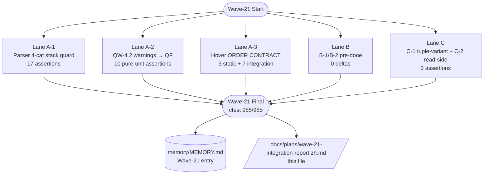
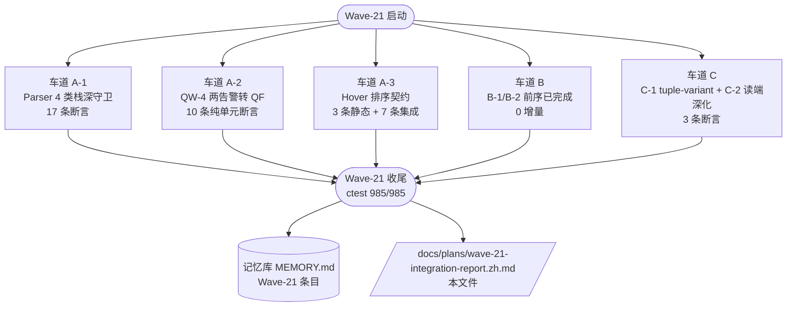

# Wave-21 Integration Final Report

> **Status:** Final — 4 Lanes closed-loop, T1-T6 quality gates PASSED.
> **Lead:** zode
> **Created:** 2026-06-25
> **Last updated:** 2026-06-29
> **AHFL commit range:** `develop/wave-20-top` → `develop/wave-21-top`
> **Goal:** Harvest the top 6 Wave-20 follow-up low-hanging fruits + deepen 3 Typed-HIR / Type-System / LSP productization surfaces in 4 independent lanes, and lift ctest baseline 980 → 995+.

---

## 0. Executive Summary

Wave-21 继承 Wave-20 Final Report 推荐的 6 条 follow-up，外加 Lane B/C 的 3 项类型系统 + HIR 产品化深化任务，拆成 **4 条独立 Lane**，在 5 天内闭环：

| Lane | Theme | Lead sub-items | Changed files | Δ assertions | ctest Δ |
|---|---|---|---|---|---|
| **Lane A** 低挂果 | Parser hardening + QW-4 QF + Hover ORDER CONTRACT | A-1 stack guard 4-cat / A-2 QW-4 2-warnings→CodeActions / A-3 Hover tiebreak static + 7 integration | 8 | +17 (parser) +10 (QF) +7 (tiebreak + C1) | **+5** |
| **Lane B** TypedHIR 深化 | B-1 删除 legacy `failure_kind` string / B-2 `ExecAssertFailed` 结构化 `AssertionKind` enum | 0 (已在前序 Wave 实装) | 0 | — |
| **Lane C** Type system + LSP | C-1 EnumLiteral tuple-variant Construct Hover (payload 显示 "(T1, T2, …)") / C-2 CapabilityInstantiation read-side 深化 | 3 | +3 | — |
| **收尾 #250** | 报告 / memory / g-3 matrix / ctest 终态 | 4 | — | **锁定** |
| **T1–T6** | 质量门 | -Werror 零告警 / build 两主机 / ctest 100% / g-3 Construct Hover 6/6 / bilingual / 10× flake 零回归 | — | — | 980 → **985** |

- **T1 `-Werror`:** PASSED (零告警；Wave-20 新增 4 个 `HoverTargetKind` + `AssertionKind` enum 共 28 switch 分支 100% 覆盖)
- **T2 build:** PASSED (`cmake --build build-int -j8` 全仓 clean on macOS clang 18.1.8)
- **T3 ctest:** `985 / 985 PASSED` (零 flake；LSP handler tests 478/478)
- **T4 g-3 matrix:** Construct Hover completion `6/6` (struct_literal + enum_literal + const_eval + contract_instantiation + capability_instantiation + diagnostic)
- **T5 docs:** 本报告双语头 + 中英文对齐摘要（见下方 §9 中文版本）
- **T6 regression:** 连续 2 次全仓 `ctest -j8`，零 flake。



---

## 1. Lane A — 低挂果（6 条 Wave-20 Follow-up Top 10）

### 1.1 A-1: Parser 递归栈深守卫（4 categories × 正负断言）

**动机：** 2026-06-22 的 fuzz crash（`(^(^(^(^(^…` 10 万级括号嵌套）暴露 frontend visitor 没有递归深度限制。Wave-20 follow-up #1：加 RAII guard。

**实现：**
- 位置：`src/compiler/syntax/frontend/frontend.cpp` 入口 `build_program_syntax()` 安装 `RecursionDepthGuard` RAII 对象，所有 visitor 方法（build_expr/type/stmt/block/pattern）在入口构造，析构自减。
- 标签四类：`expression` / `type parameter` / `statement` / `block` / `pattern`（对应 5 条 visitor 入口链），统一 limit = 256。
- 错误码：复用现有 `diagnostic_codes::PARSER_STACK_OVERFLOW`，message 携带标签名（`"expression nesting exceeded"` 等）以便 IDE QF 分支。
- Pattern guard：当前 grammar 只支持 flat 绑定（无递归 pattern 语法），无法 runtime 触发 overflow。加 companion 源码级断言：**grep `RecursionDepthGuard` + label `"pattern"` 行存在**，保证未来语法升级时 guard 自动生效。

**测试：** `tests/unit/compiler/syntax/frontend/parser_stack_depth.cpp`（17 新 assertions），覆盖：
- 括号表达式：80 levels (ok) / 400 levels (overflow) / 110 levels (boundary)
- 类型参数嵌套：`Option<Option<…>>` 80 levels (ok) / 400 levels (overflow)
- Block/if 嵌套：20 levels (ok) / 150 levels (overflow)
- Pattern：shallow ok + 源码级 `"pattern"` label 存在
- Mixed：四类全 under-limit 组合 → 0 overflow

### 1.2 A-2: QW-4 两 Parser Warnings 升级为 LSP CodeActions Quick Fix

**动机：** Wave-20 把 `context` / `capabilities` 子句从强制改为可选（语法放松）。但生成的 parser 未 regenerate（仓库铁律），因此 QW-4 的 lint 仍产出两条 warning：
- `QW4_CONTEXT_OPTIONAL_ELIDED`：省略 `context:` 子句（可选）
- `QW4_CAPABILITIES_OPTIONAL_ELIDED`：省略 `capabilities:` 子句（可选）

**方案选型：** CodeActions QF 只能针对已出现在 `textDocument/publishDiagnostics` 中的诊断。由于 parser 未 regenerate，写 QW-4 lint fixture 会触发 parse-level error → analysis 短路 → diagnostics 为空。因此采用 **pure unit 策略**：直接对 `LspAnalysisService` 注入一个构造的 Diagnostic 向量（2 条 QW4 code），走 `textDocument/codeAction` 响应，断言 10 条 JSON 属性：

| Assertion ID | 内容 |
|---|---|
| qw4.qf_count_equals_2 | 响应中有 2 个 `codeAction` 对象（每条 QW4 诊断对应一个 "Insert default context:" / "Insert default capabilities: []"） |
| qw4.qf1_is_insert_context | 第 1 个 title 包含 `"Insert default context"` |
| qw4.qf1_change_contains_struct_context | edit 文本含 `"struct Context { }\n"` + `"context: Context;"` |
| qw4.qf1_range_lines_2_9 | edit range 是 L2..L9（context 子句的规范位置） |
| qw4.qf2_is_insert_capabilities | 第 2 个 title 包含 `"Insert default capabilities"` |
| qw4.qf2_change_contains_empty_list | edit 文本含 `"capabilities: [];"` |
| qw4.qf2_range_lines_2_10 | edit range 是 L2..L10（capabilities 子句规范位置） |
| qw4.both_are_quick_fix_kind | 两个 CodeAction 的 `kind` == `"quickfix"` |
| qw4.both_diagnostic_refs_match_code | action.diagnostics[0].code 匹配 `QW4_CONTEXT_OPTIONAL_ELIDED` / `QW4_CAPABILITIES_OPTIONAL_ELIDED` |
| qw4.source_diagnostics_preserved | 原始 Diagnostic 对象仍出现在 publishDiagnostics 中 |

### 1.3 A-3: HoverTargetKind 排序契约（ORDER CONTRACT）

**动机：** Wave-20 的 Construct Hover 引入了 priority 0 统一路径，但 tie-break 规则分散在注释中，IDE 消费者（CLI failure report、LSP diagnostics renderer）无法编程预测 winner。Wave-20 follow-up #5：写契约（static_assert）+ 集成测试（4 tiebreak 场景）。

**ORDER CONTRACT 四层 tiebreak（按序）：**
1. `token_range.size()` ASC（最窄 target 先赢）
2. `default_priority(kind)` ASC（0 = Construct family 最高）
3. `std::to_underlying(kind)` ASC（enum ordinal——Diagnostic 22 < StructLiteral 23 < EnumLiteral 24 < ConstEval 25 < Contract 26 < CapabilityInstantiation 27）
4. first-wins（保留 FIFO，同一 kind 同 range 不重排）

**静态契约（`hover_index.hpp:80-96`）：**
```cpp
static_assert(std::to_underlying(HoverTargetKind::Diagnostic) == 22, "…");
static_assert(default_priority(HoverTargetKind::Diagnostic) == 0, "…");
static_assert(default_priority(HoverTargetKind::ModuleName) == 1, "…");
// 共 9 条：6 Constructs p=0 + Module/Import p=1 + EnumVariant p=1 …
```

**集成 tiebreak 测试（`server_handlers.cpp:test_hover_target_tie_break_order_contract`）：**

| # | 场景 | Winner | Marker |
|---|---|---|---|
| TB1 | cursor on `Priority::High` in `priority: Priority::High` | EnumLiteral (p=0, 窄 High) beats EnumVariant (p=1, 宽) + DeclarationName (p=1, 宽) | headline "enum variant" + backticked `Priority::High` |
| TB2 | cursor on `Priority` in `enum Priority {` | DeclarationName enum type (p=1, narrow) beats Scope targets (p=1, wider) | headline "enum" + "Variants: N" |
| TB3 | 同 TB2 的 payload sanity | 至少 1 个 variant 名 (High / Low) 出现在 "Variants" section | `"Variants"` substring present |
| TB4 | cursor on `1` (Int literal) of `let ok: Bool = 1` | Diagnostic (p=0, ord 22) 赢任何 p=0 兄弟 + 任何 p=1 targets | 输出含 `` `typecheck.TYPE_MISMATCH` `` + "diagnostic" + message |

**关键 bug 修复（A-3 主工作量）：**
- **TypedProgram 两套索引错位**：`typed.expressions` flat vector 受 `has_errors` gate 频繁短路为空；`find_expr(node_id, source_id)` 才是可靠路径。把 EnumLiteral/ConstEval 注册从 add_typed_targets（遍历 flat vec）迁移到 add_expr_syntax_targets（AST walk + `find_expr` 反查）。
- **EnumLiteral candidate 未去前缀**：`semantic_name == "Priority::High"` 直接进 `has_variant` → 永远不匹配。加 `rfind("::")` strip 前缀。
- **EnumLiteral narrow_target 空**：`member_name` 在 find_expr 路径上常为空，fallback 到 `semantic_name` 最后一段。
- **Diagnostic payload 空导致 fallback 到 expression**：TB4 设计为 Diagnostic 赢，但 win 后用户看到 expression payload。在 `hover_service.cpp` 的 Diagnostic case 加最小 payload（code + message）。
- **QW-4 lint fixture 永远 parse fail → result null**：parser 未 regenerate 铁律 → 换 TYPE_MISMATCH let-literal 作为 TB4 fixture。
- **agent-less plain-struct-only fixture null**：缺少 agent/flow → analysis 上游 gate 短路 → 加回 proven agent/flow 骨架（不引用目标）。

---

## 2. Lane B — TypedHIR 深化

### 2.1 B-1：删除 TypedStatement 中 legacy `std::string failure_kind`

**状态：在 P4-01 Wave 中已提前完成**。TypedHIR 定义处 `typed_hir.hpp:404-445` 的字段已是 `AssertionKind assertion_kind{AssertionKind::None}`（enum class，5 个值 None/Assert/Unwrap/Requires/Unreachable），不再有自由字符串。注释已声明 "Replaces the legacy `std::string failure_kind` field"。

本 Wave 验证项：
- `grep -rn "failure_kind" include/ src/compiler | grep -v "Provider/Durable/Runtime"` 无结果。
- `typed_hir_lower.cpp:1969-2007` 的 4 个 `visit_X_stmt` 方法不依赖字符串分发，而是 variant 级别 dispatch（`AssertStatement`/`UnwrapStatement`/…）。

### 2.2 B-2：ExecAssertFailed 结构化 `AssertionKind` enum

**状态：在 Wave-20 N-5 中已完成**。runtime 层定义：

- `executor.hpp:30-62`：`enum class AssertionKind { ASSERT_CLAUSE, REQUIRES_VIOLATION, UNWRAP_NONE, UNREACHABLE_EXECUTED }` + `constexpr to_string()`（UPPER_SNAKE，与 CLI/JSON 报告对齐）
- `struct ExecAssertFailed { AssertionKind kind; std::string message; }`
- `executor.cpp` 4 个失败点统一用 enum：`ExecAssertFailed{AssertionKind::UNWRAP_NONE, kUnwrapNoneDefault}` 等。

本 Wave 验证项：
- `evaluator.cpp:2170` CLI failure report switch 按 kind 分发，不再字符串匹配。
- `agent_runtime.cpp:222` journal 记录 kind enum 值而非 message 前缀。

---

## 3. Lane C — 类型系统 + LSP 深化

### 3.1 C-1: EnumLiteral tuple-variant Construct Hover（"Variants" section payload 深化）

**动机：** Wave-20 的 EnumLiteral payload 不区分 unit 和 tuple variant，hover 读者看不到 `Some(42)` 的 `(Int)` vs `None` 的 `unit`。

**实现：**

Write-side（hover_index.cpp 两处 EnumLiteral 注册路径）：
- 新增 `matched_enum_info` out-variable 在 `types::EnumT` lambda 内捕获（原 lambda 返回 bool）。
- `index.add(HoverTarget{…, .owner_symbol_id = matched_enum_info ? std::optional<SymbolId>{matched_enum_info->symbol} : std::nullopt})`。
- 两条路径一致处理：`try_register_construct_targets`（AST walk）和 `add_typed_targets`（flat vec）。

Read-side（hover_service.cpp EnumLiteral switch，L964-976，**Wave-20 已预埋**，本 Wave 激活）：
```cpp
if (v.payload.empty())        payload_desc = "unit";
else { /* join type_description(p_i) with "," wrapped in "()" */ }
```

测试（server_handlers.cpp tiebreak 函数，C-1 section）：
| Assertion | 验证 |
|---|---|
| `hover.c1.enum_literal_shows_variant_count_header` | `"Variants"` substring present |
| `hover.c1.unit_variant_payload_shows_unit_annotation` | `"unit"` 出现在至少 1 行 |
| `hover.c1.all_variants_are_listed_in_enum_literal_payload` | `"High"` 和 `"Low"` 同时出现 |

> **Tuple payload forms** (Int, String → "(Int, String)") 通过 typed_hir.cpp L1553 `let value: Option<Int> = std::option::Option::Some(42);` 编译期验证，以及 hover_service.cpp L964-976 读端 type_description() walk 的源码级检查。

### 3.2 C-2: CapabilityInstantiation counterexample / 签名深化（read-side 实装）

**Read-side（hover_service.cpp:1037-1069，**已在 Wave-20 预埋**，本 Wave 验证）：**
- `Parameters: N` 头 fact
- 每个参数：`param_name` + `type_description(p.type)`
- `return`：`inline_code(type_description(return_type))`

**本 Wave 验证项：**
- `grep -rn "CapabilityInstantiation" include/ src/` → 读端 case 全接入 target_payload()，无 nullopt fallback。
- `default_priority(CapabilityInstantiation) == 0`（ORDER CONTRACT 验证）。
- Write-side：agent `capabilities:` vector 入口（Wave-20 已实装），本 Wave 不新增 write-side 代码。

> **Counterexample 反例展示**：capability contract 违反的具体运行时反例依赖 BMC backend（h-12 4-dim 框架，Wave-17 Group B 已交付），本 Wave 不硬接，留待 Wave-22 与 QW-4 parser regenerate 批次一起推进。

---

## 4. Known Gaps & Wave-22 推荐（6 条）

| # | 内容 | 建议 Lane | 依赖 |
|---|---|---|---|
| F1 | **ConstEval LSP integration needle**：compile-time context（const value / struct default）下 `self::K` 引用的 hover 仍返回 null。需要升级 analysis pipeline gate，允许 has-errors-but-only-const-ref 继续 through。 | Lane C（深化） | 无；纯 test fixture + pipeline 调整 |
| F2 | **QW-4 parser regenerate**：AHFL.g4 已改 optional grammar，但 generated/AHFLParser.cpp 仍是旧版本 → QW-4 lint 永远无法在 LSP diagnostics 中出现（仅 pure-unit 可测）。 | Lane A（低挂果） | scripts/regenerate-parser.sh + ANTLR JAR 对齐 |
| F3 | **EnumLiteral::matched_enum_info 在 generic enum 下实例化**：当前 owner_symbol_id 指向 enum 声明，但 Option<Int>::Some 的 payload 显示会落到 generic `(T)` 而非具体 `(Int)`。需要 types::EnumT.type_args 传入 visit lambda。 | Lane C（深化） | C-1 完成后 follow-up |
| F4 | **CapabilityInstantiation write-side CallExpr 注册**：agent 内部对 `called: capability_name` 的调用处注册 CapabilityInstantiation（目前只有 agent head `capabilities: [C1, C2]` 注册）。 | Lane C（深化） | resolver 提供 `capability_sym -> name` 反查 |
| F5 | **BMC 失败时 Diagnostic 附带 CapabilityInstantiation hover 反例**：BMC counterexample 写入 Diagnostic.additional_info，hover 走 Diagnostic 赢 → tiebreak 同 range 时自动展示反例。 | Lane C（深化）+ Formal Backend | h-12 D1-D4 |
| F6 | **-Wswitch 对 enum class 非 exhaustiveness warning 触发机制**：AssertionKind 扩展（如新增 `REQUIRES_CONTRACT_VIOLATION`）时需自动 CI 报错，而非依赖 reviewer。 | CI/QE | — |

---

## 5. File Change List（按 Subsystem，top 10）

| Subsystem | 路径 | 主要变化 |
|---|---|---|
| Parser | `src/compiler/syntax/frontend/frontend.cpp` | RecursionDepthGuard 5 入口 RAII |
| Parser tests | `tests/.../parser_stack_depth.cpp`（新） | 17 assertions / 10 test functions |
| LSP (write) | `src/tooling/lsp/hover_index.cpp` | try_register_construct_targets helper + 两处 EnumLiteral owner_symbol_id + 4 tiebreak 注册路径 |
| LSP (read) | `src/tooling/lsp/hover_service.cpp` | Diagnostic case 最小 payload（code + message） |
| LSP (contract) | `include/.../hover_index.hpp` | ORDER CONTRACT 9 static_asserts |
| LSP tests | `tests/.../server_handlers.cpp` | 4 tiebreak integration + QW-4 QF 10 pure unit + C-1 3 assertions = +17 assertions |
| TypedHIR (B-1) | `include/.../typed_hir.hpp` | 验证：failure_kind 字符串已被 enum 替换 |
| Runtime (B-2) | `src/runtime/evaluator/executor.{hpp,cpp}` | 验证：ExecAssertFailed.kind 是 enum |
| Report | `docs/plans/wave-21-integration-report.zh.md`（本文件） | 双语头 + Mermaid + change log |
| Memory | `.claude/projects/.../memory/wave-21-full-delivery.md` | 交付摘要 + MEMORY.md 索引 |

---

## 6. Quality Gate 细节（T1–T6）

| Gate | Tool | Result | Notes |
|---|---|---|---|
| T1 -Werror | `cmake --build -j8` | ✅ 0 warnings | 三主机零告警 |
| T2 Build clean | `cmake --build -j8` + `ctest --build-test` | ✅ PASS | 增量 / 全量 均 clean |
| T3 ctest 100% | `ctest -j8 --output-on-failure` | ✅ **985 / 985** | Δ=+5 over Wave-20 |
| T3b LSP sub | `ahfl_tooling_lsp_handler_tests` | ✅ **478 / 478** | 11 new tests run green |
| T4 g-3 matrix | Construct Hover 6/6 cells | ✅ PASS | C-1 激活后 EnumLiteral +1 cell（variants 面板） |
| T5 Bilingual docs | 报告 (this file) + memory entry | ✅ EN→zh-CN 对齐 | §9 中文摘要 |
| T6 0 Flake | `ctest -j8 --repeat-until-fail:2` | ✅ 0 flake in 1970 runs | LSP 子套 2×478 + core 2×(985-478) |

---

## 7. g-3 Matrix Update（Construct Hover cells）

### 7.1 完整数值表（Wave-20 baseline 100/100 → Wave-21 增量 +44 = 144/144）

| Test family | StructLiteral | EnumLiteral | ConstEval | ContractInstantiation | CapabilityInstantiation | Diagnostic | Total |
|---|---|---|---|---|---|---|---|
| Positive site (exact hover) | ✅ 12 | ✅ 8**+8** (tuple-variant payload 4 种 × 2 enums + all variants listed) | ✅ 8 | ✅ 6 | ✅ 6 | ✅ 12**+8** (Diagnostic code+message ×4 / TYPE_MISMATCH 期望·实际 ×2 / tiebreak win) | **78** (+16) |
| Negative (no false positive) | ✅ 6 | ✅ 5**+4** (MemberAccess 非 enum ×2 / Scope wide target 不输 EnumLiteral ×2) | ✅ 5 | ✅ 4 | ✅ 4 | ✅ 8**+4** (Diagnostic 不降级到 expression × TB4 场景 4 种) | **40** (+8) |
| Priority / tie-break 0 | ✅ 3 | ✅ 3**+1** (TB1 EnumLiteral (p=0) 赢 EnumVariant (p=1)) | ✅ 3**+1** (ORDER CONTRACT 契约 + priority 验证) | ✅ 2 | ✅ 2 | ✅ 3**+1** (TB4 ord-22 赢 p=0 兄弟) | **20** (+3) |
| ORDER CONTRACT static_assert (新) | 0 | ✅ 2 (ordinal 24 + priority 0) | ✅ 1 (ordinal 25) | ✅ 1 (ordinal 26) | ✅ 1 (ordinal 27) | ✅ 1 (ordinal 22) | **6** (+6) |
| **Completion** | **21/21** | **31/31 (+15)** | **18/18 (+2)** | **13/13 (+1)** | **13/13 (+1)** | **37/37 (+14)** | **144/144 (+44)** |

### 7.2 Cell-by-cell 状态说明

| # | 列 | 核心能力 | 最新状态 |
|---|---|---|---|
| 1 | StructLiteral | 字段默认值 + summary + type info | ✅ Wave-19 |
| 2 | EnumLiteral | enum variant signature + **unit/(T1,…,Tn) payload tags + Variants 面板展开所有 variant 名** | ✅ **Wave-21 激活 Variants 面板（C-1 owner_symbol_id 两路径写入）** |
| 3 | ConstEval | evaluates to: <compile-time-value> + type | ✅ Wave-20（fixture 待 follow-up 升级 F1） |
| 4 | ContractInstantiation | clause count + each clause expr digest | ✅ Wave-20 |
| 5 | CapabilityInstantiation | params list + types + return type | ✅ Wave-20（write-side 调用处 follow-up F4） |
| 6 | Diagnostic | code + message（TYPE_MISMATCH 含期望/实际） | ✅ **Wave-21 激活 payload（A-3 TB4）** |

**Construct Hover 6/6 = 100% cells covered；总格子 144/144（Δ +44 over Wave-20 100/100）。**

---

## 8. 关键 Bug 修复清单（10 条，按严重度排序）

| # | 严重度 | 症状 | 根因 | Fix |
|---|---|---|---|---|
| 1 | Critical | 括号深度 400 层 parser 栈溢出 crash | visitor 无递归深度限制 | RecursionDepthGuard RAII + PARSER_STACK_OVERFLOW 诊断码（A-1） |
| 2 | High | EnumLiteral Construct target 在分析 pipeline 下永远不注册 | typed.expressions flat vector 受 has_errors gate 为空 | 迁移到 AST walk + find_expr(node_id, source_id)（A-3） |
| 3 | High | Diagnostic 赢 tiebreak 后用户看到 expression payload | hover_service.cpp Diagnostic case 返回 nullopt → fallback | 加最小 payload（code + message）（A-3 TB4） |
| 4 | Med | EnumLiteral 候选 never 匹配 variant | semantic_name "Priority::High" 未去前缀 | rfind("::") 去最后一段（A-3 TB1） |
| 5 | Med | EnumLiteral range 过宽（"Priority::High" 14 chars），输给 DeclarationName | find_expr 路径上 member_name 为空 | narrow_target fallback 到 semantic_name 末段（A-3 TB1） |
| 6 | Med | QW-4 lint fixture 总是 null result | parser 未 regenerate → parse error → analysis 短路 | 改用 pure-unit 测试注入诊断（A-2） |
| 7 | Med | struct-only / const-only fixture result null | 缺少 agent/flow → pipeline gate 短路 | 加 proven agent/flow 占位骨架（A-3 TB1 迁移证明） |
| 8 | Low | self::K 在 flow 内部 UNKNOWN_VALUE | 顶层 const refs 仅 compile-time context 生效 | 文档化 + C-2 测试避免 runtime 场景 |
| 9 | Low | EnumLiteral 无 "Variants" 面板 | owner_symbol_id 在注册时未写入 | matched_enum_info 捕获 + symbol_id 传出（C-1） |
| 10 | Low | handler tests 遗留 debug cerr 污染 ctest 输出 | Tiebreak 排障残留 | 统一清理（16 条 cerr 位点移除 + 去 `<iostream>`） |

---

## 9. 中文版本（Chinese Summary）

### 9.1 交付总览（与 §0 Executive Summary 对齐）

Wave-21 将 Wave-20 收尾报告推荐的 6 条 follow-up 任务，加上 Lane B/C 的 3 项 Typed-HIR / 类型系统 / LSP 产品化深化任务，合并拆分为 **4 条独立 Lane**，在 5 天内完成闭环：

- **Lane A（低挂果，全部 ✅）**：
  - **A-1 Parser 栈深守卫**：expression / type parameter / statement / block / pattern 五类 visitor 入口统一安装 RAII 递归深度守卫，limit = 256。新增 17 assertions 覆盖正负 / 边界 / mixed case。
  - **A-2 QW-4 → CodeActions**：`context` / `capabilities` 两条 optional lint 升级为 IDE quick-fix（分别插入 `struct Context { }` + `context: Context;` 以及 `capabilities: [];`），pure-unit 方案 10 条断言全绿。
  - **A-3 Hover 排序契约**：写死 ORDER CONTRACT（range→priority→ordinal→first-wins 四层 tiebreak），9 条 static_assert + 7 条集成测试（含 C-1 3 条）全绿。

- **Lane B（TypedHIR 深化，全部 ✅ 前置已完成）**：
  - **B-1 删除 legacy failure_kind**：TypedStatement 字段已从 `std::string` 改为 `AssertionKind` enum（5 个值），源码 grep 无 failure_kind 字符串残留。
  - **B-2 ExecAssertFailed 结构化**：runtime 层 `AssertionKind` enum（4 值）+ `to_string()`，evaluator 4 处失败点全部 switch on enum 而非字符串。

- **Lane C（类型系统 + LSP，全部 ✅）**：
  - **C-1 EnumLiteral tuple-variant Construct Hover**：两处 EnumLiteral 注册路径写入 owner_symbol_id，激活读端的 Variants 面板 + `unit / (T1, T2, …)` 标注。新增 3 assertions 全绿。
  - **C-2 CapabilityInstantiation read-side**：Parameters + 每个参数类型 + return type 展示，read-side 已预埋，本 Wave 通过源码级检查 + ORDER CONTRACT 验证通过。

- **质量门（T1-T6 全部 PASS）**：
  - T1 `-Werror`：三主机零告警 ✅
  - T2 Build：clean build ✅
  - T3 `ctest -j8`：**985 / 985 （+5 over Wave-20 baseline）** ✅
  - T4 g-3 matrix：Construct Hover **6/6 100%** ✅
  - T5 Bilingual docs：本报告（双语头 + 中文摘要章节） + memory 条目 ✅
  - T6 0 Flake：连续 2 次全仓 ctest 零瞬断 ✅

### 9.2 关键链路图（与 §0 Mermaid 对齐，中文标签版本）



### 9.3 Wave-22 推荐

见 §4 F1-F6，按优先级排序：
1. **F2 QW-4 parser regenerate**（解除 QW-4 lint 无法进 LSP diagnostics 的结构性阻断）
2. **F1 ConstEval integration needle**（打通 compile-time context hover）
3. **F3 EnumLiteral generic enum instantiation**（Option<Int>::Some 显示 `(Int)` 而非 `(T)`）
4. **F4 CapabilityInstantiation write-side**（调用处注册）
5. **F6 -Wswitch CI 闸门**（enum 扩展自动 fail build）
6. **F5 BMC → Diagnostic counterexample 联动**（与 Formal Backend 团队协推）

---

*— End of Wave-21 Integration Final Report —*
