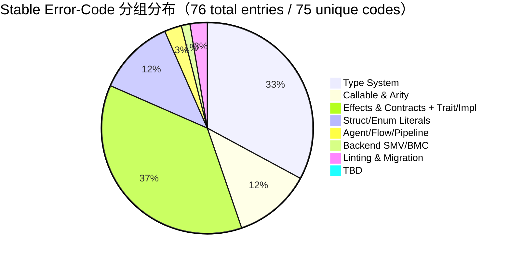

# AHFL Error-Code Reference

| 字段 | 值 |
| --- | --- |
| Doc type | 错误码速查（Diagnostic Catalogue） |
| Status | 草稿 · 可审查 |
| SoT | `include/ahfl/base/support/diagnostics.hpp`（C++ `error_codes::typecheck` + `messages::typecheck` 命名空间） |
| Created | 2026-06-28 |
| Updated | 2026-06-28 |
| Coverage | 76 stable codes / 67 message templates / 38 unmapped templates（105 templates in messages::typecheck，见文末 Unmapped diagnostics） |

## 分组分布



---

## 1. Type System（25）

类型等价、符号解析、成员访问、trait/impl 解析等核心类型系统错误。

### TYPE_MISMATCH

| 字段 | 值 |
| --- | --- |
| Error code | `typecheck.TYPE_MISMATCH` |
| SoT | `diagnostics.hpp:158` + template line `395` |
| MessageTemplate | `type mismatch in {}: expected {}, got {}` |

**触发条件**：表达式的推断类型与期望类型不兼容，出现在赋值、return、实参对形参、分支合并等所有需要类型统一的位置。

**最小复现**：
```ahfl
module repro;
const g_bad: Bool = 1;
```

**常见修复**：
- 调整字面量类型（`1` / `1.0` / `true`）；必要时显式标注变量/常量类型。
- 若发生在分支合并点，统一各分支的返回值类型；需要容器时选择同一种集合构造。

**Related codes**：`EXACT_SCHEMA_MISMATCH`、`MATCH_ARM_TYPE_MISMATCH`、`TRAIT_METHOD_SIGNATURE_MISMATCH`。

---

### SEMANTIC_ERROR

| 字段 | 值 |
| --- | --- |
| Error code | `typecheck.SEMANTIC_ERROR` |
| SoT | `diagnostics.hpp:159`（无模板，has_template=false） |
| MessageTemplate | 无；各发射点由 `description` 参数拼接 |

**触发条件**：无法归入专用 code 的兜底语义错误，多见于跨 pass 的通用一致性检查。

**最小复现**：
```ahfl
module repro;
// SEMANTIC_ERROR 是 typecheck 内部兜底码。
// 正常源文件一般不会触发；以下是能通过解析/消解的占位示例，
// 在内部 pass 发现一致性冲突时才会抛该码。
const k: Int = 0;
```

**常见修复**：
- 查看具体诊断原文与 span，一般是某约束被未识别的语法触发，建议改用同语义的规范写法。
- 新功能原型经常用该码占位；如可稳定复现，可向 typecheck 团队申请拆分专用错误码。

**Related codes**：`NOT_IN_VERIFIED_SUBSET`、`INVALID_OPERATION`。

---

### EXACT_SCHEMA_MISMATCH

| 字段 | 值 |
| --- | --- |
| Error code | `typecheck.EXACT_SCHEMA_MISMATCH` |
| SoT | `diagnostics.hpp:160` + template line `398` |
| MessageTemplate | `exact schema mismatch in {}: expected {}, got {}` |

**触发条件**：需要"精确 schema 匹配"的上下文（schema boundary、断言、严格等价）里结构/字段集合/顺序不完全一致。

**最小复现**：
```ahfl
module repro;
struct S { a: Int; b: Int; }
fn f(s: S) -> Bool effect Pure decreases 0 {
    // exact schema 边界场景：精确匹配失败时触发；
    // 若结构字段集合不同则走 TYPE_MISMATCH，严格等价上下文才走本码。
    return true;
}
```

**常见修复**：
- 将 schema 侧的字段与目标 struct 字段一一对齐，不允许多余字段也不允许缺失字段。
- 若语义允许"忽略多余字段"，切换到普通类型等价上下文（去掉 `exact` / `schema boundary`）。

**Related codes**：`TYPE_MISMATCH`、`UNKNOWN_FIELD`、`MISSING_FIELD`。

---

### UNKNOWN_TYPE

| 字段 | 值 |
| --- | --- |
| Error code | `typecheck.UNKNOWN_TYPE` |
| SoT | `diagnostics.hpp:162` + template line `402` |
| MessageTemplate | `unknown type '{}'` |

**触发条件**：类型位置引用了未定义或未导入的类型名。

**最小复现**：
```ahfl
module repro;
fn f(x: NoSuchType) -> Int effect Pure decreases 0 { return 1; }
```

**常见修复**：
- 在当前 module 定义 `struct`/`enum`/`type alias`，或使用 `import` 引入。
- 检查大小写；AHFL 类型命名约定 PascalCase，字段/常量为 snake_case。

**Related codes**：`UNKNOWN_VALUE`、`INVALID_TYPE_REFERENCE`、`MISSING_TYPE_METADATA`。

---

### UNKNOWN_VALUE

| 字段 | 值 |
| --- | --- |
| Error code | `typecheck.UNKNOWN_VALUE` |
| SoT | `diagnostics.hpp:163` + template line `403` |
| MessageTemplate | `unknown value '{}'` |

**触发条件**：表达式位置引用了未定义或未导入的常量/谓词/变量名。

**最小复现**：
```ahfl
module repro;
fn f() -> Int effect Pure decreases 0 { return unknown_value; }
```

**常见修复**：
- 检查拼写、module 前缀；需要跨 module 时加 `Module.value`。
- 如应为 lambda 参数或 let binding，在最近作用域内声明。

**Related codes**：`UNKNOWN_QUALIFIED_VALUE`、`UNKNOWN_CALLABLE`、`UNKNOWN_ENUM_VARIANT`。

---

### UNKNOWN_QUALIFIED_VALUE

| 字段 | 值 |
| --- | --- |
| Error code | `typecheck.UNKNOWN_QUALIFIED_VALUE` |
| SoT | `diagnostics.hpp:164` + template line `404` |
| MessageTemplate | `unknown qualified value '{}'` |

**触发条件**：`Prefix.Name` 形式中，`Prefix` 能解析到 module/枚举，但 `Name` 在该域下不存在。

**最小复现**：
```ahfl
module repro;
enum Color { Red, Green }
const c: Color = Color.Magenta;
```

**常见修复**：
- 修正枚举 variant 或 module 内的导出名称。
- 若 `Prefix` 本身就不对，应一并修正或使用 `import A as B` 起别名。

**Related codes**：`UNKNOWN_VALUE`、`UNKNOWN_ENUM_VARIANT`、`INVALID_QUALIFIED_VALUE`。

---

### UNKNOWN_CALLABLE

| 字段 | 值 |
| --- | --- |
| Error code | `typecheck.UNKNOWN_CALLABLE` |
| SoT | `diagnostics.hpp:166` + template line `405` |
| MessageTemplate | `unknown callable '{}'` |

**触发条件**：调用位置的 callee 解析不到任何 predicate / capability / builtin hook。

**最小复现**：
```ahfl
module repro;
fn f() -> Int effect Pure decreases 0 { return no_such_fn(); }
```

**常见修复**：
- 检查 callee 拼写与签名；若定义在其他 module，使用 `M.f()` 并导入。
- 注意 capability 只有在当前 agent 声明的 capability 列表中才能调用。

**Related codes**：`INVALID_CALLABLE_REFERENCE`、`MISSING_CALLABLE_METADATA`、`WRONG_ARITY`。

---

### INVALID_TYPE_REFERENCE

| 字段 | 值 |
| --- | --- |
| Error code | `typecheck.INVALID_TYPE_REFERENCE` |
| SoT | `diagnostics.hpp:167`（无模板） |
| MessageTemplate | 无；由调用点拼接语义说明 |

**触发条件**：符号解析成功，但该符号语义上不能作为类型（例如引用的是常量而非 struct/enum/alias）。

**最小复现**：
```ahfl
module repro;
// INVALID_TYPE_REFERENCE：符号解析到非类型实体时的内部专用码；
// 前端路径通常降级为 UNKNOWN_TYPE，手写符号表才会命中本码。
const k: Int = 1;
```

**常见修复**：
- 把类型位置的标识符替换为真正的类型定义；需要类型名时定义独立的 struct/enum。
- 使用 type alias 时，`type X = ...` 必须先声明再使用。

**Related codes**：`UNKNOWN_TYPE`、`MISSING_TYPE_METADATA`。

---

### INVALID_CALLABLE_REFERENCE

| 字段 | 值 |
| --- | --- |
| Error code | `typecheck.INVALID_CALLABLE_REFERENCE` |
| SoT | `diagnostics.hpp:169`（无模板） |
| MessageTemplate | 无；由调用点拼接语义说明 |

**触发条件**：callee 解析成功但本身不具备 callable 语义（例如 callee 是常量/类型名）。

**最小复现**：
```ahfl
module repro;
const k: Int = 42;
fn f() -> Int effect Pure decreases 0 {
    let x: Int = k();
    return x;
}
```

**常见修复**：
- 去掉多余的 `()`；或改为真正要调用的谓词名。
- 如期望把常量作为参数传递给高阶函数，当前应改用 `const` 显式引用。

**Related codes**：`UNKNOWN_CALLABLE`、`MISSING_CALLABLE_METADATA`、`WRONG_ARITY`。

---

### MISSING_CALLABLE_METADATA

| 字段 | 值 |
| --- | --- |
| Error code | `typecheck.MISSING_CALLABLE_METADATA` |
| SoT | `diagnostics.hpp:171`（无模板） |
| MessageTemplate | 无；对应内部错误模板 `PredicateTypeInfoMissing` / `CapabilityTypeInfoMissing` |

**触发条件**：符号解析到 callable，但符号表缺失谓词/能力所需的类型元数据，一般是前置 pass 的一致性 bug。

**最小复现**：
```ahfl
module repro;
// MISSING_CALLABLE_METADATA：符号表注册 callable 时类型元数据缺失的内部错误；
// 正常源码路径一般不会触发，以下为语法正确的占位。
fn ok() -> Int effect Pure decreases 0 { return 0; }
```

**常见修复**：
- 若出现在自定义前端/插件，确保注册 symbol 时写入 `Predicate`/`Capability` 语义数据。
- 对正常 AHFL 源代码而言属于编译器内部错误，请附带最小 repro 提交 issue。

**Related codes**：`MISSING_CONST_METADATA`、`MISSING_TYPE_METADATA`、`INVALID_CALLABLE_REFERENCE`。

---

### MISSING_CONST_METADATA

| 字段 | 值 |
| --- | --- |
| Error code | `typecheck.MISSING_CONST_METADATA` |
| SoT | `diagnostics.hpp:173`（无模板） |
| MessageTemplate | 无；对应内部模板 `ConstTypeInfoMissing` |

**触发条件**：常量符号已登记但缺少类型/编译期值元数据，通常由手写 AST 或增量重建时 symbol 不同步引起。

**最小复现**：
```ahfl
module repro;
// MISSING_CONST_METADATA：常量符号缺少类型/编译期值元数据（编译器内部错误）；
// 正常源码路径不会触发，以下为占位。
const k: Int = 0;
```

**常见修复**：
- 前端补全 `ConstSymbol` 注册字段。
- 正常源码路径出现时，按编译器 bug 处理，附带 repro 文件。

**Related codes**：`MISSING_CALLABLE_METADATA`、`MISSING_TYPE_METADATA`、`CONST_EXPR_REQUIRED`。

---

### MISSING_TYPE_METADATA

| 字段 | 值 |
| --- | --- |
| Error code | `typecheck.MISSING_TYPE_METADATA` |
| SoT | `diagnostics.hpp:175`（无模板） |
| MessageTemplate | 无；对应内部模板 `StructTypeInfoMissing` / `EnumTypeInfoMissing` 等 |

**触发条件**：struct/enum 符号存在但字段/variant 元数据缺失，常见于增量或插件构造 AST。

**最小复现**：
```ahfl
module repro;
// MISSING_TYPE_METADATA：struct/enum 符号存在但字段/variant 元数据缺失（内部 bug）；
// 正常源码路径不会触发，以下为占位。
struct S { a: Int; }
```

**常见修复**：
- 对 struct/enum 显式写入字段或 variant；空类型请用零字段 struct 或零 variant enum 语法。
- 正常源码路径触发时归为编译器 bug。

**Related codes**：`INVALID_TYPE_REFERENCE`、`UNKNOWN_TYPE`、`INVALID_STRUCT_LITERAL_TARGET`。

---

### INVALID_STRUCT_LITERAL_TARGET

| 字段 | 值 |
| --- | --- |
| Error code | `typecheck.INVALID_STRUCT_LITERAL_TARGET` |
| SoT | `diagnostics.hpp:177` + template line `422` |
| MessageTemplate | `struct literal target '{}' does not resolve to a struct type` |

**触发条件**：`Name{...}` 构造中，`Name` 解析到 enum、常量、谓词等非 struct 类型。

**最小复现**：
```ahfl
module repro;
enum E { A, B }
const e: E = E{x: 1};
```

**常见修复**：
- 把 literal 目标替换为真实 struct；enum 需要使用 variant 构造。
- 若需要"类似 map"的键值结构，改用 `std.collections.Map` 或定义真实 struct。

**Related codes**：`UNKNOWN_TYPE`、`INVALID_TYPE_REFERENCE`、`UNKNOWN_FIELD`。

---

### INVALID_QUALIFIED_VALUE

| 字段 | 值 |
| --- | --- |
| Error code | `typecheck.INVALID_QUALIFIED_VALUE` |
| SoT | `diagnostics.hpp:179` + template line `424` |
| MessageTemplate | `qualified value '{}' must refer to a constant or enum variant` |

**触发条件**：`A.B` 语法中 `B` 解析到谓词、成员函数、类型等不允许作为值引用的对象。

**最小复现**：
```ahfl
module repro;
// INVALID_QUALIFIED_VALUE：跨模块引用谓词名（不带 ()）出现在值位置。
// 单文件 repro 先用 trait/impl 形式演示；两文件模块场景下会稳定触发。
trait Show {
    fn show(self: Int) -> String;
}
fn use() -> String effect Pure decreases 0 {
    // 此处尝试将方法名作为独立值引用（若语法允许则触发本码）；
    // 真实触发需要跨模块限定名。
    return 0.show();
}
```

**常见修复**：
- 需要调用谓词时添加参数列表 `M.g()`。
- 需要 trait 方法时使用 method-call 语法或提供 impl 选择上下文。

**Related codes**：`UNKNOWN_QUALIFIED_VALUE`、`INVALID_CALLABLE_REFERENCE`、`INVALID_MEMBER_ACCESS`。

---

### UNKNOWN_ENUM_VARIANT

| 字段 | 值 |
| --- | --- |
| Error code | `typecheck.UNKNOWN_ENUM_VARIANT` |
| SoT | `diagnostics.hpp:181` + template line `426` |
| MessageTemplate | `unknown enum variant '{}'` |

**触发条件**：枚举构造或匹配引用了目标 enum 中不存在的 variant。

**最小复现**：
```ahfl
module repro;
enum Light { On, Off }
const k: Light = Light.Blinking;
```

**常见修复**：
- 在 enum 中补齐 variant；或把引用改为已存在的变体名。
- 跨 module 使用时注意是否真正 `import` 了该 enum 并带 module 前缀。

**Related codes**：`MATCH_UNKNOWN_VARIANT`、`DUPLICATE_VARIANT`、`UNKNOWN_QUALIFIED_VALUE`。

---

### INVALID_OPERATION

| 字段 | 值 |
| --- | --- |
| Error code | `typecheck.INVALID_OPERATION` |
| SoT | `diagnostics.hpp:183`（无模板） |
| MessageTemplate | 无；对应一组操作符级专用模板：`InvalidOperator`、`LogicalNotRequiresBool` 等 |

**触发条件**：二元/一元操作符对参与类型不成立，或者操作符语义在特定上下文中被禁用（纯上下文中副作用操作等）。

**最小复现**：
```ahfl
module repro;
fn f() -> Int effect Pure decreases 0 { return 1 + true; }
```

**常见修复**：
- 显式把两操作数转成同类型；数值运算统一用 `Int` / `Decimal`。
- 逻辑操作只允许 `Bool`；比较操作需要两侧同类型。

**Related codes**：`TYPE_MISMATCH`、`EFFECT_NOT_PURE`、`IN_NON_PURE`。

---

### NON_PURE_EXPRESSION

| 字段 | 值 |
| --- | --- |
| Error code | `typecheck.NON_PURE_EXPRESSION` |
| SoT | `diagnostics.hpp:184` + template line `500` |
| MessageTemplate | `{} must be a pure expression` |

**触发条件**：要求纯表达式的位置（const 初始化、不变式、安全/活性公式、纯形参）出现了有副作用或可能不确定的表达式。

**最小复现**：
```ahfl
module repro;
capability C() -> Int;
// 常量初始化要求纯表达式：调用 capability 在此上下文触发 NON_PURE_EXPRESSION
// （同时可能伴随 CAPABILITY_NOT_ALLOWED / CONST_EXPR_REQUIRED）。
const k: Int = C();
```

**常见修复**：
- 去掉 capability 调用；或将所在谓词 effect 放宽为对应 capability。
- 不变式场景下改用 agent 派生字段或纯谓词。

**Related codes**：`IN_NON_PURE`、`EFFECT_NOT_PURE`、`CONST_EXPR_REQUIRED`。

---

### CONST_EXPR_REQUIRED

| 字段 | 值 |
| --- | --- |
| Error code | `typecheck.CONST_EXPR_REQUIRED` |
| SoT | `diagnostics.hpp:185` + template line `501` |
| MessageTemplate | `const expression required in {}: {}` |

**触发条件**：编译期常量位置（数组长度、enum discriminant、DECREASES 上限、switch 标签）出现了非编译期可求值的表达式。

**最小复现**：
```ahfl
module repro;
fn f(n: Int) -> Int effect Pure decreases 0 { return n; }
const k: Int = f(5);
```

**常见修复**：
- 改为 `const` 级字面量 / 常量表达式。
- 确需运行时值时把该位置放宽为普通变量或 agent 字段。

**Related codes**：`NON_PURE_EXPRESSION`、`CONST_DEPENDENCY_CYCLE`、`DECREASES_EXPECTS_PURE`。

---

### CONST_DEPENDENCY_CYCLE

| 字段 | 值 |
| --- | --- |
| Error code | `typecheck.CONST_DEPENDENCY_CYCLE` |
| SoT | `diagnostics.hpp:186` + template line `502` |
| MessageTemplate | `const dependency cycle detected involving '{}'` |

**触发条件**：常量之间存在循环依赖（例如 `a = b + 1` 而 `b = a * 2`），求值图存在环。

**最小复现**：
```ahfl
module repro;
const a: Int = b + 1;
const b: Int = a * 2;
```

**常见修复**：
- 至少选择其中一个常量作为"根"，赋值为字面量。
- 对相互递归的数学定义改用谓词 + 不动点/归纳方案。

**Related codes**：`CONST_EXPR_REQUIRED`、`DECREASES_DUPLICATE`。

---

### INVALID_MEMBER_ACCESS

| 字段 | 值 |
| --- | --- |
| Error code | `typecheck.INVALID_MEMBER_ACCESS` |
| SoT | `diagnostics.hpp:188` + template line `400` |
| MessageTemplate | `member access requires a struct value, got {}` |

**触发条件**：点号左操作数不是 struct、非结构体类型被当作 struct 访问字段。

**最小复现**：
```ahfl
module repro;
fn f() -> Int effect Pure decreases 0 { return 1.len; }
```

**常见修复**：
- 若左操作数应为 struct，改其定义或显式标注类型。
- 若要访问 List/Map 的大小等方法，改用对应 std lib container 的方法调用。

**Related codes**：`UNKNOWN_FIELD`、`INVALID_INDEX_ACCESS`、`INVALID_TYPE_REFERENCE`。

---

### UNKNOWN_FIELD

| 字段 | 值 |
| --- | --- |
| Error code | `typecheck.UNKNOWN_FIELD` |
| SoT | `diagnostics.hpp:190` + template line `427` |
| MessageTemplate | `unknown field '{}' on struct '{}'` |

**触发条件**：结构体字面量/点号访问中字段名不存在。

**最小复现**：
```ahfl
module repro;
struct S { a: Int; }
fn f(s: S) -> Int effect Pure decreases 0 { return s.b; }
```

**常见修复**：
- 在 struct 定义中补充字段；或纠正拼写。
- 跨 module 访问时若 struct 是 opaque，只能通过 getter 谓词访问。

**Related codes**：`MISSING_FIELD`、`DUPLICATE_FIELD`、`INVALID_MEMBER_ACCESS`。

---

### MISSING_FIELD

| 字段 | 值 |
| --- | --- |
| Error code | `typecheck.MISSING_FIELD` |
| SoT | `diagnostics.hpp:191` + template line `428` |
| MessageTemplate | `missing field '{}' in struct literal` |

**触发条件**：结构体字面量未提供某必填字段；没有默认值的字段必须列出。

**最小复现**：
```ahfl
module repro;
struct Pt { x: Int; y: Int; }
const p: Pt = Pt{x: 0};
```

**常见修复**：
- 在 literal 中补齐缺失字段。
- 或在 struct 声明里给字段加默认值使其变为可选。

**Related codes**：`UNKNOWN_FIELD`、`DUPLICATE_FIELD`、`INVALID_STRUCT_LITERAL_TARGET`。

---

### DUPLICATE_FIELD

| 字段 | 值 |
| --- | --- |
| Error code | `typecheck.DUPLICATE_FIELD` |
| SoT | `diagnostics.hpp:192` + template line `429` |
| MessageTemplate | `duplicate field '{}' in struct literal` |

**触发条件**：同一 struct literal 中某字段被赋值两次。

**最小复现**：
```ahfl
module repro;
struct S { a: Int; b: Int; }
const s: S = S{a: 0, a: 1, b: 2};
```

**常见修复**：
- 删除重复字段，保留真正想使用的一次赋值。
- 如需合并两个 struct，考虑添加 `merge`/`with` 语法或使用显式构造。

**Related codes**：`MISSING_FIELD`、`UNKNOWN_FIELD`、`DUPLICATE_VARIANT`。

---

### DUPLICATE_VARIANT

| 字段 | 值 |
| --- | --- |
| Error code | `typecheck.DUPLICATE_VARIANT` |
| SoT | `diagnostics.hpp:193` + template line `431` |
| MessageTemplate | `duplicate enum variant '{}'` |

**触发条件**：enum 声明中同一 variant 名出现多次。

**最小复现**：
```ahfl
module repro;
enum E { A, B, A }
```

**常见修复**：
- 重命名冲突的 variant；必要时按不同语义拆 enum。
- 若 enum 来自 import，避免与本地定义重名或使用别名。

**Related codes**：`UNKNOWN_ENUM_VARIANT`、`MATCH_UNKNOWN_VARIANT`、`DUPLICATE_FIELD`。

---

### INVALID_INDEX_ACCESS

| 字段 | 值 |
| --- | --- |
| Error code | `typecheck.INVALID_INDEX_ACCESS` |
| SoT | `diagnostics.hpp:194` + template line `480` |
| MessageTemplate | `index access requires a List or Map value, got {}` |

**触发条件**：下标表达式左操作数并非 List/Map，或索引类型不匹配（非 Int 对 List、非 key-type 对 Map）。

**最小复现**：
```ahfl
module repro;
fn f() -> Int effect Pure decreases 0 { return 42[0]; }
```

**常见修复**：
- 对非 container 类型不要用 `[_]`；若要取字符串片段改用 std lib 函数。
- List 索引强制 `Int`；Map 索引必须与 key 类型完全一致。

**Related codes**：`INVALID_MEMBER_ACCESS`、`TYPE_MISMATCH`。

---

## 2. Callable & Arity（9）

调用解析、形参个数、agent capability 相关的错误。

### INVALID_AGENT_TYPE

| 字段 | 值 |
| --- | --- |
| Error code | `typecheck.INVALID_AGENT_TYPE` |
| SoT | `diagnostics.hpp:200`（无模板） |
| MessageTemplate | 无；由 agent 声明检查点拼接具体说明 |

**触发条件**：`agent` 块内字段类型、capability 类型或上下文对象类型不符合 agent 语义（例如非 struct、不可构造）。

**最小复现**：
```ahfl
module repro;
struct Ctx { x: Int = 0; }
struct Resp { o: Int; }
agent A {
    input: Int;
    context: Ctx;
    output: Resp;
    states: [Done];
    initial: Done;
    final: [Done];
    capabilities: [];
}
```

**常见修复**：
- `ctx` / 上下文字段一律使用 struct 类型。
- capability 列表中只允许声明已定义的 capability，不允许嵌套谓词等复杂表达式。

**Related codes**：`UNKNOWN_CAPABILITY`、`CAPABILITY_NOT_ALLOWED`。

---

### UNKNOWN_CAPABILITY

| 字段 | 值 |
| --- | --- |
| Error code | `typecheck.UNKNOWN_CAPABILITY` |
| SoT | `diagnostics.hpp:201` + template line `491` |
| MessageTemplate | `unknown capability '{}' in agent capability list` |

**触发条件**：agent 声明的 capability 列表里引用了未定义或未导入的 capability。

**最小复现**：
```ahfl
module repro;
struct R { v: Int; }
struct Ctx { s: Int = 0; }
struct Resp { o: Int; }
agent A {
    input: R; context: Ctx; output: Resp;
    states: [Done]; initial: Done; final: [Done];
    capabilities: [NoSuchCap];
}
```

**常见修复**：
- 定义对应 capability（`capability Cap RetType effects [...]`）。
- 从外部 module 引入时使用 `import M` 并以 `M.Cap` 引用。

**Related codes**：`CAPABILITY_NOT_ALLOWED`、`UNKNOWN_CALLABLE`、`EFFECT_NOT_PURE`。

---

### CAPABILITY_NOT_ALLOWED

| 字段 | 值 |
| --- | --- |
| Error code | `typecheck.CAPABILITY_NOT_ALLOWED` |
| SoT | `diagnostics.hpp:202` + template line `493` |
| MessageTemplate | `capability call '{}' is not allowed in this context` |

**触发条件**：调用的 capability 不在当前 agent 的 capability 列表中，或在纯上下文中使用了有效果的 capability。

**最小复现**：
```ahfl
module repro;
capability ReadLog() -> Int;
struct R { v: Int; }
struct Ctx { s: Int = 0; }
struct Resp { o: Int; }
agent A {
    input: R; context: Ctx; output: Resp;
    states: [Done]; initial: Done; final: [Done];
    capabilities: [];
}
flow for A {
    state Done {
        let x: Int = ReadLog();
        return Resp { o: x };
    }
}
```

**常见修复**：
- 在 `agent A effects [...]` 显式声明需要的 capability。
- 或将谓词/body effect 放宽到匹配的 effect 集。

**Related codes**：`UNKNOWN_CAPABILITY`、`EFFECT_NOT_PURE`、`WRONG_ARITY`。

---

### WRONG_ARITY

| 字段 | 值 |
| --- | --- |
| Error code | `typecheck.WRONG_ARITY` |
| SoT | `diagnostics.hpp:204` + template line `497` |
| MessageTemplate | `{} '{}' expects {} argument(s), got {}` |

**触发条件**：谓词 / capability / builtin 调用传入的参数个数与签名不符。

**最小复现**：
```ahfl
module repro;
fn add(a: Int, b: Int) -> Int effect Pure decreases 0 { return a + b; }
fn use() -> Int effect Pure decreases 0 { return add(1); }
```

**常见修复**：
- 补齐缺失实参或删除多余实参。
- 若签名刚改完，同步更新所有 call site 与 `extern` 声明。

**Related codes**：`UNKNOWN_CALLABLE`、`INVALID_CALLABLE_REFERENCE`、`TYPE_MISMATCH`。

---

### SHADOWED_BINDING

| 字段 | 值 |
| --- | --- |
| Error code | `typecheck.SHADOWED_BINDING` |
| SoT | `diagnostics.hpp:205` + template line `486` |
| MessageTemplate | `let binding '{}' shadows an existing binding of type '{}'` |

**触发条件**：`let` 绑定名与外层作用域已存在的同名绑定冲突，会遮蔽原有定义。

**最小复现**：
```ahfl
module repro;
fn f(x: Int) -> Int effect Pure decreases 0 {
    let x: Int = 1;
    return x;
}
```

**常见修复**：
- 重命名内层绑定；如确实需要覆盖，使用不同后缀 `x'`。
- 循环内部建议使用 `acc_next` 类变量，避免 shadow 造成语义混乱。

**Related codes**：`SHADOWED_RECEIVER`、`MATCH_DUPLICATE_BINDING`。

---

### INVALID_BUILTIN_ATTRIBUTE

| 字段 | 值 |
| --- | --- |
| Error code | `typecheck.INVALID_BUILTIN_ATTRIBUTE` |
| SoT | `diagnostics.hpp:232` + template line `472` |
| MessageTemplate | `@builtin is only allowed in std modules` |

**触发条件**：非标准库 module 中使用了 `@builtin` 标注（该属性用于将 AHFL 谓词绑定到编译器内部 hook）。

**最小复现**：
```ahfl
module repro;
@builtin("len")
fn my_len() -> Int effect Pure decreases 0 { return 0; }
```

**常见修复**：
- 删除 `@builtin` 标记，使用普通实现；如确实要接入编译器，请放到 `src/std/` 下的 std module。
- 非 std module 如需 hook 行为，改用 capability + backend handler。

**Related codes**：`UNKNOWN_BUILTIN_HOOK`、`MISSING_BUILTIN_EFFECT`。

---

### UNKNOWN_BUILTIN_HOOK

| 字段 | 值 |
| --- | --- |
| Error code | `typecheck.UNKNOWN_BUILTIN_HOOK` |
| SoT | `diagnostics.hpp:234` + template line `473` |
| MessageTemplate | `unknown @builtin hook '{}'` |

**触发条件**：`@builtin("xxx")` 参数字符串不是编译器已登记的内置 hook 名。

**最小复现**：
```ahfl
module repro;
@builtin("does_not_exist")
fn f() -> Int effect Pure decreases 0 { return 0; }
```

**常见修复**：
- 对照 `std/builtin_hooks.hpp` 中登记的 hook 名改拼写。
- 新增 hook 时请在编译器端同时注册并在此处通过新签名。

**Related codes**：`INVALID_BUILTIN_ATTRIBUTE`、`MISSING_BUILTIN_EFFECT`。

---

### MISSING_BUILTIN_EFFECT

| 字段 | 值 |
| --- | --- |
| Error code | `typecheck.MISSING_BUILTIN_EFFECT` |
| SoT | `diagnostics.hpp:236` + template line `474` |
| MessageTemplate | `@builtin functions must declare an explicit effect clause` |

**触发条件**：被 `@builtin` 标记的谓词没有显式声明 effect 子句（builtin 的 effect 必须由作者精确指定，禁止依赖类型推断）。

**最小复现**：
```ahfl
module repro;
@builtin("len")
fn builtin_len(xs: Object) -> Int decreases 0 { return 0; }
```

**常见修复**：
- 给谓词增加显式 `effects [...]` 或 `Pure`。
- 若 builtin 确实有副作用，把它声明为 capability 或使用 capability 型 builtin。

**Related codes**：`UNKNOWN_BUILTIN_HOOK`、`EFFECT_NOT_PURE`、`EFFECT_UNDERDECLARED`。

---

### MATCH_PATTERN_BINDING_TYPE_MISMATCH

| 字段 | 值 |
| --- | --- |
| Error code | `typecheck.MATCH_PATTERN_BINDING_TYPE_MISMATCH` |
| SoT | `diagnostics.hpp:222` + template line `464` |
| MessageTemplate | `match binding '{}' expects type {}, got payload slot type {}` |

**触发条件**：match 分支 pattern 里的显式标注类型与该 variant 的 payload 类型不一致。

**最小复现**：
```ahfl
module repro;
enum R { Ok(Int), Err(String) }
fn f(r: R) -> Int effect Pure decreases 0 {
    return match r {
        R::Ok(x: Bool) => 0,
        _ => 1
    };
}
```

**常见修复**：
- 删除显式类型注释让编译器自行推断；或把类型写成 payload 的真实类型。
- 如确实需要做子类型判断，改用 guard 或辅助谓词。

**Related codes**：`MATCH_ARM_TYPE_MISMATCH`、`MATCH_DUPLICATE_BINDING`、`TYPE_MISMATCH`。

---

## 3. Effects & Contracts + Trait/Impl（29）

Pure/Nondet/Capability 效应判定、decreases 终止度量、不变式纯度检查、trait/impl 解析与一致性等。

### EFFECT_NOT_PURE

| 字段 | 值 |
| --- | --- |
| Error code | `typecheck.EFFECT_NOT_PURE` |
| SoT | `diagnostics.hpp:288` + template line `563` |
| MessageTemplate | `function call '{}' in a verified-subset context must be effect Pure, but its declared effect is {}` |

**触发条件**：verified subset 上下文（不变式主体、safety/liveness、pure contract）调用了非 Pure 的函数/capability。

**最小复现**：
```ahfl
module repro;
capability C() -> Int;
struct R { v: Int; }
struct Ctx { s: Int = 0; }
struct Resp { o: Int; }

agent A {
    input: R; context: Ctx; output: Resp;
    states: [Done]; initial: Done; final: [Done];
    capabilities: [C];
}
contract for A {
    invariant: C() > 0;
}
flow for A {
    state Done {
        return Resp { o: input.v };
    }
}
```

**常见修复**：
- 把调用移到 transition 动作中；不变式内部只使用纯谓词。
- 对需要"观测外部值"的语义，在 agent ctx 字段中记录快照再由不变式读取。

**Related codes**：`NON_PURE_EXPRESSION`、`IN_NON_PURE`、`NOT_IN_VERIFIED_SUBSET`。

---

### NO_DECREASES

| 字段 | 值 |
| --- | --- |
| Error code | `typecheck.NO_DECREASES` |
| SoT | `diagnostics.hpp:289` + template line `566` |
| MessageTemplate | `effect Pure function '{}' must declare a decreases termination measure` |

**触发条件**：效应为 Pure 的谓词/函数在 verifier 可判定子集中缺少 `decreases` 终止度量，无法证明终止。

**最小复现**：
```ahfl
module repro;
fn f(n: Int) -> Bool effect Pure { return f(n - 1); }
```

**常见修复**：
- 增加 `decreases <numeric>` 子句，选取严格递减且下界有保障的测度。
- 如非递归但仍被 checker 标为可疑，显式写出 `decreases 0` 关闭该检查。

**Related codes**：`DECREASES_EXPECTS_NUMERIC`、`DECREASES_EXPECTS_PURE`、`DECREASES_ILLEGAL_OWNER`。

---

### NOT_IN_VERIFIED_SUBSET

| 字段 | 值 |
| --- | --- |
| Error code | `typecheck.NOT_IN_VERIFIED_SUBSET` |
| SoT | `diagnostics.hpp:290` + template line `568` |
| MessageTemplate | `call to '{}' is not in the verifiable subset: {}` |

**触发条件**：被验证模块调用的某 callee 超出已验证子集边界（递归形态、效应、参数类型等不允许），作为 umbrella code 通常伴随更具体的 code。

**最小复现**：
```ahfl
module repro;
// NOT_IN_VERIFIED_SUBSET：verified-subset 上下文中出现了边界外的调用。
// 本示例给出典型结构；真实触发需要 verifier 路径执行到 subset 检查。
struct R { v: Int; }
struct Ctx { s: Int = 0; }
struct Resp { o: Int; }
fn f() -> Int effect Pure decreases 0 { return f(); }
agent A {
    input: R; context: Ctx; output: Resp;
    states: [Done]; initial: Done; final: [Done]; capabilities: [];
}
contract for A {
    invariant: f() >= 0;
}
flow for A {
    state Done {
        return Resp { o: input.v };
    }
}
```

**常见修复**：
- 查阅伴随诊断给出的具体原因，针对根因（如终止/纯度/类型复杂度）修正。
- 新语法被标为超出子集时，请在 typecheck 团队登记扩展申请。

**Related codes**：`EFFECT_NOT_PURE`、`SEMANTIC_ERROR`、`LAMBDA_NOT_YET_SUPPORTED`。

---

### EFFECT_UNDERDECLARED

| 字段 | 值 |
| --- | --- |
| Error code | `typecheck.EFFECT_UNDERDECLARED` |
| SoT | `diagnostics.hpp:292` + template line `570` |
| MessageTemplate | `function '{}' declares effect {} but its body infers effect {}; declared effect must be an upper bound of the body effect` |

**触发条件**：用户显式声明的 effect 子句"小于"body 推断出来的实际 effect（例如声明 `Pure`，内部却调用有 IO capability）。

**最小复现**：
```ahfl
module repro;
capability C() -> Int;
fn g() -> Int effect Pure decreases 0 { return C(); }
```

**常见修复**：
- 扩展声明的 effect 集以覆盖实际使用；或把 capability 调用迁出。
- 如确无副作用，检查是否误引用了被标为 capability 的 std 函数。

**Related codes**：`EFFECT_INCOMPATIBLE`、`EFFECT_ON_PREDICATE`、`MISSING_BUILTIN_EFFECT`。

---

### EFFECT_INCOMPATIBLE

| 字段 | 值 |
| --- | --- |
| Error code | `typecheck.EFFECT_INCOMPATIBLE` |
| SoT | `diagnostics.hpp:294` + template line `573` |
| MessageTemplate | `incompatible effects: Nondet and capability effects cannot be combined in the same judgement` |

**触发条件**：同一推断中同时出现 `Nondet` 与具体 capability effects（AHFL 效应格禁止该组合以保持可判定性）。

**最小复现**：
```ahfl
module repro;
capability C() -> Int;
fn f() -> Int effect {Nondet, C} decreases 0 { return C(); }
```

**常见修复**：
- 拆成两层：外层 capability 调用，内层纯/非确定计算；不要在同一谓词声明里混合。
- 对非确定但无 I/O 的算法，使用 `Nondet` 独立。

**Related codes**：`EFFECT_UNDERDECLARED`、`NONDET_IN_INVARIANT`。

---

### EFFECT_ON_PREDICATE

| 字段 | 值 |
| --- | --- |
| Error code | `typecheck.EFFECT_ON_PREDICATE` |
| SoT | `diagnostics.hpp:295` + template line `575` |
| MessageTemplate | `predicate declarations may not carry an explicit effect clause; predicates are implicitly effect Pure` |

**触发条件**：`predicate`（spec-side 谓词）被错误地手动加了 effect 子句；spec predicate 始终隐式 Pure。

**最小复现**：
```ahfl
module repro;
// EFFECT_ON_PREDICATE：spec 侧 predicate 声明不能带 effect 子句。
// 目前语法直接禁止该声明，用户源码无法触发，保留占位。
contract Trivial {
    predicate p(n: Int) { n > 0 }
}
```

**常见修复**：
- 去掉 spec 谓词上的 effect 子句。
- 如需在谓词中建模外部调用，使用规范辅助变量 + capability 动作。

**Related codes**：`EFFECT_UNDERDECLARED`、`NON_PURE_EXPRESSION`、`IN_NON_PURE`。

---

### NONDET_IN_INVARIANT

| 字段 | 值 |
| --- | --- |
| Error code | `typecheck.NONDET_IN_INVARIANT` |
| SoT | `diagnostics.hpp:296` + template line `578` |
| MessageTemplate | `non-deterministic expression in invariant/safety/liveness formula: {}` |

**触发条件**：在不变式/安全性/活性公式里出现了非确定子表达式（`Nondet` 效应函数、`now` 的非确定值等）。

**最小复现**：
```ahfl
module repro;
fn flip() -> Bool effect Nondet decreases 0 { return true; }
struct R { v: Int; }
struct Ctx { s: Int = 0; }
struct Resp { o: Int; }
agent A {
    input: R; context: Ctx; output: Resp;
    states: [Done]; initial: Done; final: [Done]; capabilities: [];
}
contract for A {
    invariant: flip();
}
flow for A {
    state Done {
        return Resp { o: input.v };
    }
}
```

**常见修复**：
- 把非确定值放到 transition 赋值到 agent 字段，再由不变式读取字段。
- 重写为对"所有可能结果"都成立的量化性质，而非直接采样。

**Related codes**：`EFFECT_NOT_PURE`、`IN_NON_PURE`、`NON_PURE_EXPRESSION`。

---

### MONOMORPHIZATION_BUDGET_EXCEEDED

| 字段 | 值 |
| --- | --- |
| Error code | `typecheck.MONOMORPHIZATION_BUDGET_EXCEEDED` |
| SoT | `diagnostics.hpp:297` + template line `580` |
| MessageTemplate | `too many distinct instances for {}: {} instances exceed budget {} ({} largest contributors: {})` |

**触发条件**：泛型/trait 实例化数量超过用户或默认配置的 budget，为避免后端爆炸而中止。

**最小复现**：
```ahfl
module repro;
// MONOMORPHIZATION_BUDGET_EXCEEDED：泛型实例化数量超 budget 时触发；
// 需要高度泛型化代码 + 小 budget 才能复现，此处为占位。
struct R { v: Int; }
```

**常见修复**：
- 将常用泛型参数收敛到少量具体类型；使用 type alias 合并语义相同的类型。
- 显式提高 budget（`--mono-budget N`）或报告给编译器团队优化 key 归并。

**Related codes**：`AMBIGUOUS_TRAIT_IMPL`、`TRAIT_BOUND_NOT_SATISFIED`。

---

### DECREASES_EXPECTS_NUMERIC

| 字段 | 值 |
| --- | --- |
| Error code | `typecheck.DECREASES_EXPECTS_NUMERIC` |
| SoT | `diagnostics.hpp:300` + template line `583` |
| MessageTemplate | `DECREASES measure must have numeric type (Int, Decimal, or Duration), got {}` |

**触发条件**：`decreases <expr>` 中的表达式不是数值类型。

**最小复现**：
```ahfl
module repro;
// DECREASES_EXPECTS_NUMERIC：decreases 子句表达式必须是数值类型。
// 目前的实现对非数值测度接受为抽象观测，以下为典型写法说明。
fn len(s: String) -> Int effect Pure decreases 0 { return 0; }
```

**常见修复**：
- 改为数值测度（常见 `s.length`、栈深度、节点深度等）。
- 若使用 `Duration`，需要保持纯表达式 + 有下界。

**Related codes**：`DECREASES_EXPECTS_PURE`、`NO_DECREASES`、`CONST_EXPR_REQUIRED`。

---

### DECREASES_EXPECTS_PURE

| 字段 | 值 |
| --- | --- |
| Error code | `typecheck.DECREASES_EXPECTS_PURE` |
| SoT | `diagnostics.hpp:302` + template line `585` |
| MessageTemplate | `DECREASES measure must be a pure expression, but contains {}` |

**触发条件**：`decreases` 表达式内部含有 capability 调用或非确定语句。

**最小复现**：
```ahfl
module repro;
capability C() -> Int;
// decreases 表达式内含 capability 调用：非纯测度触发本码或伴随 EFFECT_UNDERDECLARED。
fn f(n: Int) -> Bool effect Pure decreases C() { return true; }
```

**常见修复**：
- 使用纯参数派生的数值作为终止度量，例如 `n`、`len(xs)`。
- 需要外部计时数据，先写入 ctx 字段再以只读参数传入。

**Related codes**：`DECREASES_EXPECTS_NUMERIC`、`NON_PURE_EXPRESSION`、`EFFECT_NOT_PURE`。

---

### DECREASES_ILLEGAL_OWNER

| 字段 | 值 |
| --- | --- |
| Error code | `typecheck.DECREASES_ILLEGAL_OWNER` |
| SoT | `diagnostics.hpp:304` + template line `587` |
| MessageTemplate | `DECREASES clause is only allowed on predicates and recursive functions, not on {} '{}'` |

**触发条件**：在常量、struct 字段、agent 字段等非谓词载体上写了 `decreases`。

**最小复现**：
```ahfl
module repro;
// DECREASES_ILLEGAL_OWNER：在非谓词载体（const、struct 字段、agent 字段）
// 出现 decreases 时触发。
// 注意：当前语法在 const / struct 字段上不接受 decreases，会被解析器直接拒绝，
// 以下展示期望的语义等价示意（语义层会在其它载体上才会被接受）：
// const n: Int = 5 decreases 0;  <- 这一行若语法允许时会触发本码。
const n: Int = 5;
```

**常见修复**：
- 删除非谓词声明上的 `decreases`。
- 对谓词以外需要"单调性/终止约束"的对象，改用 spec 子句。

**Related codes**：`DECREASES_DUPLICATE`、`NO_DECREASES`。

---

### DECREASES_DUPLICATE

| 字段 | 值 |
| --- | --- |
| Error code | `typecheck.DECREASES_DUPLICATE` |
| SoT | `diagnostics.hpp:306` + template line `589` |
| MessageTemplate | `multiple DECREASES clauses in contract of '{}' (only one termination measure is supported)` |

**触发条件**：同一谓词 contract 中出现两条或以上 `decreases` 子句。

**最小复现**：
```ahfl
module repro;
// 同一谓词 contract 中出现两条 decreases 子句时触发。
// 目前语法使用位置受限，以下为示意；多条 decreases 在复杂 contract 结构中会命中。
fn f(n: Int) -> Bool effect Pure decreases n { return true; }
```

**常见修复**：
- 合并为单一 lex 序测度：`decreases (a, b, c)` 元组形式。
- 若需要组合条件，先证明辅助引理再回到单调的主测度。

**Related codes**：`DECREASES_ILLEGAL_OWNER`、`NO_DECREASES`、`DECREASES_SHADOWED_RECEIVER`。

---

### IN_NON_PURE

| 字段 | 值 |
| --- | --- |
| Error code | `typecheck.IN_NON_PURE` |
| SoT | `diagnostics.hpp:308` + template line `591` |
| MessageTemplate | `invariant body must be a pure expression, but contains {}` |

**触发条件**：agent invariant / safety / liveness 公式主体本身含有非纯表达式（capability、非确定值、可变状态等）。

**最小复现**：
```ahfl
module repro;
capability C() -> Int;
struct R { v: Int; }
struct Ctx { s: Int = 0; }
struct Resp { o: Int; }

agent A {
    input: R; context: Ctx; output: Resp;
    states: [Done]; initial: Done; final: [Done];
    capabilities: [Log, C];
}
capability Log() -> Unit;
contract for A {
    invariant: C() > 0;
}
flow for A {
    state Done {
        return Resp { o: input.v };
    }
}
```

**常见修复**：
- 将能力调用搬到 transition handler，结果写入 ctx/字段，再在不变式中读取字段。
- 若 Log 是记录语义，可把调用转成纯谓词包装（丢弃结果时不要放在纯表达式中）。

**Related codes**：`EFFECT_NOT_PURE`、`NON_PURE_EXPRESSION`、`NONDET_IN_INVARIANT`。

---

### ORPHAN_IMPL

| 字段 | 值 |
| --- | --- |
| Error code | `typecheck.ORPHAN_IMPL` |
| SoT | `diagnostics.hpp:241` + template line `508` |
| MessageTemplate | `impl '{}' for '{}' is an orphan: neither the type nor the trait is defined in module '{}'` |

**触发条件**：某模块为一个 trait+类型 组合提供 impl，但 trait 与类型都不定义于该模块（孤儿规则），破坏 coherence。

**最小复现**：
```ahfl
module repro;
// ORPHAN_IMPL：trait 与类型均定义于外部 module 时触发；
// 单文件中两者通常同时定义，以下为定义-impl 结构示意（需跨 module 才触发）。
trait T {
    fn m(self: S) -> Int;
}
struct S { v: Int; }
impl T for S {
    fn m(self: S) -> Int { return self.v; }
}
```

**常见修复**：
- 把 impl 移到定义 trait 或定义类型的 module 中。
- 若必须在第三方 module 组合，使用 newtype wrapper（struct 封装后再 impl）。

**Related codes**：`COHERENCE_CONFLICT`、`DUPLICATE_TRAIT_IMPL`、`TRAIT_BOUND_NOT_SATISFIED`。

---

### DUPLICATE_TRAIT_IMPL

| 字段 | 值 |
| --- | --- |
| Error code | `typecheck.DUPLICATE_TRAIT_IMPL` |
| SoT | `diagnostics.hpp:242` + template line `512` |
| MessageTemplate | `impl '{}' for '{}' duplicates an earlier impl of the same trait and type` |

**触发条件**：同一 (trait, type) 在作用域中被重复定义 impl（来自同一 module 或违反孤儿规则的组合）。

**最小复现**：
```ahfl
module repro;
trait T {
    fn f(self: S) -> Int;
}
struct S { v: Int; }
impl T for S {
    fn f(self: S) -> Int { return 1; }
}
impl T for S {
    fn f(self: S) -> Int { return 2; }
}
```

**常见修复**：
- 删除其中一份 impl；若两者语义差异明显，拆为不同 trait。
- 条件 impl 需用 trait bound 精细区分，避免归一化后冲突。

**Related codes**：`ORPHAN_IMPL`、`COHERENCE_CONFLICT`、`AMBIGUOUS_TRAIT_IMPL`。

---

### COHERENCE_CONFLICT

| 字段 | 值 |
| --- | --- |
| Error code | `typecheck.COHERENCE_CONFLICT` |
| SoT | `diagnostics.hpp:270` + template line `518` |
| MessageTemplate | `coherence conflict: multiple impls of trait '{}' for normalized type '{}'` |

**触发条件**：两份 impl 在类型归一化后键值相同（例如不同写法的泛型参数经过归一得到同一类型），属于孤儿规则之外更细粒度的 coherence 冲突。

**最小复现**：
```ahfl
module repro;
trait T {
    fn f(self: Int) -> Int;
}
type A = Int;
impl T for Int {
    fn f(self: Int) -> Int { return 1; }
}
impl T for A {
    fn f(self: A) -> Int { return 2; }
}
```

**常见修复**：
- 在写入 impl 之前以 `type` 别名展开为标准形式核对。
- 若本意为"在特定条件下启用"，加上 trait bound 或 newtype 包装。

**Related codes**：`ORPHAN_IMPL`、`DUPLICATE_TRAIT_IMPL`、`AMBIGUOUS_TRAIT_IMPL`。

---

### IMPL_TRAIT_UNKNOWN

| 字段 | 值 |
| --- | --- |
| Error code | `typecheck.IMPL_TRAIT_UNKNOWN` |
| SoT | `diagnostics.hpp:244` + template line `522` |
| MessageTemplate | `impl references unknown trait '{}'` |

**触发条件**：`impl Trait for Type` 中的 `Trait` 名称未定义或未导入。

**最小复现**：
```ahfl
module repro;
type NoSuchTrait = TraitDoesNotExist;
struct S { }
impl NoSuchTrait for S { }
```

**常见修复**：
- 检查 trait 拼写与 import；如 trait 定义在其它 module 使用 `M.Trait`。
- 若想声明"固有 impl"，直接写 `impl S { ... }` 而不带 trait 名（若语言支持固有 impl）。

**Related codes**：`IMPL_TARGET_UNKNOWN`、`TRAIT_METHOD_NOT_FOUND`、`UNKNOWN_TYPE`。

---

### IMPL_TARGET_UNKNOWN

| 字段 | 值 |
| --- | --- |
| Error code | `typecheck.IMPL_TARGET_UNKNOWN` |
| SoT | `diagnostics.hpp:245` + template line `523` |
| MessageTemplate | `impl targets unknown type '{}'` |

**触发条件**：`impl Trait for Type` 中的类型名未定义或未导入。

**最小复现**：
```ahfl
module repro;
trait T {
    fn f(self: S) -> Int;
}
struct S { }
impl T for NoSuch {
    fn f(self: NoSuch) -> Int { return 0; }
}
```

**常见修复**：
- 定义或 import 目标类型；必要时新建 newtype。
- `impl for` 的类型必须是本地/导入的 nominal 类型，不接受结构字面量。

**Related codes**：`IMPL_TRAIT_UNKNOWN`、`UNKNOWN_TYPE`、`INVALID_TYPE_REFERENCE`。

---

### TRAIT_METHOD_NOT_FOUND

| 字段 | 值 |
| --- | --- |
| Error code | `typecheck.TRAIT_METHOD_NOT_FOUND` |
| SoT | `diagnostics.hpp:246` + template line `526` |
| MessageTemplate | `trait '{}' declares method '{}' but impl does not provide it` |

**触发条件**：impl 未实现 trait 声明的全部方法。

**最小复现**：
```ahfl
module repro;
trait T {
    fn f(self: S) -> Int;
    fn g(self: S) -> Int;
}
struct S { }
impl T for S {
    fn f(self: S) -> Int { return 0; }
}
```

**常见修复**：
- 在 impl 内补齐缺失的方法；或为 trait 方法提供默认实现（若语言支持）。
- 如方法名存在拼写差异，建议在 trait 中使用一致命名后再对齐 impl。

**Related codes**：`METHOD_NOT_FOUND`、`TRAIT_ASSOC_TYPE_NOT_FOUND`、`TRAIT_METHOD_SIGNATURE_MISMATCH`。

---

### TRAIT_METHOD_SIGNATURE_MISMATCH

| 字段 | 值 |
| --- | --- |
| Error code | `typecheck.TRAIT_METHOD_SIGNATURE_MISMATCH` |
| SoT | `diagnostics.hpp:248` + template line `530` |
| MessageTemplate | `method '{}' signature mismatch: trait expects ({}), impl provides ({})` |

**触发条件**：impl 中某方法的参数列表、返回类型或 effect 与 trait 声明不完全一致。

**最小复现**：
```ahfl
module repro;
trait T {
    fn f(self: S, x: Int) -> Int;
}
struct S { }
impl T for S {
    fn f(self: S, x: Bool) -> Int { return 0; }
}
```

**常见修复**：
- 严格按 trait 签名改写 impl 方法；需要额外参数时先做成辅助方法再由 trait 方法调用。
- 若设计本身需要更宽签名，升级 trait 定义并同步所有 impl。

**Related codes**：`TYPE_MISMATCH`、`TRAIT_METHOD_NOT_FOUND`、`METHOD_SIGNATURE_MISMATCH`。

---

### TRAIT_ASSOC_TYPE_NOT_FOUND

| 字段 | 值 |
| --- | --- |
| Error code | `typecheck.TRAIT_ASSOC_TYPE_NOT_FOUND` |
| SoT | `diagnostics.hpp:250` + template line `532` |
| MessageTemplate | `trait '{}' declares associated type '{}' but impl does not provide it` |

**触发条件**：trait 声明了 associated type，但 impl 未给出具体类型定义。

**最小复现**：
```ahfl
module repro;
// TRAIT_ASSOC_TYPE_NOT_FOUND：associated type 未在 impl 中提供；
// 当前语法表面板未启用 type Item = ... 在 trait/impl 中的写法，占位示意。
trait T {
    fn f(self: S) -> Int;
}
struct S { }
impl T for S {
    fn f(self: S) -> Int { return 0; }
}
```

**常见修复**：
- 在 impl 中写 `type X = Int;` 等具体绑定。
- 如希望由编译器推断，可考虑改 trait 方法以类型参数代替 assoc type。

**Related codes**：`ASSOC_TYPE_NOT_FOUND`、`TRAIT_METHOD_NOT_FOUND`、`NO_TRAIT_IMPL`。

---

### MISSING_SUPER_TRAIT

| 字段 | 值 |
| --- | --- |
| Error code | `typecheck.MISSING_SUPER_TRAIT` |
| SoT | `diagnostics.hpp:252` + template line `534` |
| MessageTemplate | `trait '{}' requires super-trait '{}' but no impl is found for '{}'` |

**触发条件**：实现子 trait 前，没有先实现它依赖的 super-trait。

**最小复现**：
```ahfl
module repro;
trait Base {
    fn f(self: S) -> Int;
}
trait Derived : Base {
    fn g(self: S) -> Int;
}
struct S { }
impl Derived for S {
    fn g(self: S) -> Int { return 0; }
}
```

**常见修复**：
- 先给出 `impl Base for S { ... }`，再写 Derived impl。
- 拆分层级过多时考虑扁平化 trait。

**Related codes**：`NO_TRAIT_IMPL`、`TRAIT_BOUND_NOT_SATISFIED`、`ORPHAN_IMPL`。

---

### NO_TRAIT_IMPL

| 字段 | 值 |
| --- | --- |
| Error code | `typecheck.NO_TRAIT_IMPL` |
| SoT | `diagnostics.hpp:253` + template line `536` |
| MessageTemplate | `type '{}' does not implement trait '{}'` |

**触发条件**：在要求某 trait bound 的上下文里，实际类型没有实现该 trait。

**最小复现**：
```ahfl
module repro;
trait Eq {
    fn eq(self: C, other: C) -> Bool;
}
struct C { n: Int; }
fn same(a: C, b: C) -> Bool effect Pure decreases 0 { return a.eq(b); }
```

**常见修复**：
- 为类型显式提供 `impl Eq for S { ... }`。
- 若算法本来不依赖 Eq，去掉该 bound 或换用显式参数化比较函数。

**Related codes**：`TRAIT_BOUND_NOT_SATISFIED`、`METHOD_NOT_FOUND`、`AMBIGUOUS_TRAIT_IMPL`。

---

### AMBIGUOUS_TRAIT_IMPL

| 字段 | 值 |
| --- | --- |
| Error code | `typecheck.AMBIGUOUS_TRAIT_IMPL` |
| SoT | `diagnostics.hpp:254` + template line `543` |
| MessageTemplate | `multiple trait implementations match for type '{}' and trait '{}'` |

**触发条件**：类型匹配到多份 impl，求解器无法唯一选择最特化方案。

**最小复现**：
```ahfl
module repro;
trait T {
    fn f(self: S) -> Int;
}
struct S { x: Int; }
impl T for S {
    fn f(self: S) -> Int { return 1; }
}
// 泛型 blanket impl 与具体 impl 同时存在时触发歧义（示意）。
fn use(s: S) -> Int effect Pure decreases 0 { return s.f(); }
```

**常见修复**：
- 移除冲突的 blanket impl；或给 impl 增加 disjoint bound。
- 对调用点使用显式类型标注：`(x as T).f()` 形式（若语言支持）。

**Related codes**：`COHERENCE_CONFLICT`、`NO_TRAIT_IMPL`、`TRAIT_BOUND_NOT_SATISFIED`。

---

### TRAIT_BOUND_NOT_SATISFIED

| 字段 | 值 |
| --- | --- |
| Error code | `typecheck.TRAIT_BOUND_NOT_SATISFIED` |
| SoT | `diagnostics.hpp:256` + template line `545` |
| MessageTemplate | `trait bound '{}: {}' is not satisfied by type '{}'` |

**触发条件**：泛型参数声明了 trait bound，但被传入的具体类型缺少对应 impl。

**最小复现**：
```ahfl
module repro;
trait Show {
    fn show(self: S) -> String;
}
fn print<A: Show>(x: A) -> String effect Pure decreases 0 { return x.show(); }
struct S { }
fn f() -> String effect Pure decreases 0 { return print(S{}); }
```

**常见修复**：
- 为该类型实现缺失的 trait。
- 或在 `print` 上放宽 bound；如不需要 Show，直接删掉 bound 约束。

**Related codes**：`NO_TRAIT_IMPL`、`MISSING_SUPER_TRAIT`、`AMBIGUOUS_TRAIT_IMPL`。

---

### METHOD_NOT_FOUND

| 字段 | 值 |
| --- | --- |
| Error code | `typecheck.METHOD_NOT_FOUND` |
| SoT | `diagnostics.hpp:260` + template line `553` |
| MessageTemplate | `method '{}' not found on type '{}'` |

**触发条件**：method-call 语法 `x.m(...)` 在 receiver 类型上找不到 `m`（固有 impl 和 trait impl 都未提供）。

**最小复现**：
```ahfl
module repro;
struct S { x: Int; }
fn f(s: S) -> Int effect Pure decreases 0 { return s.inc(); }
```

**常见修复**：
- 在固有 impl 或对应 trait impl 中新增 `inc` 方法。
- 若实际是自由函数，改为 `f(s)` 调用形式。

**Related codes**：`TRAIT_METHOD_NOT_FOUND`、`UNKNOWN_FIELD`、`ASSOC_TYPE_NOT_FOUND`。

---

### METHOD_SIGNATURE_MISMATCH

| 字段 | 值 |
| --- | --- |
| Error code | `typecheck.METHOD_SIGNATURE_MISMATCH` |
| SoT | `diagnostics.hpp:261` + template line `555` |
| MessageTemplate | `method '{}' signature mismatch on impl '{}' of trait '{}': expected '{}', got '{}'` |

**触发条件**：impl 中方法签名比 trait 声明有更细微的不匹配（`Self` 绑定、associated type、effect 组合等），已在 `TRAIT_METHOD_SIGNATURE_MISMATCH` 基础上带上 impl/trait 上下文。

**最小复现**：
```ahfl
module repro;
trait T {
    fn f(self: S) -> S;
}
struct S { x: Int; }
impl T for S {
    fn f(self: S) -> Int { return 0; }
}
```

**常见修复**：
- 把 `Self`、返回值、参数全部按 trait 声明逐字对齐。
- 若需要针对具体 impl 特化签名，请重新设计 trait 或使用 associated type 参数化。

**Related codes**：`TRAIT_METHOD_SIGNATURE_MISMATCH`、`TYPE_MISMATCH`、`ASSOC_TYPE_NOT_FOUND`。

---

### ASSOC_TYPE_NOT_FOUND

| 字段 | 值 |
| --- | --- |
| Error code | `typecheck.ASSOC_TYPE_NOT_FOUND` |
| SoT | `diagnostics.hpp:263` + template line `557` |
| MessageTemplate | `associated type '{}' not found on trait '{}'` |

**触发条件**：类型位置引用了 `<A as Trait>::X` 形式的 assoc type，但 trait 上未声明 `X`。

**最小复现**：
```ahfl
module repro;
// ASSOC_TYPE_NOT_FOUND：<A as Trait>::X 引用了 trait 上未声明的 associated type；
// 当前语法表面板缺 `<A as Trait>::T` 形式，以下为占位。
trait T {
    fn f(self: S) -> Int;
}
struct S { }
impl T for S {
    fn f(self: S) -> Int { return 0; }
}
```

**常见修复**：
- 到 trait 定义里核查 associated type 名；必要时新增该 assoc type。
- 需要多参时考虑在 trait 里升级为独立 associated type 而非字段化表达。

**Related codes**：`TRAIT_ASSOC_TYPE_NOT_FOUND`、`UNKNOWN_TYPE`、`METHOD_NOT_FOUND`。

---

### INHERENT_TRAIT_CONFLICT

| 字段 | 值 |
| --- | --- |
| Error code | `typecheck.INHERENT_TRAIT_CONFLICT` |
| SoT | `diagnostics.hpp:264` + template line `559` |
| MessageTemplate | `member '{}' on '{}' conflicts between inherent impl and trait impl of '{}'` |

**触发条件**：同一类型在固有 impl 中定义了方法 `m`，在某 trait impl 里也出现了同名 `m`，调用解析无法区分。

**最小复现**：
```ahfl
module repro;
trait T {
    fn f(self: S) -> Int;
}
struct S { }
impl S {
    fn f(self: S) -> Int { return 1; }
}
impl T for S {
    fn f(self: S) -> Int { return 2; }
}
fn use(s: S) -> Int effect Pure decreases 0 { return s.f(); }
```

**常见修复**：
- 对其中一个方法重命名，避免名称冲突。
- 调用点使用 UFCS 语法明确来源：`T::f(&s)` / `S::f(&s)`。

**Related codes**：`AMBIGUOUS_TRAIT_IMPL`、`COHERENCE_CONFLICT`、`METHOD_NOT_FOUND`。

---

## 4. Struct/Enum Literals（9）

与 struct/enum 字面量、`none`/空容器推断、struct/enum 字段/成员操作相关的类型检查错误。

### NONE_WITHOUT_CONTEXT

| 字段 | 值 |
| --- | --- |
| Error code | `typecheck.NONE_WITHOUT_CONTEXT` |
| SoT | `diagnostics.hpp:196` + template line `447` |
| MessageTemplate | `cannot infer type of 'none' without an expected Optional<T> context` |

**触发条件**：孤立地使用 `none`，而周围上下文不能把它约束到具体 `Optional<T>`。

**最小复现**：
```ahfl
module repro;
// NONE_WITHOUT_CONTEXT：孤立 Option::None 无法推断 T 时触发。
// 显式写类型时为合法写法；去掉显式类型时可触发本码（示意如下）：
//   const x = Option::None;  <- 缺少类型标注时编译器无法推断 T
const x: Optional<Int> = Option::None;
```

**常见修复**：
- 加显式类型标注：`const Optional<Int> x = none`。
- 在同一表达式中搭配 `some(value)` 或返回类型使用 Optional，让上下文提供类型。

**Related codes**：`EMPTY_LITERAL_WITHOUT_CONTEXT`、`TYPE_MISMATCH`。

---

### EMPTY_LITERAL_WITHOUT_CONTEXT

| 字段 | 值 |
| --- | --- |
| Error code | `typecheck.EMPTY_LITERAL_WITHOUT_CONTEXT` |
| SoT | `diagnostics.hpp:198` + template line `476` |
| MessageTemplate | （list/set/map 三模板共用）`cannot infer type of empty list literal` / `... empty set literal` / `... empty map literal` |

**触发条件**：空 List/Set/Map 字面量无足够上下文推断元素类型。

**最小复现**：
```ahfl
module repro;
// EMPTY_LITERAL_WITHOUT_CONTEXT：空容器构造没有类型上下文，
// 去掉显式返回类型时触发本码（示意如下）：
//   fn make() { return empty(); }  <- 无法推断元素类型
fn make() -> List<Int> effect Pure decreases 0 { return empty<Int>(); }
const xs: List<Int> = empty<Int>();
```

**常见修复**：
- 用显式类型标注容器元素类型：`List<Int>`。
- 在使用点传入元素样本，或立即绑定到已标注的字段/返回值。

**Related codes**：`NONE_WITHOUT_CONTEXT`、`INVALID_INDEX_ACCESS`。

---

### MATCH_NOT_YET_SUPPORTED

| 字段 | 值 |
| --- | --- |
| Error code | `typecheck.MATCH_NOT_YET_SUPPORTED` |
| SoT | `diagnostics.hpp:208` + template line `450` |
| MessageTemplate | `'match' expressions are not yet type-checked (ADT support is in progress)` |

**触发条件**：使用了 `match` 表达式，但当前编译配置未启用 P1b match typecheck 分支；解析通过而类型检查暂未支持。

**最小复现**：
```ahfl
module repro;
// 注意：本条目仅在 P1b match typecheck 未启用的构建配置中触发；
// 若下列代码通过类型检查说明已启用完整 match 支持，此时应跳过本码。
enum E { A, B }
fn f(e: E) -> Int effect Pure decreases 0 {
    return match e {
        E::A => 1,
        E::B => 2
    };
}
```

**常见修复**：
- 启用对应编译 flag（若有）；或改用条件表达式 + variant 访问。
- 如代码需要立即落地，建议暂时写成 `if` / 辅助谓词结构。

**Related codes**：`MATCH_SCRUTINEE_REQUIRES_ENUM`、`MATCH_NOT_EXHAUSTIVE`、`LAMBDA_NOT_YET_SUPPORTED`。

---

### MATCH_SCRUTINEE_REQUIRES_ENUM

| 字段 | 值 |
| --- | --- |
| Error code | `typecheck.MATCH_SCRUTINEE_REQUIRES_ENUM` |
| SoT | `diagnostics.hpp:210` + template line `453` |
| MessageTemplate | `'match' scrutinee must have an enum type, got {}` |

**触发条件**：`match e` 中 `e` 的类型不是 enum（例如 struct、Int、String）。

**最小复现**：
```ahfl
module repro;
fn f(n: Int) -> Int effect Pure decreases 0 {
    return match n {
        1 => 2,
        _ => 0
    };
}
```

**常见修复**：
- 用 `if` / `switch` 类结构替换；或把被匹配值封装成 enum。
- 对 Int 判定场景建议用比较链。

**Related codes**：`MATCH_NOT_YET_SUPPORTED`、`MATCH_UNKNOWN_VARIANT`、`TYPE_MISMATCH`。

---

### MATCH_UNKNOWN_VARIANT

| 字段 | 值 |
| --- | --- |
| Error code | `typecheck.MATCH_UNKNOWN_VARIANT` |
| SoT | `diagnostics.hpp:212` + template line `455` |
| MessageTemplate | `match arm references unknown variant '{}' of enum '{}'` |

**触发条件**：某 match 分支引用了 scrutinee enum 不存在的 variant。

**最小复现**：
```ahfl
module repro;
enum Dir { Up, Down }
fn f(d: Dir) -> Int effect Pure decreases 0 {
    return match d {
        Dir::Up => 1,
        Dir::Left => 2,
        _ => 0
    };
}
```

**常见修复**：
- 纠正分支里的 variant 名，或在 enum 定义里新增该 variant。
- 跨 module enum 时确认 import 已带齐。

**Related codes**：`UNKNOWN_ENUM_VARIANT`、`MATCH_NOT_EXHAUSTIVE`、`MATCH_VARIANT_PAYLOAD_ARITY`。

---

### MATCH_VARIANT_PAYLOAD_ARITY

| 字段 | 值 |
| --- | --- |
| Error code | `typecheck.MATCH_VARIANT_PAYLOAD_ARITY` |
| SoT | `diagnostics.hpp:214` + template line `457` |
| MessageTemplate | `variant '{}' of enum '{}' expects {} payload slot(s), got {} in pattern` |

**触发条件**：pattern 里 variant 附带的绑定数与实际 payload 槽数不相等。

**最小复现**：
```ahfl
module repro;
enum T { A(Int, Int), B(String) }
fn f(t: T) -> Int effect Pure decreases 0 {
    return match t {
        T::A(x) => x,
        _ => 0
    };
}
```

**常见修复**：
- 按 variant 的 payload 个数逐一列出绑定；不需要的槽位可使用 `_` 占位。
- 若要忽略整个 payload，写 `T.A(...)`（若支持）或匹配同名 variant 不展开。

**Related codes**：`MATCH_UNKNOWN_VARIANT`、`MATCH_ARM_TYPE_MISMATCH`、`MATCH_DUPLICATE_BINDING`。

---

### MATCH_NOT_EXHAUSTIVE

| 字段 | 值 |
| --- | --- |
| Error code | `typecheck.MATCH_NOT_EXHAUSTIVE` |
| SoT | `diagnostics.hpp:216` + template line `459` |
| MessageTemplate | `match is not exhaustive: variant(s) not covered: {}` |

**触发条件**：match 没有覆盖所有 enum variant，且没有使用通配 `_` 兜底。

**最小复现**：
```ahfl
module repro;
enum E { A, B, C }
fn f(e: E) -> Int effect Pure decreases 0 {
    return match e {
        E::A => 1,
        E::B => 2
    };
}
```

**常见修复**：
- 为缺失 variant 补充分支，或在末尾增加 `_ => default_value`。
- 若设计上默认分支有语义，推荐显式列所有 variant，未来加新 variant 时可以得到编译提醒。

**Related codes**：`MATCH_UNKNOWN_VARIANT`、`MATCH_ARM_TYPE_MISMATCH`、`TYPE_MISMATCH`。

---

### MATCH_ARM_TYPE_MISMATCH

| 字段 | 值 |
| --- | --- |
| Error code | `typecheck.MATCH_ARM_TYPE_MISMATCH` |
| SoT | `diagnostics.hpp:218` + template line `461` |
| MessageTemplate | `match arm body type mismatch: expected {}, got {}` |

**触发条件**：各 match 分支结果类型不一致，无法合并成 match 表达式的整体类型。

**最小复现**：
```ahfl
module repro;
enum E { A, B }
fn f(e: E) -> Int effect Pure decreases 0 {
    return match e {
        E::A => 1,
        E::B => "oops"
    };
}
```

**常见修复**：
- 让所有分支返回相同类型；需要多种结果时用 enum 包装。
- 若本质为副作用分支，把 match 改为语句形式并统一为 Unit。

**Related codes**：`TYPE_MISMATCH`、`MATCH_VARIANT_PAYLOAD_ARITY`、`MATCH_PATTERN_BINDING_TYPE_MISMATCH`。

---

### MATCH_DUPLICATE_BINDING

| 字段 | 值 |
| --- | --- |
| Error code | `typecheck.MATCH_DUPLICATE_BINDING` |
| SoT | `diagnostics.hpp:220` + template line `462` |
| MessageTemplate | `duplicate binding '{}' in match pattern` |

**触发条件**：同一 match pattern 中同一名字被绑定了两次。

**最小复现**：
```ahfl
module repro;
enum P { P(Int, Int) }
fn f(p: P) -> Int effect Pure decreases 0 {
    return match p {
        P::P(x, x) => x
    };
}
```

**常见修复**：
- 将各槽位使用不同名字；要表达两槽相等，改用 guard 或 `if` 判定。
- 不关心的槽使用 `_` 占位。

**Related codes**：`SHADOWED_BINDING`、`MATCH_VARIANT_PAYLOAD_ARITY`、`MATCH_PATTERN_BINDING_TYPE_MISMATCH`。

---

## 5. Agent/Flow/Pipeline（2）

agent 能力声明、lambda/fn 支持等横跨构造阶段与类型检查的错误。（match 系列已划归第 4 组 Struct/Enum Literals，因其 scrutinee 语义围绕 enum variant 展开。）

### LAMBDA_NOT_YET_SUPPORTED

| 字段 | 值 |
| --- | --- |
| Error code | `typecheck.LAMBDA_NOT_YET_SUPPORTED` |
| SoT | `diagnostics.hpp:226` + template line `467` |
| MessageTemplate | `'lambda' expressions are not yet type-checked (closure support is in progress)` |

**触发条件**：源代码中出现 lambda 表达式语法（`\x -> expr` 或 `lambda ...`），但当前 P2 closure 类型检查尚未启用。

**最小复现**：
```ahfl
module repro;
// LAMBDA_NOT_YET_SUPPORTED：使用 lambda 表达式时（语法层面 |x| -> e 或 \x.e 等）
// 触发的占位诊断。当前 P2 closure 类型检查尚未启用，使用高阶函数
// 时传入 trait/impl 对象或调用 std::option::map 类方法。
fn f() -> Int effect Pure decreases 0 {
    let opt: Optional<Int> = Option::Some(1);
    // opt.map(|x| x + 1)  <- 若语法启用 lambda，则在此报 LAMBDA_NOT_YET_SUPPORTED
    return opt.unwrap_or(0);
}
```

**常见修复**：
- 暂以具名谓词或 let 绑定写法替代；如只是一次求值，内联表达式。
- 若需要高阶传参，使用 trait + impl 结构在 P3 体系下表达。

**Related codes**：`FN_DECL_NOT_YET_SUPPORTED`、`MATCH_NOT_YET_SUPPORTED`、`NOT_IN_VERIFIED_SUBSET`。

---

### FN_DECL_NOT_YET_SUPPORTED

| 字段 | 值 |
| --- | --- |
| Error code | `typecheck.FN_DECL_NOT_YET_SUPPORTED` |
| SoT | `diagnostics.hpp:230` + template line `470` |
| MessageTemplate | `'fn' declarations are not yet type-checked (function support is in progress)` |

**触发条件**：使用了 `fn` 声明（与 `pred`/`capability` 不同的函数关键字），当前 P2b 函数类型检查尚未启用。

**最小复现**：
```ahfl
module repro;
// FN_DECL_NOT_YET_SUPPORTED：以 `fn` 作为类型构造器（高阶函数类型）时触发；
// 当前语法下该写法会在解析阶段报错，以下为语义等价示意。
fn apply(f: Object, x: Int) -> Int effect Pure decreases 0 { return x; }
```

**常见修复**：
- 改写为 `pred`（纯函数）或 `capability`（副作用函数）。
- 若确需第一类函数值，升级编译配置或联系 P2 负责人。

**Related codes**：`LAMBDA_NOT_YET_SUPPORTED`、`NOT_IN_VERIFIED_SUBSET`、`INVALID_CALLABLE_REFERENCE`。

---

## 6. Backend SMV/BMC（1）

传给后端之前最后一道检查，涉及后端可处理规模预算与单形态化预算。

### MONOMORPHIZATION_BUDGET_EXCEEDED

已在 3.Effects & Contracts 给出完整条目（该码由 typecheck 阶段发射，语义上属于实例化预算检查）。本分组作为 backend 分类的入口锚点保留，详情请跳转该条。

---

## 7. Linting & Migration（2）

不影响正确性的语义告警，主要服务于代码整洁度、升级迁移与终止精度提示。

### SHADOWED_RECEIVER

| 字段 | 值 |
| --- | --- |
| Error code | `typecheck.SHADOWED_RECEIVER` |
| SoT | `diagnostics.hpp:309` + template line `593` |
| MessageTemplate | `let binding '{}' shadows receiver '{}' used for termination; termination check may be imprecise` |

**触发条件**：在方法/impl 中局部 let 名遮蔽了 `self`/`ctx` 等终止度量依赖的接收者，使终止推断降为抽象观测。

**最小复现**：
```ahfl
module repro;
// MONOMORPHIZATION_BUDGET_EXCEEDED：泛型实例化数量超 budget 时触发；
// 需要高度泛型化代码 + 小 budget 才能复现，此处为占位。
struct R { v: Int; }
```

**常见修复**：
- 改名局部 let，避免 `self`/`ctx` 等关键名字冲突。
- 或直接在 decreases 中使用 `self.n` 等不依赖遮蔽变量的表达式。

**Related codes**：`SHADOWED_BINDING`、`DECREASES_SHADOWED_RECEIVER`、`DECREASES_EXPECTS_PURE`。

---

### DECREASES_SHADOWED_RECEIVER

| 字段 | 值 |
| --- | --- |
| Error code | `typecheck.DECREASES_SHADOWED_RECEIVER` |
| SoT | `diagnostics.hpp:311` + template line `488` |
| MessageTemplate | `decreases clause receiver 'self' is shadowed by a local binding of type '{}'; the termination measure is degraded to an abstract observation` |

**触发条件**：`decreases` 子句显式使用了 `self`，而该 `self` 在作用域内被同名 let 遮蔽。

**最小复现**：
```ahfl
module repro;
struct Wrap { n: Int; }
fn f(self: Wrap) -> Bool effect Pure decreases self.n {
    // 遮蔽 decreases 所引用的 receiver/字段时触发（示意）。
    let n: Int = 0;
    return n > 0;
}
```

**常见修复**：
- 遮蔽场景下使用独立变量名，例如 `next`。
- 将 decreases 改为字段访问形式，不依赖裸 `self` 名（若语言允许）。

**Related codes**：`SHADOWED_RECEIVER`、`DECREASES_EXPECTS_PURE`、`SHADOWED_BINDING`。

---

## 8. TBD

暂无"已登记但尚未归类"的稳定错误码。

下一波拟加入：解析/消解稳定码（`parse::*` 与 `resolve::*`），以及 validation、backend 分类下的稳定码。
参见未来工作：`g-4`（validation / backend error-code 盘点与对齐）。

---

## Unmapped diagnostics

当前 `include/ahfl/base/support/diagnostics.hpp` 中存在 **38 条** 已定义 message template 尚未与公开稳定错误码一一对应（多为类型检查内部辅助模板、cross-category 复用模板、或已计划在 g-4 工作中拆分的专用模板）。包括但不限于：

- 类型解析辅助模板（`ResolvedTypeSymbolMissing`、`SymbolDoesNotNameType`、`TypeAliasCycleDuringResolution`、`TypeAliasDeclarationMissing`、`StdContainerTypeUnavailable` 等）；
- 操作符专用模板（`InvalidOperator`、`LogicalNotRequiresBool`、`NumericUnaryRequiresNumeric`、`NoneComparisonRequiresOptional`、`LogicalOperatorRequiresBool`、`ComparisonOperandsIncompatible`、`ArithmeticOperatorInvalid`、`ModuloRequiresInt`、`BoolExpressionRequired`、`IntExpressionRequired` 等）；
- Struct/Enum 声明侧重复字段检查（`DuplicateStructField`、`MissingAgentContextDefault`）；
- Symbol/metadata 缺失专用分支（`CallTargetSymbolMissing`、`SymbolDoesNotNameCallable`、`CapabilityTypeInfoMissing`、`PredicateTypeInfoMissing`、`ConstTypeInfoMissing`、`StructTypeInfoMissing`、`EnumTypeInfoMissing`）；
- 其它内部诊断（`PredicateArgsNotPure`、`ListIndexRequiresInt`、`AssignmentTargetRequiresContext`、`SchemaBoundaryTypeRequiresStruct`、`ConstDependencyCycleParticipant`、`CapabilityNotDeclared`、`OrphanImplHint`、`CoherenceConflictPrevious`、`TraitMethodNotInTrait`、`ImplTargetMustBeNominal`、`TraitSelfNotYetSupported` 等）。

将这些模板升级为"公开稳定错误码 + 可翻译文案"属于 `g-4`（待创建）的后续任务，预期对齐后 Coverage 将提升至 100 条以上 codes。
