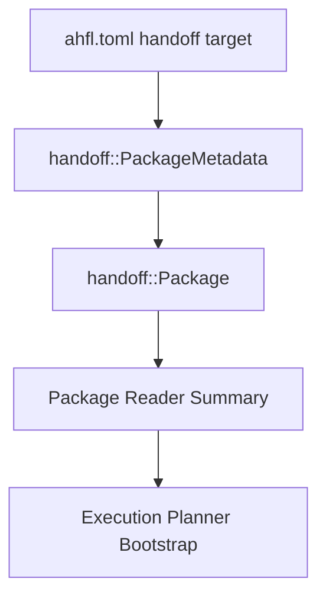
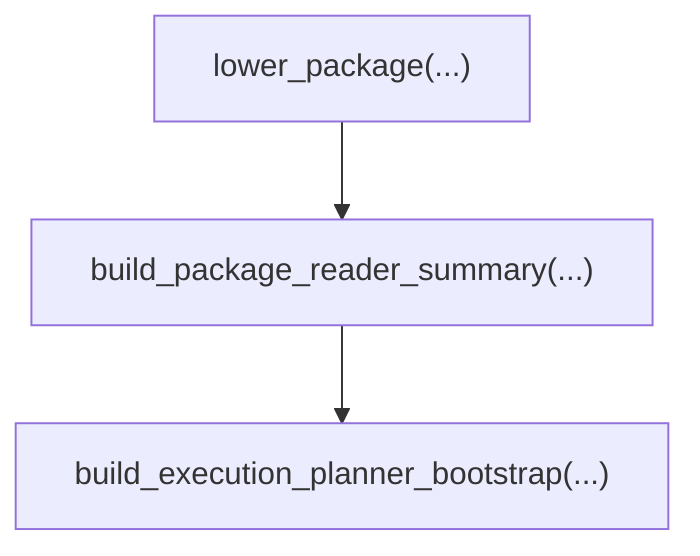

# AHFL Native Handoff Usage

本文是 `docs/reference` 中 native handoff usage 的合并入口，统一覆盖原多版本文档。历史版本的 handoff package 目标、输出边界和 consumer 角色已合并为背景，不再保留独立入口。

关联文档：

- [project-usage.zh.md](./project-usage.zh.md)
- [cli-commands.zh.md](./cli-commands.zh.md)
- [native-runtime-artifacts.zh.md](./native-runtime-artifacts.zh.md)
- [native-runtime-architecture.zh.md](../design/native-runtime-architecture.zh.md)

## 合并范围

| 合并后保留的信息 |
|------------------|
| handoff package 的目标、metadata 边界、consumer 类型、本地验证建议。 |
| handoff target authoring 输入、native package 输出边界、reference consumer helper 接入路径。 |

## 当前口径摘要

1. native handoff 的稳定入口是 `handoff::Package`，不是 AST、raw source 或 raw descriptor。
2. package authoring 通过 `ahfl.toml` 中的 `handoff` target 输入，再 lower 到 `handoff::PackageMetadata` / `handoff::Package`。
3. `emit native-json --manifest <ahfl.toml> --target <name>` 用于发射 native handoff package。
4. reference consumer helper 只消费 handoff package，并做 entry/export target、binding key、workflow dependency 的最小一致性检查。
5. scheduler、retry、timeout、deployment、connector 语义不属于 handoff usage 承诺。

## 当前路径

当前推荐路径是：



对应到仓库实现：

1. `ahflc emit native-json --manifest ... --target ...`
2. `handoff::build_package_reader_summary(...)`
3. `handoff::build_execution_planner_bootstrap(...)`
4. `handoff::build_entry_execution_planner_bootstrap(...)`

## CLI 用法

### 发射 native package

```bash
./build/dev/src/tooling/cli/ahflc emit native-json \
  --manifest tests/integration/package_graph_manifest/ahfl.toml \
  --target workflow \
  --sysroot .
```

### 发射 package review

```bash
./build/dev/src/tooling/cli/ahflc emit package-review \
  --manifest tests/integration/package_graph_manifest/ahfl.toml \
  --target workflow \
  --sysroot .
```

`package-review` 读取同一个 PackageGraph handoff target metadata；它不再需要独立 package descriptor。

## C++ helper 用法

最小 reference consumer 路径：



helper 当前保证：

1. 只消费 `handoff::Package`
2. 不回退读取 AST、raw source 或独立工程/包 descriptor
3. 会对 entry/export target、binding key、workflow dependency 与 workflow target 类型做最小一致性检查
4. 不承诺 scheduler、retry、timeout、deployment 或 connector 语义

## 本地验证建议

只验证 authoring + review + consumer bootstrap 时，优先跑：

```bash
ctest --preset test-dev --output-on-failure -L package-authoring-validation
ctest --preset test-dev --output-on-failure -L package-review
ctest --preset test-dev --output-on-failure -L reference-consumer
```
