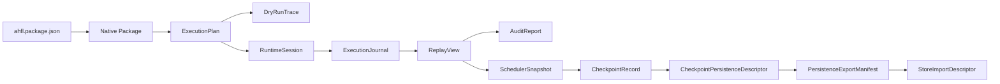

# AHFL Native Runtime Artifacts

本文是 AHFL native / runtime-adjacent artifact 的当前参考入口，合并原先按 artifact 拆开的 package、consumer matrix、execution、runtime、failure、scheduler、checkpoint、persistence、export 与 store-import compatibility 文档。

关联文档：

- [native-runtime-architecture.zh.md](../design/native-runtime-architecture.zh.md)
- [native-handoff-usage.zh.md](./native-handoff-usage.zh.md)
- [project-usage.zh.md](./project-usage.zh.md)
- [durable-store-import-reference.zh.md](./durable-store-import-reference.zh.md)
- [migration-policy.zh.md](./migration-policy.zh.md)

## 当前口径

AHFL 仍处于快速演进阶段，不维护 immature artifact 的前向兼容承诺。本文中的 format version 用于当前 artifact consumer、golden、schema drift evidence 和 release gate 校验；它不是“永远兼容旧 consumer”的承诺。

变更原则：

1. Machine-facing artifact 必须有单一 format version 入口。
2. 下游 artifact 必须记录直接上游 source format version。
3. Review / audit / CLI text 是 projection，不能成为 machine-facing source of truth。
4. 语义改变、字段含义改变、source chain 改变或事实来源改变，都必须同步 format version、golden 和本文。
5. 只改展示文案、不改变 machine-facing schema 或语义时，不新建 compatibility 文档。

## Artifact Chain

`DryRunTrace` 与 `AuditReport` 是旁路 projection。它们可以被人或 CI 消费，但不应作为后续 machine-facing artifact 的第一输入。

## Format Version 总表

| Artifact | 当前 format | 历史 baseline | 代码事实来源 |
| --- | --- | --- | --- |
| Package authoring descriptor | `ahfl.package-authoring.v0.5` | 无 | `ahfl::kPackageAuthoringFormatVersion` |
| Native handoff package | `ahfl.native-package.v1` | 无 | `ahfl::handoff::kFormatVersion` |
| ExecutionPlan | `ahfl.execution-plan.v1` | 无 | `ahfl::handoff::kExecutionPlanFormatVersion` |
| DryRunTrace | `ahfl.dry-run-trace.v1` | 无 | `ahfl::dry_run::kTraceFormatVersion` |
| RuntimeSession | `ahfl.runtime-session.v2` | `ahfl.runtime-session.v1` success-path baseline | `ahfl::runtime_session::kRuntimeSessionFormatVersion` |
| ExecutionJournal | `ahfl.execution-journal.v2` | `ahfl.execution-journal.v1` success-path baseline | `ahfl::execution_journal::kExecutionJournalFormatVersion` |
| ReplayView | `ahfl.replay-view.v2` | `ahfl.replay-view.v1` success-path baseline | `ahfl::replay_view::kReplayViewFormatVersion` |
| AuditReport | `ahfl.audit-report.v2` | `ahfl.audit-report.v1` success-path baseline | `ahfl::audit_report::kAuditReportFormatVersion` |
| SchedulerSnapshot | `ahfl.scheduler-snapshot.v1` | 无 | scheduler snapshot model |
| SchedulerDecisionSummary | `ahfl.scheduler-review.v1` | 无 | scheduler review model |
| CheckpointRecord | `ahfl.checkpoint-record.v1` | 无 | checkpoint model |
| CheckpointReviewSummary | `ahfl.checkpoint-review.v1` | 无 | checkpoint review model |
| CheckpointPersistenceDescriptor | `ahfl.persistence-descriptor.v1` | 无 | persistence descriptor model |
| PersistenceReviewSummary | `ahfl.persistence-review.v1` | 无 | persistence review model |
| PersistenceExportManifest | `ahfl.persistence-export-manifest.v1` | 无 | export manifest model |
| PersistenceExportReviewSummary | `ahfl.persistence-export-review.v1` | 无 | export review model |
| StoreImportDescriptor | `ahfl.store-import-descriptor.v1` | 无 | store import descriptor model |
| StoreImportReviewSummary | `ahfl.store-import-review.v1` | 无 | store import review model |

## Current Consumer Matrix

| Consumer | Stable input | Output / projection | Notes |
| --- | --- | --- | --- |
| Package reader | Native handoff package | package summary | 校验 package format 与 identity consistency。 |
| Execution planner bootstrap | Native handoff package | planner bootstrap summary | 不执行 runtime，不调度 worker。 |
| Execution plan emitter | Planner input | `ExecutionPlan` | 冻结 workflow node、dependency、input expression 与 source package。 |
| Dry-run runner | `ExecutionPlan` + mock binding | `DryRunTrace` | deterministic local projection，不调用真实 capability。 |
| Runtime session bootstrap | `ExecutionPlan` + execution result | `RuntimeSession` | 当前承诺 partial / failed session。 |
| Journal builder | `RuntimeSession` | `ExecutionJournal` | 记录 ordered event family。 |
| Replay builder | plan + session + journal | `ReplayView` | consistency projection，不重新定义 session。 |
| Audit builder | plan + session + journal + replay | `AuditReport` | reviewer-facing aggregate。 |
| Scheduler prototype | replay / session facts | `SchedulerSnapshot` / review | 只冻结 ready / blocked / cursor facts。 |
| Checkpoint prototype | scheduler chain | `CheckpointRecord` / review | 不承诺 durable recovery protocol。 |
| Persistence prototype | checkpoint chain | `CheckpointPersistenceDescriptor` / review | 不承诺真实 object store schema。 |
| Export prototype | persistence chain | `PersistenceExportManifest` / review | 冻结 bundle 和 source chain。 |
| Store import prototype | export chain | `StoreImportDescriptor` / review | durable provider pipeline 的直接上游。 |

## Breaking Change 触发条件

以下变化必须视为 format-version / golden / reference 同步事件：

1. 删除或重命名 machine-facing 字段。
2. 改变字段语义、枚举语义、状态集合或 event kind。
3. 改变 source artifact chain 或 source format version 字段。
4. 改变哪个 artifact 是第一事实来源。
5. 把 review-only / CLI-only 字段升级成 machine-facing input。
6. 把 secret、endpoint、object path、database key、resume token 等真实 deployment material 混入当前 artifact。

以下变化通常不需要单独文档：

1. 新增可忽略的 reviewer-facing 文案。
2. CLI help 文案调整。
3. 测试 fixture 名称调整。
4. 不改变 machine-facing schema 的内部重构。

## 变更检查清单

修改 native/runtime artifact 时：

1. 更新模型 header / implementation。
2. 更新 format-version 常量或明确说明无需变更。
3. 更新 JSON / text golden。
4. 更新相关 CLI reference。
5. 更新本文的 format version 表或 consumer matrix。
6. 运行相关 CTest label 和全量 `git diff --check`。

新增 durable-store/provider artifact 时，不在本文继续扩展逐阶段 compatibility；应更新 [durable-store-import-reference.zh.md](./durable-store-import-reference.zh.md)。
