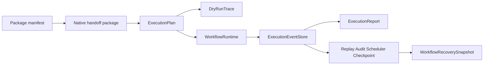

# AHFL Native Runtime Artifacts

本文是 AHFL 编译期 handoff 与运行期 event/projection 格式的参考入口。架构与不变量见 [native-runtime-architecture.zh.md](../design/native-runtime-architecture.zh.md)，命令用法见 [user-guide-execution.zh.md](./user-guide-execution.zh.md)。

## 分层


```mermaid
flowchart LR
    Manifest[Package manifest] --> Package[Native handoff package]
    Package --> Plan[ExecutionPlan]
    Plan --> DryRun[DryRunTrace]
    Plan --> Runtime[WorkflowRuntime]
    Runtime --> Events[ExecutionEventStore]
    Events --> Report[ExecutionReport]
    Events --> Projections[Replay Audit Scheduler Checkpoint]
    Projections --> Recovery[WorkflowRecoverySnapshot]
```

`ExecutionPlan` 和 `DryRunTrace` 是 compiler/pipeline artifact。真实运行的动态事实只存在于 `ExecutionEventStore`；report、renderer 与所有运行期 projection 都是派生结果。

## 代码入口

| Contract | 代码入口 |
| --- | --- |
| Native handoff package | `include/ahfl/compiler/handoff/package.hpp` |
| Execution plan | `include/ahfl/compiler/handoff/package.hpp` |
| Dry-run trace | `src/pipeline/execution/dry_run/runner.hpp` |
| Strong runtime IDs and events | `include/ahfl/runtime/execution_event.hpp` |
| Execution report | `include/ahfl/runtime/execution_report.hpp` |
| Human / JSON / JSONL renderer | `include/ahfl/runtime/execution_renderer.hpp` |
| Replay / audit / scheduler / checkpoint | `include/ahfl/runtime/execution_projection.hpp` |
| OTLP-compatible trace projection | `include/ahfl/runtime/execution_otel.hpp` |
| Recovery store | `src/runtime/engine/workflow_recovery.hpp` |

## Strong IDs

以下类型是互不隐式转换的 numeric index wrapper：

`RunId`、`WorkflowId`、`WorkflowNodeId`、`AgentId`、`CapabilityId`、`ProviderId`、`AgentStateId`、`InvocationId`、`RuntimeValueId`、`DiagnosticId`、`ExecutionEventId`、`CheckpointId`。

字符串只用于 source-level name、diagnostic 和 renderer。事件关联、预算归属、retry/fallback 关联和恢复判断禁止使用名称字符串。

## Event Payload

`ExecutionEventPayload` 是 `std::variant`，当前 family 如下：

| Family | Payload |
| --- | --- |
| Run | `RunStarted`, `RunResumed`, `RunCancellationRequested`, `RunInterrupted`, `RunCompleted` |
| Workflow | `WorkflowStarted`, `WorkflowCompleted`, `WorkflowFailed` |
| Node | `NodeScheduled`, `NodeStarted`, `NodeRestored`, `NodeCompleted`, `NodeFailed`, `NodeSkipped` |
| Agent | `AgentStateEntered` |
| Capability | `CapabilityStarted`, `CapabilityUsageRecorded`, `CapabilityCompleted`, `CapabilityFailed`, `CapabilityRetryScheduled` |
| Provider | `ProviderDegraded` |
| Recovery | `CheckpointSaved` |

每个 event 记录 `ExecutionEventId` 和 monotonic offset。event ID 是单次运行的观察顺序；DAG 因果关系来自 dependency IDs。

`CapabilityUsageRecorded` 位于对应 invocation 的 start 与 terminal 之间，每个 invocation
最多一条。它保存 prompt/completion/total token、estimated cost 和 stable policy notices；
不保存 prompt、response 或 secret。失败 event 在 JSON/JSONL 中按 `DiagnosticId` 从 flat
diagnostic store materialize code、message、range、position 与 related notes。

## Validation

`validate_execution_events` 至少拒绝：

1. event ID 与 flat store index 不一致。
2. monotonic offset 倒退。
3. 同一 identity 重复 start。
4. started identity 缺少 terminal event。
5. 同一 identity 重复 terminal。
6. 没有 start 的 terminal event。
7. usage 出现在 invocation start 前或 terminal 后。
8. 同一 invocation 重复 usage。

失败返回结构化 issue，不允许通过 renderer 隐藏。

## Projection Matrix

| Consumer | Stable input | Output |
| --- | --- | --- |
| Report builder | event span | workflow/node terminal status、execution order、output/diagnostic IDs |
| Replay builder | `WorkflowResult` | node progression、blocking dependencies、restored checkpoint |
| Audit builder | `WorkflowResult` | event counts、degradation/checkpoint counts、terminal invariant |
| Scheduler builder | `WorkflowResult` | dependency satisfaction、completed prefix、next candidate |
| Checkpoint builder | `WorkflowResult` | completed node value IDs、resume candidate |
| Recovery materializer | checkpoint projection + value store | deep-cloned recoverable node values |
| Human/JSON renderer | report + metadata/value stores | final presentation |
| JSONL renderer | event store | ordered machine event stream |
| OTel adapter | event store + run wall-clock anchor | deterministic OTLP-compatible span model / JSON |

projection 不能互相成为第一输入；所有 builder 独立读取 canonical events。

## Recovery Schema

当前持久化 schema：

```text
ahfl.workflow-recovery.v1
```

snapshot 保存 workflow ID、checkpoint ID 和已完成节点的 agent/value。保存使用 atomic replace。load 对 missing、read failure、schema/value corruption 和非法 identity fail closed。

恢复后的 event stream包含：

1. `RunResumed`
2. 每个已完成节点的 `NodeRestored`
3. 后续未完成节点的正常 scheduled/start/terminal events
4. 唯一 `RunCompleted`

## CLI Contract

公开 runtime 产品面：

```text
ahflc emit execution-plan ...
ahflc emit dry-run-trace ...
ahflc run [--profile <name>] [--output-format human|json|jsonl|quiet] ...
```

replay、audit、scheduler 和 checkpoint 是 event-native library projections；它们不作为平行公开 artifact catalog。

`build_execution_otel_trace(...)` 同样是纯 projection。它生成 run -> workflow -> node ->
capability parent/child spans，并把 retry、fallback、checkpoint、resume 与 interruption 作为
span events；它不修改 runtime state，也不成为新的事实源。

## Breaking Change Checklist

修改 runtime event 或 recovery schema 时：

1. 更新 payload/ID 定义及 terminal invariant。
2. 更新 report、所有 projection 和 renderer。
3. 更新 recovery schema 或给出明确拒绝策略。
4. 更新 event/report/projection/recovery tests。
5. 更新 reference workflow crash/restart evidence。
6. 运行 architecture、scope-freeze、controlled-pilot 和 beta gates：

```bash
python3 scripts/check-architecture.py
python3 scripts/check-product-scope-freeze.py
ctest --preset test-dev --output-on-failure -L '^ahfl-controlled-pilot$'
ctest --preset test-dev --output-on-failure -L '^ahfl-beta-gate$'
```
