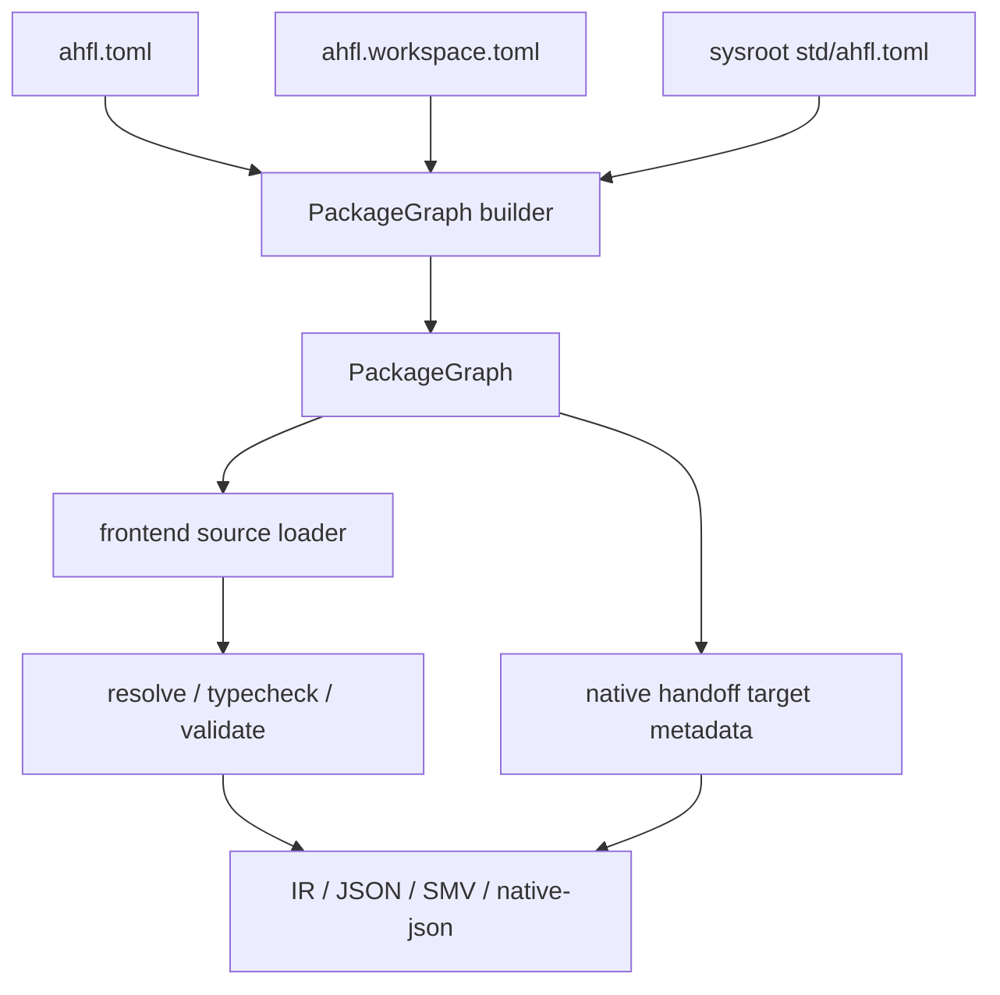

# AHFL Package Usage

本文是 AHFL 工程配置的用户入口。当前公开工程模型以 `ahfl.toml` package manifest、`ahfl.workspace.toml` workspace manifest 和 sysroot `std/ahfl.toml` 为核心；编译器、LSP、formatter、native handoff 与 lockfile 都应通过同一条 PackageGraph 链路理解工程。

关联文档：

- [RFC 0005：Package Configuration System](../rfcs/0005-package-configuration-system.zh.md)
- [CLI 命令参考](./cli-commands.zh.md)
- [Native Handoff Usage](./native-handoff-usage.zh.md)
- [Native Runtime Artifacts](./native-runtime-artifacts.zh.md)

## 当前口径

1. 一个 AHFL package 必须由 `ahfl.toml` 描述；package identity、module root、exports、targets 和 dependencies 属于同一份 manifest。
2. 多 package 工程必须由 `ahfl.workspace.toml` 枚举成员；workspace 不会隐式包含未声明的子目录。
3. `std` 是 sysroot package；选中的 sysroot 必须包含 `std/ahfl.toml`。
4. PackageGraph 是工具层稳定接口；工具不应各自推断 search roots、target metadata 或 stdlib 位置。
5. Native handoff package 由 manifest target metadata 驱动，不再需要单独的 runtime-facing JSON 配置文件。

## 术语

| 术语 | 含义 |
|---|---|
| package manifest | `ahfl.toml`，描述一个 AHFL package 的身份、源码根、导出模块、target 和依赖。 |
| workspace manifest | `ahfl.workspace.toml`，声明一组 package 成员和 workspace 级依赖策略。 |
| sysroot | 包含 `std/ahfl.toml` 的目录；通过 `--sysroot`、`AHFL_SYSROOT` 或编译期默认值选择。 |
| PackageGraph | 由 manifest / workspace / sysroot 构建出的编译输入图，包含 `PackageId`、dependency DAG、module root table、target metadata 和 diagnostics。 |
| target | manifest 中 `[targets.<name>]` 声明的可编译或可发射入口，例如 handoff workflow。 |

## 输入边界



`ProjectInput` 仍可能作为 frontend loader 内部结构存在，但它不是公开工程模型。用户、文档和工具入口应面向 PackageGraph，而不是直接暴露 loader 细节。

## 最小目录

单 package 工程：

```text
refund-audit/
  ahfl.toml
  src/main.ahfl
```

最小 `ahfl.toml`：

```toml
manifest_version = 1

[package]
name = "refund-audit"
version = "0.1.0"
edition = "2026"
kind = "application"

[module]
prefix = "refund_audit"
root = "src"

[exports]
modules = ["main"]

[targets.workflow]
kind = "handoff"
entry = "refund_audit::main::RefundAuditWorkflow"
exports = ["refund_audit::main::RefundAuditWorkflow"]

[dependencies]
std = { source = "sysroot" }
```

多 package workspace：

```text
commerce-workflows/
  ahfl.workspace.toml
  packages/refund-audit/ahfl.toml
  packages/refund-audit/src/main.ahfl
  packages/audit-core/ahfl.toml
  packages/audit-core/src/lib.ahfl
```

最小 `ahfl.workspace.toml`：

```toml
manifest_version = 1

[workspace]
name = "commerce-workflows"
members = [
  "packages/refund-audit",
  "packages/audit-core",
]

[resolver]
version = 1

[dependencies]
std = { source = "sysroot" }
```

## 常用命令

检查单 package：

```bash
ahflc check \
  --manifest tests/integration/package_graph_manifest/ahfl.toml \
  --target workflow \
  --sysroot .
```

检查 workspace 中的 package：

```bash
ahflc check \
  --workspace tests/integration/package_graph_workspace/ahfl.workspace.toml \
  --package refund-audit \
  --target workflow \
  --sysroot .
```

查看 PackageGraph：

```bash
ahflc dump package-graph \
  --manifest tests/integration/package_graph_manifest/ahfl.toml \
  --sysroot .
```

发射 native handoff JSON：

```bash
ahflc emit native-json \
  --manifest tests/integration/package_graph_manifest/ahfl.toml \
  --target workflow \
  --sysroot .
```

格式化 package 覆盖的源码：

```bash
ahflc fmt --check \
  --manifest tests/integration/package_graph_manifest/ahfl.toml \
  --sysroot .
```

## Sysroot 选择

sysroot 选择顺序：

1. `--sysroot <path>`
2. `AHFL_SYSROOT`
3. 编译期默认 sysroot

选中目录必须满足：

```text
<sysroot>/std/ahfl.toml
<sysroot>/std/*.ahfl
```

`std` 依赖必须写作：

```toml
[dependencies]
std = { source = "sysroot" }
```

如果 sysroot 缺失，PackageGraph 阶段失败；工具不应回退到当前目录猜测 stdlib。

## Manifest 字段

| 字段 | 必填 | 说明 |
|---|---|---|
| `manifest_version` | 是 | 当前为 `1`。 |
| `[package].name` | 是 | PackageGraph 中的 package identity；同一 graph 内不能重复。 |
| `[package].version` | 是 | package 版本。 |
| `[package].edition` | 是 | 语言 edition。 |
| `[package].kind` | 是 | `application`、`library`、`standard-library` 等 package 分类。 |
| `[module].prefix` | 是 | module namespace 前缀；同一 graph 内不能冲突。 |
| `[module].root` | 是 | package 内源码根目录。 |
| `[exports].modules` | 是 | 对外导出的 module 列表。 |
| `[targets.<name>]` | 视需求 | 可检查、发射或打包的目标入口。 |
| `[dependencies]` | 视需求 | `sysroot` 或 `path` dependency。 |

## 支持矩阵

| 命令 | `--manifest` | `--workspace --package` | `--target` | `--sysroot` |
|---|---:|---:|---:|---:|
| `check` | 是 | 是 | 是 | 是 |
| `fmt` | 是 | 是 | 否 | 是 |
| `dump package-graph` | 是 | 是 | 否 | 是 |
| `dump lockfile` | 是 | 是 | 否 | 是 |
| `emit native-json` | 是 | 是 | 是 | 是 |
| package artifact commands | 是 | 是 | 是 | 是 |
| provider diagnostic artifacts | 是 | 是 | 是 | 是 |

## 常见失败

- `failed to locate sysroot std/ahfl.toml`
  - 传入 `--sysroot`，或设置 `AHFL_SYSROOT` 指向包含 `std/ahfl.toml` 的目录。
- `dependency package '...' is not in PackageGraph`
  - dependency 未在 workspace members 中声明，或 path dependency 指向了无效 package。
- `workspace does not contain package named '...'`
  - `--package` 必须匹配 workspace 中某个 member 的 `[package].name`。
- `target '...' does not exist`
  - `--target` 必须匹配 `[targets.<name>]`。
- `module prefix '...' conflicts with package '...'`
  - 两个 package 声明了相同或冲突的 module prefix，应在 manifest 层重命名。

## 最小验证

修改 package 配置后，至少运行：

```bash
ctest --preset test-dev --output-on-failure -R 'ahflc\.(check|dump_package_graph|dump_lockfile)\.(manifest|workspace)'
ctest --preset test-dev --output-on-failure -R 'ahfl\.package_graph\.core_all'
python3 scripts/check-rfc.py
```

## 对贡献者的要求

1. 新工具入口必须消费 PackageGraph，不得复制 manifest、workspace 或 sysroot 解析规则。
2. 新 native handoff 能力必须挂到 `[targets.<name>]` metadata，而不是新增旁路描述文件。
3. 新 package 配置字段必须有 manifest parser、canonical serialization、diagnostic 和 regression test。
4. 修改工程配置语义时，同步更新：
   - [RFC 0005](../rfcs/0005-package-configuration-system.zh.md)
   - [CLI 命令参考](./cli-commands.zh.md)
   - `tests/cmake/ProjectTests.cmake`
   - PackageGraph unit / integration fixtures
