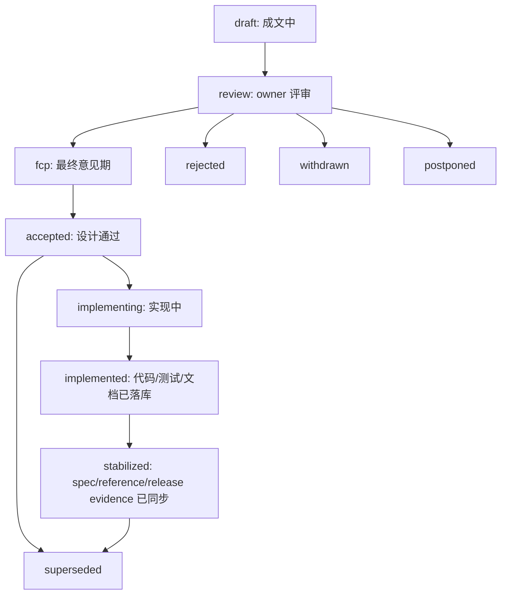

# AHFL RFC Process

本文是 AHFL RFC 系统的操作者手册。系统设计见 [rfc-system.zh.md](../design/rfc-system.zh.md)，机器索引见 [docs/rfcs](../rfcs/README.md)。

RFC 不是最终规范。RFC 被接受后，仍必须把规范性结果同步到 `docs/spec/`，把工程结构同步到 `docs/design/`，把操作说明同步到 `docs/reference/`，把执行计划同步到 `docs/plans/` 或 issue tracker。

## 何时需要 RFC

以下变更默认需要 RFC：

| Area | 触发条件 |
| --- | --- |
| `language` | grammar、type system、static semantics、module/name resolution、verification subset |
| `compiler` | parser/frontend/resolver/typecheck/lowering 的跨层契约 |
| `ir` | Semantic IR、JSON IR、Typed HIR serialization、backend input contract |
| `stdlib` | `std/` public API、prelude 暴露、builtin hook、public trait 语义 |
| `runtime` | evaluator、capability、LLM provider、wire contract、streaming/tool calling 语义 |
| `tooling` | CLI/LSP/formatter/diagnostic 的用户可见行为 |
| `formal` | SMV/backend verification semantics |
| `process` | release gate、docs taxonomy、RFC process、compatibility policy |

判断原则：用户能观察到、多模块依赖、半年后仍需要解释原因、或迁移成本高，均倾向 RFC。

## 生命周期



`accepted` 不等于已实现，`implemented` 不等于已稳定。状态必须描述事实，不允许用乐观状态替代证据。

## 新建 RFC

1. 从 [0000-template.zh.md](../rfcs/0000-template.zh.md) 复制内容。
2. 分配下一个全局四位编号，例如 `0005-short-title.zh.md`。
3. 在 frontmatter 填写 `rfc`、`title`、`status`、`area`、`stability`、`authors`、`owners`、`tracking_issue`、`discussion`。
4. 在 [index.yml](../rfcs/index.yml) 中登记 canonical 文件。
5. 运行：

```bash
python3 scripts/check-rfc.py
```

## 推进状态

### draft 到 review

必须满足：

1. 固定章节齐全且顺序正确。
2. `Summary`、`Motivation`、`Design`、`Compatibility and Migration`、`Test Plan` 可独立评审。
3. `shepherd` 和各 `area` owner 已填写。
4. 所有架构图使用 Mermaid。
5. 本地 `python3 scripts/check-rfc.py` 通过。

### review 到 fcp

必须满足：

1. required owners 明确 sign off。
2. blocking concerns 已关闭，或被转为明确的 `Open Questions`。
3. implementation owner 和 testing owner 确认可实施、可验证。

### fcp 到 accepted

必须满足：

1. FCP 时间窗结束。
2. 无未解决 blocking concern。
3. RFC 中关键字段没有 `TBD`、`TODO`、`DEFERRED`。
4. `tracking_issue` 和 `discussion` 指向真实记录。

### implemented 到 stabilized

必须满足：

1. 代码实现、测试和文档均已合入。
2. 对应 spec/design/reference 已同步。
3. 用户可见变化有 release note 或 migration note。
4. breaking change 在 commit footer 或 PR 描述中包含 `BREAKING CHANGE:`、影响范围和迁移指南。

## PR 规则

每个 PR 必须在模板中填写：

```text
RFC: RFC-0001
```

或：

```text
RFC: N/A - this only fixes an internal typo and does not change user-visible behavior
```

当 PR 修改 language、IR、stdlib public surface、runtime capability contract、developer-visible diagnostics、CLI/LSP/formatter behavior 或 process governance 时，`RFC: N/A` 必须解释为什么没有触发 RFC 门槛。

## 机器检查

`scripts/check-rfc.py` 会检查：

1. canonical 文件名必须是 `NNNN-kebab-slug.zh.md`。
2. 旧式 wave-local RFC 文件名必须被拒绝。
3. frontmatter 字段完整，status、area、stability、日期格式合法。
4. area 必须有 owner entry。
5. required sections 必须存在且顺序正确。
6. Markdown 相对链接必须存在，禁止机器本地绝对路径。
7. 架构图必须使用 Mermaid。
8. `review` 及之后状态不能保留关键 `TBD` 字段。

CI 会在 pull request 上运行同一检查。
