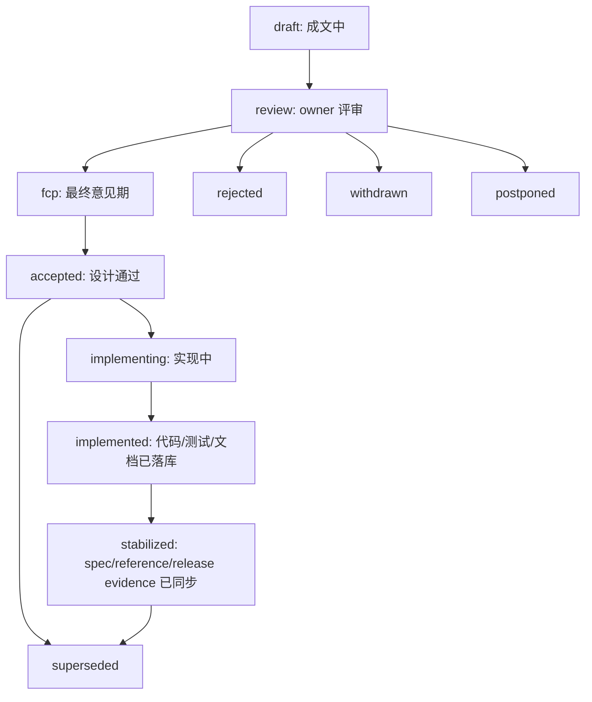

# AHFL RFC Process

本文是 AHFL RFC 系统的操作者手册：何时需要 RFC、如何创建与推进、评审与门禁规则。机器契约（frontmatter、章节、状态机、index 同步）以 [docs/rfcs/README.md](../rfcs/README.md) 与 `scripts/check-rfc.py` 为准；agent 执行手册见 `.claude/skills/rfc/SKILL.md`。

RFC 不是最终规范。RFC 被接受后，仍必须把规范性结果同步到 `docs/spec/`，把工程结构同步到 `docs/design/`，把操作说明同步到 `docs/reference/`。RFC 自身即实施与验收的跟踪单元，不再为 RFC 工作新建 `docs/plans/` companion 计划文档。

## 设计原则

RFC 系统的目标是"轻量入口、严格出口"：

1. **设计权威**：影响语言语义、IR、稳定 artifact、stdlib public surface、runtime capability contract 或开发者可见诊断的变更，都有可追踪的设计决策。
2. **实现可验证**：RFC 给出可执行验收标准，不只有愿景或自然语言偏好。
3. **责任明确**：每个 RFC 有 author、shepherd、area owners 与 implementation owner。
4. **机器可检查**：编号、状态、必填字段、链接、Mermaid 图、owner 覆盖、index 同步由 `scripts/check-rfc.py` 检查；无法被机器检查的治理规则只是建议，不是 gate。
5. **状态诚实**：`accepted` 不等于已实现，`implemented` 不等于已稳定，状态必须描述事实。

写 draft 应该容易（不阻止早期设计讨论）；进入 review 必须完整（评审者不替作者补设计）；进入 accepted 必须有 owner 签核和可执行验收；进入 stabilized 必须有代码、测试、文档和 release evidence。

## 何时需要 RFC

以下变更默认需要 RFC：

| Area | 触发条件 |
| --- | --- |
| `language` | grammar、type system、static semantics、module/name resolution、verification subset |
| `compiler` | parser/frontend/resolver/typecheck/lowering 的跨层契约 |
| `ir` | Semantic IR、JSON IR、Typed HIR serialization、backend input contract |
| `stdlib` | `std/` public API、prelude 暴露、builtin hook、public trait 语义 |
| `runtime` | evaluator、capability、LLM provider、wire contract、streaming/tool calling 语义 |
| `tooling` | CLI/LSP/formatter/diagnostic 的用户可见行为 |
| `formal` | SMV/backend verification semantics |
| `process` | release gate、docs taxonomy、RFC process、compatibility policy |

判断原则：用户能观察到、多模块依赖、半年后仍需要解释原因、或迁移成本高，均倾向 RFC。

## 生命周期


```mermaid
flowchart TD
    Draft["draft: 成文中"] --> Review["review: owner 评审"]
    Review --> Fcp["fcp: 最终意见期"]
    Fcp --> Accepted["accepted: 设计通过"]
    Accepted --> Implementing["implementing: 实现中"]
    Implementing --> Implemented["implemented: 代码/测试/文档已落库"]
    Implemented --> Stabilized["stabilized: spec/reference/release evidence 已同步"]
    Review --> Rejected["rejected"]
    Review --> Withdrawn["withdrawn"]
    Review --> Postponed["postponed"]
    Accepted --> Superseded["superseded"]
    Stabilized --> Superseded
```

`accepted` 不等于已实现，`implemented` 不等于已稳定。状态必须描述事实，不允许用乐观状态替代证据。

## 新建 RFC

1. 从 [0000-template.zh.md](../rfcs/0000-template.zh.md) 复制内容。
2. 分配下一个全局四位编号，例如 `0005-short-title.zh.md`。
3. 在 frontmatter 填写 `rfc`、`title`、`status`、`area`、`stability`、`authors`、`owners`、`tracking_issue`、`discussion`。
4. 在 [index.yml](../rfcs/index.yml) 中登记 canonical 文件。
5. 运行：

```bash
python3 scripts/check-rfc.py
```

## 推进状态

### draft 到 review

必须满足：

1. 固定章节齐全且顺序正确。
2. `Summary`、`Motivation`、`Design`、`Compatibility and Migration`、`Test Plan` 可独立评审。
3. `shepherd` 和各 `area` owner 已填写。
4. 所有架构图使用 Mermaid。
5. 本地 `python3 scripts/check-rfc.py` 通过。

### review 到 fcp

必须满足：

1. required owners 明确 sign off。
2. blocking concerns 已关闭，或被转为明确的 `Open Questions`。
3. implementation owner 和 testing owner 确认可实施、可验证。

### fcp 到 accepted

必须满足：

1. FCP 至少持续 5 个工作日（项目 lead 明确 emergency override 除外），时间窗结束。
2. 无未解决 blocking concern。
3. RFC 中关键字段没有 `TBD`、`TODO`、`DEFERRED`。
4. `tracking_issue` 和 `discussion` 指向真实记录。

### implemented 到 stabilized

必须满足：

1. 代码实现、测试和文档均已合入。
2. 对应 spec/design/reference 已同步。
3. 用户可见变化有 release note 或 migration note。
4. breaking change 在 commit footer 或 PR 描述中包含 `BREAKING CHANGE:`、影响范围和迁移指南。

## Concern-Based Review

AHFL 不采用简单投票制。评审采用 concern-based 模型：reviewer 提交 concern，shepherd 分类为 blocking 或 non-blocking；blocking concern 必须通过修改 RFC、调整 scope 或拒绝方案解决并经 owner sign-off 后才能进入 FCP；non-blocking note 记录在案，不无限阻塞 RFC。

Blocking concern 必须满足至少一项：

1. 违反 AHFL 核心设计原则（字符串身份、继承式 AST、无 SourceRange 诊断等）。
2. 与现有 spec 或已接受 RFC 冲突。
3. 缺少可执行验证路径。
4. 会破坏 runtime / IR / LSP / stdlib contract 但 migration plan 不充分。
5. 方案复杂度明显超过收益，且 alternatives 未充分评估。

## Breaking Change 政策

AHFL 仍处于快速演进阶段，允许 breaking change，但必须显式化。RFC 中必须有：

1. 影响范围：source language、IR、runtime artifact、CLI、LSP、stdlib、diagnostics。
2. 迁移方式：自动化、机械替换、手工迁移或不可迁移。
3. 验收方式：旧行为如何被测试删除，新行为如何被测试覆盖。
4. release note 摘要。

不接受"当前没人用所以不写迁移说明"。即便不维护前向兼容，也要维护决策可理解性。

## 稳定性等级

每个 RFC 必须声明目标稳定性：

| Stability | 含义 |
| --- | --- |
| `experimental` | 可快速破坏，默认不承诺兼容 |
| `internal` | 只供编译器/测试内部消费 |
| `developer-facing` | CLI/LSP/diagnostics 可见，但仍可随 minor 调整 |
| `stable-language` | 语言规范或用户代码依赖 |
| `stable-artifact` | machine-facing artifact / schema / IR 依赖 |

`stable-language` 和 `stable-artifact` 进入 `stabilized` 前必须有 conformance 或 golden gate。

## PR 规则

每个 PR 必须在模板中填写：

```text
RFC: RFC-0001
```

或：

```text
RFC: N/A - this only fixes an internal typo and does not change user-visible behavior
```

当 PR 修改 language、IR、stdlib public surface、runtime capability contract、developer-visible diagnostics、CLI/LSP/formatter behavior 或 process governance 时，`RFC: N/A` 必须解释为什么没有触发 RFC 门槛。

实现 PR 用 `Implements: RFC-XXXX` 引用对应 RFC。若实现偏离 RFC，必须二选一：更新 RFC 并重新进入 review/fcp，或在实现 PR 中明确记录 deviation 并由 area owner 批准、后续在 RFC 中修正设计。

## 机器检查

`scripts/check-rfc.py` 会检查：

1. canonical 文件名必须是 `NNNN-kebab-slug.zh.md`。
2. 旧式 wave-local RFC 文件名必须被拒绝。
3. frontmatter 字段完整，status、area、stability、日期格式合法。
4. area 必须有 owner entry。
5. required sections 必须存在且顺序正确。
6. Markdown 相对链接必须存在，禁止机器本地绝对路径。
7. 架构图必须使用 Mermaid。
8. `review` 及之后状态不能保留关键 `TBD` 字段。

CI 会在 pull request 上运行同一检查。
