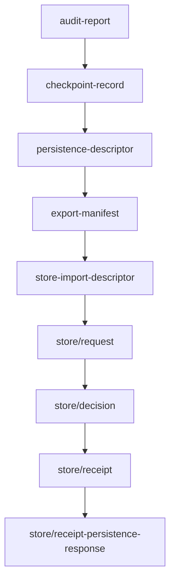

# AHFL 保障与生产证据指南 V0.1

本文说明如何使用 AHFL 的 assurance profile、formal verification、durable-store 和 provider evidence，把 Agent 工作流从“能编译”推进到“可审计、可恢复、可进入生产评审”。

规范性规则以 [assurance-v0.1.zh.md](../spec/assurance-v0.1.zh.md) 为准。Durable store / Provider 贡献者细节见 [durable-store-import-reference-v0.1.zh.md](./durable-store-import-reference-v0.1.zh.md)。

## 保障边界

AHFL 的保障体系证明和检查的是控制平面事实：

1. Capability 是否声明了 effect profile。
2. Durable / financial effect 是否声明了幂等键和回执要求。
3. Financial effect 是否声明了审批策略和补偿路径。
4. Flow 是否会调用带风险的 capability。
5. Workflow DAG 生命周期、终态、依赖和 temporal clause 是否能进入有限控制模型。
6. Provider readiness artifact 是否形成 secret-free、deterministic、可审计的证据链。

AHFL 不声称完整证明外部系统状态、Provider 内部实现、无限数据域、真实支付网关或 LLM 输出语义。

## Assurance effect profile

高风险 capability 应声明 effect block：

```ahfl
capability ChargeCard(request: Payment) -> Receipt {
    effect: financial_write;
    domain: payments;
    idempotency: request.idempotency_key;
    receipt: required;
    retry: safe_if_idempotent;
    timeout: 30s;
    compensation: RefundCard;
    policy: [payments::approval_required, payments::audit_event];
}
```

字段含义：

| 字段 | 用途 |
|------|------|
| `effect` | 外部影响类别：`read`、`external_side_effect`、`durable_write`、`financial_write`、`unknown` |
| `domain` | 业务域标签 |
| `idempotency` | 幂等键路径 |
| `receipt` | 回执要求：`none`、`optional`、`required` |
| `retry` | 重试安全性：`unsafe`、`safe_if_idempotent`、`safe` |
| `timeout` | capability 超时事实 |
| `compensation` | 补偿 capability |
| `policy` | 审批、审计等策略标签 |

未声明 effect block 的 capability 仍可编译，但不能通过 production assurance gate。

## Assurance validation

生成 assurance bundle：

```bash
./build/dev/src/tooling/cli/ahflc emit assurance-json \
  tests/golden/assurance/ok_effects.ahfl
```

运行 production gate：

```bash
./build/dev/src/tooling/cli/ahflc validate \
  tests/golden/assurance/ok_effects.ahfl
```

成功输出：

```text
ok: assurance validation ready
```

常见 blocker：

| Blocker | 含义 |
|---------|------|
| `missing_effect_spec` | capability 没有 effect block |
| `unknown_effect_kind` | effect 是 `unknown` |
| `missing_idempotency_key` | durable / financial write 缺少幂等键 |
| `missing_required_receipt` | durable / financial write 没有 required receipt |
| `missing_financial_approval_policy` | financial write 缺少 approval policy |
| `missing_financial_compensation` | financial write 缺少 compensation |
| `retry_safe_if_idempotent_without_key` | `safe_if_idempotent` 没有 idempotency key |

## Formal verification

生成 SMV 模型：

```bash
./build/dev/src/tooling/cli/ahflc emit smv \
  examples/refund_audit_core_v0_1.ahfl
```

调用 NuSMV / nuXmv：

```bash
./build/dev/src/tooling/cli/ahflc verify \
  --model-checker /path/to/nuXmv \
  --formal-model-out /tmp/refund_audit.smv \
  examples/refund_audit_core_v0_1.ahfl
```

Checker 查找顺序：

1. `--model-checker <path>`。
2. `AHFL_SMV_CHECKER` 环境变量。
3. `PATH` 中的 `NuSMV`。
4. `PATH` 中的 `nuXmv`。
5. `PATH` 中的 `nuxmv`。

Formal backend 适合证明：

| 可证明 / 可检查 | 说明 |
|-----------------|------|
| Agent 状态空间 | 状态、初始状态、终态、转移 |
| Workflow lifecycle | idle、running、completed、failed、recovering 等有限生命周期 |
| DAG 依赖 | node running / completed 前依赖必须 completed |
| Contract temporal clause | `always`、`eventually`、`called`、`running`、`completed` 等控制谓词 |
| Capability call event | flow handler 中的 capability 调用被绑定成 call event |
| Effect obligation | 部分 effect / recovery obligation 进入有限模型 |

不应把 formal verification 当成对外部服务、无限数据域或 Provider 真实实现的完整证明。

## Durable store 证据链

当 workflow 需要持久化、恢复、导出或交给外部 durable store adapter 时，使用 store pipeline artifact。



生成 request：

```bash
./build/dev/src/tooling/cli/ahflc emit store/request \
  --project tests/integration/workflow_value_flow/ahfl.project.json \
  --package tests/integration/workflow_value_flow/ahfl.package.json \
  --capability-mocks tests/golden/dry_run/project_workflow_value_flow.mocks.json \
  --input-fixture fixture.request.ok \
  --run-id docs-guide-run
```

继续生成下游 artifact：

```bash
./build/dev/src/tooling/cli/ahflc emit store/decision \
  --project tests/integration/workflow_value_flow/ahfl.project.json \
  --package tests/integration/workflow_value_flow/ahfl.package.json \
  --capability-mocks tests/golden/dry_run/project_workflow_value_flow.mocks.json \
  --input-fixture fixture.request.ok \
  --run-id docs-guide-run
```

Store pipeline 输出应满足：

1. 不包含真实 secret、token、endpoint secret 或外部系统凭据。
2. Identity 由上游 artifact 和 `run-id` 推导。
3. 每个阶段都有明确状态和下一步。
4. Adapter decision、receipt 和 persistence response 可以被独立审查。

## Provider readiness evidence

Provider evidence 面向生产评审，不是普通业务用户的默认入口。当前 CLI 使用内部诊断入口：

```bash
./build/dev/src/tooling/cli/ahflc emit-provider-artifact provider/production-readiness-report \
  --project tests/integration/workflow_value_flow/ahfl.project.json \
  --package tests/integration/workflow_value_flow/ahfl.package.json \
  --capability-mocks tests/golden/dry_run/project_workflow_value_flow.mocks.json \
  --input-fixture fixture.request.ok \
  --run-id docs-guide-run
```

推荐优先查看的 public provider artifact：

| Artifact | 用途 |
|----------|------|
| `provider/write-attempt` | 写入尝试预览 |
| `provider/driver-binding` | Provider driver binding |
| `provider/sdk-mock-adapter-execution` | SDK mock adapter 执行 |
| `provider/write-recovery-plan` | 写入恢复计划 |
| `provider/failure-taxonomy-report` | 故障分类报告 |
| `provider/compatibility-report` | 兼容性报告 |
| `provider/registry` | Provider registry |
| `provider/selection-plan` | Provider 选择计划 |
| `provider/production-readiness-evidence` | 生产就绪证据 |
| `provider/production-readiness-report` | 生产就绪报告 |
| `provider/conformance-report` | 一致性报告 |
| `provider/schema-compatibility-report` | Schema 兼容性报告 |
| `provider/config-bundle-validation-report` | 配置包验证报告 |
| `provider/release-evidence-archive-manifest` | 发布证据归档清单 |
| `provider/approval-receipt` | 审批回执 |
| `provider/runtime-policy-report` | 运行时策略报告 |
| `provider/production-integration-dry-run-report` | 生产集成干跑报告 |

使用 `--show-hidden --help` 可以查看 internal artifact。Internal artifact 主要用于定位 provider pipeline 中间节点，不应成为产品默认交付面。

## 发布前检查清单

| 检查 | 命令 | 通过标准 |
|------|------|----------|
| 语法和类型 | `ahflc check` | 返回 0 |
| Package review | `ahflc emit package-review` | entry、exports、binding 正确 |
| Execution plan | `ahflc emit execution-plan` | DAG、node、依赖符合预期 |
| Dry run | `ahflc emit dry-run-trace` | status 和执行顺序符合预期 |
| Audit | `ahflc emit audit-report` | 审计摘要无异常 blocker |
| Assurance | `ahflc validate` | 输出 `ok: assurance validation ready` |
| Formal | `ahflc verify` | checker 证明所有相关 specification |
| Durable store | `ahflc emit store/request` 及下游 | request、decision、receipt、persistence 状态闭环 |
| Provider readiness | `ahflc emit-provider-artifact provider/production-readiness-report` | release gate 进入 review-ready 状态 |

## 读输出时的原则

1. `emit` artifact 是 evidence，不等同于 gate；gate 应使用 `validate`、`verify` 或组织定义的 provider readiness 门禁。
2. 文本 review 适合人读，JSON artifact 适合 CI、归档和下游系统消费。
3. 对 production 相关 artifact，优先检查 secret-free、deterministic identity、source chain 和 blocker 字段。
4. 对 failed / partial run，不要只看最终状态，要顺着 journal、replay、checkpoint、store decision 和 provider failure taxonomy 找到失败边界。
