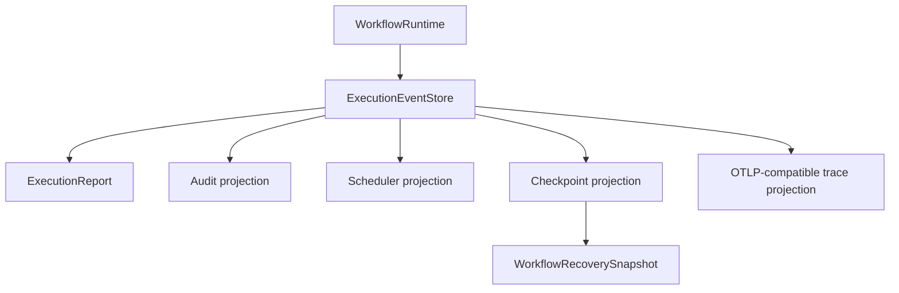

# AHFL 保障与生产证据指南

本指南将 AHFL 的 assurance、formal verification、runtime event/recovery 与 release
evidence 组合成一条可操作的评审流程。目标不是把每个 Agent workflow 宣传为“已生产
就绪”，而是让评审者能回答：哪些控制事实被静态检查？哪些运行事实已真实观测？哪些
证据来自当前 revision？哪些长期任务只能在 CI 中运行？

规范性规则以 [Assurance Spec](../spec/assurance.zh.md) 为准；runtime event、ID、
projection 与 recovery schema 以 [运行期 artifact 参考](./native-runtime-artifacts.zh.md)
为准。运行命令和 provider 配置见 [执行与包指南](./user-guide-execution.zh.md)。

## Assurance Boundary

AHFL 检查或证明的是**控制平面事实**：

1. capability 是否显式声明 effect profile。
2. durable / financial effect 是否声明 idempotency、receipt、approval、compensation。
3. flow 是否会调用风险 capability，workflow 是否具有可检查的 DAG/lifecycle。
4. temporal clause 是否能降为有限控制模型。
5. canonical event store 是否满足 terminal invariant、usage ordering 与 recovery 安全条件。

它不证明外部数据库真实状态、支付网关最终结果、LLM 语义正确性、provider 内部实现、无限
数据域或生产部署拓扑。不要把 `validate`、`verify` 或一份 JSON artifact 的成功，描述为
外部系统已被完整证明。

## Effect Profiles

### 何时需要 effect block

任何有 durable 或 financial 影响的 capability 都应写 effect block。纯 read 也可以
声明，便于审计完整性：

```ahfl
capability ChargeCard(request: Payment) -> Receipt {
    effect: financial_write;
    domain: payments;
    idempotency: request.idempotency_key;
    receipt: required;
    retry: safe_if_idempotent;
    timeout: 30s;
    compensation: RefundCard;
    policy: [payments::approval_required, payments::audit_event];
}
```

| 字段 | 表示的可检查事实 | 高风险建议 |
|---|---|---|
| `effect` | `read`、`external_side_effect`、`durable_write`、`financial_write`、`unknown` | 不使用 `unknown` |
| `domain` | 业务域标签 | 让审计/策略名称稳定可读 |
| `idempotency` | 请求中的幂等键路径 | durable / financial 必填 |
| `receipt` | `none`、`optional`、`required` | durable / financial 使用 `required` |
| `retry` | `unsafe`、`safe_if_idempotent`、`safe` | 不要无幂等键地声称 `safe_if_idempotent` |
| `timeout` | 控制面 deadline | 明确外部调用上限 |
| `compensation` | 补偿 capability 名称 | financial 必填 |
| `policy` | 审批、审计等策略标签 | financial 包含 `approval_required` |

effect block 缺省时，AHFL 源码仍可能通过普通 `check`，但 `validate` 不能将其视为
assurance-ready。effect profile 是声明的控制事实，不是已发生的外部 receipt；实际调用
和失败仍要从 runtime JSONL/recovery evidence 读取。

## Validate Assurance

```bash
AHFLC=./build/dev/src/tooling/cli/ahflc

"$AHFLC" emit assurance-json tests/golden/assurance/ok_effects.ahfl
"$AHFLC" validate tests/golden/assurance/ok_effects.ahfl
```

成功时输出：

```text
ok: assurance validation ready
```

常见 blocker：

| Blocker | 原因 | 修复方向 |
|---|---|---|
| `missing_effect_spec` | capability 没有 effect block | 为外部 effect 声明 profile |
| `unknown_effect_kind` | effect 是 `unknown` | 选择真实 effect 类别 |
| `missing_idempotency_key` | durable / financial write 缺幂等键 | 将 request 的稳定 key 映射到 `idempotency` |
| `missing_required_receipt` | durable / financial write 未要求 receipt | 使用 `receipt: required` |
| `missing_financial_approval_policy` | financial write 缺审批策略 | 添加 `approval_required` policy |
| `missing_financial_compensation` | financial write 缺补偿路径 | 声明补偿 capability |
| `retry_safe_if_idempotent_without_key` | 重试语义没有可证明依据 | 添加 idempotency 或改为 `unsafe` |

先解决 `check` diagnostic，再处理 assurance blocker。不要通过降低 effect 等级或删除
capability 调用来“让 gate 变绿”，除非那确实是正确的业务设计。

## Verify Formal Control

formal verification 对 workflow 的**有限控制模型**做外部验证：

```bash
"$AHFLC" emit smv examples/refund/audit.ahfl

"$AHFLC" verify \
  --formal-backend nuxmv \
  --model-checker /path/to/nuXmv \
  --checker-timeout-seconds 60 \
  --formal-model-out build/refund-audit.smv \
  examples/refund/audit.ahfl
```

| backend | 当前 `verify` 行为 |
|---|---|
| `nuxmv`、`nusmv` | 调用外部 SMV checker |
| `spin`、`tlaplus` | 可在 capability matrix 中出现，但 `verify` 返回 `verification_unsupported` |

checker 查找顺序：`--model-checker` → `AHFL_SMV_CHECKER` → backend-specific 环境变量
（如 `AHFL_NUXMV_PATH`）→ `PATH` 中的 `NuSMV` / `nuXmv`。

可检查的控制性质：

| 性质 | 例子 |
|---|---|
| Agent 状态机 | initial/final state、可达转移 |
| Workflow lifecycle | idle/running/completed/failed/recovering 等有限 phase |
| DAG 依赖 | `respond` running 前 `decide` 已 completed |
| temporal contract | `always`、`eventually`、`called`、`running`、`completed` |
| capability/effect event | flow handler 内 call event 与部分 recovery obligation |

检查器报告中的 `checker_status` 用于自动化分类：`missing_binary`、
`verification_unsupported`、`checker_error`。timeout 是失败，不是“未知通过”。
`state_space_estimate` 等字段仅为启动前规模提示，不能当作 checker 返回的精确
reachable-state 数。

## Runtime Evidence

真实运行以 `ExecutionEventStore` 作为唯一动态事实：



评审 JSON/JSONL 时检查：

1. 每个 run、workflow、node、capability start 有唯一 terminal event。
2. `CapabilityUsageRecorded` 位于对应 invocation start/terminal 之间，并按 invocation
   最多出现一次。
3. audit/replay/scheduler/checkpoint 只从 canonical events 计算，不解析 human 输出。
4. checkpoint 只引用 completed node 的 numeric IDs 与 value IDs。
5. recovery snapshot 使用 atomic replace；corruption、partial write、未知 ID fail closed。
6. resume 产生 `RunResumed` / `NodeRestored`，不重复已完成 side effect。
7. 持久化或公开 event 不包含 API key、token 或 secret provider response。

reference recovery evidence 覆盖本地 HTTP provider、`SIGKILL`、operator approval、
partial write 与 side-effect dedupe。它证明 reference workflow 的 recovery contract，
不自动替代你的业务系统 disaster-recovery 演练。

## Evidence Tiers

### 1. Verified Beta

`config/beta-gate.json` 定义十项 beta evidence contract。它覆盖 manifest run profile、
numeric runtime identity、canonical projections、terminal lifecycle、formatter、stdlib
container migration、reference crash recovery、干净安装、README claim 与 scope freeze。

```bash
python3 scripts/generate-beta-evidence-bundle.py \
  --repo-root . \
  --build-dir build/dev

python3 scripts/check-beta-gate.py --require-ready
```

每个 evidence 都绑定 `source_revision`。修改源码或文档后，旧 evidence 可能变为 stale；
不能复制旧 JSON、手改 revision 或只运行某一个绿色测试来重新宣称 ready。

### 2. Controlled Pilot

controlled-pilot 是有边界的运行证据，不是 production-ready 标签。合同位于
`config/controlled-pilot-gate.json`，要求：

| 项目 | 当前合同 |
|---|---|
| Bounded soak | 至少 30 秒、至少 12 次 reference workflow |
| 网络故障 | disconnect、HTTP 429、timeout、partial response 均 fail closed |
| Recovery | process crash、schema rejection、checkpoint/resume |
| Provider governance | budget path 与 canonical usage |
| Observability | canonical events 导出 OTLP-compatible spans |

```bash
ctest --preset test-dev --output-on-failure \
  -L '^ahfl-controlled-pilot$'

python3 scripts/check-controlled-pilot-gate.py --require-ready
```

如果当前 checkout 没有对应 revision evidence，checker 返回 missing/stale/failed 是正确的
保护行为，不应用旧报告替代。

### 3. Production Confidence Is CI-Only

production-confidence 合同位于 `config/production-confidence-gate.json`。它要求单一长
生命周期 worker 至少运行 3600 秒、至少 100 次迭代、发生并恢复 provider retry，并验证
RSS/allocator 的末四分位增长阈值。

```bash
# 本地只检查已经下载的 evidence；不会启动一小时任务。
python3 scripts/check-production-confidence-gate.py --require-ready
```

**不要在本地运行 hour-scale soak。** `--contract-kind hour-scale` 只能由
`.github/workflows/production-confidence.yml` 的 `Production Confidence` GitHub
Actions job 启动，允许的事件是 nightly `schedule` 或 `workflow_dispatch`。harness 会在
创建目录和启动 worker 前检查 GitHub Actions 标记、repository、workflow、event、job、
run ID、runner 和 `GITHUB_SHA`；本地调用会立即失败。

production-confidence v2 evidence 必须带匹配的 GitHub Actions provenance。它表达当前
revision 的**长稳信心**，仍不等于真实 provider、目标平台、真实数据和部署拓扑上的完整
production-ready 声明。

## Release Review Checklist

| 阶段 | 命令 / 证据 | 评审问题 |
|---|---|---|
| Source | `ahflc check`、`fmt --check` | 类型、导入、Agent/flow/workflow 是否正确？ |
| Package | `dump package-graph`、`emit package-review`、`emit execution-plan` | target、export、DAG、input reads 是否正确？ |
| Simulation | `emit dry-run-trace` | mock 下执行顺序与失败路径是否正确？ |
| Runtime | `run --output-format jsonl` | terminal、usage、retry/fallback、diagnostic 是否可审计？ |
| Assurance | `validate` | effect、idempotency、receipt、approval、compensation 是否完整？ |
| Formal | `verify` | 当前有限控制模型的 specification 是否通过？ |
| Recovery | reference / product recovery test | crash、approval、partial write、dedupe 是否闭合？ |
| Beta | `check-beta-gate.py --require-ready` | 十项 evidence 是否同一当前 revision？ |
| Pilot | `check-controlled-pilot-gate.py --require-ready` | bounded faults、recovery、OTel、budget 是否通过？ |
| Long soak | CI `Production Confidence` evidence | CI-only provenance、duration、retry、RSS/allocator 是否通过？ |

文本 summary 用于人读，JSON/JSONL 用于 CI、归档与下游处理。失败或中断时从 JSONL 和
audit/replay projection 追踪，不解析 human 日志；资料不足时应报告能力边界，而不是将
artifact、golden 或测试总数误读为完成证明。
