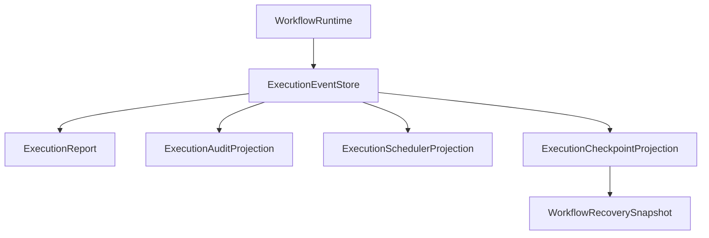

# AHFL 保障与生产证据指南

本文说明如何使用 AHFL 的 assurance profile、formal verification、structured execution events 和 recovery evidence，把 Agent 工作流从“能编译”推进到“可审计、可恢复、可进入生产评审”。

规范性规则以 [assurance.zh.md](../spec/assurance.zh.md) 为准。运行期事件、projection 与 recovery contract 见 [native-runtime-artifacts.zh.md](./native-runtime-artifacts.zh.md)。

## 保障边界

AHFL 的保障体系证明和检查的是控制平面事实：

1. Capability 是否声明了 effect profile。
2. Durable / financial effect 是否声明了幂等键和回执要求。
3. Financial effect 是否声明了审批策略和补偿路径。
4. Flow 是否会调用带风险的 capability。
5. Workflow DAG 生命周期、终态、依赖和 temporal clause 是否能进入有限控制模型。
6. Runtime event log 是否满足 terminal invariant，并能生成一致的 report、audit、checkpoint 和 recovery evidence。

AHFL 不声称完整证明外部系统状态、Provider 内部实现、无限数据域、真实支付网关或 LLM 输出语义。

## Assurance effect profile

高风险 capability 应声明 effect block：

```ahfl
capability ChargeCard(request: Payment) -> Receipt {
    effect: financial_write;
    domain: payments;
    idempotency: request.idempotency_key;
    receipt: required;
    retry: safe_if_idempotent;
    timeout: 30s;
    compensation: RefundCard;
    policy: [payments::approval_required, payments::audit_event];
}
```

字段含义：

| 字段 | 用途 |
|------|------|
| `effect` | 外部影响类别：`read`、`external_side_effect`、`durable_write`、`financial_write`、`unknown` |
| `domain` | 业务域标签 |
| `idempotency` | 幂等键路径 |
| `receipt` | 回执要求：`none`、`optional`、`required` |
| `retry` | 重试安全性：`unsafe`、`safe_if_idempotent`、`safe` |
| `timeout` | capability 超时事实 |
| `compensation` | 补偿 capability |
| `policy` | 审批、审计等策略标签 |

未声明 effect block 的 capability 仍可编译，但不能通过 production assurance gate。

## Assurance validation

生成 assurance bundle：

```bash
./build/dev/src/tooling/cli/ahflc emit assurance-json \
  tests/golden/assurance/ok_effects.ahfl
```

运行 production gate：

```bash
./build/dev/src/tooling/cli/ahflc validate \
  tests/golden/assurance/ok_effects.ahfl
```

成功输出：

```text
ok: assurance validation ready
```

常见 blocker：

| Blocker | 含义 |
|---------|------|
| `missing_effect_spec` | capability 没有 effect block |
| `unknown_effect_kind` | effect 是 `unknown` |
| `missing_idempotency_key` | durable / financial write 缺少幂等键 |
| `missing_required_receipt` | durable / financial write 没有 required receipt |
| `missing_financial_approval_policy` | financial write 缺少 approval policy |
| `missing_financial_compensation` | financial write 缺少 compensation |
| `retry_safe_if_idempotent_without_key` | `safe_if_idempotent` 没有 idempotency key |

## Formal verification

生成 SMV 模型：

```bash
./build/dev/src/tooling/cli/ahflc emit smv \
  examples/refund/audit.ahfl
```

调用 NuSMV / nuXmv：

```bash
./build/dev/src/tooling/cli/ahflc verify \
  --formal-backend nuxmv \
  --model-checker /path/to/nuXmv \
  --checker-timeout-seconds 60 \
  --formal-model-out /tmp/refund_audit.smv \
  examples/refund/audit.ahfl
```

`--formal-backend` 当前支持 `nuxmv`、`nusmv`、`spin`、`tlaplus` 四个 capability matrix 条目；只有 `nuxmv` / `nusmv` 进入 AHFL SMV 外部验证路径。`spin` / `tlaplus` 当前只承诺模型 emission，`verify` 会以 `checker_status: verification_unsupported` 失败。`--checker-timeout-seconds` 控制外部 checker 进程上限；超时会以 `checker_status: checker_error` 和 `checker_timed_out: true` 失败，便于 CI 区分卡死与普通反例。

NuSMV / nuXmv checker 查找顺序：

1. `--model-checker <path>`。
2. `AHFL_SMV_CHECKER` 环境变量。
3. backend-specific 环境变量，例如 `AHFL_NUXMV_PATH` 或 `AHFL_NUSMV_PATH`。
4. `PATH` 中的 `NuSMV`、`nuXmv`、`nuxmv` 或 `nusmv`。

CI 可以用稳定 `checker_status` 区分失败类型：`missing_binary` 表示没有 checker 二进制；`verification_unsupported` 表示 backend 不支持 AHFL property 外部验证；`checker_error` 表示 checker 进程或输出解析失败。

`verify` report 还会输出状态空间估计字段：`state_space_estimate`、`state_space_agents`、`state_space_transitions`、`state_space_likely_tractable`。这些字段来自 IR agent 的 states/transitions/capabilities，用于在调用 checker 前提示状态空间规模；它不是 NuSMV/nuXmv 返回的 reachable-state 精确统计。

NuSMV/nuXmv 输出解析覆盖四类稳定 fixture：全部 true、false/counterexample、parse/type error 和 timeout。timeout 会作为确定 checker failure 处理，不会被当成“没有 specification result”的普通未知输出。

Formal backend 适合证明：

| 可证明 / 可检查 | 说明 |
|-----------------|------|
| Agent 状态空间 | 状态、初始状态、终态、转移 |
| Workflow lifecycle | idle、running、completed、failed、recovering 等有限生命周期 |
| DAG 依赖 | node running / completed 前依赖必须 completed |
| Contract temporal clause | `always`、`eventually`、`called`、`running`、`completed` 等控制谓词 |
| Capability call event | flow handler 中的 capability 调用被绑定成 call event |
| Effect obligation | 部分 effect / recovery obligation 进入有限模型 |

不应把 formal verification 当成对外部服务、无限数据域或 Provider 真实实现的完整证明。

## Execution Audit 与 Recovery Evidence

真实运行通过 `ExecutionEventStore` 建立唯一动态事实源：



证据必须满足：

1. 每个 run、workflow、node、capability start 都有唯一 terminal event。
2. audit 只统计 canonical events，不解析 human output。
3. checkpoint 只引用 completed node 的 numeric IDs 和 value IDs。
4. recovery snapshot 通过 atomic replace 保存，partial write fail closed。
5. resume 产生 `RunResumed` / `NodeRestored`，已恢复节点不重复副作用。
6. 持久化内容不包含 API key、token 或 secret manager response。

Reference workflow 的恢复证据由
`tests/scripts/reference_workflow_recovery_smoke.py` 产生，覆盖本地 HTTP provider、
`SIGKILL`、人工批准、部分临时文件与副作用去重。

## 受控试点门禁

当前没有独立的 provider readiness artifact catalog。受控生产试点应组合以下真实证据：

| Evidence | 通过标准 |
|----------|----------|
| JSONL event stream | event ID 与 monotonic offset 有序，terminal invariant 成立 |
| Audit projection | retry、fallback、failure、skip、checkpoint 计数与事件一致 |
| Recovery smoke | crash/restart 后已完成副作用不重复 |
| Network matrix | disconnect、429、timeout、malformed/partial response 均 fail closed |
| Budget evidence | token/cost/latency rejection 进入 capability/node/workflow terminal path |
| Soak | CI 至少 30 秒且不少于 12 次完整 reference workflow；nightly 可提高同一门槛 |
| Observability adapter | `ExecutionEventStore` 导出 OTLP-compatible run/workflow/node/capability spans，不建立第二事实源 |

正式 controlled-pilot 入口是 CTest label `ahfl-controlled-pilot` 和
`config/controlled-pilot-gate.json`。label 当前包含 contract/smoke、provider budget
runtime、recovery、schema rejection、OTel 和 production matrix 共 8 项；matrix 在同一个
reference workflow 上覆盖 bounded soak、disconnect、HTTP 429、timeout、partial
response 和 process crash。最终 ready checker 还要求 evidence revision 与当前 checkout
一致。该 gate 证明的是 bounded CI pilot，不代表小时级 soak、RSS/allocator 趋势或真实
部署环境生产信心。

## 发布前检查清单

| 检查 | 命令 | 通过标准 |
|------|------|----------|
| 语法和类型 | `ahflc check` | 返回 0 |
| Package review | `ahflc emit package-review` | entry、exports、binding 正确 |
| Execution plan | `ahflc emit execution-plan` | DAG、node、依赖符合预期 |
| Dry run | `ahflc emit dry-run-trace` | status 和执行顺序符合预期 |
| Runtime | `ahflc run --output-format jsonl` | event stream 有唯一 run/workflow/node/capability 终态 |
| Assurance | `ahflc validate` | 输出 `ok: assurance validation ready` |
| Formal | `ahflc verify` | checker 证明所有相关 specification |
| Recovery | reference workflow recovery smoke | restart、approval、partial-write、dedupe 全部通过 |

## 读输出时的原则

1. `emit` artifact 和 beta evidence 都不自动等同于生产完成；必须验证真实行为路径。
2. 文本 review 适合人读，JSON artifact 适合 CI、归档和下游系统消费。
3. 对运行证据，优先检查 numeric identity、terminal invariant、secret-free persistence 和 recovery dedupe。
4. 对 failed / interrupted run，从 JSONL events 和 audit/replay projection 定位失败边界，不解析 human 日志。
