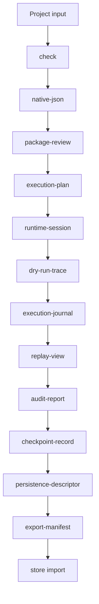

# AHFL 执行与包指南

本文说明 AHFL 如何从源码进入 package authoring、execution plan、mock dry run、runtime artifact 和真实 LLM execution。命令语法以 [CLI 工作流](./user-guide-cli.zh.md) 为准。

## 执行链路



这条链路的核心思想是：下游 artifact 消费上游 machine artifact，不回头扫描源码或解析 CLI 文本输出。

## Project descriptor

`ahfl.project.json` 描述编译入口和搜索根：

```json
{
  "format_version": "ahfl.project.v0.3",
  "name": "workflow-value-flow",
  "search_roots": ["."],
  "entry_sources": ["app/main.ahfl"]
}
```

检查项目：

```bash
./build/dev/src/tooling/cli/ahflc check \
  --project tests/integration/workflow_value_flow/ahfl.project.json
```

查看 source graph：

```bash
./build/dev/src/tooling/cli/ahflc dump project \
  --project tests/integration/workflow_value_flow/ahfl.project.json
```

## Package authoring descriptor

`ahfl.package.json` 描述包身份、入口、导出目标和 capability binding：

```json
{
  "format_version": "ahfl.package-authoring.v0.5",
  "package": {
    "name": "workflow-value-flow",
    "version": "0.2.0"
  },
  "entry": {
    "kind": "workflow",
    "name": "app::main::ValueFlowWorkflow"
  },
  "exports": [
    {
      "kind": "workflow",
      "name": "app::main::ValueFlowWorkflow"
    },
    {
      "kind": "agent",
      "name": "lib::agents::AliasAgent"
    }
  ],
  "capability_bindings": [
    {
      "capability": "lib::agents::Echo",
      "binding_key": "runtime.echo"
    }
  ]
}
```

检查 package reader 和 execution planner：

```bash
./build/dev/src/tooling/cli/ahflc emit package-review \
  --project tests/integration/workflow_value_flow/ahfl.project.json \
  --package tests/integration/workflow_value_flow/ahfl.package.json
```

Package authoring 的常见错误：

| 错误 | 含义 |
|------|------|
| unknown entry target | `entry.name` 没有解析到 workflow 或 agent |
| wrong executable kind | `kind` 与实际目标类型不一致 |
| unknown capability | `capability_bindings` 引用了不存在的 capability |
| duplicate binding | 同一 capability 绑定重复或冲突 |
| invalid format version | descriptor 版本不是当前 parser 支持的格式 |

## Execution plan

`execution-plan` 是 runtime、dry run、journal、replay、audit 等工件的核心输入：

```bash
./build/dev/src/tooling/cli/ahflc emit execution-plan \
  --project tests/integration/workflow_value_flow/ahfl.project.json \
  --package tests/integration/workflow_value_flow/ahfl.package.json
```

你应该在 execution plan 中检查：

1. 目标 workflow 是否正确。
2. entry node 是否符合预期。
3. `after` 依赖是否形成正确 DAG。
4. 每个 node 的目标 agent、初始状态、终态和输入读取是否正确。
5. capability binding 是否落到正确 node。

## Mock capability dry run

Dry run 用 mock capability 结果演练 workflow，不调用真实外部系统。

Mock 文件示例：

```json
{
  "format_version": "ahfl.capability-mocks.v0.6",
  "mocks": [
    {
      "capability_name": "lib::agents::Echo",
      "result_fixture": "fixture.echo.ok",
      "invocation_label": "echo-runtime"
    }
  ]
}
```

执行 dry run：

```bash
./build/dev/src/tooling/cli/ahflc emit dry-run-trace \
  --project tests/integration/workflow_value_flow/ahfl.project.json \
  --package tests/integration/workflow_value_flow/ahfl.package.json \
  --capability-mocks tests/golden/dry_run/project_workflow_value_flow.mocks.json \
  --input-fixture fixture.request.ok \
  --run-id docs-guide-run
```

Dry-run trace 应重点看：

| 字段 | 说明 |
|------|------|
| `status` | workflow 是否 completed、failed 或 partial |
| `execution_order` | DAG 节点执行顺序 |
| `node_traces` | 每个 node 的目标 Agent、依赖、输入读取和 mock 结果 |
| `capability_bindings` | capability 是否绑定到预期 runtime key |
| `return_summary` | workflow 返回值来自哪里 |

## Runtime artifact

以下 artifact 服务执行审计、回放和持久化：

| Artifact | 何时使用 |
|----------|----------|
| `runtime-session` | 需要固定 session identity 和 runtime metadata |
| `execution-journal` | 需要查看执行历史、节点事件和 capability 结果 |
| `replay-view` | 需要给审查者看可回放视图 |
| `scheduler-snapshot` | 需要检查 DAG 调度状态 |
| `scheduler-review` | 需要人类可读调度审查 |
| `audit-report` | 需要发布或合规审计摘要 |
| `checkpoint-record` | 需要恢复、resume 或终态检查点 |
| `persistence-descriptor` | 需要描述持久化边界 |
| `export-manifest` | 需要导出可移交包 |

这些 artifact 的命令形态一致：

```bash
./build/dev/src/tooling/cli/ahflc emit audit-report \
  --project tests/integration/workflow_value_flow/ahfl.project.json \
  --package tests/integration/workflow_value_flow/ahfl.package.json \
  --capability-mocks tests/golden/dry_run/project_workflow_value_flow.mocks.json \
  --input-fixture fixture.request.ok \
  --run-id docs-guide-run
```

将 `audit-report` 换成上表任一 artifact 即可生成对应输出。

## 真实 LLM 执行

`ahflc run` 使用 OpenAI-compatible LLM Provider 执行 workflow。它需要：

1. 已通过 `check` 的源码或 project。
2. `--workflow <canonical-name>`。
3. `--input '<json>'`。
4. LLM 配置文件，默认 `~/.ahfl/llm_config.json`，也可用 `--llm-config <path>` 指定。
5. 可选的 `--capability-mocks <path>`，用于把 deterministic capability mock 暴露为 LLM function tools。
6. 可选的 `--tool-catalog <path>`，用于把 deterministic runtime tool catalog 暴露为 LLM function tools。
7. 可选的 `--capability-bindings <path>`，用于把 workflow capability 调用直接绑定到 HTTP 或 gRPC JSON transcoding runtime transport。
8. 可选的 `--llm-observability <path>`，用于写出 secret-free LLM Provider 观测 JSON。

`--input` 必须是 AHFL runtime JSON，并且必须匹配目标 workflow 的 input schema。Struct 输入需要 `_type`，enum 字段需要 `_enum` 和 `_variant`。`run` 会在调用 LLM provider 前拒绝缺字段、额外字段、字段类型错误、struct/enum 名称不匹配和未知 enum variant。

配置文件字段：

```json
{
  "endpoint": "https://api.example.com/v1",
  "model": "example-model",
  "api_key_secret": "AHFL_LLM_API_KEY",
  "auth_scheme": "bearer",
  "auth_header": "Authorization",
  "temperature": 0.1,
  "max_tokens": 1024,
  "max_prompt_tokens": 3072,
  "max_total_tokens": 4096,
  "prompt_token_cost_per_million": 0.25,
  "completion_token_cost_per_million": 1.25,
  "max_total_cost_usd": 0.01,
  "max_workflow_total_tokens": 12000,
  "max_node_total_tokens": 8000,
  "max_workflow_total_cost_usd": 0.05,
  "max_node_total_cost_usd": 0.02,
  "token_budget_policy": "fail",
  "capability_token_budgets": [
    {
      "capability": "support::ClassifyTicket",
      "max_tokens": 512,
      "max_prompt_tokens": 2048,
      "max_total_tokens": 3072,
      "max_total_cost_usd": 0.005,
      "policy": "warn"
    }
  ],
  "json_mode": true,
  "stream": false,
  "timeout_seconds": 30,
  "max_retries": 2,
  "response_cache_enabled": false,
  "response_cache_max_entries": 128,
  "response_cache_ttl_seconds": 300,
  "response_cache_path": ".ahfl/cache/llm-response-cache.json",
  "refresh_secrets_before_use": false,
  "secret_providers": [
    {
      "kind": "env",
      "prefix": "env",
      "default_for_unqualified": true
    },
    {
      "kind": "vault",
      "prefix": "vault",
      "address": "https://vault.example.com",
      "token_env": "AHFL_VAULT_TOKEN",
      "mount_path": "kv",
      "timeout_seconds": 5
    },
    {
      "kind": "cloud",
      "prefix": "cloud",
      "address": "https://secrets.example.com",
      "token_env": "AHFL_CLOUD_SECRET_TOKEN",
      "project": "agent-prod",
      "version": "latest",
      "timeout_seconds": 5
    }
  ],
  "tool_choice": "auto",
  "max_tool_rounds": 5,
  "fallback_providers": [
    {
      "name": "backup",
      "endpoint": "https://backup.example.com/v1",
      "model": "backup-model",
      "api_key_secret": "AHFL_BACKUP_LLM_API_KEY",
      "auth_scheme": "api_key_header",
      "auth_header": "x-api-key",
      "priority": 10
    }
  ]
}
```

`endpoint`、`model` 必填。认证信息推荐使用 `api_key_secret`；裸 handle（例如 `AHFL_LLM_API_KEY`）保持兼容并按 env provider 解析，也可以显式写成 `env:AHFL_LLM_API_KEY`、`vault:llm/api-key` 或 `cloud:llm/api-key`。`secret_providers` 定义 provider 链：`env` provider 可作为 unqualified handle 默认解析器，`vault` provider 使用 `token` 或 `token_env` 认证并按 KV v2 路径读取；`cloud` provider 使用 `Authorization: Bearer <token>` 访问 HTTP-backed Secret Manager endpoint，在设置 `project` 时读取 `/v1/projects/{project}/secrets/{key}/versions/{version}:access`，未设置时读取 `/v1/secrets/{key}`。Secret 缺失、Vault token 缺失、cloud token 缺失、404、认证失败、超时或 provider prefix 未配置都会拒绝执行，并且不会继续调用 LLM endpoint。`refresh_secrets_before_use: true` 会在解析 `api_key_secret`、`oauth2_token_secret` 和 mTLS secret handle 前请求对应 provider refresh，并把 refresh/resolve lifecycle 事件写入 secret-free 观测摘要。`api_key` 仍作为兼容字段可用，但不推荐把明文 key 写入配置文件。字符串中的 `${ENV_VAR}` 会按环境变量展开。`auth_scheme` 当前支持 `bearer` 和 `api_key_header`：`bearer` 默认生成 `Authorization: Bearer <key>`，`api_key_header` 使用 `auth_header` 作为 header name 并直接写入 key。fallback provider 可单独设置 `auth_scheme` / `auth_header`；未设置时继承主 provider 配置。

预算字段会在 `run` 启动时校验：`max_tokens` 是单次响应 token 上限，`max_prompt_tokens` 是单次 prompt 上限，`max_total_tokens` 必须覆盖单次 prompt 与响应预算。`capability_token_budgets` 可按 capability 名覆盖这三个 token 上限、`max_total_cost_usd` 和 `policy`；未覆盖字段继承全局配置。Provider 发起请求前会按有效预算裁剪 user prompt；如果 system prompt 单独耗尽预算，则 capability 调用失败并产生 `runtime.LLM_PROMPT_BUDGET_REJECTED` 诊断。`max_workflow_total_tokens` / `max_workflow_total_cost_usd` 定义单次 `ahflc run` 中同一 workflow 的累计 token/cost 上限；`max_node_total_tokens` / `max_node_total_cost_usd` 定义同一 workflow node 的累计上限；值为 `0` 表示关闭对应累计预算。Runtime 会把 workflow 名、node 名、agent 名、state 名和 node execution index 传入 LLM provider，使累计扣减按 workflow 和 node 分账。

Provider 会记录 secret-free token budget 事件，覆盖 `prompt_accepted`、`prompt_truncated`、`prompt_rejected`、`usage_within_budget`、`usage_exceeded_budget`、`cost_within_budget`、`cost_exceeded_budget`、`workflow_usage_within_budget` / `workflow_usage_exceeded_budget`、`node_usage_within_budget` / `node_usage_exceeded_budget`、`workflow_cost_within_budget` / `workflow_cost_exceeded_budget` 和 `node_cost_within_budget` / `node_cost_exceeded_budget`，并包含预算上限、累计 workflow/node token/cost、估算 prompt tokens、实际 usage tokens、成本上限、估算成本、截断状态、workflow/node/agent/state 上下文、`policy` 和可选 `diagnostic_code`。当 OpenAI-compatible 响应报告的 `usage.total_tokens` 超过有效 `max_total_tokens`、估算 `total_cost_usd` 超过有效 `max_total_cost_usd`，或累计 workflow/node token/cost 超过对应上限时，`token_budget_policy: "fail"` 会让 `ahflc run` 在写出 workflow result 和 observability artifact 后 fail closed；`token_budget_policy: "warn"` 只输出 warning 诊断，不改变 workflow 成功状态。`prompt_token_cost_per_million` 和 `completion_token_cost_per_million` 是可选成本估算费率，必须为非负数；当响应包含 `usage.prompt_tokens`、`usage.completion_tokens` 或 `usage.total_tokens` 时，provider 会记录 secret-free token usage 事件，并按配置费率估算 `*_cost_usd`。

`fallback_providers` 可配置 OpenAI-compatible 备用 provider。主 provider 在 HTTP 失败并耗尽自身重试后，runtime 会按 fallback `priority` 从高到低继续尝试。Provider 会记录 secret-free fallback health 事件，覆盖 provider degraded、fallback selected 和 fallback exhausted；`ahflc run` 会在最终 workflow result 后输出 secret-free 文本摘要，也可通过 `--llm-observability <path>` 写入机器可读 JSON。JSON artifact 额外包含 `provider_degradation_summary`，用于机器读取 fallback degradation 策略：`outcome` 区分 `fallback_selected` 与 `fallback_exhausted`，`status` 区分 recovered/exhausted/degraded，`degraded_providers`、`selected_provider`、`total_attempts` 和 `fallback_exhausted` 给出多 provider 成功/失败矩阵摘要。fallback provider 同样支持 `api_key_secret`，缺失或为空会在 `run` 启动阶段失败。

`--llm-observability` JSON 当前包含 cache、provider health、provider degradation summary、streaming chunk、token usage、token budget 和 secret lifecycle。secret lifecycle 事件只记录 refresh/resolve kind、provider prefix、secret handle fingerprint、accessor、success 和 `secret_free` 标记，不写入 secret handle 原文、object path 或 secret value。token usage 事件只记录 provider 名、model、workflow/node/agent/state 上下文、prompt/completion/total token 数、可选估算成本和 `secret_free` 标记；token budget 事件只记录预算上限、累计 workflow/node token/cost、估算 token 数、usage token 数、成本上限、估算成本、policy、事件 kind、message、workflow/node/agent/state 上下文和 diagnostic code，不写入 prompt、response 正文或 secret value。若 provider 响应没有标准 `usage` 字段，则不会生成 token usage 事件，但仍会生成 prompt budget 评估事件。

`stream: true` 会请求 OpenAI-compatible streaming response，并把 SSE `data:` chunks 合成为最终 response content 后再进入 AHFL return type 解析。stream 必须以 `data: [DONE]` 完成；HTTP 成功但 SSE 未完成会作为中断响应失败，不会把部分 content 当成成功结果继续解析。Provider 会记录 secret-free streaming chunk 事件，覆盖 chunk index、chunk bytes、累计 content bytes、completed 和 interrupted；`ahflc run` 仍只输出最终 workflow result，不输出逐 chunk 内容原文，但会输出 secret-free chunk 事件摘要。`--llm-observability <path>` 会把相同事件写入 `ahfl.llm_provider_observability.v0` JSON；更完整 streaming 失败矩阵仍属于后续产品化工作。

`response_cache_enabled: true` 会启用 LRU response cache。cache key 由 key version、模型名、system prompt 和 user prompt 派生，但只落盘 `key_fingerprint`，不会把 prompt 或 secret value 写入 cache key；`response_cache_max_entries` 控制容量，`response_cache_ttl_seconds` 控制 TTL。cache 只作用于非 tool-calling 路径，并且只在 LLM response 成功解析为 AHFL return type 后写入；命中时不会再次发起 HTTP。设置 `response_cache_path` 后，provider 会用 `ahfl.llm_response_cache.v0` snapshot 在进程间持久化非过期 entry，并用 `key_version` 作为跨版本迁移边界；未设置时只使用进程内缓存。snapshot 会保存已解析的 LLM response content，因此该文件不应放入源码仓库，也应按运行产物权限管理。Provider 会记录 secret-free cache audit 事件，覆盖 miss、write、hit、invalidated、snapshot loaded/persisted/load failed/persist failed、cache key version、key fingerprint、prompt/response byte size、cache size、`persistent` 和 `snapshot_entry_count`；`ahflc run` 会输出 secret-free 文本摘要，`--llm-observability <path>` 会写出机器可读 JSON。

`--capability-mocks` 使用与 mock dry run 相同的 `ahfl.capability-mocks.v0.6` 文件。`run` 会把每个 mock selector 暴露为 OpenAI-compatible function tool：tool 名称以 `ahfl_` 开头，selector 中非字母、数字、`_`、`-` 的字符会替换为 `_`，超长名称会附加稳定 hash 后截断。LLM 发起 tool call 后，runtime 通过独立 `CapabilityRegistry` 返回 mock 的 `result_fixture`；这适合 deterministic 本地联调。mock-backed CLI 路径已对 invalid args 和 unknown tool fail closed。

`--tool-catalog` 使用 `ahfl.llm_tool_catalog.v0` 文件，把 deterministic runtime tool catalog 暴露为 OpenAI-compatible function tools。每个 tool 需要 `name`、可选 `description`、可选 `parameters` 或 `params_schema_json` JSON object，并且必须在 `result` AHFL value JSON 与 `failure` object 中二选一。`failure.kind` 支持 `error` 和 `timeout`；`error` 需要 `message`，`timeout` 需要正整数 `timeout_ms` 并可选 `message`。LLM 发起 tool call 后，runtime 解析 arguments JSON、调用 catalog tool，并把 `result` 作为 tool message 返回 provider；catalog schema negative、catalog-specific invalid args/unknown tool、tool timeout 和 tool failure 都会 fail closed。

`--capability-bindings` 使用 `ahfl.runtime_capability_bindings.v0` 文件，把指定 capability 直接注册到 runtime `CapabilityRegistry`。已注册 capability 优先走 binding；未注册 capability 仍按现有 LLM provider 路径执行。HTTP binding 需要 `url`，可选 `method`、`headers`、`timeout_ms`、`retry`、`circuit_breaker` 和 `auth`；gRPC JSON transcoding binding 使用 `transport: "grpc_json_transcoding"`，需要 `endpoint`、`service` 和 `method`。`auth.scheme` 支持 `none`、`bearer`、`oauth2_client_credentials` 和 `mtls`，secret key 会复用 `--llm-config` 中配置的 secret provider 链解析。binding 响应必须是 AHFL value JSON，并会按 capability 返回类型做 schema 校验；HTTP/gRPC timeout、retry exhaustion、schema mismatch 和 malformed JSON 会通过 workflow runtime 诊断 fail closed。

最小 catalog 示例：

```json
{
  "schema": "ahfl.llm_tool_catalog.v0",
  "tools": [
    {
      "name": "lookup_context",
      "description": "Return deterministic context",
      "parameters": {
        "type": "object",
        "additionalProperties": true
      },
      "result": {
        "value": "catalog-context"
      }
    }
  ]
}
```

运行示例：

```bash
./build/dev/src/tooling/cli/ahflc run \
  --workflow app::main::ValueFlowWorkflow \
  --input '{"_type":"lib::types::Request","value":"hello"}' \
  --llm-config ~/.ahfl/llm_config.json \
  --llm-observability /tmp/ahfl-llm-observability.json \
  --tool-catalog ./tool-catalog.json \
  --capability-bindings ./runtime-bindings.json \
  --capability-mocks tests/golden/dry_run/project_workflow_value_flow.mocks.json \
  --project tests/integration/workflow_value_flow/ahfl.project.json
```

`run` 会在以下场景拒绝执行：

| 场景 | 结果 |
|------|------|
| 未传 `--workflow` | 参数错误 |
| 未传 `--input` | 参数错误 |
| 配置文件不存在 | 执行失败 |
| `endpoint` / `model` 缺失 | 执行失败 |
| `max_prompt_tokens + max_tokens > max_total_tokens` | 执行失败 |
| token cost 费率或累计 token/cost 预算为负数 | 执行失败 |
| `token_budget_policy` 不是 `fail` / `warn` | 执行失败 |
| `capability_token_budgets` 中 capability 为空、重复、预算非法或 policy 非法 | 执行失败 |
| `api_key_secret` 指向的 secret handle 缺失、provider prefix 未配置或解析为空 | 执行失败 |
| Vault secret provider 未提供 `token` 或 `token_env` | 执行失败 |
| fallback provider 的 `api_key_secret` 缺失或为空 | 执行失败 |
| 未提供 `api_key_secret` 或 `api_key` | 执行失败 |
| `auth_scheme` 不是 `bearer` 或 `api_key_header` | 执行失败 |
| `api_key_header` 认证未提供 `auth_header` | 执行失败 |
| streaming response 缺少 `data: [DONE]` | 执行失败 |
| `response_cache_enabled` 为 true 但 cache 容量或 TTL 非正数 | 执行失败 |
| 设置了 `response_cache_path` 但 `response_cache_enabled` 不是 true | 执行失败 |
| `--capability-mocks` 文件不存在或格式非法 | 执行失败 |
| capability mock selector 映射到重复 tool 名称 | 执行失败 |
| `--tool-catalog` 文件不存在、schema 不支持或 tool 定义非法 | 执行失败 |
| `--tool-catalog` 与 `--capability-mocks` 产生重复 tool 名称 | 执行失败 |
| `--capability-bindings` 文件不存在、schema 不支持、capability 未声明或 transport 配置非法 | 执行失败 |
| `--capability-bindings` 指向的 HTTP/gRPC runtime 调用失败或响应不匹配 capability 返回类型 | 执行失败 |
| `--input` 不是合法 JSON | 执行失败 |
| `--input` 与 workflow input schema 不匹配 | 执行失败 |
| workflow 运行失败或产生 runtime error | 非零退出 |

## 推荐落地顺序

1. 单文件 `check` 和 `emit summary`。
2. 拆成 project，并用 `dump project` 确认 source graph。
3. 添加 package authoring，用 `emit package-review` 确认入口和导出。
4. 生成 `execution-plan`，确认 DAG。
5. 用 mock 数据跑 `dry-run-trace`。
6. 生成 journal、replay、audit、checkpoint、persistence、export。
7. 进入 [保障与生产证据指南](./user-guide-assurance.zh.md) 的 assurance、formal、store 和 provider 门禁。
8. 配置 LLM Provider 后再执行 `ahflc run`。
