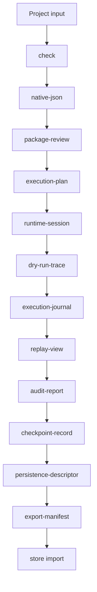

# AHFL 执行与包指南

本文说明 AHFL 如何从源码进入 package authoring、execution plan、mock dry run、runtime artifact 和真实 LLM execution。命令语法以 [CLI 工作流](./user-guide-cli.zh.md) 为准。

## 执行链路



这条链路的核心思想是：下游 artifact 消费上游 machine artifact，不回头扫描源码或解析 CLI 文本输出。

## Project descriptor

`ahfl.project.json` 描述编译入口和搜索根：

```json
{
  "format_version": "ahfl.project.v0.3",
  "name": "workflow-value-flow",
  "search_roots": ["."],
  "entry_sources": ["app/main.ahfl"]
}
```

检查项目：

```bash
./build/dev/src/tooling/cli/ahflc check \
  --project tests/integration/workflow_value_flow/ahfl.project.json
```

查看 source graph：

```bash
./build/dev/src/tooling/cli/ahflc dump project \
  --project tests/integration/workflow_value_flow/ahfl.project.json
```

## Package authoring descriptor

`ahfl.package.json` 描述包身份、入口、导出目标和 capability binding：

```json
{
  "format_version": "ahfl.package-authoring.v0.5",
  "package": {
    "name": "workflow-value-flow",
    "version": "0.2.0"
  },
  "entry": {
    "kind": "workflow",
    "name": "app::main::ValueFlowWorkflow"
  },
  "exports": [
    {
      "kind": "workflow",
      "name": "app::main::ValueFlowWorkflow"
    },
    {
      "kind": "agent",
      "name": "lib::agents::AliasAgent"
    }
  ],
  "capability_bindings": [
    {
      "capability": "lib::agents::Echo",
      "binding_key": "runtime.echo"
    }
  ]
}
```

检查 package reader 和 execution planner：

```bash
./build/dev/src/tooling/cli/ahflc emit package-review \
  --project tests/integration/workflow_value_flow/ahfl.project.json \
  --package tests/integration/workflow_value_flow/ahfl.package.json
```

Package authoring 的常见错误：

| 错误 | 含义 |
|------|------|
| unknown entry target | `entry.name` 没有解析到 workflow 或 agent |
| wrong executable kind | `kind` 与实际目标类型不一致 |
| unknown capability | `capability_bindings` 引用了不存在的 capability |
| duplicate binding | 同一 capability 绑定重复或冲突 |
| invalid format version | descriptor 版本不是当前 parser 支持的格式 |

## Execution plan

`execution-plan` 是 runtime、dry run、journal、replay、audit 等工件的核心输入：

```bash
./build/dev/src/tooling/cli/ahflc emit execution-plan \
  --project tests/integration/workflow_value_flow/ahfl.project.json \
  --package tests/integration/workflow_value_flow/ahfl.package.json
```

你应该在 execution plan 中检查：

1. 目标 workflow 是否正确。
2. entry node 是否符合预期。
3. `after` 依赖是否形成正确 DAG。
4. 每个 node 的目标 agent、初始状态、终态和输入读取是否正确。
5. capability binding 是否落到正确 node。

## Mock capability dry run

Dry run 用 mock capability 结果演练 workflow，不调用真实外部系统。

Mock 文件示例：

```json
{
  "format_version": "ahfl.capability-mocks.v0.6",
  "mocks": [
    {
      "capability_name": "lib::agents::Echo",
      "result_fixture": "fixture.echo.ok",
      "invocation_label": "echo-runtime"
    }
  ]
}
```

执行 dry run：

```bash
./build/dev/src/tooling/cli/ahflc emit dry-run-trace \
  --project tests/integration/workflow_value_flow/ahfl.project.json \
  --package tests/integration/workflow_value_flow/ahfl.package.json \
  --capability-mocks tests/golden/dry_run/project_workflow_value_flow.mocks.json \
  --input-fixture fixture.request.ok \
  --run-id docs-guide-run
```

Dry-run trace 应重点看：

| 字段 | 说明 |
|------|------|
| `status` | workflow 是否 completed、failed 或 partial |
| `execution_order` | DAG 节点执行顺序 |
| `node_traces` | 每个 node 的目标 Agent、依赖、输入读取和 mock 结果 |
| `capability_bindings` | capability 是否绑定到预期 runtime key |
| `return_summary` | workflow 返回值来自哪里 |

## Runtime artifact

以下 artifact 服务执行审计、回放和持久化：

| Artifact | 何时使用 |
|----------|----------|
| `runtime-session` | 需要固定 session identity 和 runtime metadata |
| `execution-journal` | 需要查看执行历史、节点事件和 capability 结果 |
| `replay-view` | 需要给审查者看可回放视图 |
| `scheduler-snapshot` | 需要检查 DAG 调度状态 |
| `scheduler-review` | 需要人类可读调度审查 |
| `audit-report` | 需要发布或合规审计摘要 |
| `checkpoint-record` | 需要恢复、resume 或终态检查点 |
| `persistence-descriptor` | 需要描述持久化边界 |
| `export-manifest` | 需要导出可移交包 |

这些 artifact 的命令形态一致：

```bash
./build/dev/src/tooling/cli/ahflc emit audit-report \
  --project tests/integration/workflow_value_flow/ahfl.project.json \
  --package tests/integration/workflow_value_flow/ahfl.package.json \
  --capability-mocks tests/golden/dry_run/project_workflow_value_flow.mocks.json \
  --input-fixture fixture.request.ok \
  --run-id docs-guide-run
```

将 `audit-report` 换成上表任一 artifact 即可生成对应输出。

## 真实 LLM 执行

`ahflc run` 使用 OpenAI-compatible LLM Provider 执行 workflow。它需要：

1. 已通过 `check` 的源码或 project。
2. `--workflow <canonical-name>`。
3. `--input '<json>'`。
4. LLM 配置文件，默认 `~/.ahfl/llm_config.json`，也可用 `--llm-config <path>` 指定。

配置文件字段：

```json
{
  "endpoint": "https://api.example.com/v1",
  "model": "example-model",
  "api_key": "${AHFL_LLM_API_KEY}",
  "temperature": 0.1,
  "max_tokens": 1024,
  "json_mode": true,
  "timeout_seconds": 30,
  "max_retries": 2
}
```

`endpoint`、`model`、`api_key` 必填。字符串中的 `${ENV_VAR}` 会按环境变量展开。

运行示例：

```bash
./build/dev/src/tooling/cli/ahflc run \
  --workflow app::main::ValueFlowWorkflow \
  --input '{"_type":"lib::types::Request","value":"hello"}' \
  --llm-config ~/.ahfl/llm_config.json \
  --project tests/integration/workflow_value_flow/ahfl.project.json
```

`run` 会在以下场景拒绝执行：

| 场景 | 结果 |
|------|------|
| 未传 `--workflow` | 参数错误 |
| 未传 `--input` | 参数错误 |
| 配置文件不存在 | 执行失败 |
| `endpoint` / `model` / `api_key` 缺失 | 执行失败 |
| `--input` 不是合法 JSON | 执行失败 |
| workflow 运行失败或产生 runtime error | 非零退出 |

## 推荐落地顺序

1. 单文件 `check` 和 `emit summary`。
2. 拆成 project，并用 `dump project` 确认 source graph。
3. 添加 package authoring，用 `emit package-review` 确认入口和导出。
4. 生成 `execution-plan`，确认 DAG。
5. 用 mock 数据跑 `dry-run-trace`。
6. 生成 journal、replay、audit、checkpoint、persistence、export。
7. 进入 [保障与生产证据指南](./user-guide-assurance.zh.md) 的 assurance、formal、store 和 provider 门禁。
8. 配置 LLM Provider 后再执行 `ahflc run`。
