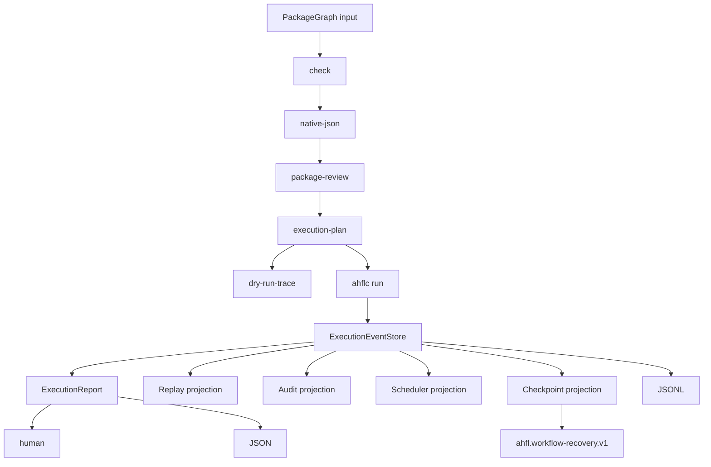

# AHFL 执行与包指南

本文说明如何把一个通过静态检查的 AHFL package 变成可演练、可运行、可审计的 workflow。
它覆盖 PackageGraph target、deterministic dry run、manifest run profile、provider/secret
配置、canonical runtime event、recovery 和发布证据边界。

本指南不把“运行成功一次”描述成生产就绪。真实运行的动态事实只来自
`WorkflowRuntime` 的 canonical event store；replay、audit、scheduler、checkpoint、
recovery 与 OTel projection 都从该事实派生，不通过公开 proxy artifact 命令串联。
Package/workspace/sysroot 规则见 [Package Usage](./project-usage.zh.md)，命令选择见
[CLI 工作流](./user-guide-cli.zh.md)，effect/formal/release evidence 见
[保障与生产证据指南](./user-guide-assurance.zh.md)。

## 执行链路


```mermaid
flowchart TB
    PackageInput[PackageGraph input] --> Check[check]
    Check --> Native[native-json]
    Native --> Package[package-review]
    Package --> Plan[execution-plan]
    Plan --> Trace[dry-run-trace]
    Plan --> Runtime[ahflc run]
    Runtime --> Events[ExecutionEventStore]
    Events --> Report[ExecutionReport]
    Events --> Replay[Replay projection]
    Events --> Audit[Audit projection]
    Events --> Scheduler[Scheduler projection]
    Events --> Checkpoint[Checkpoint projection]
    Checkpoint --> Recovery[ahfl.workflow-recovery.v1]
    Report --> Human[human]
    Report --> JSON[JSON]
    Events --> JSONL[JSONL]
```

静态 artifact 与动态事实分层：`ExecutionPlan` 描述待执行 DAG；`DryRunTrace` 是 mock
演练；真实运行只以 execution events 为事实源。任何 projection 都不能回头扫描源码、
解析 CLI 文本或依赖另一个 projection。

## 推荐执行路径

对于新的 package，先走这条路径，再接入真实 provider：

1. `check`：确认 package、类型、Agent/flow/workflow 通过静态检查。
2. `dump package-graph`、`emit package-review`、`emit execution-plan`：确认 target、
   exports、DAG、node input reads 与 return read。
3. `emit dry-run-trace`：用 mock capability 演练而不调用外部系统。
4. 在 `ahfl.toml` 中定义 `[run]` 和可选 profile；为 provider 配置 secret handle。
5. `run --output-format jsonl`：验证真实 lifecycle、usage、retry/fallback 与 diagnostics。
6. 对高风险 effect，继续运行 `validate`、`verify` 和 release evidence gate。

## Package manifest 与 handoff target

AHFL 的公开工程配置入口是 `ahfl.toml`。Package 身份、module root、target、导出和依赖属于同一份 manifest；多 package 工程由 `ahfl.workspace.toml` 选择 member package。

最小 handoff target：

```toml
manifest_version = 1

[package]
name = "refund-audit"
version = "0.1.0"
edition = "2026"
kind = "application"

[module]
prefix = "refund_audit"
root = "src"

[exports]
modules = ["main"]

[targets.workflow]
kind = "handoff"
entry = "refund_audit::main::RefundAuditWorkflow"
exports = ["refund_audit::main::RefundAuditWorkflow"]

[dependencies]
std = { source = "sysroot" }
```

`[run]` 是运行配置，不是 handoff target 的替代品。它指定默认 target、输入、
LLM config、展示格式和 verbosity，使配置完整的 package 可以直接运行 `ahflc run`：

```toml
[run]
target = "workflow"
input = "inputs/high-severity.json"
llm_config = "llm_config.example.json"
output_format = "human"
verbosity = "normal"

[run.profiles.low-risk]
input = "inputs/low-risk.json"
output_format = "jsonl"
verbosity = "trace"
```

`--profile low-risk` 只覆盖它明确声明的字段；未声明字段回退到 `[run]`。优先级为：
**显式 CLI 参数 > profile 字段 > `[run]` 默认字段**。所有相对路径相对于
`ahfl.toml` 所在 package root 解析。

检查 package：

```bash
./build/dev/src/tooling/cli/ahflc check \
  --manifest tests/integration/package_graph_manifest/ahfl.toml \
  --target workflow \
  --sysroot .
```

查看 PackageGraph：

```bash
./build/dev/src/tooling/cli/ahflc dump package-graph \
  --manifest tests/integration/package_graph_manifest/ahfl.toml \
  --sysroot .
```

发射 native handoff package：

```bash
./build/dev/src/tooling/cli/ahflc emit native-json \
  --manifest tests/integration/package_graph_manifest/ahfl.toml \
  --target workflow \
  --sysroot .
```

Package authoring 的常见错误：

| 错误 | 含义 |
|------|------|
| unknown target entry | `targets.<name>.entry` 没有解析到 workflow 或 agent |
| wrong target kind | `targets.<name>.kind` 与 artifact 所需入口类型不一致 |
| unknown capability | target capability binding 引用了不存在的 capability |
| duplicate binding | 同一 capability 绑定重复或冲突 |
| invalid manifest | manifest 字段、类型、路径或 dependency 规则不满足 schema |

## Execution plan

`execution-plan` 是 runtime 与 deterministic dry run 的静态输入：

当前公开 PackageGraph 命令面覆盖 `check`、`dump package-graph`、`dump lockfile`、`fmt`、`emit native-json`、`package-review`、`execution-plan` 和 `dry-run-trace`。工程入口统一使用 `--manifest <ahfl.toml> --target <name>`，或 `--workspace <ahfl.workspace.toml> --package <name> --target <name>`。

你应该在 execution plan 中检查：

1. 目标 workflow 是否正确。
2. entry node 是否符合预期。
3. `after` 依赖是否形成正确 DAG。
4. 每个 node 的目标 agent、初始状态、终态和输入读取是否正确。
5. capability binding 是否落到正确 node。

## Mock capability dry run

Dry run 用 mock capability 结果演练 workflow，不调用真实外部系统。

Mock 文件示例：

```json
{
  "format_version": "ahfl.capability-mocks",
  "mocks": [
    {
      "capability_name": "lib::agents::Echo",
      "result_fixture": "fixture.echo.ok",
      "invocation_label": "echo-runtime"
    }
  ]
}
```

`dry-run-trace` 使用 PackageGraph handoff target 和 mock 文件共同生成 trace；不要通过旧 JSON descriptor 作为工程配置入口。

Dry-run trace 应重点看：

| 字段 | 说明 |
|------|------|
| `status` | workflow 是否 completed、failed 或 partial |
| `execution_order` | DAG 节点执行顺序 |
| `node_traces` | 每个 node 的目标 Agent、依赖、输入读取和 mock 结果 |
| `capability_bindings` | capability 是否绑定到预期 runtime key |
| `return_summary` | workflow 返回值来自哪里 |

## 运行期事件与投影

`ahflc run` 内部使用强类型数值 ID 和 flat event store。公开输出模式是同一运行事实的不同 renderer：

| 模式 | 输入 | 用途 |
|------|------|------|
| `human` | `ExecutionReport` | 默认业务摘要和节点状态 |
| `json` | `ExecutionReport` | `ahfl.run-report`，一次运行的机器报告 |
| `jsonl` | `ExecutionEventStore` | 每行 `ahfl.run-event`，按 event ID 输出完整事件流 |
| `quiet` | terminal status | 成功时只输出 final value JSON；失败使用退出码/stderr |

内部 projection 包括：

| Projection | 用途 |
|------------|------|
| replay | 重建每个节点的 scheduled / started / terminal / restored 状态 |
| audit | 统计事件族并验证 started/terminal invariant |
| scheduler | 计算 dependency satisfaction、completed prefix 和 next candidate |
| checkpoint | 计算 completed node value IDs 与 resume candidate |

这些 projection 都从 `WorkflowResult.events` 构造，不是公开的独立 `emit` 产品面。
自动化应消费 JSON/JSONL；不得解析 human 文本、旧 observability flag 或平行
provider artifact。

### 为人和程序选择正确输出

| 场景 | 格式 | 消费方式 |
|---|---|---|
| 交互式排查 | `human` | 读取 workflow、step、result 和简化 usage 摘要 |
| 一次运行的 CI 汇总 | `json` | 读取 `ahfl.run-report` 中的 run、node、usage、replay、audit |
| 审计、失败定位、下游事件处理 | `jsonl --verbosity trace` | 逐行消费 `ahfl.run-event` |
| Unix pipeline 只需要最终值 | `quiet` | 成功时只读取 final value JSON；失败依赖 exit code/stderr |

JSONL 每行包含 `schema: "ahfl.run-event"`、`event_id`、`type`、
`monotonic_offset_ns` 和 `payload`。常见 type：

```text
run_started
workflow_started
node_scheduled
node_started
capability_started
capability_usage_recorded
capability_completed | capability_failed
capability_retry_scheduled
provider_degraded
checkpoint_saved
node_completed | node_failed | node_skipped | node_restored
workflow_completed | workflow_failed
run_completed
```

机器消费者至少验证：event ID/offset 有序；每个 started run/workflow/node/capability
有唯一 terminal；同一 capability invocation 的 usage 位于 start 与 terminal 之间且最多
一条。失败事件会 materialize `DiagnosticId` 对应的 code、message、range、position 和
related notes。

## 真实 LLM 执行

`ahflc run` 使用 OpenAI-compatible LLM Provider 执行 workflow。它需要：

1. 已通过 `check` 的源码或 package。
2. manifest `[run]` / `[run.profiles.<name>]`，或显式 `--workflow`。
3. profile input、`--input-file` 或 `--input`。
4. profile LLM 配置或 `--llm-config <path>`。
5. 可选的 `--capability-mocks <path>`，用于把 deterministic capability mock 暴露为 LLM function tools。
6. 可选的 `--tool-catalog <path>`，用于把 deterministic runtime tool catalog 暴露为 LLM function tools。
7. 可选的 `--capability-bindings <path>`，用于把 workflow capability 调用直接绑定到 HTTP 或 gRPC JSON transcoding runtime transport。
8. `--output-format human|json|jsonl|quiet` 与 `--verbosity normal|verbose|trace`。

`--input` 必须是 AHFL runtime JSON，并且必须匹配目标 workflow 的 input schema。Struct 输入需要 `_type`，enum 字段需要 `_enum` 和 `_variant`。`run` 会在调用 LLM provider 前拒绝缺字段、额外字段、字段类型错误、struct/enum 名称不匹配和未知 enum variant。

配置文件字段：

```json
{
  "endpoint": "https://api.example.com/v1",
  "model": "example-model",
  "api_key_secret": "env:AHFL_LLM_API_KEY",
  "auth_scheme": "bearer",
  "auth_header": "Authorization",
  "temperature": 0.1,
  "max_tokens": 1024,
  "max_prompt_tokens": 3072,
  "max_total_tokens": 4096,
  "prompt_token_cost_per_million": 0.25,
  "completion_token_cost_per_million": 1.25,
  "max_total_cost_usd": 0.01,
  "max_workflow_total_tokens": 12000,
  "max_node_total_tokens": 8000,
  "max_workflow_total_cost_usd": 0.05,
  "max_node_total_cost_usd": 0.02,
  "token_budget_policy": "fail",
  "capability_token_budgets": [
    {
      "capability": "support::ClassifyTicket",
      "max_tokens": 512,
      "max_prompt_tokens": 2048,
      "max_total_tokens": 3072,
      "max_total_cost_usd": 0.005,
      "policy": "warn"
    }
  ],
  "json_mode": true,
  "stream": false,
  "timeout_seconds": 30,
  "max_retries": 2,
  "response_cache_enabled": false,
  "response_cache_max_entries": 128,
  "response_cache_ttl_seconds": 300,
  "response_cache_path": ".ahfl/cache/llm-response-cache.json",
  "refresh_secrets_before_use": false,
  "secret_providers": [
    {
      "kind": "env",
      "prefix": "env",
      "default_for_unqualified": true
    },
    {
      "kind": "vault",
      "prefix": "vault",
      "address": "https://vault.example.com",
      "token_env": "AHFL_VAULT_TOKEN",
      "mount_path": "kv",
      "timeout_seconds": 5
    },
    {
      "kind": "cloud",
      "prefix": "cloud",
      "address": "https://secrets.example.com",
      "token_env": "AHFL_CLOUD_SECRET_TOKEN",
      "project": "agent-prod",
      "version": "latest",
      "timeout_seconds": 5
    }
  ],
  "tool_choice": "auto",
  "max_tool_rounds": 5,
  "fallback_providers": [
    {
      "name": "backup",
      "endpoint": "https://backup.example.com/v1",
      "model": "backup-model",
      "api_key_secret": "AHFL_BACKUP_LLM_API_KEY",
      "auth_scheme": "api_key_header",
      "auth_header": "x-api-key",
      "priority": 10
    }
  ]
}
```

`endpoint`、`model` 必填。认证信息推荐使用 `api_key_secret`；裸 handle（例如
`AHFL_LLM_API_KEY`）仅作为兼容路径，并由默认 secret provider 解析。显式 handle 可以
写成 `env:AHFL_LLM_API_KEY`、`vault:llm/api-key` 或 `cloud:llm/api-key`。
`secret_providers` 定义 `env`、`vault`、`cloud` 链；secret 缺失、provider prefix
未配置、认证失败、404、超时或空值都会在调用 LLM endpoint 前 fail closed。
`refresh_secrets_before_use: true` 会在解析 `api_key_secret`、`oauth2_token_secret`
和 mTLS secret handle 前请求 provider refresh。`api_key` 仍可兼容使用，但不应把明文
写入配置或仓库。字符串中的 `${ENV_VAR}` 会展开，仍不替代 secret handle。

`auth_scheme` 支持 `bearer`、`api_key_header`、`oauth2_bearer`、
`oauth2_client_credentials` 与 `mtls`。前四种最终写入 HTTP header；OAuth2 名称表示
从 `oauth2_token_secret` 解析可用 access token，当前 runtime 不替你执行 OAuth grant。
`mtls` 需要 client certificate 与 key 的 path 或 secret handle。fallback provider 可
覆盖 auth/credential；未声明的字段从主 provider 继承。

预算字段会在 `run` 启动时校验：`max_tokens` 是单次响应 token 上限，`max_prompt_tokens` 是单次 prompt 上限，`max_total_tokens` 必须覆盖单次 prompt 与响应预算。`capability_token_budgets` 可按 capability 名覆盖这三个 token 上限、`max_total_cost_usd` 和 `policy`；未覆盖字段继承全局配置。Provider 发起请求前会按有效预算裁剪 user prompt；如果 system prompt 单独耗尽预算，则 capability 调用失败并产生 `runtime.LLM_PROMPT_BUDGET_REJECTED` 诊断。`max_workflow_total_tokens` / `max_workflow_total_cost_usd` 定义单次 `ahflc run` 中同一 workflow 的累计 token/cost 上限；`max_node_total_tokens` / `max_node_total_cost_usd` 定义同一 workflow node 的累计上限；值为 `0` 表示关闭对应累计预算。Runtime 会把 workflow 名、node 名、agent 名、state 名和 node execution index 传入 LLM provider，使累计扣减按 workflow 和 node 分账。

Provider 内部会计算 prompt、usage、cost 和累计预算。OpenAI-compatible 响应中的 token/cost 结果通过 `CapabilityUsageRecorded` 进入 canonical event store；`CapabilityCompleted.cache_hit` 表达 cache outcome；warn policy 作为 usage event 的 stable code/message notice，并在 call-site 产生带 `SourceRange` 的 warning。`token_budget_policy: "fail"` 不再在 workflow 完成后由 CLI 二次判定，而是直接返回 `BudgetRejected`，形成 `CapabilityFailed -> NodeFailed -> WorkflowFailed -> RunCompleted(failed)`。`token_budget_policy: "warn"` 保持 capability 成功。`prompt_token_cost_per_million` 和 `completion_token_cost_per_million` 是可选成本估算费率，必须为非负数。

`fallback_providers` 可配置 OpenAI-compatible 备用 provider。主 provider 在 HTTP 失败并耗尽自身重试后，runtime 会按 fallback `priority` 从高到低继续尝试。fallback selection 通过 invocation-scoped `ProviderDegraded` 进入 canonical event store；fallback exhaustion 通过正常 capability failure lifecycle fail closed。fallback provider 同样支持 `api_key_secret`，缺失或为空会在 `run` 启动阶段失败。

机器消费者使用 `--output-format jsonl --verbosity trace` 并重定向 stdout。JSONL 中的 `CapabilityStarted`、`CapabilityUsageRecorded`、`CapabilityCompleted` / `CapabilityFailed`、`ProviderDegraded` 共享 invocation ID；失败 event 会按 numeric `DiagnosticId` materialize code、message、range、position 和 related notes。仓库不再提供平行的 provider observability artifact。

`stream: true` 会请求 OpenAI-compatible streaming response，并把 SSE `data:` chunks 合成为最终 response content 后再进入 AHFL return type 解析。stream 必须以 `data: [DONE]` 完成；HTTP 成功但 SSE 未完成会作为 interruption-class capability failure，不会把部分 content 当成成功结果继续解析。chunk-level provider instrumentation 目前只用于 provider 内部测试，不是公开 runtime artifact。

`response_cache_enabled: true` 会启用 LRU response cache。cache key 由 key version、模型名、system prompt 和 user prompt 派生，但只落盘 `key_fingerprint`，不会把 prompt 或 secret value 写入 cache key；`response_cache_max_entries` 控制容量，`response_cache_ttl_seconds` 控制 TTL。cache 只作用于非 tool-calling 路径，并且只在 LLM response 成功解析为 AHFL return type 后写入；命中时不会再次发起 HTTP。设置 `response_cache_path` 后，provider 会用 `ahfl.llm_response_cache` snapshot 在进程间持久化非过期 entry，并用 `key_version` 作为跨版本迁移边界；未设置时只使用进程内缓存。snapshot 会保存已解析的 LLM response content，因此该文件不应放入源码仓库，也应按运行产物权限管理。公开运行证据通过 `CapabilityCompleted.cache_hit` 和外部请求计数证明 cache/dedupe；snapshot 内部 audit 不形成第二套 runtime fact source。

`--capability-mocks` 使用与 mock dry run 相同的 `ahfl.capability-mocks` 文件。`run` 会把每个 mock selector 暴露为 OpenAI-compatible function tool：tool 名称以 `ahfl_` 开头，selector 中非字母、数字、`_`、`-` 的字符会替换为 `_`，超长名称会附加稳定 hash 后截断。LLM 发起 tool call 后，runtime 通过独立 `CapabilityRegistry` 返回 mock 的 `result_fixture`；这适合 deterministic 本地联调。mock-backed CLI 路径已对 invalid args 和 unknown tool fail closed。

`--tool-catalog` 使用 `ahfl.llm_tool_catalog` 文件，把 deterministic runtime tool catalog 暴露为 OpenAI-compatible function tools。每个 tool 需要 `name`、可选 `description`、可选 `parameters` 或 `params_schema_json` JSON object，并且必须在 `result` AHFL value JSON 与 `failure` object 中二选一。`failure.kind` 支持 `error` 和 `timeout`；`error` 需要 `message`，`timeout` 需要正整数 `timeout_ms` 并可选 `message`。LLM 发起 tool call 后，runtime 解析 arguments JSON、调用 catalog tool，并把 `result` 作为 tool message 返回 provider；catalog schema negative、catalog-specific invalid args/unknown tool、tool timeout 和 tool failure 都会 fail closed。

`--capability-bindings` 使用 `ahfl.runtime_capability_bindings` 文件，把指定 capability 直接注册到 runtime `CapabilityRegistry`。已注册 capability 优先走 binding；未注册 capability 仍按现有 LLM provider 路径执行。HTTP binding 需要 `url`，可选 `method`、`headers`、`timeout_ms`、`retry`、`circuit_breaker` 和 `auth`；gRPC JSON transcoding binding 使用 `transport: "grpc_json_transcoding"`，需要 `endpoint`、`service` 和 `method`。`auth.scheme` 支持 `none`、`bearer`、`oauth2_client_credentials` 和 `mtls`，secret key 会复用 `--llm-config` 中配置的 secret provider 链解析。binding 响应必须是 AHFL value JSON，并会按 capability 返回类型做 schema 校验；HTTP/gRPC timeout、retry exhaustion、schema mismatch 和 malformed JSON 会通过 workflow runtime 诊断 fail closed。

最小 catalog 示例：

```json
{
  "schema": "ahfl.llm_tool_catalog",
  "tools": [
    {
      "name": "lookup_context",
      "description": "Return deterministic context",
      "parameters": {
        "type": "object",
        "additionalProperties": true
      },
      "result": {
        "value": "catalog-context"
      }
    }
  ]
}
```

运行示例：

```bash
./build/dev/src/tooling/cli/ahflc run \
  --workflow app::main::ValueFlowWorkflow \
  --input '{"_type":"lib::types::Request","value":"hello"}' \
  --llm-config ~/.ahfl/llm_config.json \
  --output-format jsonl \
  --verbosity trace \
  --tool-catalog ./tool-catalog.json \
  --capability-bindings ./runtime-bindings.json \
  --capability-mocks tests/golden/dry_run/project_workflow_value_flow.mocks.json \
  <input.ahfl> > /tmp/ahfl-run-events.jsonl
```

`run` 会在以下场景拒绝执行：

| 场景 | 结果 |
|------|------|
| manifest/profile 和 CLI 都无法选择 workflow | 参数错误 |
| profile、`--input-file` 和 `--input` 都未提供输入 | 参数错误 |
| 配置文件不存在 | 执行失败 |
| `endpoint` / `model` 缺失 | 执行失败 |
| `max_prompt_tokens + max_tokens > max_total_tokens` | 执行失败 |
| token cost 费率或累计 token/cost 预算为负数 | 执行失败 |
| `token_budget_policy` 不是 `fail` / `warn` | 执行失败 |
| `capability_token_budgets` 中 capability 为空、重复、预算非法或 policy 非法 | 执行失败 |
| `api_key_secret` 指向的 secret handle 缺失、provider prefix 未配置或解析为空 | 执行失败 |
| Vault secret provider 未提供 `token` 或 `token_env` | 执行失败 |
| fallback provider 的 credential 无法解析 | 执行失败 |
| 非 mTLS provider 未提供 `api_key_secret`、`oauth2_token_secret` 或兼容 `api_key` | 执行失败 |
| `auth_scheme` 不属于支持集合 | 执行失败 |
| 非 mTLS authentication 未能解析有效 auth header | 执行失败 |
| mTLS 缺少 client certificate 或 private key | 执行失败 |
| streaming response 缺少 `data: [DONE]` | 执行失败 |
| `response_cache_enabled` 为 true 但 cache 容量或 TTL 非正数 | 执行失败 |
| 设置了 `response_cache_path` 但 `response_cache_enabled` 不是 true | 执行失败 |
| `--capability-mocks` 文件不存在或格式非法 | 执行失败 |
| capability mock selector 映射到重复 tool 名称 | 执行失败 |
| `--tool-catalog` 文件不存在、schema 不支持或 tool 定义非法 | 执行失败 |
| `--tool-catalog` 与 `--capability-mocks` 产生重复 tool 名称 | 执行失败 |
| `--capability-bindings` 文件不存在、schema 不支持、capability 未声明或 transport 配置非法 | 执行失败 |
| `--capability-bindings` 指向的 HTTP/gRPC runtime 调用失败或响应不匹配 capability 返回类型 | 执行失败 |
| `--input` 不是合法 JSON | 执行失败 |
| `--input` 与 workflow input schema 不匹配 | 执行失败 |
| workflow 运行失败或产生 runtime error | 非零退出 |

## Crash / Resume

当前恢复 schema 是 `ahfl.workflow-recovery.v1`。runtime 在 checkpoint 时从 canonical events 计算 completed nodes，再从 value store materialize 深拷贝 snapshot。保存使用 atomic replace；损坏 schema、部分写入或未知 ID 会 fail closed。

恢复时：

1. 读取并验证 snapshot。
2. 发出 `RunResumed`。
3. 对已完成节点发出 `NodeRestored`。
4. scheduler projection 计算 resume candidate。
5. 只执行未完成节点，避免重复 capability side effect。

端到端证据由 `tests/scripts/reference_workflow_recovery_smoke.py` 覆盖本地 HTTP provider、`SIGKILL`、人工批准、partial temp file 和副作用去重。

## 从运行到交付证据

开发者的 `run`、dry run 或 recovery smoke 证明的是具体路径；它们不自动带来 beta 或
production-ready 结论。发布前必须区分三层证据：

| 层级 | 主证据 | 运行位置 | 结论边界 |
|---|---|---|---|
| Beta | `beta-gate` 的 10 项 revision-bound evidence | 本地或 CI 可重建 | 当前 verified beta surface |
| Controlled pilot | 30 秒 / 至少 12 次 reference workflow、fault matrix、recovery、OTel、budget | 受控测试环境 | 受控试点，不代表生产 |
| Production confidence | 3600 秒 single-long-lived-worker、RSS/allocator、provider retry | **仅**专用 GitHub Actions workflow | 当前 revision 的长稳信心，不等于真实部署生产就绪 |

production-confidence `hour-scale` harness 是 CI-only。开发机调用
`--contract-kind hour-scale` 会在创建目录或启动 worker 前立即失败；本地仅运行短
smoke，并可使用 checker 读取已经下载的 evidence。正式 v2 evidence 必须带匹配
repository、workflow、event、job、run ID、runner 和 commit SHA 的 GitHub Actions
provenance。

完整 gate 命令、stale evidence 和发布清单见
[保障与生产证据指南](./user-guide-assurance.zh.md)。native gRPC / Protobuf transport
仍不是当前 runtime 产品能力；`grpc_json_transcoding` binding 只是 HTTP/JSON 边界。
