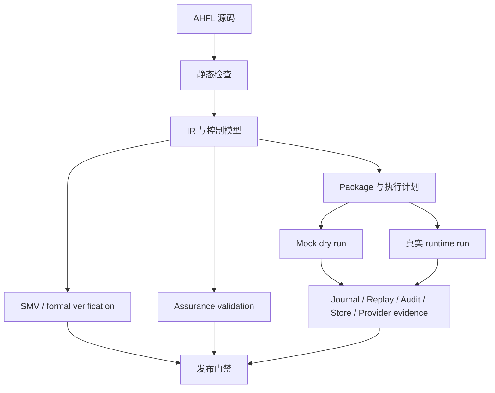

# AHFL 用户指南总览 V0.1

本文是 AHFL 用户向文档系列入口，面向想用 AHFL 描述、检查、审计和执行 Agent 工作流的读者。本文不替代语言规范；语法和静态语义以 [core-language-v0.1.zh.md](../spec/core-language-v0.1.zh.md) 为准。

## 适用读者

| 读者 | 关心的问题 | 推荐路径 |
|------|------------|----------|
| Workflow 作者 | 如何把业务流程写成 `.ahfl` 文件 | 本文 -> [建模指南](./user-guide-authoring-v0.1.zh.md) -> [CLI 工作流](./user-guide-cli-v0.1.zh.md) |
| 平台工程师 | 如何把 AHFL 接入构建、审计、运行与 Provider 准入 | 本文 -> [执行与包指南](./user-guide-execution-v0.1.zh.md) -> [保障与生产证据指南](./user-guide-assurance-v0.1.zh.md) |
| 风控 / 审计 / 发布负责人 | 如何在执行前看见 Agent 行为、外部调用和准入证据 | 本文 -> [保障与生产证据指南](./user-guide-assurance-v0.1.zh.md) |
| 编译器使用者 | 命令怎么跑、输入怎么组织、输出看什么 | 本文 -> [CLI 工作流](./user-guide-cli-v0.1.zh.md) |

## 产品定位

AHFL 是 Agent 控制平面 DSL。它的核心目标是让 Agent 工作流在真实执行前具备以下性质：

1. **结构可见**：Agent 的状态、转移、可调用 capability、workflow DAG 依赖都写在源码里。
2. **类型可查**：输入、输出、上下文、capability 参数和返回值都经过静态检查。
3. **行为可约束**：`requires`、`ensures`、`invariant`、`forbid` 描述执行前后的控制要求。
4. **执行可演练**：编译器能输出 package、execution plan、dry-run trace、journal、replay、audit 等 machine artifact。
5. **上线可审计**：assurance、formal、durable-store、provider readiness artifact 构成发布前证据链。
6. **真实执行可控**：`ahflc run` 通过 OpenAI-compatible LLM Provider 配置执行 workflow，并在配置缺失或输入非法时 fail closed。

AHFL 不把外部工具实现、数据库写入、支付网关或 LLM 服务本身纳入 DSL 源码；这些能力通过 capability 边界、运行时配置和 Provider 证据链接入。

## 端到端心智模型



最小工作流通常是：

1. 写 `.ahfl`：定义数据结构、capability、agent、contract、flow、workflow。
2. 运行 `ahflc check`：确认源码可以解析、命名解析、类型检查和验证。
3. 运行 `ahflc dump` 或 `ahflc emit summary`：确认编译器看到的结构符合预期。
4. 对稳定项目添加 `ahfl.project.json` 和 `ahfl.package.json`。
5. 运行 `ahflc emit package-review` 和 `ahflc emit execution-plan`：确认 package 与 workflow DAG。
6. 用 mock capability 运行 `ahflc emit dry-run-trace`、journal、replay、audit。
7. 用 `ahflc validate`、`ahflc verify` 和 provider evidence 命令进入发布门禁。
8. 准备 LLM Provider 配置后，用 `ahflc run` 执行真实 workflow。

## 功能总览

| 功能 | 解决的问题 | 入口命令 / 文件 | 详细指南 |
|------|------------|-----------------|----------|
| 强类型数据建模 | 明确 workflow 输入、输出、上下文和 capability 数据形状 | `struct`、`enum`、`type`、`const` | [建模指南](./user-guide-authoring-v0.1.zh.md) |
| Capability 边界 | 把外部效果声明成受控调用点 | `capability X(...) -> Y;` | [建模指南](./user-guide-authoring-v0.1.zh.md) |
| 纯谓词 | 在 contract 中表达无副作用检查 | `predicate X(...) -> Bool;` | [建模指南](./user-guide-authoring-v0.1.zh.md) |
| Agent 状态机 | 描述单个 Agent 的生命周期、状态转移和可用 capability | `agent`、`flow for` | [建模指南](./user-guide-authoring-v0.1.zh.md) |
| 行为契约 | 在执行前声明前置、后置、不变量和禁止行为 | `contract for` | [建模指南](./user-guide-authoring-v0.1.zh.md) |
| Workflow DAG | 编排多个 Agent 节点和依赖关系 | `workflow`、`node`、`after`、`return` | [建模指南](./user-guide-authoring-v0.1.zh.md) |
| 单文件编译 | 快速检查一个 `.ahfl` 文件 | `ahflc check <file.ahfl>` | [CLI 工作流](./user-guide-cli-v0.1.zh.md) |
| 多文件项目 | 稳定组织入口源码、搜索根和 workspace | `ahfl.project.json`、`ahfl.workspace.json` | [CLI 工作流](./user-guide-cli-v0.1.zh.md) |
| 结构诊断 | 查看 AST、类型环境和 source graph | `ahflc dump ast|types|project` | [CLI 工作流](./user-guide-cli-v0.1.zh.md) |
| Artifact 发射 | 输出 IR、native JSON、execution plan、summary 等 | `ahflc emit <artifact>` | [CLI 工作流](./user-guide-cli-v0.1.zh.md) |
| Package authoring | 声明包身份、入口、导出目标和 capability binding | `ahfl.package.json` | [执行与包指南](./user-guide-execution-v0.1.zh.md) |
| Mock dry run | 在无真实 Provider 时演练 workflow 执行顺序和 capability 结果 | `ahflc emit dry-run-trace` | [执行与包指南](./user-guide-execution-v0.1.zh.md) |
| Runtime run | 使用 OpenAI-compatible LLM Provider 执行 workflow | `ahflc run --workflow ... --input ...` | [执行与包指南](./user-guide-execution-v0.1.zh.md) |
| Assurance gate | 检查 capability effect、幂等、回执、审批和补偿事实 | `ahflc validate` | [保障与生产证据指南](./user-guide-assurance-v0.1.zh.md) |
| Formal verification | 通过 NuSMV / nuXmv 验证有限控制模型 | `ahflc verify` | [保障与生产证据指南](./user-guide-assurance-v0.1.zh.md) |
| Durable store / Provider evidence | 生成持久化、导出、store import、provider readiness 证据 | `ahflc emit store/...`、`ahflc emit-provider-artifact ...` | [保障与生产证据指南](./user-guide-assurance-v0.1.zh.md) |

## 快速开始

先构建当前 checkout：

```bash
cmake --preset dev
cmake --build --preset build-dev
```

检查示例源码：

```bash
./build/dev/src/tooling/cli/ahflc check examples/refund_audit_core_v0_1.ahfl
```

查看编译器摘要：

```bash
./build/dev/src/tooling/cli/ahflc emit summary examples/refund_audit_core_v0_1.ahfl
```

生成形式化模型：

```bash
./build/dev/src/tooling/cli/ahflc emit smv examples/refund_audit_core_v0_1.ahfl
```

查看命令帮助：

```bash
./build/dev/src/tooling/cli/ahflc --help
```

## 系列文档

| 文档 | 内容 |
|------|------|
| [user-guide-authoring-v0.1.zh.md](./user-guide-authoring-v0.1.zh.md) | 如何写 `.ahfl` 源码，包括类型、capability、agent、contract、flow 和 workflow |
| [user-guide-cli-v0.1.zh.md](./user-guide-cli-v0.1.zh.md) | 当前 CLI 命令、输入模式、常用 artifact 和诊断方法 |
| [user-guide-execution-v0.1.zh.md](./user-guide-execution-v0.1.zh.md) | Project / package authoring、dry run、runtime artifact、真实 LLM 执行 |
| [user-guide-assurance-v0.1.zh.md](./user-guide-assurance-v0.1.zh.md) | Assurance、formal verification、durable-store、Provider 生产证据链 |

## 与其他文档的关系

- 语言事实以 [core-language-v0.1.zh.md](../spec/core-language-v0.1.zh.md) 为准。
- Assurance 规则以 [assurance-v0.1.zh.md](../spec/assurance-v0.1.zh.md) 为准。
- CLI 历史版本细节可查 [cli-commands-v0.11.zh.md](./cli-commands-v0.11.zh.md)，但本文系列以当前 `ahflc --help` 的命令形态为准。
- Durable store 和 provider 贡献者细节可查 [durable-store-import-reference-v0.1.zh.md](./durable-store-import-reference-v0.1.zh.md)。
